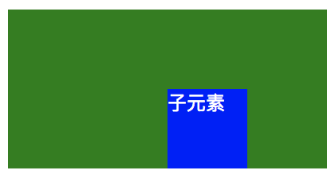
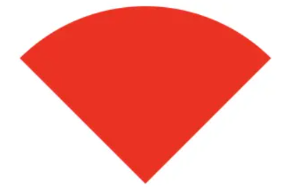

### CSS（层叠样式表）

#### css引用优先级（4种）

1.就近原则

2.理论上：行内>内嵌>链接>导入

3.实际上：内嵌、链接、导入在同一个文件头部，谁离相应的代码近，谁的优先级高.

如果同一个css定义分布在两个css文件中，那么样式取后引入的css文件。

最好将第三方组件的css放在html靠前位置，自定义的css放到html后面位置。

1、行内方式

```html
<a style="font-size:40px;color:#000000">靠谱学院</a>
```

2、内嵌方式

```html
<head>
    <style type="text/css">
        a{
            font-size:40px;
            color:#000000;
        }
    </style>
</head>

<body>
    <a>靠谱学院</a>
</body>
```

```html
<head>
    <style type="text/css">
        *{        //代表后面所有标签应用这种格式
            font-size:40px;
            color:#000000;
        }
    </style>
</head>
```

3、链接方式

引用外部样式时需要执行以下操作：

```html
<head>
    <link rel="stylesheet" type="text/css" href="文件名.css">
</head>
```

4.导入方式.

```html
<style>
    @import url(style.css);
</style>
```

我们应尽量使用 **<link>** 标签导入外部 CSS 文件，避免或者少用使用其他三种方式。


#### link标签与import标签区别

- link 属于 HTML，通过 **<link>** 标签中的 href 属性来引入外部文件，而 **@import** 属于 CSS，所以导入语句应写在 CSS 中，要注意的是**导入语句应写在样式表的开头**，否则无法正确导入外部文件；

- 页面被加载时，link会同时被加载，而@import引用的css会等到页面加载结束后加载。

- link是html标签，因此没有兼容性，而@import只有IE5以上才能识别。

- link方式样式的权重高于@import的。

- link支持使用Javascript控制DOM去改变样式；而@import不支持。


------

- **link**：浏览器会派发一个新等线程(HTTP线程)去加载资源文件，与此同时GUI渲染线程会继续向下渲染代码
- **@import**：GUI渲染线程会暂时停止渲染，去服务器加载资源文件，资源文件没有返回之前不会继续渲染(阻碍浏览器渲染)
- **style**：GUI直接渲染

外部样式如果长时间没有加载完毕，浏览器为了用户体验，会使用浏览器会默认样式，确保首次渲染的速度。所以CSS一般写在headr中，让浏览器尽快发送请求去获取css样式。

所以，在开发过程中，导入外部样式**使用link，而不用@import**。如果css少，尽可能采用内嵌样式，直接写在style标签中。


#### CSS3新属性

CSS3边框如border-radius，box-shadow等；

CSS3背景如background-size，background-origin等；

CSS3 2D，3D转换如transform等；

在布局方面新增了flex布局;

在选择器方面新增了例如first-of-type,nth-child等选择器;

在盒模型方面添加了box-sizing来改变盒模型;

在颜色方面添加透明，rbga等;

媒体查讯

CSS3动画如animation等。


#### css语义化命名及常用命名规则

CSS的命名方式：

1、**结构化命名法**；（根据位置命名）

2、**语义化命名法**。 ( 根据功能命名 )

```
结构化命名法：
根据页面中板块的位置而命名，如上图中的content-left,这时如果我们想把侧边栏sidebar放在左边，那么这时content-left板块却在右边，板块位置与其命名完全不符，那么我们这时就要修改页面中的以及CSS样式中的选择器名字了，这样会很不方便，尤其是当页面结构复杂时，一会儿left,一会儿right，这样会很不容易维护。

语义化命名法：
根据页面中模块的功能而命名，如页面头部header、导航栏nav、主体main、侧边栏sidebar、底部footer、新闻列表newsList等等，这样整个页面看起来就比较清晰了，维护起来也比较方便。

命名讲求的就是见名知义，并且还要注意避免命名冲突，尤其是一个项目由多个人完成时，对于这个问题我们可以通过在命名前面加组员代号或姓名简称来解决，具体还应根据不同团队的规范来实施。

常用的CSS文件命名规则
主要的：main.css
模块：module.css
基本共用：base.css
布局，版面：layout.css
主题：themes.css
专栏：columns.css
文字：font.css
表单：forms.css
补丁：mend.css
打印：print.css
```


#### CSS样式优先级

| **选择器**     | **格式**      | **优先级权重** |
| -------------- | ------------- | -------------- |
| id选择器       | #id           | 100            |
| 类选择器       | .classname    | 10             |
| 属性选择器     | a[ref=“eee”]  | 10             |
| 伪类选择器     | li:last-child | 10             |
| 标签选择器     | div           | 1              |
| 伪元素选择器   | li:after      | 1              |
| 相邻兄弟选择器 | h1+p          | 0              |
| 子选择器       | ul>li         | 0              |
| 后代选择器     | li a          | 0              |
| 通配符选择器   | *             | 0              |

**优先级关系：内联样式 > ID 选择器 > 类选择器 = 属性选择器 = 伪类选择器 > 标签选择器 = 伪元素选择器**

1.优先级最高的-!important

```html
<style>
    div{
        color: blue!important;
    }
</style>
```

2.行内样式（会导致回流，最好用class)

```html
<body>
    <div id="text" style="color: blue;">
        111
    </div>
</body>
```

3. ID选择器

```css
#text {
    color: blue;
}
```

4.类选择器

```css
.text {
    color: blue;
}
```

5.标签

```css
div p span {
    color: blue;
}
```

当一个标签同时被多个选择符选中，我们便需要确定这些选择符的优先级。我们有如下规则：

计算选择符中 ID 选择器的个数（a），计算选择符中类选择器、属性选择器以及伪类选择器的个数之和（b），计算选择符中标签选择器和伪元素选择器的个数之和（c）。按 a、b、c 的顺序依次比较大小，大的则优先级高，相等则比较下一个。若最后两个的选择符中 a、b、c 都相等，则按照"就近原则"来判断。


#### css初始化

目的：消除不同浏览器对HTML文本呈现的差异（Github上引用次数最多的necolas的通用浏览器初始化）

```css
/* Document
   ========================================================================== */

/**
 * 1. Correct the line height in all browsers.
 * 2. Prevent adjustments of font size after orientation changes in iOS.
 */

html {
  line-height: 1.15; /* 1 */
  -webkit-text-size-adjust: 100%; /* 2 */
}

/* Sections
   ========================================================================== */

/**
 * Remove the margin in all browsers.
 */

body {
  margin: 0;
}

/**
 * Render the `main` element consistently in IE.
 */

main {
  display: block;
}

/**
 * Correct the font size and margin on `h1` elements within `section` and
 * `article` contexts in Chrome, Firefox, and Safari.
 */

h1 {
  font-size: 2em;
  margin: 0.67em 0;
}

/* Grouping content
   ========================================================================== */

/**
 * 1. Add the correct box sizing in Firefox.
 * 2. Show the overflow in Edge and IE.
 */

hr {
  box-sizing: content-box; /* 1 */
  height: 0; /* 1 */
  overflow: visible; /* 2 */
}

/**
 * 1. Correct the inheritance and scaling of font size in all browsers.
 * 2. Correct the odd `em` font sizing in all browsers.
 */

pre {
  font-family: monospace, monospace; /* 1 */
  font-size: 1em; /* 2 */
}

/* Text-level semantics
   ========================================================================== */

/**
 * Remove the gray background on active links in IE 10.
 */

a {
  background-color: transparent;
}

/**
 * 1. Remove the bottom border in Chrome 57-
 * 2. Add the correct text decoration in Chrome, Edge, IE, Opera, and Safari.
 */

abbr[title] {
  border-bottom: none; /* 1 */
  text-decoration: underline; /* 2 */
  text-decoration: underline dotted; /* 2 */
}

/**
 * Add the correct font weight in Chrome, Edge, and Safari.
 */

b,
strong {
  font-weight: bolder;
}

/**
 * 1. Correct the inheritance and scaling of font size in all browsers.
 * 2. Correct the odd `em` font sizing in all browsers.
 */

code,
kbd,
samp {
  font-family: monospace, monospace; /* 1 */
  font-size: 1em; /* 2 */
}

/**
 * Add the correct font size in all browsers.
 */

small {
  font-size: 80%;
}

/**
 * Prevent `sub` and `sup` elements from affecting the line height in
 * all browsers.
 */

sub,
sup {
  font-size: 75%;
  line-height: 0;
  position: relative;
  vertical-align: baseline;
}

sub {
  bottom: -0.25em;
}

sup {
  top: -0.5em;
}

/* Embedded content
   ========================================================================== */

/**
 * Remove the border on images inside links in IE 10.
 */

img {
  border-style: none;
}

/* Forms
   ========================================================================== */

/**
 * 1. Change the font styles in all browsers.
 * 2. Remove the margin in Firefox and Safari.
 */

button,
input,
optgroup,
select,
textarea {
  font-family: inherit; /* 1 */
  font-size: 100%; /* 1 */
  line-height: 1.15; /* 1 */
  margin: 0; /* 2 */
}

/**
 * Show the overflow in IE.
 * 1. Show the overflow in Edge.
 */

button,
input { /* 1 */
  overflow: visible;
}

/**
 * Remove the inheritance of text transform in Edge, Firefox, and IE.
 * 1. Remove the inheritance of text transform in Firefox.
 */

button,
select { /* 1 */
  text-transform: none;
}

/**
 * Correct the inability to style clickable types in iOS and Safari.
 */

button,
[type="button"],
[type="reset"],
[type="submit"] {
  -webkit-appearance: button;
}

/**
 * Remove the inner border and padding in Firefox.
 */

button::-moz-focus-inner,
[type="button"]::-moz-focus-inner,
[type="reset"]::-moz-focus-inner,
[type="submit"]::-moz-focus-inner {
  border-style: none;
  padding: 0;
}

/**
 * Restore the focus styles unset by the previous rule.
 */

button:-moz-focusring,
[type="button"]:-moz-focusring,
[type="reset"]:-moz-focusring,
[type="submit"]:-moz-focusring {
  outline: 1px dotted ButtonText;
}

/**
 * Correct the padding in Firefox.
 */

fieldset {
  padding: 0.35em 0.75em 0.625em;
}

/**
 * 1. Correct the text wrapping in Edge and IE.
 * 2. Correct the color inheritance from `fieldset` elements in IE.
 * 3. Remove the padding so developers are not caught out when they zero out
 *    `fieldset` elements in all browsers.
 */

legend {
  box-sizing: border-box; /* 1 */
  color: inherit; /* 2 */
  display: table; /* 1 */
  max-width: 100%; /* 1 */
  padding: 0; /* 3 */
  white-space: normal; /* 1 */
}

/**
 * Add the correct vertical alignment in Chrome, Firefox, and Opera.
 */

progress {
  vertical-align: baseline;
}

/**
 * Remove the default vertical scrollbar in IE 10+.
 */

textarea {
  overflow: auto;
}

/**
 * 1. Add the correct box sizing in IE 10.
 * 2. Remove the padding in IE 10.
 */

[type="checkbox"],
[type="radio"] {
  box-sizing: border-box; /* 1 */
  padding: 0; /* 2 */
}

/**
 * Correct the cursor style of increment and decrement buttons in Chrome.
 */

[type="number"]::-webkit-inner-spin-button,
[type="number"]::-webkit-outer-spin-button {
  height: auto;
}

/**
 * 1. Correct the odd appearance in Chrome and Safari.
 * 2. Correct the outline style in Safari.
 */

[type="search"] {
  -webkit-appearance: textfield; /* 1 */
  outline-offset: -2px; /* 2 */
}

/**
 * Remove the inner padding in Chrome and Safari on macOS.
 */

[type="search"]::-webkit-search-decoration {
  -webkit-appearance: none;
}

/**
 * 1. Correct the inability to style clickable types in iOS and Safari.
 * 2. Change font properties to `inherit` in Safari.
 */

::-webkit-file-upload-button {
  -webkit-appearance: button; /* 1 */
  font: inherit; /* 2 */
}

/* Interactive
   ========================================================================== */

/*
 * Add the correct display in Edge, IE 10+, and Firefox.
 */

details {
  display: block;
}

/*
 * Add the correct display in all browsers.
 */

summary {
  display: list-item;
}

/* Misc
   ========================================================================== */

/**
 * Add the correct display in IE 10+.
 */

template {
  display: none;
}

/**
 * Add the correct display in IE 10.
 */

[hidden] {
  display: none;
}
```

目的：引用了阿里云css对常用标签进行基本初始化,从而达到在项目开发中直接能引用。

一般标签在浏览器中都有默认样式，例如body标签有默认的外边距，ul有默认的小黑点和内边距，前端程序员在写页面的时候会把这些默认的样式都清除掉，让所有标签的外观效果在所有浏览器表现一致，这个步骤就是css的初始化。

用法：在HTML文件中写入外链接   <link rel="stylesheet" href="normalize.css">  即可(normalize.css为创建的文件名)

```css
HTML, body, div, h1, h2, h3, h4, h5, h6, ul, ol, dl, li, dt, dd, p, blockquote,
pre, form, fieldset, table, th, td {
    border:none;
    font-family:"微软雅黑","黑体","宋体";
    font-size:14px;
    margin:0px;
    padding:0px;
    }
html,body{
    height: 100%;
    width: 100%;
    }
address, caption, cite, code, dfn, em, strong, th, var {
    font-style: normal;
    font-weight: normal;
}
a{
    text-decoration:none;
}
a:link{
    color:#fff;
}
a:visited{
    color:#fff;
}
a:hover{
    color:#fff;
}
a:active{
    color:#fff;
}
input::-ms-clear{
    display:none;
    }
input::-ms-reveal{
    display:none;
}
input{
    -webkit-appearance: none;
    margin: 0;
    outline: none;
    padding: 0;
}
input::-webkit-input-placeholder{
    color: #ccc;
}
input::-ms-input-placeholder{
    color: #ccc;
}
input::-moz-placeholder{
    color: #ccc;
}
input[type=submit],input[type=button]{
    cursor: pointer;
}
button[disabled], input[disabled] {
    cursor: default;
}
img{
    border:none;
}
ul,ol,li{
    list-style-type:none;
}
/*公共方法*/
.clear{
    clear: both;
}
.clearleft{
    clear: left;
}
.clearright{
    clear: right;
}
.floatleft{
    float: left;
}
.floatright{
    float: right;
}
.cursor{
    cursor: pointer;
}
/*背景及色值表*/
.bg000{
    background: #000;
}
.color000{
    color: #000;
}
```


#### CSS继承性

CSS 的继承特性指的是应用在一个标签上的那些 CSS 属性被传到其子标签上。看下面的 HTML 结构：

```html
<div>
    <p></p>
</div>
```

如果 **<div>** 有个属性 **color: red**，则这个属性将被 **<p>** 继承，即 **<p>** 也拥有属性 **color: red**。

由上可见，当网页比较复杂， HTML 结构嵌套较深时，一个标签的样式将深受其祖先标签样式的影响。影响的规则是：

**CSS 优先规则1：** 最近的祖先样式比其他祖先样式优先级高。

例1：

```html
<!-- 类名为 son 的 div 的 color 为 blue -->
<div style="color: red">
    <div style="color: blue">
        <div class="son"></div>
    </div>
</div>
```

如果我们把一个标签从祖先那里继承来的而自身没有的属性叫做"祖先样式"，那么"直接样式"就是一个标签直接拥有的属性。又有如下规则：

**CSS 优先规则2：**"直接样式"比"祖先样式"优先级高。

例2：

```html
<!-- 类名为 son 的 div 的 color 为 blue -->
<div style="color: red">
    <div class="son" style="color: blue"></div>
</div>
```

------

##### 无继承性的属性

1. **display**：规定元素应该生成的框的类型
2. **文本属性**：

- vertical-align：垂直文本对齐
- text-decoration：规定添加到文本的装饰
- text-shadow：文本阴影效果
- white-space：空白符的处理
- unicode-bidi：设置文本的方向

**盒子模型的属性**：width、height、margin、border、padding

**背景属性**：background、background-color、background-image、background-repeat、background-position、background-attachment

**定位属性**：float、clear、position、top、right、bottom、left、min-width、min-height、max-width、max-height、overflow、clip、z-index

**生成内容属性**：content、counter-reset、counter-increment

**轮廓样式属性**：outline-style、outline-width、outline-color、outline

**页面样式属性**：size、page-break-before、page-break-after

**声音样式属性**：pause-before、pause-after、pause、cue-before、cue-after、cue、play-during

------

##### 有继承性的属性

**字体系列属性**

- font-family：字体系列
- font-weight：字体的粗细
- font-size：字体的大小
- font-style：字体的风格

**文本系列属性**

- text-indent：文本缩进
- text-align：文本水平对齐
- line-height：行高
- word-spacing：单词之间的间距
- letter-spacing：中文或者字母之间的间距
- text-transform：控制文本大小写（就是uppercase、lowercase、capitalize这三个）
- color：文本颜色

**元素可见性**

- visibility：控制元素显示隐藏

**列表布局属性**

- list-style：列表风格，包括list-style-type、list-style-image等

**光标属性**

- cursor：光标显示为何种形态


#### inline-block、inline和block

1）行内元素（display:inline;），又称内联元素
特性：不能更改元素的宽高属性，大小由内容撑开，**margin左右值有效，上下值无效，padding在水平方向垂直方向都有效**，与其他元素在一行上。
常见如：a、em、b、i、span、strong、small、label等，准确的来说是行内非替换元素，特殊一点：border可设置，但不会影响文档流，而行高会影响文档流，但会自动忽视border。

2）块级元素（display:block;）
特性：独占一行，宽度继承父元素的宽度，可设置宽高内外边距等。
常见如：div、p、h标签、ul、dd、tr、pre、table等

3）行内块级元素（display:inline-block;）
特性：能设置宽度高度，margin/padding水平垂直方向都有效，前后无换行符。
常见如：img、input等，准确的来说应该称之为行内替换元素，特殊一点：设置的高度默认为行高，垂直居中。

元素有几种方法会转换行块属性？
方法一：最简单的肯定是display：block/inline/inline-block/table等
方法二：**行内元素设置float属性后，此元素的display会赋值为block**，且拥有浮动特性，原留白也会消失。
方法三：行内元素设置position属性值为absolute或fixed后，此元素的display也会赋值为block。
注意：方法二和方法三转换为块级元素后，这两种方法不会拥有块级元素的特性之一：未继承父元素的宽度。


#### vertical-align

`vertical-align` 属性设置元素的垂直对齐方式，该属性定义行内元素的基线相对于该元素所在行的基线的垂直对齐，允许指定负长度值和百分比值。这会使元素降低而不是升高，在表单元格中，这个属性会设置单元格框中的单元格内容的对齐方式。

**vertical-align属性只对行内元素有效，对块内元素无效！设置属性display: inline-block;**

【第一种用法】： 先看后面一句“在表单元格中，这个属性会设置单元格框中的单元格内容的对齐方式。”这很容易理解，如果给一个表格的 td 加一个 vertical-align:middle 的样式，表格里面的内容会垂直居中，同样的如果给一个 vertical-align:bottom 就会底部对齐，如果给一个 vertical-align:top 就会顶部对齐。

**【第二种用法】：** 该属性定义行内元素的基线相对于该元素所在行的基线的垂直对齐。假设有两个行内元素 a 和 b ，a 和 b 都是 div，当 a 加了一个 vertical-align:middle 样式之后， b 的底部（基线）就会对齐 a 的中间位置，如下图：


如果 a 和 b 都加了一个 vertical-align:middle 样式，那么就互相对齐了对方的中间位置，也就是它们在垂直方向上的中线对齐了，如下图：


垂直水平居中：

```html
#container {
    width: 100%;
    height: 100vh;
    text-align: center;
}

.item {
    width: 400px;
    height: 400px;
    background-color: aqua;
    vertical-align: middle;
    display: inline-block;
}

<div id="container">
    <div class="item"></div>
    <div style="height: 100%; width: 0; vertical-align: middle; display: inline-block;"></div>
</div>
```

实现下列效果：


```html
<style>           
    img {
        vertical-align: middle;
    }
    span.sub {
        vertical-align: sub;
    }
    span.super {
        vertical-align: super;
    }
</style>

<body>
    <p>这是一个  笑脸图标</p>
    <p>水的化学式是: H<span class="sub">2</span>O</p>
    <p>质能方程式为: E=mc<span class="super">2</span></p>
</body>
```


#### 浮动

##### 浮动特性

1、浮动定位元素会被排除在文档流之外-脱离文档流(不占据页面空间),其余的元素要上前补位 
2、浮动元素会停靠在父元素的左边或右边，或停靠在其他已浮动元素的边缘上(元素只能在当前所在行浮动) 
3、浮动元素依然位于父元素之内 
4、浮动元素处理的问题-解决多个块级元素在一行内显示的问题 

注意 
1、一行内，显示不下所有的已浮动元素时，最后一个将换行 

2、元素一旦浮动起来之后，那么**宽度将变成自适应**(宽度由内容决定) 

3、元素一旦浮动起来之后，那么就将**变成块级元素**,尤其对行内元素，影响最大 

块级元素：允许修改尺寸 

行内元素：不允许修改尺寸 

4、文本，行内元素，行内块元素时采用环绕的方式来排列的，是不会被浮动元素压在底下的，会巧妙的避开浮动元素

浮动之后会有什么样的影响？ 

由于浮动元素会脱离文档流，所以导致不占据页面空间，所以会对父元素高度带来一定影响。如果一个元素中包含的元素全部是浮动元素，那么该元素高度将变成0（高度塌陷）

##### 清除浮动(3种)

**方法一：**使用带clear属性的空元素

在浮动元素同级后使用一个空元素如<div class="clear"></div>，并在CSS中赋予.clear{clear:both;}属性即可清理浮动。亦可使用<br class="clear" />或<hr class="clear" />来进行清理。这种方法有一个非常大的致命问题，**它所在的标签，margin属性失效了**。因为div的高度为零。

**方法二：**使用CSS的overflow属性

当子元素浮动时，给浮动元素的父级样式添加overflow:hidden;或overflow:auto;可以清除浮动，另外在 IE6 中还需要触发 hasLayout ，例如为父元素设置容器宽高或设置 zoom:1。

在添加overflow属性后，浮动元素又回到了容器层，把容器高度撑起，达到了清理浮动的效果。

**方法三：**使用CSS的:after伪元素(推荐)

结合:after 伪元素（注意这不是伪类，而是伪元素，代表一个元素之后最近的元素）和 IEhack ，可以完美兼容当前主流的各大浏览器，这里的 IEhack 指的是触发 hasLayout。

给浮动元素的容器添加一个clearfix的class，然后给这个class添加一个:after伪元素实现元素末尾添加一个看不见的块元素（Block element）清理浮动。

```html
    .clearfix:after{/*伪元素是行内元素 正常浏览器清除浮动方法*/
        content: "";
        display: block;
        height: 0;
        clear:both;
        visibility: hidden;
    }
    .clearfix{
        *zoom: 1;/*ie6清除浮动的方式 *号只有IE6-IE7执行，其他浏览器不执行*/
    }

<body>
    <div class="fahter clearfix">
        <div class="big">big</div>
        <div class="small">small</div>
    </div>
    <div class="footer"></div>
</body>
```


#### 设置文本样式

```html
<head>
    <meta charset="UTF-8">
    <title>创建文本样式</title>
    <style type="text/css">
        .class1{    
            text-align:center;            //设置对齐方式为居中
            letter-sapcing:10px;        //设置字母间距
            word-spacing:20px;        //设置单词间距
            line-height:100px;        //设置行高
            text-indent:50px;        //首行缩进
            text-decoration:underline;        //设置下划线
            text-decoration:overline;        //设置上划线
            text-decoration:line-through;        //设置中间删除线
            text-transform:capitalize;        //设置首字母大写
            text-transform:uppercase;        //字母全部设置为小写
            text-transform:lowercase;        //字母全部设置为小写

            font-family:微软雅黑;        //设置字体名称
            font-style:italic;            //设置字体样式为斜体，oblique斜度要小一点
            font-variant:small-caps;        //设置为小型大写字母
            font-weight:bolder;            //设置为粗体，值需要输入100-900整百类型，数值越大字体越粗。

            <!-- 参数分别代表水平偏移,垂直偏移，模糊程度（可省略）和颜色 -->
            text-shadow:10px 10px 1px red;            //设置文本阴影
        }
    </style>
</head>

<body>
    <p class="class1">
        hello world
    </p>
</body>
```


#### 盒子模型

简介：就是用来装页面上的元素的矩形区域。CSS中的盒子模型包括IE盒子模型和标准的W3C盒子模型。

box-sizing(有3个值哦)：border-box,padding-box,content-box.

**标准盒子模型：**


**IE盒子模型：**


区别：从图中我们可以看出，这两种盒子模型最主要的区别就是width的包含范围，在标准的盒子模型中，width指content部分的宽度，在IE盒子模型中，width表示content+padding+border这三个部分的宽度，故这使得在计算整个盒子的宽度时存在着差异：

标准盒子模型的盒子宽度：左右border+左右padding+width
IE盒子模型的盒子宽度：width

在CSS3中引入了box-sizing属性，box-sizing:content-box;表示标准的盒子模型，box-sizing:border-box表示的是IE盒子模型

最后，前面我们还提到了，box-sizing:padding-box,这个属性值的宽度包含了左右padding+width


#### **重绘和回流**

**重绘：**不会影响页面布局的操作，比如更改颜色。如果只是改变某个元素的背景色、文字颜色、边框颜色等等不影响它周围或内部布局的属性，将只会引起浏览器repaint（重绘）。repaint的速度明显快于reflow。下面这些操作会导致回流：

- color、background 相关属性：background-color、background-image 等
- outline 相关属性：outline-color、outline-width 、text-decoration
- border-radius、visibility、box-shadow

**回流：**布局的改变导致需要重新构建，下面这些操作会导致回流：

- 页面的首次渲染
- 浏览器的窗口大小发生变化
- 元素的内容发生变化
- 元素的尺寸或者位置发生变化
- 元素的字体大小发生变化
- 激活CSS伪类
- 查询某些属性或者调用某些方法
- 添加或者删除可见的DOM元素

说到页面为什么会慢？那是因为浏览器要花时间、花精力去渲染，尤其是当它发现某个部分发生了点变化影响了布局，需要倒回去重新渲染， 该过程称为

reflow（回流）。

reflow几乎是无法避免的。现在界面上流行的一些效果，比如树状目录的折叠、展开（实质上是元素的显 示与隐藏）等，都将引起浏览器的reflow。鼠标滑过、点

击……只要这些行为引起了页面上某些元素的占位面积、定位方式、边距等属性的变化，都会引起它内部、周围甚至整个页面的重新渲 染。通常我们都无法预估浏

览器到底会reflow哪一部分的代码，它们都彼此相互影响着。

**回流必将引起重绘，重绘不一定会引起回流**

如何避免reflow(回流)？

reflow是不可避免的，只能将reflow对性能的影响减到最小。

- 尽可能限制reflow的影响范围。需要改变元素的样式，不要通过父级元素影响子元素。最好**直接加在子元素上**。
- 通过设置style属性改变结点样式的话，每设置一次都会导致一次reflow。所以最好通过**设置class的方式**。
- **减少不必要的DOM层级**（DOM depth）。改变DOM树中的一级会导致所有层级的改变，上至根部，下至被改变节点的子节点。这导致大量时间耗费在执行reflow上面。操作DOM时，尽量在低层级的DOM节点进行操作。
- **避免不必要的复杂的CSS选择器**，尤其是后代选择器（descendant selectors），因为为了匹配选择器将耗费更多的CPU。
- 对于多次重排的元素，比如说动画。**使用absolute或者fixed，使元素脱离文档流**，这样他们发生变化就不会影响其他元素
- **不要使用`table`布局**， 一个小的改动可能会使整个`table`进行重新布局。
- 避免频繁操作DOM，可以**创建一个文档片段`documentFragment`**，在它上面应用所有DOM操作，最后再把它添加到文档中。

- **将元素先设置`display: none`，操作结束后再把它显示出来**。因为在display属性为none的元素上进行的DOM操作不会引发回流和重绘。
- 将DOM的多个读操作（或者写操作）放在一起，而不是读写操作穿插着写。这得益于**浏览器的渲染队列机制**。

------

##### 渲染队列

浏览器针对页面的回流与重绘，进行了自身的优化——渲染队列

**浏览器会将所有的回流、重绘的操作放在一个队列中，当队列中的操作到了一定的数量或者到了一定的时间间隔，浏览器就会对队列进行批处理。这样就会让多次的回流、重绘变成一次回流重绘。**

将多个读操作（或者写操作）放在一起，就会等所有的读操作进入队列之后执行，这样，原本应该是触发多次回流，变成了只触发一次回流。

------

##### 如何优化动画

对于如何优化动画，我们知道，一般情况下，动画需要频繁的操作DOM，就就会导致页面的性能问题，我们可以**将动画的`position`属性设置为`absolute`或者`fixed`**，将动画脱离文档流，这样他的回流就不会影响到页面了。

------

##### documentFragment 

MDN中对`documentFragment`的解释：

> DocumentFragment，文档片段接口，一个没有父对象的最小文档对象。它被作为一个轻量版的 Document使用，就像标准的document一样，存储由节点（nodes）组成的文档结构。与document相比，最大的区别是DocumentFragment不是真实 DOM 树的一部分，它的变化不会触发 DOM 树的重新渲染，且不会导致性能等问题。

当我们把一个 DocumentFragment 节点插入文档树时，插入的不是 DocumentFragment 自身，而是它的所有子孙节点。在频繁的DOM操作时，我们就可以将DOM元素插入DocumentFragment，之后一次性的将所有的子孙节点插入文档中。和直接操作DOM相比，将DocumentFragment 节点插入DOM树时，不会触发页面的重绘，这样就大大提高了页面的性能。


#### position（定位）

Position属性把元素放置在一个静态的，相对的，绝对的，固定的位置中。

**static：**位置设置为static的元素，它始终处于页面流给予的位置，static元素会忽略任何top，bottom，left，right声明。

**relative**：在使用相对定位时，无论是否进行移动，元素仍然占据原来的空间。因此，移动元素会导致它覆盖其它框。位置设置为relative的元素，可将其移至相对于其正常位置的地方，因此`left: 20px`会将元素移至元素正常位置左边20个像素的位置。

**absolute：**绝对定位的元素的位置相对于最近的已定位父元素，如果元素没有已定位的父元素，那么它的位置相对于<html>。 absolute 定位使元素的位置与文档流无关，因此不占据空间。 absolute 定位的元素和其他元素重叠。此元素可通过left，top等属性规定。

**fixed：**元素的位置相对于浏览器窗口是固定位置，即使窗口是滚动的它也不会移动。Fixed定位使元素的位置与文档流无关，因此不占据空间。 Fixed定位的元素和其他元素重叠。可以通过left，top，right属性来定位。

**inherit：**规定应该从父元素继承position属性的值。

**sticky：**`sticky`是`css`定位新增属性；可以说是相对定位relative和固定定位fixed的结合；它主要用在对scroll事件的监听上；简单来说，在滑动过程中，某个元素距离其父元素的距离达到sticky粘性定位的要求时（比如`top: 100px`）；position: sticky这时的效果相当于fixed定位，固定到适当位置。

使用条件：

- 父元素不能overflow: hidden或者overflow: auto属性。
- 必须指定top、bottom、left、right4个值之一，否则只会处于相对定位
- 父元素的高度不能低于sticky元素的高度
- sticky元素仅在其父元素内生效

------

##### absolute与fixed区别

**共同点：**

- 改变行内元素的呈现方式，将display置为inline-block 
- 使元素脱离普通文档流，不再占据文档物理空间
- 覆盖非定位文档元素

**不同点：**

- absolute与fixed的根元素不同，absolute的根元素可以设置，fixed根元素是浏览器。
- 在有滚动条的页面中，absolute会跟着父元素进行移动，fixed固定在页面的具体位置。


#### 双边距重叠问题（外边距折叠）

多个相邻（兄弟或者父子关系）普通流的块元素垂直方向marigin会重叠。需要注意的是，**浮动的元素和绝对定位这种脱离文档流的元素的外边距不会折叠。重叠只会出现在垂直方向**。

折叠的结果为：

两个相邻的外边距都是正数时，折叠结果是它们两者之间较大的值。

两个相邻的外边距都是负数时，折叠结果是两者绝对值的较大值。

两个外边距一正一负时，折叠结果是两者的相加的和。

**解决办法：** 对于折叠的情况，主要有两种：**兄弟之间重叠**和**父子之间重叠** 

（1）兄弟之间重叠

- 底部元素变为行内盒子：`display: inline-block`
- 底部元素设置浮动：`float`
- 底部元素的position的值为`absolute/fixed`

（2）父子之间重叠

- 父元素加入：`overflow: hidden`
- 父元素添加透明边框：`border:1px solid transparent`
- 子元素变为行内盒子：`display: inline-block`
- 子元素加入浮动属性或定位


#### Flex布局

flex 是 Flexible Box 的缩写，意为"弹性布局"。指定容器display: flex即可。

容器有以下属性：flex-direction，flex-wrap，flex-flow，justify-content，align-items，align-content。

**flex-direction**属性决定主轴的方向；

**flex-wrap**属性定义，如果一条轴线排不下，如何换行；

**flex-flow**属性是flex-direction属性和flex-wrap属性的简写形式，默认值为row nowrap；

**justify-content**属性定义了项目在主轴上的对齐方式。

**align-items**属性定义项目在交叉轴上如何对齐。

**align-content**属性定义了多根轴线的对齐方式。如果项目只有一根轴线，该属性不起作用。

项目（子元素）也有一些属性：order，flex-grow，flex-shrink，flex-basis，flex，align-self。

**order**属性定义项目的排列顺序。数值越小，排列越靠前，默认为0。

**flex-grow**属性定义项目的放大比例，默认为0，即如果存在剩余空间，也不放大。

**flex-shrink**属性定义了项目的缩小比例，默认为1，即如果空间不足，该项目将缩小。

**flex-basis**属性定义了在分配多余空间之前，项目占据的主轴空间（main size）。

flex属性是flex-grow, flex-shrink 和 flex-basis的简写，默认值为0 1 auto。后两个属性可选。

**align-self**属性允许单个项目有与其他项目不一样的对齐方式，可覆盖align-items属性。默认值为auto，表示继承父元素的align-items属性，如果没有父元素，则等同于stretch。


#### 边框渐变

第一种：border-image设置边框颜色渐变示例

```css
.box{
    width: 100px;
    height: 100px;
    border:10px solid #ddd;
    border-image: -webkit-linear-gradient(#F80, #2ED) 20 20;
    border-image: -moz-linear-gradient(#F80, #2ED) 20 20;
    border-image: -o-linear-gradient(#F80, #2ED) 20 20;
    border-image: linear-gradient(#F80, #2ED) 20 20;
}
```

第二种：border-color设置边框颜色渐变示例
border-color属性为我们提供了同一条边框设置多种颜色，但是目前为止只有Firefox 3.0+的浏览支持这个属性。所以运用或测试时我们需要加上-moz-前缀。

```css
.box {
    width: 200px;
    height: 100px;
    border: 10px solid transparent;
    border-radius: 15px 0 15px 0;
    -moz-border-top-colors:#a0a #909 #808 #707 #606 #505 #404 #303;
    -moz-border-right-colors:#a0a #909 #808 #707 #606 #505 #404 #303;
    -moz-border-bottom-colors:#a0a #909 #808 #707 #606 #505 #404 #303;
    -moz-border-left-colors:#a0a #909 #808 #707 #606 #505 #404 #303;
 }
```


#### 垂直水平居中

有一个width 200，height 200，怎么实现在屏幕上垂直水平居中？

1、采用绝对定位，原理是子绝父相，父元素设置position：relative，子元素设置position：absolute，然后通过transform或margin组合使用达到垂直居中效果，设置top：50%，left：50%，transform：translate（-50%，-50%）。该方法需要**考虑浏览器兼容问题。**

```
.parent {    
	position: relative;
} 
.child {    
	position: absolute;    
	left: 50%;    
	top: 50%;    
	transform: translate(-50%, -50%);
}
```

2、绝对居中，原理是当top,bottom为0时，margin-top&bottom设置auto的话会无限延伸沾满空间并平分，当left，right为0时,margin-left&right设置auto会无限延伸占满空间并平分。该方法适用于**盒子有宽高**的情况。

```css
.parent {    
	position: relative;
} 
.child {
    width: 100px;
    height: 100px;
    position: absolute;
    top: 0;
    bottom: 0;
    left: 0;
    right: 0;
    margin: auto;
  } 
```

3、flex布局，该方法要**考虑兼容的问题**，该方法在移动端用的较多。

```css
.container {        /*父样式*/
    width: 100%;
    height: 100vh;
    display: flex;
    justify-content: center;
    align-items: center;
}

.item{        /*子样式*/
    width: 400px;
    height: 400px;
    background-color: #00FFFF;
}
```

4、采用flex，父元素设置display：flex，子元素设置margin：auto。

```html
<div style="width: 400px; height: 400px; display: flex;">
    <div style=" width: 200px; height: 200px; background-color: #00FFFF; margin: auto;"></div>
</div>
```

5、首先子元素设置display: inline-block，形成行内块级元素。父级元素设置text-align：center，子元素水平居中，然后设置display: table-cell和vertical-align： middle使其垂直居中，最后设置font-size：0消除近似居中的bug。

```html
<div style=" width: 100 ; height: 100vh;background-color: #00FFFF; text-align: center; vertical-align: middle; display: table-cell; font-size: 0;">
    <div style="width: 20px; height: 20px; display: inline-block; background-color: #FFE4C4;"></div>
</div>
```

6.vertical:middle，利用同级元素对齐

```html
#container {
    width: 100%;
    height: 100vh;
    text-align: center;
}

.item {
    width: 400px;
    height: 400px;
    background-color: aqua;
    vertical-align: middle;
    display: inline-block;
}

<div id="container">
    <div class="item"></div>
    <div style="height: 100%; width: 0; vertical-align: middle; display: inline-block;"></div>
</div>
```

7、文字居中

```css
.container {
    width: 100%;
    height: 100vh;
}

.item {
    width: 400px;
    height: 400px;
    display: table-cell;        /*此元素会作为一个表格单元格显示（类似 <td> 和 <th>）*/
    vertical-align: middle;            
    text-align: center;
}
```


#### BFC/IFC/GFC/FFC

先来了解一下常见的定位方案，定位方案是控制元素的布局，有三种常见方案:

- 普通流 (normal flow)

> 在普通流中，元素按照其在 HTML 中的先后位置至上而下布局，在这个过程中，行内元素水平排列，直到当行被占满然后换行，块级元素则会被渲染为完整的一个新行，除非另外指定，否则所有元素默认都是普通流定位，也可以说，普通流中元素的位置由该元素在 HTML 文档中的位置决定。

- 浮动 (float)

> 在浮动布局中，元素首先按照普通流的位置出现，然后根据浮动的方向尽可能的向左边或右边偏移，其效果与印刷排版中的文本环绕相似。

- 绝对定位 (absolute positioning)

> 在绝对定位布局中，元素会整体脱离普通流，因此绝对定位元素不会对其兄弟元素造成影响，而元素具体的位置由绝对定位的坐标决定。

**FC**的全称是：Formatting Contexts，是W3C CSS2.1规范中的一个概念。它是页面中的一块渲染区域，并且有一套渲染规则，它决定了其子元素将如何定位，以及和其他元素的关系和相互作用。

##### **BFC**

BFC(Block Formatting Contexts)直译为"块级格式化上下文"。Block Formatting Contexts就是页面上的一个隔离的渲染区域，容器里面的子元素不会在布局上影响到外面的元素，反之也是如此。

通俗一点来讲，可以把 BFC 理解为一个封闭的大箱子，箱子内部的元素无论如何翻江倒海，都不会影响到外部。

如何产生BFC？
（1）body 根元素
（2）float属性不为none
（3）绝对定位元素：position (absolute、fixed)
（4）display为inline-block, table-cell, table-caption, flex, inline-flex
（5）overflow 除了 visible 以外的值 (hidden、auto、scroll）

BFC的布局规则如下：
1.内部的盒子会在垂直方向，一个个地放置；
2.盒子垂直方向的距离由margin决定， 属于同一个BFC的两个相邻Box的上下margin会发生重叠；
3.每个元素的左边，与包含的盒子的左边相接触，即使存在浮动也是如此；
4.BFC的区域不会与float重叠；
5.BFC就是页面上的一个隔离的独立容器，容器里面的子元素不会影响到外面的元素，反之也如此；
6.计算BFC的高度时，浮动元素也参与计算。

**BFC 特性及应用**

**1. 盒子垂直方向的距离由margin决定，属于同一个BFC的两个相邻Box的上下margin会发生重叠**

```html
<head>
div{
    width: 100px;
    height: 100px;
    background: lightblue;
    margin: 100px;
}
</head>
<body>
    <div></div>
    <div></div>
</body>
```


从效果上看，因为两个 div 元素都处于同一个 BFC 容器下 (这里指 body 元素) 所以第一个 div 的下边距和第二个 div 的上边距发生了重叠，所以两个盒子之间距离只有 100px，而不是 200px。

首先这不是 CSS 的 bug，我们可以理解为一种规范，**如果想要避免外边距的重叠，可以将其放在不同的 BFC 容器中。**

```html
<div class="container">
    <p></p>
</div>
<div class="container">
    <p></p>
</div>
.container {
    overflow: hidden;
}
p {
    width: 100px;
    height: 100px;
    background: lightblue;
    margin: 100px;
}
```

这时候，两个盒子边距就变成了 200px


**2. BFC 可以包含浮动的元素（清除浮动）**

我们都知道，浮动的元素会脱离普通文档流，来看下下面一个例子，当不给父节点设置高度，子节点设置浮动的时候，会发生高度塌陷，这时候就需要清除浮动。

```html
<div style="border: 1px solid #000;">
    <div style="width: 100px;height: 100px;background: #eee;float: left;"></div>
</div>
```


由于容器内元素浮动，脱离了文档流，所以容器只剩下 2px 的边距高度。如果使触发容器的 BFC，那么容器将会包裹着浮动元素。

```html
<div style="border: 1px solid #000;overflow: hidden">
    <div style="width: 100px;height: 100px;background: #eee;float: left;"></div>
</div>
```

效果如图：


**3. BFC 可以阻止元素被浮动元素覆盖**

先来看一个文字环绕效果：

```html
<div style="height: 100px;width: 100px;float: left;background: lightblue">我是一个左浮动的元素</div>
<div style="width: 200px; height: 200px;background: #eee">我是一个没有设置浮动, 也没有触发 BFC 元素, width: 200px; height:200px;background: #eee;</div>
```


这时候其实第二个元素有部分被浮动元素所覆盖，(但是文本信息不会被浮动元素所覆盖) 如果想避免元素被覆盖，可触第二个元素的 BFC 特性，在第二个元素中加入 **overflow: hidden**，就会变成：


这个方法可以用来实现两列自适应布局，效果不错，这时候左边的宽度固定，右边的内容自适应宽度(去掉上面右边内容的宽度)。

##### **IFC**

IFC(Inline Formatting Contexts)直译为"内联格式化上下文或者行内格式化上下文"，IFC的line box（线框）高度由其包含行内元素中最高的实际高度计算而来（不受到竖直方向的padding/margin影响)。

**影响IFC内布局的css**
font-size 

line-height 

height 

vertical-aligin

**IFC布局规则**

1.框会从包含块的顶部开始 一个接一个地水平摆放
2.摆放这些框的时候，在水平方向上的外边距、边框、内边距所占用的空间都会被考虑在内，在垂直方向上，这些框可能会以不同形式来对齐(顶部 底部或文本基线对齐)，能把在一行上的框都完全包含进去的一个矩形区域被称为该行的行框，水平的margin、padding、border有效，垂直无效，不能指定宽高
3.行框的宽度由包含块和存在的浮动来决定IFC的特性

**IFC的特性**

1.IFC中的line box一般左右都贴紧整个IFC，但是会因为float元素而扰乱，float元素会位于IFC与line box之间，使得line box宽度缩短。
2.IFC中不可能有块级元素的，当插入块级元素时(如p中插入div) 会产生两个匿名块与div分隔开，即产生两个IFC，每个IFC对外表现为块级元素与div垂直排列。

**IFC的应用**
水平居中：当一个块要在环境中水平居中时，设置子元素为inline-block则会在外层产生IFC，父元素通过text-align则可以使其水平居中。
垂直居中：创建一个IFC，用其中一个元素撑开父元素的高度，然后设置其vertical-align:middle，其他行内元素则可以在此父元素下垂直居中。

##### GFC

GFC(GridLayout Formatting Contexts)直译为"网格布局格式化上下文"，当为一个元素设置display值为grid的时候，此元素将会获得一个独立的渲染区域，我们可以通过在网格容器（grid container）上定义网格定义行（grid definition rows）和网格定义列（grid definition columns）属性各在网格项目（grid item）上定义网格行（grid row）和网格列（grid columns）为每一个网格项目（grid item）定义位置和空间。
那么GFC有什么用呢，和table又有什么区别呢？首先同样是一个二维的表格，但GridLayout会有更加丰富的属性来控制行列，控制对齐以及更为精细的渲染语义和控制。

##### **FFC**

FFC(Flex Formatting Contexts)直译为"自适应格式化上下文"，display值为flex或者inline-flex的元素将会生成自适应容器（flex container），可惜这个牛逼的属性只有谷歌和火狐支持，不过在移动端也足够了，至少safari和chrome还是OK的，毕竟这俩在移动端才是王道。
Flex Box 由伸缩容器和伸缩项目组成。通过设置元素的 display 属性为 flex 或 inline-flex 可以得到一个伸缩容器。设置为 flex 的容器被渲染为一个块级元素，而设置为 inline-flex 的容器则渲染为一个行内元素。
伸缩容器中的每一个子元素都是一个伸缩项目。伸缩项目可以是任意数量的。伸缩容器外和伸缩项目内的一切元素都不受影响。简单地说，Flexbox 定义了伸缩容器内伸缩项目该如何布局。


#### 伪元素与伪类

单冒号（:）用于css3的伪类
双冒号（::）用于css3的伪元素

在 CSS 中伪类一直用 : 表示，如 :hover, :active 等
伪元素在CSS1中已存在，当时语法是用 : 表示，如 :before 和 :after
后来在CSS3中修订，伪元素用 :: 表示，如 ::before 和 ::after，以此区分伪元素和伪类
由于低版本IE对双冒号不兼容，开发者为了兼容性各浏览器，继续使使用 :after 这种老语法表示伪元素

想让插入的内容出现在其它内容前，使用::before，否者，使用::after；
在代码顺序上，::after生成的内容也比::before生成的内容靠后。
如果按堆栈视角，::after生成的内容会在::before生成的内容之上
::before就是以一个子元素的存在，定义在元素主体内容之前的一个伪元素。并不存在于dom之中，只存在在页面之中。:before 和 :after 这两个伪元素，是在CSS2.1里新出现的。起初，伪元素的前缀使用的是单冒号语法，但随着Web的进化，在CSS3的规范里，伪元素的语法被修改成使用双冒号，成为::before ::after

其中伪类和伪元素的根本区别在于：**它们是否创造了新的元素。**

伪元素/伪对象：不存在在DOM文档中，是虚拟的元素，是创建新元素。代表某个元素的子元素，这个子元素虽然在逻辑上存在，但却并不实际存在于文档树中。

伪类：存在DOM文档中，逻辑上存在但在文档树中却无须标识的“幽灵”分类。


#### 二栏布局

一般两栏布局指的是**左边一栏宽度固定，右边一栏宽度自适应**，两栏布局的具体实现：

- 利用浮动，将左边元素宽度设置为200px，并且设置向左浮动。将右边元素的margin-left设置为200px，宽度设置为auto（默认为auto，撑满整个父元素）。

```css
.outer {
  height: 100px;
}
.left {
  float: left;
  width: 200px;
  background: tomato;
}
.right {
  margin-left: 200px;
  width: auto;
  background: gold;
}
```

- 利用浮动，左侧元素设置固定大小，并左浮动，右侧元素设置overflow: hidden; 这样右边就触发了BFC，BFC的区域不会与浮动元素发生重叠，所以两侧就不会发生重叠。

```css
.left{
     width: 100px;
     height: 200px;
     background: red;
     float: left;
 }
 .right{
     height: 300px;
     background: blue;
     overflow: hidden;
 }
```

- 利用flex布局，将左边元素设置为固定宽度200px，将右边的元素设置为flex:1。

```css
.outer {
  display: flex;
  height: 100px;
}
.left {
  width: 200px;
  background: tomato;
}
.right {
  flex: 1;
  background: gold;
}
```

- 利用绝对定位，将父级元素设置为相对定位。左边元素设置为absolute定位，并且宽度设置为200px。将右边元素的margin-left的值设置为200px。

```css
.outer {
  position: relative;
  height: 100px;
}
.left {
  position: absolute;
  width: 200px;
  height: 100px;
  background: tomato;
}
.right {
  margin-left: 200px;
  background: gold;
}
```

- 利用绝对定位，将父级元素设置为相对定位。左边元素宽度设置为200px，右边元素设置为绝对定位，左边定位为200px，其余方向定位为0。

```css
.outer {
  position: relative;
  height: 100px;
}
.left {
  width: 200px;
  background: tomato;
}
.right {
  position: absolute;
  top: 0;
  right: 0;
  bottom: 0;
  left: 200px;
  background: gold;
}
```


#### 三栏布局

三列布局又分为两种，两列定宽一列自适应，以及两侧定宽中间自适应

##### 流体布局

什么叫流体布局？
简单的来说，就是网页缩小和放大时网页布局会随着浏览器的大小而改变！
由于页面中的宽度值都是百分数，所以拉伸、缩小浏览器的大小，布局的宽度会随之变化儿不会出现横向滚动条。这种布局叫做流体布局，可以增加文本的易读性。
但是流体布局也有缺点。在窗口宽度小的时候，行变得非常窄，很难阅读。在多列布局中尤其如此。并且，很多时候，会遇到文字溢出等情况！

##### 圣杯布局

**圣杯布局和双飞翼布局解决的问题是相同的，就是两边定宽，中间自适应的三栏布局，中间栏要在放在文档流前面以优先渲染。**

圣杯布局：为了让中间div内容不被遮挡，将中间div设置了左右padding-left和padding-right后，将左右两个div用相对布局position: relative并分别配合right和left属性，以便左右两栏div移动后不遮挡中间div。

**优点：不需要添加dom节点**

缺点：圣杯布局的缺点：正常情况下是没有问题的，但是特殊情况下就会暴露此方案的弊端，如果将浏览器无限放大时，「圣杯」将会「破碎」掉。当middle部分的宽小于left部分时就会发生布局混乱。（middle<left即会变形）

首先在 container 里面有三栏，分别是 left、middle、right，**注意这里 middle 需要放在最前面，保证可以得到优先渲染**：

```html
<div class="grail-container">
    <div class="grail-middle">
        Grail main
    </div>
    <div class="grail-left">
        Grail left
    </div>
    <div class="grail-right">
        Grail right
    </div>
</div>
```

对于 container ，设置一个属性 overflow: hidden; 让其形成一个 BFC ，然后使其三栏浮动，并使用相对定位：

```css
.grail-container {
    overflow: hidden;
}
.grail-container>div {
    position: relative;
    float: left;
    height: 100%;
}
```

这时执行以下的步骤：

　　① 置 middle 的 width: 100%，给 left 和 right 定宽度，这里假设都是 width: 200px;

　　② 这时 left 被挤到下面去了，所以我们要把它拉回来，设置 margin-left: -100%;

　　③ 还有一个 right 没有拉回来，同样，设置 margin-left: 200px;，这里的长度等于 right 自身的长度

　　④ 这时 middle 的两边被 left 和 right 给覆盖了，于是我们要把两边怼回来，设置 container padding: 0 200px 0 200px;

　　⑤ middle 怼回来了，可是 left 和 right 也跟着回来，所以现在我们要把 left 和 right 给怼回去，分别设置 left left: -200px;，right right: -200px;(这就是之前为什么要用相对定位)

```css
.grail-container {
    overflow: hidden;
    padding: 0 200px;
}
.grail-container>div {
    position: relative;
    float: left;
    height: 100%;
}
.grail-middle {
    width: 100%;
    background-color: blue;
}
.grail-left {
    width: 200px;
    background-color: green;
    margin-left: -100%;
    left: -200px;
}
.grail-right {
    width: 200px;
    background-color: brown;
    margin-left: -200px;
    right: -200px;
}
```

##### 双飞翼布局

双飞翼布局使于淘宝，是淘宝团队提出来的一种实现三栏布局的方案，其和圣杯布局是同门兄弟，同样将页面分为 header、container、footer ，不过在 container 里面有所区别。圣杯布局的缺陷在于内容区被 container 的 padding 夹在里面，使得页面宽度过小时会出现布局紊乱，这时候双飞翼布局就不使用 padding 来将内容区夹在里面，而是给内容区添加一个 main ，设置 margin 将页面主动的撑开，其 DOM 结构与圣杯类似，区别在于在 middle 中多了一个 main。

**优点：不会像圣杯布局那样变形**

缺点是：多加了一层dom节点

```html
<div class="double-wing-container">
    <div class="double-wing-middle">
        <div class="double-wing-main">
            Double wing main.
        </div>
    </div>
    <div class="double-wing-left">
        Double wing left.
    </div>
    <div class="double-wing-right">
        Double wing right
    </div>
</div>
```

```css
.double-wing-container {
    overflow: hidden;
}
.double-wing-container>div {
    position: relative;
    float: left;
    height: 100%;
}
```

这时执行与圣杯布局类似的步骤：

　　① 置 middle 的 width: 100%，给 left 和 right 定宽度，这里假设都是 width: 200px;

　　② 这时 left 被挤到下面去了，所以我们要把它拉回来，设置 margin-left: -100%;

　　③ 还有一个 right 没有拉回来，同样，设置 margin-left: 200px;，这里的长度等于 right 自身的长度

　　注意这里开始就有区别了：

　　④ 使用 main 把内容区撑开，设置 margin: 0 200px 0 200px;，同时设置 overflow: hidden; 使其形成一个 BFC

```css
.double-wing-container {
    overflow: hidden;
}
.double-wing-container>div {
    position: relative;
    float: left;
    height: 100%;
}
.double-wing-middle {
    width: 100%;
    background-color: gray;
}
.double-wing-left {
    width: 200px;
    background-color: orange;
    margin-left: -100%;
}
.double-wing-right {
    width: 200px;
    background-color: red;
    margin-left: -200px;
}
.double-wing-main {
    height: 100%;
    margin: 0 200px;
    background-color: pink;
    overflow: hidden;
}
```

##### Flex三栏布局

```html
<div class="flex-container">
    <div class="flex-middle">
        Flex main
    </div>
    <div class="flex-left">
        Flex left
    </div>
    <div class="flex-right">
        Flex right
    </div>
</div>
```

然后执行以下步骤：

　　① 设置 container 布局方式 display: flex; 

　　② 这时候设置 middle width: 100%; ，同时给两栏定宽，这里假设都是 width: 200px;

　　③ 既然是两栏固定，那么就不让两栏收缩，给 left 和 right 设置 flex-shrink: 0;

　　④ 由于 DOM 结构和我们实际的顺序不一样，这时我们来排个序 left order: 1;，middle order: 2;，right order: 3;

```css
.flex-container {
    display: flex;
}
.flex-container>div {
    height: 100%;
}
.flex-left {
    width: 200px;
    background-color: yellow;
    order: 1;
    flex-shrink: 0;
}
.flex-middle {
    width: 100%;
    background-color: gray;
    order: 2;
}
.flex-right {
    width: 200px;
    background-color: red;
    order: 3;
    flex-shrink: 0;
}
```

OK啦，现在拖动试一试。可以看出 flex 布局具有更强的适应性，在窗口宽度过小的时候不会造成页面布局混乱。通过设置内容的伸缩，可以实现任意栏的固定和自适应，同时也可以实现三栏自适应，通过设置 flex 内容的 flex-shrink 和 flex-grow 可以实现自定义的适应性布局。


#### PostCSS

```
PostCSS是什么？
PostCSS 是使用 javascript 插件转换 CSS 的后处理器。PostCSS 本身不会对你的 CSS 做任何事情，你需要安装一些 plugins 才能开始工作。这不仅使其模块化，同时功能加强。
它可以被理解为一个平台，可以让一些插件在上面跑。它提供了一个解析器，可以将CSS解析成抽象语法树。
通过PostCSS这个平台，我们能够开发一些插件，来处理CSS。热门插件如autoprefixer。

能解决什么问题？
我们用SASS来写代码，需要自己做浏览器兼容，而利用PostCSS，我们按照最简洁最惯用的写法就可以了。

PostCSS由哪些东西组成？
1. CSS Parser
2. CSS 节点树 API
3. source map 生成器
4. 生成节点树串
```


#### 高度塌陷

**产生原因：**由于浮动元素会脱离文档流，所以导致不占据页面空间，所以会对父元素高度带来一定影响。如果一个元素中包含的元素全部是浮动元素，那么该元素高度将变成0（高度塌陷）

**解决方法（6种）：**
**方案1：**直接设置父元素的高度 
优势：极其简单 
弊端：必须要知道父元素高度是多少

**方案2：**在父元素中，追加空子元素，并设置其clear属性为both，clear是css中专用于清除浮动的属性，清除当前元素前面的元素浮动所带来的影响
优势：代码量少 容易掌握 简单易懂 
弊端：会添加许多无意义的空标签，有违结构与表现的分离，不便于后期的维护

**方案3：**设置父元素浮动 
优势：简单，代码量少，没有结构和语义化问题 
弊端：对后续元素会有影响

**方案4：**为父元素设置overflow属性，取值：hidden 或 auto （利用的是BFC的特性）
优势：简单，代码量少 
弊端：如果有内容要溢出显示(弹出菜单)，也会被一同隐藏

**方案5：**父元素设置display:table 
优势：不影响结构与表现的分离，语义化正确，代码量少 
弊端：盒模型属性已经改变，会造成其他问题

**方案6：**使用内容生成的方式清除浮动
.clearfix:after {
    content:""; 
    display: block; 
    clear:both; 
}
:after 选择器向选定的元素之后插入内容 
content:""; 生成内容为空 
display: block; 生成的元素以块级元素显示, 
clear:both; 清除前面元素浮动带来的影响 
相对于空标签闭合浮动的方法 
优势：不破坏文档结构，没有副作用 
弊端：代码量多


#### 边框塌陷

代码样式：

```html
<style>
    .wrapper{
        width: 200px;
        height: 200px;
        background-color: red;
        margin-left: 100px;
        margin-top: 100px;
    }
    .demo{
        width: 100px;
        height: 100px;
        background-color: green;
        margin-left: 10px;
        margin-top: 10px;
    }
</style>
</head>
<body>
    <div class="wrapper">
        <div class="demo"></div>
    </div>
</body>
```

理想中的效果图:


实际的效果图：


也就是说这里，**水平方向的margin生效了，但是垂直方向的margin没有生效**，这种现象好像父级的上边框没了，上边框塌陷了，所以称之为 **边框塌陷**。

通俗来说：子元素找不到父元素的border或者padding，就会与父元素上边距重叠。

**解决方案：**

（1）父元素添加 border: 1px solid transparent

（2）触发盒子BFC

（3）给子元素添加下列任一属性

- position: absolute
- display: inline-block
- float: left
- overflow: hidden

总结：**边框塌陷不能被彻底解决，所有方案只能是弥补！**


#### 响应式布局（4种）

前端开发中，静态网页通常需要适应不同分辨率的设备，常用的自适应解决方案包括：

```
媒体查询
百分比
自适应场景下的rem解决方案
通过vw/vh来实现自适应
```

##### px和视口

**1.像素**

像素是网页布局的基础，一个像素表示了计算机屏幕所能显示的最小区域，像素分为两种类型：css像素和物理像素。

我们在js或者css代码中使用的px单位就是指的是css像素，物理像素也称设备像素，只与设备或者说硬件有关，同样尺寸的屏幕，设备的密度越高，物理像素也就越多。下表表示css像素和物理像素的具体区别：

| css像素 | 为web开发者提供，在css中使用的一个抽象单位   |
| ----- | -------------------------- |
| 物理像素  | 只与设备的硬件密度有关，任何设备的物理像素都是固定的 |

那么css像素与物理像素的转换关系是怎么样的呢？为了明确css像素和物理像素的转换关系，必须先了解视口是什么。

**2. 视口**

广义的视口，是指浏览器显示内容的屏幕区域，狭义的视口包括了布局视口、视觉视口和理想视口

(1) 布局视口（layout viewport）

布局视口定义了pc网页在移动端的默认布局行为，因为通常pc的分辨率较大，布局视口默认为980px。也就是说在不设置网页的viewport的情况下，pc端的网页默认会以布局视口为基准，在移动端进行展示。因此我们可以明显看出来，默认为布局视口时，根植于pc端的网页在移动端展示很模糊。

(2) 视觉视口（visual viewport）

视觉视口表示浏览器内看到的网站的显示区域，用户可以通过缩放来查看网页的显示内容，从而改变视觉视口。视觉视口的定义，就像拿着一个放大镜分别从不同距离观察同一个物体，视觉视口仅仅类似于放大镜中显示的内容，因此视觉视口不会影响布局视口的宽度和高度。

(3) 理想视口（ideal viewport）

理想视口或者应该全称为“理想的布局视口”，在移动设备中就是指设备的分辨率。换句话说，理想视口或者说分辨率就是给定设备物理像素的情况下，最佳的“布局视口”。

***上述视口中，最重要的是要明确理想视口的概念，在移动端中，理想视口或者说分辨率跟物理像素之间有什么关系呢？\***

为了理清分辨率和物理像素之间的联系，我们介绍一个用DPR（Device pixel ratio）设备像素比来表示，则可以写成：

```
1 DPR = 物理像素／分辨率
```

在不缩放的情况下，一个css像素就对应一个dpr，也就是说，在不缩放

```
1 CSS像素 = 物理像素／分辨率
```

此外，在移动端的布局中，我们可以通过viewport元标签来控制布局，比如一般情况下，我们可以通过下述标签使得移动端在理想视口下布局：

```
<meta id="viewport" name="viewport" content="width=device-width; initial-scale=1.0; maximum-scale=1; user-scalable=no;">
```

上述meta标签的每一个属性的详细介绍如下：

| 属性名           | 取值     | 描述                   |
| ------------- | ------ | -------------------- |
| width         | 正整数    | 定义布局视口的宽度，单位为像素      |
| height        | 正整数    | 定义布局视口的高度，单位为像素，很少使用 |
| initial-scale | [0,10] | 初始缩放比例，1表示不缩放        |
| minimum-scale | [0,10] | 最小缩放比例               |
| maximum-scale | [0,10] | 最大缩放比例               |
| user-scalable | yes／no | 是否允许手动缩放页面，默认值为yes   |

其中我们来看width属性，在移动端布局时，在meta标签中我们会将width设置称为device-width，device-width一般是表示分辨率的宽，通过width=device-width的设置我们就将布局视口设置成了理想的视口。

**3. px与自适应**

上述我们了解到了当通过viewport元标签，设置布局视口为理想视口时，1个css像素可以表示成：

```
1 CSS像素 = 物理像素／分辨率
```

我们知道，在pc端的布局视口通常情况下为980px，移动端以iphone6为例，分辨率为375 * 667，也就是说布局视口在理想的情况下为375px。比如现在我们有一个750px * 1134px的视觉稿，那么在pc端，一个css像素可以如下计算：

```
PC端： 1 CSS像素 = 物理像素／分辨率 = 750 ／ 980 =0.76 px
```

而在iphone6下：

```
iphone6：1 CSS像素 = 物理像素 ／分辨率 = 750 ／ 375 = 2 px
```

也就是说在PC端，一个CSS像素可以用0.76个物理像素来表示，而iphone6中 一个CSS像素表示了2个物理像素。此外不同的移动设备分辨率不同，也就是1个CSS像素可以表示的物理像素是不同的，因此如果在css中仅仅通过px作为长度和宽度的单位，造成的结果就是无法通过一套样式，实现各端的自适应。

##### 媒体查询

在前面我们说到，不同端的设备下，在css文件中，1px所表示的物理像素的大小是不同的，因此通过一套样式，是无法实现各端的自适应。由此我们联想：

***如果一套样式不行，那么能否给每一种设备各一套不同的样式来实现自适应的效果？\***

答案是肯定的。

使用[@media](https://github.com/media)媒体查询可以针对不同的媒体类型定义不同的样式，特别是响应式页面，可以针对不同屏幕的大小，编写多套样式，从而达到自适应的效果。举例来说：

```
@media screen and (max-width: 960px){
    body{
      background-color:#FF6699
    }
}

@media screen and (max-width: 768px){
    body{
      background-color:#00FF66;
    }
}

@media screen and (max-width: 550px){
    body{
      background-color:#6633FF;
    }
}

@media screen and (max-width: 320px){
    body{
      background-color:#FFFF00;
    }
}
```

上述的代码通过媒体查询定义了几套样式，通过max-width设置样式生效时的最大分辨率，上述的代码分别对分辨率在0～320px，320px～550px，550px～768px以及768px～960px的屏幕设置了不同的背景颜色。

通过媒体查询，可以通过给不同分辨率的设备编写不同的样式来实现响应式的布局，比如我们为不同分辨率的屏幕，设置不同的背景图片。比如给小屏幕手机设置[@2x](https://github.com/2x)图，为大屏幕手机设置[@3x](https://github.com/3x)图，通过媒体查询就能很方便的实现。

但是媒体查询的缺点也很明显，如果在浏览器大小改变时，需要改变的样式太多，那么多套样式代码会很繁琐。

##### 百分比

除了用px结合媒体查询实现响应式布局外，我们也可以通过百分比单位 " % " 来实现响应式的效果。

比如当浏览器的宽度或者高度发生变化时，通过百分比单位，通过百分比单位可以使得浏览器中的组件的宽和高随着浏览器的变化而变化，从而实现响应式的效果。

为了了解百分比布局，首先要了解的问题是：

***css中的子元素中的百分比（%）到底是谁的百分比？\***

直观的理解，我们可能会认为子元素的百分比完全相对于直接父元素，height百分比相对于height，width百分比相对于width。当然这种理解是正确的，但是根据css的盒式模型，除了height、width属性外，还具有padding、border、margin等等属性。那么这些属性设置成百分比，是根据父元素的那些属性呢？此外还有border-radius和translate等属性中的百分比，又是相对于什么呢？下面来具体分析。

**1. 百分比的具体分析**

（1）子元素height和width的百分比

子元素的height或width中使用百分比，是相对于子元素的直接父元素，width相对于父元素的width，height相对于父元素的height。比如：

```
<div class="parent">
  <div class="child"></div>
</div>
```

如果设置：
.father{
width:200px;
height:100px;
}
.child{
width:50%;
height:50%;
}
展示的效果为：


(2) top和bottom 、left和right

子元素的top和bottom如果设置百分比，则相对于直接非static定位(默认定位)的父元素的**高度**，

同样子元素的left和right如果设置百分比，则相对于直接非static定位(默认定位的)父元素的**宽度**。

展示的效果为：



（3）padding

子元素的padding如果设置百分比，不论是垂直方向或者是水平方向，**都相对于直接父亲元素的width**，而与父元素的height无关。

举例来说：

```
.parent{
  width:200px;
  height:100px;
  background:green;
}
.child{
  width:0px;
  height:0px;
  background:blue;
  color:white;
  padding-top:50%;
  padding-left:50%;
}
```

展示的效果为：


子元素的初始宽高为0，通过padding可以将父元素撑大，上图的蓝色部分是一个正方形，且边长为100px,说明padding不论宽高，如果设置成百分比都相对于父元素的width。

（4）margin

跟padding一样，margin也是如此，子元素的margin如果设置成百分比，不论是垂直方向还是水平方向，都相对于直接父元素的width。这里就不具体举例。

（5）border-radius

border-radius不一样，如果设置border-radius为百分比，则是相对于自身的宽度，举例来说：

```
  <div class="trangle"></div>
```

设置border-radius为百分比：

```
.trangle{
  width:100px;
  height:100px;
  border-radius:50%;
  background:blue;
  margin-top:10px;
}
```

展示效果为：


除了border-radius外，还有比如translate、background-size等都是相对于自身的，这里就不一一举例。

**2. 百分比单位布局应用**

百分比单位在布局上应用还是很广泛的，这里介绍一种应用。

比如我们要实现一个固定长宽比的长方形，比如要实现一个长宽比为4:3的长方形,我们可以根据padding属性来实现，因为padding不管是垂直方向还是水平方向，百分比单位都相对于父元素的宽度，因此我们可以设置padding-top为百分比来实现，长宽自适应的长方形：

```
<div class="trangle"></div>
```

设置样式让其自适应：

```
.trangle{
  height:0;
  width:100%;
  padding-top:75%;
}
```

通过设置padding-top：75%,相对比宽度的75%，因此这样就设置了一个长宽高恒定比例的长方形，具体效果展示如下：

[](https://user-images.githubusercontent.com/17233651/41851698-52d2bd2c-78bb-11e8-97cb-26f985195809.gif)

**3. 百分比单位缺点**

从上述对于百分比单位的介绍我们很容易看出如果全部使用百分比单位来实现响应式的布局，有明显的以下两个缺点：

（1）计算困难，如果我们要定义一个元素的宽度和高度，按照设计稿，必须换算成百分比单位。
（2）从小节1可以看出，各个属性中如果使用百分比，相对父元素的属性并不是唯一的。比如width和height相对于父元素的width和height，而margin、padding不管垂直还是水平方向都相对比父元素的宽度、border-radius则是相对于元素自身等等，造成我们使用百分比单位容易使布局问题变得复杂。

##### rem解决方案

**1. rem单位**

首先来看，什么是rem单位。rem是一个灵活的、可扩展的单位，由浏览器转化像素并显示。与em单位不同，rem单位无论嵌套层级如何，都只相对于浏览器的根元素（HTML元素）的font-size。**默认情况下，html元素的font-size为16px**，所以：

```
    1 rem = 16px
```

为了计算方便，通常可以将html的font-size设置成：

```
    html{ font-size: 62.5% }
```

这种情况下：

```
    1 rem = 10px
```

**2.通过rem来实现响应式布局**

rem单位都是相对于根元素html的font-size来决定大小的,根元素的font-size相当于提供了一个基准，当页面的size发生变化时，只需要改变font-size的值，那么以rem为固定单位的元素的大小也会发生响应的变化。
因此，如果通过rem来实现响应式的布局，只需要根据视图容器的大小，动态的改变font-size即可。

```
function refreshRem() {
    var docEl = doc.documentElement;
    var width = docEl.getBoundingClientRect().width;
    var rem = width / 10;
    docEl.style.fontSize = rem + 'px';
    flexible.rem = win.rem = rem;
}
win.addEventListener('resize', refreshRem);
```

上述代码中将视图容器分为10份，font-size用十分之一的宽度来表示，最后在header标签中执行这段代码，就可以动态定义font-size的大小，从而1rem在不同的视觉容器中表示不同的大小，用rem固定单位可以实现不同容器内布局的自适应。

**3. rem2px和px2rem**

如果在响应式布局中使用rem单位，那么存在一个单位换算的问题，rem2px表示从rem换算成px，这个就不说了，只要rem乘以相应的font-size中的大小，就能换算成px。更多的应用是px2rem，表示的是从px转化为rem。

比如给定的视觉稿为750px（物理像素），如果我们要将所有的布局单位都用rem来表示，一种比较笨的办法就是对所有的height和width等元素，乘以相应的比例，现将视觉稿换算成rem单位，然后一个个的用rem来表示。另一种比较方便的解决方法就是，在css中我们还是用px来表示元素的大小，最后编写完css代码之后，将css文件中的所有px单位，转化成rem单位。

px2rem的原理也很简单，重点在于预处理以px为单位的css文件，处理后将所有的px变成rem单位。可以通过两种方式来实现：

1） webpack loader的形式：

```
npm install px2rem-loader
```

在webpack的配置文件中：

```
module.exports = {
  // ...
  module: {
    rules: [{
      test: /\.css$/,
      use: [{
        loader: 'style-loader'
      }, {
        loader: 'css-loader'
      }, {
        loader: 'px2rem-loader',
        // options here
        options: {
          remUni: 75,
          remPrecision: 8
        }
      }]
    }]
  }
```

}

2）webpack中使用postcss plugin

```
npm install postcss-loader
```

在webpack的plugin中:

```
var px2rem = require('postcss-px2rem');

module.exports = {
  module: {
    loaders: [
      {
        test: /\.css$/,
        loader: "style-loader!css-loader!postcss-loader"
      }
    ]
  },
  postcss: function() {
    return [px2rem({remUnit: 75})];
  }
}
```

**4. rem 布局应用举例**

网易新闻的移动端页面使用了rem布局，具体例子如下：

[](https://user-images.githubusercontent.com/17233651/41913702-97d36b92-7983-11e8-8fd6-56404ce1e5ce.gif)

**5. rem 布局的缺点**

通过rem单位，可以实现响应式的布局，特别是引入相应的postcss相关插件，免去了设计稿中的px到rem的计算。rem单位在国外的一些网站也有使用，这里所说的rem来实现布局的缺点，或者说是小缺陷是：

***在响应式布局中，必须通过js来动态控制根元素font-size的大小。***

也就是说css样式和js代码有一定的耦合性。且必须将改变font-size的代码放在css样式之前。

##### vw/vh

**1. 什么是vw/vh ?**

css3中引入了一个新的单位vw/vh，与视图窗口有关，vw表示相对于视图窗口的宽度，vh表示相对于视图窗口高度，除了vw和vh外，还有vmin和vmax两个相关的单位。各个单位具体的含义如下：

| 单位   | 含义                  |
| ---- | ------------------- |
| vw   | 相对于视窗的宽度，视窗宽度是100vw |
| vh   | 相对于视窗的高度，视窗高度是100vh |
| vmin | vw和vh中的较小值          |
| vmax | vw和vh中的较大值          |

这里我们发现视窗宽高都是100vw／100vh，那么vw或者vh，下简称vw，很类似百分比单位。vw和%的区别为：

| 单位    | 含义                                                |
| ----- | ------------------------------------------------- |
| %     | 大部分相对于祖先元素，也有相对于自身的情况比如（border-radius、translate等) |
| vw/vh | 相对于视窗的尺寸                                          |

从对比中我们可以发现，vw单位与百分比类似，单确有区别，前面我们介绍了百分比单位的换算困难，这里的vw更像"理想的百分比单位"。任意层级元素，在使用vw单位的情况下，1vw都等于视图宽度的百分之一。

**2. vw单位换算**

同样的，如果要将px换算成vw单位，很简单，只要确定视图的窗口大小（布局视口），如果我们将布局视口设置成分辨率大小，比如对于iphone6/7 375*667的分辨率，那么px可以通过如下方式换算成vw：

```
1px = （1/375）*100 vw
```

此外，也可以通过postcss的相应插件，预处理css做一个自动的转换，[postcss-px-to-viewport](https://github.com/evrone/postcss-px-to-viewport)可以自动将px转化成vw。
postcss-px-to-viewport的默认参数为：

```
var defaults = {
  viewportWidth: 320,
  viewportHeight: 568, 
  unitPrecision: 5,
  viewportUnit: 'vw',
  selectorBlackList: [],
  minPixelValue: 1,
  mediaQuery: false
};
```

通过指定视窗的宽度和高度，以及换算精度，就能将px转化成vw。

**3. vw/vh单位的兼容性**

可以在https://caniuse.com/ 查看各个版本的浏览器对vw单位的支持性。

[](https://user-images.githubusercontent.com/17233651/41973430-82f1b8fe-7a47-11e8-8aab-f371ea3c6bd1.png)

从上图我们发现，绝大多数的浏览器支持vw单位，但是ie9-11不支持vmin和vmax，考虑到vmin和vmax单位不常用，vw单位在绝大部分高版本浏览器内的支持性很好，但是opera浏览器整体不支持vw单位，如果需要兼容opera浏览器的布局，不推荐使用vw。


#### CSS动画

```html
<head>
    <meta charset="UTF-8">
    <title>创建动画</title>
    <style type="text/css">
        p{
            width:100px;
            height:100px;
            background-color:antiquewhite;
        }
        p:hover{
            animation-duration:500ms;
            animation-delay:200ms;
            animation-name:kaopu; 
            animation-iteration-count:infinite;            //动画效果无限循环，可以取数值
            animation-direction:alternate;            //反方向再变化


            animation-fill-mode:forwards;            //在动画最后一帧停止，与前面的不能同时设置
            //如果动画需要隐藏文字则可以利用设置opacity来实现
        }
        @keyframes kaopu{
               from{                     //初始变化时的效果
                width:150px;
                height:150px;
                background-color:#ffad2a;
            }   
            50%{                    //变化到一半的效果
                width:130px;
                height:130px;
                background-color:#ffad2a;                
            }
            75%{                    //变化到四分之三的效果
                width:160px;
                height:160px;
                background-color:#ffad2a;                 
            }
            to{                        //最终变化的效果
                width:200px;
                height:200px;
                background-color:#ffad2a;
            }
        }
    </style>
</head>
```

------

##### Js动画与CSS动画的区别

Chromium项目里，渲染线程分为main thread和compositor thread。

如果CSS动画只是改变`transforms`和`opacity`，这时整个CSS动画得以在compositor thread完成（而JS动画则会在main thread执行，然后触发compositor进行下一步操作）。

在JS执行一些昂贵的任务时，main thread繁忙，CSS动画由于使用了compositor thread可以保持流畅。

```
在主线程中，维护了一棵Layer树（LayerTreeHost），管理了TiledLayer，在compositor thread，维护了同样一颗LayerTreeHostImpl，管理了LayerImpl，这两棵树的内容是拷贝关系。因此可以彼此不干扰，当Javascript在main thread操作LayerTreeHost的同时，compositor thread可以用LayerTreeHostImpl做渲染。当Javascript繁忙导致主线程卡住时，合成到屏幕的过程也是流畅的。
为了实现防假死，鼠标键盘消息会被首先分发到compositor thread，然后再到main thread。这样，当main thread繁忙时，compositor thread还是能够响应一部分消息，例如，鼠标滚动时，加入main thread繁忙，compositor thread也会处理滚动消息，滚动已经被提交的页面部分（未被提交的部分将被刷白）。
```

CSS动画比JS流畅的前提：

- 在Chromium基础上的浏览器中
- JS在执行一些昂贵的任务
- 同时CSS动画不触发layout或paint。在CSS动画或JS动画触发了paint或layout时，需要main thread进行Layer树的重计算，这时CSS动画或JS动画都会阻塞后续操作。

现今CSS动画和JS动画主要的**不同点**是：

1.功能涵盖面，JS比CSS3大

​    1.1 定义动画过程的`@keyframes`不支持递归定义，如果有多种类似的动画过程，需要调节多个参数来生成的话，将会有很大的冗余（比如jQuery Mobile的动画方案），而JS则天然可以以一套函数实现多个不同的动画过程。    

​    1.2 时间尺度上，`@keyframes`的动画粒度粗，而JS的动画粒度控制可以

​    1.3 CSS3动画里被支持的时间函数非常少，不够灵活

​    1.4 以现有的接口，CSS3动画无法做到支持两个以上的状态转化

2.实现/重构难度不一，CSS3比JS更简单，性能调优方向固定

3.对于帧速表现不好的低版本浏览器，CSS3可以做到自然降级，而JS则需要撰写额外代码

4.CSS动画有天然事件支持（`TransitionEnd`、`AnimationEnd`，但是它们都需要针对浏览器加前缀），JS则需要自己写事件

5.CSS3有兼容性问题，而JS大多时候没有兼容性问题

------

##### transition和animation的区别

​        animation 可以用 name 设置动画的名称，用 duration 设置动画完成的周期，用 timing-function 设置动画的速度曲线，delay 设置动画什么时候开始，iteration-count 设置动画播放的次数，direction 规定下一个周期是否逆向的播放，play-state 动画是否正在进行或者暂停，fill-mode 设置动画停了之后位置什么状态

　　transition 用 property 去设置过渡效果的属性名称，duration 设置过渡效果的周期，timing-function 规定速度效果的速度曲线，delay 设定过渡效果什么时候开始；

区别：

1、transition 是过渡，是样式值的变化的过程，只有开始和结束；animation 其实也叫关键帧，通过和 keyframe 结合可以设置中间帧的一个状态，可能是多个状态；


2、animation 配合 @keyframe 可以自动显示动画效果，而 transition 需要通过 hover 或者 js 事件来配合触发；

3、animation 可以设置很多的属性，比如循环次数，动画结束的状态等等，transition 只能触发一次；

4、animation 可以结合 keyframe 设置每一帧，但是 transition 只有两帧；

5、在性能方面：浏览器有一个主线程和排版线程；主线程一般是对 js 运行的页面布局生成位图等等，然后把生成好的位图传递给排版线程，而排版线程会通过 GPU 将位图绘制到页面上，也会向主线程请求位图等等；我们在用使用 aniamtion 的时候这样就可以改变很多属性，像我们改变了 width、height、postion 等等这些改变文档流的属性的时候就会引起页面的回流和重绘，对性能影响就比较大，但是我们用 transition 的时候一般会结合 tansfrom 来进行旋转和缩放等不会生成新的位图，当然也就不会引起页面的重排了

Transition 强调**过渡**，Transition ＋ Transform ＝ 两个关键帧的Animation

Animation 强调**流程与控制**，Duration ＋ TransformLib ＋ Control ＝ 多个关键帧的Animation

如果只有两个关键帧我会选择Transition ＋ Transform

------

##### requestAnimationframe

实现动画效果的方法比较多，Javascript 中可以通过定时器 setTimeout 来实现，CSS3 中可以使用 transition 和 animation 来实现，HTML5 中的 canvas 也可以实现。除此之外，HTML5 提供一个专门用于请求动画的API，那就是 requestAnimationFrame，顾名思义就是**请求动画帧**。

MDN对该方法的描述：

> window.requestAnimationFrame() 告诉浏览器——你希望执行一个动画，并且要求浏览器在下次重绘之前调用指定的回调函数更新动画。该方法需要传入一个回调函数作为参数，该回调函数会在浏览器下一次重绘之前执行。

**语法：** `window.requestAnimationFrame(callback);`  其中，callback是**下一次重绘之前更新动画帧所调用的函数**(即上面所说的回调函数)。该回调函数会被传入DOMHighResTimeStamp参数，它表示requestAnimationFrame() 开始去执行回调函数的时刻。该方法属于**宏任务**，所以会在执行完微任务之后再去执行。

**取消动画：** 使用cancelAnimationFrame()来取消执行动画，该方法接收一个参数——requestAnimationFrame默认返回的id，只需要传入这个id就可以取消动画了。

**优势：**

- **CPU节能**：使用SetTinterval 实现的动画，当页面被隐藏或最小化时，SetTinterval 仍然在后台执行动画任务，由于此时页面处于不可见或不可用状态，刷新动画是没有意义的，完全是浪费CPU资源。而RequestAnimationFrame则完全不同，当页面处理未激活的状态下，该页面的屏幕刷新任务也会被系统暂停，因此跟着系统走的RequestAnimationFrame也会停止渲染，当页面被激活时，动画就从上次停留的地方继续执行，有效节省了CPU开销。
- **函数节流**：在高频率事件( resize, scroll 等)中，为了防止在一个刷新间隔内发生多次函数执行，RequestAnimationFrame可保证每个刷新间隔内，函数只被执行一次，这样既能保证流畅性，也能更好的节省函数执行的开销，一个刷新间隔内函数执行多次时没有意义的，因为多数显示器每16.7ms刷新一次，多次绘制并不会在屏幕上体现出来。
- **减少DOM操作**：requestAnimationFrame 会把每一帧中的所有DOM操作集中起来，在一次重绘或回流中就完成，并且重绘或回流的时间间隔紧紧跟随浏览器的刷新频率，一般来说，这个频率为每秒60帧。

**setTimeout执行动画的缺点**：它通过设定间隔时间来不断改变图像位置，达到动画效果。但是容易出现卡顿、抖动的现象；原因是：

- settimeout任务被放入异步队列，只有当主线程任务执行完后才会执行队列中的任务，因此实际执行时间总是比设定时间要晚；
- settimeout的固定时间间隔不一定与屏幕刷新间隔时间相同，会引起丢帧。


#### **CSS性能优化**

##### CSS阻塞

JS在执行会出现DOM树解析和渲染阻塞。

我们设置3G这样加载CSS慢了。

得出的结果是先解析了等加载完CSS才渲染。其实我觉得，这可能也是浏览器的一种优化机制。因为你加载css的时候，可能会修改下面DOM节点的样式，如果css加载不阻塞DOM树渲染的话，那么当css加载完之后，DOM树可能又得重新重绘或者回流了，这就造成了一些没有必要的损耗。所以我干脆就先把DOM树的结构先解析完，把可以做的工作做完，然后等你css加载完之后，在根据最终的样式来渲染DOM树，这种做法性能方面确实会比较好一点。
由上所述，我们可以得出以下结论:

**css加载不会阻塞DOM树的解析**

**css加载会阻塞DOM树的渲染**

css加载会阻塞后面js语句的执行
因此，为了避免让用户看到长时间的白屏时间，我们应该尽可能的提高css加载速度，比如可以使用以下几种方法:

1、使用CDN(因为CDN会根据你的网络状况，替你挑选最近的一个具有缓存内容的节点为你提供资源，因此可以减少加载时间)

2、对css进行压缩(可以用很多打包工具，比如webpack,gulp等，也可以通过开启gzip压缩)

3、合理的使用缓存(设置cache-control,expires,以及E-tag都是不错的，不过要注意一个问题，就是文件更新后，你要避免缓存而带来的影响。其中一个解决防范是在文件名字后面加一个版本号)

4、减少http请求数，将多个css文件合并，或者是干脆直接写成内联样式(内联样式的一个缺点就是不能缓存)

**加载性能：**

（1）css压缩：将写好的css进行打包压缩，可以减小文件体积。

（2）css单一样式：当需要下边距和左边距的时候，很多时候会选择使用 margin:top 0 bottom 0；但margin-bottom:bottom;margin-left:left;执行效率会更高。

（3）减少使用@import，建议使用link，因为后者在页面加载时一起加载，前者是等待页面加载完成之后再进行加载。

------

##### 参数设置性能

**选择器性能：**

（1）关键选择器（key selector）。选择器的最后面的部分为关键选择器（即用来匹配目标元素的部分）。CSS选择符是从右到左进行匹配的。当使用后代选择器的时候，浏览器会遍历所有子元素来确定是否是指定的元素等等；

（2）如果规则拥有ID选择器作为其关键选择器，则不要为规则增加标签。过滤掉无关的规则（这样样式系统就不会浪费时间去匹配它们了）。

（3）避免使用通配规则，如*{}计算次数惊人，只对需要用到的元素进行选择。

（4）尽量少的去对标签进行选择，而是用class。

（5）尽量少的去使用后代选择器，降低选择器的权重值。后代选择器的开销是最高的，尽量将选择器的深度降到最低，最高不要超过三层，更多的使用类来关联每一个标签元素。

（6）了解哪些属性是可以通过继承而来的，然后避免对这些属性重复指定规则。

**渲染性能**

（1）慎重使用高性能属性：浮动、定位。

（2）尽量减少页面重排、重绘。

（3）去除空规则：｛｝。空规则的产生原因一般来说是为了预留样式。去除这些空规则无疑能减少css文档体积。

（4）属性值为0时，不加单位。

（5）属性值为浮动小数0.*，可以省略小数点之前的0。

（6）标准化各种浏览器前缀：带浏览器前缀的在前。标准属性在后。

（7）不使用@import前缀，它会影响css的加载速度。

（8）选择器优化嵌套，尽量避免层级过深。

（9）css雪碧图，同一页面相近部分的小图标，方便使用，减少页面的请求次数，但是同时图片本身会变大，使用时，优劣考虑清楚，再使用。

（10）正确使用display的属性，由于display的作用，某些样式组合会无效，徒增样式体积的同时也影响解析性能。

（11）不滥用web字体。对于中文网站来说WebFonts可能很陌生，国外却很流行。web fonts通常体积庞大，而且一些浏览器在下载web fonts时会阻塞页面渲染损伤性能。

**可维护性、健壮性：**

（1）将具有相同属性的样式抽离出来，整合并通过class在页面中进行使用，提高css的可维护性。

（2）样式与内容分离：将css代码定义到外部css中。

------

##### 图片优化

1.不用图片。很多时候会使用到很多修饰类图片，其实这类修饰图片完全可以用 CSS 去代替。

2.对于移动端来说，屏幕宽度就那么点，完全没有必要去加载原图浪费带宽。一般图片都用 CDN 加载，可以计算出适配屏幕的宽度，然后去请求相应裁剪好的图片。

3.小图使用 base64 格式。

4.将多个图标文件整合到一张图片中（雪碧图）。

5.选择正确的图片格式：

- 对于能够显示 WebP 格式的浏览器尽量使用 WebP 格式。因为 WebP 格式具有更好的图像数据压缩算法，能带来更小的图片体积，而且拥有肉眼识别无差异的图像质量，缺点就是兼容性并不好。
- 小图使用 PNG，其实对于大部分图标这类图片，完全可以使用 SVG 代替。
- 照片使用 JPEG。


#### CSS工程化

CSS 工程化是为了解决以下问题：

1. **宏观设计**：CSS 代码如何组织、如何拆分、模块结构怎样设计？
2. **编码优化**：怎样写出更好的 CSS？
3. **构建**：如何处理我的 CSS，才能让它的打包结果最优？
4. **可维护性**：代码写完了，如何最小化它后续的变更成本？如何确保任何一个同事都能轻松接手？

以下三个方向都是时下比较流行的、普适性非常好的 CSS 工程化实践：

- 预处理器：Less、 Sass 等；
- 重要的工程化插件： PostCss；
- Webpack loader 等 。

基于这三个方向，可以衍生出一些具有典型意义的子问题，这里我们逐个来看：

**（1）预处理器：为什么要用预处理器？它的出现是为了解决什么问题？**

预处理器，其实就是 CSS 世界的“轮子”。预处理器支持我们写一种类似 CSS、但实际并不是 CSS 的语言，然后把它编译成 CSS 代码：  那为什么写 CSS 代码写得好好的，偏偏要转去写“类 CSS”呢？这就和本来用 JS 也可以实现所有功能，但最后却写 React 的 jsx 或者 Vue 的模板语法一样——为了爽！要想知道有了预处理器有多爽，首先要知道的是传统 CSS 有多不爽。随着前端业务复杂度的提高，前端工程中对 CSS 提出了以下的诉求：

1. 宏观设计上：我们希望能优化 CSS 文件的目录结构，对现有的 CSS 文件实现复用；
2. 编码优化上：我们希望能写出结构清晰、简明易懂的 CSS，需要它具有一目了然的嵌套层级关系，而不是无差别的一铺到底写法；我们希望它具有变量特征、计算能力、循环能力等等更强的可编程性，这样我们可以少写一些无用的代码；
3. 可维护性上：更强的可编程性意味着更优质的代码结构，实现复用意味着更简单的目录结构和更强的拓展能力，这两点如果能做到，自然会带来更强的可维护性。

这三点是传统 CSS 所做不到的，也正是预处理器所解决掉的问题。预处理器普遍会具备这样的特性：

- 嵌套代码的能力，通过嵌套来反映不同 css 属性之间的层级关系 ；
- 支持定义 css 变量；
- 提供计算函数；
- 允许对代码片段进行 extend 和 mixin；
- 支持循环语句的使用；
- 支持将 CSS 文件模块化，实现复用。

**（2）PostCss：PostCss 是如何工作的？我们在什么场景下会使用 PostCss？**

 它和预处理器的不同就在于，预处理器处理的是 类CSS，而 PostCss 处理的就是 CSS 本身。Babel 可以将高版本的 JS 代码转换为低版本的 JS 代码。PostCss 做的是类似的事情：它可以编译尚未被浏览器广泛支持的先进的 CSS 语法，还可以自动为一些需要额外兼容的语法增加前缀。更强的是，由于 PostCss 有着强大的插件机制，支持各种各样的扩展，极大地强化了 CSS 的能力。

PostCss 在业务中的使用场景非常多：

- 提高 CSS 代码的可读性：PostCss 其实可以做类似预处理器能做的工作；
- 当我们的 CSS 代码需要适配低版本浏览器时，PostCss 的 [Autoprefixer](https://link.juejin.cn?target=https%3A%2F%2Fgithub.com%2Fpostcss%2Fautoprefixer) 插件可以帮助我们自动增加浏览器前缀；
- 允许我们编写面向未来的 CSS：PostCss 能够帮助我们编译 CSS next 代码；

**（3）Webpack 能处理 CSS 吗？如何实现？** Webpack 能处理 CSS 吗：

- **Webpack 在裸奔的状态下，是不能处理 CSS 的**，Webpack 本身是一个面向 JavaScript 且只能处理 JavaScript 代码的模块化打包工具；
- Webpack 在 loader 的辅助下，是可以处理 CSS 的。

如何用 Webpack 实现对 CSS 的处理：

- Webpack 中操作 CSS 需要使用的两个关键的 loader：css-loader 和 style-loader
- 注意，答出“用什么”有时候可能还不够，面试官会怀疑你是不是在背答案，所以你还需要了解每个 loader 都做了什么事情：
  - css-loader：导入 CSS 模块，对 CSS 代码进行编译处理；
  - style-loader：创建style标签，把 CSS 内容写入标签。

在实际使用中，**css-loader 的执行顺序一定要安排在 style-loader 的前面**。因为只有完成了编译过程，才可以对 css 代码进行插入；若提前插入了未编译的代码，那么 webpack 是无法理解这坨东西的，它会无情报错。


#### 常见图片格式

（1）**BMP**，是无损的、既支持索引色也支持直接色的点阵图。这种图片格式几乎没有对数据进行压缩，所以BMP格式的图片通常是较大的文件。

（2）**GIF**是无损的、采用索引色的点阵图。采用LZW压缩算法进行编码。文件小，是GIF格式的优点，同时，GIF格式还具有支持动画以及透明的优点。但是GIF格式仅支持8bit的索引色，所以GIF格式适用于对色彩要求不高同时需要文件体积较小的场景。

（3）**JPEG**是有损的、采用直接色的点阵图。JPEG的图片的优点是采用了直接色，得益于更丰富的色彩，JPEG非常适合用来存储照片，与GIF相比，JPEG不适合用来存储企业Logo、线框类的图。因为有损压缩会导致图片模糊，而直接色的选用，又会导致图片文件较GIF更大。

（4）**PNG-8**是无损的、使用索引色的点阵图。PNG是一种比较新的图片格式，PNG-8是非常好的GIF格式替代者，在可能的情况下，应该尽可能的使用PNG-8而不是GIF，因为在相同的图片效果下，PNG-8具有更小的文件体积。除此之外，PNG-8还支持透明度的调节，而GIF并不支持。除非需要动画的支持，否则没有理由使用GIF而不是PNG-8。

（5）**PNG-24**是无损的、使用直接色的点阵图。PNG-24的优点在于它压缩了图片的数据，使得同样效果的图片，PNG-24格式的文件大小要比BMP小得多。当然，PNG24的图片还是要比JPEG、GIF、PNG-8大得多。

（6）**SVG**是无损的矢量图。SVG是矢量图意味着SVG图片由直线和曲线以及绘制它们的方法组成。当放大SVG图片时，看到的还是线和曲线，而不会出现像素点。SVG图片在放大时，不会失真，所以它适合用来绘制Logo、Icon等。

（7）**WebP**是谷歌开发的一种新图片格式，WebP是同时支持有损和无损压缩的、使用直接色的点阵图。从名字就可以看出来它是为Web而生的，什么叫为Web而生呢？就是说相同质量的图片，WebP具有更小的文件体积。现在网站上充满了大量的图片，如果能够降低每一个图片的文件大小，那么将大大减少浏览器和服务器之间的数据传输量，进而降低访问延迟，提升访问体验。目前只有Chrome浏览器和Opera浏览器支持WebP格式，兼容性不太好。

- 在无损压缩的情况下，相同质量的WebP图片，文件大小要比PNG小26%；
- 在有损压缩的情况下，具有相同图片精度的WebP图片，文件大小要比JPEG小25%~34%；
- WebP图片格式支持图片透明度，一个无损压缩的WebP图片，如果要支持透明度只需要22%的格外文件大小。


#### 单个问题汇总

##### 如何让CSS只在当前组件中起作用？

在组件中的style前面加上scoped。

------

##### flex属性的优缺点

灵活但是兼容性方面不强。

注意，设为Flex布局以后，**子元素的float、clear和vertical-align属性将失效**。

------

##### line-height和height的区别

- line-height 指一行文本的高度，包含了字间距，实际上是下一行基线到上一行基线距离；

- 如果一个标签没有定义 height 属性，那么其最终表现的高度由 line-height 决定；
- 一个容器没有设置高度，那么撑开容器高度的是 line-height，而不是容器内的文本内容；
- 把 line-height 值设置为 height 一样大小的值可以实现单行文字的垂直居中；

------

##### 设置一个元素的背景颜色，背景颜色会填充哪些区域？

background-color设置的背景颜色会填充元素的content、padding、border区域。

------

##### CSS画三角形

需要显示哪条边赋值颜色，其余的赋值transparent。原理是边框均分。

```css
#triangle02{
    width:0;
    height:0;
    border-top:10px solid red;
    border-right:10px solid transparent;
    border-bottom:10px solid transparent;
    border-left:10px solid transparent;
}

或者

div {    
    width: 0;    
    height: 0;    
    border-top: 50px solid red;    
    border-right: 50px solid transparent;    
    border-left: 50px solid transparent;
}
```


```css
div {
    width: 0;
    height: 0;
    border-top: 100px solid red;
    border-right: 100px solid transparent;
}
```


------

##### CSS画扇形

用CSS实现扇形的思路和三角形基本一致，就是多了一个圆角的样式，实现一个90°的扇形。

```css
div{
    border: 100px solid transparent;
    width: 0;
    heigt: 0;
    border-radius: 100px;
    border-top-color: red;
}
```



------

##### CSS画长宽等比矩形

比如我们要实现一个固定长宽比的长方形，比如要实现一个长宽比为4:3的长方形,我们可以根据padding属性来实现，因为padding不管是垂直方向还是水平方向，百分比单位都相对于父元素的宽度，因此我们可以设置padding-top为百分比来实现，长宽自适应的长方形：

```
<div class="square"></div>
```

设置样式让其自适应：

```
.square {
  height:0;
  width:100%;
  padding-top:75%;
}
```

通过设通过设置padding-top：75%,相对比宽度的75%，因此这样就设置了一个长宽高恒定比例的长方形，具体效果展示如下：


- 利用vw来实现：

```css
.square {
  width: 10%;
  height: 10vw;
  background: tomato;
}
```

------

##### 画一条0.5px的线

1.采用meta viewport的方式

```html
<meta name="viewport" content="width=device-width, initial-scale=0.5, minimum-scale=0.5, maximum-scale=0.5"/>
```

2.采用transform: scale()的方式

```css
transform: scale(0.5,0.5);
```

------

##### float的元素，display是什么

display为block

------

##### 隐藏页面中某个元素的方法

display:none; 

visibility:hidden;

opacity: 0;

position移到外部；

z-index设置负值遮盖元素;

clip/clip-path：使用元素裁剪的方法来实现元素的隐藏，这种方法下，元素仍在页面中占据位置，但是不会响应绑定的监听事件。

transform: scale(0,0)：将元素缩放为 0，来实现元素的隐藏。这种方法下，元素仍在页面中占据位置，但是不会响应绑定的监听事件。

---

##### scroll设置

参数是scroll时候，必会出现滚动条。  
参数是auto时候，子元素内容大于父元素时出现滚动条。  
参数是visible时候，溢出的内容出现在父元素之外。  
参数是hidden时候，溢出隐藏。

------

##### 设置背景颜色

在使用点运算符时，浏览器看到“-”就没法正确解析了，在那种情况下，只能将该变量使用驼峰命名法来表示。而使用方括号表示法，"-"被理解为字符串中的内容，该字符串能被正确解析。

```js
inputElement.style.backgroundColor = 'red'; 		// 这是没问题的
inputElement.style.background-color = 'red'; 		// 这是错的，浏览器看不懂啊...
inputElement.style["background-color"] = 'red'; 	// 这也是可以的
```

------

##### li 与 li 之间有看不见的空白间隔

浏览器会把inline内联元素间的空白字符（空格、换行、Tab等）渲染成一个空格。为了美观，通常是一个`<li>`放在一行，这导致`<li>`换行后产生换行字符，它变成一个空格，占用了一个字符的宽度。

**解决办法：**

（1）为`<li>`设置float:left。不足：有些容器是不能设置浮动，如左右切换的焦点图等。

（2）将所有`<li>`写在同一行。不足：代码不美观。

（3）将`<ul>`内的字符尺寸直接设为0，即font-size:0。不足：`<ul>`中的其他字符尺寸也被设为0，需要额外重新设定其他字符尺寸，且在Safari浏览器依然会出现空白间隔。

（4）消除`<ul>`的字符间隔letter-spacing:-8px，不足：这也设置了`<li>`内的字符间隔，因此需要将`<li>`内的字符间隔设为默认letter-spacing:normal。

------

##### 元素的可视区域

clientHeight：表示的是可视区域的高度，不包含border和滚动条

offsetHeight：表示可视区域的高度，包含了border和滚动条

scrollHeight：表示了所有区域的高度，包含了因为滚动被隐藏的部分。

clientTop：表示边框border的厚度，在未指定的情况下一般为0

scrollTop：滚动后被隐藏的高度，获取对象相对于由offsetParent属性指定的父坐标(css定位的元素或body元素)距离顶端的高度。

以图片显示为例：

- `window.innerHeight` 是浏览器可视区的高度；
- `document.body.scrollTop || document.documentElement.scrollTop` 是浏览器滚动的过的距离；
- `imgs.offsetTop` 是元素顶部距离文档顶部的高度（包括滚动条的距离）；
- 内容达到显示区域的：`img.offsetTop < window.innerHeight + document.body.scrollTop;`


------

##### z-index失效

通常 z-index 的使用是在有两个重叠的标签，在一定的情况下控制其中一个在另一个的上方或者下方出现。z-index值越大就越是在上层。z-index元素的position属性需要是relative，absolute或是fixed。

z-index属性在下列情况下会失效：

- 父元素position为relative时，子元素的z-index失效。解决：父元素position改为absolute或static；
- 元素没有设置position属性为非static属性。解决：设置该元素的position属性为relative，absolute或是fixed中的一种；
- 元素在设置z-index的同时还设置了float浮动。解决：float去除，改为display：inline-block；

------

#####  clear 属性清除浮动的原理

使用clear属性清除浮动，其语法如下：

```css
clear:none|left|right|both
```

如果单看字面意思，clear: left 是“清除左浮动”，clear: right 是“清除右浮动”，实际上，这种解释是有问题的，因为浮动一直还在，并没有清除。

官方对clear属性解释：“**元素盒子的边不能和前面的浮动元素相邻**”，对元素设置clear属性是为了避免浮动元素对该元素的影响，而不是清除掉浮动。

还需要注意 clear 属性指的是元素盒子的边不能和前面的浮动元素相邻，注意这里“**前面的**”3个字，也就是clear属性对“后面的”浮动元素是不闻不问的。考虑到float属性要么是left，要么是right，不可能同时存在，同时由于clear属性对“后面的”浮动元素不闻不问，因此，当clear: left有效的时候，clear: right必定无效，也就是此时clear: left等同于设置clear: both；同样地，clear: right如果有效也是等同于设置clear: both。由此可见，clear: left和clear: right这两个声明就没有任何使用的价值，至少在CSS世界中是如此，直接使用clear: both吧。

------

#####  **display、float、position的关系**

（1）首先判断display属性是否为none，如果为none，则position和float属性的值不影响元素最后的表现。

（2）然后判断position的值是否为absolute或者fixed，如果是，则float属性失效，并且display的值应该被设置为table或者block，具体转换需要看初始转换值。

（3）如果position的值不为absolute或者fixed，则判断float属性的值是否为none，如果不是，则display的值则按上面的规则转换。注意，如果position的值为relative并且float属性的值存在，则relative相对于浮动后的最终位置定位。

（4）如果float的值为none，则判断元素是否为根元素，如果是根元素则display属性按照上面的规则转换，如果不是，则保持指定的display属性值不变。

总的来说，可以把它看作是一个类似优先级的机制，"position:absolute"和"position:fixed"优先级最高，有它存在的时候，浮动不起作用，'display'的值也需要调整；其次，元素的'float'特性的值不是"none"的时候或者它是根元素的时候，调整'display'的值；最后，非根元素，并且非浮动元素，并且非绝对定位的元素，'display'特性值同设置值。

------

##### CSS内容溢出处理

text-overflow属性：

**clip**是修剪文本；

**ellipsis**为显示省略符号来表被修剪的文本；

**string**为使用给定的字符串来代表被修剪的文本。

------

##### 设置小于12px的字体

在谷歌下CSS设置字体大小为12px及以下时，显示都是一样大小，都是默认12px。

**解决办法：**

- 使用Webkit的内核的-webkit-text-size-adjust的私有CSS属性来解决，只要加了-webkit-text-size-adjust:none;字体大小就不受限制了。但是chrome更新到27版本之后就不可以用了。所以高版本chrome谷歌浏览器已经不再支持-webkit-text-size-adjust样式，所以要使用时候慎用。
- 使用css3的transform缩放属性-webkit-transform:scale(0.5); 注意-webkit-transform:scale(0.75);收缩的是整个元素的大小，这时候，如果是内联元素，必须要将内联元素转换成块元素，可以使用display：block/inline-block/...；
- 使用图片：如果是内容固定不变情况下，使用将小于12px文字内容切出做图片，这样不影响兼容也不影响美观。

------

##### 如何解决 1px 问题

1px 问题指的是：在一些 `Retina屏幕` 的机型上，移动端页面的 1px 会变得很粗，呈现出不止 1px 的效果。原因很简单——CSS 中的 1px 并不能和移动设备上的 1px 划等号。它们之间的比例关系有一个专门的属性来描述：

```html
window.devicePixelRatio = 设备的物理像素 / CSS像素。
```

打开 Chrome 浏览器，启动移动端调试模式，在控制台去输出这个 `devicePixelRatio` 的值。这里选中 iPhone6/7/8 这系列的机型，输出的结果就是2：


这就意味着设置的 1px CSS 像素，在这个设备上实际会用 2 个物理像素单元来进行渲染，所以实际看到的一定会比 1px 粗一些。 **解决1px 问题的三种思路：**

**思路一：直接写 0.5px**

如果之前 1px 的样式这样写：

```css
border:1px solid #333
```

可以先在 JS 中拿到 window.devicePixelRatio 的值，然后把这个值通过 JSX 或者模板语法给到 CSS 的 data 里，达到这样的效果（这里用 JSX 语法做示范）：

```javascript
<div id="container" data-device={{window.devicePixelRatio}}></div>
```

然后就可以在 CSS 中用属性选择器来命中 devicePixelRatio 为某一值的情况，比如说这里尝试命中 devicePixelRatio 为2的情况：

```css
#container[data-device="2"] {
  border:0.5px solid #333
}
```

直接把 1px 改成 1/devicePixelRatio 后的值，这是目前为止最简单的一种方法。这种方法的缺陷在于兼容性不行，IOS 系统需要8及以上的版本，安卓系统则直接不兼容。

**思路二：伪元素先放大后缩小**

这个方法的可行性会更高，兼容性也更好。唯一的缺点是代码会变多。

思路是**先放大、后缩小：在目标元素的后面追加一个 ::after 伪元素，让这个元素布局为 absolute 之后、整个伸展开铺在目标元素上，然后把它的宽和高都设置为目标元素的两倍，border值设为 1px。接着借助 CSS 动画特效中的放缩能力，把整个伪元素缩小为原来的 50%。此时，伪元素的宽高刚好可以和原有的目标元素对齐，而 border 也缩小为了 1px 的二分之一，间接地实现了 0.5px 的效果。**

代码如下：

```css
#container[data-device="2"] {
    position: relative;
}
#container[data-device="2"]::after{
      position:absolute;
      top: 0;
      left: 0;
      width: 200%;
      height: 200%;
      content:"";
      transform: scale(0.5);
      transform-origin: left top;
      box-sizing: border-box;
      border: 1px solid #333;
    }
}
```

**思路三：viewport 缩放来解决**

这个思路就是对 meta 标签里几个关键属性下手：

```html
<meta name="viewport" content="initial-scale=0.5, maximum-scale=0.5, minimum-scale=0.5, user-scalable=no">
```

这里针对像素比为2的页面，把整个页面缩放为了原来的1/2大小。这样，本来占用2个物理像素的 1px 样式，现在占用的就是标准的一个物理像素。根据像素比的不同，这个缩放比例可以被计算为不同的值，用 js 代码实现如下：

```javascript
const scale = 1 / window.devicePixelRatio;
// 这里 metaEl 指的是 meta 标签对应的 Dom
metaEl.setAttribute('content', `width=device-width,user-scalable=no,initial-scale=${scale},maximum-scale=${scale},minimum-scale=${scale}`);
```

这样解决了，但这样做的副作用也很大，整个页面被缩放了。这时 1px 已经被处理成物理像素大小，这样的大小在手机上显示边框很合适。但是，一些原本不需要被缩小的内容，比如文字、图片等，也被无差别缩小掉了。

------

##### display: inline-block 显示间隙问题

**产生原因：**元素被当成行内元素排版的时候，元素之间的空白符（空格、回车换行等）都会被浏览器处理，根据white-space的处理方式（默认是normal，合并多余空白），原来HTML代码中的回车换行被转成一个空白符，在字体不为0的情况下，空白符占据一定宽度，所以inline-block的元素之间就出现了空隙。这些元素之间的间距会随着字体的大小而变化，当行内元素font-size:16px时，间距为8px。

**解决方法：**

1.移除空格
2.使用margin负值
3.使用font-size:0
4.letter-spacing——设置对象中的单词之间插入的空格数
5.word-spacing——设置对象中的文字之间的间隔.每一个中文文字以及英文字母之间

------

##### **display:none与visibility:hidden**

```css
//设置后，该元素在dom元素中消失，不再占用空间
display: none;

//设置后，该元素存在的空间还在，只是不可见，依然会影响到页面布局，具有继承性
visibility: hidden;
```

------

##### 字体奇偶性

```css
一般来说，使用偶数字体多于奇数字体
1.比例关系
相对来说偶数字号比较容易和页面中其他部分的字号构成一个比例关系。如我使用14px的字体作为正文字号，那么其他部分的字体（如标题）就可以使用14×1.5 =21px的字体，或者在一些地方使用到了14×0.5=7px的padding或者margin，如果你是在用sass或者less编写css，这时候用处就凸显出来了。

2.UI设计师的缘故
大多数设计师用的软件如ps提供的字号是偶数，自然到了 前端那边也是用的是偶数。

3.浏览器缘故
其一是低版本的浏览器ie6会把奇数字体强制转化为偶数，即13px渲染为14px。

其二是为了平分字体。偶数宽的汉字，如12px的汉字，去掉1像素的字体间距，填充了的字体像素宽度其实就是11px，这样的汉字中竖线左右是平分的，如“中”子，左右就是5px了。

4.系统差别
Windows 自带的点阵宋体（中易宋体）从 Vista 开始只提供 12、14、16 px 这三个大小的点阵，而 13、15、17 px 时用的是小一号的点阵（即每个字占的空间大了 1 px，但点阵没变），于是略显稀疏。

但是也可以使用奇数字体。目前来说12，13，14，15，16px都是比较常用而且不错的字号，通过审查元素可以看到知乎的正文字号和豆瓣部分栏目（豆瓣电影）也是用了13px字号，效果都很不错。使用奇数号字体不好的地方是，文本段落无法对齐。
```

------

##### CSS 如何阻塞文档解析

理论上，既然样式表不改变 DOM 树，也就没有必要停下文档的解析等待它们。然而，存在一个问题，JavaScript 脚本执行时可能在文档的解析过程中请求样式信息，如果样式还没有加载和解析，脚本将得到错误的值，显然这将会导致很多问题。所以如果浏览器尚未完成 CSSOM 的下载和构建，而我们却想在此时运行脚本，那么浏览器将延迟 JavaScript 脚本执行和文档的解析，直至其完成 CSSOM 的下载和构建。也就是说，在这种情况下，浏览器会先下载和构建 CSSOM，然后再执行 JavaScript，最后再继续文档的解析。
