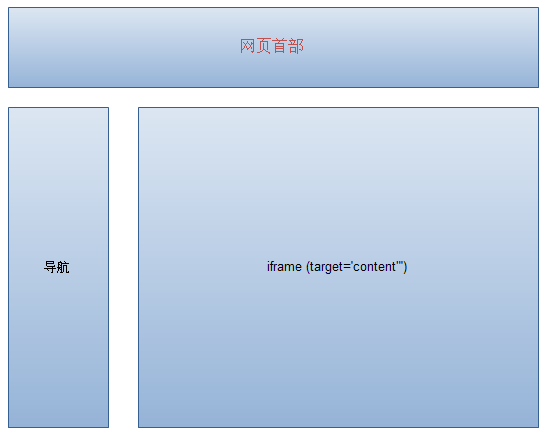
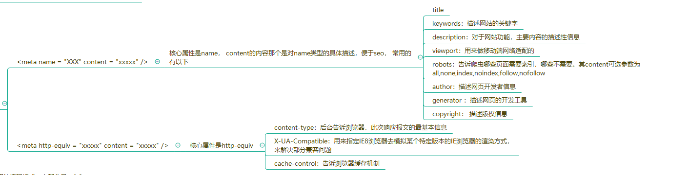
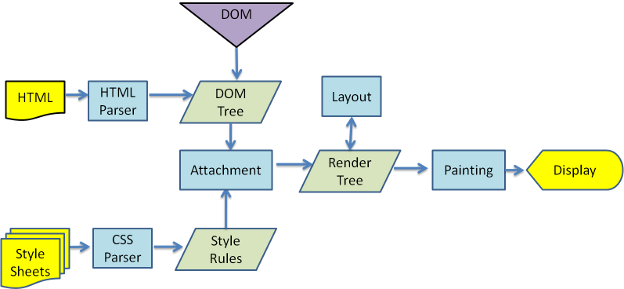

# HTML笔记

◆HTML不区分大小写。

◆注释HTML语句时，把光标放在目标行，按下Ctrl+/键。再次使用即取消。

◆在HTML中使用<!--注释语句-->。在CSS中使用/*     */注释。


```html
<!DOCTYPE html>  让浏览器得知自己要处理的内容是HTML
<html lang="en"> 文档中HTML部分的开始
<head></head>  提供有关文档内容和构建信息的
```

```html
<a href="目标网址" title="鼠标滑过显示的文本">链接显示的文本</a>
<!-- 会在新窗口打开链接页面 -->
<a href="目标网址" target="_blank">链接显示的文本</a>
```

```html

```

```html
<form>
  姓名：<input type="text" name="myName"> <br/>
  密码：<input type="password" name="pass">
</form>
```

```html
<input   type="radio/checkbox"   value="值"    name="名称"   checked="checked"/>
<!--
	当 type="radio" 时，控件为单选框，当 type="checkbox" 时，控件为复选框。
	value：提交数据到服务器的值（后台程序PHP使用）。
	name：为控件命名，以备后台程序 ASP、PHP 使用。
	checked：当设置 checked="checked" 时，该选项被默认选中。
	注意:同一组的单选按钮，name 取值一定要一致，这样同一组的单选按钮才可以起到单选的作用。	
-->
```


#### HTML格式

```html
<!DOCTYPE html>
<html>
<head>
<meta charset="utf-8">
<title>牛客教程(nowcoder.com)</title>
</head>
<body>
    <h1>我的第一个标题</h1>
    <p>我的第一个段落。</p>
</body>
</html>
```

- `<!DOCTYPE html>` 声明为 HTML5 文档
- `<html>` 元素是 HTML 页面的根元素
- `<head>` 元素包含了文档的元（meta）数据，如 `<meta charset="utf-8">` 定义网页编码格式为 **utf-8**。可以添加在头部区域的元素标签为: `<title>`, `<style>`, `<meta>`, `<link>`, `<script>`, `<noscript>`, `<base>`。
- `<title>` 元素描述了文档的标题
- `<body>` 元素包含了可见的页面内容，只有 `<body>` 区域 (白色部分) 才会在浏览器中显示。
- `<h1>` 元素定义一个大标题
- `<p>` 元素定义一个段落


#### HTML5的优点与缺点

**优点：**

网络标准统一

多设备跨平台

及时更新

提高可用性并改进用户的友好体验

有几个新标签，有助于开发人员定义重要的内容

可以给站点带来更多的多媒体元素（video和audio）

涉及到网站的抓爬和索引时，对SEO很友好

**缺点：**

安全性

完善性：许多特性各浏览器的支持程度也不一样

性能：某些平台的引擎问题导致HTML5的性能低下

浏览器兼容性：这是HTML5最大的缺点，IE9以下浏览器几乎全军覆没


#### 元素分类

##### 行内元素

◆a、b、span、img、input、strong、select、label、em、button、textarea;

##### 块级元素

◆div、ul、li、dl、dt、dd、p、h1-h6、blockquote;

##### 空元素

◆即没有内容的HTML元素，例如：br、meta、hr、link、input、img;


#### 字体格式设置

◆用<code>加一段编程代码，用<pre>加很多段代码;

◆<em>的内容在浏览中显示为斜体;

◆<strong>显示为加粗，<b>也可以用来设置粗体;

◆<u></u>表示下划线;


#### Doctype

Doctype声明于文档最前面，告诉浏览器以何种方式来渲染页面，这里有两种模式，严格模式和混杂模式。

严格模式的排版和JS 运作模式是以该浏览器支持的最高标准运行。

混杂模式，向后兼容，模拟老式浏览器，防止浏览器无法兼容页面。

DOCTYPE不存在或格式不正确会导致文档以**兼容模式**呈现！

DOCTYPE声明是**不区分大小写**的。


HTML4规定了三种声明方式，分别是：严格模式、过渡模式和框架集模式；而HTML5因为不是SGML的子集，只需要<!DOCTYPE>就可以了。


对于HTML5文档，**HTML5 没有 DTD ，因此也就没有严格模式与混杂模式的区别**，HTML5 有相对宽松的语法，实现时，已经尽可能大的实现了向后兼容。( HTML5 没有严格和混杂之分)

**用法：**

```
<!DOCTYPE>声明必须是 HTML 文档的第一行，位于 <html> 标签之前。
<!DOCTYPE> 声明不是 HTML 标签；它是指示 web 浏览器关于页面使用哪个HTML版本进行编写的指令。
在 HTML 4.01 中，<!DOCTYPE> 声明引用 DTD，因为HTML4.01基于 SGML。DTD 规定了标记语言的规则，这样浏览器才能正确地呈现内容。
HTML5 不基于 SGML，所以不需要引用 DTD。
```

**常用的 DOCTYPE 声明：**

```html
<!-- html5 -->
<!DOCTYPE html>

<!-- HTML 4.01 Strict -->
<!DOCTYPE HTML PUBLIC "-//W3C//DTD HTML 4.01//EN" "http://www.w3.org/TR/html4/strict.dtd">

<!-- HTML 4.01 Transitional -->
<!DOCTYPE HTML PUBLIC "-//W3C//DTD HTML 4.01 Transitional//EN" "http://www.w3.org/TR/html4/loose.dtd">

<!--HTML 4.01 Frameset -->
<!DOCTYPE HTML PUBLIC "-//W3C//DTD HTML 4.01 Frameset//EN" "http://www.w3.org/TR/html4/frameset.dtd">

<!-- XHTML 1.0 Strict -->
<!DOCTYPE html PUBLIC "-//W3C//DTD XHTML 1.0 Strict//EN" "http://www.w3.org/TR/xhtml1/DTD/xhtml1-strict.dtd">
```


#### 严格模式与非严格模式

首先，严格模式通过**抛出错误**来消除一些原有的**静默错误**。
其次，严格模式修复了一些导致[JavaScript](https://so.csdn.net/so/search?q=JavaScript&spm=1001.2101.3001.7020)引擎难以执行优化的缺陷：有时候，相同的代码，严格模式可以比非严格模式下**运行的更快**。
第三，严格模式**禁用了**在ECMAScript的未来版本中可能会定义的一些语法。

**1、使用严格模式**

- 函数中使用

```javascript
funtion () {
  'use strict';  //或者是"use strict";
}
123
```

- 整个脚本中使用：在这个JavaScript文件开头写`'use strict';`(或者是`"use strict";`)

**2、怎么合理的使用严格模式**

不推荐在整个脚本中使用严格模式，这种语法存在缺陷，有一个大型网站已经被坑倒了。试想合并一个严格模式的脚本和一个非严格模式的脚本：合并后脚本的代码看起来是严格模式。反之亦然：非严格合并严格看起来是非严格的。

严格与严格，非严格与非严格合并都没问题，只有严格与非严格合并是有可能有问题。建议按照一个个函数去开启严格模式。

你可以将整个脚本的内容用一个函数包括起来，然后在这个外部函数中使用严格模式。这样就可以消除合并的问题，但是这就意味着您必须要在函数作用域外声明一个全局变量。

**3、严格模式与非严格模式的不同**

**1.**`严格模式下，不允许使用with`。

**2.**`严格模式下，不允许给未声明的变量赋值`。

**3.**`严格模式下，arguments变为参数的静态副本。`

**4.**`严格模式下，删除参数名，函数名报错`。

**5.**`严格模式下，函数参数名重复报错`。

**6.**`严格模式下，删除不可配置(configurable=false)的属性报错`。

**7.**`严格模式下，修改不可写(writable=false)的属性报错`。

**8.**`严格模式下，对象字面量重复属性名报错`。

**9.**`严格模式下，禁止八进制字面量`。

**10.**`严格模式下，eval，arguments成为关键字，不能用作变量，函数名`。

**12.**`严格模式下，给只读属性赋值报错`。

**13.**`严格模式下，给不可扩展对象的新属性赋值报错`。

**14.**`ES6中，严格模式下，禁止设置五种基本类型值的属性`。

**15.**`严格模式下，一般函数调用(不是对象的方法调用，也不使用apply/call/bind等修改this)，this指向undefined，而不是全局对象`。

**16.**`严格模式下，使用apply/call/bind，当传入参数是null/undefined时，this指向null/undefined，而不是全局对象`。

**17.**`严格模式下，不再支持arguments.callee`。

**18.**`严格模式下，不再支持arguments.caller`。


#### iframe

**定义：**iframe 用于在页面内显示页面，使用 <iframe> 会创建包含另外一个文档的内联框架（即行内框架）

iframe就是我们常用的iframe标签：<iframe>。iframe标签是框架的一种形式，也比较常用到，iframe一般用来包含别的页面，例如我们可以在我们自己的网站页面加载别人网站或者本站其他页面的内容。iframe标签的最大作用就是让页面变得美观。iframe标签的用法有很多，主要区别在于对iframe标签定义的形式不同，例如定义iframe的长宽高。



```html
<iframe src="https://www.baidu.com" height="400" width="700" name="demo" frameborder="0" scrolling="auto" sandbox="allow-same-origin allow-top-navigation allow-forms allow-scripts"  ></iframe>
```

划重点：
 1.sandbox="allow-same-origin allow-top-navigation allow-forms allow-scripts"这个参数是必须要加的，否则出来的界面是空白一片。
 2.如果想要无边框的，清新自然的感觉，那么加上frameborder="0"

**iframe 的常用属性：**

```
1、width		定义 iframe 的宽度
2、height	定义 iframe 的高度
3、name		规定 iframe 的名称
4、frameborder	规定是否显示边框，值为 0（不显示）和 1（显示）
5、scrolling		规定是否在 iframe 中显示滚动条，值为 yes、no、auto
6、src		设置 iframe 的地址（页面/图片）
7、srcdoc	用来替换 iframe 中 html、body 里的内容（ IE 不支持）
8、sandbox	对 iframe 进行内容限制，值为：
allow-forms
allow-same-origin
allow-scripts
allow-top-navigation
...
支持 IE10+
```

**用处：**

**优点：**

- 重载页面时不需要整个页面进行重载，只需要重载一个框架页，减少数据传输，增加网页加载速度
- 可以使脚本可以并行下载
- 可以实现跨子域通信
- 用来加载速度较慢的内容（如广告）
- iframe 能够原封不动地把嵌入的网页展现出来

**缺点：**

**会产生很多页面，不容易管理**。

很多的移动设备(PDA 手机)无法完全显示框架，设备**兼容性差**。

**会阻塞主页面的onload事件**。window 的 onload 事件需要在所有 iframe 加载完毕后（包含里面的元素）才会触发。在 Safari 和 Chrome 里，通过 JavaScript 动态设置 iframe 的 SRC 可以避免这种阻塞情况。

**搜索引擎无法解读这种页面**，不利于SEO。

iframe和主页面共享连接池，而浏览器对相同区域有限制所以会影响性能。浏览器只能开少量的连接到 web 服务器。这意味着 **iframe 在加载资源时可能用光了所有的可用连接**，从而阻塞了主页面资源的加载。一种解决办法是，在主页面上重要的元素加载完毕后，再动态设置 iframe 的 SRC。


#### meta标签

```
meta是html文档头部的一个标签，这个标签对用户不可见，是给搜索引擎看的。
<meta> 标签提供了元数据，元数据也不显示在页面上，但会被浏览器解析。
META 元素通常用于指定网页的描述，关键词，文件的最后修改时间，作者，和其他元数据。
<meta> 一般放置于 <head> 区域。
meta标签属性用法分成两大类：
```



```html
使用的编码格式，大部分是utf-8。
<meta charset="UTF-8"> 

为搜索引擎定义关键词:
<meta name="keywords" content="HTML, CSS, XML, XHTML, JavaScript">

为网页定义描述内容:
<meta name="description" content="免费 Web & 编程 教程">

定义网页作者:
<meta name="author" content="Nowcoder">

每30秒钟刷新当前页面:
<meta http-equiv="refresh" content="30">

适配移动端，可以控制视口的大小和比例
<meta name="viewport" content="width=device-width, initial-scale=1, maximum-scale=1">
```


#### 表格

##### 创建表格的五个元素：table、tbody、th、tr、td

```html
<body>
    <table border="1px">
        <thead>
            <tr>
                <th>用户名</th>         <!--表头-->
                <th>性别</th>
                <th>密码</th>
            </tr>
        </thead>

        <tbody>
            <tr>
                <td>Admin</td>
                <td>男</td>
                <td>123</td>
            </tr>
            <tr>
                <td>赵凯</td>
                <td>男</td>
                <td>233</td>
            </tr>
        </tbody>

        <tfoot>
            <td>用户名</th>        
            <td>性别</th>
            <td>密码</th>
        </tfoot>
    </table>
</body>
```

##### 合并行单元格和列单元格

```html
<body>
<table border="1px">
    <thead>
    <tr>
        <th rowsapn="2">AAA</th>         <!--合并两个列单元格-->
        <th>BBB</th>
        <th>CCC</th>
        <th>DDD</th>
    </tr>

    <tr>
    	<!--  <td>111</td>  -->					<!--合并两个列单元格要将此框删除-->
        <td colspan="2">222</td>			
        <!--   <td>333</td>   -->				<!--合并两个行单元格要将此框删除-->
        <td>444</td>
    </tr>
    <tr>
    	<td>555</td>
        <td>666</td>
        <td>777</td>
        <td>888</td>        
    </tr>

</table>
</body>
```


------

#### 排序标签

##### 有序标签ol(ordered lists)

```html
<body>
    <ol>
        <li>a</li>		<!-- 默认按数据123排序输出 -->
        <li>a</li>
        <li>a</li>
    </ol>

    <ol type="a">		<!-- 用a小写字母进行排序，还有类似的大写字母和大小写罗马数字 -->
        <li>a</li>    
        <li>a</li>
        <li>a</li>
    </ol>

    <ol type="reversed">		<!-- 反序输出 -->
        <li>a</li>    
        <li>a</li>
        <li>a</li>
    </ol>

    <ol>
        <li>A</li>		<!-- 嵌套排序 -->
        <ol type="a">
            <li>a</li>
            <li>a</li>  
        </ol>    
    </ol>
</body>
```

##### 无序标签ul(unordered list)

```html
<body>
    <ul>
        <li>a</li>		<!-- 标签全部为黑色的小圆点，没有顺序 -->
        <li>a</li>
        <li>a</li>
    </ul>
</body>
```

##### 自定义列表

自定义列表以 `<dl>` 标签开始，每个自定义列表项以 `<dt>` 开始，每个自定义列表项的定义以 `<dd>` 开始。

```html
<dl>
    <dt>Coffee</dt>
    <dd>- black hot drink</dd>
    <dt>Milk</dt>
    <dd>- white cold drink</dd>
</dl>
```


------

#### 表单

```html
<form>
    <input type="text">		<!-- 单行文本 -->
    <br><br>
    <input type="text" value="靠谱学院">		<!-- 占位符 -->
    <br><br>    
    <input type="text" placeholder="靠谱学院">		<!-- 不占文本框内的 -->
    <br><br>    
    <input type="text" placeholder="maxlength" maxlength="8">		<!-- 最大输入字符数量 -->
    <br><br>    
    <input type="text" placeholder="靠谱学院" size="50">		<!-- 拓宽单行文本框 -->
    <br><br>    
    <input type="text" value="靠谱学院" readonly>		<!-- 只读 -->
    <br><br>
    
    <!-- 设置文本框的长宽度 -->
    <textarea row="20" cols="40">aaaaaaaaaaaaaaaaaaaaaaaaa</textarea>
</form>
```


##### 三种按钮

```html
<form>
    <input type=button value="按键">
    <button>按键</button>			<!-- js合作并且作为绑定事件 -->
    <input type="submit" value="提交">			<!-- 提交表单，适用范围比input button小一些 -->
</form>
```

```html
<form>
    <input type="range" min="-100" max="500" step="100">		<!-- 数字滑动 -->
    
    <!-- value代表初始位置 -->
    <input type="range" min="-100" max="500" step="100" value="-100"> 	
    
    <input type="number" min="-100" max="500" value="0">		<!-- 手动输入数字 -->
</form>
```


##### 复选框

```html
<form>
    <input type="checkbox">选择
</form>
```


##### 点选框

```html
<form>
    <input type="radio" name="a" checked>星月
	<input type="radio" name="a">星月
	<input type="radio" name="a">星月
</form>
```


##### 弹选框

```html
<form>
    <select>
        <option>苹果</option>
        <option>香蕉</option>
        <option>西瓜</option>
    </select>
</form>
```


##### 可添加选择项的弹选框

```html
<form>
    <input type="text" list="datalist1">
    <datalist id="datalist1">
        <option>苹果</option>
        <option>香蕉</option>
        <option>西瓜</option>    	
    </datalist>
</form>
```


##### 设置提交框格式

```html
<input type="email">
<input type="tel">
<input type="url">
<input type="date">获取时间
<input type="color">获取颜色
<input type="hidden" value="123">隐藏文本框
<input type="image" src="Download.png" width="80px">图片按钮

<!-- 还可以设置属性multiple，可以上传多个文件；设置属性为required，则必须上传一个文件 -->
<input type="file" multiple>上传文件    

<!-- 当使用input元素上传文件提交表单时，要设置如下内容 -->
<form enctype="multipart/form-data">
</form>
```


##### 创建分区响应图

```html
<!-- alt表示图片未加载时显示的文字 -->


<!-- 设置方形点击区域 -->

<form>
    <input type="image" src="time.jpg">
</form>
<map name="map1">
    <!-- coords四个整数分别代表图像左上右下四个边缘 -->
	<area href="time.html" shape="rect" coords="38,63,175,200" target="_blank">
 	<area href="weather.html" shape="rect" coords="38,63,175,200" target="_blank">   
</map>


<!-- 设置圆形点击区域 -->

<map name="map2">
    <!-- coords三个整数分别代表图像左边缘和右边缘到圆心的距离以及圆的半径 -->
	<area href="xxx.html" shape="circle" coords="64px,64px,64px" target="_blank">
</map>
<a target="_blank" href="xxx.html">

</a>
```


##### 设置视频播放

```html
<!-- controls是显示控制图标，preload是设置为视频预加载，改为none则为不加载，poster是设置视频封面图片 -->
<video src="xxx.mp4" height="500px" controls preload="metadata" poster="123.png">
	<source src="xxx.mp4" type="video/mp4">
    <source src="xxx.ogv" type="video/ogg">
</video>
```


#### DOM操作

##### DOM 节点的获取(4种)

DOM 节点的获取的API及使用：

```javascript
getElementById // 按照 id 查询
getElementsByTagName // 按照标签名查询
getElementsByClassName // 按照类名查询
querySelectorAll // 按照 css 选择器查询

// 按照 id 查询
var imooc = document.getElementById('imooc') // 查询到 id 为 imooc 的元素
// 按照标签名查询
var pList = document.getElementsByTagName('p')  // 查询到标签为 p 的集合
console.log(divList.length)
console.log(divList[0])
// 按照类名查询
var moocList = document.getElementsByClassName('mooc') // 查询到类名为 mooc 的集合
// 按照 css 选择器查询
var pList = document.querySelectorAll('.mooc') // 查询到类名为 mooc 的集合
```

------

##### DOM 节点的创建

**创建一个新节点，并把它添加到指定节点的后面。** 已知的 HTML 结构如下：

```html
<html>
  <head>
    <title>DEMO</title>
  </head>
  <body>
    <div id="container"> 
      <h1 id="title">我是标题</h1>
    </div>   
  </body>
</html>
```

要求添加一个有内容的 span 节点到 id 为 title 的节点后面，做法就是：

```javascript
// 首先获取父节点
var container = document.getElementById('container')
// 创建新节点
var targetSpan = document.createElement('span')
// 设置 span 节点的内容
targetSpan.innerHTML = 'hello world'
// 把新创建的元素塞进父节点里去
container.appendChild(targetSpan)
```

------

##### DOM 节点的删除

**删除指定的 DOM 节点，** 已知的 HTML 结构如下：

```html
<html>
  <head>
    <title>DEMO</title>
  </head>
  <body>
    <div id="container"> 
      <h1 id="title">我是标题</h1>
    </div>   
  </body>
</html>
```

需要删除 id 为 title 的元素，做法是：

```javascript
// 获取目标元素的父元素
var container = document.getElementById('container')
// 获取目标元素
var targetNode = document.getElementById('title')
// 删除目标元素
container.removeChild(targetNode)
```

或者通过子节点数组来完成删除：

```javascript
// 获取目标元素的父元素
var container = document.getElementById('container')

// 获取目标元素
var targetNode = container.childNodes[1]

// 删除目标元素
container.removeChild(targetNode)
```

------

##### 修改 DOM 元素

修改 DOM 元素这个动作可以分很多维度，比如说移动 DOM 元素的位置，修改 DOM 元素的属性等。

**将指定的两个 DOM 元素交换位置，** 已知的 HTML 结构如下：

```html
<html>
  <head>
    <title>DEMO</title>
  </head>
  <body>
    <div id="container"> 
      <h1 id="title">我是标题</h1>
      <p id="content">我是内容</p>
    </div>   
  </body>
</html>
```

现在需要调换 title 和 content 的位置，可以考虑 **insertBefore** 或者 appendChild：

```javascript
// 获取父元素
var container = document.getElementById('container')   
 
// 获取两个需要被交换的元素
var title = document.getElementById('title')
var content = document.getElementById('content')
// 交换两个元素，把 content 置于 title 前面
container.insertBefore(content, title)
```


#### HTML语义化

**1、什么是HTML语义化？**

**根据内容的结构化（内容语义化），选择合适的标签（代码语义化）。**便于开发者阅读和写出更优雅的代码的同时让浏览器的爬虫和机器很好地解析。

基本上都是围绕着几个主要的标签，像标题（H1~H6）、列表（li）、强调（strong em）等等。

**2、为什么要语义化？**

- 为了在没有CSS的情况下，页面也能呈现出很好地内容结构、代码结构；
- 用户体验：例如title、alt用于解释名词或解释图片信息、label标签的活用；
- 有利于SEO（搜索引擎优化）：和搜索引擎建立良好沟通，有助于爬虫抓取更多的有效信息：爬虫依赖于标签来确定上下文和各个关键字的权重；
- 方便其他设备解析（如屏幕阅读器、盲人阅读器、移动设备）以意义的方式来渲染网页；
- 便于团队开发和维护，语义化更具可读性，是下一步网页的重要动向，遵循W3C标准的团队都遵循这个标准，可以减少差异化。

**3、写HTML代码时应注意什么？**

- 尽可能少的使用无语义的标签div和span；
- 在语义不明显时，**既可以使用div或者p时，尽量用p, 因为p在默认情况下有上下间距，对兼容特殊终端有利；**
- 不要使用纯样式标签，如：b、font、u等，改用css设置。
- 需要强调的文本，可以包含在strong或者em标签中（浏览器预设样式，能用CSS指定就不用他们），strong默认样式是加粗（不要用b），em是斜体（不用i）；
- 使用表格时，标题要用caption，表头用thead，主体部分用tbody包围，尾部用tfoot包围。表头和一般单元格要区分开，表头用th，单元格用td；
- 表单域要用fieldset标签包起来，并用legend标签说明表单的用途；
- 每个input标签对应的说明文本都需要使用label标签，并且通过为input设置id属性，在lable标签中设置for=someld来让说明文本和相对应的input关联起来。

 **4、HTML5新增了哪些语义标签**

在HTML 5出来之前，我们用`div`来表示页面章节，但是这些`div`都没有实际意义。（即使我们用css样式的id和class形容这块内容的意义）。这些标签只是我们提供给浏览器的指令，只是定义一个网页的某些部分。但现在，那些之前没“意义”的标签因为html5的出现消失了，这就是我们平时说的“语义”。


#### **HTML5元素标签**

首先html5为了更好的实践web语义化，增加了header，footer，nav，aside，section等语义化标签，在表单方面，为了增强表单，为input增加了color，emial，data ，range等类型，在存储方面，提供了sessionStorage，localStorage和离线存储，通过这些存储方式方便数据在客户端的存储和获取，在多媒体方面规定了音频和视频元素audio和video，另外还有地理定位，canvas画布，拖放，多线程编程的web worker和websocket协议。

HTML5节元素标签包括`body article nav aside section header footer hgroup `，还有`h1-h6 address`。

- `address`代表区块容器，必须是作为联系信息出现，邮编地址、邮件地址等等,一般出现在footer。
- `h1-h6`因为hgroup，section和article的出现，h1-h6定义也发生了变化，允许一张页面出现多个h1。

**html5的布局**

但是也不要因为html5新标签的出现，而随意用之，错误的使用肯定会事与愿违。所以有些地方还是要用div的，就是因为div没有任何意义的元素，他只是一个标签，仅仅是用来构建外观和结构。因此是最适合做容器的标签。

结论：不能因为有了HTML 5标签就弃用了div，每个事物都有它的独有作用的。

节点元素标签因使用的地方不同，我将他们分为：节元素标签、文本元素标签、分组元素标签分开来讲解HTML5中新增加的语义化标签和使用总结。

**header元素**

header 元素代表“网页”或“section”的页眉。
通常包含`h1-h6`元素或`hgroup`，作为整个页面或者一个内容块的标题。也可以包裹一节的目录部分，一个搜索框，一个`nav`，或者任何相关logo。

**footer元素**

`footer`元素代表“网页”或“section”的页脚，通常含有该节的一些基本信息，譬如：作者，相关文档链接，版权资料。如果`footer`元素包含了整个节，那么它们就代表附录，索引，提拔，许可协议，标签，类别等一些其他类似信息。

**hgroup元素**

`hgroup`元素代表“网页”或“section”的标题，当元素有多个层级时，该元素可以将`h1`到`h6`元素放在其内，譬如文章的主标题和副标题的组合

hgroup使用注意：

- 如果只需要一个h1-h6标签就不用hgroup
- 如果有连续多个h1-h6标签就用hgroup
- 如果有连续多个标题和其他文章数据，h1-h6标签就用hgroup包住，和其他文章元数据一起放入header标签


#### HTML5新特性

（1）用于绘画的 canvas 元素

（2）用于媒介回放的 video 和 audio 元素

（3）对本地离线存储的更好的支持

（4）新的特殊内容元素，比如 article、footer、header、nav、section

（5）新的表单控件，比如 calendar、date、time、email、url、search


#### 浏览器渲染引擎

**一个渲染引擎主要包括**：`HTML解析器`，`CSS解析器`，`javascript引擎`，`布局layout模块`，`绘图模块`

**HTML解析器**：解释HTML文档的解析器，主要作用是将HTML文本解释成DOM树。

**CSS解析器**：它的作用是为DOM中的各个元素对象计算出样式信息，为布局提供基础设施

**Javascript引擎**：使用Javascript代码可以修改网页的内容，也能修改css的信息，javascript引擎能够解释javascript代码，并通过DOM接口和CSS树接口来修改网页内容和样式信息，从而改变渲染的结果。

**布局（layout）**：在DOM创建之后，Webkit需要将其中的元素对象同样式信息结合起来，计算他们的大小位置等布局信息，形成一个能表达这所有信息的内部表示模型

**绘图模块（paint）**：使用图形库将布局计算后的各个网页的节点绘制成图像结果

##### 渲染过程



1.遇见 HTML 标记，调用HTML解析器解析为对应的 token （一个token就是一个标签文本的序列化）并构建 DOM 树（就是一块内存，保存着tokens，建立它们之间的关系）。

2.遇见 style/link 标记 调用（可能是 html/css 解析器）解析器 处理 CSS 标记并构建 CSS样式树。

3.遇见 script 标记 调用 javascript解析器 处理script标记，绑定事件、修改DOM树/CSS树 等

4.**将 DOM树 与 CSS树 合并成一个render 树（渲染树）**。

5.根据渲染树来渲染，以计算每个节点的几何信息（这一过程需要依赖图形库）。

6.将各个节点绘制到屏幕上。

`总结：`**真正渲染到页面，一定是发生在DOM-Tree和CSSOM树都已经构建完成时，所以HTML和CSS都是阻碍页面渲染的东西**

------

##### CSS阻塞

 声明：只有link引入的外部css才能够产生阻塞。

1.style标签中的样式：

 (1). 由html解析器进行解析；

 (2). 不阻塞浏览器渲染（可能会产生“闪屏现象”）；

 (3). 不阻塞DOM解析；

2.link引入的外部css样式（推荐使用的方式）：

(1). 由CSS解析器进行解析。

(2). 阻塞浏览器渲染(可以利用这种阻塞避免“闪屏现象”)。

(3). 阻塞其后面的js语句的执行：

(4). 不阻塞DOM的解析：

优化核心理念：

尽可能快的提高外部css加载速度

(1).使用CDN节点进行外部资源加速。

(2).对css进行压缩(利用打包工具，比如webpack,gulp等)。

(3).减少http请求数，将多个css文件合并。

(4).优化样式表的代码（避免出现太多级的选择器）

------

##### JS阻塞

 1.阻塞DOM解析:

原因：浏览器不知道后续脚本的内容，如果先去解析了下面的DOM，而随后的js删除了后面所有的DOM，那么浏览器就做了无用功，浏览器无法预估脚本里面

体做了什么操作，例如像document.write这种操作，索性全部停住，等脚本执行完了，浏览器再继续向下解析DOM。

2.阻塞页面渲染:

原因：js中也可以给DOM设置样式，浏览器同样等该脚本执行完毕，再继续干活，避免做无用功。

3.阻塞后续js的执行:

原因：维护依赖关系，例如：必须先引入jQuery再引入bootstrap。

**补充**

1.css的解析和js的执行是互斥的（互相排斥），css解析的时候js停止执行，js执行的时候css停止解析。

2.无论css阻塞，还是js阻塞，都不会阻塞浏览器加载外部资源（图片、视频、样式、脚本等）

原因：浏览器始终处于一种：“先把请求发出去”的工作模式，只要是涉及到网络请求的内容，无论是：图片、样式、脚本，都会先发送请求去获取资源，至于资

到本地之后什么时候用，由浏览器自己协调。这种做法效率很高。

3.WebKit 和 Firefox 都进行了【预解析】这项优化。在执行js脚本时，浏览器的其他线程会解析文档的其余部分，找出并加载需要通过网络加载的其他资源。通

过这种方式，资源可以在并行连接上加载，从而提高总体速度。请注意，预解析器不会修改 DOM 树。

------

##### 渲染顺序

1.根据html文件构建DOM树和CSSOM树。构建DOM树期间，如果遇到JS，阻塞DOM树及CSSOM树的构建，优先加载JS文件，加载完毕，再继续构建DOM树及CSSOM树。

2.构建渲染树（Render Tree）。

3.页面的重绘（repaint）与重排（reflow，也有称回流）。页面渲染完成后，若JS操作了DOM节点，根据JS对DOM操作动作的大小，浏览器对页面进行重绘或是重排。

**一、构建DOM树及CSSOM树**

- **构建DOM树**
- **构建CSSOM树**
- **加载JS**

**二.构建渲染树**

渲染树（Render Tree）由DOM树、CSSOM树合并而成，但并不是必须等DOM树及CSSOM树加载完成后才开始合并构建渲染树。三者的构建并无先后条件，亦非完全独立，而是会有交叉，并行构建。因此会形成一边加载，一边解析，一边渲染的工作现象。

构建渲染树，根据渲染树计算每个可见元素的布局，并输出到绘制流程，将像素渲染到屏幕上。

**问题一：渲染过程中遇到JS文件怎么处理？**
JavaScript的加载、解析与执行会阻塞DOM的构建，也就是说，在构建DOM时，HTML解析器若遇到了JavaScript，那么它会暂停构建DOM，将控制权移交给JavaScript引擎，等JavaScript引擎运行完毕，浏览器再从中断的地方恢复DOM构建。

也就是说，如果你想首屏渲染的越快，就越不应该在首屏就加载 JS 文件，这也是都建议将 script 标签放在 body 标签底部的原因。当然在当下，并不是说 script 标签必须放在底部，因为你可以给 script 标签添加 defer 或者 async 属性（下文会介绍这两者的区别）。

JS文件不只是阻塞DOM的构建，它会导致CSSOM也阻塞DOM的构建。

原本DOM和CSSOM的构建是互不影响，井水不犯河水，但是一旦引入了JavaScript，CSSOM也开始阻塞DOM的构建，只有CSSOM构建完毕后，DOM再恢复DOM构建。

这是什么情况？

这是因为JavaScript不只是可以改DOM，它还可以更改样式，也就是它可以更改CSSOM。前面我们介绍，不完整的CSSOM是无法使用的，但JavaScript中想访问CSSOM并更改它，那么在执行JavaScript时，必须要能拿到完整的CSSOM。所以就导致了一个现象，如果浏览器尚未完成CSSOM的下载和构建，而我们却想在此时运行脚本，那么浏览器将延迟脚本执行和DOM构建，直至其完成CSSOM的下载和构建。也就是说，在这种情况下，浏览器会先下载和构建CSSOM，然后再执行JavaScript，最后在继续构建DOM。

**问题二：为什么操作 DOM 慢**
因为 DOM 是属于**渲染引擎**中的东西，而 JS 又是 **JS 引擎**中的东西。当我们通过 JS 操作 DOM 的时候，其实这个操作**涉及到了两个线程之间的通信**，那么势必会带来一些性能上的损耗。操作 DOM 次数一多，也就等同于一直在进行线程之间的通信，并且操作 DOM 可能还会带来重绘回流的情况，所以也就导致了性能上的问题。

**问题三：渲染页面时的常见不良现象（FOUC、白屏）**
FOUC : 主要指的是样式闪烁的问题。即CSS加载之前，先加载了HTML，则出现了“先展示无样式内容，然后再突然呈现样式”的现象。原因是：CSS加载时间过长、CSS放在文档底部

FOUC (Flash of Unstyled Content) 无样式内容闪烁：
如果把样式放在底部，对于IE浏览器,在某些场景下(点击链接,输入URL,使用书签进入等),会出现 FOUC 现象(逐步加载无样式的内容,等CSS加载后页面才突然展现出样式)。对于 Firefox 会一直表现出 FOUC 。
由于：
脚本会阻塞后面内容的呈现

脚本会阻塞其后组件的下载

对于图片和CSS, 在加载时会并发加载(如一个域名下同时加载两个文件)。但在加载 JavaScript 时,会禁用并发,并且阻止其他内容的下载

所以尽量把 JavaScript 放入页面body底部。

白屏：浏览器迟迟未渲染页面。有的浏览器需要先构建DOM树和CSSOM树，构建完成再渲染。有可能因为CSS放在HTML尾部，CSS未加载完成，则就不能构建完成，从而不能渲染而白屏；也有可能是JS放在了头部，阻塞了DOM的解析

白屏的根本原因是浏览器在渲染的时候没有请求到或请求时间过长造成的。

浏览器对于图片和CSS，在加载时会并发加载（比如一个域名下同时加载多个文件），浏览器对于JavaScript，在加载时会禁用并发，并且阻止其后的文件及组件的下载。所以将js放在页面的顶部也可能会导致白屏。

不同浏览器的处理CSS和HTML的方式是不同的：

比如，IE、chrome浏览器的渲染机制，采用的是等CSS全部加载解析完后再渲染展示页面。

Firefox则是在CSS未加载前先展示html的内容，等CSS加载后重新对样式进行修改。

所以：白屏的出现情况往往因为CSS样式被置于底部（最后加载）,当新窗口打开,刷新等的时候，页面会出现白屏。 如果使用@import标签,它引用的文件则会等页面全部下载完毕再被加载，也可能出现白屏。

因此， **css使用 link 标签将样式表放在顶部，防止白屏问题出现。 JS 的放置位置一般是在body的闭合标签之前**。


#### href、src区别

**href**

href是Hypertext Reference的缩写，表示超文本引用。用来建立当前元素和文档之间的链接。常用的有：link、a。例如：

```html
<link href="reset.css" rel="stylesheet"/>
```

浏览器会识别该文档为css文档，并行下载该文档，并且**不会停止对当前文档的处理**。这也是建议使用link，而不采用@import加载css的原因。

**src**

src是source的缩写，src的内容是页面必不可少的一部分，是引入。src指向的内容会嵌入到文档中当前标签所在的位置。常用的有：img、script、iframe。例如:

```html
<script src="script.js"></script>
```

当浏览器解析到该元素时，**会暂停浏览器的渲染**，直到该资源加载完毕。这也是将js脚本放在底部而不是头部的原因，最好还是放在 body 尾部。

简而言之，**src用于替换当前元素；href用于在当前文档和引用资源之间建立联系。**

css下载完会构建cssom，js由于可能会改变cssom所以必须等待cssom构建后才开始parse。


#### **defer与async**

**（1）defer属性**

```html
<script src="test.js" defer="defer"></script>
```

defer表示异步下载，但是会等到整个页面都解析完成之后、`DOMContentLoaded`事件调用前再执行.

**（2）async属性**

```html
<script src="test.js" async></script>
```

async表示异步下载，async并不会按着`script`在页面中的顺序来执行，而是谁先加载完谁就立刻执行。`DOMContentLoaded`事件的触发并不受`async`脚本加载的影响，在脚本加载完之前，就已经触发了。


- 蓝色线代表网络读取，
- 红色线代表执行时间，这俩都是针对脚本的；
- 绿色线代表 HTML 解析。

**defer与async的区别**

- `defer 和 async` 在`网络读取`（下载）这块儿是一样的，都是`异步的`（相较于 HTML 解析）
- `defer 和 async的差别在于脚本下载完之后何时执行`，显然 defer 是最接近我们对于应用脚本加载和执行的要求的
- `关于 defer，此图未尽之处在于它是按照加载顺序执行脚本的`，这一点要善加利用
- `async 则是一个乱序执行`的主，反正对它来说脚本的加载和执行是紧紧挨着的，所以不管你声明的顺序如何，`只要它加载完了就会立刻执行`
- 仔细想想，`async` 对于应用脚本的用处不大，因为它完全不考虑依赖（哪怕是最低级的顺序执行），不过它对于那些可以`不依赖任何脚本或不被任何脚本依赖的脚本`来说却是非常合适的，最典型的例子：`Google Analytics`

async属性仅适用于外部脚本，并且如果在IE中同时存在defer和async，那么defer的优先级比较高，脚本将在页面完成时执行。


#### XHTML

XML 是一种必须正确标记且格式良好的标记语言。

今日的科技界存在一些不同的浏览器技术。其中一些在计算机上运行，而另一些可能在移动电话或其他小型设备上运行。小型设备往往缺乏解释"糟糕"的标记语言的资源和能力。

所以 - 通过结合 XML 和 HTML 的长处，开发出了 XHTML。XHTML 是作为 XML 被重新设计的 HTML。

**与 HTML 相比最重要的区别**

**文档结构**

- XHTML DOCTYPE 是**强制性**的
- `<html>` 中的 XML namespace 属性是**强制性**的
- `<html>`、`<head>`、`<title>` 以及 `<body>` 也是**强制性**的

**元素语法**

- XHTML 元素必须**正确嵌套**

  ```html
  <！--在HTML中，一些元素可以不互相嵌套，像这样： -->
  <b><i>粗体和斜体文本</b></i>
  
  <！--在XHTML中，所有的元素都必须互相合理地嵌套，像这样： -->
  <b><i>粗体和斜体文本</i></b>
  ```

- XHTML 元素必须始终**关闭**

- XHTML 元素必须**小写**

- XHTML 文档必须有**一个根元素**

**属性语法**

- XHTML 属性必须使用**小写**
- XHTML 属性值必须用**引号包围**
- XHTML 属性最小化也是**禁止**的


#### Canvas

**什么是canvas？**

是HTML5新增的元素，通过使用脚本语言(JS)来在特定的区域绘制图形，可以制作照片集和简单的动画，也可以处理和渲染视频。

HTML5 `<canvas>` 元素用于图形的绘制，通过脚本 (通常是JavaScript)来完成。`<canvas>` 标签只是图形容器，您必须使用脚本来绘制图形。

**canvas 语法**

```html
<canvas id="first" width="300px" height="300px"></canvas>
```

**canvas 元素**

`<canvas>`标签和其实是一样的，只是<canvas>只有两个属性：width和height。没有src和alt属性。<canvas>默认值为：width:300px,height:150px。也可以使用 css 属性来设置宽高，但是如宽高属性和初始比例不一致，他会出现扭曲。所以，建议永远不要使用 css 属性来设置 <canvas>的宽高。

**替换内容**
有些版本的浏览器不支持<canvas>,所以我们可以设置代替内容来显示。不支持的浏览器会直接渲染替代内容。

<canvas>
你的浏览器不支持 <canvas>，请升级你的浏览器
<canvas>
**渲染上下文(Thre Rending Context)**

`<canvas>`开一个或多个渲染上下文(画笔)，使用渲染上下文来绘制和处理要展示的内容。

```js
var canvas=document.getElementById('first');
if(canvas.getContext){
var ctx = canvas.getContext('d2');
//drawing code here
}else{
//not-supporting code here
}
```

#### SVG

- SVG 指可伸缩矢量图形 (Scalable Vector Graphics)
- SVG 用于定义用于网络的基于矢量的图形
- SVG **使用 XML 格式定义图****形**
- SVG 图像在放大或改变尺寸的情况下其图形质量不会有损失
- SVG 是万维网联盟的标准

##### **Canvas 与 SVG 的比较**

**Canvas**

- 依赖分辨率
- 不支持事件处理器
- 弱的文本渲染能力
- 能够以 .png 或 .jpg 格式保存结果图像
- 最适合图像密集型的游戏，其中的许多对象会被频繁重绘

**SVG**

- 不依赖分辨率
- 支持事件处理器
- 最适合带有大型渲染区域的应用程序（比如谷歌地图）
- 复杂度高会减慢渲染速度（任何过度使用 DOM 的应用都不快）
- 不适合游戏应用


#### 单个问题汇总

##### 始终将正斜杠添加到子文件夹

假如在标签<a>里这样书写链接：`href="https://www.nowcoder.com/html"`，就会向服务器**产生两次 HTTP 请求**。这是因为服务器会添加正斜杠到这个地址，然后创建一个新的请求，就像这样：`href="https://www.nowcoder.com/html/"`。

------

#####  **img的srcset属性的作用**

响应式页面中经常用到**根据屏幕密度设置不同的图片**。这时就用到了 img 标签的srcset属性。srcset属性用于设置不同屏幕密度下，img 会自动加载不同的图片。用法如下：

```html

```

使用上面的代码，就能实现在屏幕密度为1x的情况下加载image-128.png, 屏幕密度为2x时加载image-256.png。

按照上面的实现，不同的屏幕密度都要设置图片地址，目前的屏幕密度有1x,2x,3x,4x四种，如果每一个图片都设置4张图片，加载就会很慢。所以就有了新的srcset标准。代码如下：

```html

```

其中srcset指定图片的地址和对应的图片质量。sizes用来设置图片的尺寸零界点。对于 srcset 中的 w 单位，可以理解成图片质量。如果可视区域小于这个质量的值，就可以使用。浏览器会自动选择一个最小的可用图片。

sizes语法如下：

```html
sizes="[media query] [length], [media query] [length] ... "
```

sizes就是指默认显示128px, 如果视区宽度大于360px, 则显示340px。

------

##### label标签的作用

我们知道一个完整的表单是由表单标签<form></form>与其中包裹的各种表单控件组成的。label标签是一种常见的表单控件。它的作用是使用户在填写表单的项目时有更好的体验。比如说如下这个例子：

```html
<label for="email">E-mail:</label>  
<input type="text" id="email">  
```

表单控件都是内联元素所以他俩会在一行显示。**在网页中当我们点击E-mai字样或文本框时都会在文本框中出现光标**，这个就是label标签的功能了。说白了label标签就是他所关联的表单控件的延伸，即鼠标点击了他，就会出现和点击他所关联的表单控件一样的效果。而这前提是label的for属性的属性值与想要关联的表单控件的id一样。

若不想用id和for关联还可用第二种方法。效果是和以前一样的。

```html
</pre><pre name="code" class="html"><label>E-mail:<input type="text"></label>  
```

当然其他表单控件也可以与label关联，如标签<a>。

那你可能说，这label标签好想也没多大用嘛。嗯，当然有用。除了增强用户体验外，还为行动不便人士上网提供了便利。比如说，视力障碍者是借助“网页朗读器”发出的声音来浏览网页的，若没有label标签的关联，上网者就在脑海中不能想象出那种对应性，不能很好理解网站表单所想表达的内容。再比如，肢体有缺陷的上网者对于鼠标的控制是很辛苦的，运用label后点击的目标变大了，有利于操作。So，一个真正的好的页面既要能跨浏览器，还要能适配各种大小屏幕的设备，还应该对各类上网者（无论是老年人，还是有缺陷的人）提供便利。