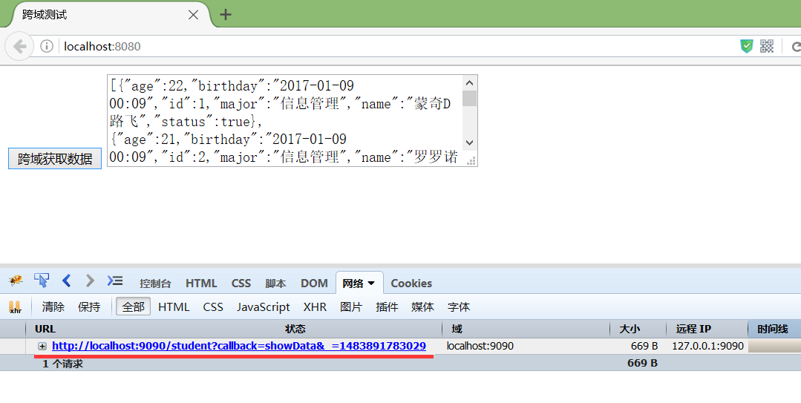
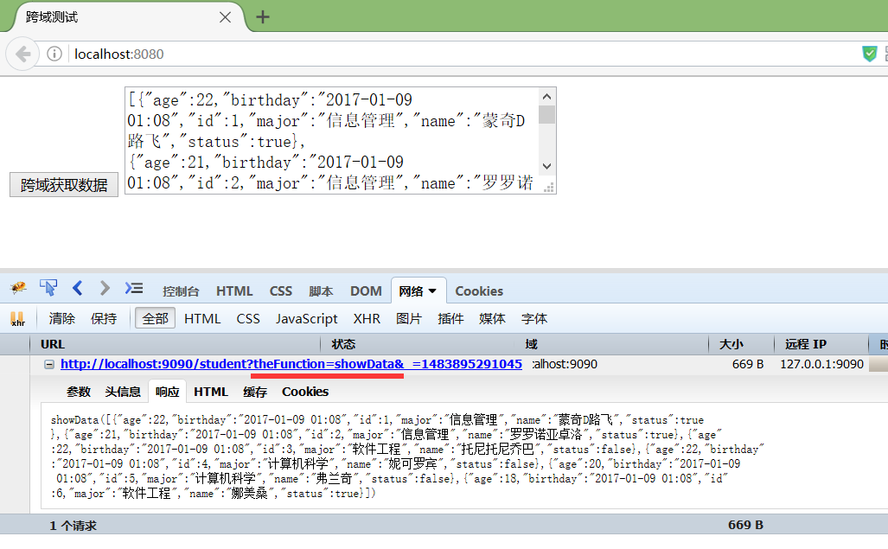

### JavaScript

#### JS数据类型

**七种基本数据类型**：undefined、null、number、boolean、string、symbol(ES6)、BigInt(ES10)。

**引用数据类型**：Object、Array、RegExp、Date、Function（在JS中除了基本数据类型以外的都是对象，数据是对象，函数是对象，正则表达式是对象）

基本数据类型是指存放在栈中的简单数据段，数据大小确定，内存空间大小可以分配，它们是直接按值存放的，所以可以直接按值访问，属于被频繁使用的数据，所以存储在栈中。基本数据类型的值是不可变的，任何方法都无法改变一个基本类型的值，当这个变量重新赋值后看起来变量的值是改变了，但是这里变量名只是指向变量的一个指针，所以改变的是指针的指向改变，该变量是不变的，但是引用类型可以改变。

引用类型是存放在堆内存中的对象，变量其实是保存的在栈内存中的一个指针（保存的是堆内存中的引用地址），这个指针指向堆内存。如果存储在栈中，将会影响程序运行的性能。


#### JS语言特性

运行在客户端浏览器上；

不用预编译，直接解析执行代码；

是弱类型语言，较为灵活；

与操作系统无关，跨平台的语言；

脚本语言、解释性语言；


#### JS部分代码规范

```
1、不要在同一行声明多个变量
2、使用 === 和 !== 来比较
3、不要使用全局函数
4、变量在使用之前的位置声明（减少变量提升干扰）
5、if用花括号包起来即使只有一行
6、写注释
```


#### JS外部引用

```html
<!-- 在html文件中引用外部名为javascript.js文件 -->
<html lang="en">
    <head>
        <meta charset="UTF-8">
        <title>Title</title>
        <script src="javascript.js"></script>
    </head>
</html>


<!-- 在html文件中插入js语句 -->
<html lang="en">
    <head>
        <meta charset="UTF-8">
        <title>Title</title>
        <script>
        	var number=100;
            document.write("<h1>"+number+"</h1>");         	//效果同<h1>100</h1>
            
            var name=prompt("你的名字是：","")                //弹出问题对话框，后面的引号为答案
            document.write("<h1>"+name+"</h1>");   
        </script>
    </head>
</html>
```


#### JS判断类型

```html
1、typeof检测不出null 和 数组，结果都为object，所以typeof常用于检测基本类型
console.log(typeof true) // boolean

2、instanceof不能检测出number、boolean、string、undefined、null、symbol类型，所以instancof常用于检测复杂类型以及级成关系
console.log([1,2] instanceof Array) // true

3、constructor,null、undefined没有construstor方法，因此constructor不能判断undefined和null。但是contructor的指向是可以被改变，所以不安全
console.log([1, 2].constructor === Array) // ture

4、Object.prototype.toString.call全类型都可以判断
Object.prototype.toString.call([1, 2]) // [object Array]
```


#### **undefined 和 null 区别**

```
1、null
什么都没有，表示一个空对象引用（主动释放一个变量引用的兑现那个，表示一个变量不再指向任何引用地址）
2、undefined
没有设置值的变量，会自动赋值undefined
3、区别
typeof undefined             // undefined
typeof null                  // object
null === undefined           // false
null == undefined            // true
```


#### **普通函数和箭头函数的区别**

1、普通函数
可以通过bind、call、apply改变this指向
可以使用new

2、箭头函数
本身没有this指向，
它的this在定义的时候继承自外层第一个普通函数的this
被继承的普通函数的this指向改变，箭头函数的this指向会跟着改变
箭头函数外层没有普通函数时，this指向window
不能通过bind、call、apply改变this指向
使用new调用箭头函数会报错，因为箭头函数没有constructor


#### **document.write与innerHTML**

document.write 将内容写入页面，清空替换掉原来的内容，会导致重绘。

document.innerHTML 将内容写入某个Dom节点，不会重绘。


#### **JS各种高度区别**

clientHeight：表示的是可视区域的高度，不包含border和滚动条

offsetHeight：表示可视区域的高度，包含了border和滚动条

scrollHeight：表示了所有区域的高度，包含了因为滚动被隐藏的部分。

clientTop：表示边框border的厚度，在未指定的情况下一般为0

scrollTop：滚动后被隐藏的高度，获取对象相对于由offsetParent属性指定的父坐标(css定位的元素或body元素)距离顶端的高度。


#### **栈和堆的区别**

1、堆
动态分配内存，内存大小不一，也不会自动释放

2、栈
自动分配相对固定大小的内存空间，并由系统自动释放

3、基本类型都是存储在栈中，每种类型的数据占用的空间的大小是确定的，并由系统自动分配和释放。内存可以及时回收。

4、引用类型的数据都是存储在堆中。准确说是栈中会存储这些数据的地址指针，并指向堆中的具体数据。


#### JS中的this指向

##### 函数调用

案例：

```js
var obj = {
  foo: function(){
    console.log(this)
  }
}

var bar = obj.foo
obj.foo() // 打印出的 this 是 obj
bar() // 打印出的 this 是 window
```

JS（ES5）里面有三种函数调用形式：

```js
func(p1, p2) 
obj.child.method(p1, p2)
func.call(context, p1, p2) // 先不讲 apply
```

一般，初学者都知道前两种形式，而且认为前两种形式「优于」第三种形式。其实第三种调用形式，才是正常调用形式。

其他两种都是语法糖，可以等价地变为 call 形式：

```js
func(p1, p2) 等价于
func.call(undefined, p1, p2)

obj.child.method(p1, p2) 等价于
obj.child.method.call(obj.child, p1, p2)
```

请记下来。（我们称此代码为「转换代码」，方便下文引用）至此我们的函数调用只有一种形式。

this，就是上面代码中的 context。就这么简单。

this 是你 call 一个函数时传的 context，由于你从来不用 call 形式的函数调用，所以你一直不知道。

先看 func(p1, p2) 中的 this 如何确定：

当你写下面代码时

```js
function func(){
  console.log(this)
}
func()
```

用「转换代码」把它转化一下，得到

```text
function func(){
  console.log(this)
}
func.call(undefined) // 可以简写为 func.call()
```

按理说打印出来的 this 应该就是 undefined 了吧，但是浏览器里有一条规则：

> 如果你传的 context 是 null 或 undefined，那么 window 对象就是默认的 context（严格模式下默认 context 是 undefined）

因此上面的打印结果是 window。

如果你希望这里的 this 不是 window，很简单：

```text
func.call(obj) // 那么里面的 this 就是 obj 对象
```

再看 obj.child.method(p1, p2) 的 this 如何确定:

```text
var obj = {
  foo: function(){
    console.log(this)
  }
}

obj.foo() 
```

按照「转换代码」，我们将 obj.foo() 转换为

```text
obj.foo.call(obj)
```

好了，this 就是 obj。搞定。

回到案例：

```text
var obj = {
  foo: function(){
    console.log(this)
  }
}

var bar = obj.foo
obj.foo() // 转换为 obj.foo.call(obj)，this 就是 obj
bar() 
// 转换为 bar.call()
// 由于没有传 context
// 所以 this 就是 undefined
// 最后浏览器给你一个默认的 this —— window 对象
```

##### [ ] 语法

```js
function fn (){ console.log(this) }
var arr = [fn, fn2]
arr[0]() // 这里面的 this 又是什么呢？
```

我们可以把 arr[0]（0）想象为arr.0( )，虽然后者的语法错了，但是形式与转换代码里的 obj.child.method(p1, p2) 对应上了，于是就可以愉快的转换了：

```js
arr[0]() 
假想为arr.0()
然后转换为arr.0.call(arr)
那么里面的 this 就是 arr 了
```

##### **箭头函数**

我不明白为什么需要讨论箭头函数，实际上箭头函数里并没有 this，如果你在箭头函数里看到 this，你直接把它当作箭头函数外面的 this 即可。外面的 this 是什么，箭头函数里面的 this 就还是什么，因为箭头函数本身不支持 this。

有人说「箭头函数里面的 this 指向箭头函数外面的 this」，这很傻，因为箭头函数内外 this 就是同一个东西，并不存在什么指向不指向。

函数作为对象提供了`call()`，`apply()` 方法，他们也可以用来调用函数，这两个方法都接受一个对象作为参数，用来指定本次调用时函数中this的指向；

##### call()方法

call方法使用的语法规则
函数名称.call(obj,arg1,arg2...argN);
参数说明:
obj:函数内this要指向的对象,
arg1,arg2...argN :参数列表，参数与参数之间使用一个逗号隔开

```js
var lisi = {names:'lisi'};
var zs = {names:'zhangsan'};
function f(age){
    console.log(this.names);
    console.log(age);
    
}
f(23);//undefined

//将f函数中的this指向固定到对象zs上；
f.call(zs,32);//zhangsan
```

##### apply()方法

函数名称.apply(obj,[arg1,arg2...,argN])
参数说明:
obj :this要指向的对象
[arg1,arg2...argN] : 参数列表，要求格式为数组

```js
var lisi = {name:'lisi'}; 
var zs = {name:'zhangsan'}; 
function f(age,sex){
    console.log(this.name+age+sex); 
}
//将f函数中的this指向固定到对象zs上；
f.apply(zs,[23,'nan']);
```

**注意：call和apply的作用一致，区别仅仅在函数实参参数传递的方式上；**

这个两个方法的最大作用基本就是用来强制指定函数调用时this的指向；


#### bind、apply和call的区别

通过apply和call改变函数的this指向，他们两个函数的第一个参数都是一样的表示要改变指向的那个对象，第二个参数，apply是数组，而call则是arg1,arg2...这种形式。通过bind改变this作用域会返回一个新的函数，这个函数不会马上执行。

##### call

原生的call函数：

```js
Function.prototype.call = function(context, ...args){
	context = context? Object(context) : window;
	// 改变 this 
	context.fn = this;
	// 执行函数
	return  context.fn(...args);
}
```

如下：

```js
function fn(){
	console.log(11)
}

function fn2(){
	console.log(22)
}
```

问：fn.call.call.call.call(fn2) 的结果是什么？

解析：

前面的一串 fn.call.call.call.call 并没有调用，只是获取对象的call属性，所以，这一串的结果是 Function.call 属性。

所以那一串 就是 Function.call.call(fn2)；还可以解理为 fn3.call(fn2)。

根据call的原理（可参考上面的call模拟），在 fn3执行call，其实际是这样执行的 fn2.fn3()。

由于 fn3实际上就是 call 函数，所以, fn2.fn3() 等价于 fn2.call()。

所以，上面那一串代码的最终结果，就是调用 fn2，所以结果输出 22。


#### __proto__和prototype

**实例对象->构造函数->原型**

【1】对象有属性`_proto_`，指向该对象的**构造函数**的原型对象。

【2】方法除了有属性`_proto_`，还有属性prototype，prototype指向该方法的原型对象。

在JS里，万物皆对象。方法（Function）是对象，方法的原型(Function.prototype)是对象。因此，它们都会具有对象共有的特点。

即：对象具有属性`_proto_`，可称为**隐式原型**，一个对象的隐式原型指向构造该对象的构造函数的原型，这也保证了实例能够访问在构造函数原型中定义的属性和方法。

方法这个特殊的对象，除了和其他对象一样有上述_proto_属性之外，还有自己特有的属性——**原型属性（prototype）**，这个属性是一个指针，指向一个对象，这个对象的用途就是包含所有实例共享的属性和方法（我们把这个对象叫做原型对象）。原型对象也有一个属性，叫做constructor，这个属性包含了一个指针，指回原构造函数。


如上图所示，person1、person2都是对象，对象具有`_proto_`属性，此隐式原型指向构造此对象的构造函数Person的原型Person.prototype。

方法Person也是对象，他有自己特有的属性prototype（原型属性），这个属性指向的对象，包含有所有实例共享的属性和方法（也称为原型对象），此原型对象也有一个属性constructor，constructor属性包含一个指针指向原构造函数Person。


**【1】构造函数Person()**

构造函数的原型属性Person.prototype指向了原型对象，在原型对象里有共有的方法，所有构造函数声明的实例（这里是person1，person2）都可以共享这些方法（sayName）。

**【2】原型对象Person.prototype**

Person.prototype保存着实例共享的方法（sayName），有一个指针constructor指回构造函数。

**【3】实例**

person1和person2是Person这个对象的两个实例，这两个对象也有属性`_proto_`，指向构造函数Person的原型对象，这样子就可以像上面【1】所说的访问原型对象的所有方法。这也就是为什么person1、person2都可以访问Person的原型对象Person.prototype的sayName方法。

**【4】构造函数Person()除了是方法，也是对象，它也有`_proto_`属性，指向谁呢？**

指向它的构造函数的原型对象，函数的构造函数是Function，因此这里的`_proto_`指向了Function.prototype。也就是上图中打印的`Person._proto_`: f(){**native code**}.

**其实除了Person()，Function()、Object()也是一样的道理。**

原型对象也是对象啊，它的`_proto_`属性，又指向谁呢？

同理，指向它的构造函数的原型对象，也就是说**Function.prototype对象的`_proto_`属性指向Object.prototype**。

最后，**Object.prototype的`_proto_`属性指向null**。


#### 原型链

原型链顶端是Object.prototype

每个函数都有一个prototype属性，这个属性指向了一个对象，这个对象正是调用该函数而创建的实例的原型，那么什么是原型呢，可以这样理解，每一个JavaScript对象在创建的时候就会预制管理另一个对象，这个对象就是我们所说的原型，每一个对象都会从原型继承属性，如图：


那么怎么表示实例与实例原型的关系呢，这时候就要用到第二个属性`_proto_`

这是每一个JS对象都会有的一个属性，指向这个对象的原型，如图：


既然实例对象和构造函数都可以指向原型，那么原型是否有属性指向构造函数或者实例呢，指向实例是没有的，因为一个构造函数可以生成多个实例，但是原型有属性可以直接指向构造函数，通过constructor即可

接下来讲解实例和原型的关系：

当读取实例的属性时，如果找不到，就会查找与对象相关的原型中的属性，如果还查不到，就去找原型的原型，一直找到最顶层，那么原型的原型是什么呢，首先，原型也是一个对象，既然是对象，我们就可以通过构造函数的方式创建它，所以原型对象就是通过Object构造函数生成的，如图：


那么Object.prototype的原型呢，我们可以打印console.log(Object.prototype.`__proto__` === null)，返回true

null表示没有对象，即该处不应有值，所以Object.prototype没有原型，如图：


图中这条蓝色的线即是原型链


#### Promise

一个promise只可能处于三种状态之一：

- 等待（pending）：初始状态；
- 已完成（fulfilled）：操作成功完成；
- 被拒绝（rejected）：操作失败；

##### Promise.all

**1、使用特征**

- 入参是一个数组，可以传基本类型值，也可以传promise对象。
- 返回结果是一个Promise对象。
- 入参数组中的每一个都返回成功，才返回成功。
- 只要有一个执行失败，则返回失败。

**2、使用案例**

```js
Promise.all([1, read2(file1), 3]).then(data => {
    console.log(data)
},error => {
    console.log(error)
})
```

**3、适用场景**

- 适合多个异步调用函数，并且多个异步函数的调用的入参和结果都无必然联系，比如多个文件的上传或下载。
- 多个异步函数的执行只关注成功或失败结果。

**4、Promise.all的实现原理：实现代码示例**

```js
// 封装 Promise.all方法
Promise.all = function (values) {
    return new Promise((resolve, reject) => {
        let result = []; // 存放返回值
        let counter = 0; // 计数器，用于判断异步完成
        function processData(key, value) {
            result[key] = value;
            // 每成功一次计数器就会加1，直到所有都成功的时候会与values长度一致，则认定为都成功了，所以能避免异步问题
            if (++counter === values.length) {
                resolve(result);
            }
        }
        // 遍历 数组中的每一项，判断传入的是否是promise
        for (let i = 0; i < values.length; i++) {
            let current = values[i];
            // 如果是promise则调用获取data值，然后再处理data
            if (isPromise(current)) {
                current.then(data => {
                    processData(i, data);
                }, reject);
            } else {
                // 如果不是promise，传入的是普通值，则直接返回
                processData(i, current);
            }
        }
    });
}
```

**5、代码解析**

- Promise.all是挂载到Promise类实例上
- 返回的是一个Promise
- 需要遍历入参数组中的每一项，判断传入的是不是promise，如果是promise则执行then方法，然后将then方法中的成功回调的data返回，失败则reject
- 如果入参数组中有基本数值，则直接返回
- 通过计数器，来判断函数的执行结果


##### Promise替代方法

**async与await**

使用`async / await`明显节约了不少代码。我们不需要写`.then`，不需要写匿名函数处理`Promise`的`resolve`值，也不需要定义多余的data变量，还避免了嵌套代码。这些小的优点会迅速累计起来，这在之后的代码示例中会更加明显。

```js
(async function() {
  try {
    const res1 = await axios.post('/submit');
    // dosomething
  } catch (err) {
    console.log(err);
  } finally {
    console.log('go next!');
  }

  try {
    const res2 = await axios.get('/next');
    // dosomething
  } catch (err) {
    console.log(err);
  } finally {
    console.log('done!');
  }
})();
```

**事件发布/监听模式**

一方面，监听某一事件，当事件发生时，进行相应回调操作；另一方面，当某些操作完成后，通过发布事件触发回调，这样就可以将原本捆绑在一起的代码解耦。

**generator**

generator是es6中的一个新的语法。在function关键字后添加*即可将函数变为generator。

```js
const gen = function* () {
    yield 1;
    yield 2;
    return 3;
}12345
```

执行generator将会返回一个遍历器对象，用于遍历generator内部的状态。

```js
let g = gen();
g.next(); // { value: 1, done: false }
g.next(); // { value: 2, done: false }
g.next(); // { value: 3, done: true }
g.next(); // { value: undefined, done: true }12345
```

可以看到，generator函数有一个最大的特点，可以在内部执行的过程中交出程序的控制权，yield相当于起到了一个暂停的作用；而当一定情况下，外部又将控制权再移交回来。
想象一下，我们用generator来封装代码，在异步任务处使用yield关键词，此时generator会将程序执行权交给其他代码，而在异步任务完成后，调用next方法来恢复yield下方代码的执行。以readFile为例，大致流程如下：

```js
// 我们的主任务——显示关键字// 使用yield暂时中断下方代码执行// yield后面为promise对象
const showKeyword = function* (filepath) {
    console.log('开始读取');
    let keyword = yield readFile(filepath);
    console.log(`关键字为${filepath}`);
}
// generator的流程控制
let gen = showKeyword();
let res = gen.next();
res.value.then(res => gen.next(res));12345678910
```


#### JS拷贝

深拷贝和浅拷贝最根本的区别在于是否真正获取一个对象的复制实体，而不是引用。

假设B复制了A，修改A的时候，看B是否发生变化：

如果B跟着**也变了**，说明是浅拷贝，拿人手短！（修改堆内存中的同一个值）

如果B**没有改变**，说明是深拷贝，自食其力！（修改堆内存中的不同的值）

##### 对象深拷贝的方法（3种）

1.使用递归的方式实现深拷贝

```js
function deepClone(obj){
　　let objClone =  Array.isArray(obj) ? [] : {};
　　if (obj && typeof obj === 'object') {
　　　　for(let key in obj){
　　　　　　if (obj[key] && typeof obj[key] === 'object'){
　　　　　　　　objClone[key] = deepClone(obj[key]);
　　　　　　}else{
　　　　　　　　objClone[key] = obj[key]
　　　　　　}
　　　　}
　　}
　　return objClone;
}
```

2.通过JSON对象实现深拷贝

```js
function deepClone2(obj) {
  let _obj = JSON.stringify(obj),
  return JSON.parse(_obj);
}
```

**注意： 无法实现对象中方法的深拷贝**


3.通过Object.assign()拷贝

**注意： 当对象只有一级属性为深拷贝；**

**当对象中有多级属性时，二级属性后就是浅拷贝**


##### 数组深拷贝的几种方法（2种）

1.concat(arr1, arr2,....)

**注意：当数组中的元素均为一维是深拷贝，数组中元素一维以上是值的引用**


2.slice(idx1, idx2)

参数可以省略

1）**没有参数是拷贝数组**

2）只有一个参数是从该位置起到结束拷贝数组元素

3）两个参数，拷贝从起始位置到结束位置的元素（不包含结束位置的元素：含头不含尾）

**注意：当数组中的元素均为一维是深拷贝，数组中元素一维以上是值的引用**


#### JS继承（6种）

```js
// 定义一个动物类
function Animal (name) {
  // 属性
  this.name = name || 'Animal';
  // 实例方法
  this.sleep = function(){
    console.log(this.name + '正在睡觉！');
  }
}
// 原型方法
Animal.prototype.eat = function(food) {
  console.log(this.name + '正在吃：' + food);
};
```

**1、原型链继承**

**核心：** 将父类的实例作为子类的原型

```js
function Cat(){ 
}
Cat.prototype = new Animal();
Cat.prototype.name = 'cat';

//　Test Code
var cat = new Cat();
console.log(cat.name);
console.log(cat.eat('fish'));
console.log(cat.sleep());
console.log(cat instanceof Animal); //true 
console.log(cat instanceof Cat); //true
```

特点：

1. 非常纯粹的继承关系，实例是子类的实例，也是父类的实例
2. 父类新增原型方法/原型属性，子类都能访问到
3. 简单，易于实现

缺点：

1. 要想为子类新增属性和方法，必须要在`new Animal()`这样的语句之后执行，不能放到构造器中
2. 无法实现多继承
3. 来自原型对象的所有属性被所有实例共享（来自原型对象的引用属性是所有实例共享的）（详细请看附录代码： 示例1）
4. 创建子类实例时，无法向父类构造函数传参

**2、构造继承**

**核心：**使用父类的构造函数来增强子类实例，等于是复制父类的实例属性给子类（没用到原型）

```
function Cat(name){
  Animal.call(this);
  this.name = name || 'Tom';
}

// Test Code
var cat = new Cat();
console.log(cat.name);
console.log(cat.sleep());
console.log(cat instanceof Animal); // false
console.log(cat instanceof Cat); // true
```

特点：

1. 解决了1中，子类实例共享父类引用属性的问题
2. 创建子类实例时，可以向父类传递参数
3. 可以实现多继承（call多个父类对象）

缺点：

1. 实例并不是父类的实例，只是子类的实例
2. 只能继承父类的实例属性和方法，不能继承原型属性/方法
3. 无法实现函数复用，每个子类都有父类实例函数的副本，影响性能

**3、实例继承**

**核心：**为父类实例添加新特性，作为子类实例返回

```
function Cat(name){
  var instance = new Animal();
  instance.name = name || 'Tom';
  return instance;
}

// Test Code
var cat = new Cat();
console.log(cat.name);
console.log(cat.sleep());
console.log(cat instanceof Animal); // true
console.log(cat instanceof Cat); // false
```

特点：

1. 不限制调用方式，不管是`new 子类()`还是`子类()`,返回的对象具有相同的效果

缺点：

1. 实例是父类的实例，不是子类的实例
2. 不支持多继承

**4、拷贝继承**

```
function Cat(name){
  var animal = new Animal();
  for(var p in animal){
    Cat.prototype[p] = animal[p];
  }  // 2020年10月10日21点36分：感谢 @baclt 的指出，如下实现修改了原型对象，会导致单个实例修改name，会影响所有实例的name值
  // Cat.prototype.name = name || 'Tom'; 错误的语句，下一句为正确的实现  this.name = name || 'Tom';
}

// Test Code
var cat = new Cat();
console.log(cat.name);
console.log(cat.sleep());
console.log(cat instanceof Animal); // false
console.log(cat instanceof Cat); // true
```

特点：

1. 支持多继承

缺点：

1. 效率较低，内存占用高（因为要拷贝父类的属性）
2. 无法获取父类不可枚举的方法（不可枚举方法，不能使用for in 访问到）

**5、组合继承**

**核心：**通过调用父类构造，继承父类的属性并保留传参的优点，然后通过将父类实例作为子类原型，实现函数复用

```
function Cat(name){
  Animal.call(this);
  this.name = name || 'Tom';
}
Cat.prototype = new Animal();// 感谢 @学无止境c 的提醒，组合继承也是需要修复构造函数指向的。Cat.prototype.constructor = Cat;
// Test Code
var cat = new Cat();
console.log(cat.name);
console.log(cat.sleep());
console.log(cat instanceof Animal); // true
console.log(cat instanceof Cat); // true
```

特点：

1. 弥补了方式2的缺陷，可以继承实例属性/方法，也可以继承原型属性/方法
2. 既是子类的实例，也是父类的实例
3. 不存在引用属性共享问题
4. 可传参
5. 函数可复用

缺点：

1. 调用了两次父类构造函数，生成了两份实例（子类实例将子类原型上的那份屏蔽了）

推荐指数：★★★★（仅仅多消耗了一点内存）

**6、寄生组合继承**

**核心：**通过寄生方式，砍掉父类的实例属性，这样，在调用两次父类的构造的时候，就不会初始化两次实例方法/属性，避免的组合继承的缺点

```
function Cat(name){
  Animal.call(this);
  this.name = name || 'Tom';
}
(function(){
  // 创建一个没有实例方法的类
  var Super = function(){};
  Super.prototype = Animal.prototype;
  //将实例作为子类的原型
  Cat.prototype = new Super();
})();

// Test Code
var cat = new Cat();
console.log(cat.name);
console.log(cat.sleep());
console.log(cat instanceof Animal); // true
console.log(cat instanceof Cat); //true感谢 @bluedrink 提醒，该实现没有修复constructor。Cat.prototype.constructor = Cat; // 需要修复下构造函数
```

特点：

1. 堪称完美

缺点：

1. 实现较为复杂


#### **JS内存泄露**（4种）

内存泄漏是指一块被分配的内存既不能使用，也不能回收，直到浏览器进程结束。
1、意外的全局变量

JavaScript 处理未定义变量的方式比较宽松：未定义的变量会在全局对象创建一个新变量。在浏览器中，全局对象是 `window` 。

```js
function foo(arg) { 
    bar = "this is a hidden global variable"; 
} 
```

真相是：

```
function foo(arg) { 
    window.bar = "this is an explicit global variable"; 
} 
```

函数 `foo` 内部忘记使用 `var` ，意外创建了一个全局变量。此例泄露了一个简单的字符串，无伤大雅，但是有更糟的情况。

**另一种意外的全局变量可能由 `this` 创建：**

```js
function foo() { 
    this.variable = "potential accidental global"; 
} 
 
// Foo 调用自己，this 指向了全局对象（window） 
// 而不是 undefined 
foo(); 
```

在 JavaScript 文件头部加上 `'use strict'`，可以避免此类错误发生。启用严格模式解析 JavaScript ，避免意外的全局变量

2、闭包

3、没有清理的dom元素
dom元素赋值给变量，又通过removeChild移除dom元素。但是dom元素的引用还在内存中

4、被遗忘的定时器或者回调


#### 垃圾回收机制方式及内存管理

JavaScript 在定义变量时就完成了内存分配。当不在使用变量了就会被回收，因为其开销比较大，垃圾收集器会定期（周期性）找出那些不在继续使用的变量，然后释放其内存。
（1）垃圾回收
**标记清除法**
这是最常见的垃圾回收方式，当变量进入环境时，就标记这个变量为”进入环境“,从逻辑上讲，永远不能释放进入环境的变量所占的内存，永远不能释放进入环境变量所占用的内存，只要执行流程进入相应的环境，就可能用到他们。当离开环境时，就标记为离开环境。

垃圾回收器在运行的时候会给存储在内存中的变量都加上标记（所有都加），然后去掉环境变量中的变量，以及被环境变量中的变量所引用的变量（条件性去除标记），删除所有被标记的变量，删除的变量无法在环境变量中被访问所以会被删除，最后垃圾回收器完成了内存的清除工作，并回收他们所占用的内存。

**引用计数法**
引用计数法的意思就是每个值引用的次数，当声明了一个变量，并用一个引用类型的值赋值给该变量，则这个值的引用次数为1,；相反的，如果包含了对这个值引用的变量又取得了另外一个值，则原先的引用值引用次数就减1，当这个值的引用次数为0的时候，说明没有办法再访问这个值了，因此就把所占的内存给回收进来，这样垃圾收集器再次运行的时候，就会释放引用次数为0的这些值。如果一个值不再需要了，引用数却不为`0`，垃圾回收机制无法释放这块内存，从而导致内存泄漏。

```js
const arr = [1, 2, 3, 4];
```

上面代码中，数组`[1, 2, 3, 4]`是一个值，会占用内存。变量`arr`是仅有的对这个值的引用，因此引用次数为`1`。尽管后面的代码没有用到`arr`，它还是会持续占用内存。

如果增加一行代码，解除`arr`对`[1, 2, 3, 4]`引用，这块内存就可以被垃圾回收机制释放了。

（2）内存管理
内存分配=》内存使用=》内存回收


#### JS事件循环机制(Event Loop)

event loop它最主要是分三部分：主线程、宏队列（macrotask）、微队列（microtask）。

js的任务队列分为同步任务和异步任务，所有的同步任务都是在主线程里执行的，异步任务可能会在macrotask或者microtask里面。

**主线程**

就是访问到的script标签里面包含的内容，或者是直接访问某一个js文件的时候，里面的可以在当前作用域直接执行的所有内容（**执行的方法，new出来的对象等**）

**宏队列**（macrotask）

setTimeout、setInterval、setImmediate、I/O、UI rendering

**微队列**（microtask）

promise.then、process.nextTick

**执行顺序**

1、先执行主线程

2、遇到宏队列（macrotask）放到宏队列（macrotask）

3、遇到微队列（microtask）放到微队列（microtask）

4、主线程执行完毕

5、执行微队列（microtask），微队列（microtask）执行完毕

6、执行一次宏队列（macrotask）中的一个任务，执行完毕

7、执行微队列（microtask），执行完毕

8、依次循环。。。

```js
console.log(1)
process.nextTick(() => {
  console.log(8)
  setTimeout(() => {
    console.log(9)
  })
})
setTimeout(() => {
  console.log(2)
  new Promise(() => {
    console.log(11)
  })
}, 0);
requestIdleCallback(() => {
  console.log(7)
})// 特殊说明： new Promise（）属于主线程任务
let promise = new Promise((resolve,reject) => {
  setTimeout(() => {
    console.log(10)
  })
  resolve()
  console.log(4)  // 这个console也属于主线程任务
})
fn()
console.log(3)
promise.then(() => {
  console.log(12)
})
function fn(){
  console.log(6)
}
```

结果是1、4、6、3、12、8、2、11、10、9、7

这个写法可以囊括80%以上的event loop循环机制的场景了，下面开始梳理具体的运行机制。

js是从上到下执行的，所以上来先打印的是 **1** ，继续往下走；

遇见了process.nextTick,因为它属于微队列（microtask），并且当前主线程的代码还没有执行完毕，所以它被暂时扔到了微队列里，暂时不打印；

这个时候又遇到了setTimeout，setTimeout是属于宏队列（macrotask）；

requestIdleCallback，这里也是不立即执行的，它也不属于任何队列，这里不做详细解释；

promise在实例化的时候，这里的setTimeout继续被丢到了宏队列（macrotask）中，并执行了成功的方法，在有promise.then的调用的时候就会去出发，但这里不做打印，接着发现了console，这里直接打印 **4** ）；

fn函数直接调用，直接打印 **6** ；

console，直接打印 **3** ；

promise.then因为它属于微队列，但是它在promise实例化的时候被调用了，所以它会在微队列的最前面执行；

到这里主线程里面就没有任何可以执行到东西了，下面开始走微队列（microtask）：

由于promise.then被提前调用了，所以它会先执行，打印 **12** ；

微队列（microtask）里面还有一个，就是上面的process.nextTick，执行它，打印 **8** ，这个时候发现它有一个setTimeout，放到宏队列（macrotask）；

到这里微队列就走完了，下面开始走宏队列（macrotask）：

最外面的setTimeout在一开始的时候被放了进去，所以先执行它，打印 **2** ，发现它里面有promise被实例化，直接执行，打印 **11** ；

下一个要走的就是promise里面的setTimeout，打印 **10** ；

还剩最后一个setTimeout，就是process.nextTick里面的，打印 **9** ；

到这里主线程、宏队列（macrotask）、微队列（microtask）就全都跑完了，在全部跑完的时候，requestIdleCallback才会执行，打印 **7** ；

requesIdleCallback会在当前浏览器空闲时期去依次执行，在整个过程当中你可能添加了多个requestIdleCallback，但是都不会执行，只会在空闲时期，去依次根据调用的顺序就执行。


`setTimeout(fn,0)`的含义是，指定某个任务在主线程最早可得的空闲时间执行，意思就是不用再等多少秒了，只要主线程执行栈内的同步任务全部执行完成，栈为空就马上执行。

关于`setTimeout`要补充的是，即便主线程为空，0毫秒实际上也是达不到的。根据HTML的标准，最低是4毫秒。


#### Web Woker

JavaScript 语言采用的是单线程模型，也就是说，所有任务只能在一个线程上完成，一次只能做一件事。前面的任务没做完，后面的任务只能等着。随着电脑计算能力的增强，尤其是多核 CPU 的出现，单线程带来很大的不便，无法充分发挥计算机的计算能力。

Web Worker 的作用，就是为 JavaScript 创造多线程环境，允许主线程创建 Worker 线程，将一些任务分配给后者运行。在主线程运行的同时，Worker 线程在后台运行，两者互不干扰。等到 Worker 线程完成计算任务，再把结果返回给主线程。这样的好处是，一些计算密集型或高延迟的任务，被 Worker 线程负担了，主线程（通常负责 UI 交互）就会很流畅，不会被阻塞或拖慢。

Worker 线程一旦新建成功，就会始终运行，不会被主线程上的活动（比如用户点击按钮、提交表单）打断。这样有利于随时响应主线程的通信。但是，这也造成了 Worker 比较耗费资源，不应该过度使用，而且一旦使用完毕，就应该关闭。

Web Worker 有以下几个使用注意点。

（1）**同源限制**

分配给 Worker 线程运行的脚本文件，必须与主线程的脚本文件同源。

（2）**DOM 限制**

Worker 线程所在的全局对象，与主线程不一样，**无法读取主线程所在网页的 DOM 对象**，也无法使用`document`、`window`、`parent`这些对象。但是，Worker 线程可以创建`navigator`对象和`location`对象。

（3）**通信联系**

Worker 线程和主线程不在同一个上下文环境，它们不能直接通信，必须通过消息完成。

（4）**脚本限制**

Worker 线程不能执行`alert()`方法和`confirm()`方法，但可以使用 XMLHttpRequest 对象发出 AJAX 请求。

（5）**文件限制**

Worker 线程无法读取本地文件，即不能打开本机的文件系统（`file://`），它所加载的脚本，必须来自网络。

**基本用法：**

**1.主线程**

主线程采用new命令，调用Worker()构造函数，新建一个 Worker 线程。
Worker()构造函数的参数是一个脚本文件，该文件就是 Worker 线程所要执行的任务。由于 Worker 不能读取本地文件，所以这个脚本必须来自网络。如果下载没有成功（比如404错误），Worker 就会默默地失败。

```js
var worker = new Worker('work.js');
```

然后，主线程调用worker.postMessage()方法，向 Worker 发消息。
worker.postMessage()方法的参数，就是主线程传给 Worker 的数据。它可以是各种数据类型，包括二进制数据。

```js
worker.postMessage('Hello World');
worker.postMessage({method: 'echo', args: ['Work']});
```

接着，主线程通过`worker.onmessage`指定监听函数，接收子线程发回来的消息。

```js
worker.onmessage = function (event) {
  console.log('Received message ' + event.data);
  doSomething();
}

function doSomething() {
  // 执行任务
  worker.postMessage('Work done!');
}
```

上面代码中，事件对象的`data`属性可以获取 Worker 发来的数据。

Worker 完成任务以后，主线程就可以把它关掉。

```js
worker.terminate();
```

**2.Woker线程**

Worker 线程内部需要有一个监听函数，监听`message`事件。

```js
self.addEventListener('message', function (e) {
	self.postMessage('You said: ' + e.data);
}, false);
```

上面代码中，`self`代表子线程自身，即子线程的全局对象。因此，等同于下面两种写法。

```js
// 写法一
this.addEventListener('message', function (e) {
  this.postMessage('You said: ' + e.data);
}, false);

// 写法二
addEventListener('message', function (e) {
  postMessage('You said: ' + e.data);
}, false);
```

除了使用`self.addEventListener()`指定监听函数，也可以使用`self.onmessage`指定。监听函数的参数是一个事件对象，它的`data`属性包含主线程发来的数据。`self.postMessage()`方法用来向主线程发送消息。

根据主线程发来的数据，Worker 线程可以调用不同的方法，下面是一个例子。

```js
self.addEventListener('message', function (e) {
  var data = e.data;
  switch (data.cmd) {
    case 'start':
      self.postMessage('WORKER STARTED: ' + data.msg);
      break;
    case 'stop':
      self.postMessage('WORKER STOPPED: ' + data.msg);
      self.close(); // Terminates the worker.
      break;
    default:
      self.postMessage('Unknown command: ' + data.msg);
  };
}, false);
```

上面代码中，`self.close()`用于在 Worker 内部关闭自身。

**3.Worker 加载脚本**

Worker 内部如果要加载其他脚本，有一个专门的方法`importScripts()`。

> ```javascript
> importScripts('script1.js');
> ```

该方法可以同时加载多个脚本。

> ```javascript
> importScripts('script1.js', 'script2.js');
> ```

**4.错误处理**

主线程可以监听 Worker 是否发生错误。如果发生错误，Worker 会触发主线程的`error`事件。

> ```javascript
> worker.onerror(function (event) {
> console.log([
>  'ERROR: Line ', e.lineno, ' in ', e.filename, ': ', e.message
> ].join(''));
> });
> 
> // 或者
> worker.addEventListener('error', function (event) {
> // ...
> });
> ```

Worker 内部也可以监听`error`事件。

**5.关闭Woker**

使用完毕，为了节省系统资源，必须关闭 Worker。

> ```javascript
> // 主线程
> worker.terminate();
> 
> // Worker 线程
> self.close();
> ```

主线程与 Worker 之间的通信内容，可以是文本，也可以是对象。需要注意的是，这种通信是拷贝关系，即是传值而不是传址，Worker 对通信内容的修改，不会影响到主线程。事实上，浏览器内部的运行机制是，先将通信内容串行化，然后把串行化后的字符串发给 Worker，后者再将它还原。

Worker 线程内部还能再新建 Worker 线程（目前只有 Firefox 浏览器支持）。


#### 闭包

闭包就是能够读取其它函数内部变量的函数

使用方法：在一个函数内部创建另一个函数

最大用处有两个：读取其他函数的变量值，让这些变量始终保存在内存中

缺点：会引起内存泄漏（引用无法被销毁，一直存在）


#### **柯里化函数**

函数柯里化通常是指把接受多个参数的函数变换成接受一个单一参数（最初函数的第一个参数）的并且返回一个接受余下的参数而且返回结果的新函数的技术。

```js
// 1. 最简单的柯里化
// sum函数接受三个参数，并返回求和结果
var sum =function(a,b,c) {
    return a+b+c;
}
// 最简单柯里化的sum函数
var sum_curry =function(a){
    return function(b,c){
        return a+b+c;
    }
}
```

更泛化的定义是指给函数分步传递参数，每次函数接受部分参数后应用这些参数，并返回一个函数接受剩下的参数，这中间可嵌套多层这样的接受部分参数的函数，直至返回最后结果。归纳一下就是逐步传参，逐步缩小函数的适用范围，逐步求解的过程。

```js
// 2. 泛化的柯里化
 // currying实现将一个函数转变为柯里化函数
 var currying =function (fn) {
    var _args = [];
    return function () {
     if (arguments.length === 0) {
       // 实现最终的计算
       return fn.apply(this, _args);
     }
     // 这里只是简单的将参数缓存起来（用于解释柯里化概念，并非实际应用场景）
     Array.prototype.push.apply(_args, [].slice.call(arguments));
     return arguments.callee;
    }
 };
 // sum函数接受任意参数，并返回求和结果
 var sum=function () {
    var total = 0;
    for (var i = 0, c; c = arguments[i++];) {
        total += c;
    }
    return total;
 };
 // 或得一个泛化柯里化的sum函数
 var sum_curry = currying(sum);
 sum_curry(1)(2,3);
 sum_curry(4);
 console.log(sum_curry());
```


#### **JSONP与AJAX**区别

JSONP 是一种非正式传输协议，允许用户传递一个callback给服务端，然后服务端返回数据时会将这个callback 参数作为函数名来包裹住 JSON 数据，这样客户端就可以随意定制自己的函数来自动处理返回数据了。当GET请求从后台页面返回时，可以返回一段JavaScript代码，这段代码会自动执行，可以用来负责调用后台页面中的一个callback函数。
它们的实质不同
**ajax的核心是通过xmlHttpRequest获取非本页内容**
**jsonp的核心是动态添加script标签调用服务器提供的js脚本**
**jsonp只支持get请求，ajax支持get和post请求**


#### 事件冒泡与事件代理

**事件冒泡**
当一个元素接收到事件的时候 会把他接收到的事件传给自己的父级，一直到window，过程就像冒泡泡 。如果在某一层想要中止冒泡，使用 event.stopPropagation() 。
但是当大量标签有大量事件的时候不可能为每个元素都加上事件，（事件绑定占用事件，浏览器要跟踪每个事件，占用更多内存。而且并不是所有事件都会被用户使用到）。所以需要事件委托来解决这个问题。

**事件代理**

事件代理又称事件委托。

假设在html标签中，一个ul标签下面有3个li元素。假使我们需要对 3 个 li 元素添加点击事件，传统的方法是分别给每个 li 元素绑定 click 事件。假使 li 元素特别多呢? 可能你已经想到这样一个一个添加 click 事件是相当麻烦的, 那么是否有优化方法呢?

当然, 我们只需要在 ul 元素上添加一个事件处理程序，这种在 DOM 树中尽量最高的层次上添加事件处理程序的方式便是事件代理, 主要用于解决事件处理程序过多问题。

事件代理如何工作：

ul 元素如何知道 li 元素点击了呢?

由于所有 li 元素都是 ul 元素的子节点, 故他们的事件会冒泡, 无论点击哪个 li 元素, 实际上都相当于点击了 ul 元素。

ul 元素如何知道是在哪个 li 元素上点击的呢?

在 ul 的事件处理程序中检测事件对象的 **target 属性**, 就可以得到真正点击的目标元素。

**事件代理的优点：**

首先, 我们看到添加的事件处理程序减少, 可以只有一个事件处理程序，由于每个函数都是对象, 对象会占用内存, 内存的占用关系到性能因此第一个优点是:

提高Javascript性能，减少了内存占用, 性能更好;

在访问 DOM 方面, 也使得 DOM 访问次数减少，试想一下, 如果要为许多的 DOM 元素绑定事件, 自然需要多次访问 DOM 元素, 设置事件处理程序所需时间更长, 整个页面就绪需要的时间越多因此第二个优点是:

设置事件处理程序所需时间更少, 加快了整个页面的交互就绪时间。

假使我们将事件处理程序绑定到 document 对象上, 只要可单击的元素呈现在页面上, 就可以立即具备适当的功能，即还会有一个额外的优点:

document 很快就可以访问, 而且可以在页面生命周期的任何时点添加事件处理程序, 而不用等待其他事件完成如 DOM Content Loadedload 事件。

**事件代理的缺点：**

事件委托基于冒泡 , 对于不冒泡的事件不支持；

层级过多,冒泡过程中,可能会被某层阻止掉；

事件代理的常用应用应该仅限于上述需求，如果把所有事件都用事件代理，可能会出现事件误判。即本不该被触发的事件被绑定上了事件。


#### 浏览器事件流

HTML中与javascript交互是通过事件驱动来实现的，例如鼠标点击事件onclick、页面的滚动事件onscroll等等，可以向文档或者文档中的元素添加事件侦听器来预订事件。想要知道这些事件是在什么时候进行调用的，就需要了解一下“事件流”的概念。

JSDOM标准事件流的触发的先后顺序为：先捕获再冒泡，点击DOM节点时，事件传播顺序：事件捕获阶段，从上往下传播，然后到达事件目标节点，最后是冒泡阶段，从下往上传播。

DOM事件传播包括三个阶段：
1、捕获阶段
事件捕获的用意是在于事件到达预定目标之前捕获它。因此，**事件捕获的过程是让不太具体的节点先更早接收到事件，而最具体的节点应该最后接收到事件。**

2、目标对象调用事件处理程序
使用addEventListener()注册的事件处理程序按照他们注册顺序调用，也就是说在事件目标上触发事件后执行的事件处理程序顺序是按照事件监听器的注册顺序来确定的。

3、冒泡阶段
所谓事件冒泡，就是让DOM树最底层的目标元素最先接收到事件，然后往上传递，这是一个自下而上的过程。

addEventListener：addEventListener 是DOM2 级事件新增的指定事件处理程序的操作，这个方法接收3个参数：要处理的事件名、作为事件处理程序的函数和一个布尔值。最后这个布尔值参数如果是true，表示在捕获阶段调用事件处理程序；如果是false，表示在冒泡阶段调用事件处理程序。

**IE只支持事件冒泡。**

**如何让事件先冒泡后捕获**

在DOM标准事件模型中，是先捕获后冒泡。但是如果要实现先冒泡后捕获的效果，对于同一个事件，监听捕获和冒泡，分别对应相应的处理函数，监听到捕获事件，先暂缓执行，直到冒泡事件被捕获后再执行捕获事件。


#### **JS延迟加载**

**（1）defer属性**

<script src="test.js" defer="defer"></script>
立即下载，但是会等到整个页面都解析完成之后再执行.

**（2）async属性**

<script src="test.js" async></script>
不让页面等待脚本下载和执行（异步下载），但是无法控制加载的顺序。

async属性仅适用于外部脚本，并且如果在IE中同时存在defer和async，那么defer的优先级比较高，脚本将在页面完成时执行。

**（3）动态创建script标签**

**（4）使用定时器延迟**

**（5）让js最后加载**


#### 懒加载和预加载

**预加载：**提前加载图片，当用户需要查看时可直接从本地缓存中渲染。

**懒加载：**懒加载的主要目的是作为服务器前端的优化，减少请求数或延迟请求数。

两种技术的本质：两者的行为是相反的，一个是提前加载，一个是迟缓甚至不加载。
懒加载对服务器前端有一定的缓解压力作用，预加载则会增加服务器前端压力。


#### js性能优化

减少HTTP请求

使用内容发布网络（CDN）

添加本地缓存

压缩资源文件

将CSS样式表放在顶部，把javascript放在底部（浏览器的运行机制决定）

避免使用CSS表达式

减少DNS查询

使用外部javascript和CSS

避免重定向

图片懒加载


#### **两个对象如何比较**

有思路即可，步骤：
（1）判断两个类型是否对象
（2）判断两个对象key的长度是否一致
（3）判断属性value值的数据类型，根据不同数据类型做比较
    a、是对象，重复这个步骤
    b、是数组，转字符串比较
    c、是基本类型，直接判断


#### **XML和JSON的区别**

```
1，xml是重量级的，json是轻量级的。
2，xml在传输过程中比较占带宽，json占带宽少，易于压缩。
3，xml和json都用在项目交互下，xml多用于做配置文件，json用于数据交互。
```


#### **["1", "2", "3"].map(parseInt)** 

[1, 2, 3].map(parseInt) 等价于 [parseInt(1, 0), parseInt(2, 1), parseInt(3, 2)]

```
（1）map用法：
arr.map(function(el, index, arr) {
    return el
})

map方法接收一个函数参数，并且这个函数可以接收三个参数
el：遍历过程中的当前项，
index：遍历过程中的当前下标
arr: 原数组

（2）parseInt用法：
parseInt(str, num) 
根据num解析str，并返回一个整数。
str: 要解析的字符串，如果字符第一个数不能被转换，返回NaN。
num: 进制基数，介于 2 ~ 36 之间，如果传0，则默认用10计算。num不在区间内，返回NaN

（3）所以这道题，关键点就在num
el和index 相当于 str 和 num 带入一下
parseInt('1', 0) //'1' 用基数10算 为1
parseInt('2', 1) //radix值在2-36，无法解析，返回NaN
parseInt('3', 2) //基数为2，2进制数表示的数中，最大值小于3，无法解析，返回NaN
```


#### 常见兼容性问题

```
（1）事件对象兼容
e  = e || window.event;
（2）阻止事件冒泡兼容
event.stopPropagation? event.stopPropagation():event.cancelBubble=true;
（3）阻止默认行为兼容
evt.preventDefault?evt.preventDefault():evt.returnValue=false;
（4）事件监听兼容
addEventListener  ? addEventListener  : attachEvent()
removeEventListener() ? removeEventListener() : detachEvent()
（5）事件目标对象兼容
var src = event.target || event.srcElement;
```


#### BOM属性对象方法

什么是Bom? Bom是浏览器对象。有哪些常用的Bom属性呢？

**(1)location对象**

location.href-- 返回或设置当前文档的URL

location.search -- 返回URL中的查询字符串部分。例如 http://www.dreamdu.com/dreamdu.php?id=5&name=dreamdu 返回包括(?)后面的内容?id=5&name=dreamdu

location.hash -- 返回URL#后面的内容，如果没有#，返回空

location.host -- 返回URL中的域名部分，例如[www.dreamdu.com](http://www.dreamdu.com/)

location.hostname -- 返回URL中的主域名部分，例如dreamdu.com

location.pathname -- 返回URL的域名后的部分。例如 http://www.dreamdu.com/xhtml/ 返回/xhtml/

location.port -- 返回URL中的端口部分。例如 http://www.dreamdu.com:8080/xhtml/ 返回8080

location.protocol -- 返回URL中的协议部分。例如 http://www.dreamdu.com:8080/xhtml/ 返回(//)前面的内容http:

location.assign -- 设置当前文档的URL

location.replace() -- 设置当前文档的URL，并且在history对象的地址列表中移除这个URL location.replace(url);

location.reload() -- 重载当前页面

**(2)history对象**

history.go() -- 前进或后退指定的页面数 history.go(num);

history.go(0) -- 相当于刷新当前页面; history.go(-1) -- 相当于back(); 

history.back() -- 后退一页

history.forward() -- 前进一页

length属性 -- if(history.length == 0)//判断是否是新打开的页面

**注意：**如果移动的位置超出了访问历史的边界，以上三个方法并不报错，而是默默的失败。

history.state -- 属性返回当前页面的`state`对象。

HTML5为history对象添加了两个新方法，`history.pushState()`和`history.replaceState()`，用来在浏览历史中添加和修改记录。需要注意的是，仅仅调用`pushState`方法或`replaceState`方法 ，并不会触发该事件，只有用户点击浏览器倒退按钮和前进按钮，或者使用 JavaScript 调用`back`、`forward`、`go`方法时才会触发。另外，该事件只针对同一个文档，如果浏览历史的切换，导致加载不同的文档，该事件也不会触发。

**(3)Navigator对象**

navigator.userAgent -- 返回用户代理头的字符串表示(就是包括浏览器版本信息等的字符串)

navigator.cookieEnabled -- 返回浏览器是否支持(启用)cookie


#### Drag Api

dragstart：事件主体是被拖放元素，在开始拖放被拖放元素时触发，。

darg：事件主体是被拖放元素，在正在拖放被拖放元素时触发。

dragenter：事件主体是目标元素，在被拖放元素进入某元素时触发。

dragover：事件主体是目标元素，在被拖放在某元素内移动时触发。

dragleave：事件主体是目标元素，在被拖放元素移出目标元素是触发。

drop：事件主体是目标元素，在目标元素完全接受被拖放元素时触发。

dragend：事件主体是被拖放元素，在整个拖放操作结束时触发


#### commonJS

Node 应用由模块组成，采用 CommonJS 模块规范。

每个文件就是一个模块，有自己的作用域。在一个文件里面定义的变量、函数、类，都是私有的，对其他文件不可见。

```js
// example.js
var x = 5;
var addX = function (value) {
  return value + x;
};
```

上面代码中，变量`x`和函数`addX`，是当前文件`example.js`私有的，其他文件不可见。

如果想在多个文件分享变量，必须定义为`global`对象的属性。

```js
global.warning = true;
```

上面代码的`warning`变量，可以被所有文件读取。当然，这样写法是不推荐的。

CommonJS规范规定，每个模块内部，`module`变量代表当前模块。这个变量是一个对象，它的`exports`属性（即`module.exports`）是对外的接口。加载某个模块，其实是加载该模块的`module.exports`属性。

```js
var x = 5;
var addX = function (value) {
  return value + x;
};
module.exports.x = x;
module.exports.addX = addX;
```

上面代码通过`module.exports`输出变量`x`和函数`addX`。

`require`方法用于加载模块。

```js
var example = require('./example.js');

console.log(example.x); // 5
console.log(example.addX(1)); // 6
```

CommonJS模块的特点如下。

- 所有代码都运行在模块作用域，不会污染全局作用域。
- 模块可以多次加载，但是只会在第一次加载时运行一次，然后运行结果就被缓存了，以后再加载，就直接读取缓存结果。要想让模块再次运行，必须清除缓存。
- 模块加载的顺序，按照其在代码中出现的顺序。


#### AMD

由于一个重大的局限，使得CommonJS规范不适用于浏览器代码，如果在浏览器中运行以下代码，会有一个很大的问题。

> 　　var math = require('math');
>
> 　　math.add(2, 3);

第二行math.add(2, 3)，在第一行require('math')之后运行，因此必须等math.js加载完成。也就是说，如果加载时间很长，整个应用就会停在那里等。

这对服务器端不是一个问题，因为所有的模块都存放在本地硬盘，可以同步加载完成，等待时间就是硬盘的读取时间。但是对于浏览器，这却是一个大问题，

因为模块都放在服务器端，等待时间取决于网速的快慢，可能要等很长时间，浏览器处于"假死"状态。

因此，浏览器端的模块，不能采用"同步加载"（synchronous），只能采用"异步加载"（asynchronous）。这就是AMD规范诞生的背景。

**AMD**是"Asynchronous Module Definition"的缩写，意思就是"异步模块定义"。它采用异步方式加载模块，模块的加载不影响它后面语句的运行。所有依赖这个

模块的语句，都定义在一个回调函数中，等到加载完成之后，这个回调函数才会运行。

AMD也采用require()语句加载模块，但是不同于CommonJS，它要求两个参数：

> 　　require([module], callback);

第一个参数[module]，是一个数组，里面的成员就是要加载的模块；第二个参数callback，则是加载成功之后的回调函数。如果将前面的代码改写成AMD形式，就是下面这样：

> 　　require(['math'], function (math) {
>
> 　　　　math.add(2, 3);
>
> 　　});

math.add()与math模块加载不是同步的，浏览器不会发生假死。所以很显然，AMD比较适合浏览器环境。

目前，主要有两个Javascript库实现了AMD规范：[require.js](http://requirejs.org/)和[curl.js](https://github.com/cujojs/curl)。


#### **AST抽象语法树**

**简介**

抽象语法树（abstract syntax code，AST）是源代码的抽象语法结构的树状表示，树上的每个节点都表示源代码中的一种结构，这所以说是抽象的，是因为抽象语法树并不会表示出真实语法出现的每一个细节，比如说，嵌套括号被隐含在树的结构中，并没有以节点的形式呈现。抽象语法树并不依赖于源语言的语法，也就是说语法分析阶段所采用的上下文无文文法，因为在写文法时，经常会对文法进行等价的转换（消除左递归，回溯，二义性等），这样会给文法分析引入一些多余的成分，对后续阶段造成不利影响，甚至会使合个阶段变得混乱。因些，很多编译器经常要独立地构造语法分析树，为前端，后端建立一个清晰的接口。

抽象语法树在很多领域有广泛的应用，比如浏览器，智能编辑器，编译器。

JavaScript Parser，把js源码转化为抽象语法树的解析器。

浏览器会把js源码通过解析器转为抽象语法树，再进一步转化为字节码或直接生成机器码。

一般来说每个js引擎都会有自己的抽象语法树格式，Chrome的v8引擎，firefox的SpiderMonkey引擎等等，MDN提供了详细SpiderMonkey AST format的详细说明，算是业界的标准。

**抽象语法树用途**

- 代码语法的检查、代码风格的检查、代码的格式化、代码的高亮、代码错误提示、代码自动补全等等 

  - 如JSLint、JSHint对代码错误或风格的检查，发现一些潜在的错误
  - IDE的错误提示、格式化、高亮、自动补全等等

- 代码混淆压缩 

  - UglifyJS2等

- 优化变更代码，改变代码结构使达到想要的结构 

  - 代码打包工具webpack、rollup等等

  - CommonJS、AMD、CMD、UMD等代码规范之间的转化

  - CoffeeScript、TypeScript、JSX等转化为原生Javascript

    

#### Ajax

**一、什么是Ajax?**

Ajax = 异步 JavaScript 和XML。
　　Ajax是一种用于创建快速动态网页的技术。
　　通过在后台与服务器进行少量数据交换，Ajax可以使网页实现异步更新。这意味着可以在不重新加载整个网页的情况下，对网页的某部分进行更新。
　　传统的网页（不使用 Ajax）如果需要更新内容，必需重载整个网页面。

**二、Ajax工作原理**

Ajax的工作原理相当于在用户和服务器之间加了—个中间层(AJAX引擎),使用户操作与服务器响应异步化。并不是所有的用户请求都提交给服务器,像—些数据验证和数据处理等都交给Ajax引擎自己来做, 只有确定需要从服务器读取新数据时再由Ajax引擎代为向服务器提交请求。

Ajax（Asynchronous javascript and xml），实现了客户端与服务器进行数据交流过程。使用技术的好处是：不用页面刷新，并且在等待页面传输数据的同时可以进行其他操作。

**三、Ajax的使用及实现步骤**

　　(1) 创建XMLHttpRequest对象,也就是创建一个异步调用对象. 

　　(2) 创建一个新的HTTP请求,并指定该HTTP请求的方法、URL及验证信息. 

　　(3)设置响应HTTP请求状态变化的函数. 

　　(4)发送HTTP请求. 

　　(5)获取异步调用返回的数据. 

　　(6)使用JavaScript和DOM实现局部刷新.

**AJAX运行步骤与状态值说明**
　　在AJAX实际运行当中，对于访问XMLHttpRequest（XHR）时并不是一次完成的，而是分别经历了多种状态后取得的结果，对于这种状态在AJAX中共有5种，分别是：
　　0 - (未初始化)还没有调用send()方法
　　1 - (载入)已调用send()方法，正在发送请求
　　2 - (载入完成)send()方法执行完成，
　　3 - (交互)正在解析响应内容
　　4 - (完成)响应内容解析完成，可以在客户端调用了
　　对于上面的状态，其中“0”状态是在定义后自动具有的状态值，而对于成功访问的状态（得到信息）我们大多数采用“4”进行判断。

```js
//一般来说手写AJAX的时候，首先需要判断该浏览器是否支持XMLHttpRequest对象，如果支持则创建该对象，如果不支持则创建ActiveX对象。

//第一步：创建XMLHttpRequest对象
var xmlHttp;
if (window.XMLHttpRequest) { //非IE
    xmlHttp = new XMLHttpRequest();
} else if (window.ActiveXObject) { //IE
    xmlHttp = new ActiveXObject("Microsoft.XMLHTTP")
}

//一般是有两种请求方式，一个是GET一个是POST，需要设置具体使用哪个请求方式
xmlhttp.open('method',URL,async);

//当前为异步请求的时候，需要写一个回调函数，XMLHttpRequest对象有一个属性，这个属性要返回一个匿名的方法，所谓的回调函数，就是请求在后台处理完，再返回到前台所实现的功能。
//当XMLHttpRequest 对象的onreadystatechange事件调用时（实际效果是，服务器有任何响应时），回调函数被触发。
xmlhttp.onreadystatechange = function (ev2) {
/*
0: 请求未初始化
1: 服务器连接已建立
2: 请求已接收
3: 请求处理中
4: 请求已完成，且响应已就绪
*/
    if(xmlhttp.readyState === 4){
        // 判断是否请求成功
        if(xmlhttp.status >= 200 && xmlhttp.status < 300 || xmlhttp.status === 304){
            // 5.处理返回的结果
            console.log("接收到服务器返回的数据");
        }else{
            console.log("没有接收到服务器返回的数据");
        }
    }
}

//发送请求
xmlhttp.send();
```


#### 跨域

##### CORS

**同源策略**[same origin policy]是浏览器的一个安全功能，不同源的客户端脚本在没有明确授权的情况下，不能读写对方资源。 同源策略是浏览器安全的基石。**源**[origin]就是协议、域名和端口号。

**哪些操作不受同源策略限制**

1. 页面中的链接，重定向以及表单提交是不会受到同源策略限制的；
2. 跨域资源的引入是可以的。但是`JS`不能读写加载的内容。如嵌入到页面中的`<script src="..."></script>`，``，`<link>`，`<iframe>`等。

**如何跨域**

- **降域**

  可以通过设置 `document.damain='a.com'`，浏览器就会认为它们都是同一个源。想要实现以上任意两个页面之间的通信，两个页面必须都设置`documen.damain='a.com' `。

- **`JSONP`跨域**

- `CORS` 跨域

CORS：全称"跨域资源共享"（Cross-origin resource sharing）。

CORS 做到了如下两点：

- 不破坏即有规则
- 服务器实现了 `CORS` 接口，就可以跨源通信

CORS需要浏览器和服务器同时支持，才可以实现跨域请求，目前几乎所有浏览器都支持CORS，IE则不能低于IE10。CORS的整个过程都由浏览器自动完成，前端无需做任何设置，跟平时发送ajax请求并无差异。so，实现CORS的关键在于服务器，只要服务器实现CORS接口，就可以实现跨域通信。

CORS分为**简单请求**和**非简单请求**(需预检请求)两类

**简单请求:**

请求方式使用下列方法之一：

```js
请求方式使用下列方法之一：
GET
HEAD
POST
 
Content-Type 的值仅限于下列三者之一：
text/plain
multipart/form-data
application/x-www-form-urlencoded
```

对于简单请求，`CORS`的策略是请求时在请求头中增加一个`Origin`字段，服务器收到请求后，根据该字段判断是否允许该请求访问。

1. 如果允许，则在 HTTP 响应头信息中添加 `Access-Control-Allow-Origin ` 字段，并返回正确的结果 ；
2. 如果不允许，则不在 HTTP响应 头信息中添加 `Access-Control-Allow-Origin ` 字段

除了上面提到的 `Access-Control-Allow-Origin `，还有几个字段用于描述 `CORS` 返回结果 ：

1. `Access-Control-Allow-Credentials`： 可选，用户是否可以发送、处理 `cookie`；
2. `Access-Control-Expose-Headers`：可选，可以让用户拿到的字段。有几个字段无论设置与否都可以拿到的，包括：`Cache-Control`、`Content-Language`、`Content-Type`、`Expires`、`Last-Modified`、`Pragma` 

具体如下：


在这里，http://localhost:3001为我们当前发送请求的源，如果服务器发现请求在指定的源范围内，则会返回响应的请求结果， 否则会在控制台报错，在这里需要注意的是，尽管请求失败，但返回的状态码依然可能为200。所以在做处理时需要格外注意。

**非简单请求(预检请求):**

```js
使用了下面任一 HTTP 方法：
PUT
DELETE
CONNECT
OPTIONS
TRACE
PATCH
 
Content-Type 的值不属于下列之一:
application/x-www-form-urlencoded
multipart/form-data
text/plain
```

当发生符合非简单请求（预检请求）的条件时，**浏览器会在真实请求发出前**，增加一次`OPTION`请求，称为预检请求(`preflight request`)。如果发现服务器支持该请求，则会将真正的请求发送到后端，反之，如果浏览器发现服务端并不支持该请求，则会在控制台抛出错误，如下：

```
Fail to load http://localhost:3000/cor2: Method PUT is not allowed by Access-Control-Allow-Methods in preflight response.
```

  例如一个`DELETE`请求：

```xml
OPTIONS /test HTTP/1.1
Origin: http://www.examples.com
Access-Control-Request-Method: DELETE
Access-Control-Request-Headers: X-Custom-Header
Host: www.examples.com
```

与 `CORS` 相关的字段有：

1. 请求使用的 `HTTP` 方法 `Access-Control-Request-Method `；
2. 请求中包含的自定义头字段 `Access-Control-Request-Headers `。

服务器收到请求时，需要分别对 `Origin`、`Access-Control-Request-Method`、`Access-Control-Request-Headers` 进行验证，验证通过后，会在返回 `HTTP `头信息中添加 ：

```js
Access-Control-Allow-Origin: http://localhost:3001  //该字段表明可供哪个源跨域
Access-Control-Allow-Methods: GET, POST, PUT        // 该字段表明服务端支持的请求方法
Access-Control-Allow-Headers: X-Custom-Header       // 实际请求将携带的自定义请求首部字段
Access-Control-Allow-Credentials: true
Access-Control-Max-Age: 1728000
```

**CORS字段介绍：**
（1）Access-Control-Allow-Methods

该字段必需，它的值是逗号分隔的一个字符串，表明服务器支持的所有跨域请求的方法。注意，返回的是所有支持的方法，而不单是浏览器请求的那个方法。这是为了避免多次"预检"请求。

（2）Access-Control-Allow-Headers

如果浏览器请求包括Access-Control-Request-Headers字段，则Access-Control-Allow-Headers字段是必需的。它也是一个逗号分隔的字符串，表明服务器支持的所有头信息字段，不限于浏览器在"预检"中请求的字段。

（3）Access-Control-Allow-Credentials

该字段与简单请求时的含义相同。

（4）Access-Control-Max-Age

该字段可选，用来指定本次预检请求的有效期，单位为秒。上面结果中，有效期是20天（1728000秒），即允许缓存该条回应1728000秒（即20天），在此期间，不用发出另一条预检请求。

总的来说，使用CORS简单请求，非常容易，对于前端来说无需做任何配置，与发送普通ajax请求无异。唯一需要注意的是，需要携带cookie信息时，需要将withCredentials设置为true即可。CORS的配置，完全在后端设置，配置起来也比较容易，目前对于大部分浏览器兼容性也比较好。CORS优势也比较明显，可以实现任何类型的请求，相较于JSONP跨域只能使用get请求来说，也更加的便于我们使用。关于jsonp跨域请求的实现，可以参照我另外一篇文章jsonp跨域原理。


##### Spring Boot 配置 CORS

**1、使用`@CrossOrigin` 注解实现**

`如果想要对某一接口配置 `CORS`，可以在方法上添加 `@CrossOrigin` 注解 ：

```JAVA
@CrossOrigin(origins = {"http://localhost:9000", "null"})
@RequestMapping(value = "/test", method = RequestMethod.GET)
public String greetings() {
    return "{\"project\":\"just a test\"}";
}
```

如果想对一系列接口添加 CORS 配置，可以在类上添加注解，对该类声明所有接口都有效：

```JAVA
@CrossOrigin(origins = {"http://localhost:9000", "null"})
@RestController
@SpringBootApplication
public class SpringBootCorsTestApplication {
    
}
```

如果想添加全局配置，则需要添加一个配置类 ：

```java
@Configuration
public class WebMvcConfig extends WebMvcConfigurerAdapter {

    @Override
    public void addCorsMappings(CorsRegistry registry) {
        registry.addMapping("/**")
                .allowedOrigins("*")
                .allowedMethods("POST", "GET", "PUT", "OPTIONS", "DELETE")
                .maxAge(3600)
                .allowCredentials(true);
    }
}
```

另外，还可以通过添加 Filter 的方式，配置 CORS 规则，并手动指定对哪些接口有效。

```java
@Bean
public FilterRegistrationBean corsFilter() {
    UrlBasedCorsConfigurationSource source = new UrlBasedCorsConfigurationSource();
    CorsConfiguration config = new CorsConfiguration();
    config.setAllowCredentials(true);	config.addAllowedOrigin("http://localhost:9000");
    config.addAllowedOrigin("null");
    config.addAllowedHeader("*");
    config.addAllowedMethod("*");
    source.registerCorsConfiguration("/**", config); // CORS 配置对所有接口都有效
    FilterRegistrationBean bean = newFilterRegistrationBean(new CorsFilter(source));
    bean.setOrder(0);
    return bean;
}
```

**2、原理剖析**

无论是通过哪种方式配置 `CORS`，其实都是在构造 `CorsConfiguration`。 一个 `CORS` 配置用一个 `CorsConfiguration`类来表示，它的定义如下：

```java
public class CorsConfiguration {
    private List<String> allowedOrigins;
    private List<String> allowedMethods;
    private List<String> allowedHeaders;
    private List<String> exposedHeaders;
    private Boolean allowCredentials;
    private Long maxAge;
}
```

`Spring` 中对 `CORS` 规则的校验，都是通过委托给 `DefaultCorsProcessor `实现的。

`DefaultCorsProcessor` 处理过程如下：

1. 判断依据是 `Header `中是否包含 `Origin`。如果包含则说明为 `CORS`请求，转到 2；否则，说明不是 `CORS` 请求，不作任何处理。
2. 判断 `response` 的 `Header` 是否已经包含 `Access-Control-Allow-Origin`，如果包含，证明已经被处理过了, 转到 3，否则不再处理。
3. 判断是否同源，如果是则转交给负责该请求的类处理
4. 是否配置了 `CORS` 规则，如果没有配置，且是预检请求，则拒绝该请求，如果没有配置，且不是预检请求，则交给负责该请求的类处理。如果配置了，则对该请求进行校验。

校验就是根据 `CorsConfiguration` 这个类的配置进行判断：

1. 判断 `origin` 是否合法
2. 判断 `method` 是否合法
3. 判断 `header`是否合法
4. 如果全部合法，则在 `response header`中添加响应的字段，并交给负责该请求的类处理，如果不合法，则拒绝该请求。


##### **Ajax如何处理跨域**

**跨域问题怎么解决**？

1、响应头添加Header允许访问

2、jsonp 只支持get请求不支持post请求

3、httpClient内部转发

4、使用接口网关——nginx、springcloud zuul   (互联网公司常规解决方案)

**解决方式1：响应头添加Header允许访问**

跨域资源共享（CORS）Cross-Origin Resource Sharing

这个跨域访问的解决方案的安全基础是基于"JavaScript无法控制该HTTP头"

它需要通过目标域返回的HTTP头来授权是否允许跨域访问。

```js
response.addHeader(‘Access-Control-Allow-Origin:*’);//允许所有来源访问 
response.addHeader(‘Access-Control-Allow-Method:POST,GET’);//允许访问的方式
```

**解决方式2：jsonp 只支持get请求不支持post请求**

用法：①dataType改为jsonp     ②jsonp : "jsonpCallback"————发送到后端实际为http://a.a.com/a/FromServlet?userName=644064&jsonpCallback=jQueryxxx     ③后端获取get请求中的jsonpCallback    ④构造回调结构

```js
$.ajax({
    type : "GET",
    async : false,
    url : "http://a.a.com/a/FromServlet?userName=644064",
    dataType : "jsonp",//数据类型为jsonp  
    jsonp : "jsonpCallback",//服务端用于接收callback调用的function名的参数
    success : function(data) {
   		alert(data["userName"]);
    },
    error : function() {
    	alert('fail');
    }
});
```

```java
//后端
String jsonpCallback = request.getParameter("jsonpCallback");
//构造回调函数格式jsonpCallback(数据)
resp.getWriter().println(jsonpCallback+"("+jsonObject.toJSONString()+")");
```

JSONP实现原理

在同源策略下，在某个服务器下的页面是无法获取到该服务器以外的数据的，即一般的ajax是不能进行跨域请求的。但 img、iframe 、script等标签是个例外，这些标签可以通过src属性请求到其他服务器上的数据。利用<script>标签的开放策略，我们可以实现跨域请求数据，当然这需要服务器端的配合。 Jquery中ajax的核心是通过 XmlHttpRequest获取非本页内容，而jsonp的核心则是动态添加<script>标签来调用服务器提供的 js脚本。

当我们正常地请求一个JSON数据的时候，服务端返回的是一串JSON类型的数据，而我们使用 JSONP模式来请求数据的时候服务端返回的是一段可执行的JavaScript代码。因为jsonp 跨域的原理就是用的动态加载<script>的src ，所以我们只能把参数通过url的方式传递,所以jsonp的 type类型只能是get ！

示例：

```js
$.ajax({
    url: 'http://192.168.10.46/demo/test.jsp',        //不同的域
    type: 'GET',                                      // jsonp模式只有GET 是合法的
    data: {
        'action': 'aaron'
    },
    dataType: 'jsonp',                     // 数据类型
    jsonp: 'jsonpCallback',                // 指定回调函数名，与服务器端接收的一致，并回传回来
})
```

其实jquery 内部会转化成下列代码，然后动态加载。

```js
<script type="text/javascript" src="http://192.168.10.46/demo/test.jsp?jsonpCallback= jQuery202003573935762227615_1402643146875&action=aaron"></script>
```

然后后端就会执行jsonpCallback(传递参数 )，把数据通过实参的形式发送出去。

使用JSONP 模式来请求数据的整个流程：客户端发送一个请求，规定一个可执行的函数名（这里就是 jQuery做了封装的处理，自动帮你生成回调函数并把数据取出来供success属性方法来调用,而不是传递的一个回调句柄），服务器端接受了这个 jsonpCallback函数名，然后把数据通过实参的形式发送出去 。

（在jquery 源码中， jsonp的实现方式是动态添加<script>标签来调用服务器提供的 js脚本。jquery 会在window对象中加载一个全局的函数，当 <script>代码插入时函数执行，执行完毕后就 <script>会被移除。同时jquery还对非跨域的请求进行了优化，如果这个请求是在同一个域名下那么他就会像正常的 Ajax请求一样工作。）

**解决方式3：httpClient内部转发**

实现原理很简单，若想在B站点中通过Ajax访问A站点获取结果，固然有ajax跨域问题，但在B站点中访问B站点获取结果，不存在跨域问题，这种方式实际上是在B站点中ajax请求访问B站点的HttpClient，再通过HttpClient转发请求获取A站点的数据结果。但这种方式产生了两次请求，效率低，但内部请求，抓包工具无法分析，安全。

```js
$.ajax({
    type : "GET",
    async : false,
    url : "http://b.b.com:8080/B/FromAjaxservlet?userName=644064",
    dataType : "json",
    success : function(data) {
   		alert(data["userName"]);
    },
    error : function() {
    	alert('fail');
    }
});
```

```java
@WebServlet("/FromAjaxservlet")
public class FromAjaxservlet extends HttpServlet{
	
	
	protected void doGet(HttpServletRequest req, HttpServletResponse resp) throws ServletException, IOException {
		try {
			//创建默认连接
			CloseableHttpClient httpClient = HttpClients.createDefault();
			//创建HttpGet对象,处理get请求,转发到A站点
			HttpGet httpGet = new HttpGet("http://a.a.com:8080/A/FromServlet?userName="+req.getParameter("userName")); 
                        //执行
			CloseableHttpResponse response = httpClient.execute(httpGet);
			int code = response.getStatusLine().getStatusCode();
			//获取状态
			System.out.println("http请求结果为:"+code);
			if(code == 200){
                                //获取A站点返回的结果
				String result = EntityUtils.toString(response.getEntity());
				System.out.println(result);
                                //把结果返回给B站点
				resp.getWriter().print(result);
			}
			response.close();
			httpClient.close();
		} catch (Exception e) {
		}
	}
}
```

**解决方式4：使用nginx搭建企业级接口网关方式**

www.a.a.com不能直接请求www.b.b.com的内容，可以通过nginx，根据同域名，但项目名不同进行区分。什么意思呢？这么说可能有点抽象。假设我们公司域名叫www.nginxtest.com

当我们需要访问www.a.a.com时通过www.nginxtest.com/A访问，并通过nginx转发到www.a.a.com

当我们需要访问www.b.b.com时通过www.nginxtest.com/B访问，并通过nginx转发到www.a.a.com

我们访问公司的域名时，是"同源"的，只是项目名不同，此时项目名的作用只是为了区分，方便转发。如果你还不理解的话，先看看我是怎么进行配置的：

```js
server {
    listen  80;
    server_name  www.nginxtest.com;
    location /A {
        proxy_pass  http://a.a.com:81;
        index  index.html index.htm;
    }
    location /B {
        proxy_pass  http://b.b.com:81;
        index  index.html index.htm;
	}
}
```

我们访问以www.nginxtest.com开头且端口为80的网址，nginx将会进行拦截匹配，若项目名为A，则分发到a.a.com:81。实际上就是通过"同源"的域名，不同的项目名进行区分，通过nginx拦截匹配，转发到对应的网址。整个过程，两次请求，第一次请求nginx服务器，第二次nginx服务器通过拦截匹配分发到对应的网址。

**解决方式5：使用Spring Cloud zuul接口网关**


##### JSONP

**JSONP的优点**

它不像XMLHttpRequest对象实现的Ajax请求那样受到同源策略的限制；它的**兼容性更好**，在更加古老的浏览器中都 可以运行，不需要XMLHttpRequest或ActiveX的支持；并且在请求完毕后可以通过调用callback的方式回传结果。

**JSONP的缺点**

它只支持GET请求而不支持POST等其它类型的HTTP请求；它只支持跨域HTTP请求这种情况，不能解决不同域的两个页面之间如何进行JavaScript调用的问题。

**JSONP原理**

JSONP的最基本的原理是：动态添加一个<script>标签，而script标签的src属性是没有跨域的限制的。这样说来，这种跨域方式其实与ajax XmlHttpRequest协议无关了。

这样其实"jQuery AJAX跨域问题"就成了个伪命题，jquery $.ajax方法名有误导人之嫌。

如果设为dataType: 'jsonp'，这个$.ajax方法就和ajax XmlHttpRequest没什么关系了，取而代之的则是JSONP协议。JSONP是一个非官方的协议，它允许在服务器端集成Script tags返回至客户端，通过javascript callback的形式实现跨域访问。

JSONP即JSON with Padding。由于同源策略的限制，XmlHttpRequest只允许请求当前源（域名、协议、端口）的资源。如果要进行跨域请求， 我们可以通过使用html的script标记来进行跨域请求，并在响应中返回要执行的script代码，其中可以直接使用JSON传递javascript对象。 这种跨域的通讯方式称为JSONP。

jsonCallback 函数jsonp1236827957501(....)：是浏览器客户端注册的，获取跨域服务器上的json数据后回调的函数。

**Jsonp的执行过程**

首先在客户端注册一个callback (如:'jsoncallback'), 然后把callback的名字(如:jsonp1236827957501)传给服务器。注意：服务端得到callback的数值后，要用jsonp1236827957501(......)把将要输出的json内容包括起来，此时，服务器生成 json 数据才能被客户端正确接收。

然后以 javascript 语法的方式，生成一个function， function 名字就是传递上来的参数 'jsoncallback'的值 jsonp1236827957501 .

最后将 json 数据直接以入参的方式，放置到 function 中，这样就生成了一段 js 语法的文档，返回给客户端。

客户端浏览器，解析script标签，并执行返回的 javascript 文档，此时javascript文档数据，作为参数， 传入到了客户端预先定义好的 callback 函数(如上例中jquery $.ajax()方法封装的的success: function (json))里。

可以说jsonp的方式原理上和<script src="http://跨域/...xx.js"></script>是一致的(qq空间就是大量采用这种方式来实现跨域数据交换的)。JSONP是一种脚本注入(Script Injection)行为，所以有一定的安全隐患。

**实战代码：**

先看下准备环境：两个端口不一样，构成跨域请求的条件。

获取数据：获取数据的端口为9090


请求数据：请求数据的端口为8080

1.先看下直接发起ajax请求会怎么样，下面是发起请求端的代码：

```html
<%@ page pageEncoding="utf-8" contentType="text/html;charset=UTF-8"  language="java" %>
  <html>
  <head>
  	<title>跨域测试</title>
    <script src="js/jquery-1.7.2.js"></script>
    <script>
          $(document).ready(function () {              
             $("#btn").click(function () {
                 $.ajax({
                     url: 'http://localhost:9090/student',
                     type: 'GET',
                     success: function (data) {
                         $(text).val(data);
                     }
                 });
             });          
         });
     </script>
  </head>
  <body>
     <input id="btn" type="button" value="跨域获取数据" />
     <textarea id="text" style="width: 400px; height: 100px;"></textarea>
  </body>
 </html>
```

请求的结果因为跨域请求，被浏览器的同源策略拦截了。

2.接下来看如何发起跨域请求。解决跨域请求的方式有很多，这里只说一下jquery的jsop方式及其原理。

首先我们需要明白，在页面上直接发起一个跨域的ajax请求是不可以的，但是，在页面上引入不同域上的js脚本却是可以的，就像你可以在自己的页面上使用 标签来随意显示某个域上的图片一样。

比如我在8080端口的页面上请求一个9090端口的图片：可以看到直接通过src跨域请求是可以的。

3.那么看下如何使用<script src="">来完成一个跨域请求：

当点击"跨域获取数据"的按钮时，添加一个<script>标签，用于发起跨域请求；注意看请求地址后面带了一个callback=showData的参数；

showData即是回调函数名称，传到后台，用于包裹数据。数据返回到前端后，就是showData(result)的形式，因为是script脚本，所以自动调用showData函数，而result就是showData的参数。

至此，我们算是跨域把数据请求回来了，但是比较麻烦，需要自己写脚本发起请求，然后写个回调函数处理数据，不是很方便。

```html
<%@ page pageEncoding="utf-8" contentType="text/html;charset=UTF-8"  language="java" %>
  <html>
  <head>
      <title>跨域测试</title>
      <script src="js/jquery-1.7.2.js"></script>
      <script>
          //回调函数
          function showData (result) {
              var data = JSON.stringify(result); //json对象转成字符串
             $("#text").val(data);
         }
         $(document).ready(function () {
             $("#btn").click(function () {
                 //向头部输入一个脚本，该脚本发起一个跨域请求
                 $("head").append("<script src='http://localhost:9090/student?callback=showData'><\/script>");
             }); 
         });
     </script>
  </head>
  <body>
     <input id="btn" type="button" value="跨域获取数据" />
     <textarea id="text" style="width: 400px; height: 100px;"></textarea>
 </body>
 </html>
```

服务端：

```java
protected void doGet(HttpServletRequest request, HttpServletResponse response) throws ServletException, IOException {
     response.setCharacterEncoding("UTF-8");
     response.setContentType("text/html;charset=UTF-8");
  
     //数据
     List<Student> studentList = getStudentList();
  
     JSONArray jsonArray = JSONArray.fromObject(studentList);
     String result = jsonArray.toString();
 
     //前端传过来的回调函数名称
     String callback = request.getParameter("callback");
     //用回调函数名称包裹返回数据，这样，返回数据就作为回调函数的参数传回去了
     result = callback + "(" + result + ")";
 
     response.getWriter().write(result);
}
```

测试结果：



4.再来看jquery的jsonp方式跨域请求：

服务端代码不变，js代码如下：最简单的方式，只需配置一个dataType:'jsonp'，就可以发起一个跨域请求。jsonp指定服务器返回的数据类型为jsonp格式，可以看发起的请求路径，自动带了一个callback=xxx，xxx是jquery随机生成的一个回调函数名称。

这里的success就跟上面的showData一样，如果有success函数则默认success()作为回调函数。

```html
<%@ page pageEncoding="utf-8" contentType="text/html;charset=UTF-8"  language="java" %>
  <html>
  <head>
      <title>跨域测试</title>
      <script src="js/jquery-1.7.2.js"></script>
      <script>
          $(document).ready(function () { 
             $("#btn").click(function () {
                 $.ajax({
                     url: "http://localhost:9090/student",
                     type: "GET",
                     dataType: "jsonp", //指定服务器返回的数据类型
                     success: function (data) {
                         var result = JSON.stringify(data); //json对象转成字符串
                         $("#text").val(result);
                     }
                 });
             }); 
         });
     </script>
  </head>
  <body>
     <input id="btn" type="button" value="跨域获取数据" />
     <textarea id="text" style="width: 400px; height: 100px;"></textarea>
  </body>
 </html>
```

再看看如何指定特定的回调函数：第6行代码

回调函数你可以写到<script>下(默认属于window对象)，或者指明写到window对象里，看jquery源码，可以看到jsonp调用回调函数时，是调用的window.callback。

然后看调用结果，发现请求时带的参数是：callback=showData；**调用回调函数的时候，先调用了指定的showData，然后再调用了success。所以，success是返回成功后必定会调用的函数，就看你怎么写了。**

```js
$("#btn").click(function () {
     $.ajax({
         url: "http://localhost:9090/student",
         type: "GET",
         dataType: "jsonp",  //指定服务器返回的数据类型
         jsonpCallback: "showData",  //指定回调函数名称
         success: function (data) {
         	console.info("调用success");
     	}
     });
 });
```

再看看如何改变callback这个名称：第6行代码

指定callback这个名称后，后台也需要跟着更改。

```js
$("#btn").click(function () {
     $.ajax({
         url: "http://localhost:9090/student",
         type: "GET",
         dataType: "jsonp",  //指定服务器返回的数据类型
         jsonp: "theFunction",   //指定参数名称
         jsonpCallback: "showData",  //指定回调函数名称
         success: function (data) {
         	console.info("调用success");
         }
     });
 });
```

后台代码：

```java
protected void doGet(HttpServletRequest request, HttpServletResponse response) throws ServletException, IOException {
    response.setCharacterEncoding("UTF-8");
    response.setContentType("text/html;charset=UTF-8");
    
    //数据
    List<Student> studentList = getStudentList();
    
    JSONArray jsonArray = JSONArray.fromObject(studentList);
    String result = jsonArray.toString();

    //前端传过来的回调函数名称
    String callback = request.getParameter("theFunction");
    //用回调函数名称包裹返回数据，这样，返回数据就作为回调函数的参数传回去了
    result = callback + "(" + result + ")";
    response.getWriter().write(result);
}
```

效果图：



最后看看jsonp是否支持POST方式：ajax请求指定POST方式

可以看到，jsonp方式不支持POST方式跨域请求，就算指定成POST方式，会自动转为GET方式；而后端如果设置成POST方式了，那就请求不了了。

jsonp的实现方式其实就是<script>脚本请求地址的方式一样，只是ajax的jsonp对其做了封装，所以可想而知，jsonp是不支持POST方式的。


再补充一点，如果浏览器报错：CORS头缺少“Access-Control-Allow-Origin”。

有时候你会发现其它都没问题，出现这个错误：这个错误代表服务端拒绝跨域访问。如果出现这个错误，就需要在服务端设置允许跨域请求。

response.setHeader("Access-Control-Allow-Origin", "*"); 设置允许任何域名跨域访问

设置可以跨域访问：第6行代码或第8行代码，设置其中一个即可。

```java
protected void doGet(HttpServletRequest request, HttpServletResponse response) throws ServletException, IOException {
    response.setCharacterEncoding("UTF-8");
    response.setContentType("text/html;charset=UTF-8");

    // * 表示允许任何域名跨域访问
    response.setHeader("Access-Control-Allow-Origin", "*");
    // 指定特定域名可以访问
    response.setHeader("Access-Control-Allow-Origin", "http:localhost:8080/");

    //数据
    List<Student> studentList = getStudentList();

    JSONArray jsonArray = JSONArray.fromObject(studentList);
    String result = jsonArray.toString();

    //前端传过来的回调函数名称
    String callback = request.getParameter("callback");
    //用回调函数名称包裹返回数据，这样，返回数据就作为回调函数的参数传回去了
    result = callback + "(" + result + ")";
    response.getWriter().write(result);
}
```


#### 单个问题汇总

##### mouseover和mouseenter的区别

mouseover：当鼠标移入元素或其子元素都会触发事件，所以有一个重复触发，冒泡的过程。对应的移除事件是mouseout。

mouseenter：当鼠标移除元素本身（不包含元素的子元素）会触发事件，也就是不会冒泡，对应的移除事件是mouseleave。

------

#####  js的new操作符做了哪些事情

new 操作符新建了一个空对象，这个对象原型指向构造函数的prototype，执行构造函数后返回这个对象。

------

##### 实现一个once函数，传入函数参数只执行一次

```js
function ones(func){
    var tag = true;
    return function(){
        if(tag == true){
        	func.apply(null, arguments);
        	tag = false;
    	}
    	return undefined
    }
}
```

------

##### eval()的作用

eval(string) 函数计算 JavaScript 字符串，并把它作为脚本代码来执行

如果参数是一个表达式，eval() 函数将执行表达式；

如果参数是Javascript语句，eval()将执行 Javascript 语句；

如果执行结果是一个值就返回，不是就返回undefined，如果参数不是一个字符串，则直接返回该参数。

特殊：eval("{b:2}") // 声明一个对象

eval("（{b:2}）") // 返回对象{b:2}

------

##### JS判断相等原理

在相等运算中，应注意以下几个问题：

- 如果`x`不是正常值（比如抛出一个错误），中断执行。

- 如果`y`不是正常值，中断执行。

- 如果`Type(x)`与`Type(y)`相同，执行严格相等运算`x === y`。

- 如果`x`是`null`，`y`是`undefined`，返回`true`。

- 如果`x`是`undefined`，`y`是`null`，返回`true`。

- 如果`Type(x)`是数值，`Type(y)`是字符串，返回`x == ToNumber(y)`的结果。

- 如果`Type(x)`是字符串，`Type(y)`是数值，返回`ToNumber(x) == y`的结果。

- 如果`Type(x)`是布尔值，返回`ToNumber(x) == y`的结果。

- 如果`Type(y)`是布尔值，返回`x == ToNumber(y)`的结果。

- 如果`Type(x)`是字符串或数值或`Symbol`值，`Type(y)`是对象，返回`x == ToPrimitive(y)`的结果。

- 如果`Type(x)`是对象，`Type(y)`是字符串或数值或`Symbol`值，返回`ToPrimitive(x) == y`的结果。

- 返回`false`。

  由于`0`的类型是数值，`null`的类型是Null。因此上面的前11步都得不到结果，要到第12步才能得到`false`。

------

##### ==和===、以及Object.is的区别

(1) ==

主要存在：强制转换成number,null==undefined

" "==0  //true

"0"==0  //true

" " !="0" //true

123=="123" //true

null==undefined //true

(2)Object.is

主要的区别就是+0！=-0 而NaN==NaN

Object.is(NaN, NaN);  //true

console.log(+0 === -0);	 //false

(相对比===和==的改进)

------

##### 数组去重

方法一：indexOf循环去重。

```
var arr = [1,3,4,5,6,7,4,3,2,4,5,6,7,3,2];
function find(){
    var newArr = [];
    for (var i = 0; i < arr.length; i++) {
        if (newArr.indexOf(arr[i]) == -1 ) {
            newArr.push(arr[i]);
        }
    }
    document.write(newArr);
}
find(arr);
```

方法二：ES6 Set去重；Array.from(new Set(array))，返回的是一个无重复元素的数组。

方法三：Object 键值对去重；把数组的值存成 Object 的 key 值，比如 Object[value1] = true，在判断另一个值的时候，如果 Object[value2]存在的话，就说明该值是重复的。

方法四：利用filter去重

```js
var arr3 = ['h', 'e', 'l', 'l', 'o', '2', 1, 2, 1, 3, 2];
function noRepeat3(arr) {
    var newArr = [];
    newArr = arr.filter(function (item, index, array) {
    	//利用下标 先得出原数组元素中的索引再与下标进行匹配  
        //相等则返回true 添加到新数组newArr中 当循环出相同元素不会与下标相同 返回false忽略
        return array.indexOf(item) == index; 
    });
    return newArr;
}
var result3 = noRepeat3(arr2);
console.log(result3);  // [ "h", "e", "l", "o", "2", 1, 2, 3 ]
```

方法五：利用双重for循环去重

```js
var arr = ['h', 'e', 'l', 'l','l', 'o', '2', 1, 2, 1,1, 3, 2];
function noRepeat4(arr) {
    for (var i = 0; i < arr.length; i++) {
        for (var j = i + 1; j < arr.length; j++) {
            if (arr[i] === arr[j]) {
                arr.splice(j, 1);
                //因为从arr中删除了一个元素所以跳过了第i个元素后一个元素 所以要进行j-- 将下标减一
                j--;
            }
        }
    }
    return arr;
}
var result4 = noRepeat4(arr);
console.log(result4);   //[ "h", "e", "l", "o", "2", 1, 2, 3 ]
```

------

##### 数组扁平化（6种）

数组扁平化是指将一个多维数组变为一维数组。

**1.reduce**

遍历数组每一项，若值为数组则递归遍历，否则concat。

```js
function flatten(arr) {  
    return arr.reduce((result, item)=> {
        return result.concat(Array.isArray(item) ? flatten(item) : item);
    }, []);
}
```

reduce是数组的一种方法，它接收一个函数作为累加器，数组中的每个值（从左到右）开始缩减，最终计算为一个值。

reduce包含两个参数：回调函数，传给total的初始值

```js
// 求数组的各项值相加的和： 
arr.reduce((total, item)=> {  // total为之前的计算结果，item为数组的各项值
    return total + item;
}, 0);
```

**2. toString & split**

调用数组的toString方法，将数组变为字符串然后再用split分割还原为数组

```js
function flatten(arr) {
    let result = [];
    arr.toString().split(',').map(function(item) {
        result.push(parseInt(item));
    });
    return result;
} 
```

因为split分割后形成的数组的每一项值为字符串，所以需要用一个map方法遍历数组将其每一项转换为数值型

**3. join & split**

和上面的toString一样，join也可以将数组转换为字符串，join() 方法将数组作为字符串返回。

array.join(separator)，separator可选。要使用的分隔符。如果省略，元素用逗号分隔。如

var fruits = ["Banana", "Orange", "Apple", "Mango"];

var energy = fruits.join();

energy结果为Banana,Orange,Apple,Mango


```js
function flatten(arr) {
    let result = [];
    arr.join().split(',').map(function(item) {
       result.push(parseInt(item));
    });
    return result;
}
```

**4. 递归**

递归的遍历每一项，若为数组则继续遍历，否则concat

```js
function flatten(arr) {
    var res = [];
    arr.map(item => {
        if(Array.isArray(item)) {
            res = res.concat(flatten(item));
        } else {
            res.push(item);
        }
    });
    return res;
}
```

**5. 扩展运算符**

es6的扩展运算符能将二维数组变为一维

```js
[].concat(...[1, 2, 3, [4, 5]]);  // [1, 2, 3, 4, 5]
```

根据这个结果我们可以做一个遍历，若arr中含有数组则使用一次扩展运算符，直至没有为止。

```js
function flatten(arr) {
    while(arr.some(item=>Array.isArray(item))) {
        arr = [].concat(...arr);
    }
    return arr;
}
```

**6.扩展运算符**

用ES6给的flat方法

```js
//arr.flat(1) 展开一层数组并返回一个数组
[1, [2, [3]]].flat(Infinity)
```

------

##### 暂时性死区

当程序的控制流程在新的作用域（module function 或 block作用域）进行实例化时，在此作用域中用let/const声明的变量会先在作用域中被创建出来，但因此时还未进行词法绑定，所以是不能被访问的，如果访问就会抛出错误。因此，在这运行流程进入作用域创建变量，到变量可以被访问之间的这一段时间，就称之为暂时死区。

造成该错误的主要原因是：ES6新增的let、const关键字声明的变量会产生块级作用域，如果变量在当前作用域中被创建之前被创建出来，由于此时还未完成语法绑定，如果我们访问或使用该变量，就会产生暂时性死区的问题，由此我们可以得知，从变量的创建到语法绑定之间这一段空间，我们就可以理解为‘暂时性死区’。

let/const关键字未出现之前，typeof运算符是百分之百安全的，现在也会引发暂时性死区的发生，像import关键字引入公共模块、使用new class创建类的方式，也会引发暂时性死区，究其原因还是变量的声明先与使用。

与上述关键字相反、var、function等关键字却不会受到TDZ（暂时性死区）的影响，如果在变量常见之前访问，返回结果为undefined。

------

##### 为什么JavaScript是单线程？

JavaScript的单线程，与它的用途有关。作为浏览器脚本语言，JavaScript的主要用途是**与用户互动**，以及**操作DOM**。这决定了它只能是单线程，否则会带来很复杂的同步问题。比如，假定JavaScript同时有两个线程，一个线程在某个DOM节点上添加内容，另一个线程删除了这个节点，这时浏览器应该以哪个线程为准？

为了利用多核CPU的计算能力，HTML5提出Web Worker标准，允许JavaScript脚本创建多个线程，但是子线程完全受主线程控制，且不得操作DOM。所以，这个新标准并没有改变JavaScript单线程的本质。

------

##### C++,Java，JavaScript的区别

**从静态类型还是动态类型来看**

静态类型，编译的时候就能够知道每个变量的类型，编程的时候也需要给定类型，如Java中的整型int，浮点型float等。C、C++、Java都属于静态类型语言。

动态类型，运行的时候才知道每个变量的类型，编程的时候无需显示指定类型，如JavaScript中的var、PHP中的$。JavaScript、Ruby、Python都属于动态类型语言。

对于静态类型，在编译后会大量利用已知类型的优势，如int类型，占用4个字节，编译后的代码就可以用内存地址加偏移量的方法存取变量，而地址加偏移量的算法汇编很容易实现。

对于动态类型，会当做字符串通通存下来，之后存取就用字符串匹配。

**从编译型还是解释型来看**

编译型语言，像C、C++，需要编译器编译成本地可执行程序后才能运行，由开发人员在编写完成后手动实施。用户只使用这些编译好的本地代码，这些本地代码由系统加载器执行，由操作系统的CPU直接执行，无需其他额外的虚拟机等。

源代码=》抽象语法树=》中间表示=》本地代码

解释性语言，像JavaScript、Python，开发语言写好后直接将代码交给用户，用户使用脚本解释器将脚本文件解释执行。对于脚本语言，没有开发人员的编译过程，当然，也不绝对。

源代码=》抽象语法树=》解释器解释执行。

对于JavaScript，随着Java虚拟机JIT技术的引入，工作方式也发生了改变。可以将抽象语法树转成中间表示（字节码），再转成本地代码，如JavaScriptCore，这样可以大大提高执行效率。也可以从抽象语法树直接转成本地代码，如V8

Java语言，分为两个阶段。首先像C++语言一样，经过编译器编译。和C++的不同，C++编译生成本地代码，Java编译后，生成字节码，字节码与平台无关。第二阶段，由Java的运行环境也就是Java虚拟机运行字节码，使用解释器执行这些代码。一般情况下，Java虚拟机都引入了JIT技术，将字节码转换成本地代码来提高执行效率。

注意，在上述情况中，编译器的编译过程没有时间要求，所以编译器可以做大量的代码优化措施。

对于JavaScript与Java它们还有的不同：

对于Java，Java语言将源代码编译成字节码，这个同执行阶段是分开的。也就是从源代码到抽象语法树到字节码这段时间的长短是无所谓的。

对于JavaScript，这些都是

------

##### 数字如何调用函数

首先，在 Number.prototype 对象上，部署一个 add 方法。

> ```javascript
> Number.prototype.add = function (x) {
>   return this + x;
> };
> ```

上面代码为 Number 的实例定义了一个 add 方法。由于 Number 的实例就是数值，在数值上调用某个方法，数值会自动转为实例对象，所以就得到了下面的结果。

> ```javascript
> 8['add'](2)
> // 10
> ```

上面代码中，调用方法之所以写成`8['add']`，而不是`8.add`，是因为数值后面的点，会被解释为小数点，而不是点运算符。

将数值放在圆括号中，就可以使用点运算符调用方法了。

> ```javascript
> (8).add(2)
> // 10
> ```

其实，还有另一种写法。

> ```javascript
> 8..add(2)
> // 10
> ```

上面代码的第一个点解释为小数点，第二个点解释为点运算符。后面一对圆括号看着有点碍眼，有没有可能去掉圆括号呢？也就是说，能不能将下面的表达式

> ```javascript
> (8).double().square()
> ```

写成另一种样子？

> ```javascript
> (8).double.suqare
> ```

这是可以做到的。ES5规定，每个对象的属性都有一个[取值方法get](https://developer.mozilla.org/en-US/docs/Web/JavaScript/Reference/Functions/get)，用来自定义该属性的读取操作。

> ```javascript
> Number.prototype = Object.defineProperty(
>   Number.prototype, "double", {
>     get: function (){return (this + this)} 
>   }
> );
> 
> Number.prototype =  Object.defineProperty(
>   Number.prototype, "square", {
>     get: function (){return (this * this)} 
>   }
> );
> ```

上面代码在 Number.prototype 上定义了两个属性 double 和 square ，以及它们的取值方法 get 。

因此，在任一数值上，读取这两个属性，就可以写成下面的样子。

> ```javascript
> (8).double.square
> // 256
> ```

也可以改用方括号运算符。

> ```javascript
> 8["double"]["square"]
> // 256
> ```

------

##### JS弱类型

JavaScript 是一种[弱类型](https://en.wikipedia.org/wiki/Strong_and_weak_typing)（或称[动态类型](https://en.wikipedia.org/wiki/Dynamic_programming_language)）语言，即变量的类型是不确定的。

> ```javascript
> x = 5; // 5
> x = x + 'A'; // '5A'
> ```

上面代码中，变量x起先是一个数值，后来是一个字符串，类型完全由当前的值决定，这就叫弱类型。

弱类型的好处是十分灵活，可以写出非常简洁的代码。但是，对于大型项目来说，强类型更有利，可以降低系统的复杂度，在编译时就发现类型错误，减轻程序员的负担。

一直有人尝试，让 JavaScript 变成强类型语言。在[官方](http://wiki.ecmascript.org/doku.php?id=strawman:types)最终支持强类型之前，目前有三种可用的解决方案。TypeScript，Flowcheck和Flow。

