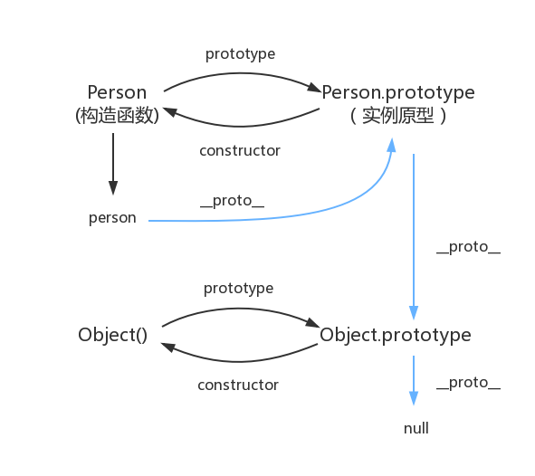

JavaScript

#### JS数据类型

**七种基本数据类型**：undefined、null、number、boolean、string、symbol(ES6)、BigInt(ES10)。

**引用数据类型**：Object、Array、RegExp、Date、Function（在JS中除了基本数据类型以外的都是对象，数据是对象，函数是对象，正则表达式是对象）

基本数据类型是指存放在栈中的简单数据段，数据大小确定，内存空间大小可以分配，它们是直接按值存放的，所以可以直接按值访问，属于被频繁使用的数据，所以存储在栈中。基本数据类型的值是不可变的，任何方法都无法改变一个基本类型的值，当这个变量重新赋值后看起来变量的值是改变了，但是这里变量名只是指向变量的一个指针，所以改变的是指针的指向改变，该变量是不变的，但是引用类型可以改变。

引用类型是存放在堆内存中的对象，变量其实是保存的在栈内存中的一个指针（保存的是堆内存中的引用地址），这个指针指向堆内存。如果存储在栈中，将会影响程序运行的性能。


```js
console.log(typeof 2);               // number
console.log(typeof true);            // boolean
console.log(typeof 'str');           // string
console.log(typeof []);              // object    
console.log(typeof function(){});    // function
console.log(typeof {});              // object
console.log(typeof undefined);       // undefined
console.log(typeof null);            // object
```

```js
var x = "John";
var y = new String("John");
typeof x // 返回 String
typeof y // 返回 Object
```

不要创建 String 对象。它会拖慢执行速度，并可能产生其他副作用。

NaN 的数据类型是 number。


#### JS外部引用

```html
<!-- 在html文件中引用外部名为javascript.js文件 -->
<html lang="en">
    <head>
        <meta charset="UTF-8">
        <title>Title</title>
        <script src="javascript.js"></script>
    </head>
</html>


<!-- 在html文件中插入js语句 -->
<html lang="en">
    <head>
        <meta charset="UTF-8">
        <title>Title</title>
        <script>
        	var number=100;
            document.write("<h1>"+number+"</h1>");         	//效果同<h1>100</h1>
            
            var name=prompt("你的名字是：","")                //弹出问题对话框，后面的引号为答案
            document.write("<h1>"+name+"</h1>");   
        </script>
    </head>
</html>
```


#### JS判断类型

- **typeof**

  typeof检测不出null 和 数组，结果都为object，所以typeof常用于检测基本类型
  console.log(typeof true) // boolean

- **instanceof**

  instanceof**只能正确判断引用数据类型**，不能检测出number、boolean、string、undefined、null、symbol等基本数据类型，**其内部运行机制是判断在其原型链中能否找到该类型的原型**。所以instancof常用于检测复杂类型以及级成关系，`instanceof` 运算符可以用来测试一个对象在其原型链中是否存在一个构造函数的 `prototype` 属性。

  ```js
  console.log(2 instanceof Number);                    // false
  console.log(true instanceof Boolean);                // false 
  console.log('str' instanceof String);                // false 
   
  console.log([] instanceof Array);                    // true
  console.log(function(){} instanceof Function);       // true
  console.log({} instanceof Object);                   // true
  ```

- **constructor**

  null、undefined没有construstor方法，因此constructor不能判断undefined和null。但是contructor的指向是可以被改变，所以不安全。

  ```js
  console.log((2).constructor === Number); // true
  console.log((true).constructor === Boolean); // true
  console.log(('str').constructor === String); // true
  console.log(([]).constructor === Array); // true
  console.log((function() {}).constructor === Function); // true
  console.log(({}).constructor === Object); // true
  ```

  `constructor`有两个作用，一是判断数据的类型，二是对象实例通过 `constrcutor` 对象访问它的构造函数。需要注意，如果创建一个对象来改变它的原型，`constructor`就不能用来判断数据类型了：

  ```javascript
  function Fn(){};
   
  Fn.prototype = new Array();
   
  var f = new Fn();
   
  console.log(f.constructor===Fn);    // false
  console.log(f.constructor===Array); // true
  ```

- **Object.prototype.toString.call**

  Object.prototype.toString.call全类型都可以判断。

  Object.prototype.toString.call([1, 2])	 // [object Array]

  ```js
  var a = Object.prototype.toString;
   
  console.log(a.call(2));
  console.log(a.call(true));
  console.log(a.call('str'));
  console.log(a.call([]));
  console.log(a.call(function(){}));
  console.log(a.call({}));
  console.log(a.call(undefined));
  console.log(a.call(null));
  ```

  同样是检测对象obj调用toString方法，obj.toString()的结果和Object.prototype.toString.call(obj)的结果不一样，这是为什么？

  这是因为toString是Object的原型方法，而Array、function等**类型作为Object的实例，都重写了toString方法**。不同的对象类型调用toString方法时，根据原

  型链的知识，调用的是对应的重写之后的toString方法（function类型返回内容为函数体的字符串，Array类型返回元素组成的字符串…），而不会去调用

  Object上原型toString方法（返回对象的具体类型），所以采用obj.toString()不能得到其对象类型，只能将obj转换为字符串类型；因此，在想要得到对象的具

  体类型时，应该调用Object原型上的toString方法。

------

##### 判断数组方法

- 通过Object.prototype.toString.call()做判断

```javascript
Object.prototype.toString.call(obj).slice(8,-1) === 'Array';
```

- 通过原型链做判断

```javascript
obj.__proto__ === Array.prototype;
```

- 通过ES6的Array.isArray()做判断

```javascript
Array.isArrray(obj);
```

- 通过instanceof做判断

```javascript
obj instanceof Array
```

- 通过Array.prototype.isPrototypeOf

```javascript
Array.prototype.isPrototypeOf(obj)
```

------

##### undefined 和 null 区别

- null
  什么都没有，表示一个空对象引用（主动释放一个变量引用的兑现那个，表示一个变量不再指向任何引用地址）。

- undefined
  没有设置值的变量，会自动赋值undefined。undefined 在 JavaScript 中不是一个保留字，这意味着可以使用 undefined 来作为一个变量名，但是这样的做法是非常危险的，它会影响对 undefined 值的判断。我们可以通过一些方法获得安全的 undefined 值，比如说 void 0。

- 区别

  ```js
  typeof undefined             // undefined
  typeof null                  // object
  null === undefined           // false
  null == undefined            // true
  ```

------

##### typeof null 的结果为什么是Object

在 JavaScript 第一个版本中，所有值都存储在 32 位的单元中，每个单元包含一个小的 **类型标签(1-3 bits)** 以及当前要存储值的真实数据。类型标签存储在每个单元的低位中，共有五种数据类型：

```javascript
000: object   - 当前存储的数据指向一个对象。
  1: int      - 当前存储的数据是一个 31 位的有符号整数。
010: double   - 当前存储的数据指向一个双精度的浮点数。
100: string   - 当前存储的数据指向一个字符串。
110: boolean  - 当前存储的数据是布尔值。
```

如果最低位是 1，则类型标签标志位的长度只有一位；如果最低位是 0，则类型标签标志位的长度占三位，为存储其他四种数据类型提供了额外两个 bit 的长度。

有两种特殊数据类型：

- undefined的值是 (-2)30(一个超出整数范围的数字)；
- null 的值是机器码 NULL 指针(null 指针的值全是 0)

那也就是说null的类型标签也是000，和Object的类型标签一样，所以会被判定为Object。

------

##### typeof NaN

NaN 指“不是一个数字”（not a number），NaN 是一个“警戒值”（sentinel value，有特殊用途的常规值），用于指出数字类型中的错误情况，即“执行数学运算没有成功，这是失败后返回的结果”。

```javascript
typeof NaN; // "number"
```

NaN 是一个特殊值，它和自身不相等，是唯一一个非自反（自反，reflexive，即 x === x 不成立）的值。而 NaN !== NaN 为 true。

------

##### isNaN 和 Number.isNaN 函数的区别

- 函数 isNaN 接收参数后，会尝试将这个参数转换为数值，任何不能被转换为数值的的值都会返回 true，因此非数字值传入也会返回 true ，会影响 NaN 的判断。
- 函数 Number.isNaN 会首先判断传入参数是否为数字，如果是数字再继续判断是否为 NaN ，不会进行数据类型的转换，这种方法对于 NaN 的判断更为准确。

------

##### JS判断相等原理

在相等运算中，应注意以下几个问题：

- 如果`x`不是正常值（比如抛出一个错误），中断执行。

- 如果`y`不是正常值，中断执行。

- 如果`Type(x)`与`Type(y)`相同，执行严格相等运算`x === y`。

- 如果`x`是`null`，`y`是`undefined`，返回`true`。

- 如果`x`是`undefined`，`y`是`null`，返回`true`。

- 如果`Type(x)`是数值，`Type(y)`是字符串，返回`x == ToNumber(y)`的结果。

- 如果`Type(x)`是字符串，`Type(y)`是数值，返回`ToNumber(x) == y`的结果。

- 如果`Type(x)`是布尔值，返回`ToNumber(x) == y`的结果。

- 如果`Type(y)`是布尔值，返回`x == ToNumber(y)`的结果。

- 如果`Type(x)`是字符串或数值或`Symbol`值，`Type(y)`是对象，返回`x == ToPrimitive(y)`的结果。

- 如果`Type(x)`是对象，`Type(y)`是字符串或数值或`Symbol`值，返回`ToPrimitive(x) == y`的结果。

  ```js
  '1' == { name: 'js' }       '1' == '[object Object]'
  ```

- 返回`false`。

  由于`0`的类型是数值，`null`的类型是Null。因此上面的前11步都得不到结果，要到第12步才能得到`false`。

------

##### 数值转换规则

**其他值转成数值的规则**

- Undefined 类型的值转换为 NaN。
- Null 类型的值转换为 0。
- Boolean 类型的值，true 转换为 1，false 转换为 0。
- String 类型的值转换如同使用 Number() 函数进行转换，如果包含非数字值则转换为 NaN，空字符串为 0。
- Symbol 类型的值不能转换为数字，会报错。
- 对象（包括数组）会首先被转换为相应的基本类型值，如果返回的是非数字的基本类型值，则再遵循以上规则将其强制转换为数字。

为了将值转换为相应的基本类型值，抽象操作 ToPrimitive 会首先（通过内部操作 DefaultValue）检查该值是否有valueOf()方法。如果有并且返回基本类型值，就使用该值进行强制类型转换。如果没有就使用 toString() 的返回值（如果存在）来进行强制类型转换。

如果 valueOf() 和 toString() 均不返回基本类型值，会产生 TypeError 错误。

**其他值转成布尔值的规则**

以下这些是假值：

-  undefined 
-  null 
- false
- +0、-0
- NaN
-  ""

假值的布尔强制类型转换结果为 false。从逻辑上说，假值列表以外的都应该是真值。

------

##### ==和===、以及Object.is的区别

- ==

使用双等号（==）进行相等判断时，如果两边的类型不一致，则会进行强制类型转化后再进行比较。

" "==0  //true

"0"==0  //true

" " !="0" //true

123=="123" //true

null==undefined //true

- 使用三等号（===）进行相等判断时，如果两边的类型不一致时，不会做强制类型准换，直接返回 false。

- Object.is

使用 Object.is 来进行相等判断时，一般情况下和三等号的判断相同，它处理了一些特殊的情况，比如 -0 和 +0 不再相等，两个 NaN 是相等的。

主要的区别就是+0 ！= -0 而NaN == NaN

Object.is(NaN, NaN);  		//true

console.log(+0 === -0);	 	//false

(相对比===和==的改进)

------

##### || 和 && 操作符的返回值

|| 和 && 首先会对第一个操作数执行条件判断，如果其不是布尔值就先强制转换为布尔类型，然后再执行条件判断。

- 对于 || 来说，如果条件判断结果为 true 就返回第一个操作数的值，如果为 false 就返回第二个操作数的值。
- && 则相反，如果条件判断结果为 true 就返回第二个操作数的值，如果为 false 就返回第一个操作数的值。

|| 和 && 返回它们其中一个操作数的值，而非条件判断的结果。

------

#####  JavaScript 中的包装类型

在 JavaScript 中，基本类型是没有属性和方法的，但是为了便于操作基本类型的值，在调用基本类型的属性或方法时 JavaScript 会在后台隐式地将基本类型的值转换为对象，如：

```javascript
const a = "abc";
a.length; // 3
a.toUpperCase(); // "ABC"
```

在访问`'abc'.length`时，JavaScript 将`'abc'`在后台转换成`String('abc')`，然后再访问其`length`属性。

JavaScript也可以使用`Object`函数显式地将基本类型转换为包装类型：

```javascript
var a = 'abc'
Object(a) // String {"abc"}
```

也可以使用`valueOf`方法将包装类型倒转成基本类型：

```javascript
var a = 'abc'
var b = Object(a)
var c = b.valueOf() // 'abc'
```

看看如下代码会打印出什么：

```javascript
var a = new Boolean( false );
if (!a) {
	console.log( "Oops" ); // never runs
}
```

答案是什么都不会打印，因为虽然包裹的基本类型是`false`，但是`false`被包裹成包装类型后就成了对象，所以其非值为`false`，所以循环体中的内容不会运行。

------

##### ToPrimitive

首先要介绍`ToPrimitive`方法，这是 JavaScript 中每个值隐含的自带的方法，用来将值 （无论是基本类型值还是对象）转换为基本类型值。如果值为基本类型，则直接返回值本身；如果值为对象，其看起来大概是这样：

```js
/**
* @obj 需要转换的对象
* @type 期望的结果类型
*/
ToPrimitive(obj, type)
```

`type`的值为`number`或者`string`。

**（1）当**`type`**为**`number`**时规则如下：**

- 调用`obj`的`valueOf`方法，如果为原始值，则返回，否则下一步；
- 调用`obj`的`toString`方法，后续同上；
- 抛出`TypeError` 异常。

**（2）当**`type`**为**`string`**时规则如下：**

- 调用`obj`的`toString`方法，如果为原始值，则返回，否则下一步；
- 调用`obj`的`valueOf`方法，后续同上；
- 抛出`TypeError` 异常。

可以看出两者的主要区别在于调用`toString`和`valueOf`的先后顺序。默认情况下：

- 如果对象为 Date 对象，则`type`默认为`string`；
- 其他情况下，`type`默认为`number`。

总结上面的规则，对于 Date 以外的对象，转换为基本类型的大概规则可以概括为一个函数：

```js
var objToNumber = value => Number(value.valueOf().toString())
objToNumber([]) === 0
objToNumber({}) === NaN
```

而 JavaScript 中的隐式类型转换主要发生在`+、-、*、/`以及`==、>、<`这些运算符之间。而这些运算符只能操作基本类型值，所以在进行这些运算前的第一步就是将两边的值用`ToPrimitive`转换成基本类型，再进行操作。


####  let、const、var

##### 属性对比

**（1）块级作用域：** 块作用域由 `{ }`包括，let和const具有块级作用域，var不存在块级作用域。块级作用域解决了ES5中的两个问题：

- 内层变量可能覆盖外层变量
- 用来计数的循环变量泄露为全局变量

**（2）变量提升：** var存在变量提升，let和const不存在变量提升，即在变量只能在声明之后使用，否则会报错。

**（3）给全局添加属性：** 浏览器的全局对象是window，Node的全局对象是global。var声明的变量为全局变量，并且会将该变量添加为全局对象的属性，但是let和const不会。

**（4）重复声明：** var声明变量时，可以重复声明变量，后声明的同名变量会覆盖之前声明的遍历。const和let不允许重复声明变量。

**（5）暂时性死区：** 在使用let、const命令声明变量之前，该变量都是不可用的。这在语法上，称为**暂时性死区**。**使用var声明的变量不存在暂时性死区**。

**（6）初始值设置：** 在变量声明时，var 和 let 可以不用设置初始值。而const声明变量必须设置初始值。

**（7）指针指向：** let和const都是ES6新增的用于创建变量的语法。 let创建的变量是可以更改指针指向（可以重新赋值）。但const声明的变量是不允许改变指针的指向。

------

##### const对象的属性可以修改吗

const保证的并不是变量的值不能改动，而是变量指向的那个内存地址不能改动。对于基本类型的数据（数值、字符串、布尔值），其值就保存在变量指向的那个内存地址，因此等同于常量。

但对于引用类型的数据（主要是对象和数组）来说，变量指向数据的内存地址，保存的只是一个指针，const只能保证这个指针是固定不变的，至于它指向的数据结构是不是可变的，就完全不能控制了。


#### 变量提升

JavaScript 中，函数及变量的声明都将被提升到函数的最顶部。

JavaScript 中，变量可以在使用后声明，也就是变量可以先使用再声明。

以下两个实例将获得相同的结果：

```js
x = 5; // 变量 x 设置为 5

elem = document.getElementById("demo"); // 查找元素
elem.innerHTML = x;                     // 在元素中显示 x

var x; // 声明 x
```

```js
var x; // 声明 x
x = 5; // 变量 x 设置为 5

elem = document.getElementById("demo"); // 查找元素
elem.innerHTML = x;                     // 在元素中显示 x
```

变量提升：函数声明和变量声明总是会被解释器悄悄地被"提升"到方法体的最顶部**。JavaScript 只有声明的变量会提升，初始化的不会**。

**const 关键字定义的变量则不可以在使用后声明**，也就是变量需要先声明再使用。

JavaScript 严格模式(strict mode)不允许使用未声明的变量。

造成变量声明提升的**本质原因**是 js 引擎在代码执行前有一个解析的过程，创建了执行上下文，初始化了一些代码执行时需要用到的对象。当访问一个变量时，会到当前执行上下文中的作用域链中去查找，而作用域链的首端指向的是当前执行上下文的变量对象，这个变量对象是执行上下文的一个属性，它包含了函数的形参、所有的函数和变量声明，这个对象的是在代码解析的时候创建的。

首先要知道，JS在拿到一个变量或者一个函数的时候，会有两步操作，即解析和执行。

- 在解析阶段

  JS会检查语法，并对函数进行预编译。解析的时候会先创建一个全局执行上下文环境，先把代码中即将执行的变量、函数声明都拿出来，变量先赋值为undefined，函数先声明好可使用。在一个函数执行之前，也会创建一个函数执行上下文环境，跟全局执行上下文类似，不过函数执行上下文会多出this、arguments和函数的参数。

  - 全局上下文：变量定义，函数声明
  - 函数上下文：变量定义，函数声明，this，arguments

- 在执行阶段，就是按照代码的顺序依次执行。

那为什么会进行变量提升呢？主要有以下两个原因：

- 提高性能
- 容错性更好

**（1）提高性能** 在JS代码执行之前，会进行语法检查和预编译，并且这一操作只进行一次。这么做就是为了提高性能，如果没有这一步，那么每次执行代码前都必须重新解析一遍该变量（函数），而这是没有必要的，因为变量（函数）的代码并不会改变，解析一遍就够了。

在解析的过程中，还会为函数生成预编译代码。在预编译时，会统计声明了哪些变量、创建了哪些函数，并对函数的代码进行压缩，去除注释、不必要的空白等。这样做的好处就是每次执行函数时都可以直接为该函数分配栈空间（不需要再解析一遍去获取代码中声明了哪些变量，创建了哪些函数），并且因为代码压缩的原因，代码执行也更快了。

**（2）容错性更好**

变量提升可以在一定程度上提高JS的容错性，看下面的代码：

```javascript
a = 1; var a; console.log(a);
```

如果没有变量提升，这两行代码就会报错，但是因为有了变量提升，这段代码就可以正常执行。

虽然，在可以开发过程中，可以完全避免这样写，但是有时代码很复杂的时候。可能因为疏忽而先使用后定义了，这样也不会影响正常使用。由于变量提升的存在，而会正常运行。

**总结：**

- 解析和预编译过程中的声明提升可以提高性能，让函数可以在执行时**预先为变量分配栈空间**
- 声明提升**还可以提高JS代码的容错性**，使一些不规范的代码也可以正常执行

变量提升虽然有一些优点，但是他也会造成一定的问题，在ES6中提出了let、const来定义变量，它们就没有变量提升的机制。下面看一下变量提升可能会导致的问题：

```javascript
var tmp = new Date();

function fn(){
	console.log(tmp);
	if(false){
		var tmp = 'hello world';
	}
}

fn();  // undefined
```

在这个函数中，原本是要打印出外层的tmp变量，但是因为变量提升的问题，内层定义的tmp被提到函数内部的最顶部，相当于覆盖了外层的tmp，所以打印结果为undefined。

```javascript
var tmp = 'hello world';

for (var i = 0; i < tmp.length; i++) {
	console.log(tmp[i]);
}

console.log(i); // 11
```

由于遍历时定义的i会变量提升成为一个全局变量，在函数结束之后不会被销毁，所以打印出来11。

**函数提升**

```js
myFunction(5);

function myFunction(y) {
    return y * y;
}
```


#### 数组方法汇总

|    方法名     | 对应版本 |                             功能                             | 原数组是否改变 |
| :-----------: | :------: | :----------------------------------------------------------: | :------------: |
|    sort()     |   ES5-   |                  排序（字符规则），返回结果                  |       y        |
|   reverse()   |   ES5-   |                      反转数组，返回结果                      |       y        |
|     pop()     |   ES5-   |                删除最后一位，并返回删除的数据                |       y        |
|    push()     |   ES5-   |             在最后一位新增一或多个数据，返回长度             |       y        |
|   unshift()   |   ES5-   |              在第一位新增一或多个数据，返回长度              |       y        |
|    shift()    |   ES5-   |                 删除第一位，并返回删除的数据                 |       y        |
|   splice()    |   ES5-   |             删除指定位置，并替换，返回删除的数据             |       y        |
|               |          |                                                              |                |
|   concat()    |   ES5-   |                合并数组，并返回合并之后的数据                |       n        |
|    join()     |   ES5-   |              使用分隔符，将数组转为字符串并返回              |       n        |
|    slice()    |   ES5-   |                  截取指定位置的数组，并返回                  |       n        |
|  toString()   |   ES5-   |                    直接转为字符串，并返回                    |       n        |
|   valueOf()   |   ES5-   |                     返回数组对象的原始值                     |       n        |
|   indexOf()   |   ES5    |                     查询并返回数据的索引                     |       n        |
| lastIndexOf() |   ES5    |                   反向查询并返回数据的索引                   |       n        |
|   forEach()   |   ES5    | 参数为回调函数，会遍历数组所有的项，回调函数接受三个参数，分别为value，index，self；forEach没有返回值 |       n        |
|     map()     |   ES5    |     同forEach，同时回调函数返回数据，组成新数组由map返回     |       n        |
|   filter()    |   ES5    | 同forEach，同时回调函数返回布尔值，为true的数据组成新数组由filter返回 |       n        |
|    every()    |   ES5    | 同forEach，同时回调函数返回布尔值，全部为true，由every返回true |       n        |
|    some()     |   ES5    | 同forEach，同时回调函数返回布尔值，只要由一个为true，由some返回true |       n        |
|   reduce()    |   ES5    | 归并，同forEach，迭代数组的所有项，并构建一个最终值，由reduce返回 |       n        |
| reduceRight() |   ES5    | 反向归并，同forEach，迭代数组的所有项，并构建一个最终值，由reduceRight返回 |       n        |

------

##### forEach能不能修改原数组

forEach()方法会针对每一个元素执行提供的函数，对数据的操作一般不会改变原数组，该方法没有返回值；**使用break不能中断循环，使用return也不能返回到外层函数。**

- **基本类型的数据，是改不动的**
- **引用数据类型的是可以更改的**
- **也不能改变整个引用数据的值**

```js
const arr1 = [
    { id: 1, value: 1 },
    { id: 2, value: 2 },
    { id: 3, value: 3 },
    { id: 4, value: 4 },
    { id: 5, value: 5 },
]
arr1.forEach((item, index) => {
    if (item.id === 1) {
        item.value *= 10
    }
})
```

将第一段代码放入浏览器控制台执行完以后，打印数组arr1浏览器

```js
[
    0: {id: 1, value: 10}
    1: {id: 2, value: 2}
    2: {id: 3, value: 3}
    3: {id: 4, value: 4}
    4: {id: 5, value: 5}
]
```

接着咱们来看下第二段代码：函数

```js
const arr2 = [
    { id: 1, value: 1 },
    { id: 2, value: 2 },
    { id: 3, value: 3 },
    { id: 4, value: 4 },
    { id: 5, value: 5 },
]
arr2.forEach((item, index) => {
    if (item.id === 1) {
        item = { id: 6, value: 6 }
    }
})
```

将第二段代码放入浏览器控制台执行完以后，打印数组arr2：翻译

```js
[
    0: {id: 1, value: 1}
    1: {id: 2, value: 2}
    2: {id: 3, value: 3}
    3: {id: 4, value: 4}
    4: {id: 5, value: 5}
]
```

咱们能够发现arr2中 [id = 1] 的元素并没有被替换成咱们指望的code

```js
{ id: 6, value: 6 }
```

固然，最后我会说怎么在forEach遍历过程当中去替换原数组中的元素，如今咱们先来讨论下，为何会出现 [id = 1] 的元素为何没有被替换掉：对象

要想探究缘由，咱们就得将上述数组用照妖镜照一照，看看它的真面目到底是如何内存

js中的数组类型，分为两大类，
一类是值类型 数值、布尔值、null、undefined
一类是引用类型 对象、数组、函数虚拟机

看下面代码，简单说明js字面量建立对象的过程 ：it

```js
let obj = { id: 1, name: 2 }
//虚拟机在执行到 { id: 1, name: 2 } 就会在内存中建立一个对象
//这个对象在内存中的地址假如为 0x1110，再将此地址赋值给变量obj
//此时obj的值实际为0x1110
```

理解了上述js建立过程，那么咱们来揭开arr2数组的真实面纱io

```js
//内存地址是16进制数表示，如下地址仅为说明问题
const arr2 = [
    0x1110, 0x1111, 0x1112, 0x1113, 0x1114
]
```

看到arr2的真实面目，相信各位小伙伴应该明白了，上面展现的第二段代码为何无效

```js
//那么咱们就来看看为何下面item没有被替换
arr2.forEach((item, index) => {
    //咱们在遍历的过程当中，咱们拿到的item值实际上是
    //0x1110, 0x1111, 0x1112, 0x1113, 0x1114 5个地址
    if (item.id === 1) {
        //{ id: 6, value: 6 } 是对象的字面量建立方式，会在内存中
        //建立一个对象，并返回对象地址 假如为 0x1115
        item = { id: 6, value: 6 }
        //咱们再将 item = { id: 6, value: 6 } 语句翻译一下
        //0x1110 = 0x1115
        //看到问题了吗？将一个16进制数赋值给另一个16进制数
        //其实这段是无效的赋值，也就被浏览器给忽略了，因此咱们在
        //打印出得结果中发现 元素{id: 1, value: 1}并无被替换成{id: 6, value: 6}
    }
})
```

可能有些初学小伙伴有疑问，既然咱们在遍历的过程当中拿到的是一个内存地址，那么在最开始第一段代码中，为何又能将元素{ id: 1, value: 1 }的value值改变为10呢，那么请给我留言，不在这里展开这个问题。

最后总结，forEach和map遍历中 若是想改原数组，经过下面方式就好了

```js
arr.forEach((item, index) => {
    if (condition) {
        arr[index] = something;
    }
})
```

------

##### for...in和for...of的区别

for…of 是ES6新增的遍历方式，允许遍历一个含有iterator接口的数据结构（数组、对象等）并且返回各项的值，和ES3中的for…in的区别如下

- for…of 遍历获取的是对象的**键值（value）**，for…in 获取的是对象的**键名（key）**；
- for… in 会**遍历对象的整个原型链**，性能非常差不推荐使用，而 for … of **只遍历当前对象不会遍历原型链**；
- 对于数组的遍历，for…in 会返回数组中所有可枚举的属性(包括原型链上可枚举的属性)，for…of 只返回数组的下标对应的属性值；

**遍历数组**

```js
Array.prototype.method=function(){
　　console.log(this.length);
}
var myArray=["one", "two", "three"]
myArray.name="数组"
for (let index in myArray) {
  console.log(index);
}
//输出0 1 2 name method
```

**for...in遍历数组的毛病**

1.index索引为字符串型数字，不能直接进行几何运算

2.遍历顺序有可能不是按照实际数组的内部顺序

3.使用for in会遍历数组所有的可枚举属性，包括原型。例如上例的原型方法method和name属性

所以for in更适合遍历对象，不要使用for in遍历数组。

```js
Array.prototype.method=function(){
　　console.log(this.length);
}
var myArray=["one", "two", "three"]
myArray.name="数组";
for (let value of myArray) {
  console.log(value);
}
//输出one two three
```

**遍历对象**

```js
Object.prototype.method=function(){
　　console.log(this);
}
var myObject={
　　a:1,
　　b:2,
　　c:3
}
for (let key in myObject) {
  console.log(key);
}
//输出a b c method
```

for in 可以遍历到myObject的原型方法method，如果不想遍历原型方法和属性的话，可以在循环内部判断一下，**hasOwnPropery方法可以判断某属性是否是该对象的实例属性**。

```js
for (var key in myObject) {
　　if(myObject.hasOwnProperty(key)){
　　　　console.log(key);
　　}
}
```

**同样可以通过ES5的Object.keys(myObject)获取对象的实例属性组成的数组，不包括原型方法和属性**

**总结：**

-  for...in 循环主要是为了遍历对象而生，不适用于遍历数组；for...of 循环可以用来遍历数组、类数组对象，字符串、Set、Map 以及 Generator 对象。

- for..of适用遍历数/数组对象/字符串/map/set等拥有迭代器对象的集合，但是**不能遍历对象，因为没有迭代器对象**。与forEach()不同的是，它可以正确响应break、continue和return语句。

- for-of循环不支持普通对象，但如果你想迭代一个对象的属性，你可以用for-in循环（这也是它的本职工作）或内建的Object.keys()方法：

  ```js
  for (var key of Object.keys(someObject)) {
    console.log(key + ": " + someObject[key]);
  }
  ```


#### 箭头函数与普通函数的区别

**（1）箭头函数比普通函数更加简洁**

- 如果没有参数，就直接写一个空括号即可
- 如果只有一个参数，可以省去参数的括号
- 如果有多个参数，用逗号分割
- 如果函数体的返回值只有一句，可以省略大括号
- 如果函数体不需要返回值，且只有一句话，可以给这个语句前面加一个void关键字。最常见的就是调用一个函数：

```javascript
let fn = () => void doesNotReturn();
```

**（2）箭头函数没有自己的this**

箭头函数不会创建自己的this， 所以它没有自己的this，它只会在自己作用域的上一层继承this。所以箭头函数中this的指向在它在定义时已经确定了，之后不会改变。

**（3）箭头函数继承来的this指向永远不会改变**

```javascript
var id = 'GLOBAL';
var obj = {
  id: 'OBJ',
  a: function(){
    console.log(this.id);
  },
  b: () => {
    console.log(this.id);
  }
};
obj.a();    // 'OBJ'
obj.b();    // 'GLOBAL'
new obj.a()  // undefined
new obj.b()  // Uncaught TypeError: obj.b is not a constructor
```

对象obj的方法b是使用箭头函数定义的，这个函数中的this就永远指向它定义时所处的全局执行环境中的this，即便这个函数是作为对象obj的方法调用，this依旧指向Window对象。需要注意，定义对象的大括号`{}`是无法形成一个单独的执行环境的，它依旧是处于全局执行环境中。

**（4）call()、apply()、bind()等方法不能改变箭头函数中this的指向**

```javascript
var id = 'Global';
let fun1 = () => {
    console.log(this.id)
};
fun1();                     // 'Global'
fun1.call({id: 'Obj'});     // 'Global'
fun1.apply({id: 'Obj'});    // 'Global'
fun1.bind({id: 'Obj'})();   // 'Global'
```

**（5）箭头函数不能作为构造函数使用**

构造函数在new的步骤在上面已经说过了，实际上第二步就是将函数中的this指向该对象。 但是由于箭头函数时没有自己的this的，且this指向外层的执行环境，且不能改变指向，所以不能当做构造函数使用。

**（6）箭头函数没有自己的arguments**

箭头函数没有自己的arguments对象。在箭头函数中访问arguments实际上获得的是它外层函数的arguments值。

**（7）箭头函数没有prototype**

**（8）箭头函数不能用作Generator函数，不能使用yeild关键字**


#### map和weakMap的区别

**（1）Map** map本质上就是键值对的集合，但是普通的Object中的键值对中的键只能是字符串。而ES6提供的Map数据结构类似于对象，但是它的键不限制范围，可以是任意类型，是一种更加完善的Hash结构。如果Map的键是一个原始数据类型，只要两个键严格相同，就视为是同一个键。

实际上Map是一个数组，它的每一个数据也都是一个数组，其形式如下：

```javascript
const map = [
     ["name","张三"],
     ["age",18],
]
```

Map数据结构有以下操作方法：

- **size**： `map.size` 返回Map结构的成员总数。
- **set(key,value)**：设置键名key对应的键值value，然后返回整个Map结构，如果key已经有值，则键值会被更新，否则就新生成该键。（因为返回的是当前Map对象，所以可以链式调用）
- **get(key)**：该方法读取key对应的键值，如果找不到key，返回undefined。
- **has(key)**：该方法返回一个布尔值，表示某个键是否在当前Map对象中。
- **delete(key)**：该方法删除某个键，返回true，如果删除失败，返回false。
- **clear()**：map.clear()清除所有成员，没有返回值。

Map结构原生提供是三个遍历器生成函数和一个遍历方法

- keys()：返回键名的遍历器。
- values()：返回键值的遍历器。
- entries()：返回所有成员的遍历器。
- forEach()：遍历Map的所有成员。

```javascript
const map = new Map([
     ["foo",1],
     ["bar",2],
])
for(let key of map.keys()){
    console.log(key);  // foo bar
}
for(let value of map.values()){
     console.log(value); // 1 2
}
for(let items of map.entries()){
    console.log(items);  // ["foo",1]  ["bar",2]
}
map.forEach( (value,key,map) => {
     console.log(key,value); // foo 1    bar 2
})
```

**（2）WeakMap** WeakMap 对象也是一组键值对的集合，其中的键是弱引用的。**其键必须是对象**，原始数据类型不能作为key值，而值可以是任意的。

该对象也有以下几种方法：

- **set(key,value)**：设置键名key对应的键值value，然后返回整个Map结构，如果key已经有值，则键值会被更新，否则就新生成该键。（因为返回的是当前Map对象，所以可以链式调用）
- **get(key)**：该方法读取key对应的键值，如果找不到key，返回undefined。
- **has(key)**：该方法返回一个布尔值，表示某个键是否在当前Map对象中。
- **delete(key)**：该方法删除某个键，返回true，如果删除失败，返回false。

其clear()方法已经被弃用，所以可以通过创建一个空的WeakMap并替换原对象来实现清除。

WeakMap的设计目的在于，有时想在某个对象上面存放一些数据，但是这会形成对于这个对象的引用。一旦不再需要这两个对象，就必须手动删除这个引用，否则垃圾回收机制就不会释放对象占用的内存。

而WeakMap的**键名所引用的对象都是弱引用**，即垃圾回收机制不将该引用考虑在内。因此，只要所引用的对象的其他引用都被清除，垃圾回收机制就会释放该对象所占用的内存。也就是说，一旦不再需要，WeakMap 里面的**键名对象和所对应的键值对会自动消失，不用手动删除引用**。

**总结：**

- Map 数据结构。它类似于对象，也是键值对的集合，但是“键”的范围不限于字符串，各种类型的值（包括对象）都可以当作键。
- WeakMap 结构与 Map 结构类似，也是用于生成键值对的集合。但是 WeakMap 只接受对象作为键名（ null 除外），不接受其他类型的值作为键名。而且 WeakMap 的键名所指向的对象，不计入垃圾回收机制。


#### JSON

JSON 是一种基于文本的轻量级的数据交换格式。它可以被任何的编程语言读取和作为数据格式来传递。

在项目开发中，使用 JSON 作为前后端数据交换的方式。在前端通过将一个符合 JSON 格式的数据结构序列化为 JSON 字符串，然后将它传递到后端，后端通过 JSON 格式的字符串解析后生成对应的数据结构，以此来实现前后端数据的一个传递。

因为 JSON 的语法是基于 js 的，因此很容易将 JSON 和 js 中的对象弄混，但是应该注意的是 JSON 和 js 中的对象不是一回事，JSON 中对象格式更加严格，比如说在 JSON 中属性值不能为函数，不能出现 NaN 这样的属性值等，因此大多数的 js 对象是不符合 JSON 对象的格式的。

在 js 中提供了两个函数来实现 js 数据结构和 JSON 格式的转换处理，

- **JSON.stringify** 函数，通过传入一个符合 JSON 格式的数据结构，将其转换为一个 JSON 字符串。如果传入的数据结构不符合 JSON 格式，那么在序列化的时候会对这些值进行对应的特殊处理，使其符合规范。在前端向后端发送数据时，可以调用这个函数将数据对象转化为 JSON 格式的字符串。
- **JSON.parse()** 函数，这个函数用来将 JSON 格式的字符串转换为一个 js 数据结构，如果传入的字符串不是标准的 JSON 格式的字符串的话，将会抛出错误。当从后端接收到 JSON 格式的字符串时，可以通过这个方法来将其解析为一个 js 数据结构，以此来进行数据的访问。


#### 类数组

##### 如何遍历类数组

`arguments`是一个对象，它的属性是从 0 开始依次递增的数字，还有`callee`和`length`等属性，与数组相似；但是它却没有数组常见的方法属性，如`forEach`, `reduce`等，所以叫它们类数组。

要遍历类数组，有三个方法：

（1）将数组的方法应用到类数组上，这时候就可以使用`call`和`apply`方法，如：

```javascript
function foo(){ 
  Array.prototype.forEach.call(arguments, a => console.log(a))
}
```

（2）使用Array.from方法将类数组转化成数组：‌

```javascript
function foo(){ 
  const arrArgs = Array.from(arguments) 
  arrArgs.forEach(a => console.log(a))
}
```

（3）使用展开运算符将类数组转化成数组

```javascript
function foo(){ 
    const arrArgs = [...arguments] 
    arrArgs.forEach(a => console.log(a)) 
}
```

------

##### 如何将类数组转化为数组

- 通过 call 调用数组的 slice 方法来实现转换

```javascript
Array.prototype.slice.call(arrayLike);
```

- 通过 call 调用数组的 splice 方法来实现转换

```javascript
Array.prototype.splice.call(arrayLike, 0);
```

- 通过 apply 调用数组的 concat 方法来实现转换

```javascript
Array.prototype.concat.apply([], arrayLike);
```

- 通过 Array.from 方法来实现转换

```javascript
Array.from(arrayLike);
```


#### JS中的this指向

##### 函数调用

案例：

```js
var obj = {
  foo: function(){
    console.log(this)
  }
}

var bar = obj.foo
obj.foo() // 打印出的 this 是 obj
bar() // 打印出的 this 是 window
```

JS（ES5）里面有三种函数调用形式：

```js
func(p1, p2) 
obj.child.method(p1, p2)
func.call(context, p1, p2) // 先不讲 apply
```

一般，初学者都知道前两种形式，而且认为前两种形式「优于」第三种形式。其实第三种调用形式，才是正常调用形式。

其他两种都是语法糖，可以等价地变为 call 形式：

```js
func(p1, p2) 等价于
func.call(undefined, p1, p2)

obj.child.method(p1, p2) 等价于
obj.child.method.call(obj.child, p1, p2)
```

请记下来。（我们称此代码为「转换代码」，方便下文引用）至此我们的函数调用只有一种形式。

this，就是上面代码中的 context。就这么简单。

this 是你 call 一个函数时传的 context，由于你从来不用 call 形式的函数调用，所以你一直不知道。

先看 func(p1, p2) 中的 this 如何确定：

当你写下面代码时

```js
function func(){
  console.log(this)
}
func()
```

用「转换代码」把它转化一下，得到

```text
function func(){
  console.log(this)
}
func.call(undefined) // 可以简写为 func.call()
```

按理说打印出来的 this 应该就是 undefined 了吧，但是浏览器里有一条规则：

> 如果你传的 context 是 null 或 undefined，那么 window 对象就是默认的 context（严格模式下默认 context 是 undefined）

因此上面的打印结果是 window。

如果你希望这里的 this 不是 window，很简单：

```text
func.call(obj) // 那么里面的 this 就是 obj 对象
```

再看 obj.child.method(p1, p2) 的 this 如何确定:

```text
var obj = {
  foo: function(){
    console.log(this)
  }
}

obj.foo() 
```

按照「转换代码」，我们将 obj.foo() 转换为

```text
obj.foo.call(obj)
```

好了，this 就是 obj。搞定。

回到案例：

```text
var obj = {
  foo: function(){
    console.log(this)
  }
}

var bar = obj.foo
obj.foo() // 转换为 obj.foo.call(obj)，this 就是 obj
bar() 
// 转换为 bar.call()
// 由于没有传 context
// 所以 this 就是 undefined
// 最后浏览器给你一个默认的 this —— window 对象
```

this 是执行上下文中的一个属性，它指向最后一次调用这个方法的对象。在实际开发中，this 的指向可以通过四种调用模式来判断。

- 第一种是**函数调用模式**，当一个函数不是一个对象的属性时，直接作为函数来调用时，this 指向全局对象。
- 第二种是**方法调用模式**，如果一个函数作为一个对象的方法来调用时，this 指向这个对象。
- 第三种是**构造器调用模式**，如果一个函数用 new 调用时，函数执行前会新创建一个对象，this 指向这个新创建的对象。
- 第四种是 **apply 、 call 和 bind 调用模式**，这三个方法都可以显示的指定调用函数的 this 指向。其中 apply 方法接收两个参数：一个是 this 绑定的对象，一个是参数数组。call 方法接收的参数，第一个是 this 绑定的对象，后面的其余参数是传入函数执行的参数。也就是说，在使用 call() 方法时，传递给函数的参数必须逐个列举出来。bind 方法通过传入一个对象，返回一个 this 绑定了传入对象的新函数。这个函数的 this 指向除了使用 new 时会被改变，其他情况下都不会改变。

这四种方式，**使用构造器调用模式的优先级最高**，然后是 apply、call 和 bind 调用模式，然后是方法调用模式，然后是函数调用模式。

------

##### [ ] 语法

```js
function fn (){ console.log(this) }
var arr = [fn, fn2]
arr[0]() // 这里面的 this 又是什么呢？
```

我们可以把 arr[0]（0）想象为arr.0( )，虽然后者的语法错了，但是形式与转换代码里的 obj.child.method(p1, p2) 对应上了，于是就可以愉快的转换了：

```js
arr[0]() 
假想为arr.0()
然后转换为arr.0.call(arr)
那么里面的 this 就是 arr 了
```

##### **箭头函数**

我不明白为什么需要讨论箭头函数，实际上箭头函数里并没有 this，如果你在箭头函数里看到 this，你直接把它当作箭头函数外面的 this 即可。外面的 this 是什么，箭头函数里面的 this 就还是什么，因为箭头函数本身不支持 this。

有人说「箭头函数里面的 this 指向箭头函数外面的 this」，这很傻，因为箭头函数内外 this 就是同一个东西，并不存在什么指向不指向。

函数作为对象提供了`call()`，`apply()` 方法，他们也可以用来调用函数，这两个方法都接受一个对象作为参数，用来指定本次调用时函数中this的指向；

##### call()方法

call方法使用的语法规则
函数名称.call(obj,arg1,arg2...argN);
参数说明:
obj:函数内this要指向的对象,
arg1,arg2...argN :参数列表，参数与参数之间使用一个逗号隔开

```js
var lisi = {names:'lisi'};
var zs = {names:'zhangsan'};
function f(age){
    console.log(this.names);
    console.log(age);
    
}
f(23);//undefined

//将f函数中的this指向固定到对象zs上；
f.call(zs,32);//zhangsan
```

##### apply()方法

函数名称.apply(obj,[arg1,arg2...,argN])
参数说明:
obj :this要指向的对象
[arg1,arg2...argN] : 参数列表，要求格式为数组

```js
var lisi = {name:'lisi'}; 
var zs = {name:'zhangsan'}; 
function f(age,sex){
    console.log(this.name+age+sex); 
}
//将f函数中的this指向固定到对象zs上；
f.apply(zs,[23,'nan']);
```

**注意：call和apply的作用一致，区别仅仅在函数实参参数传递的方式上；**

这个两个方法的最大作用基本就是用来强制指定函数调用时this的指向；

------

##### bind、apply和call的区别

通过apply和call改变函数的this指向，他们两个函数的第一个参数都是一样的表示要改变指向的那个对象，第二个参数，apply是数组，而call则是arg1,arg2...这种形式。通过bind改变this作用域会返回一个新的函数，这个函数不会马上执行。

**call**

原生的call函数：

```js
Function.prototype.call = function(context, ...args){
	context = context? Object(context) : window;
	// 改变 this 
	context.fn = this;
	// 执行函数
	return  context.fn(...args);
}
```

如下：

```js
function fn(){
	console.log(11)
}

function fn2(){
	console.log(22)
}
```

问：fn.call.call.call.call(fn2) 的结果是什么？

解析：

前面的一串 fn.call.call.call.call 并没有调用，只是获取对象的call属性，所以，这一串的结果是 Function.call 属性。

所以那一串 就是 Function.call.call(fn2)；还可以解理为 fn3.call(fn2)。

根据call的原理（可参考上面的call模拟），在 fn3执行call，其实际是这样执行的 fn2.fn3()。

由于 fn3实际上就是 call 函数，所以, fn2.fn3() 等价于 fn2.call()。

所以，上面那一串代码的最终结果，就是调用 fn2，所以结果输出 22。


#### 原型链

**实例对象->构造函数->原型**

【1】对象有属性`_proto_`，指向该对象的**构造函数**的原型对象。

【2】方法除了有属性`_proto_`，还有属性prototype，prototype指向该方法的原型对象。

在JS里，万物皆对象。方法（Function）是对象，方法的原型(Function.prototype)是对象。因此，它们都会具有对象共有的特点。

即：对象具有属性`_proto_`，可称为**隐式原型**，一个对象的隐式原型指向构造该对象的构造函数的原型，这也保证了实例能够访问在构造函数原型中定义的属性和方法。

方法这个特殊的对象，除了和其他对象一样有上述_proto_属性之外，还有自己特有的属性——**原型属性（prototype）**，这个属性是一个指针，指向一个对象，这个对象的用途就是包含所有实例共享的属性和方法（我们把这个对象叫做原型对象）。原型对象也有一个属性，叫做constructor，这个属性包含了一个指针，指回原构造函数。


如上图所示，person1、person2都是对象，对象具有`_proto_`属性，此隐式原型指向构造此对象的构造函数Person的原型Person.prototype。

方法Person也是对象，他有自己特有的属性prototype（原型属性），这个属性指向的对象，包含有所有实例共享的属性和方法（也称为原型对象），此原型对象也有一个属性constructor，constructor属性包含一个指针指向原构造函数Person。


**【1】构造函数Person()**

构造函数的原型属性Person.prototype指向了原型对象，在原型对象里有共有的方法，所有构造函数声明的实例（这里是person1，person2）都可以共享这些方法（sayName）。

**【2】原型对象Person.prototype**

Person.prototype保存着实例共享的方法（sayName），有一个指针constructor指回构造函数。

**【3】实例**

person1和person2是Person这个对象的两个实例，这两个对象也有属性`_proto_`，指向构造函数Person的原型对象，这样子就可以像上面【1】所说的访问原型对象的所有方法。这也就是为什么person1、person2都可以访问Person的原型对象Person.prototype的sayName方法。

**【4】构造函数Person()除了是方法，也是对象，它也有`_proto_`属性，指向谁呢？**

指向它的构造函数的原型对象，函数的构造函数是Function，因此这里的`_proto_`指向了Function.prototype。也就是上图中打印的`Person._proto_`: f(){**native code**}.

**其实除了Person()，Function()、Object()也是一样的道理。**

原型对象也是对象啊，它的`_proto_`属性，又指向谁呢？

同理，指向它的构造函数的原型对象，也就是说**Function.prototype对象的`_proto_`属性指向Object.prototype**。

最后，**Object.prototype的`_proto_`属性指向null**。

------

原型链顶端是Object.prototype

每个函数都有一个prototype属性，这个属性指向了一个对象，这个对象正是调用该函数而创建的实例的原型，那么什么是原型呢，可以这样理解，每一个JavaScript对象在创建的时候就会预制管理另一个对象，这个对象就是我们所说的原型，每一个对象都会从原型继承属性，如图：


那么怎么表示实例与实例原型的关系呢，这时候就要用到第二个属性`_proto_`

这是每一个JS对象都会有的一个属性，指向这个对象的原型，如图：


既然实例对象和构造函数都可以指向原型，那么原型是否有属性指向构造函数或者实例呢，指向实例是没有的，因为一个构造函数可以生成多个实例，但是原型有属性可以直接指向构造函数，通过constructor即可

接下来讲解实例和原型的关系：

当读取实例的属性时，如果找不到，就会查找与对象相关的原型中的属性，如果还查不到，就去找原型的原型，一直找到最顶层，那么原型的原型是什么呢，首先，原型也是一个对象，既然是对象，我们就可以通过构造函数的方式创建它，所以原型对象就是通过Object构造函数生成的，如图：


那么Object.prototype的原型呢，我们可以打印console.log(Object.prototype.`__proto__` === null)，返回true

null表示没有对象，即该处不应有值，所以Object.prototype没有原型，如图：



图中这条蓝色的线即是原型链

------

##### 原型修改、重写

```javascript
function Person(name) {
    this.name = name
}
// 修改原型
Person.prototype.getName = function() {}
var p = new Person('hello')
console.log(p.__proto__ === Person.prototype) // true
console.log(p.__proto__ === p.constructor.prototype) // true
// 重写原型
Person.prototype = {
    getName: function() {}
}
var p = new Person('hello')
console.log(p.__proto__ === Person.prototype)        // true
console.log(p.__proto__ === p.constructor.prototype) // false
```

可以看到修改原型的时候p的构造函数不是指向Person了，因为直接给Person的原型对象直接用对象赋值时，它的构造函数指向的了根构造函数Object，所以这时候`p.constructor === Object` ，而不是`p.constructor === Person`。要想成立，就要用constructor指回来：

```javascript
Person.prototype = {
    getName: function() {}
}
var p = new Person('hello')
p.constructor = Person
console.log(p.__proto__ === Person.prototype)        // true
console.log(p.__proto__ === p.constructor.prototype) // true
```

------

##### 原型链指向

```javascript
p.__proto__  // Person.prototype
Person.prototype.__proto__  // Object.prototype
p.__proto__.__proto__ //Object.prototype
p.__proto__.constructor.prototype.__proto__ // Object.prototype
Person.prototype.constructor.prototype.__proto__ // Object.prototype
p1.__proto__.constructor // Person
Person.prototype.constructor  // Person
```

------

##### 原型链的终点

由于`Object`是构造函数，原型链终点是`Object.prototype.__proto__`，而`Object.prototype.__proto__=== null // true`，所以，原型链的终点是`null`。原型链上的所有原型都是对象，所有的对象最终都是由`Object`构造的，而`Object.prototype`的下一级是`Object.prototype.__proto__`。


#### 回调函数

以下代码就是一个回调函数的例子：

```javascript
ajax(url, () => {
    // 处理逻辑
})
```

回调函数有一个致命的弱点，就是容易写出回调地狱（Callback hell）。假设多个请求存在依赖性，可能会有如下代码：

```javascript
ajax(url, () => {
    // 处理逻辑
    ajax(url1, () => {
        // 处理逻辑
        ajax(url2, () => {
            // 处理逻辑
        })
    })
})
```

以上代码看起来不利于阅读和维护，当然，也可以把函数分开来写：

```javascript
function firstAjax() {
  ajax(url1, () => {
    // 处理逻辑
    secondAjax()
  })
}
function secondAjax() {
  ajax(url2, () => {
    // 处理逻辑
  })
}
ajax(url, () => {
  // 处理逻辑
  firstAjax()
})
```

以上的代码虽然看上去利于阅读了，但是还是没有解决根本问题。回调地狱的根本问题就是：

1. 嵌套函数存在耦合性，一旦有所改动，就会牵一发而动全身
2. 嵌套函数一多，就很难处理错误

当然，回调函数还存在着别的几个缺点，比如不能使用 `try catch` 捕获错误，不能直接 `return`。


#### Promise

一个promise只可能处于三种状态之一：

- 等待（pending）：初始状态；
- 已完成（fulfilled）：操作成功完成；
- 被拒绝（rejected）：操作失败；

Promise有五个常用的方法：then()、catch()、all()、race()、finally。下面就来看一下这些方法。

------

##### then()

当Promise执行的内容符合成功条件时，调用`resolve`函数，失败就调用`reject`函数。Promise创建完了，那该如何调用呢？

```
promise.then(function(value) {
  // success
}, function(error) {
  // failure
});
```

`then`方法可以接受两个回调函数作为参数。第一个回调函数是Promise对象的状态变为`resolved`时调用，第二个回调函数是Promise对象的状态变为`rejected`时调用。其中第二个参数可以省略。 `then`方法返回的是一个新的Promise实例（不是原来那个Promise实例）。因此可以采用链式写法，即`then`方法后面再调用另一个then方法。

当要写有顺序的异步事件时，需要串行时，可以这样写：

```javascript
let promise = new Promise((resolve,reject)=>{
    ajax('first').success(function(res){
        resolve(res);
    })
})
promise.then(res=>{
    return new Promise((resovle,reject)=>{
        ajax('second').success(function(res){
            resolve(res)
        })
    })
}).then(res=>{
    return new Promise((resovle,reject)=>{
        ajax('second').success(function(res){
            resolve(res)
        })
    })
}).then(res=>{
    
})
```

那当要写的事件没有顺序或者关系时，还如何写呢？可以使用`all` 方法来解决。

------

##### catch()

Promise对象除了有then方法，还有一个catch方法，该方法相当于`then`方法的第二个参数，指向`reject`的回调函数。不过`catch`方法还有一个作用，就是在执行`resolve`回调函数时，如果出现错误，抛出异常，不会停止运行，而是进入`catch`方法中。

```javascript
p.then((data) => {
     console.log('resolved',data);
},(err) => {
     console.log('rejected',err);
     }
); 
p.then((data) => {
    console.log('resolved',data);
}).catch((err) => {
    console.log('rejected',err);
});
```

------

##### Promise.all

**1、使用特征**

- 入参是一个数组，可以传基本类型值，也可以传promise对象。
- 返回结果是一个Promise对象。
- 入参数组中的每一个都返回成功，才返回成功。
- 只要有一个执行失败，则返回失败。

**2、使用案例**

```js
Promise.all([1, read2(file1), 3]).then(data => {
    console.log(data)
},error => {
    console.log(error)
})
```

**3、适用场景**

- 适合多个异步调用函数，并且多个异步函数的调用的入参和结果都无必然联系，比如多个文件的上传或下载。
- 多个异步函数的执行只关注成功或失败结果。

**4、Promise.all的实现原理：实现代码示例**

```js
// 封装 Promise.all方法
Promise.all = function (values) {
    return new Promise((resolve, reject) => {
        let result = []; // 存放返回值
        let counter = 0; // 计数器，用于判断异步完成
        function processData(key, value) {
            result[key] = value;
            // 每成功一次计数器就会加1，直到所有都成功的时候会与values长度一致，则认定为都成功了，所以能避免异步问题
            if (++counter === values.length) {
                resolve(result);
            }
        }
        // 遍历 数组中的每一项，判断传入的是否是promise
        for (let i = 0; i < values.length; i++) {
            let current = values[i];
            // 如果是promise则调用获取data值，然后再处理data
            if (isPromise(current)) {
                current.then(data => {
                    processData(i, data);
                }, reject);
            } else {
                // 如果不是promise，传入的是普通值，则直接返回
                processData(i, current);
            }
        }
    });
}
```

**5、代码解析**

- Promise.all是挂载到Promise类实例上
- 返回的是一个Promise
- 需要遍历入参数组中的每一项，判断传入的是不是promise，如果是promise则执行then方法，然后将then方法中的成功回调的data返回，失败则reject
- 如果入参数组中有基本数值，则直接返回
- 通过计数器，来判断函数的执行结果

------

##### race()

`race`方法和`all`一样，接受的参数是一个每项都是`promise`的数组，但是与`all`不同的是，当最先执行完的事件执行完之后，就直接返回该`promise`对象的值。如果第一个`promise`对象状态变成`resolved`，那自身的状态变成了`resolved`；反之第一个`promise`变成`rejected`，那自身状态就会变成`rejected`。

```javascript
let promise1 = new Promise((resolve,reject)=>{
	setTimeout(()=>{
       reject(1);
	},2000)
});
let promise2 = new Promise((resolve,reject)=>{
	setTimeout(()=>{
       resolve(2);
	},1000)
});
let promise3 = new Promise((resolve,reject)=>{
	setTimeout(()=>{
       resolve(3);
	},3000)
});
Promise.race([promise1,promise2,promise3]).then(res=>{
	console.log(res);
	//结果：2
},rej=>{
    console.log(rej)};
)
复制代码
```

那么`race`方法有什么实际作用呢？当要做一件事，**超过多长时间就不做了**，可以用这个方法来解决：

```javascript
Promise.race([promise1,timeOutPromise(5000)]).then(res=>{})
```

------

**finally()**

`finally`方法用于指定不管 Promise 对象最后状态如何，都会执行的操作。该方法是 ES2018 引入标准的。

```javascript
promise
.then(result => {···})
.catch(error => {···})
.finally(() => {···});
```

上面代码中，不管`promise`最后的状态，在执行完`then`或`catch`指定的回调函数以后，都会执行`finally`方法指定的回调函数。

下面是一个例子，服务器使用 Promise 处理请求，然后使用`finally`方法关掉服务器。

```javascript
server.listen(port)
  .then(function () {
    // ...
  })
  .finally(server.stop);
```

`finally`方法的回调函数不接受任何参数，这意味着没有办法知道，前面的 Promise 状态到底是`fulfilled`还是`rejected`。这表明，`finally`方法里面的操作，应该是与状态无关的，不依赖于 Promise 的执行结果。`finally`本质上是`then`方法的特例：

```javascript
promise
.finally(() => {
  // 语句
});
// 等同于
promise
.then(
  result => {
    // 语句
    return result;
  },
  error => {
    // 语句
    throw error;
  }
);
```

上面代码中，如果不使用`finally`方法，同样的语句需要为成功和失败两种情况各写一次。有了`finally`方法，则只需要写一次。

------

##### Promise解决了什么问题

在工作中经常会碰到这样一个需求，比如我使用ajax发一个A请求后，成功后拿到数据，需要把数据传给B请求；那么需要如下编写代码：

```javascript
let fs = require('fs')
fs.readFile('./a.txt','utf8',function(err,data){
  fs.readFile(data,'utf8',function(err,data){
    fs.readFile(data,'utf8',function(err,data){
      console.log(data)
    })
  })
})
```

上面的代码有如下缺点：

- 后一个请求需要依赖于前一个请求成功后，将数据往下传递，会导致多个ajax请求嵌套的情况，代码不够直观。
- 如果前后两个请求不需要传递参数的情况下，那么后一个请求也需要前一个请求成功后再执行下一步操作，这种情况下，那么也需要如上编写代码，导致代码不够直观。

`Promise`出现之后，代码变成这样：

```javascript
let fs = require('fs')
function read(url){
  return new Promise((resolve,reject)=>{
    fs.readFile(url,'utf8',function(error,data){
      error && reject(error)
      resolve(data)
    })
  })
}
read('./a.txt').then(data=>{
  return read(data) 
}).then(data=>{
  return read(data)  
}).then(data=>{
  console.log(data)
})
```

这样代码看起了就简洁了很多，解决了地狱回调的问题。


#### async与await

使用`async / await`明显节约了不少代码。我们不需要写`.then`，不需要写匿名函数处理`Promise`的`resolve`值，也不需要定义多余的data变量，还避免了嵌套代码。这些小的优点会迅速累计起来，这在之后的代码示例中会更加明显。

```js
(async function() {
  try {
    const res1 = await axios.post('/submit');
    // dosomething
  } catch (err) {
    console.log(err);
  } finally {
    console.log('go next!');
  }

  try {
    const res2 = await axios.get('/next');
    // dosomething
  } catch (err) {
    console.log(err);
  } finally {
    console.log('done!');
  }
})();
```

------

##### async/await线程执行顺序

```js
async function async1(){
   console.log('async1 start');
    await async2();
    console.log('async1 end')
}
async function async2(){
    console.log('async2')
}
console.log('script start');
async1();
console.log('script end')
// 输出顺序：script start->async1 start->async2->script end->async1 end
```

async 函数返回一个 Promise 对象，当函数执行的时候，一旦遇到 await 就会先返回，等到触发的异步操作完成，再执行函数体内后面的语句。可以理解为，是让出了线程，跳出了 async 函数体。

------

##### 对async/await 的理解

async/await其实是`Generator` 的语法糖，它能实现的效果都能用then链来实现，它是为优化then链而开发出来的。从字面上来看，async是“异步”的简写，await则为等待，所以很好理解async 用于申明一个 function 是异步的，而 await 用于等待一个异步方法执行完成。当然语法上强制规定await只能出现在asnyc函数中，先来看看async函数返回了什么：

```javascript
async function testAsy(){
   return 'hello world';
}
let result = testAsy(); 
console.log(result)
```


所以，**async 函数返回的是一个 Promise 对象**。async 函数（包含函数语句、函数表达式、Lambda表达式）会返回一个 Promise 对象，如果在函数中 `return` 一个直接量，async 会把这个直接量通过 `Promise.resolve()` 封装成 Promise 对象。

async 函数返回的是一个 Promise 对象，所以在最外层不能用 await 获取其返回值的情况下，当然应该用原来的方式：`then()` 链来处理这个 Promise 对象，就像这样：

```javascript
async function testAsy(){
   return 'hello world'
}
let result = testAsy() 
console.log(result)
result.then(v=>{
    console.log(v)   // hello world
})
```

那如果 async 函数没有返回值，又该如何？很容易想到，它会返回 `Promise.resolve(undefined)`。

联想一下 Promise 的特点——无等待，所以在没有 `await` 的情况下执行 async 函数，它会立即执行，返回一个 Promise 对象，并且，绝不会阻塞后面的语句。这和普通返回 Promise 对象的函数并无二致。

**注意：**`Promise.resolve(x)` 可以看作是 `new Promise(resolve => resolve(x))` 的简写，可以用于快速封装字面量对象或其他对象，将其封装成 Promise 实例。

------

##### await 等待原理

await 在等待什么呢？ 一般来说，都认为 await 是在等待一个 async 函数完成。不过按语法说明，await 等待的是一个表达式，这个表达式的计算结果是 Promise 对象或者其它值（换句话说，就是没有特殊限定）。

因为 async 函数返回一个 Promise 对象，所以 await 可以用于等待一个 async 函数的返回值——这也可以说是 await 在等 async 函数，但要清楚，它等的实际是一个返回值。注意到 await 不仅仅用于等 Promise 对象，它可以等任意表达式的结果，所以，await 后面实际是可以接普通函数调用或者直接量的。所以下面这个示例完全可以正确运行：

```javascript
function getSomething() {
    return "something";
}
async function testAsync() {
    return Promise.resolve("hello async");
}
async function test() {
    const v1 = await getSomething();
    const v2 = await testAsync();
    console.log(v1, v2);
}
test();
```

await 表达式的运算结果取决于它等的是什么。

- 如果它等到的不是一个 Promise 对象，那 await 表达式的运算结果就是它等到的东西。
- 如果它等到的是一个 Promise 对象，await 就忙起来了，它会阻塞后面的代码，等着 Promise 对象 resolve，然后得到 resolve 的值，作为 await 表达式的运算结果。

来看一个例子：

```javascript
function testAsy(x){
   return new Promise(resolve=>{setTimeout(() => {
       resolve(x);
     }, 3000)
    }
   )
}
async function testAwt(){    
  let result =  await testAsy('hello world');
  console.log(result);    // 3秒钟之后出现hello world
  console.log('cuger')   // 3秒钟之后出现cug
}
testAwt();
console.log('cug')  //立即输出cug
```

这就是 await 必须用在 async 函数中的原因。**async 函数调用不会造成阻塞**，它内部所有的阻塞都被封装在一个 Promise 对象中异步执行。await暂停当前async的执行，所以'cug''最先输出，hello world'和‘cuger’是3秒钟后同时出现的。

------

##### async/await对比Promise的优势

- 代码读起来更加同步，Promise虽然摆脱了回调地狱，但是then的链式调⽤也会带来额外的阅读负担
- Promise传递中间值⾮常麻烦，⽽async/await⼏乎是同步的写法，⾮常优雅
- 错误处理友好，async/await可以⽤成熟的try/catch，Promise的错误捕获⾮常冗余
- 调试友好，Promise的调试很差，由于没有代码块，你不能在⼀个返回表达式的箭头函数中设置断点，如果你在⼀个.then代码块中使⽤调试器的步进(step-over)功能，调试器并不会进⼊后续的.then代码块，因为调试器只能跟踪同步代码的每⼀步。

------

##### async/await 如何捕获异常

```js
async function fn(){
    try{
        let a = await Promise.reject('error')
    }catch(error){
        console.log(error)
    }
}
```


#### 异步编程

##### 回调函数

使用回调函数的方式有一个缺点是，多个回调函数嵌套的时候会造成回调函数地狱，上下两层的回调函数间的代码耦合度太高，不利于代码的可维护。

------

##### **Promise** 

使用 Promise 的方式可以将嵌套的回调函数作为链式调用。但是使用这种方法，有时会造成多个 then 的链式调用，可能会造成代码的语义不够明确。

------

##### 事件监听

首先，为f1绑定一个事件（这里采用的jQuery的[写法](https://api.jquery.com/on/)）。

```
f1.on('done', f2);
```

上面这行代码的意思是，当f1发生done事件，就执行f2。然后，对f1进行改写：

```
function f1(){
    setTimeout(function () {
        // f1的任务代码
        f1.trigger('done');
    }, 1000);
}　
```

f1.trigger('done')表示，执行完成后，立即触发done事件，从而开始执行f2。

这种方法的优点是比较容易理解，可以绑定多个事件，每个事件可以指定多个回调函数，而且可以["去耦合"](https://en.wikipedia.org/wiki/Decoupling)（Decoupling），有利于实现[模块化](https://www.ruanyifeng.com/blog/2012/10/javascript_module.html)。缺点是整个程序都要变成事件驱动型，运行流程会变得很不清晰。

------

##### 事件发布/订阅模式

我们假定，存在一个"信号中心"，某个任务执行完成，就向信号中心"发布"（publish）一个信号，其他任务可以向信号中心"订阅"（subscribe）这个信号，从而知道什么时候自己可以开始执行。这就叫做["发布/订阅模式"](https://en.wikipedia.org/wiki/Publish-subscribe_pattern)（publish-subscribe pattern），又称["观察者模式"](https://en.wikipedia.org/wiki/Observer_pattern)（observer pattern）。

这个模式有多种[实现](https://msdn.microsoft.com/en-us/magazine/hh201955.aspx)，下面采用的是Ben Alman的[Tiny Pub/Sub](https://gist.github.com/661855)，这是jQuery的一个插件。

首先，f2向"信号中心"jQuery订阅"done"信号。

```js
jQuery.subscribe("done", f2);　　
```

然后，f1进行如下改写：

```js
function f1(){
    setTimeout(function () {
        // f1的任务代码
        jQuery.publish("done");
    }, 1000);
}
```

jQuery.publish("done")的意思是，f1执行完成后，向"信号中心"jQuery发布"done"信号，从而引发f2的执行。

此外，f2完成执行后，也可以取消订阅（unsubscribe）。

```js
jQuery.unsubscribe("done", f2);
```

这种方法的性质与"事件监听"类似，但是明显优于后者。因为我们可以通过查看"消息中心"，了解存在多少信号、每个信号有多少订阅者，从而监控程序的运行。

------

##### generator

generator是es6中的一个新的语法。在function关键字后添加*即可将函数变为generator。

```js
const gen = function* () {
    yield 1;
    yield 2;
    return 3;
}12345
```

执行generator将会返回一个遍历器对象，用于遍历generator内部的状态。

```js
let g = gen();
g.next(); // { value: 1, done: false }
g.next(); // { value: 2, done: false }
g.next(); // { value: 3, done: true }
g.next(); // { value: undefined, done: true }12345
```

可以看到，generator函数有一个最大的特点，可以在内部执行的过程中交出程序的控制权，yield相当于起到了一个暂停的作用；而当一定情况下，外部又将控制权再移交回来。
想象一下，我们用generator来封装代码，在异步任务处使用yield关键词，此时generator会将程序执行权交给其他代码，而在异步任务完成后，调用next方法来恢复yield下方代码的执行。以readFile为例，大致流程如下：

```js
// 我们的主任务——显示关键字// 使用yield暂时中断下方代码执行// yield后面为promise对象
const showKeyword = function* (filepath) {
    console.log('开始读取');
    let keyword = yield readFile(filepath);
    console.log(`关键字为${filepath}`);
}
// generator的流程控制
let gen = showKeyword();
let res = gen.next();
res.value.then(res => gen.next(res));12345678910
```


#### JS拷贝

深拷贝和浅拷贝最根本的区别在于是否真正获取一个对象的复制实体，而不是引用。

假设B复制了A，修改A的时候，看B是否发生变化：

如果B跟着**也变了**，说明是浅拷贝，拿人手短！（修改堆内存中的同一个值）

如果B**没有改变**，说明是深拷贝，自食其力！（修改堆内存中的不同的值）

##### 浅拷贝

###### 扩展运算符

```javascript
let outObj = {
  inObj: {a: 1, b: 2}
}
let newObj = {...outObj}
newObj.inObj.a = 2
console.log(outObj) // {inObj: {a: 2, b: 2}}
```

###### Object.assign()

```javascript
let outObj = {
  inObj: {a: 1, b: 2}
}
let newObj = Object.assign({}, outObj)
newObj.inObj.a = 2
console.log(outObj) // {inObj: {a: 2, b: 2}}
```

可以看到，两者都是浅拷贝。

- Object.assign()方法接收的第一个参数作为目标对象，后面的所有参数作为源对象。然后把所有的源对象合并到目标对象中。它会修改了一个对象，因此会触发 ES6 setter。**注意： 当对象只有一级属性为深拷贝；当对象中有多级属性时，二级属性后就是浅拷贝。**上述是因为操作的多级属性。
- 扩展操作符（…）使用它时，数组或对象中的每一个值都会被拷贝到一个新的数组或对象中。它不复制继承的属性或类的属性，但是它会复制ES6的 symbols 属性。

##### 对象深拷贝的方法（3种）

###### 递归的方式实现深拷贝

```js
function deepClone(obj){
　　let objClone =  Array.isArray(obj) ? [] : {};
　　if (obj && typeof obj === 'object') {
　　　　for(let key in obj){
　　　　　　if (obj[key] && typeof obj[key] === 'object'){
　　　　　　　　objClone[key] = deepClone(obj[key]);
　　　　　　}else{
　　　　　　　　objClone[key] = obj[key]
　　　　　　}
　　　　}
　　}
　　return objClone;
}
```

###### JSON对象实现深拷贝

```js
function deepClone2(obj) {
  let _obj = JSON.stringify(obj),
  return JSON.parse(_obj);
}
```

**注意： 无法实现对象中方法的深拷贝**


###### Object.assign()拷贝

**注意： 当对象只有一级属性为深拷贝；当对象中有多级属性时，二级属性后就是浅拷贝。**


##### 数组深拷贝的方法（2种）

###### concat(arr1, arr2,....)

**注意：当数组中的元素均为一维是深拷贝，数组中元素一维以上是值的引用**


###### slice(idx1, idx2)

参数可以省略

1）**没有参数是拷贝数组**

2）只有一个参数是从该位置起到结束拷贝数组元素

3）两个参数，拷贝从起始位置到结束位置的元素（不包含结束位置的元素：含头不含尾）

**注意：当数组中的元素均为一维是深拷贝，数组中元素一维以上是值的引用**


#### JS继承（6种）

```js
// 定义一个动物类
function Animal (name) {
  // 属性
  this.name = name || 'Animal';
  // 实例方法
  this.sleep = function(){
    console.log(this.name + '正在睡觉！');
  }
}
// 原型方法
Animal.prototype.eat = function(food) {
  console.log(this.name + '正在吃：' + food);
};
```

###### 原型链继承

**核心：** **将父类的实例作为子类的原型**

```js
function Cat(){ 
}
Cat.prototype = new Animal();
Cat.prototype.name = 'cat';

//　Test Code
var cat = new Cat();
console.log(cat.name);
console.log(cat.eat('fish'));
console.log(cat.sleep());
console.log(cat instanceof Animal); //true 
console.log(cat instanceof Cat); //true
```

特点：

1. 非常纯粹的继承关系，实例是子类的实例，也是父类的实例
2. 父类新增原型方法/原型属性，子类都能访问到
3. 简单，易于实现

缺点：

1. 要想为子类新增属性和方法，必须要在`new Animal()`这样的语句之后执行，不能放到构造器中

2. 无法实现多继承

3. 来自原型对象的所有属性被所有实例共享（来自原型对象的引用属性是所有实例共享的）

   ```js
     function Parent1() {
       this.name = 'parent1';
       this.play = [1, 2, 3]
     }
     function Child1() {
       this.type = 'child2';
     }
     Child1.prototype = new Parent1();
     console.log(new Child1());
   ```

   上面的代码看似没有问题，虽然父类的方法和属性都能够访问，但其实有一个潜在的问题，我再举个例子来说明这个问题。

   ```js
     let s1 = new Child1();
     let s2 = new Child1();
     s1.play.push(4);
     console.log(s1.play, s2.play);
   ```

   输出结果两个[1, 2, 3, 4]，原因很简单，因为两个实例使用的是同一个原型对象。它们的内存空间是共享的，当一个发生变化的时候，另外一个也随之进行了变化，这就是使用原型链继承方式的一个缺点。

4. 创建子类实例时，无法向父类构造函数传参

------

###### 构造继承

**核心：**使用父类的构造函数来增强子类实例，等于是**复制父类的实例属性给子类（没用到原型）**

```
function Cat(name){
  Animal.call(this);
  this.name = name || 'Tom';
}

// Test Code
var cat = new Cat();
console.log(cat.name);
console.log(cat.sleep());
console.log(cat instanceof Animal); // false
console.log(cat instanceof Cat); // true
```

特点：

1. 解决了1中，子类实例共享父类引用属性的问题
2. 创建子类实例时，可以向父类传递参数
3. 可以实现多继承（call多个父类对象）

缺点：

1. 实例并不是父类的实例，只是子类的实例

2. 只能继承父类的实例属性和方法，不能继承原型属性/方法

   ```js 
     function Parent1(){
       this.name = 'parent1';
     }
    
     Parent1.prototype.getName = function () {
       return this.name;
     }
    
     function Child1(){
       Parent1.call(this);
       this.type = 'child1'
     }
    
     let child = new Child1();
     console.log(child);  // 没问题
     console.log(child.getName());  // 会报错
   ```

3. 无法实现函数复用，每个子类都有父类实例函数的副本，影响性能

------

###### 组合继承

**核心：**通过调用父类构造，继承父类的属性并保留传参的优点，然后通过将父类实例作为子类原型，实现函数复用

```
function Cat(name){
  Animal.call(this);
  this.name = name || 'Tom';
}
Cat.prototype = new Animal();// 感谢 @学无止境c 的提醒，组合继承也是需要修复构造函数指向的。Cat.prototype.constructor = Cat;
// Test Code
var cat = new Cat();
console.log(cat.name);
console.log(cat.sleep());
console.log(cat instanceof Animal); // true
console.log(cat instanceof Cat); // true
```

特点：

1. 弥补了方式2的缺陷，可以继承实例属性/方法，也可以继承原型属性/方法
2. 既是子类的实例，也是父类的实例
3. 不存在引用属性共享问题
4. 可传参
5. 函数可复用

缺点：

1. 调用了两次父类构造函数，生成了两份实例（子类实例将子类原型上的那份屏蔽了）

   ```js
     function Parent3 () {
       this.name = 'parent3';
       this.play = [1, 2, 3];
     }
    
     Parent3.prototype.getName = function () {
       return this.name;
     }
     function Child3() {
       // 第二次调用 Parent3()
       Parent3.call(this);
       this.type = 'child3';
     }
    
     // 第一次调用 Parent3()
     Child3.prototype = new Parent3();
     // 手动挂上构造器，指向自己的构造函数
     Child3.prototype.constructor = Child3;
     var s3 = new Child3();
     var s4 = new Child3();
     s3.play.push(4);
     console.log(s3.play, s4.play);  // 不互相影响
     console.log(s3.getName()); // 正常输出'parent3'
     console.log(s4.getName()); // 正常输出'parent3'
   ```

   执行上面的代码，可以看到控制台的输出结果：

   

通过注释我们可以看到 Parent3 执行了两次，第一次是改变Child3 的 prototype 的时候，第二次是通过 call 方法调用 Parent3 的时候，那么 Parent3 多构造一次就多进行了一次性能开销，这是我们不愿看到的。

推荐指数：★★★★（仅仅多消耗了一点内存）

------

###### 实例继承

**核心：为父类实例添加新特性，作为子类实例返回**

```
function Cat(name){
  var instance = new Animal();
  instance.name = name || 'Tom';
  return instance;
}

// Test Code
var cat = new Cat();
console.log(cat.name);
console.log(cat.sleep());
console.log(cat instanceof Animal); // true
console.log(cat instanceof Cat); // false
```

特点：

1. 不限制调用方式，不管是`new 子类()`还是`子类()`,返回的对象具有相同的效果

缺点：

1. 实例是父类的实例，不是子类的实例
2. 不支持多继承

------

###### 拷贝继承

```
function Cat(name){
  var animal = new Animal();
  for(var p in animal){
    Cat.prototype[p] = animal[p];
  }  // 2020年10月10日21点36分：感谢 @baclt 的指出，如下实现修改了原型对象，会导致单个实例修改name，会影响所有实例的name值
  // Cat.prototype.name = name || 'Tom'; 错误的语句，下一句为正确的实现  this.name = name || 'Tom';
}

// Test Code
var cat = new Cat();
console.log(cat.name);
console.log(cat.sleep());
console.log(cat instanceof Animal); // false
console.log(cat instanceof Cat); // true
```

特点：

1. 支持多继承

缺点：

1. 效率较低，内存占用高（因为要拷贝父类的属性）
2. 无法获取父类不可枚举的方法（不可枚举方法，不能使用for in 访问到）

------

###### 寄生组合继承

**核心：**通过寄生方式，砍掉父类的实例属性，这样，在调用两次父类的构造的时候，就不会初始化两次实例方法/属性，避免的组合继承的缺点

```
function Cat(name){
  Animal.call(this);
  this.name = name || 'Tom';
}
(function(){
  // 创建一个没有实例方法的类
  var Super = function(){};
  Super.prototype = Animal.prototype;
  //将实例作为子类的原型
  Cat.prototype = new Super();
})();

// Test Code
var cat = new Cat();
console.log(cat.name);
console.log(cat.sleep());
console.log(cat instanceof Animal); // true
console.log(cat instanceof Cat); //true感谢 @bluedrink 提醒，该实现没有修复constructor。Cat.prototype.constructor = Cat; // 需要修复下构造函数
```

特点：

1. 堪称完美

缺点：

1. 实现较为复杂


#### JS阻塞与延迟加载

 JavaScript既会阻塞HTML的解析，也会阻塞CSS的解析。因此我们可以对JavaScript的加载方式进行改变，来进行优化：

（1）尽量将JavaScript文件放在body的最后

（2） **动态创建 DOM 方式：** 动态创建 DOM 标签的方式，可以对文档的加载事件进行监听，当文档加载完成后再动态的创建 script 标签来引入 js 脚本。

（3）使用 setTimeout 延迟方法： 设置一个定时器来延迟加载js脚本文件。

（4）`<script>`标签的引入资源方式有三种，有一种就是我们常用的直接引入，还有两种就是使用 async 属性和 defer 属性来异步引入，两者都是去异步加载外部的JS文件，不会阻塞DOM的解析（尽量使用异步加载）。  三者的区别如下：

**script** 立即停止页面渲染去加载资源文件，当资源加载完毕后立即执行js代码，js代码执行完毕后继续渲染页面；

**async** 是在下载完成之后，立即异步加载，加载好后立即执行，多个带async属性的标签，不能保证加载的顺序；

**defer** 是在下载完成之后，立即异步加载。加载好后，如果 DOM 树还没构建好，则先等 DOM 树解析好再执行；如果DOM树已经准备好，则立即执行。多个带defer属性的标签，按照顺序执行。


#### 垃圾回收机制

JavaScript 在定义变量时就完成了内存分配。当不在使用变量了就会被回收，因为其开销比较大，垃圾收集器会定期（周期性）找出那些不在继续使用的变量，然后释放其内存。

##### **标记清除法**

这是最常见的垃圾回收方式，当变量进入环境时，就标记这个变量为”进入环境“,从逻辑上讲，永远不能释放进入环境的变量所占的内存，永远不能释放进入环境变量所占用的内存，只要执行流程进入相应的环境，就可能用到他们。当离开环境时，就标记为离开环境。

垃圾回收器在运行的时候会给存储在内存中的变量都加上标记（所有都加），然后去掉环境变量中的变量，以及被环境变量中的变量所引用的变量（条件性去除标记），删除所有被标记的变量，删除的变量无法在环境变量中被访问所以会被删除，最后垃圾回收器完成了内存的清除工作，并回收他们所占用的内存。

------

##### **引用计数法**

引用计数法的意思就是每个值引用的次数，当声明了一个变量，并用一个引用类型的值赋值给该变量，则这个值的引用次数为1,；相反的，如果包含了对这个值引用的变量又取得了另外一个值，则原先的引用值引用次数就减1，当这个值的引用次数为0的时候，说明没有办法再访问这个值了，因此就把所占的内存给回收进来，这样垃圾收集器再次运行的时候，就会释放引用次数为0的这些值。如果一个值不再需要了，引用数却不为`0`，垃圾回收机制无法释放这块内存，从而导致内存泄漏。

```js
const arr = [1, 2, 3, 4];
```

上面代码中，数组`[1, 2, 3, 4]`是一个值，会占用内存。变量`arr`是仅有的对这个值的引用，因此引用次数为`1`。尽管后面的代码没有用到`arr`，它还是会持续占用内存。如果增加一行代码，解除`arr`对`[1, 2, 3, 4]`引用，这块内存就可以被垃圾回收机制释放了。

引用计数法会引起**循环引用**的问题：例如：` obj1`和`obj2`通过属性进行相互引用，两个对象的引用次数都是2。当使用循环计数时，由于函数执行完后，两个对象都离开作用域，函数执行结束，`obj1`和`obj2`还将会继续存在，因此它们的引用次数永远不会是0，就会引起循环引用。

```javascript
function fun() {
    let obj1 = {};
    let obj2 = {};
    obj1.a = obj2; // obj1 引用 obj2
    obj2.a = obj1; // obj2 引用 obj1
}
```

这种情况下，就要手动释放变量占用的内存：

```javascript
obj1.a =  null
obj2.a =  null
```

------

##### V8的垃圾回收机制

**新生代算法**

新生代中的对象一般存活时间较短，使用 Scavenge GC 算法。

在新生代空间中，内存空间分为两部分，分别为 From 空间和 To 空间。在这两个空间中，必定有一个空间是使用的，另一个空间是空闲的。新分配的对象会被放入 From 空间中，当 From 空间被占满时，新生代 GC 就会启动了。算法会检查 From 空间中存活的对象并复制到 To 空间中，如果有失活的对象就会销毁。当复制完成后将 From 空间和 To 空间互换，这样 GC 就结束了。

**老生代算法**

老生代中的对象一般存活时间较长且数量也多，使用了两个算法，分别是标记清除算法和标记压缩算法。

先来说下什么情况下对象会出现在老生代空间中：

- 新生代中的对象是否已经经历过一次 Scavenge 算法，如果经历过的话，会将对象从新生代空间移到老生代空间中。
- To 空间的对象占比大小超过 25 %。在这种情况下，为了不影响到内存分配，会将对象从新生代空间移到老生代空间中。

老生代中的空间很复杂，有如下几个空间

```javascript
enum AllocationSpace {
  // TODO(v8:7464): Actually map this space's memory as read-only.
  RO_SPACE,    // 不变的对象空间
  NEW_SPACE,   // 新生代用于 GC 复制算法的空间
  OLD_SPACE,   // 老生代常驻对象空间
  CODE_SPACE,  // 老生代代码对象空间
  MAP_SPACE,   // 老生代 map 对象
  LO_SPACE,    // 老生代大空间对象
  NEW_LO_SPACE,  // 新生代大空间对象
  FIRST_SPACE = RO_SPACE,
  LAST_SPACE = NEW_LO_SPACE,
  FIRST_GROWABLE_PAGED_SPACE = OLD_SPACE,
  LAST_GROWABLE_PAGED_SPACE = MAP_SPACE
};
复制代码
```

在老生代中，以下情况会先启动标记清除算法：

- 某一个空间没有分块的时候
- 空间中被对象超过一定限制
- 空间不能保证新生代中的对象移动到老生代中

在这个阶段中，会遍历堆中所有的对象，然后标记活的对象，在标记完成后，销毁所有没有被标记的对象。在标记大型对内存时，可能需要几百毫秒才能完成一次标记。这就会导致一些性能上的问题。为了解决这个问题，2011 年，V8 从 stop-the-world 标记切换到**增量标志**。在增量标记期间，GC 将标记工作分解为更小的模块，可以让 JS 应用逻辑在模块间隙执行一会，从而不至于让应用出现停顿情况。但在 2018 年，GC 技术又有了一个重大突破，这项技术名为并发标记。该技术可以让 GC 扫描和标记对象时，同时允许 JS 运行。

清除对象后会造成堆内存出现碎片的情况，当碎片超过一定限制后会启动压缩算法。在压缩过程中，将活的对象向一端移动，直到所有对象都移动完成然后清理不

需要的内存。

------

##### 减少垃圾回收

虽然浏览器可以进行垃圾自动回收，但是当代码比较复杂时，垃圾回收所带来的代价比较大，所以应该尽量减少垃圾回收。

- **对数组进行优化：** 在清空一个数组时，最简单的方法就是给其赋值为[ ]，但是与此同时会创建一个新的空对象，可以将数组的长度设置为0，以此来达到清空数组的目的。
- **对**`object`**进行优化：** 对象尽量复用，对于不再使用的对象，就将其设置为null，尽快被回收。
- **对函数进行优化：** 在循环中的函数表达式，如果可以复用，尽量放在函数的外面。

------

##### 内存泄漏

内存泄漏是指一块被分配的内存既不能使用，也不能回收，直到浏览器进程结束。

- 意外的全局变量

JavaScript 处理未定义变量的方式比较宽松：未定义的变量会在全局对象创建一个新变量。在浏览器中，全局对象是 `window` 。

```js
function foo(arg) { 
    bar = "this is a hidden global variable"; 
} 
```

真相是：

```
function foo(arg) { 
    window.bar = "this is an explicit global variable"; 
} 
```

函数 `foo` 内部忘记使用 `var` ，意外创建了一个全局变量。此例泄露了一个简单的字符串，无伤大雅，但是有更糟的情况。

**另一种意外的全局变量可能由 `this` 创建：**

```js
function foo() { 
    this.variable = "potential accidental global"; 
} 
 
// Foo 调用自己，this 指向了全局对象（window） 
// 而不是 undefined 
foo(); 
```

在 JavaScript 文件头部加上 `'use strict'`，可以避免此类错误发生。启用严格模式解析 JavaScript ，避免意外的全局变量

- 闭包


- 没有清理的dom元素
  dom元素赋值给变量，又通过removeChild移除dom元素。但是dom元素的引用还在内存中

- 被遗忘的定时器或者回调


#### JS事件循环机制(Event Loop)

event loop它最主要是分三部分：主线程、宏队列（macrotask）、微队列（microtask）。

js的任务队列分为同步任务和异步任务，所有的同步任务都是在主线程里执行的，异步任务可能会在macrotask或者microtask里面。

**主线程**

就是访问到的script标签里面包含的内容，或者是直接访问某一个js文件的时候，里面的可以在当前作用域直接执行的所有内容（**执行的方法，new出来的对象等**）

**宏队列**（macrotask）

script 脚本的执行、setTimeout、setInterval、setImmediate、I/O、UI渲染

**微队列**（microtask）

promise.then、process.nextTick、对 Dom 变化监听的 MutationObserver

**执行顺序**

1、先执行主线程

2、遇到宏队列（macrotask）放到宏队列（macrotask）

3、遇到微队列（microtask）放到微队列（microtask）

4、主线程执行完毕

5、执行微队列（microtask），微队列（microtask）执行完毕

6、执行一次宏队列（macrotask）中的一个任务，执行完毕

7、执行微队列（microtask），执行完毕

8、依次循环。。。


```js
console.log(1)
process.nextTick(() => {
  console.log(8)
  setTimeout(() => {
    console.log(9)
  })
})
setTimeout(() => {
  console.log(2)
  new Promise(() => {
    console.log(11)
  })
}, 0);
requestIdleCallback(() => {
  console.log(7)
})// 特殊说明： new Promise（）属于主线程任务
let promise = new Promise((resolve,reject) => {
  setTimeout(() => {
    console.log(10)
  })
  resolve()
  console.log(4)  // 这个console也属于主线程任务
})
fn()
console.log(3)
promise.then(() => {
  console.log(12)
})
function fn(){
  console.log(6)
}
```

结果是1、4、6、3、12、8、2、11、10、9、7

这个写法可以囊括80%以上的event loop循环机制的场景了，下面开始梳理具体的运行机制。

js是从上到下执行的，所以上来先打印的是 **1** ，继续往下走；

遇见了process.nextTick,因为它属于微队列（microtask），并且当前主线程的代码还没有执行完毕，所以它被暂时扔到了微队列里，暂时不打印；

这个时候又遇到了setTimeout，setTimeout是属于宏队列（macrotask）；

requestIdleCallback，这里也是不立即执行的，它也不属于任何队列，这里不做详细解释；

promise在实例化的时候，这里的setTimeout继续被丢到了宏队列（macrotask）中，并执行了成功的方法，在有promise.then的调用的时候就会去出发，但这里不做打印，接着发现了console，这里直接打印 **4** ）；

fn函数直接调用，直接打印 **6** ；

console，直接打印 **3** ；

promise.then因为它属于微队列，但是它在promise实例化的时候被调用了，所以它会在微队列的最前面执行；

到这里主线程里面就没有任何可以执行到东西了，下面开始走微队列（microtask）：

由于promise.then被提前调用了，所以它会先执行，打印 **12** ；

微队列（microtask）里面还有一个，就是上面的process.nextTick，执行它，打印 **8** ，这个时候发现它有一个setTimeout，放到宏队列（macrotask）；

到这里微队列就走完了，下面开始走宏队列（macrotask）：

最外面的setTimeout在一开始的时候被放了进去，所以先执行它，打印 **2** ，发现它里面有promise被实例化，直接执行，打印 **11** ；

下一个要走的就是promise里面的setTimeout，打印 **10** ；

还剩最后一个setTimeout，就是process.nextTick里面的，打印 **9** ；

到这里主线程、宏队列（macrotask）、微队列（microtask）就全都跑完了，在全部跑完的时候，requestIdleCallback才会执行，打印 **7** ；

requesIdleCallback会在当前浏览器空闲时期去依次执行，在整个过程当中你可能添加了多个requestIdleCallback，但是都不会执行，只会在空闲时期，去依次根据调用的顺序就执行。


`setTimeout(fn,0)`的含义是，指定某个任务在主线程最早可得的空闲时间执行，意思就是不用再等多少秒了，只要主线程执行栈内的同步任务全部执行完成，栈为空就马上执行。

关于`setTimeout`要补充的是，即便主线程为空，0毫秒实际上也是达不到的。根据HTML的标准，最低是4毫秒。


#### Web Woker

JavaScript 语言采用的是单线程模型，也就是说，所有任务只能在一个线程上完成，一次只能做一件事。前面的任务没做完，后面的任务只能等着。随着电脑计算能力的增强，尤其是多核 CPU 的出现，单线程带来很大的不便，无法充分发挥计算机的计算能力。

Web Worker 的作用，就是为 JavaScript 创造多线程环境，允许主线程创建 Worker 线程，将一些任务分配给后者运行。在主线程运行的同时，Worker 线程在后台运行，两者互不干扰。等到 Worker 线程完成计算任务，再把结果返回给主线程。这样的好处是，一些计算密集型或高延迟的任务，被 Worker 线程负担了，主线程（通常负责 UI 交互）就会很流畅，不会被阻塞或拖慢。

Worker 线程一旦新建成功，就会始终运行，不会被主线程上的活动（比如用户点击按钮、提交表单）打断。这样有利于随时响应主线程的通信。但是，这也造成了 Worker 比较耗费资源，不应该过度使用，而且一旦使用完毕，就应该关闭。

Web Worker 有以下几个使用注意点。

（1）**同源限制**

分配给 Worker 线程运行的脚本文件，必须与主线程的脚本文件同源。

（2）**DOM 限制**

Worker 线程所在的全局对象，与主线程不一样，**无法读取主线程所在网页的 DOM 对象**，也无法使用`document`、`window`、`parent`这些对象。但是，Worker 线程可以创建`navigator`对象和`location`对象。

（3）**通信联系**

Worker 线程和主线程不在同一个上下文环境，它们不能直接通信，必须通过消息完成。

（4）**脚本限制**

Worker 线程不能执行`alert()`方法和`confirm()`方法，但可以使用 XMLHttpRequest 对象发出 AJAX 请求。

（5）**文件限制**

Worker 线程无法读取本地文件，即不能打开本机的文件系统（`file://`），它所加载的脚本，必须来自网络。

**基本用法：**

**1.主线程**

主线程采用new命令，调用Worker()构造函数，新建一个 Worker 线程。
Worker()构造函数的参数是一个脚本文件，该文件就是 Worker 线程所要执行的任务。由于 Worker 不能读取本地文件，所以这个脚本必须来自网络。如果下载没有成功（比如404错误），Worker 就会默默地失败。

```js
var worker = new Worker('work.js');
```

然后，主线程调用worker.postMessage()方法，向 Worker 发消息。
worker.postMessage()方法的参数，就是主线程传给 Worker 的数据。它可以是各种数据类型，包括二进制数据。

```js
worker.postMessage('Hello World');
worker.postMessage({method: 'echo', args: ['Work']});
```

接着，主线程通过`worker.onmessage`指定监听函数，接收子线程发回来的消息。

```js
worker.onmessage = function (event) {
  console.log('Received message ' + event.data);
  doSomething();
}

function doSomething() {
  // 执行任务
  worker.postMessage('Work done!');
}
```

上面代码中，事件对象的`data`属性可以获取 Worker 发来的数据。

Worker 完成任务以后，主线程就可以把它关掉。

```js
worker.terminate();
```

**2.Woker线程**

Worker 线程内部需要有一个监听函数，监听`message`事件。

```js
self.addEventListener('message', function (e) {
	self.postMessage('You said: ' + e.data);
}, false);
```

上面代码中，`self`代表子线程自身，即子线程的全局对象。因此，等同于下面两种写法。

```js
// 写法一
this.addEventListener('message', function (e) {
  this.postMessage('You said: ' + e.data);
}, false);

// 写法二
addEventListener('message', function (e) {
  postMessage('You said: ' + e.data);
}, false);
```

除了使用`self.addEventListener()`指定监听函数，也可以使用`self.onmessage`指定。监听函数的参数是一个事件对象，它的`data`属性包含主线程发来的数据。`self.postMessage()`方法用来向主线程发送消息。

根据主线程发来的数据，Worker 线程可以调用不同的方法，下面是一个例子。

```js
self.addEventListener('message', function (e) {
  var data = e.data;
  switch (data.cmd) {
    case 'start':
      self.postMessage('WORKER STARTED: ' + data.msg);
      break;
    case 'stop':
      self.postMessage('WORKER STOPPED: ' + data.msg);
      self.close(); // Terminates the worker.
      break;
    default:
      self.postMessage('Unknown command: ' + data.msg);
  };
}, false);
```

上面代码中，`self.close()`用于在 Worker 内部关闭自身。

**3.Worker 加载脚本**

Worker 内部如果要加载其他脚本，有一个专门的方法`importScripts()`。

> ```javascript
> importScripts('script1.js');
> ```

该方法可以同时加载多个脚本。

> ```javascript
> importScripts('script1.js', 'script2.js');
> ```

**4.错误处理**

主线程可以监听 Worker 是否发生错误。如果发生错误，Worker 会触发主线程的`error`事件。

> ```javascript
> worker.onerror(function (event) {
> console.log([
>  'ERROR: Line ', e.lineno, ' in ', e.filename, ': ', e.message
> ].join(''));
> });
> 
> // 或者
> worker.addEventListener('error', function (event) {
> // ...
> });
> ```

Worker 内部也可以监听`error`事件。

**5.关闭Woker**

使用完毕，为了节省系统资源，必须关闭 Worker。

> ```javascript
> // 主线程
> worker.terminate();
> 
> // Worker 线程
> self.close();
> ```

主线程与 Worker 之间的通信内容，可以是文本，也可以是对象。需要注意的是，这种通信是拷贝关系，即是传值而不是传址，Worker 对通信内容的修改，不会影响到主线程。事实上，浏览器内部的运行机制是，先将通信内容串行化，然后把串行化后的字符串发给 Worker，后者再将它还原。

Worker 线程内部还能再新建 Worker 线程（目前只有 Firefox 浏览器支持）。


#### 闭包

闭包就是能够读取其它函数内部变量的函数

使用方法：在一个函数内部创建另一个函数

最大用处有两个：读取其他函数的变量值，让这些变量始终保存在内存中

缺点：会引起内存泄漏（引用无法被销毁，一直存在）


#### **柯里化函数**

函数柯里化通常是指把接受多个参数的函数变换成接受一个单一参数（最初函数的第一个参数）的并且返回一个接受余下的参数而且返回结果的新函数的技术。

```js
// 1. 最简单的柯里化
// sum函数接受三个参数，并返回求和结果
var sum =function(a,b,c) {
    return a+b+c;
}
// 最简单柯里化的sum函数
var sum_curry =function(a){
    return function(b,c){
        return a+b+c;
    }
}
```

更泛化的定义是指给函数分步传递参数，每次函数接受部分参数后应用这些参数，并返回一个函数接受剩下的参数，这中间可嵌套多层这样的接受部分参数的函数，直至返回最后结果。归纳一下就是逐步传参，逐步缩小函数的适用范围，逐步求解的过程。

```js
// 2. 泛化的柯里化
 // currying实现将一个函数转变为柯里化函数
 var currying =function (fn) {
    var _args = [];
    return function () {
     if (arguments.length === 0) {
       // 实现最终的计算
       return fn.apply(this, _args);
     }
     // 这里只是简单的将参数缓存起来（用于解释柯里化概念，并非实际应用场景）
     Array.prototype.push.apply(_args, [].slice.call(arguments));
     return arguments.callee;
    }
 };
 // sum函数接受任意参数，并返回求和结果
 var sum=function () {
    var total = 0;
    for (var i = 0, c; c = arguments[i++];) {
        total += c;
    }
    return total;
 };
 // 或得一个泛化柯里化的sum函数
 var sum_curry = currying(sum);
 sum_curry(1)(2,3);
 sum_curry(4);
 console.log(sum_curry());
```


#### 事件模型

##### 事件模型

事件是用户操作网页时发生的交互动作，比如 click/move， 事件除了用户触发的动作外，还可以是文档加载，窗口滚动和大小调整。事件被封装成一个 event 对象，包含了该事件发生时的所有相关信息（ event 的属性）以及可以对事件进行的操作（ event 的方法）。

事件是用户操作网页时发生的交互动作或者网页本身的一些操作，现代浏览器一共有三种事件模型：

**DOM0 级事件模型**，这种模型不会传播，所以没有事件流的概念，但是现在有的浏览器支持以冒泡的方式实现，它可以在网页中直接定义监听函数，也可以通过 js 属性来指定监听函数。所有浏览器都兼容这种方式。直接在dom对象上注册事件名称，就是DOM0写法。

**IE 事件模型**，在该事件模型中，一次事件共有两个过程，事件处理阶段和事件冒泡阶段。事件处理阶段会首先执行目标元素绑定的监听事件。然后是事件冒泡阶段，冒泡指的是事件从目标元素冒泡到 document，依次检查经过的节点是否绑定了事件监听函数，如果有则执行。这种模型通过attachEvent 来添加监听函数，可以添加多个监听函数，会按顺序依次执行。

**DOM2 级事件模型**，在该事件模型中，一次事件共有三个过程，第一个过程是事件捕获阶段。捕获指的是事件从 document 一直向下传播到目标元素，依次检查经过的节点是否绑定了事件监听函数，如果有则执行。后面两个阶段和 IE 事件模型的两个阶段相同。这种事件模型，事件绑定的函数是addEventListener，其中第三个参数可以指定事件是否在捕获阶段执行。

------


##### 事件冒泡

当一个元素接收到事件的时候 会把他接收到的事件传给自己的父级，一直到window，过程就像冒泡泡 。如果在某一层想要中止冒泡，使用 event.stopPropagation() 。
但是当大量标签有大量事件的时候不可能为每个元素都加上事件，（事件绑定占用事件，浏览器要跟踪每个事件，占用更多内存。而且并不是所有事件都会被用户使用到）。所以需要事件委托来解决这个问题。

**如何阻止事件冒泡**

- 普通浏览器使用：event.stopPropagation()
- IE浏览器使用：event.cancelBubble = true;

------

##### 事件代理

事件代理又称**事件委托**。

假设在html标签中，一个ul标签下面有3个li元素。假使我们需要对 3 个 li 元素添加点击事件，传统的方法是分别给每个 li 元素绑定 click 事件。假使 li 元素特别多呢? 可能你已经想到这样一个一个添加 click 事件是相当麻烦的, 那么是否有优化方法呢?

当然, 我们只需要在 ul 元素上添加一个事件处理程序，这种在 DOM 树中尽量最高的层次上添加事件处理程序的方式便是事件代理, 主要用于解决事件处理程序过多问题。

事件代理如何工作：

ul 元素如何知道 li 元素点击了呢?

由于所有 li 元素都是 ul 元素的子节点, 故他们的事件会冒泡, 无论点击哪个 li 元素, 实际上都相当于点击了 ul 元素。

ul 元素如何知道是在哪个 li 元素上点击的呢?

在 ul 的事件处理程序中检测事件对象的 **target 属性**, 就可以得到真正点击的目标元素。

**事件代理的优点：**

首先, 我们看到添加的事件处理程序减少, 可以只有一个事件处理程序，由于每个函数都是对象, 对象会占用内存, 内存的占用关系到性能因此第一个优点是:

提高Javascript性能，**减少了内存占用**, 性能更好;

在访问 DOM 方面, 也使得 **DOM 访问次数减少**，试想一下, 如果要为许多的 DOM 元素绑定事件, 自然需要多次访问 DOM 元素, 设置事件处理程序所需时间更长, 整个页面就绪需要的时间越多因此第二个优点是:

**设置事件处理程序所需时间更少**, 加快了整个页面的交互就绪时间。

假使我们将事件处理程序绑定到 document 对象上, 只要可单击的元素呈现在页面上, 就可以立即具备适当的功能，即还会有一个额外的优点:document 很快就可以访问, 而且可以在页面生命周期的任何时点添加事件处理程序, 而不用等待其他事件完成如 DOM Content Loadedload 事件。

**事件代理的缺点：**

事件委托基于冒泡 , 对于不冒泡的事件不支持；比如 focus、blur 之类的事件没有事件冒泡机制，所以无法实现事件委托；mousemove、mouseout 这样的事件，虽然有事件冒泡，但是只能不断通过位置去计算定位，对性能消耗高，因此也是不适合于事件委托的。

层级过多,冒泡过程中,可能会被某层阻止掉；

事件代理的常用应用应该仅限于上述需求，如果把所有事件都用事件代理，可能会出现事件误判。即本不该被触发的事件被绑定上了事件。

------

HTML中与javascript交互是通过事件驱动来实现的，例如鼠标点击事件onclick、页面的滚动事件onscroll等等，可以向文档或者文档中的元素添加事件侦听器来预订事件。想要知道这些事件是在什么时候进行调用的，就需要了解一下“事件流”的概念。

JSDOM标准事件流的触发的先后顺序为：先捕获再冒泡，点击DOM节点时，事件传播顺序：事件捕获阶段，从上往下传播，然后到达事件目标节点，最后是冒泡阶段，从下往上传播。

DOM事件传播包括三个阶段：
1、捕获阶段
事件捕获的用意是在于事件到达预定目标之前捕获它。因此，**事件捕获的过程是让不太具体的节点先更早接收到事件，而最具体的节点应该最后接收到事件。**

2、目标对象调用事件处理程序
使用addEventListener()注册的事件处理程序按照他们注册顺序调用，也就是说在事件目标上触发事件后执行的事件处理程序顺序是按照事件监听器的注册顺序来确定的。

3、冒泡阶段
所谓事件冒泡，就是让DOM树最底层的目标元素最先接收到事件，然后往上传递，这是一个自下而上的过程。

addEventListener：addEventListener 是DOM2 级事件新增的指定事件处理程序的操作，这个方法接收3个参数：要处理的事件名、作为事件处理程序的函数和一个布尔值。最后这个布尔值参数如果是true，表示在捕获阶段调用事件处理程序；如果是false，表示在冒泡阶段调用事件处理程序。

**IE只支持事件冒泡。**

**如何让事件先冒泡后捕获**

在DOM标准事件模型中，是先捕获后冒泡。但是如果要实现先冒泡后捕获的效果，对于同一个事件，监听捕获和冒泡，分别对应相应的处理函数，监听到捕获事件，先暂缓执行，直到冒泡事件被捕获后再执行捕获事件。

addEventListener() 方法可以指定 "useCapture" 参数来设置传递类型：

```js
addEventListener(event, function, useCapture);
```

默认值为 false, 即冒泡传递，当值为 true 时, 事件使用捕获传递。

**实例**

```js
document.getElementById("myDiv").addEventListener("click", myFunction, true);
```

------

##### 事件触发过程

事件触发有三个阶段：

- `window` 往事件触发处传播，遇到注册的捕获事件会触发
- 传播到事件触发处时触发注册的事件
- 从事件触发处往 `window` 传播，遇到注册的冒泡事件会触发

事件触发一般来说会按照上面的顺序进行，但是也有特例，**如果给一个 `body`中的子节点同时注册冒泡和捕获事件，事件触发会按照注册的顺序执行。**

```javascript
// 以下会先打印冒泡然后是捕获
node.addEventListener(
  'click',
  event => {
    console.log('冒泡')
  },
  false
)
node.addEventListener(
  'click',
  event => {
    console.log('捕获 ')
  },
  true
)
```

通常使用 `addEventListener` 注册事件，该函数的第三个参数可以是布尔值，也可以是对象。对于布尔值 `useCapture` 参数来说，该参数默认值为 `false` ，`useCapture` 决定了注册的事件是捕获事件还是冒泡事件。对于对象参数来说，可以使用以下几个属性：

- `capture`：布尔值，和 `useCapture` 作用一样
- `once`：布尔值，值为 `true` 表示该回调只会调用一次，调用后会移除监听
- `passive`：布尔值，表示永远不会调用 `preventDefault`

一般来说，如果只希望事件只触发在目标上，这时候可以使用 `stopPropagation` 来阻止事件的进一步传播。通常认为 `stopPropagation` 是用来阻止事件冒泡的，其实该函数也可以阻止捕获事件。

`stopImmediatePropagation` 同样也能实现阻止事件，但是还能阻止该事件目标执行别的注册事件。

```javascript
node.addEventListener(
  'click',
  event => {
    event.stopImmediatePropagation()
    console.log('冒泡')
  },
  false
)
// 点击 node 只会执行上面的函数，该函数不会执行
node.addEventListener(
  'click',
  event => {
    console.log('捕获 ')
  },
  true
)
```


#### JS性能优化（13种）

**1.合并js和css文件**

将js和css分别合并到一个共享文件，这样不仅能够简化代码，而且在执行js文件时，如果js文件较多，就需要多次向服务器请求数据，这样将会延长加载速度，将js文件合并在一起，减少了请求的次数，就能够提高加载的速度；

**2.Sprites图片技术（图片精灵技术）**

图片精灵技术是一种常用的页面速度加载优化的方式，它是将一个页面涉及到的所有的零星图片（注意：只是那些晓得图片、icon）都包含到一张大图中，然后利用css的背景属性将其相应的图片在现在响应的文字，这样当访问一面时，只用加载一张大图即可，而不用一幅一幅的去请求。这种方法既减少了图片的大小，有减少了http请求的次数，可以很大程度的优化页面的加载熟读

**3.压缩图片、文本和代码**

压缩图片和文本也可以减小数据的大小，尤其是代码的压缩，如HTML、XML、JSON、javascript、css等代码的压缩率可达70%以上，代码压缩后可以大大减少文件的体积，是页面可以快速的加载

**4.按需加载（及可见区域以外的区域延时加载）**

为了让用户可以更快的看到网页中最重要的内容，可以优先加载可见区域的内容，延时加载不可见区域的内容，为了避免页面变形可以使用占位符，占位图片来固定宽高。如jquery中的ImageLazyLoad等一些插件就可以很好的实现按需加载，只有当用户鼠标向下滚动式，下面得图片才会加载。当然也可以用原生的js来实现。

**5.确保功能图片优先加载**

网站主要考虑可用性的重要性，一个功能按钮要提前加载出来，用户进入下载页，一个只需要8s时间的下载，花了5s在等待、寻找下载按钮图片，谁能忍受?

**6.图片格式优化**

不正确的使用图片格式是一种很常见的拖慢加载速度的原因，正确的使用图片格式可以数倍的减小图片的大小。一般网页的大图，**如banner图片一般使用jpg格式**，因为jpg是一种有损压缩，可以最大程度的减小图片的体积，而且不会影响视觉体验（不支持透明通道）；**小图片一般用png格式**，一般是无损压缩的（保留透明通道）。

**7. 使用 Progressive JPEGs（高级JPEG）**

Progressive JPEGs图片是JPEG格式的一个特殊变种，名为“高级JPEG”。在创建高级JPEG文件时，数据是这样安排的：在装入图像时，开始只显示一个模糊的图像，随着数据的装入，图像逐步变得清晰。它相当于交织的GIF格式的图片。高级JPEG主要是考虑到使用调制解调器的慢速网络而设计的，快速网络的使用者通常不会体会到它和正常JPEG格式图片的区别。对于网速比较慢的用户，这无疑有很好的体验。

**8.代码的精简**

代码的精简是最直接的方法，也是对于一个程序员编程能力的考验。对代码进行优化，以最少的代码来实现所需的功能，及减少了文件的体积，同时也减少了不必要的时间的浪费。同时不必要的空格、注释、换行等的减少，也可以减少文件的体积。

**9.延迟加载**

网页中的大部分js代码都是在页面加载后才需要执行的，所以对于这些代码可以写在window.onload事件的回调函数中。这样可以使页面主体和一些必要的js代码优先加载的出来，然后来去请求非一开始就需要的代码。

**10.使用Ajax**

当一个页面只有一部分需要更新时，可以使用ajax来对页面进行异步的更新，这样不需要重新的刷新整个页面，重新请求整个页面的数据，而只需要请求需要的那部分数据更新页面即可。这样既提高了页面的加载速度，有提高了体验性。

**11.数据缓存**

HTTP 协议缓存请求，离线缓存 manifest，离线数据缓存localStorage。

**12.提高请求速度**

预解析DNS，减少域名数，并行加载，CDN 分发。

**13.借助自动化工具来实现页面的优化**

比如RadwareFastView


#### JS执行上下文

**（1）全局执行上下文**

任何不在函数内部的都是全局执行上下文，它首先会创建一个全局的window对象，并且设置this的值等于这个全局对象，一个程序中只有一个全局执行上下文。

**（2）函数执行上下文**

当一个函数被调用时，就会为该函数创建一个新的执行上下文，函数的上下文可以有任意多个。

**（3）**`eval`**函数执行上下文**

执行在eval函数中的代码会有属于他自己的执行上下文，不过eval函数不常使用，不做介绍。

**执行上下文栈**

- JavaScript引擎使用执行上下文栈来管理执行上下文
- 当JavaScript执行代码时，首先遇到全局代码，会创建一个全局执行上下文并且压入执行栈中，每当遇到一个函数调用，就会为该函数创建一个新的执行上下文并压入栈顶，引擎会执行位于执行上下文栈顶的函数，当函数执行完成之后，执行上下文从栈中弹出，继续执行下一个上下文。当所有的代码都执行完毕之后，从栈中弹出全局执行上下文。

```javascript
let a = 'Hello World!';
function first() {
  console.log('Inside first function');
  second();
  console.log('Again inside first function');
}
function second() {
  console.log('Inside second function');
}
first();
//执行顺序
//先执行second(),在执行first()
```


#### 懒加载和预加载

**预加载：**提前加载图片，当用户需要查看时可直接从本地缓存中渲染。

**懒加载：**懒加载也叫做延迟加载、按需加载，指的是在长网页中延迟加载图片数据，是一种较好的网页性能优化的方式。在比较长的网页或应用中，如果图片很

多，所有的图片都被加载出来，而用户只能看到可视窗口的那一部分图片数据，这样就浪费了性能。

如果使用图片的懒加载就可以解决以上问题。在滚动屏幕之前，可视化区域之外的图片不会进行加载，在滚动屏幕时才加载。这样使得网页的加载速度更快，减少

了服务器的负载。懒加载适用于图片较多，页面列表较长（长列表）的场景中。

**懒加载的实现原理**

图片的加载是由`src`引起的，当对`src`赋值时，浏览器就会请求图片资源。根据这个原理，我们使用HTML5 的`data-xxx`属性来储存图片的路径，在需要加载图片的时候，将`data-xxx`中图片的路径赋值给`src`，这样就实现了图片的按需加载，即懒加载。

注意：`data-xxx` 中的`xxx`可以自定义，这里我们使用`data-src`来定义。

懒加载的实现重点在于确定用户需要加载哪张图片，在浏览器中，可视区域内的资源就是用户需要的资源。所以当图片出现在可视区域时，获取图片的真实地址并赋值给图片即可。

**知识点**

（1）`window.innerHeight` 是浏览器可视区的高度

（2）`document.body.scrollTop || document.documentElement.scrollTop` 是浏览器滚动的过的距离

（3）`imgs.offsetTop` 是元素顶部距离文档顶部的高度（包括滚动条的距离）

（4）图片加载条件：`img.offsetTop < window.innerHeight + document.body.scrollTop;`


```html
<div class="container">
     
     
     
     
     
     
</div>
<script>
var imgs = document.querySelectorAll('img');
function lozyLoad(){
		var scrollTop = document.body.scrollTop || document.documentElement.scrollTop;
		var winHeight= window.innerHeight;
		for(var i=0;i < imgs.length;i++){
			if(imgs[i].offsetTop < scrollTop + winHeight ){
				imgs[i].src = imgs[i].getAttribute('data-src');
			}
		}
	}
  window.onscroll = lozyLoad();
</script>
```

本质：两者的行为是相反的，一个是提前加载，一个是迟缓甚至不加载。

懒加载对服务器前端有一定的缓解压力作用，预加载则会增加服务器前端压力。

**懒加载也叫延迟加载，指的是在长网页中延迟加载图片的时机，当用户需要访问时，再去加载**，这样可以提高网站的首屏加载速度，提升用户的体验，并且可以减少服务器的压力。它适用于图片很多，页面很长的电商网站的场景。懒加载的实现原理是，将页面上的图片的 src 属性设置为空字符串，将图片的真实路径保存在一个自定义属性中，当页面滚动的时候，进行判断，如果图片进入页面可视区域内，则从自定义属性中取出真实路径赋值给图片的 src 属性，以此来实现图片的延迟加载。

**预加载指的是将所需的资源提前请求加载到本地，这样后面在需要用到时就直接从缓存取资源。** 通过预加载能够减少用户的等待时间，提高用户的体验。我了解的预加载的最常用的方式是使用 js 中的 image 对象，通过为 image 对象来设置 scr 属性，来实现图片的预加载。


#### 常见兼容性问题

```
（1）事件对象兼容
e  = e || window.event;
（2）阻止事件冒泡兼容
event.stopPropagation? event.stopPropagation():event.cancelBubble=true;
（3）阻止默认行为兼容
evt.preventDefault?evt.preventDefault():evt.returnValue=false;
（4）事件监听兼容
addEventListener  ? addEventListener  : attachEvent()
removeEventListener() ? removeEventListener() : detachEvent()
（5）事件目标对象兼容
var src = event.target || event.srcElement;
```


#### MVC与MVVM

##### MVC

MVC全名是Model View Controller，是**模型(model)**－**视图(view)**－**控制器(controller)**的缩写，一种软件设计典范，用一种业务逻辑、数据、界面显示分离的方

法组织代码，将业务逻辑聚集到一个部件里面，在改进和个性化定制界面及用户交互的同时，不需要重新编写业务逻辑。MVC被独特的发展起来用于映射传统的输

入、处理和输出功能在一个逻辑的图形化用户界面的结构中。

几乎所有的App都只干这么一件事：将数据展示给用户看，并处理用户对界面的操作。

MVC的思想：一句话描述就是**Controller负责将Model的数据用View显示出来**，换句话说就是在Controller里面把Model的数据赋值给View。

**Model（模型）**：是应用程序中用于处理应用程序数据逻辑的部分。通常模型对象负责在数据库中存取数据。

比如我们人类有一双手，一双眼睛，一个脑袋，没有尾巴，这就是模型，Model定义了这个模块的数据模型。

在代码中体现为数据管理者，Model负责对数据进行获取及存放。

数据不可能凭空生成的，要么是从服务器上面获取到的数据，要么是本地数据库中的数据，

也有可能是用户在UI上填写的表单即将上传到服务器上面存放，所以需要有数据来源。

既然Model是数据管理者，则自然由它来负责获取数据。

Controller不需要关心Model是如何拿到数据的，只管调用就行了。

数据存放的地方是在Model，而使用数据的地方是在Controller，

所以Model应该提供接口供controller访问其存放的数据（通常通过.h里面的只读属性）

**View（视图）**：是应用程序中处理数据显示的部分。通常视图是依据模型数据创建的。

View，视图，简单来说，就是我们在界面上看见的一切。

它们有一部分是我们UI定死的，也就是不会根据数据来更新显示的，比如一些Logo图片啊，这里有个按钮啊，那里有个输入框啊，一些显示特定内容label啊等

等；有一部分是会根据数据来显示内容的，比如tableView来显示好友列表啊，这个tableView的显示内容肯定是根据数据来显示的。我们使用MVC解决问题的时

候，通常是解决这些根据数据来显示内容的视图。

**Controller（控制器）**：是应用程序中处理用户交互的部分。通常控制器负责从视图读取数据，控制用户输入，并向模型发送数据。

Controller是MVC中的数据和视图的协调者，也就是在Controller里面把Model的数据赋值给View来显示（或者是View接收用户输入的数据然后由Controller把这

些数据传给Model来保存到本地或者上传到服务器）。

------

综合以上内容，实际上你应该可以通过面向对象的基本思想来推导出controller出现的原因：我们所有的App都是界面和数据的交互，所以需要类来进行界面的绘

制，于是出现了View，需要类来管理数据于是出现了Model。我们设计的View应该能显示任意的内容比如UILabel显示的文字应该是任意的而不只是某个特定

Model的内容，所以我们不应该在View的实现中去写和Model相关的任何代码，如果这样做了，那么View的可扩展性就相当低了。而Model只是负责处理数据的，

它根本不知道数据到时候会拿去干啥，可能拿去作为算法噼里啪啦去了，可能拿去显示给用户了，它既然无法接收用户的交互，它就不应该去管和视图相关的任何

信息，所以Model中不应该写任何View相关代码。然而我们的数据和界面应该同步，也就是一定要有个地方要把Model的数据赋值给View，而Model内部和View

的内部都不可能去写这样的代码，所以只能新创造一个类出来了，取名为Controller。它被UIKit逐渐完善成了我们现在使用的UIViewController。


这张图把MVC分为三个独立的区域，并且中间用了一些线来隔开。很有意思的设计，因为这些线似乎出现在了驾校科目一的内容中，你瞧C和V以及C和M之间的白

线，一部分是虚线一部分是实线对吧，这就表明了引用关系：C可以直接引用V和M，而V和M不能直接引用C，至少你不能显式的在V和M的代码中去写和C相关的

任何代码，而V和M之间则是双黄线，没错，它们俩谁也不能引用谁，你既不能在M里面写V，也不能在V里面写M。哦，上面的描述有点小小的问题，你不是“不

能”这样写，而是“不应该”这样写，没人能阻止你在写代码的时候在一个M里面去写V，但是一旦你这样做了，那么你就违背了MVC的规范，你就不是在使用MVC

了，所以这算是MVC的一个必要条件：使用MVC –> M里面没有V的代码。所以M里面没有V的代码就是使用MVC的必要条件。

**View和Controller的交互**

按钮点击事件，是View来接收的，但是处理这个事件的应该是Controller，所以View把这个事件传递给了Controller，如何传递的呢，见图，看到View上面的

action没有，这就是事件，看到Controller上面的target没有，这就是靶子，View究竟要把事件传递给谁，它被规定了传递给靶子，Controller实际上就是靶子。只

是View只负责传递事件，不负责关心靶子是谁。就像你是一个负责运货的少年，你唯一知道的是你要把货（action）交给上头（开发者）告诉你的那个收货的人

（target），至于那个收货的人是警察还是怪兽，你都不需要关心。这是V和C的一种交互方式，叫做target-action。所以你看，这张图简直就是神来之笔，旁边还

栩栩如生的画出了V对C的另一种传值：协议-委托。委托有两种：代理和数据源。什么是代理，就是专门处理should、will、did事件的委托，什么是数据源，就是

专门处理data、count等等的委托。

**Model和Controller的交互**

M是干嘛的？上面说了，M就是数据管理者，你可以理解为它直接和数据库打交道。这里的数据库可能是本地的，也可能是服务器上的，M会从数据库获取数据，

也可能把数据上传给数据库。M也将提供属性或者接口来供C访问其持有的数据。我们就拿一个简单的需求作为例子，假如我想在一个模块中显示一段文字，这段

文字是从网上获取下来的。

那么使用MVC的话，在C中肯定需要一个UILabel（V）作为属性来显示这段文字，而这段文字由谁来获取呢，肯定是由M来获取了。而获取的地方在哪里呢？通常

在C的生命周期里面，所以往往是在C的一个生命周期方法比如viewDidLoad里面调用M获取数据的方法来获取数据。现在问题来了，M获取数据的方法是异步的网

络请求，网络请求结束后，C才应该用请求下来的数据重新赋值给V，现在的问题是，C如何知道网络请求结束了？

这里我们一定要换一种角度去思考，我们进一步考虑M和V之间的关系：它们应该是一种同步的关系，也就是，不管任何时刻，只要M的值发生改变，V的显示就应

该发生改变（显示最新的M的内容）。所以我们可以关注M的值改变，而不用关心M的网络请求是否结束了。实际上C根本不知道M从哪去拿的数据，C的责任是负

责把M最新的数据赋值给V。所以C应该关注的事件是：M的值是否发生了变化。

------

##### MVVM

就像我们之前分析MVC是如何合理分配工作的一样，我们需要数据所以有了M，我们需要界面所以有了V，而我们需要找一个地方把M赋值给V来显示，所以有了

C，然而我们忽略了一个很重要的操作：数据解析。在MVC出生的年代，手机APP的数据往往都比较简单，没有现在那么复杂，所以那时的数据解析很可能一步就

解决了，所以既然有这样一个问题要处理，而面向对象的思想就是用类和对象来解决问题，显然V和M早就被定义死了，它们都不应该处理“解析数据”的问题，理所

应当的，“解析数据”这个问题就交给C来完成了。而现在的手机App功能越来越复杂，数据结构也越来越复杂，所以数据解析也就没那么简单了。如果我们继续按照

MVC的设计思路，将数据解析的部分放到了Controller里面，那么Controller就将变得相当臃肿。还有相当重要的一点：Controller被设计出来并不是处理数据解析

的。1、管理自己的生命周期；2、处理Controller之间的跳转；3、实现Controller容器。这里面根本没有“数据解析”这一项，所以显然，数据解析也不应该由

Controller来完成。那么我们的MVC中，M、V、C都不应该处理数据解析，那么由谁来呢？这个问题实际上在面向对象的时候相当好回答：既然目前没有类能够处

理这个问题，那么就创建一个新的类出来解决不就好了？所以我们聪明的开发者们就专门为数据解析创建出了一个新的类：ViewModel。这就是MVVM的诞生。

**如何实现MVVM**

搞清楚了MVVM为什么会出现，将对于你理解如何实现MVVM有极大的帮助。在我们开始着手实现MVVM之前，我先简单提一下之前遗留的一个问题：为什么

MVVM这个名字里面，没有Controller的出现（为什么不叫MVCVM，C去哪了）。本来这个问题应该在实现后再来解释，但是我们这里是教学，为了让大家更好的

明白我们接下来的思想，所以这里要提前解释一下这个结论：Controller的存在感被完全的降低了。我们在待会实现MVVM的时候你就能体会到了，这里请先把这

个结论印在脑海当中：Controller的存在感被完全的降低了、Controller的存在感被完全的降低了、Controller的存在感被完全的降低了。

好的，我们终于要开始着手实现MVVM了。如果你已经搞懂了MVC，那么用MVVM实现一个相同的功能将会变得非常简单。你只需要记住两点：1、Controller的

存在感被完全的降低了；2、VM的出现就是Controller存在感降低的原因。

**Controller存在感降低的原因**

在MVVM中，Controller不再像MVC那样直接持有Model了。想象Controller是一个Boss，数据是一堆文件（Model），如果现在是MVC，那么数据解析（比如整

理文件）需要由Boss亲自完成，然而实际上Boss需要的仅仅是整理好的文件而不是那一堆乱七八糟的整理前的文件。所以Boss招聘了一个秘书，现在Boss就不再

需要管理原始数据（整理之前的文件）了，他只需要去找秘书：你帮我把文件整理好后给我。那么这个秘书就首先去拿到文件（原始数据），然后进行整理（数据

解析），接下来把整理的结果给Boss。所以秘书就是VM了，并且Controller（Boss）现在只需要直接持有VM而不需要再持有M了。如果再进一步理解C、VM、M

之间的关系：因为Controller只需要数据解析的结果而不关心过程，所以就相当于VM把“如何解析Model”给封装起来了，C甚至根本就不需要知道M的存在就能把

工作做好，前提它需要持有一个VM。那么我们MVVM中的持有关系就是：C持有VM，VM持有M。这里有一个比较争议的地方：C该不该持有M。我的答案是不

该。为什么呢，因为C持有M没有任何意义。就算C直接拿到了M的数据，它还是要去让VM进行数据解析，而数据解析就需要M，那么直接让VM持有M而C直接持

有VM就足够了。最后再分享一个我在实现MVVM中的一个技巧，也谈不上是技巧吧，算是一种必要的思想：一旦在实现Controller的过程中遇到任何跟Model（或

者数据）相关的问题，就找VM要答案。这个思想待会我们会在实现代码的时候用到。


**Model 和 View 并无直接关联**，它们是通过 ViewModel 来进行联系的。

**ViewModel 通常要做实现一个OB服务的观察者**，当数据发生变化，ViewModel 能够**监听到数据的这种变化**，然后通过到**对应的视图做自动更新**，而当用户操作

视图，ViewModel也能监听到视图的变化，然后通知数据做改动，这实际上就实现了数据的双向绑定。并且 View 和 ViewModel 可以互相通信。

**在MVVM架构下，View 和 Model 之间没有直接的关系，而是通过 ViewModel 进行交互，Model 和 ViewModel 之间的交互是双向的，因此 View 数据的变化会同步到 Model 中，而 Model 数据的变化也会立即反应到 View 上。**

ViewModel 通过双向数据绑定把 View 和 Model 连接了起来，而 View 和 Model 之间的同步工作完全是自动的，无需人为干涉，因此开发者只需关注业务逻辑，

不需要手动操作DOM， 不需要关注数据状态的同步问题，复杂的数据状态维护完全由 MVVM 来统一管理。


缺点:

- Bug很难被调试: 因为使⽤双向绑定的模式，当你看到界⾯异常了，有可能是你View的代码有Bug，也可能是Model的代码有问题。数据绑定使得⼀个位置的Bug被快速传递到别的位置，要定位原始出问题的地⽅就变得不那么容易了。另外，数据绑定的声明是指令式地写在View的模版当中的，这些内容是没办法去打断点debug的
- ⼀个⼤的模块中model也会很⼤，虽然使⽤⽅便了也很容易保证了数据的⼀致性，当时⻓期持有，不释放内存就造成了花费更多的内存
- 对于⼤型的图形应⽤程序，视图状态较多，ViewModel的构建和维护的成本都会⽐较⾼。

------

##### MVP

MVP 模式与 MVC 唯一不同的在于 Presenter 和 Controller。在 MVC 模式中使用观察者模式，来实现当 Model 层数据发生变化的时候，通知 View 层的更新。这样 View 层和 Model 层耦合在一起，当项目逻辑变得复杂的时候，可能会造成代码的混乱，并且可能会对代码的复用性造成一些问题。MVP 的模式通过使用 Presenter 来实现对 View 层和 Model 层的解耦。MVC 中的Controller 只知道 Model 的接口，因此它没有办法控制 View 层的更新，MVP 模式中，View 层的接口暴露给了 Presenter 因此可以在 Presenter 中将 Model 的变化和 View 的变化绑定在一起，以此来实现 View 和 Model 的同步更新。这样就实现了对 View 和 Model 的解耦，Presenter 还包含了其他的响应逻辑。


#### BOM属性对象方法

什么是Bom? Bom是浏览器对象。有哪些常用的Bom属性呢？

**(1)location对象**

location.href-- 返回或设置当前文档的URL

location.search -- 返回URL中的查询字符串部分。例如 http://www.dreamdu.com/dreamdu.php?id=5&name=dreamdu 返回包括(?)后面的内容?id=5&name=dreamdu

location.hash -- 返回URL#后面的内容，如果没有#，返回空

location.host -- 返回URL中的域名部分，例如[www.dreamdu.com](http://www.dreamdu.com/)

location.hostname -- 返回URL中的主域名部分，例如dreamdu.com

location.pathname -- 返回URL的域名后的部分。例如 http://www.dreamdu.com/xhtml/ 返回/xhtml/

location.port -- 返回URL中的端口部分。例如 http://www.dreamdu.com:8080/xhtml/ 返回8080

location.protocol -- 返回URL中的协议部分。例如 http://www.dreamdu.com:8080/xhtml/ 返回(//)前面的内容http:

location.assign -- 设置当前文档的URL

location.replace() -- 设置当前文档的URL，并且在history对象的地址列表中移除这个URL location.replace(url);

location.reload() -- 重载当前页面

**(2)history对象**

history.go() -- 前进或后退指定的页面数 history.go(num);

history.go(0) -- 相当于刷新当前页面; history.go(-1) -- 相当于back(); 

history.back() -- 后退一页

history.forward() -- 前进一页

length属性 -- if(history.length == 0)//判断是否是新打开的页面

**注意：**如果移动的位置超出了访问历史的边界，以上三个方法并不报错，而是默默的失败。

history.state -- 属性返回当前页面的`state`对象。

HTML5为history对象添加了两个新方法，`history.pushState()`和`history.replaceState()`，用来在浏览历史中添加和修改记录。需要注意的是，仅仅调用`pushState`方法或`replaceState`方法 ，并不会触发该事件，只有用户点击浏览器倒退按钮和前进按钮，或者使用 JavaScript 调用`back`、`forward`、`go`方法时才会触发。另外，该事件只针对同一个文档，如果浏览历史的切换，导致加载不同的文档，该事件也不会触发。

**(3)Navigator对象**

navigator.userAgent -- 返回用户代理头的字符串表示(就是包括浏览器版本信息等的字符串)

navigator.cookieEnabled -- 返回浏览器是否支持(启用)cookie


#### commonJS

Node 应用由模块组成，采用 CommonJS 模块规范。

每个文件就是一个模块，有自己的作用域。在一个文件里面定义的变量、函数、类，都是私有的，对其他文件不可见。

```js
// example.js
var x = 5;
var addX = function (value) {
  return value + x;
};
```

上面代码中，变量`x`和函数`addX`，是当前文件`example.js`私有的，其他文件不可见。

如果想在多个文件分享变量，必须定义为`global`对象的属性。

```js
global.warning = true;
```

上面代码的`warning`变量，可以被所有文件读取。当然，这样写法是不推荐的。

CommonJS规范规定，每个模块内部，`module`变量代表当前模块。这个变量是一个对象，它的`exports`属性（即`module.exports`）是对外的接口。加载某个模块，其实是加载该模块的`module.exports`属性。

```js
var x = 5;
var addX = function (value) {
  return value + x;
};
module.exports.x = x;
module.exports.addX = addX;
```

上面代码通过`module.exports`输出变量`x`和函数`addX`。

`require`方法用于加载模块。

```js
var example = require('./example.js');

console.log(example.x); // 5
console.log(example.addX(1)); // 6
```

CommonJS模块的特点如下。

- 所有代码都运行在模块作用域，不会污染全局作用域。
- 模块可以多次加载，但是只会在第一次加载时运行一次，然后运行结果就被缓存了，以后再加载，就直接读取缓存结果。要想让模块再次运行，必须清除缓存。
- 模块加载的顺序，按照其在代码中出现的顺序。

**ES6模块与CommonJS模块有什么异同**

ES6 Module和CommonJS模块的区别：

- CommonJS是对模块的浅拷⻉，ES6 Module是对模块的引⽤，即ES6 Module只存只读，不能改变其值，也就是指针指向不能变，类似const；
- import的接⼝是read-only（只读状态），不能修改其变量值。 即不能修改其变量的指针指向，但可以改变变量内部指针指向，可以对commonJS对重新赋值（改变指针指向），但是对ES6 Module赋值会编译报错。

ES6 Module和CommonJS模块的共同点：

- CommonJS和ES6 Module都可以对引⼊的对象进⾏赋值，即对对象内部属性的值进⾏改变。


#### AMD

由于一个重大的局限，使得CommonJS规范不适用于浏览器代码，如果在浏览器中运行以下代码，会有一个很大的问题。

> 　　var math = require('math');
>
> 　　math.add(2, 3);

第二行math.add(2, 3)，在第一行require('math')之后运行，因此必须等math.js加载完成。也就是说，如果加载时间很长，整个应用就会停在那里等。

这对服务器端不是一个问题，因为所有的模块都存放在本地硬盘，可以同步加载完成，等待时间就是硬盘的读取时间。但是对于浏览器，这却是一个大问题，

因为模块都放在服务器端，等待时间取决于网速的快慢，可能要等很长时间，浏览器处于"假死"状态。

因此，浏览器端的模块，不能采用"同步加载"（synchronous），只能采用"异步加载"（asynchronous）。这就是AMD规范诞生的背景。

**AMD**是"Asynchronous Module Definition"的缩写，意思就是"异步模块定义"。它采用异步方式加载模块，模块的加载不影响它后面语句的运行。所有依赖这个

模块的语句，都定义在一个回调函数中，等到加载完成之后，这个回调函数才会运行。

AMD也采用require()语句加载模块，但是不同于CommonJS，它要求两个参数：

> 　　require([module], callback);

第一个参数[module]，是一个数组，里面的成员就是要加载的模块；第二个参数callback，则是加载成功之后的回调函数。如果将前面的代码改写成AMD形式，就是下面这样：

> 　　require(['math'], function (math) {
>
> 　　　　math.add(2, 3);
>
> 　　});

math.add()与math模块加载不是同步的，浏览器不会发生假死。所以很显然，AMD比较适合浏览器环境。

目前，主要有两个Javascript库实现了AMD规范：[require.js](http://requirejs.org/)和[curl.js](https://github.com/cujojs/curl)。


#### **AST抽象语法树**

**简介**

抽象语法树（abstract syntax tree，AST）是源代码的抽象语法结构的树状表示，树上的每个节点都表示源代码中的一种结构，这所以说是抽象的，是因为抽象语法树并不会表示出真实语法出现的每一个细节，比如说，嵌套括号被隐含在树的结构中，并没有以节点的形式呈现。抽象语法树并不依赖于源语言的语法，也就是说语法分析阶段所采用的上下文无文文法，因为在写文法时，经常会对文法进行等价的转换（消除左递归，回溯，二义性等），这样会给文法分析引入一些多余的成分，对后续阶段造成不利影响，甚至会使合个阶段变得混乱。因些，很多编译器经常要独立地构造语法分析树，为前端，后端建立一个清晰的接口。

抽象语法树在很多领域有广泛的应用，比如浏览器，智能编辑器，编译器。

JavaScript Parser，把js源码转化为抽象语法树的解析器。

浏览器会把js源码通过解析器转为抽象语法树，再进一步转化为字节码或直接生成机器码。

一般来说每个js引擎都会有自己的抽象语法树格式，Chrome的v8引擎，firefox的SpiderMonkey引擎等等，MDN提供了详细SpiderMonkey AST format的详细说明，算是业界的标准。

**抽象语法树用途**

- 代码语法的检查、代码风格的检查、代码的格式化、代码的高亮、代码错误提示、代码自动补全等等 

  - 如JSLint、JSHint对代码错误或风格的检查，发现一些潜在的错误
  - IDE的错误提示、格式化、高亮、自动补全等等

- 代码混淆压缩 

  - UglifyJS2等

- 优化变更代码，改变代码结构使达到想要的结构 

  - 代码打包工具webpack、rollup等等

  - CommonJS、AMD、CMD、UMD等代码规范之间的转化

  - CoffeeScript、TypeScript、JSX等转化为原生Javascript

    

#### Ajax

**一、什么是Ajax?**

Ajax = 异步 JavaScript 和XML。
　　Ajax是一种用于创建快速动态网页的技术。
　　通过在后台与服务器进行少量数据交换，Ajax可以使网页实现异步更新。这意味着可以在不重新加载整个网页的情况下，对网页的某部分进行更新。
　　传统的网页（不使用 Ajax）如果需要更新内容，必需重载整个网页面。


**二、Ajax工作原理**

Ajax的工作原理相当于在用户和服务器之间加了—个中间层(AJAX引擎),使用户操作与服务器响应异步化。并不是所有的用户请求都提交给服务器,像—些数据验证和数据处理等都交给Ajax引擎自己来做, 只有确定需要从服务器读取新数据时再由Ajax引擎代为向服务器提交请求。

Ajax（Asynchronous javascript and xml），实现了客户端与服务器进行数据交流过程。使用技术的好处是：**不用页面刷新，并且在等待页面传输数据的同时可以进行其他操作**。

**三、Ajax的使用及实现步骤**

　　(1) 创建XMLHttpRequest对象,也就是创建一个异步调用对象. 

　　(2) 创建一个新的HTTP请求,并指定该HTTP请求的方法、URL及验证信息. 

　　(3)设置响应HTTP请求状态变化的函数. 

　　(4)发送HTTP请求. 

　　(5)获取异步调用返回的数据. 

　　(6)使用JavaScript和DOM实现局部刷新.

**AJAX运行步骤与状态值说明**
　　在AJAX实际运行当中，对于访问XMLHttpRequest（XHR）时并不是一次完成的，而是分别经历了多种状态后取得的结果，对于这种状态在AJAX中共有5种，分别是：
　　0 - (未初始化)还没有调用send()方法
　　1 - (载入)已调用send()方法，正在发送请求
　　2 - (载入完成)send()方法执行完成，
　　3 - (交互)正在解析响应内容
　　4 - (完成)响应内容解析完成，可以在客户端调用了
　　对于上面的状态，其中“0”状态是在定义后自动具有的状态值，而对于成功访问的状态（得到信息）我们大多数采用“4”进行判断。

```js
//一般来说手写AJAX的时候，首先需要判断该浏览器是否支持XMLHttpRequest对象，如果支持则创建该对象，如果不支持则创建ActiveX对象。

//第一步：创建XMLHttpRequest对象
var xmlHttp;
if (window.XMLHttpRequest) { //非IE
    xmlHttp = new XMLHttpRequest();
} else if (window.ActiveXObject) { //IE
    xmlHttp = new ActiveXObject("Microsoft.XMLHTTP")
}

//一般是有两种请求方式，一个是GET一个是POST，需要设置具体使用哪个请求方式
//async：布尔值，表示是否异步执行操作，默认为true
xmlhttp.open('method',URL,async);

//当前为异步请求的时候，需要写一个回调函数，XMLHttpRequest对象有一个属性，这个属性要返回一个匿名的方法，所谓的回调函数，就是请求在后台处理完，再返回到前台所实现的功能。
//当XMLHttpRequest 对象的onreadystatechange事件调用时（实际效果是，服务器有任何响应时），回调函数被触发。
xmlhttp.onreadystatechange = function (ev2) {
/*
0: 请求未初始化
1: 服务器连接已建立
2: 请求已接收
3: 请求处理中
4: 请求已完成，且响应已就绪
*/
    if(xmlhttp.readyState === 4){
        // 判断是否请求成功
        if(xmlhttp.status >= 200 && xmlhttp.status < 300 || xmlhttp.status === 304){
            // 5.处理返回的结果
            console.log("接收到服务器返回的数据");
        }else{
            console.log("没有接收到服务器返回的数据");
        }
    }
}

//发送请求
//body: 在 XHR 请求中要发送的数据体，如果不传递数据则为 null 如果使用GET请求发送数据的时候，需要注意如下：
//将请求数据添加到open()方法中的url地址中
//发送请求数据中的send()方法中参数设置为null
xmlhttp.send([body]);
```

------

##### ajax、axios、fetch的区别

**（1）AJAX** Ajax 即“AsynchronousJavascriptAndXML”（异步 JavaScript 和 XML），是指一种创建交互式网页应用的网页开发技术。它是一种在无需重新加载整个网页的情况下，能够更新部分网页的技术。通过在后台与服务器进行少量数据交换，Ajax 可以使网页实现异步更新。这意味着可以在不重新加载整个网页的情况下，对网页的某部分进行更新。传统的网页（不使用 Ajax）如果需要更新内容，必须重载整个网页页面。其缺点如下：

- 本身是针对MVC编程，不符合前端MVVM的浪潮
- 基于原生XHR开发，XHR本身的架构不清晰
- 不符合关注分离（Separation of Concerns）的原则
- 配置和调用方式非常混乱，而且基于事件的异步模型不友好。

**（2）Fetch** fetch号称是AJAX的替代品，是在ES6出现的，使用了ES6中的promise对象。Fetch是基于promise设计的。Fetch的代码结构比起ajax简单多。**fetch不是ajax的进一步封装，而是原生js，没有使用XMLHttpRequest对象**。

fetch的优点：

- 语法简洁，更加语义化
- 基于标准 Promise 实现，支持 async/await
- 更加底层，提供的API丰富（request, response）
- 脱离了XHR，是ES规范里新的实现方式

fetch的缺点：

- fetch只对网络请求报错，对400，500都当做成功的请求，服务器返回 400，500 错误码时并不会 reject，只有网络错误这些导致请求不能完成时，fetch 才会被 reject。
- fetch默认不会带cookie，需要添加配置项： fetch(url, {credentials: 'include'})
- fetch不支持abort，不支持超时控制，使用setTimeout及Promise.reject的实现的超时控制并不能阻止请求过程继续在后台运行，造成了流量的浪费
- fetch没有办法原生监测请求的进度，而XHR可以

**（3）Axios** Axios 是一种基于Promise封装的HTTP客户端，其特点如下：

- 浏览器端发起XMLHttpRequests请求
- node端发起http请求
- 支持Promise API
- 监听请求和返回
- 对请求和返回进行转化
- 取消请求
- 自动转换json数据
- 客户端支持抵御XSRF攻击


#### 单个问题汇总

##### mouseover和mouseenter的区别

mouseover：当鼠标移入元素或其子元素都会触发事件，所以有一个重复触发，冒泡的过程。对应的移除事件是mouseout。

mouseenter：当鼠标移除元素本身（不包含元素的子元素）会触发事件，也就是不会冒泡，对应的移除事件是mouseleave。

------

#####  js的new操作符做了哪些事情

new 操作符新建了一个空对象，这个对象原型指向构造函数的prototype，执行构造函数后返回这个对象。

------

##### 实现一个once函数，传入函数参数只执行一次

```js
function ones(func){
    var tag = true;
    return function(){
        if(tag == true){
        	func.apply(null, arguments);
        	tag = false;
    	}
    	return undefined
    }
}
```

------

##### eval()的作用

eval(string) 函数计算 JavaScript 字符串，并把它作为脚本代码来执行

如果参数是一个表达式，eval() 函数将执行表达式；

如果参数是Javascript语句，eval()将执行 Javascript 语句；

如果执行结果是一个值就返回，不是就返回undefined，如果参数不是一个字符串，则直接返回该参数。

特殊：eval("{b:2}") // 声明一个对象

eval("（{b:2}）") // 返回对象{b:2}

------

##### 数组去重

方法一：indexOf循环去重。

```
var arr = [1,3,4,5,6,7,4,3,2,4,5,6,7,3,2];
function find(){
    var newArr = [];
    for (var i = 0; i < arr.length; i++) {
        if (newArr.indexOf(arr[i]) == -1 ) {
            newArr.push(arr[i]);
        }
    }
    document.write(newArr);
}
find(arr);
```

方法二：ES6 Set去重；Array.from(new Set(array))，返回的是一个无重复元素的数组。

方法三：Object 键值对去重；把数组的值存成 Object 的 key 值，比如 Object[value1] = true，在判断另一个值的时候，如果 Object[value2]存在的话，就说明该值是重复的。

方法四：利用filter去重

```js
var arr3 = ['h', 'e', 'l', 'l', 'o', '2', 1, 2, 1, 3, 2];
function noRepeat3(arr) {
    var newArr = [];
    newArr = arr.filter(function (item, index, array) {
    	//利用下标 先得出原数组元素中的索引再与下标进行匹配  
        //相等则返回true 添加到新数组newArr中 当循环出相同元素不会与下标相同 返回false忽略
        return array.indexOf(item) == index; 
    });
    return newArr;
}
var result3 = noRepeat3(arr2);
console.log(result3);  // [ "h", "e", "l", "o", "2", 1, 2, 3 ]
```

方法五：利用双重for循环去重

```js
var arr = ['h', 'e', 'l', 'l','l', 'o', '2', 1, 2, 1,1, 3, 2];
function noRepeat4(arr) {
    for (var i = 0; i < arr.length; i++) {
        for (var j = i + 1; j < arr.length; j++) {
            if (arr[i] === arr[j]) {
                arr.splice(j, 1);
                //因为从arr中删除了一个元素所以跳过了第i个元素后一个元素 所以要进行j-- 将下标减一
                j--;
            }
        }
    }
    return arr;
}
var result4 = noRepeat4(arr);
console.log(result4);   //[ "h", "e", "l", "o", "2", 1, 2, 3 ]
```

------

##### 数组扁平化（6种）

数组扁平化是指将一个多维数组变为一维数组。

**1.reduce**

遍历数组每一项，若值为数组则递归遍历，否则concat。

```js
function flatten(arr) {  
    return arr.reduce((result, item)=> {
        return result.concat(Array.isArray(item) ? flatten(item) : item);
    }, []);
}
```

reduce是数组的一种方法，它接收一个函数作为累加器，数组中的每个值（从左到右）开始缩减，最终计算为一个值。

reduce包含两个参数：回调函数，传给total的初始值

```js
// 求数组的各项值相加的和： 
arr.reduce((total, item)=> {  // total为之前的计算结果，item为数组的各项值
    return total + item;
}, 0);
```

**2. toString & split**

调用数组的toString方法，将数组变为字符串然后再用split分割还原为数组

```js
function flatten(arr) {
    let result = [];
    arr.toString().split(',').map(function(item) {
        result.push(parseInt(item));
    });
    return result;
} 
```

因为split分割后形成的数组的每一项值为字符串，所以需要用一个map方法遍历数组将其每一项转换为数值型

**3. join & split**

和上面的toString一样，join也可以将数组转换为字符串，join() 方法将数组作为字符串返回。

array.join(separator)，separator可选。要使用的分隔符。如果省略，元素用逗号分隔。如

var fruits = ["Banana", "Orange", "Apple", "Mango"];

var energy = fruits.join();

energy结果为Banana,Orange,Apple,Mango


```js
function flatten(arr) {
    let result = [];
    arr.join().split(',').map(function(item) {
       result.push(parseInt(item));
    });
    return result;
}
```

**4. 递归**

递归的遍历每一项，若为数组则继续遍历，否则concat

```js
function flatten(arr) {
    var res = [];
    arr.map(item => {
        if(Array.isArray(item)) {
            res = res.concat(flatten(item));
        } else {
            res.push(item);
        }
    });
    return res;
}
```

**5. 扩展运算符**

es6的扩展运算符能将二维数组变为一维

```js
[].concat(...[1, 2, 3, [4, 5]]);  // [1, 2, 3, 4, 5]
```

根据这个结果我们可以做一个遍历，若arr中含有数组则使用一次扩展运算符，直至没有为止。

```js
function flatten(arr) {
    while(arr.some(item=>Array.isArray(item))) {
        arr = [].concat(...arr);
    }
    return arr;
}
```

**6.扩展运算符**

用ES6给的flat方法

```js
//arr.flat(1) 展开一层数组并返回一个数组
[1, [2, [3]]].flat(Infinity)
```

------

##### 暂时性死区

当程序的控制流程在新的作用域（module function 或 block作用域）进行实例化时，在此作用域中用let/const声明的变量会先在作用域中被创建出来，但因此时还未进行词法绑定，所以是不能被访问的，如果访问就会抛出错误。因此，**在这运行流程进入作用域创建变量，到变量可以被访问之间的这一段时间，就称之为暂时死区**。

造成该错误的主要原因是：ES6新增的let、const关键字声明的变量会产生块级作用域，如果变量在当前作用域中被创建之前被创建出来，由于此时还未完成语法绑定，如果我们访问或使用该变量，就会产生暂时性死区的问题，由此我们可以得知，从变量的创建到语法绑定之间这一段空间，我们就可以理解为‘暂时性死区’。

let/const关键字未出现之前，typeof运算符是百分之百安全的，现在也会引发暂时性死区的发生，像import关键字引入公共模块、使用new class创建类的方式，也会引发暂时性死区，究其原因还是变量的声明先与使用。

与上述关键字相反、var、function等关键字却不会受到TDZ（暂时性死区）的影响，如果在变量常见之前访问，返回结果为undefined。

------

##### 为什么JavaScript是单线程？

JavaScript的单线程，与它的用途有关。作为浏览器脚本语言，JavaScript的主要用途是**与用户互动**，以及**操作DOM**。这决定了它只能是单线程，否则会带来很复杂的同步问题。比如，假定JavaScript同时有两个线程，一个线程在某个DOM节点上添加内容，另一个线程删除了这个节点，这时浏览器应该以哪个线程为准？

为了利用多核CPU的计算能力，HTML5提出Web Worker标准，允许JavaScript脚本创建多个线程，但是子线程完全受主线程控制，且不得操作DOM。所以，这个新标准并没有改变JavaScript单线程的本质。

------

##### C++,Java，JavaScript的区别

**从静态类型还是动态类型来看**

静态类型，编译的时候就能够知道每个变量的类型，编程的时候也需要给定类型，如Java中的整型int，浮点型float等。**C、C++、Java都属于静态类型语言**。

动态类型，运行的时候才知道每个变量的类型，编程的时候无需显示指定类型，如JavaScript中的var、PHP中的$。**JavaScript、Ruby、Python都属于动态类型语言**。

对于静态类型，在编译后会大量利用已知类型的优势，如int类型，占用4个字节，编译后的代码就可以用内存地址加偏移量的方法存取变量，而地址加偏移量的算法汇编很容易实现。

对于动态类型，会当做字符串通通存下来，之后存取就用字符串匹配。

**从编译型还是解释型来看**

**编译型语言，像C、C++**，需要编译器编译成本地可执行程序后才能运行，由开发人员在编写完成后手动实施。用户只使用这些编译好的本地代码，这些本地代码由系统加载器执行，由操作系统的CPU直接执行，无需其他额外的虚拟机等。

源代码=》抽象语法树=》中间表示=》本地代码

**解释性语言，像JavaScript、Python**，开发语言写好后直接将代码交给用户，用户使用脚本解释器将脚本文件解释执行。对于脚本语言，没有开发人员的编译过程，当然，也不绝对。

源代码=》抽象语法树=》解释器解释执行。

对于JavaScript，随着Java虚拟机JIT技术的引入，工作方式也发生了改变。可以将抽象语法树转成中间表示（字节码），再转成本地代码，如JavaScriptCore，这样可以大大提高执行效率。也可以从抽象语法树直接转成本地代码，如V8

Java语言，分为两个阶段。首先像C++语言一样，经过编译器编译。和C++的不同，C++编译生成本地代码，Java编译后，生成字节码，字节码与平台无关。第二阶段，由Java的运行环境也就是Java虚拟机运行字节码，使用解释器执行这些代码。一般情况下，Java虚拟机都引入了JIT技术，将字节码转换成本地代码来提高执行效率。

**两者主要区别在于：** 前者源程序编译后即可在该平台运行，后者是在运行期间才编译。所以前者运行速度快，后者跨平台性好。

注意，在上述情况中，编译器的编译过程没有时间要求，所以编译器可以做大量的代码优化措施。

对于JavaScript与Java它们还有的不同：

对于Java，Java语言将源代码编译成字节码，这个同执行阶段是分开的。也就是从源代码到抽象语法树到字节码这段时间的长短是无所谓的。

对于JavaScript，这些都是在网页和JavaScript文件下载后同执行阶段一起在网页的加载和渲染过程中实施的，所以对于它们的处理时间有严格要求。

- **强类型语言**：强类型语言也称为强类型定义语言，是一种总是强制类型定义的语言，要求变量的使用要严格符合定义，所有变量都必须先定义后使用。Java和C++等语言都是强制类型定义的，也就是说，一旦一个变量被指定了某个数据类型，如果不经过强制转换，那么它就永远是这个数据类型了。例如你有一个整数，如果不显式地进行转换，你不能将其视为一个字符串。
- **弱类型语言**：弱类型语言也称为弱类型定义语言，与强类型定义相反。JavaScript语言就属于弱类型语言。简单理解就是一种变量类型可以被忽略的语言。比如JavaScript是弱类型定义的，在JavaScript中就可以将字符串'12'和整数3进行连接得到字符串'123'，在相加的时候会进行强制类型转换。

两者对比：强类型语言在速度上可能略逊色于弱类型语言，但是强类型语言带来的严谨性可以有效地帮助避免许多错误。

JavaScript 是一种[弱类型](https://en.wikipedia.org/wiki/Strong_and_weak_typing)（或称[动态类型](https://en.wikipedia.org/wiki/Dynamic_programming_language)）语言，即变量的类型是不确定的。

> ```javascript
> x = 5; // 5
> x = x + 'A'; // '5A'
> ```

上面代码中，变量x起先是一个数值，后来是一个字符串，类型完全由当前的值决定，这就叫弱类型。

弱类型的好处是十分灵活，可以写出非常简洁的代码。但是，对于大型项目来说，强类型更有利，可以降低系统的复杂度，在编译时就发现类型错误，减轻程序员的负担。

一直有人尝试，让 JavaScript 变成强类型语言。在官方最终支持强类型之前，目前有三种可用的解决方案。TypeScript，Flowcheck和Flow。

------

##### 数字如何调用函数

首先，在 Number.prototype 对象上，部署一个 add 方法。

> ```javascript
> Number.prototype.add = function (x) {
>   return this + x;
> };
> ```

上面代码为 Number 的实例定义了一个 add 方法。由于 Number 的实例就是数值，在数值上调用某个方法，数值会自动转为实例对象，所以就得到了下面的结果。

> ```javascript
> 8['add'](2)
> // 10
> ```

上面代码中，调用方法之所以写成`8['add']`，而不是`8.add`，是因为数值后面的点，会被解释为小数点，而不是点运算符。

将数值放在圆括号中，就可以使用点运算符调用方法了。

> ```javascript
> (8).add(2)
> // 10
> ```

其实，还有另一种写法。

> ```javascript
> 8..add(2)
> // 10
> ```

上面代码的第一个点解释为小数点，第二个点解释为点运算符。后面一对圆括号看着有点碍眼，有没有可能去掉圆括号呢？也就是说，能不能将下面的表达式

> ```javascript
> (8).double().square()
> ```

写成另一种样子？

> ```javascript
> (8).double.suqare
> ```

这是可以做到的。ES5规定，每个对象的属性都有一个[取值方法get](https://developer.mozilla.org/en-US/docs/Web/JavaScript/Reference/Functions/get)，用来自定义该属性的读取操作。

> ```javascript
> Number.prototype = Object.defineProperty(
>   Number.prototype, "double", {
>     get: function (){return (this + this)} 
>   }
> );
> 
> Number.prototype =  Object.defineProperty(
>   Number.prototype, "square", {
>     get: function (){return (this * this)} 
>   }
> );
> ```

上面代码在 Number.prototype 上定义了两个属性 double 和 square ，以及它们的取值方法 get 。

因此，在任一数值上，读取这两个属性，就可以写成下面的样子。

> ```javascript
> (8).double.square
> // 256
> ```

也可以改用方括号运算符。

> ```javascript
> 8["double"]["square"]
> // 256
> ```

------

##### JS常见事件

onclick：单击事件

ondblclick：双击事件

onblur：失去焦点

onfocus：元素获得焦点

onload：一张页面或一幅图像完成加载

onmousedown：鼠标按钮被按下

onmouseup： 鼠标按键被松开

onmousemove： 鼠标被移动

onmouseover： 鼠标移到某元素之上

onmouseout：鼠标从某元素移开

onkeydown：某个键盘按键被按下

onkeyup：某个键盘按键被松开

onkeypress：某个键盘按键被按下并松开

onchange：域的内容被改变

onselect：文本被选中

onsubmit：确认按钮被点击

onreset：重置按钮被点击

------

**function定义执行顺序**

在Javascript中定义一个函数，有两种写法：

```js
function foo() { }　
```

和

```js
var foo = function () { }　　
```

两种写法完全等价。但是在解析的时候，前一种写法会被解析器自动提升到代码的头部，因此违背了函数应该先定义后使用的要求，所以建议定义函数时，全部采用后一种写法。

------

##### href="#"与href="javascript:void(0)"的区别

**#** 包含了一个位置信息，默认的锚是**#top** 也就是网页的上端。

而javascript:void(0), 仅仅表示一个死链接。

在页面很长的时候会使用 **#** 来定位页面的具体位置，格式为：**# + id**。

如果你要定义一个死链接请使用 javascript:void(0) 。

```html
<a href="javascript:void(0);">点我没有反应的!</a>
<a href="#pos">点我定位到指定位置!</a>
<br>
...
<br>
<p id="pos">尾部定位点</p>
```

------

##### **document.write与innerHTML**

document.write 将内容写入页面，清空替换掉原来的内容，会导致重绘。

document.innerHTML 将内容写入某个Dom节点，不会重绘。

------

##### **JSONP与AJAX**区别

JSONP 是一种非正式传输协议，允许用户传递一个callback给服务端，然后服务端返回数据时会将这个callback 参数作为函数名来包裹住 JSON 数据，这样客户端就可以随意定制自己的函数来自动处理返回数据了。当GET请求从后台页面返回时，可以返回一段JavaScript代码，这段代码会自动执行，可以用来负责调用后台页面中的一个callback函数。
它们的实质不同
**ajax的核心是通过xmlHttpRequest获取非本页内容**
**jsonp的核心是动态添加script标签调用服务器提供的js脚本**
**jsonp只支持get请求，ajax支持get和post请求**

------

##### 两个对象如何比较

有思路即可，步骤：
（1）判断两个类型是否对象
（2）判断两个对象key的长度是否一致
（3）判断属性value值的数据类型，根据不同数据类型做比较
    a、是对象，重复这个步骤
    b、是数组，转字符串比较
    c、是基本类型，直接判断

------

##### **["1", "2", "3"].map(parseInt)** 

[1, 2, 3].map(parseInt) 等价于 [parseInt(1, 0), parseInt(2, 1), parseInt(3, 2)]

```
（1）map用法：
arr.map(function(el, index, arr) {
    return el
})

map方法接收一个函数参数，并且这个函数可以接收三个参数
el：遍历过程中的当前项，
index：遍历过程中的当前下标
arr: 原数组

（2）parseInt用法：
parseInt(str, num) 
根据num解析str，并返回一个整数。
str: 要解析的字符串，如果字符第一个数不能被转换，返回NaN。
num: 进制基数，介于 2 ~ 36 之间，如果传0，则默认用10计算。num不在区间内，返回NaN

（3）所以这道题，关键点就在num
el和index 相当于 str 和 num 带入一下
parseInt('1', 0) //'1' 用基数10算 为1
parseInt('2', 1) //radix值在2-36，无法解析，返回NaN
parseInt('3', 2) //基数为2，2进制数表示的数中，最大值小于3，无法解析，返回NaN
```

------

##### **XML和JSON的区别**

- xml是重量级的，json是轻量级的。
- xml在传输过程中比较占带宽，json占带宽少，易于压缩。
- xml和json都用在项目交互下，xml多用于做配置文件，json用于数据交互。

------

##### Drag Api

dragstart：事件主体是被拖放元素，在开始拖放被拖放元素时触发，。

darg：事件主体是被拖放元素，在正在拖放被拖放元素时触发。

dragenter：事件主体是目标元素，在被拖放元素进入某元素时触发。

dragover：事件主体是目标元素，在被拖放在某元素内移动时触发。

dragleave：事件主体是目标元素，在被拖放元素移出目标元素是触发。

drop：事件主体是目标元素，在目标元素完全接受被拖放元素时触发。

dragend：事件主体是被拖放元素，在整个拖放操作结束时触发

------

##### 0.1+0.2 !== 0.3

在开发过程中遇到类似这样的问题：

```javascript
let n1 = 0.1, n2 = 0.2
console.log(n1 + n2)  // 0.30000000000000004
```

这里得到的不是想要的结果，要想等于0.3，就要把它进行转化：

```javascript
(n1 + n2).toFixed(2) // 注意，toFixed为四舍五入
```

`toFixed(num)` 方法可把 Number 四舍五入为指定小数位数的数字。那为什么会出现这样的结果呢？

计算机是通过二进制的方式存储数据的，所以计算机计算0.1+0.2的时候，实际上是计算的两个数的二进制的和。0.1的二进制是`0.0001100110011001100...`（1100循环），0.2的二进制是：`0.00110011001100...`（1100循环），这两个数的二进制都是无限循环的数。那JavaScript是如何处理无限循环的二进制小数呢？

一般我们认为数字包括整数和小数，但是在 JavaScript 中只有一种数字类型：Number，它的实现遵循IEEE 754标准，使用64位固定长度来表示，也就是标准的double双精度浮点数。在二进制科学表示法中，双精度浮点数的小数部分最多只能保留52位，再加上前面的1，其实就是保留53位有效数字，剩余的需要舍去，遵从“0舍1入”的原则。

根据这个原则，0.1和0.2的二进制数相加，再转化为十进制数就是：`0.30000000000000004`。

下面看一下**双精度数是如何保存**的：


- 第一部分（蓝色）：用来存储符号位（sign），用来区分正负数，0表示正数，占用1位
- 第二部分（绿色）：用来存储指数（exponent），占用11位
- 第三部分（红色）：用来存储小数（fraction），占用52位

对于0.1，它的二进制为：

```javascript
0.00011001100110011001100110011001100110011001100110011001 10011...
```

转为科学计数法（科学计数法的结果就是浮点数）：

```javascript
1.1001100110011001100110011001100110011001100110011001*2^-4
```

可以看出0.1的符号位为0，指数位为-4，小数位为：

```javascript
1001100110011001100110011001100110011001100110011001
```

那么问题又来了，**指数位是负数，该如何保存**呢？

IEEE标准规定了一个偏移量，对于指数部分，每次都加这个偏移量进行保存，这样即使指数是负数，那么加上这个偏移量也就是正数了。由于JavaScript的数字是双精度数，这里就以双精度数为例，它的指数部分为11位，能表示的范围就是0~2047，IEEE固定**双精度数的偏移量为1023**。

- 当指数位不全是0也不全是1时(规格化的数值)，IEEE规定，阶码计算公式为 e-Bias。 此时e最小值是1，则1-1023= -1022，e最大值是2046，则2046-1023=1023，可以看到，这种情况下取值范围是`-1022~1013`。
- 当指数位全部是0的时候(非规格化的数值)，IEEE规定，阶码的计算公式为1-Bias，即1-1023= -1022。
- 当指数位全部是1的时候(特殊值)，IEEE规定这个浮点数可用来表示3个特殊值，分别是正无穷，负无穷，NaN。 具体的，小数位不为0的时候表示NaN；小数位为0时，当符号位s=0时表示正无穷，s=1时候表示负无穷。

对于上面的0.1的指数位为-4，-4+1023 = 1019 转化为二进制就是：`1111111011`.

所以，0.1表示为：

```javascript
0 1111111011 1001100110011001100110011001100110011001100110011001
```

说了这么多，是时候该最开始的问题了，如何实现0.1+0.2=0.3呢？

对于这个问题，一个直接的解决方法就是设置一个误差范围，通常称为“机器精度”。对JavaScript来说，这个值通常为2-52，在ES6中，提供了`Number.EPSILON`属性，而它的值就是2-52，只要判断`0.1+0.2-0.3`是否小于`Number.EPSILON`，如果小于，就可以判断为0.1+0.2 ===0.3

```javascript
function numberepsilon(arg1,arg2){                   
  return Math.abs(arg1 - arg2) < Number.EPSILON;        
}        
console.log(numberepsilon(0.1 + 0.2, 0.3)); // true
```

------

##### 尾调用

尾调用指的是**函数的最后一步调用另一个函数**。代码执行是基于执行栈的，所以当在一个函数里调用另一个函数时，会保留当前的执行上下文，然后再新建另外一个执行上下文加入栈中。使用尾调用的话，因为已经是函数的最后一步，所以这时可以不必再保留当前的执行上下文，从而节省了内存，这就是**尾调用优化**。但是 ES6 的尾调用优化只在严格模式下开启，正常模式是无效的。

------

##### 并发与并行的区别

- 并发是宏观概念，我分别有任务 A 和任务 B，在一段时间内通过任务间的切换完成了这两个任务，这种情况就可以称之为并发。
- 并行是微观概念，假设 CPU 中存在两个核心，那么我就可以同时完成任务 A、B。同时完成多个任务的情况就可以称之为并行。

------

##### JS字符串搜索

**Indexof( ) 与 lastIndexOf( )**

- indexOf() 方法可返回某个指定的字符串值在字符串中首次出现的位置，没有找到返回 -1。
- lastIndexOf() 方法可返回一个指定的字符串值最后出现的位置，如果指定第二个参数 start，则在一个字符串中的指定位置从后向前搜索。

```
var str="Hello world, welcome to the universe.";
var n=str.indexOf("welcome"); // 13

var str="I am from runoob，welcome to runoob site.";
var n=str.lastIndexOf("runoob"); // 28
```

**search( )**

用于检索字符串中指定的子字符串开始的位置，或检索与正则表达式相匹配的子字符串所在的位置。如果没有找到则返回-1,用法与indexOf相似。

	var str='helloWorld'
	str.search('W')		//5
	str.search(/llo/)	//2

**search( )与Indexof( )的区别**

**search()的参数必须是正则表达式，而indexOf()的参数只是普通字符串。indexOf()是比search()更加底层的方法。**

如果只是对一个具体字符串来查找，那么使用indexOf()的系统资源消耗更小，效率更高；如果是查找具有某些特征的字符串（比如查找以a开头，后面是数字的字符串），那么indexOf()就无能为力，必须要使用正则表达式和search()方法了。

很多时候用indexOf()不是为了真的想知道子字符串的位置，而是想知道长字符串中没有包含这个子字符串。如果返回索引值是-1，那么说明没有：不等于-1，那么就是有。

所以一般情况下indexOf比search更省资源。

**includes( )**

- includes() 方法用于判断字符串是否包含指定的子字符串。找到返回true

```
var str = "Hello world, welcome to the Runoob。";
var n = str.includes("world");   // true
```

