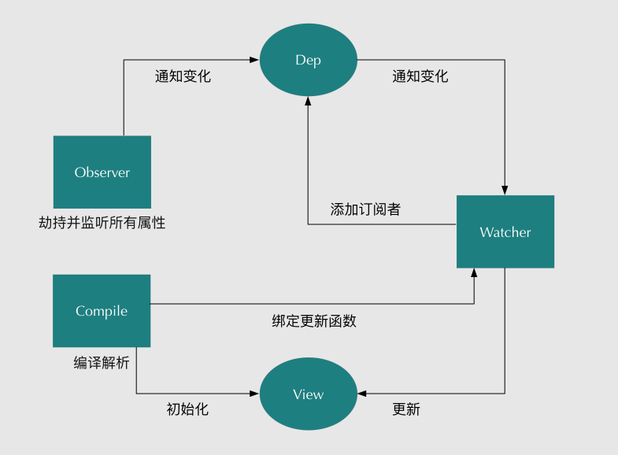
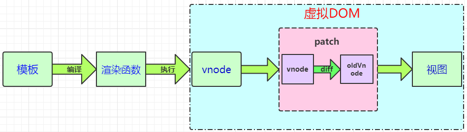
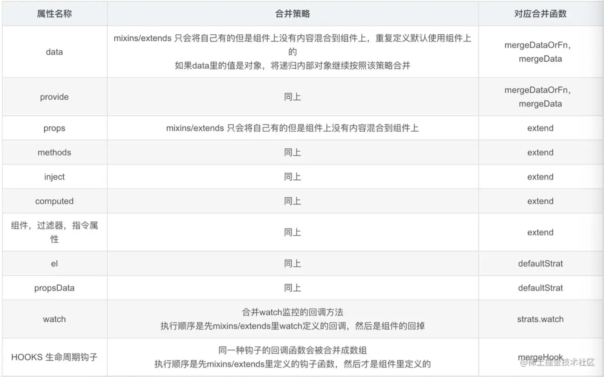

## vue笔记

#### vue-cli的安装

```
vue-cli安装    npm install vue-cli -g
vue-cli的版本查看    vue -V
webpack安装    npm install -g webpack
卸载vue-cli    npm uninstall vue-cli -g
```


#### vue目录框架结构

```
├── README.md            项目介绍
├── index.html           入口页面
├── build              构建脚本目录
│  ├── build-server.js         运行本地构建服务器，可以访问构建后的页面
│  ├── build.js            生产环境构建脚本
│  ├── dev-client.js          开发服务器热重载脚本，主要用来实现开发阶段的页面自动刷新
│  ├── dev-server.js          运行本地开发服务器
│  ├── utils.js            构建相关工具方法
│  ├── webpack.base.conf.js      wabpack基础配置
│  ├── webpack.dev.conf.js       wabpack开发环境配置
│  └── webpack.prod.conf.js      wabpack生产环境配置
├── config             项目配置
│  ├── dev.env.js           开发环境变量
│  ├── index.js            项目配置文件
│  ├── prod.env.js           生产环境变量
│  └── test.env.js           测试环境变量
├── mock              mock数据目录
│  └── hello.js
├── package.json          npm包配置文件，里面定义了项目的npm脚本，依赖包等信息
├── src               源码目录  
│  ├── main.js             入口js文件
│  ├── app.vue             根组件
│  ├── components           公共组件目录
│  │  └── title.vue
│  ├── assets             资源目录，这里的资源会被wabpack构建
│  │  └── images
│  │    └── logo.png
│  ├── routes             前端路由
│  │  └── index.js
│  ├── store              应用级数据（state）
│  │  └── index.js
│  └── views              页面目录
│    ├── hello.vue
│    └── notfound.vue
├── static             纯静态资源，不会被wabpack构建。
└── test              测试文件目录（unit&e2e）
  └── unit              单元测试
    ├── index.js            入口脚本
    ├── karma.conf.js          karma配置文件
    └── specs              单测case目录
      └── Hello.spec.js
```


#### vue生命周期

**beforeCreate**：在new一个vue实例后，只有一些默认的生命周期钩子和默认事件，其他的东西都还没创建。在beforeCreate生命周期执行的时候，data

和methods中的数据都还没有初始化。不能在这个阶段使用data中的数据和methods中的方法。

**created**：data 和 methods都已经被初始化好了，如果要调用 methods 中的方法，或者操作 data 中的数据，最早可以在这个阶段中操作。但是此时渲染得节点还未挂载到 DOM，所以不能访问到 `$el` 属性。

**beforeMount**：执行到这个钩子的时候，相关的render函数首次被调用。实例已完成以下的配置：编译模板，把data里面的数据和模板生成html。但是还没有挂载到页面中，此时，页面还是旧的。

**mounted**：执行到这个钩子的时候，就表示Vue实例已经初始化完成了。此时组件脱离了创建阶段，进入到了运行阶段。 如果我们想要通过插件操作页面上的DOM节点，最早可以在和这个阶段中进行。

**beforeUpdate**： 当执行这个钩子时，页面中的显示的数据还是旧的，data中的数据是更新后的， 页面还没有和最新的数据保持同步。

**updated**：页面显示的数据和data中的数据已经保持同步了，都是最新的。

**beforeDestroy**：Vue实例从运行阶段进入到了销毁阶段，这个时候上所有的 data 和 methods ， 指令， 过滤器 ……都是处于可用状态。还没有真正被销毁。

**destroyed**： 这个时候上所有的 data 和 methods ， 指令， 过滤器 ……都是处于不可用状态。组件已经被销毁了。

另外还有 `keep-alive` 独有的生命周期，分别为 `activated` 和 `deactivated` 。用 `keep-alive` 包裹的组件在切换时不会进行销毁，beforeDestroy 和 destroyed 就不会再被触发，而是缓存到内存中并执行 `deactivated` 钩子函数，命中缓存渲染后会执行 `activated` 钩子函数。

即当组件被换掉时，会被缓存到内存中、触发 deactivated 生命周期；当组件被切回来时，再去缓存里找这个组件、触发 activated钩子函数。

------

##### Vue 子组件和父组件执行顺序

**加载渲染过程：**

1. 父组件 beforeCreate
2. 父组件 created
3. 父组件 beforeMount
4. 子组件 beforeCreate
5. 子组件 created
6. 子组件 beforeMount
7. 子组件 mounted
8. 父组件 mounted

**更新过程：**

1. 父组件 beforeUpdate
2. 子组件 beforeUpdate
3. 子组件 updated
4. 父组件 updated

**销毁过程：**

1. 父组件 beforeDestroy
2. 子组件 beforeDestroy
3. 子组件 destroyed
4. 父组件 destoryed

------

##### 一般在哪个生命周期请求异步数据

我们可以在钩子函数 created、beforeMount、mounted 中进行调用，因为在这三个钩子函数中，data 已经创建，可以将服务端端返回的数据进行赋值。 

推荐在 created 钩子函数中调用异步请求，因为在 created 钩子函数中调用异步请求有以下优点：

- 能更快获取到服务端数据，减少页面加载时间，用户体验更好；
- SSR不支持 beforeMount 、mounted 钩子函数，放在 created 中有助于一致性。


#### vue优点

**轻量级框架：**只关注视图层，是一个构建数据的视图集合，大小只有几十kb；

**简单易学：**国人开发，中文文档，不存在语言障碍 ，易于理解和学习；

**双向数据绑定：**保留了angular的特点，在数据操作方面更为简单；

**组件化：**保留了react的优点，实现了html的封装和重用，在构建单页面应用方面有着独特的优势；

**视图，数据，结构分离：**使数据的更改更为简单，不需要进行逻辑代码的修改，只需要操作数据就能完成相关操作；

**虚拟DOM：**dom操作是非常耗费性能的， 不再使用原生的dom操作节点，极大解放dom操作，但具体操作的还是dom不过是换了另一种方式；

**运行速度更快:**相比较与react而言，同样是操作虚拟dom，就性能而言，vue存在很大的优势。


#### vue的数据双向绑定原理

Vue.js 是采用**数据劫持**结合**发布者-订阅者模式**的方式，通过Object.defineProperty()（vue3.0使用proxy ）来劫持各个属性的setter，getter，在数据变动时发布消息给订阅者，触发相应的监听回调。主要分为以下几个步骤：

1. 需要observe的数据对象进行递归遍历，包括子属性对象的属性，都加上setter和getter这样的话，给这个对象的某个值赋值，就会触发setter，那么就能监听到了数据变化
2. compile解析模板指令，将模板中的变量替换成数据，然后初始化渲染页面视图，并将每个指令对应的节点绑定更新函数，添加监听数据的订阅者，一旦数据有变动，收到通知，更新视图
3. Watcher订阅者是Observer和Compile之间通信的桥梁，主要做的事情是: ①在自身实例化时往属性订阅器(dep)里面添加自己 ②自身必须有一个update()方法 ③待属性变动dep.notice()通知时，能调用自身的update()方法，并触发Compile中绑定的回调，则功成身退。
4. MVVM作为数据绑定的入口，整合Observer、Compile和Watcher三者，通过Observer来监听自己的model数据变化，通过Compile来解析编译模板指令，最终利用Watcher搭起Observer和Compile之间的通信桥梁，达到数据变化 -> 视图更新；视图交互变化(input) -> 数据model变更的双向绑定效果。

------

vue数据双向绑定是通过**数据劫持**结合**发布者-订阅者模式**的方式来实现的。



实现数据的双向绑定，首先要对数据进行劫持监听，所以我们需要设置一个监听器Observer，用来监听所有属性。如果属性发上变化了，就需要告诉订阅者Watcher看是否需要更新。因为订阅者是有很多个，所以我们需要有一个消息订阅器Dep来专门收集这些订阅者，然后在监听器Observer和订阅者Watcher之间进行统一管理的。接着，我们还需要有一个指令解析器Compile，对每个节点元素进行扫描和解析，将相关指令对应初始化成一个订阅者Watcher，并替换模板数据或者绑定相应的函数，此时当订阅者Watcher接收到相应属性的变化，就会执行对应的更新函数，从而更新视图。

Dep 是一个 class ，其中有一个关 键的静态属性 static，它指向了一个全局唯一 Watcher，保证了同一时间全局只有一个 watcher 被计算，另一个属性 subs 则是一个 Watcher 的数组，所以 Dep 实际上就是对 Watcher 的管理，再看看 Watcher 的相关代码∶

------

##### Object.defineProperty() 缺点

在对一些属性进行操作时，使用这种方法无法拦截，比如通过下标方式修改数组数据或者给对象新增属性，这都不能触发组件的重新渲染，因为 Object.defineProperty 不能拦截到这些操作。更精确的来说，对于数组而言，大部分操作都是拦截不到的，只是 Vue 内部通过重写函数的方式解决了这个问题。

在 Vue3.0 中已经不使用这种方式了，而是通过使用 Proxy 对对象进行代理，从而实现数据劫持。使用Proxy 的好处是它可以完美的监听到任何方式的数据改变，唯一的缺点是兼容性的问题，因为 Proxy 是 ES6 的语法。

------

##### 函数实现

1.实现一个监听器Observer，用来劫持并监听所有属性，如果有变动的，就通知订阅者。

2.实现一个订阅者Watcher，可以收到属性的变化通知并执行相应的函数，从而更新视图。

3.实现一个解析器Compile，可以扫描和解析每个节点的相关指令，并根据初始化模板数据以及初始化相应的订阅器。

**1.实现一个Observer**

Observer是一个数据监听器，其实现核心方法就是前文所说的Object.defineProperty( )。如果要对所有属性都进行监听的话，那么可以通过递归方法遍历所有属性值，并对其进行Object.defineProperty( )处理。如下代码，实现了一个Observer。

```js
function defineReactive(data, key, val) {
    observe(val); // 递归遍历所有子属性
    Object.defineProperty(data, key, {
        enumerable: true,
        configurable: true,
        get: function() {
            return val;
        },
        set: function(newVal) {
            val = newVal;
            console.log('属性' + key + '已经被监听了，现在值为：“' + newVal.toString() + '”');
        }
    });
}

function observe(data) {
    if (!data || typeof data !== 'object') {
        return;
    }
    Object.keys(data).forEach(function(key) {
        defineReactive(data, key, data[key]);
    });
};

var library = {
    book1: {
        name: ''
    },
    book2: ''
};
observe(library);
library.book1.name = 'vue权威指南'; // 属性name已经被监听了，现在值为：“vue权威指南”
library.book2 = '没有此书籍';  // 属性book2已经被监听了，现在值为：“没有此书籍”
```

思路分析中，需要创建一个可以容纳订阅者的消息订阅器Dep，订阅器Dep主要负责收集订阅者，然后再属性变化的时候执行对应订阅者的更新函数。所以显然订阅器需要有一个容器，这个容器就是list，将上面的Observer稍微改造下，植入消息订阅器：

```js
function defineReactive(data, key, val) {
    observe(val); // 递归遍历所有子属性
    var dep = new Dep(); 
    Object.defineProperty(data, key, {
        enumerable: true,
        configurable: true,
        get: function() {
            if (是否需要添加订阅者) {
                dep.addSub(watcher); // 在这里添加一个订阅者
            }
            return val;
        },
        set: function(newVal) {
            if (val === newVal) {
                return;
            }
            val = newVal;
            console.log('属性' + key + '已经被监听了，现在值为：“' + newVal.toString() + '”');
            dep.notify(); // 如果数据变化，通知所有订阅者
        }
    });
}

function Dep () {
    this.subs = [];
}
Dep.prototype = {
    addSub: function(sub) {
        this.subs.push(sub);
    },
    notify: function() {
        this.subs.forEach(function(sub) {
            sub.update();
        });
    }
};
```

从代码上看，我们将订阅器Dep添加一个订阅者设计在getter里面，这是为了让Watcher初始化进行触发，因此需要判断是否要添加订阅者，至于具体设计方案，下文会详细说明的。在setter函数里面，如果数据变化，就会去通知所有订阅者，订阅者们就会去执行对应的更新的函数。到此为止，一个比较完整Observer已经实现了，接下来我们开始设计Watcher。

**2.实现Watcher**

订阅者Watcher在初始化的时候需要将自己添加进订阅器Dep中，那该如何添加呢？我们已经知道监听器Observer是在get函数执行了添加订阅者Wather的操作的，所以我们只要在订阅者Watcher初始化的时候触发对应的get函数去执行添加订阅者操作即可，那要如何触发get的函数，再简单不过了，只要获取对应的属性值就可以触发了，核心原因就是因为我们使用了Object.defineProperty( )进行数据监听。这里还有一个细节点需要处理，我们只要在订阅者Watcher初始化的时候才需要添加订阅者，所以需要做一个判断操作，因此可以在订阅器上做一下手脚：在Dep.target上缓存下订阅者，添加成功后再将其去掉就可以了。订阅者Watcher的实现如下：

```js
function Watcher(vm, exp, cb) {
    this.cb = cb;
    this.vm = vm;
    this.exp = exp;
    this.value = this.get();  // 将自己添加到订阅器的操作
}

Watcher.prototype = {
    update: function() {
        this.run();
    },
    run: function() {
        var value = this.vm.data[this.exp];
        var oldVal = this.value;
        if (value !== oldVal) {
            this.value = value;
            this.cb.call(this.vm, value, oldVal);
        }
    },
    get: function() {
        Dep.target = this;  // 缓存自己
        var value = this.vm.data[this.exp]  // 强制执行监听器里的get函数
        Dep.target = null;  // 释放自己
        return value;
    }
};
```

这时候，我们需要对监听器Observer也做个稍微调整，主要是对应Watcher类原型上的get函数。需要调整地方在于defineReactive函数：

```js
function defineReactive(data, key, val) {
    observe(val); // 递归遍历所有子属性
    var dep = new Dep(); 
    Object.defineProperty(data, key, {
        enumerable: true,
        configurable: true,
        get: function() {
            if (Dep.target) {.  // 判断是否需要添加订阅者
                dep.addSub(Dep.target); // 在这里添加一个订阅者
            }
            return val;
        },
        set: function(newVal) {
            if (val === newVal) {
                return;
            }
            val = newVal;
            console.log('属性' + key + '已经被监听了，现在值为：“' + newVal.toString() + '”');
            dep.notify(); // 如果数据变化，通知所有订阅者
        }
    });
}
Dep.target = null;
```

到此为止，简单版的Watcher设计完毕，这时候我们只要将Observer和Watcher关联起来，就可以实现一个简单的双向绑定数据了。因为这里没有还没有设计解析器Compile，所以对于模板数据我们都进行写死处理，假设模板上又一个节点，且id号为'name'，并且双向绑定的绑定的变量也为'name'，且是通过两个大双括号包起来（这里只是为了演示，暂时没什么用处），模板如下：

```html
<body>
    <h1 id="name">{{name}}</h1>
</body>
```

这时候我们需要将Observer和Watcher关联起来：

```js
function SelfVue (data, el, exp) {
    this.data = data;
    observe(data);
    el.innerHTML = this.data[exp];  // 初始化模板数据的值
    new Watcher(this, exp, function (value) {
        el.innerHTML = value;
    });
    return this;
}
```

然后在页面上new以下SelfVue类，就可以实现数据的双向绑定了：

```js
<body>
    <h1 id="name">{{name}}</h1>
</body>
<script src="js/observer.js"></script>
<script src="js/watcher.js"></script>
<script src="js/index.js"></script>
<script type="text/javascript">
    var ele = document.querySelector('#name');
    var selfVue = new SelfVue({
        name: 'hello world'
    }, ele, 'name');

    window.setTimeout(function () {
        console.log('name值改变了');
        selfVue.data.name = 'canfoo';
    }, 2000);

</script>
```

这时候打开页面，可以看到页面刚开始显示了是'hello world'，过了2s后就变成'canfoo'了。到这里，总算大功告成一半了，但是还有一个细节问题，我们在赋值的时候是这样的形式 '  selfVue.data.name = 'canfoo'  ' 而我们理想的形式是'  selfVue.name = 'canfoo'  '为了实现这样的形式，我们需要在new SelfVue的时候做一个代理处理，让访问selfVue的属性代理为访问selfVue.data的属性，实现原理还是使用Object.defineProperty( )对属性值再包一层：

```js
function SelfVue (data, el, exp) {
    var self = this;
    this.data = data;

    Object.keys(data).forEach(function(key) {
        self.proxyKeys(key);  // 绑定代理属性
    });

    observe(data);
    el.innerHTML = this.data[exp];  // 初始化模板数据的值
    new Watcher(this, exp, function (value) {
        el.innerHTML = value;
    });
    return this;
}

SelfVue.prototype = {
    proxyKeys: function (key) {
        var self = this;
        Object.defineProperty(this, key, {
            enumerable: false,
            configurable: true,
            get: function proxyGetter() {
                return self.data[key];
            },
            set: function proxySetter(newVal) {
                self.data[key] = newVal;
            }
        });
    }
}
```

这下我们就可以直接通过'  selfVue.name = 'canfoo'  '的形式来进行改变模板数据了。

**3.实现Compile**

虽然上面已经实现了一个双向数据绑定的例子，但是整个过程都没有去解析dom节点，而是直接固定某个节点进行替换数据的，所以接下来需要实现一个解析器Compile来做解析和绑定工作。解析器Compile实现步骤：

1.解析模板指令，并替换模板数据，初始化视图

2.将模板指令对应的节点绑定对应的更新函数，初始化相应的订阅器

为了解析模板，首先需要获取到dom元素，然后对含有dom元素上含有指令的节点进行处理，因此这个环节需要对dom操作比较频繁，所有可以先建一个fragment片段，将需要解析的dom节点存入fragment片段里再进行处理：

```js
function nodeToFragment (el) {
    var fragment = document.createDocumentFragment();
    var child = el.firstChild;
    while (child) {
        // 将Dom元素移入fragment中
        fragment.appendChild(child);
        child = el.firstChild
    }
    return fragment;
}
```

接下来需要遍历各个节点，对含有相关指定的节点进行特殊处理，这里咱们先处理最简单的情况，只对带有 '{{变量}}' 这种形式的指令进行处理，先简道难嘛，后面再考虑更多指令情况：

```js
function compileElement (el) {
    var childNodes = el.childNodes;
    var self = this;
    [].slice.call(childNodes).forEach(function(node) {
        var reg = /\{\{(.*)\}\}/;
        var text = node.textContent;

        if (self.isTextNode(node) && reg.test(text)) {  // 判断是否是符合这种形式{{}}的指令
            self.compileText(node, reg.exec(text)[1]);
        }

        if (node.childNodes && node.childNodes.length) {
            self.compileElement(node);  // 继续递归遍历子节点
        }
    });
},
function compileText (node, exp) {
    var self = this;
    var initText = this.vm[exp];
    updateText(node, initText);  // 将初始化的数据初始化到视图中
    new Watcher(this.vm, exp, function (value) {  // 生成订阅器并绑定更新函数
        self.updateText(node, value);
    });
},
function updateText (node, value) {
    node.textContent = typeof value == 'undefined' ? '' : value;
}
```

获取到最外层节点后，调用compileElement函数，对所有子节点进行判断，如果节点是文本节点且匹配{{}}这种形式指令的节点就开始进行编译处理，编译处理首先需要初始化视图数据，对应上面所说的步骤1，接下去需要生成一个并绑定更新函数的订阅器，对应上面所说的步骤2。这样就完成指令的解析、初始化、编译三个过程，一个解析器Compile也就可以正常的工作了。为了将解析器Compile与监听器Observer和订阅者Watcher关联起来，我们需要再修改一下类SelfVue函数：

```js
function SelfVue (options) {
    var self = this;
    this.vm = this;
    this.data = options;

    Object.keys(this.data).forEach(function(key) {
        self.proxyKeys(key);
    });

    observe(this.data);
    new Compile(options, this.vm);
    return this;
}
```

更改后，我们就不要像之前通过传入固定的元素值进行双向绑定了，可以随便命名各种变量进行双向绑定了：

```js
<body>
    <div id="app">
        <h2>{{title}}</h2>
        <h1>{{name}}</h1>
    </div>
</body>
<script src="js/observer.js"></script>
<script src="js/watcher.js"></script>
<script src="js/compile.js"></script>
<script src="js/index.js"></script>
<script type="text/javascript">

    var selfVue = new SelfVue({
        el: '#app',
        data: {
            title: 'hello world',
            name: ''
        }
    });

    window.setTimeout(function () {
        selfVue.title = '你好';
    }, 2000);

    window.setTimeout(function () {
        selfVue.name = 'canfoo';
    }, 2500);

</script>
```

如上代码，在页面上可观察到，刚开始titile和name分别被初始化为 'hello world' 和空，2s后title被替换成 '你好' 3s后name被替换成 'canfoo' 了。废话不多说，再给你们来一个这个版本的代码（v2）。

到这里，一个数据双向绑定功能已经基本完成了，接下去就是需要完善更多指令的解析编译，在哪里进行更多指令的处理呢？答案很明显，只要在上文说的compileElement函数加上对其他指令节点进行判断，然后遍历其所有属性，看是否有匹配的指令的属性，如果有的话，就对其进行解析编译。这里我们再添加一个v-model指令和事件指令的解析编译，对于这些节点我们使用函数compile进行解析处理：

```js
function compile (node) {
    var nodeAttrs = node.attributes;
    var self = this;
    Array.prototype.forEach.call(nodeAttrs, function(attr) {
        var attrName = attr.name;
        if (self.isDirective(attrName)) {
            var exp = attr.value;
            var dir = attrName.substring(2);
            if (self.isEventDirective(dir)) {  // 事件指令
                self.compileEvent(node, self.vm, exp, dir);
            } else {  // v-model 指令
                self.compileModel(node, self.vm, exp, dir);
            }
            node.removeAttribute(attrName);
        }
    });
}
```

上面的compile函数是挂载Compile原型上的，它首先遍历所有节点属性，然后再判断属性是否是指令属性，如果是的话再区分是哪种指令，再进行相应的处理，处理方法相对来说比较简单，这里就不再列出来，想要马上看阅读代码的同学可以马上[点击这里获取。](https://github.com/canfoo/self-vue/tree/master/v3)

最后我们在稍微改造下类SelfVue，使它更像vue的用法：

```js
function SelfVue (options) {
    var self = this;
    this.data = options.data;
    this.methods = options.methods;

    Object.keys(this.data).forEach(function(key) {
        self.proxyKeys(key);
    });

    observe(this.data);
    new Compile(options.el, this);
    options.mounted.call(this); // 所有事情处理好后执行mounted函数
}
```

这时候我们可以来真正测试了，在页面上设置如下东西：

```html
<body>
    <div id="app">
        <h2>{{title}}</h2>
        <input v-model="name">
        <h1>{{name}}</h1>
        <button v-on:click="clickMe">click me!</button>
    </div>
</body>
<script src="js/observer.js"></script>
<script src="js/watcher.js"></script>
<script src="js/compile.js"></script>
<script src="js/index.js"></script>
<script type="text/javascript">

     new SelfVue({
        el: '#app',
        data: {
            title: 'hello world',
            name: 'canfoo'
        },
        methods: {
            clickMe: function () {
                this.title = 'hello world';
            }
        },
        mounted: function () {
            window.setTimeout(() => {
                this.title = '你好';
            }, 1000);
        }
    });

</script>
```

是不是看起来跟vue的使用方法一样，哈，真正的大功告成！


#### Vue1.0和Vue2.0的区别

1.生命周期不一样


2.在vue1.0中可以在template编写时出现：

```html
<template>
   <div>第一行</div>
   <div>第二行</div>
</template>
```

在vue2.0中在template编写时，必须只有一个根元素，否则会报错。

```html
<template>
   <div id='root'>
      <div>这是第一行</div>
      <div>这是第二行</div>
   </div>
</template>
```


#### Vue2.0和Vue3.0的区别（5种）

1.项目目录结构
vue-cli2.0与3.0在目录结构方面，有明显的不同
vue-cli3.0移除了配置文件目录，config 和 build 文件夹，同时移除了 static 静态文件夹
新增了 public 文件夹，打开层级目录还会发现， index.html 移动到 public 中

2.配置项
3.0中config文件已经被移除，但是多了.env.production和env.development文件，除了文件位置，实际配置起来和2.0没什么不同
没了config文件，跨域需要配置域名时，从config/index.js 挪到了vue.config.js中，配置方法不变

3.渲染
Vue2.x使用的Virtual Dom实现的渲染
Vue3.0不论是原生的html标签还是vue组件，他们都会通过h函数来判断，如果是原生html标签，在运行时直接通过Virtual Dom来直接渲染，同样如果是组件会直接生成组件代码（优点：更快、更小）

4.数据监听
Vue2.x大家都知道使用的是es5的object.defineproperties中getter和setter实现的，而vue3.0的版本，是基于Proxy进行监听的，其实基于proxy监听就是所谓的lazy by default，什么意思呢，就是只要你用到了才会监听，可以理解为‘按需监听’，官方给出的诠释是：速度加倍，同时内存占用还减半。

相比于vue2.x，使用proxy的优势如下：

```
defineProperty只能监听某个属性，不能对全对象监听。
可以省去for in、闭包等内容来提升效率（直接绑定整个对象即可）。
可以监听数组，不用再去单独的对数组做特异性操作 vue3.x可以检测到数组内部数据的变化。
```

4.按需引入
Vue2.x中new出的实例对象，所有的东西都在这个vue对象上，这样其实无论你用到还是没用到，都会跑一变。而vue3.0中可以用ES module imports按需引入，如：keep-alive内置组件、v-model指令，等等。

5.composition api
提供了composition api，为更好的逻辑复用与代码组织。


#### 数组内部变化监测

在Vue中，对响应式处理利用的是Object.defineProperty对数据进行拦截，而这个方法并不能监听到数组内部变化，数组长度变化，数组的截取变化等，所以需要对这些操作进行hack，让Vue能监听到其中的变化。


```javascript
// 缓存数组原型
const arrayProto = Array.prototype;
// 实现 arrayMethods.__proto__ === Array.prototype
export const arrayMethods = Object.create(arrayProto);
// 需要进行功能拓展的方法
const methodsToPatch = [
  "push",
  "pop",
  "shift",
  "unshift",
  "splice",
  "sort",
  "reverse"
];

/**
 * Intercept mutating methods and emit events
 */
methodsToPatch.forEach(function(method) {
  // 缓存原生数组方法
  const original = arrayProto[method];
  def(arrayMethods, method, function mutator(...args) {
    // 执行并缓存原生数组功能
    const result = original.apply(this, args);
    // 响应式处理
    const ob = this.__ob__;
    let inserted;
    switch (method) {
    // push、unshift会新增索引，所以要手动observer
      case "push":
      case "unshift":
        inserted = args;
        break;
      // splice方法，如果传入了第三个参数，也会有索引加入，也要手动observer。
      case "splice":
        inserted = args.slice(2);
        break;
    }
    // 
    if (inserted) ob.observeArray(inserted);// 获取插入的值，并设置响应式监听
    // notify change
    ob.dep.notify();// 通知依赖更新
    // 返回原生数组方法的执行结果
    return result;
  });
});
```

简单来说就是，重写了数组中的那些原生方法，首先获取到这个数组的`__ob__`，也就是它的Observer对象，如果有新的值，就调用observeArray继续对新的值观察变化（也就是通过`target__proto__ == arrayMethods`来改变了数组实例的型），然后手动调用notify，通知渲染watcher，执行update。


#### vue模版编译

vue的模版编译过程主要如下：**template -> ast -> render函数**

vue 在模版编译版本的码中会执行 compileToFunctions 将template转化为render函数：

```javascript
// 将模板编译为render函数const { render, staticRenderFns } = compileToFunctions(template,options//省略}, this)
```

CompileToFunctions中的主要逻辑如下∶ **（1）调用parse方法将template转化为ast（抽象语法树）**

```javascript
constast = parse(template.trim(), options)
```

- **parse的目标**：把tamplate转换为AST树，它是一种用 JavaScript对象的形式来描述整个模板。
- **解析过程**：利用正则表达式顺序解析模板，当解析到开始标签、闭合标签、文本的时候都会分别执行对应的 回调函数，来达到构造AST树的目的。

AST元素节点总共三种类型：type为1表示普通元素、2为表达式、3为纯文本

**（2）对静态节点做优化**

```javascript
optimize(ast,options)
```

这个过程主要分析出哪些是静态节点，给其打一个标记，为后续更新渲染可以直接跳过静态节点做优化

深度遍历AST，查看每个子树的节点元素是否为静态节点或者静态节点根。如果为静态节点，他们生成的DOM永远不会改变，这对运行时模板更新起到了极大的优化作用。

**（3）生成代码**

```javascript
const code = generate(ast, options)
```

generate将ast抽象语法树编译成 render字符串并将静态部分放到 staticRenderFns 中，最后通过 new Function(render)生成render函数。

------

Vue.js通过编译将template 模板转换成渲染函数(render ) 

`compile` 编译可以分成 `parse`、`optimize` 与 `generate` 三个阶段，最终需要得到render函数。

```
<div :class="c" class="demo" v-if="isShow">
    <span v-for="item in sz">{{item}}</span>
</div>
```

首先是 `parse`，`parse` 会用正则等方式将 template 模板中进行字符串解析，得到指令、class、style等数据，形成 AST（在计算机科学中，抽象语法树（abstract syntax tree或者缩写为AST），或者语法树（syntax tree），是源代码的抽象语法结构的树状表现形式，这里特指编程语言的源代码。）。

这个过程比较复杂，会涉及到比较多的正则进行字符串解析，我们来看一下得到的 AST 的样子。

```js
{
    /* 标签属性的map，记录了标签上属性 */
    'attrsMap': {
        ':class': 'c',
        'class': 'demo',
        'v-if': 'isShow'
    },
    /* 解析得到的:class */
    'classBinding': 'c',
    /* 标签属性v-if */
    'if': 'isShow',
    /* v-if的条件 */
    'ifConditions': [
        {
            'exp': 'isShow'
        }
    ],
    /* 标签属性class */
    'staticClass': 'demo',
    /* 标签的tag */
    'tag': 'div',
    /* 子标签数组 */
    'children': [
        {
            'attrsMap': {
                'v-for': "item in sz"
            },
            /* for循环的参数 */
            'alias': "item",
            /* for循环的对象 */
            'for': 'sz',
            /* for循环是否已经被处理的标记位 */
            'forProcessed': true,
            'tag': 'span',
            'children': [
                {
                    /* 表达式，_s是一个转字符串的函数 */
                    'expression': '_s(item)',
                    'text': '{{item}}'
                }
            ]
        }
    ]
}
```

最终得到的 AST 通过一些特定的属性，能够比较清晰地描述出标签的属性以及依赖关系。


#### 虚拟DOM

模板转换成视图的过程整个过程（如下图）：

- Vue.js通过编译将template 模板转换成渲染函数(render ) ，执行渲染函数就可以得到一个虚拟节点树
- 在对 Model 进行操作的时候，会触发对应 Dep 中的 Watcher 对象。Watcher 对象会调用对应的 update 来修改视图。这个过程主要是将新旧虚拟节点进行差异对比，然后根据对比结果进行DOM操作来更新视图。

简单点讲，在Vue的底层实现上，Vue将模板编译成虚拟DOM渲染函数。结合Vue自带的响应系统，在状态改变时，Vue能够智能地计算出重新渲染组件的最小代价并应到DOM操作上。



- **渲染函数**：渲染函数是用来生成Virtual DOM的。Vue推荐使用模板来构建我们的应用界面，在底层实现中Vue会将模板编译成渲染函数，当然我们也可以不写模板，直接写渲染函数，以获得更好的控制。
- **VNode 虚拟节点**：它可以代表一个真实的 dom 节点。通过 createElement 方法能将 VNode 渲染成 dom 节点。简单地说，vnode可以理解成**节点描述对象**，它描述了应该怎样去创建真实的DOM节点。
- **patch(也叫做patching算法)**：虚拟DOM最核心的部分，它可以将vnode渲染成真实的DOM，这个过程是对比新旧虚拟节点之间有哪些不同，然后根据对比结果找出需要更新的的节点进行更新。这点我们从单词含义就可以看出， patch本身就有补丁、修补的意思，其实际作用是在现有DOM上进行修改来实现更新视图的目的。Vue的Virtual DOM Patching算法是基于**[Snabbdom](https://github.com/snabbdom/snabbdom)**的实现，并在些基础上作了很多的调整和改进。

**Virtual DOM 作用是什么？**

**虚拟DOM的最终目标是将虚拟节点渲染到视图上。**但是如果直接使用虚拟节点覆盖旧节点的话，会有很多不必要的DOM操作。例如，一个ul标签下很多个li标签，其中只有一个li有变化，这种情况下如果使用新的ul去替代旧的ul,因为这些不必要的DOM操作而造成了性能上的浪费。

为了避免不必要的DOM操作，虚拟DOM在虚拟节点映射到视图的过程中，将虚拟节点与上一次渲染视图所使用的旧虚拟节点（oldVnode）做对比，找出真正需要更新的节点来进行DOM操作，从而避免操作其他无需改动的DOM。

其实虚拟DOM在Vue.js主要做了两件事：

- 提供与真实DOM节点所对应的虚拟节点vnode
- 将虚拟节点vnode和旧虚拟节点oldVnode进行对比，然后更新视图

**diff算法比较新旧虚拟dom**

如果节点类型相同，则比较数据，修改数据

如果节点不同，直接干掉节点及所有子节点，插入新的节点

如果给每个节点都设置了唯一的key，就可以准确的找到需要改变的内容，否则就会出现修改一个地方导致其他地方都改变的情况。比如A-B-C-D, 我要插入新节点A-B-M-C-D,实际上改变了C和D。但是设置了key，就可以准确的找到B C并插入。

virtual DOM是将真实的DOM的数据抽取出来，以对象的形式模拟树形结构。比如dom是这样的：

```html
<div>
    <p>123</p>
</div>
```

对应的virtual DOM（伪代码）：

```js
var Vnode = {
    tag: 'div',
    children: [
        { tag: 'p', text: '123' }
    ]
};
```


#### diff算法

```

```


#### vue父子组件传参

##### 父组件向子组件传值

```html
// 父组件
<template>
    <div id="father">
        <son :msg="msgData" :fn="myFunction"></son>
    </div>
</template>

<script>
import son from "./son.vue";
export default {
    name: father,
    data() {
        msgData: "父组件数据";
    },
    methods: {
        myFunction() {
            console.log("vue");
        }
    },
    components: {
        son
    }
};
</script>
```

组件中的 所有props 中的数据，都是通过父组件传递给子组件的
 **props 中的数据都是只读的，无法重新赋值** 。

props有default（参数默认值）、type（参数类型）、required（是否必须）和validator属性。validator属性当校验规则很复杂，默认提供的校验规则无法满足的时候可以使用自定义函数来校验。

```html
// 子组件
<template>
    <div id="son">
        <p>{{msg}}</p>
        <button @click="fn">按钮</button>
    </div>
</template>
<script>
export default {
    name: "son",
    props: ["msg", "fn"]
};
</script>
```

------

##### 子组件通过事件调用向父组件传值

```html
<template>
  <div>
    <h1>父组件</h1>
    <router-view @show="showFather"></router-view>
  </div>
</template>

<script>
export default {
  data () {
    return {
      fromSon1: '',
      fromSon2: ''
    };
  },
  methods: {
    showFather (a, b) {
      this.fromSon1 = a;
      this.fromSon2 = b;
      console.log('触发了父组件的方法' + '======' + a + '======' + b);
    }
  }
}
</script>
```

```html
<template>
  <div>
    <h1>子组件</h1>
    <Button type="primary" @click="sonClick">触发父组件方法</Button>
  </div>
</template>

<script>
export default {
  props: ['fData', 'fMessage'],
  data () {
    return {
      sonMessage: '子组件数据sonMessage',
      sonData: '子组件数据sonData'
    };
  },
  methods: {
    sonClick () {
      this.$emit('show', this.sonMessage, this.sonData);
    }
  }
}
</script>
```

------

##### 子组件可以直接改变父组件的数据吗

子组件不可以直接改变父组件的数据。这样做主要是为了维护父子组件的单向数据流。每次父级组件发生更新时，子组件中所有的 prop 都将会刷新为最新的值。如果这样做了，Vue 会在浏览器的控制台中发出警告。

Vue提倡单向数据流，即父级 props 的更新会流向子组件，但是反过来则不行。这是为了防止意外的改变父组件状态，使得应用的数据流变得难以理解，导致数据流混乱。如果破坏了单向数据流，当应用复杂时，debug 的成本会非常高。

**只能通过 $emit 派发一个自定义事件，父组件接收到后，由父组件修改。**


#### vue页面传参（3种）

##### query传值--地址栏可见

path 与query结合使用 ；this.$router.push({path:'路由命名', query:{ 参数名:参数值 } });

比如从a.vue跳转至b.vue，传name=‘jack’，代码如下:

```js
this.$router.push({
    path: "/result",
    query: { name: 'jack' }
});
```

在b.vue通过地址栏的url 进行接收参数；可以在created这个函数里面进行接收的，**var name = this.$route.query.name;**就可以接收到name这个参数了；**需要注意的是接收参数的时候是route而不是router。两种方式一一对应，名字不能混用**

------

##### params传值--地址栏不可见

第二种传参name与params结合使用 ；**this**.$router.push({name:'路由命名',params:{参数名:参数值,参数名:参数值}})；

这个方式要注意一点，在请求的时候需要写上在router下面index.js里面的name。可以和query一同传值。

```js
this.$router.push({
    path: "/result",
    name: "Result",
    query: { name: 'name' },
    params: { usersitelist: 'userlist' }
});
```

params传值在地址栏不可见，但是取值方式是和query一样的，我也是在created函数里面进行取值的；

区别：

query更加类似于我们ajax中get传参；

params则类似于post；说的再简单一点，前者在浏览器地址栏中显示参数，后者则不显示 ；

------

##### 通过eventBus传递数据

使用前可以在全局定义一个eventBus，如定义在js文件中

```js
window.eventBus = new Vue();
```

在需要传递参数的组件中，定义一个emit发送需要传递的值，键名可以自己定义（可以为对象）

```js
eventBus.$emit('eventBusName', id);
```

在需要接受参数的组件中，用on接受该值（或对象）

```js
//val即为传递过来的值 
eventBus.$on('eventBusName', function(val) {console.log(val)}) 
```

最后记住要在beforeDestroy()中关闭这个eventBus

```js
eventBus.$off('eventBusName');
```

------

##### 依赖注入（provide / inject）

这种方式就是Vue中的**依赖注入**，该方法用于**父子组件之间的通信**。当然这里所说的父子不一定是真正的父子，也可以是祖孙组件，在**层数很深的情况**下，可以使用这种方法来进行传值。就不用一层一层的传递了。

`provide / inject`是Vue提供的两个钩子，和`data`、`methods`是同级的。并且`provide`的书写形式和`data`一样。

- `provide` 钩子用来发送数据或方法
- `inject`钩子用来接收数据或方法

在父组件中：

```javascript
provide() { 
    return {     
        num: this.num  
    };
}
```

在子组件中：

```javascript
inject: ['num']
```

还可以这样写，这样写就可以访问父组件中的所有属性：

```javascript
provide() {
 return {
    app: this
  };
}
data() {
 return {
    num: 1
  };
}

inject: ['app']
console.log(this.app.num)
```

**注意：** 依赖注入所提供的属性是**非响应式**的。

------

##### ref / $refs

这种方式也是实现**父子组件**之间的通信。

`ref`： 这个属性用在子组件上，它的引用就指向了子组件的实例。可以通过实例来访问组件的数据和方法。

在子组件中：

```javascript
export default {
  data () {
    return {
      name: 'JavaScript'
    }
  },
  methods: {
    sayHello () {
      console.log('hello')
    }
  }
}
```

在父组件中：

```html
<template>
  <child ref="child"></component-a>
</template>
<script>
  import child from './child.vue'
  export default {
    components: { child },
    mounted () {
      console.log(this.$refs.child.name);  // JavaScript
      this.$refs.child.sayHello();  // hello
    }
  }
</script>
```

------

##### $parent / $children

- 使用`$parent`可以让组件访问父组件的实例（访问的是上一级父组件的属性和方法）
- 使用`$children`可以让组件访问子组件的实例，但是，`$children`并不能保证顺序，并且访问的数据也不是响应式的。

在子组件中：

```html
<template>
  <div>
    <span>{{message}}</span>
    <p>获取父组件的值为:  {{parentVal}}</p>
  </div>
</template>

<script>
export default {
  data() {
    return {
      message: 'Vue'
    }
  },
  computed:{
    parentVal(){
      return this.$parent.msg;
    }
  }
}
</script>
```

在父组件中：

```html
// 父组件中
<template>
  <div class="hello_world">
    <div>{{msg}}</div>
    <child></child>
    <button @click="change">点击改变子组件值</button>
  </div>
</template>

<script>
import child from './child.vue'
export default {
  components: { child },
  data() {
    return {
      msg: 'Welcome'
    }
  },
  methods: {
    change() {
      // 获取到子组件
      this.$children[0].message = 'JavaScript'
    }
  }
}
</script>
```

在上面的代码中，子组件获取到了父组件的`parentVal`值，父组件改变了子组件中`message`的值。 **需要注意：**

- 通过`$parent`访问到的是上一级父组件的实例，可以使用`$root`来访问根组件的实例
- 在组件中使用`$children`拿到的是所有的子组件的实例，它是一个数组，并且是无序的
- 在根组件`#app`上拿`$parent`得到的是`new Vue()`的实例，在这实例上再拿`$parent`得到的是`undefined`，而在最底层的子组件拿`$children`是个空数组
- `$children` 的值是**数组**，而`$parent`是个**对象**

------

##### $attrs / $listeners

考虑一种场景，如果A是B组件的父组件，B是C组件的父组件。如果想要组件A给组件C传递数据，这种隔代的数据，该使用哪种方式呢？

如果是用`props/$emit`来一级一级的传递，确实可以完成，但是比较复杂；如果使用事件总线，在多人开发或者项目较大的时候，维护起来很麻烦；如果使用Vuex，的确也可以，但是如果仅仅是传递数据，那可能就有点浪费了。

针对上述情况，Vue引入了`$attrs / $listeners`，实现组件之间的跨代通信。

先来看一下`inheritAttrs`，它的默认值true，继承所有的父组件属性除`props`之外的所有属性；`inheritAttrs：false` 只继承class属性 。

- `$attrs`：继承所有的父组件属性（除了prop传递的属性、class 和 style ），一般用在子组件的子元素上
- `$listeners`：该属性是一个对象，里面包含了作用在这个组件上的所有监听器，可以配合 `v-on="$listeners"` 将所有的事件监听器指向这个组件的某个特定的子元素。（相当于子组件继承父组件的事件）

A组件（`APP.vue`）：

```html
<template>
    <div id="app">
        //此处监听了两个事件，可以在B组件或者C组件中直接触发 
        <child1 :p-child1="child1" :p-child2="child2" @test1="onTest1" @test2="onTest2"></child1>
    </div>
</template>
<script>
import Child1 from './Child1.vue';
export default {
    components: { Child1 },
    methods: {
        onTest1() {
            console.log('test1 running');
        },
        onTest2() {
            console.log('test2 running');
        }
    }
};
</script>
```

B组件（`Child1.vue`）：

```html
<template>
    <div class="child-1">
        <p>props: {{pChild1}}</p>
        <p>$attrs: {{$attrs}}</p>
        <child2 v-bind="$attrs" v-on="$listeners"></child2>
    </div>
</template>
<script>
import Child2 from './Child2.vue';
export default {
    props: ['pChild1'],
    components: { Child2 },
    inheritAttrs: false,
    mounted() {
        this.$emit('test1'); // 触发APP.vue中的test1方法
    }
};
</script>
```

C 组件 (`Child2.vue`)：

```html
<template>
    <div class="child-2">
        <p>props: {{pChild2}}</p>
        <p>$attrs: {{$attrs}}</p>
    </div>
</template>
<script>
export default {
    props: ['pChild2'],
    inheritAttrs: false,
    mounted() {
        this.$emit('test2');// 触发APP.vue中的test2方法
    }
};
</script>
```

在上述代码中：

- C组件中能直接触发test的原因在于 B组件调用C组件时 使用 v-on 绑定了`$listeners` 属性
- 在B组件中通过v-bind 绑定`$attrs`属性，C组件可以直接获取到A组件中传递下来的props（除了B组件中props声明的）

------

**总结**

**（1）父子组件间通信**

- 子组件通过 props 属性来接受父组件的数据，然后父组件在子组件上注册监听事件，子组件通过 emit 触发事件来向父组件发送数据。
- 通过 ref 属性给子组件设置一个名字。父组件通过 `$refs` 组件名来获得子组件，子组件通过 `$parent` 获得父组件，这样也可以实现通信。
- 使用 provide/inject，在父组件中通过 provide提供变量，在子组件中通过 inject 来将变量注入到组件中。不论子组件有多深，只要调用了 inject 那么就可以注入 provide中的数据。

**（2）兄弟组件间通信**

- 使用 eventBus 的方法，它的本质是通过创建一个空的 Vue 实例来作为消息传递的对象，通信的组件引入这个实例，通信的组件通过在这个实例上监听和触发事件，来实现消息的传递。
- 通过 `$parent/$refs` 来获取到兄弟组件，也可以进行通信。

**（3）任意组件之间**

- 使用 eventBus ，其实就是创建一个事件中心，相当于中转站，可以用它来传递事件和接收事件。

如果业务逻辑复杂，很多组件之间需要同时处理一些公共的数据，这个时候采用上面这一些方法可能不利于项目的维护。这个时候可以使用 **vuex** ，vuex 的思想就是将这一些公共的数据抽离出来，将它作为一个全局的变量来管理，然后其他组件就可以对这个公共数据进行读写操作，这样达到了解耦的目的。


#### computed和watch区别

**computed:**

```js
var var vm = new Vue({
  el: '#demo',
  data: {
    firstName: 'Foo',
    lastName: 'Bar'
  },
  computed: {
    fullName: function () {
      return this.firstName + ' ' + this.lastName
    }
  }
})
```

计算属性顾名思义就是通过其他变量计算得来的另一个属性，fullName在它所依赖firstName，lastName这两个变量变化时重新计算自己的值。

另外，**计算属性具有缓存**。计算属性是基于它们的依赖进行缓存的。计算属性只有在它的相关依赖发生改变时才会重新求值。这就意味着只要 lastName和firstName都没有发生改变，多次访问 fullName计算属性会立即返回之前的计算结果，而不必再次执行函数。

```html
<div id="example">
  {{ message.split('').reverse().join('') + number }}
</div>
```

这js片段虽然看起来挺简单的，但是，如果以后多了需求，要做多一两步的逻辑，在模板里面维护起来就麻烦了，所以类似这种的，我们将其写到 computed 计算属性里面。也就是下面这样子，这样子看起来美观，一看就清楚这是干啥用的。

```html
<template>
  <div>
    <p>{{ reversedMessage }}</p>
  </div>
</template>

<script>
export default {
  name: 'test1',
  data () {
    return {
      message: 'hello world',
      number: 1
    }
  },
  computed: {
    // 字符串反转
    reversedMessage () {
      return this.message.split('').reverse().join('') + this.number
    }
  }
}
</script>
```

上面的代码片段中，在 reversedMessage 中，它依赖了 message 和number 这两个属性，一旦其中一个变化了，reversedMessage 会立刻重新计算输出新值。

**computed特点：**

1. 支持缓存，只有依赖数据发生改变，才会重新进行计算。

2. 不支持异步，当computed内有异步操作时无效，无法监听数据的变化。

3. computed 属性值会默认走缓存，计算属性是基于它们的响应式依赖进行缓存的，也就是基于data中声明过或者父组件传递的props中的数据通过计算得到的值。

4. 如果一个属性是由其他属性计算而来的，这个属性依赖其他属性，是一个多对一或者一对一，一般用computed。

5. 如果computed属性属性值是函数，那么默认会走get方法；函数的返回值就是属性的属性值；在computed中的，属性都有一个get和一个set方法，当数据变化时，调用set方法。

**watch:**

```js
var var vm = new Vue({
  el: '#demo',
  data: {
    firstName: 'Foo',
    lastName: 'Bar',
    fullName: 'Foo Bar'
  },
  watch: {
    firstName: function (val) {
      this.fullName = val + ' ' + this.lastName
    },
    lastName: function (val) {
      this.fullName = this.firstName + ' ' + val
    }
  }
})
```

侦听器watch是侦听一个特定的值，当该值变化时执行特定的函数。例如分页组件中，我们可以监听当前页码，当页码变化时执行对应的获取数据的函数。

1. 不支持缓存，数据变，直接会触发相应的操作；
2. watch支持异步；
3. 监听的函数接收两个参数，第一个参数是最新的值；第二个参数是输入之前的值；
4. 当一个属性发生变化时，需要执行对应的操作；一对多；
5. 监听数据必须是data中声明过或者父组件传递过来的props中的数据，当数据变化时，触发其他操作，函数有两个参数，
   - immediate：控制是否第一次渲染时执行回调函数，如果为true组件加载立即触发回调函数执行; 
   - deep: 深度监听，为了发现**对象内部值**的变化，监听器会一层层的往下遍历，给对象的所有属性都加上这个监听器，但是这样性能开销就会非常大，任何修改obj里面任何一个属性都会触发这个监听器里的 handler。复杂类型的数据时使用，例如数组中的对象内容的改变，注意监听数组的变动不需要这么做。

deep可以进行优化：给对象的指定属性添加侦听，减少性能开销，这样vue.js会一层一层解析直到遇到属性a，才给a设置监听函数。

注意：

**不应该使用箭头函数来定义 watcher 函数**，因为箭头函数没有 this，它的 this 会继承它的父级函数，但是它的父级函数是 window，导致箭头函数的 this 指向 window，而不是 Vue 实例。

**deep无法监听到数组的变动和对象的新增**，参考vue数组变异,只有以响应式的方式触发才会被监听到

监听的对象也可以写成字符串的形式


**Computed 和 Methods 的区别**

相同点：可以将同一函数定义为一个 method 或者一个计算属性。对于最终的结果，两种方式是相同的

不同点：

- computed: 计算属性是基于它们的依赖进行缓存的，只有在它的相关依赖发生改变时才会重新求值；
- method 调用总会执行该函数。

**总结**

- computed 的话是通过几个数据的变化，来影响一个数据；而 watch则是可以通过一个数据的变化，去影响多个数据。
- 如果一个数据需要经过复杂计算就用 computed
- 如果一个数据需要被监听并且对数据做一些操作就用 watch


#### slot

slot又名插槽，是Vue的内容分发机制，组件内部的模板引擎使用slot元素作为承载分发内容的出口。插槽slot是子组件的一个模板标签元素，而这一个标签元素是否显示，以及怎么显示是由父组件决定的。slot又分三类，默认插槽，具名插槽和作用域插槽。

- 默认插槽：又名匿名查抄，当slot没有指定name属性值的时候一个默认显示插槽，一个组件内只有有一个匿名插槽。
- 具名插槽：带有具体名字的插槽，也就是带有name属性的slot，一个组件可以出现多个具名插槽。
- 作用域插槽：默认插槽、具名插槽的一个变体，可以是匿名插槽，也可以是具名插槽，该插槽的不同点是在子组件渲染作用域插槽时，可以将子组件内部的数据传递给父组件，让父组件根据子组件的传递过来的数据决定如何渲染该插槽。

实现原理：当子组件vm实例化时，获取到父组件传入的slot标签的内容，存放在`vm.$slot`中，默认插槽为`vm.$slot.default`，具名插槽为`vm.$slot.xxx`，xxx 为插槽名，当组件执行渲染函数时候，遇到slot标签，使用`$slot`中的内容进行替换，此时可以为插槽传递数据，若存在数据，则可称该插槽为作用域插槽。


#### 过滤器fliters

据过滤器的名称，过滤器是用来过滤数据的，在Vue中使用`filters`来过滤数据，`filters`不会修改数据，而是过滤数据，改变用户看到的输出（计算属性 `computed` ，方法 `methods` 都是通过修改数据来处理数据格式的输出显示）。

**使用场景：**

- 需要格式化数据的情况，比如需要处理时间、价格等数据格式的输出 / 显示。
- 比如后端返回一个 **年月日的日期字符串**，前端需要展示为 **多少天前** 的数据格式，此时就可以用`fliters`过滤器来处理数据。

过滤器是一个函数，它会把表达式中的值始终当作函数的第一个参数。过滤器用在**插值表达式 `{{ }}` 和 `v-bind`表达式** 中，然后放在操作符“ `|` ”后面进行指示。

例如，在显示金额，给商品价格添加单位：

```javascript
<li>商品价格：{{item.price | filterPrice}}</li>

 filters: {
    filterPrice (price) {
      return price ? ('￥' + price) : '--'
    }
  }
```


#### 如何保存页面的当前的状态

既然是要保持页面的状态（其实也就是组件的状态），那么会出现以下两种情况：

- 前组件会被卸载
- 前组件不会被卸载

那么可以按照这两种情况分别得到以下方法：

##### 组件会被卸载

**（1）将状态存储在LocalStorage / SessionStorage**

只需要在组件即将被销毁的生命周期 `componentWillUnmount` （react）中在 LocalStorage / SessionStorage 中把当前组件的 state 通过 JSON.stringify() 储存下来就可以了。在这里面需要注意的是组件更新状态的时机。

比如从 B 组件跳转到 A 组件的时候，A 组件需要更新自身的状态。但是如果从别的组件跳转到 B 组件的时候，实际上是希望 B 组件重新渲染的，也就是不要从 Storage 中读取信息。所以需要在 Storage 中的状态加入一个 flag 属性，用来控制 A 组件是否读取 Storage 中的状态。

**优点：**

- 兼容性好，不需要额外库或工具。
- 简单快捷，基本可以满足大部分需求。

**缺点：**

- 状态通过 JSON 方法储存（相当于深拷贝），如果状态中有特殊情况（比如 Date 对象、Regexp 对象等）的时候会得到字符串而不是原来的值。（具体参考用 JSON 深拷贝的缺点）
- 如果 B 组件后退或者下一页跳转并不是前组件，那么 flag 判断会失效，导致从其他页面进入 A 组件页面时 A 组件会重新读取 Storage，会造成很奇怪的现象

**（2）路由传值**

通过 react-router 的 Link 组件的 prop —— to 可以实现路由间传递参数的效果。

在这里需要用到 state 参数，在 B 组件中通过 history.location.state 就可以拿到 state 值，保存它。返回 A 组件时再次携带 state 达到路由状态保持的效果。

**优点：**

- 简单快捷，不会污染 LocalStorage / SessionStorage。
- 可以传递 Date、RegExp 等特殊对象（不用担心 JSON.stringify / parse 的不足）

**缺点：**

- 如果 A 组件可以跳转至多个组件，那么在每一个跳转组件内都要写相同的逻辑。

------

##### 组件不会被卸载

**（1）单页面渲染**

要切换的组件作为子组件全屏渲染，父组件中正常储存页面状态。

**优点：**

- 代码量少
- 不需要考虑状态传递过程中的错误

**缺点：**

- 增加 A 组件维护成本
- 需要传入额外的 prop 到 B 组件
- 无法利用路由定位页面

除此之外，在Vue中，还可以是用keep-alive来缓存页面，当组件在keep-alive内被切换时组件的**activated、deactivated**这两个生命周期钩子函数会被执行 被包裹在keep-alive中的组件的状态将会被保留：

```html
<keep-alive>
	<router-view v-if="$route.meta.keepAlive"></router-view>
</kepp-alive>
```

**router.js**

```javascript
{
  path: '/',
  name: 'xxx',
  component: ()=>import('../src/views/xxx.vue'),
  meta:{
    keepAlive: true // 需要被缓存
  }
},
```


#### **vue怎么注册全局插件**

首先建一个自定义组件的文件夹，比如叫components，里面有一个index.js，还有一个自定义组件loading.vue。

在index.js中，规定了使用这个组件的名字，以及使用方法，如：

```js
import loadingComponent from './loading.vue'

const loadingComponent={
    install:function(Vue){
        Vue.component('Loading',loadingComponent)
    }  //'Loading'这就是后面可以使用的组件的名字，install是默认的一个方法
};

export default loadingComponent;
```

只要在index.js中规定了install方法，就可以像一些公共的插件一样使用Vue.use()来使用，在入口文件main.js中引入：

```js
import loadingComponent from './components'

Vue.use(loading)
```

这时可以看到就像vue-resource一样，可以在项目中的任何地方使用自定义的组件了，比如在home.vue中使用

```html
<template>
    <div>
        <Loading></Loading>
    </div>
</template>
```

**另外一种表达方式：**

第一步：在components文件下创建组件，及index.js文件，如下图：


第二步：在index.js引入组件

```js
import vHeader from '@/components/Header'
import vContent from '@/components/Content'
import vFooter from '@/components/Footer'
// 组件安装
function vComponent(Vue) {
  // 组件是否已安装
  if(vComponent.installed){
    return;
  }
  Vue.component('vHeader',vHeader);
  Vue.component('vContent',vContent);
  Vue.component('vFooter',vFooter);
}
// 导出组件
export default vComponent
```

第三步：在main.js中，全局注册组件

```js
import Vue from 'vue'
import App from './App'
import router from './router'
import vComponent from './components'

// 全局注册组件
Vue.use(vComponent);

Vue.config.productionTip = false

new Vue({
  el: '#app',
  router,
  components: { App },
  template: '<App/>'
})
```

第四步：在页面home.vue中直接运用组件，无需重新引入


#### **proxy代理**

proxy是ES6中就存在的，用于修改某些操作的默认行为，可以理解成在目标对象前设一个拦截层，因此也叫“代理器”。

```js
let obj = {
    a : 1
}
let proxyObj = new Proxy(obj,{
    get : function (target,prop) {
        return prop in target ? target[prop] : 0
    },
    set : function (target,prop,value) {
        target[prop] = 888;
    }
})

console.log(proxyObj.a);        // 1
console.log(proxyObj.b);        // 0

proxyObj.a = 666;
console.log(proxyObj.a)         // 888
```

当我们访问对象内原本存在的属性时，会返回原有属性内对应的值，如果试图访问一个不存在的属性时，会返回0 ，即我们访问 proxyObj.a 时，原本对象中有 a 属性，因此会返回 1 ，当我们试图访问对象中不存在的 b 属性时，不会再返回 undefined ，而是返回了 0 ，当我们试图去设置新的属性值的时候，总是会返回 888 ，因此，即便我们对 proxyObj.a 赋值为 666 ，但是并不会生效，依旧会返回 888!

Vue 框架开发的时候，会遇到跨域的问题，可在config/index.js 里配置proxyTable内容，使用proxy 代理。

```js
proxyTable: {
    '/api': {
        target: 'http://xxx.com:8080', // 你要代理的域名和端口号，要加上http
        changeOrigin: true, // 跨域
        pathRewrite: {
            '^/api': '/api'
        }
    }
}
/*这里用‘/api’代替target里面的地址，组件中调用接口时直接用api代替,比如我要调用'http://xxx.com:8080/api/NEWS/getNews.json?page=1&pageSize=10
'，直接写‘/api/NEWS/getNews.json?page=1&pageSize=10’即可*/
```


#### vue.nextTick()

**定义：**Vue 在修改数据后，视图不会立刻更新，而是**等同一事件循环中的所有数据变化完成之后，再统一进行视图更新**。在修改数据之后立即使用这个方法，获取更新后的 DOM。

所以就衍生出了这个获取更新后的DOM的Vue方法。所以放在Vue.nextTick()回调函数中的执行的应该是会对DOM进行操作的 js代码；

理解：nextTick()，是将回调函数延迟在下一次dom更新数据后调用，简单的理解是：当数据更新了，在dom中渲染后，自动执行该函数，

```html
<template>
  <div class="hello">
    <div>
      <button id="firstBtn" @click="testClick()" ref="aa">{{testMsg}}</button>
    </div>
  </div>
</template>

<script>
export default {
  name: 'HelloWorld',
  data () {
    return {
      testMsg:"原始值",
    }
  },
  methods:{
    testClick:function(){
      let that=this;
      that.testMsg="修改后的值";
      console.log(that.$refs.aa.innerText);   //that.$refs.aa获取指定DOM，输出：原始值
    }
  }
}
</script>

//使用this.$nextTick()
methods:{
    testClick:function(){
        let that=this;
        that.testMsg="修改后的值";
        that.$nextTick(function(){
            console.log(that.$refs.aa.innerText);  //输出：修改后的值
        });
    }
}
```

注意：Vue 实现响应式并不是数据发生变化之后 DOM 立即变化，而是按一定的策略进行 DOM 的更新。$nextTick 是在下次 DOM 更新循环结束之后执行延迟回调，在修改数据之后使用 $nextTick，则可以在回调中获取更新后的 DOM。

什么时候需要用的Vue.nextTick()？

1、Vue生命周期的created()钩子函数进行的DOM操作一定要放在Vue.nextTick()的回调函数中，原因是在**created()钩子函数执行的时候DOM 其实并未进行任何渲染**，而此时进行DOM操作无异于徒劳，所以此处一定要将DOM操作的js代码放进Vue.nextTick()的回调函数中。与之对应的就是mounted钩子函数，因为该钩子函数执行时所有的DOM挂载已完成。

```js
created(){
    let that=this;
    that.$nextTick(function(){  //不使用this.$nextTick()方法会报错
        that.$refs.aa.innerHTML="created中更改了按钮内容";  //写入到DOM元素
    });
},
```

2、当项目中你想在**改变DOM元素的数据后**基于新的dom做点什么，**对新DOM一系列的js操作都需要放进Vue.nextTick()的回调函数中；**通俗的理解是：更改数据后当你想立即使用js操作新的视图的时候需要使用它。

3、在使用某个第三方插件时 ，希望在vue生成的某些dom动态发生变化时重新应用该插件，也会用到该方法，这时候就需要在 $nextTick 的回调函数中执行重新应用插件的方法。

**Vue.nextTick**(callback) 使用原理：
原因是，Vue是异步执行dom更新的，一旦观察到数据变化，Vue就会开启一个队列，然后把在同一个事件循环 (event loop) 当中观察到数据变化的 watcher 推送进这个队列。如果这个watcher被触发多次，只会被推送到队列一次。这种缓冲行为可以有效的去掉重复数据造成的不必要的计算和dom操作。而在下一个事件循环时，Vue会清空队列，并进行必要的DOM更新。
当你设置 vm.someData = 'new value'，DOM 并不会马上更新，而是在异步队列被清除，也就是下一个事件循环开始时执行更新时才会进行必要的DOM更新。如果此时你想要根据更新的 DOM 状态去做某些事情，就会出现问题。。为了在数据变化之后等待 Vue 完成更新 DOM ，可以在数据变化之后立即使用 Vue.nextTick(callback) 。这样回调函数在 DOM 更新完成后就会调用。


#### **vue中对象操作**

Vue无法检测到以下方式变动的数组

- 当你利用索引直接设置一个项时，例如：vm.items[index] = newValue
- 当你修改数组的长度时，例如：vm.items.length = newLength
  针对问题一，解决方案有两种：

```js
var vm = new Vue({
  data: {
    items: ['a', 'b', 'c']
  }
})
// 问题
vm.items[1] = 'x' // 不是响应性的
vm.items.length = 2 // 不是响应性的
//  解决方案
Vue.set(vm.items, indexOfItem, newValue);//方案一
vm.$set(vm.items, indexOfItem, newValue);//等同于方案一
vm.items.splice(indexOfItem, 1, newValue);//方案二
```

Vue无法检测到对象属性的添加和删除。对于已经创建的实例，Vue 不能动态添加根级别的响应式属性，可以使用 Vue.set(object, key, value) 方法向嵌套对象添加响应式属性。

Vue 不能动态添加根级别的响应式属性：

```js
var vm = new Vue({
  data: {
    a: 1
  }
})
vm.b = 2;// vm.a现在是响应式的，vm.b不是响应式的
```

```js
var vm = new Vue({
  data: {
    userProfile: {
      name: 'Anika'
    }
  }
})
// 问题
vm.userProfile.age = 27;// 非响应
// 解决方案
Vue.set(vm.userProfile, 'age', 27);		//方案一，响应式
vm.$set(vm.userProfile, 'age', 27);		//等同方案一，响应式
this.$set(this.userProfile, 'age', 27); 	//在methods内部使用，等同方案一，响应式
vm.userProfile = Object.assign({}, vm.userProfile, {
  age: 27,
  favoriteColor: 'Vue Green'
});// 方案二，方案二是用两个对象的属性创建一个新的对象
```

```html
<div class="test">
    Name: {{testObj.name }}
    hobby: {{ testObj.hobby }}
</div>
```

```js
created () {
    this.testObj.hobby = '篮球'
}
```

有时候我们直接使用`this.testObj.hobby = '篮球'`也可以成功的原因，在于它是在视图渲染之前（比如上面的例子的结果）就将这个添加了属性并赋值，然而这实际上是一种假象，因为这样是不能做是没有办法做到响应式的。

但是如果将添加属性和赋值的操作放在mounted中，会怎样呢？？？它实际上是没有数据显示的。

再看下面的例子，同样在created中，结果还是篮球，也就是说最后修改了属性的值是没有反映在视图上的。

```JS
created () {
    this.testObj.hobby = '篮球'
    setTimeout(() => {
        this.testObj.hobby = '排球'
    }, 0)
}
```

这时我们采用下面的方法就可以实时响应为排球了。

```js
created () {
    this.$set(this.testObj, 'hobby', '自行车')
    setTimeout(() => {
        this.testObj.hobby = '排球'
    }, 0)
}
```

vm.`$set` 的实现原理是：

- 如果目标是数组，直接使用数组的 splice 方法触发相应式；
- 如果目标是对象，会先判读属性是否存在、对象是否是响应式，最终如果要对属性进行响应式处理，则是通过调用 defineReactive 方法进行响应式处理（ defineReactive 方法就是 Vue 在初始化对象时，给对象属性采用 Object.defineProperty 动态添加 getter 和 setter 的功能所调用的方法）


#### 路由

##### Vue-Router 的懒加载

非懒加载：

```javascript
import List from '@/components/list.vue'
const router = new VueRouter({
  routes: [
    { path: '/list', component: List }
  ]
})
```

（1）方案一(常用)：**使用箭头函数+import动态加载**

```javascript
const List = () => import('@/components/list.vue')
const router = new VueRouter({
  routes: [
    { path: '/list', component: List }
  ]
})
```

（2）方案二：**使用箭头函数+require动态加载**

```javascript
const router = new Router({
  routes: [
   {
     path: '/list',
     component: resolve => require(['@/components/list'], resolve)
   }
  ]
})
```

（3）方案三：**使用webpack的require.ensure技术**，也可以实现按需加载。 这种情况下，多个路由指定相同的chunkName，会合并打包成一个js文件。

```javascript
// r就是resolve
const List = r => require.ensure([], () => r(require('@/components/list')), 'list');
// 路由也是正常的写法  这种是官方推荐的写的 按模块划分懒加载 
const router = new Router({
  routes: [
  {
    path: '/list',
    component: List,
    name: 'list'
  }
 ]
}))
```

------

##### 路由的hash和history模式的区别

Vue-Router有两种模式：**hash模式**和**history模式**。默认的路由模式是hash模式。

**1. hash模式**

**简介：** hash模式是开发中默认的模式，它的URL带着一个#，例如：[www.abc.com/#/vue](https://link.juejin.cn?target=http%3A%2F%2Fwww.abc.com%2F%23%2Fvue)，它的hash值就是`#/vue`。

**特点**：hash值会出现在URL里面，但是不会出现在HTTP请求中，对后端完全没有影响。所以改变hash值，不会重新加载页面。这种模式的浏览器支持度很好，低版本的IE浏览器也支持这种模式。hash路由被称为是前端路由，已经成为SPA（单页面应用）的标配。

**原理：** hash模式的主要原理就是**onhashchange()事件**：

```javascript
window.onhashchange = function(event){
	console.log(event.oldURL, event.newURL);
	let hash = location.hash.slice(1);
}
```

使用onhashchange()事件的好处就是，在页面的hash值发生变化时，无需向后端发起请求，window就可以监听事件的改变，并按规则加载相应的代码。除此之外，hash值变化对应的URL都会被浏览器记录下来，这样浏览器就能实现页面的前进和后退。虽然是没有请求后端服务器，但是页面的hash值和对应的URL关联起来了。

**2. history模式**

**简介：** history模式的URL中没有#，它使用的是传统的路由分发模式，即用户在输入一个URL时，服务器会接收这个请求，并解析这个URL，然后做出相应的逻辑处理。 **特点：** 当使用history模式时，URL就像这样：[abc.com/user/id](https://link.juejin.cn?target=http%3A%2F%2Fabc.com%2Fuser%2Fid)。相比hash模式更加好看。但是，history模式需要后台配置支持。如果后台没有正确配置，访问时会返回404。 **API：** history api可以分为两大部分，切换历史状态和修改历史状态：

- **修改历史状态**：包括了 HTML5 History Interface 中新增的 `pushState()` 和 `replaceState()` 方法，这两个方法应用于浏览器的历史记录栈，提供了对历史记录进行修改的功能。只是当他们进行修改时，虽然修改了url，但浏览器不会立即向后端发送请求。如果要做到改变url但又不刷新页面的效果，就需要前端用上这两个API。
- **切换历史状态：** 包括`forward()`、`back()`、`go()`三个方法，对应浏览器的前进，后退，跳转操作。

虽然history模式丢弃了丑陋的#。但是，它也有自己的缺点，就是在刷新页面的时候，如果没有相应的路由或资源，就会刷出404来。

如果想要切换到history模式，就要进行以下配置（后端也要进行配置）：

```javascript
const router = new VueRouter({
  mode: 'history',
  routes: [...]
})
```

**3. 两种模式对比**

调用 history.pushState() 相比于直接修改 hash，存在以下优势:

- pushState() 设置的新 URL 可以是与当前 URL 同源的任意 URL；而 hash 只可修改 # 后面的部分，因此只能设置与当前 URL 同文档的 URL；
- pushState() 设置的新 URL 可以与当前 URL 一模一样，这样也会把记录添加到栈中；而 hash 设置的新值必须与原来不一样才会触发动作将记录添加到栈中；
- pushState() 通过 stateObject 参数可以添加任意类型的数据到记录中；而 hash 只可添加短字符串；
- pushState() 可额外设置 title 属性供后续使用。
- hash模式下，仅hash符号之前的url会被包含在请求中，后端如果没有做到对路由的全覆盖，也不会返回404错误；history模式下，前端的url必须和实际向后端发起请求的url一致，如果没有对用的路由处理，将返回404错误。

hash模式和history模式都有各自的优势和缺陷，还是要根据实际情况选择性的使用。

------

##### 如何获取页面的hash变化

**（1）监听$route的变化**

```javascript
// 监听,当路由发生变化的时候执行
watch: {
  $route: {
    handler: function(val, oldVal){
      console.log(val);
    },
    // 深度观察监听
    deep: true
  }
},
```

**（2）window.location.hash读取#值** window.location.hash 的值可读可写，读取来判断状态是否改变，写入时可以在不重载网页的前提下，添加一条历史访问记录。

------

##### `$route 和$router` 的区别

- $route 是“路由信息对象”，包括 path，params，hash，query，fullPath，matched，name 等路由信息参数
- $router 是“路由实例”对象包括了路由的跳转方法，钩子函数等。


#### 请求拦截器

作用：统一处理错误及配置请求信息

用户登录成功后服务端返回token的值，然后前端使用axios中请求拦截器（service.interceptors.request.use）在每个的请求接口上加上Authorization:token的值，服务端通过这个Authorization来获取token的值，来进行判断token的值是否过期，如果过期则接口返回403,前端得到403的状态，则提示用户返回登录页。

```js
// 请求拦截器
service.interceptors.request.use(
    config => {
        // 登录流程控制中，根据本地是否存在token判断用户的登录情况
        // 但是即使token存在，也有可能token是过期的，所以在每次的请求头中携带token
        // 后台根据携带的token判断用户的登录情况，并返回给我们对应的状态码
        // 而后我们可以在响应拦截器中，根据状态码进行一些统一的操作。
        const token = localStorage.getItem('token');
        token && (config.headers.Authorization = token);
        return config
    },
    error => {
        // 处理请求错误
        return Promise.reject(error)
    }
)
// 响应拦截器
service.interceptors.response.use(
    //请求成功
    response => {
        const res = response.data;
        if (res.code !== 200 && res.status !== 200) {
            return Promise.reject(res)
        } else {
            return res
        }
    },
    //请求失败
    error => {
        const {
            response
        } = error;
        if (response) {
            // 请求已发出，但是不在30分钟的范围
            errorHandle(response.status, response.data.message);
            return Promise.reject(response);
        } else {
            // 处理断网的情况
            // eg:请求超时或断网时，更新state的network状态
            // network状态在app.vue中控制着一个全局的断网提示组件的显示隐藏
            // 关于断网组件中的刷新重新获取数据，会在断网组件中说明
            // store.commit('changeNetwork', false);
        }
    }
)
/**
 * 请求失败后的错误统一处理
 * @param {Number} status 请求失败的状态码
 */
const errorHandle = (status, other) => {
    // 状态码判断
    switch (status) {
        // 401: 未登录状态，跳转登录页
        case 401:
            toLogin();
            break;
        // 403 token过期
        // 清除token并跳转登录页
        case 403:
            localStorage.removeItem('token');
            MessageBox({
                message: '登录过期，请重新登录',
                callback: action => {
                    toLogin();
                }
            })
            break;
        // 404请求不存在
        case 404:
            tip('请求的资源不存在');
            break;
    }
}
export default service
```


#### mixin、extends 的覆盖逻辑

**（1）mixin 和 extends** mixin 和 extends均是用于合并、拓展组件的，两者均通过 mergeOptions 方法实现合并。

- mixins 接收一个混入对象的数组，其中混入对象可以像正常的实例对象一样包含实例选项，这些选项会被合并到最终的选项中。Mixin 钩子按照传入顺序依次调用，并在调用组件自身的钩子之前被调用。
- extends 主要是为了便于扩展单文件组件，接收一个对象或构造函数。



 **（2）mergeOptions 的执行过程**

- 规范化选项（normalizeProps、normalizelnject、normalizeDirectives)
- 对未合并的选项，进行判断

```javascript
if(!child._base) {    
    if(child.extends) {        
    	parent = mergeOptions(parent, child.extends, vm);    
	}    
	if(child.mixins) {        
        for(let i = 0, l = child.mixins.length; i < l; i++){            
            parent = mergeOptions(parent, child.mixins[i], vm);        
        }    
	}
}
```

- 合并处理。根据一个通用 Vue 实例所包含的选项进行分类逐一判断合并，如 props、data、 methods、watch、computed、生命周期等，将合并结果存储在新定义的 options 对象里。
- 返回合并结果 options。

------

##### mixin 和 mixins 区别

`mixin` 用于全局混入，会影响到每个组件实例，通常插件都是这样做初始化的。

```javascript
Vue.mixin({
    beforeCreate() {        
        // ...逻辑        // 这种方式会影响到每个组件的 beforeCreate 钩子函数 
    }})
```

虽然文档不建议在应用中直接使用 `mixin`，但是如果不滥用的话也是很有帮助的，比如可以全局混入封装好的 `ajax` 或者一些工具函数等等。

`mixins` 应该是最常使用的扩展组件的方式了。如果多个组件中有相同的业务逻辑，就可以将这些逻辑剥离出来，通过 `mixins` 混入代码，比如上拉下拉加载数据这种逻辑等等。 另外需要注意的是 `mixins` 混入的钩子函数会先于组件内的钩子函数执行，并且在遇到同名选项的时候也会有选择性的进行合并。


#### SSR

SSR也就是服务端渲染，也就是将Vue在客户端把标签渲染成HTML的工作放在服务端完成，然后再把html直接返回给客户端

SSR的优势：

- 更好的SEO
- 首屏加载速度更快

SSR的缺点：

- 开发条件会受到限制，服务器端渲染只支持beforeCreate和created两个钩子；
- 当需要一些外部扩展库时需要特殊处理，服务端渲染应用程序也需要处于Node.js的运行环境；
- 更多的服务端负载。


#### SPA与MPA

**概念：**

- SPA单页面应用（SinglePage Web Application），指只有一个主页面的应用，一开始只需要加载一次js、css等相关资源。所有内容都包含在主页面，对每一个功能模块组件化。单页应用跳转，就是切换相关组件，仅仅刷新局部资源。
- MPA多页面应用 （MultiPage Application），指有多个独立页面的应用，每个页面必须重复加载js、css等相关资源。多页应用跳转，需要整页资源刷新。

SPA（ single-page application ）仅在 Web 页面初始化时加载相应的 HTML、JavaScript 和 CSS。一旦页面加载完成，SPA 不会因为用户的操作而进行页面的重新加载或跳转；取而代之的是利用路由机制实现 HTML 内容的变换，UI 与用户的交互，避免页面的重新加载。

**优点：**

- 用户体验好、快，内容的改变不需要重新加载整个页面，避免了不必要的跳转和重复渲染；
- 基于上面一点，SPA 相对对服务器压力小；
- 前后端职责分离，架构清晰，前端进行交互逻辑，后端负责数据处理；

**缺点：**

- 初次加载耗时多：为实现单页 Web 应用功能及显示效果，需要在加载页面的时候将 JavaScript、CSS 统一加载，部分页面按需加载；
- 前进后退路由管理：由于单页应用在一个页面中显示所有的内容，所以不能使用浏览器的前进后退功能，所有的页面切换需要自己建立堆栈管理；
- SEO 难度较大：由于所有的内容都在一个页面中动态替换显示，所以在 SEO 上其有着天然的弱势。


####  vue性能优化

**（1）编码阶段**

- 尽量减少data中的数据，data中的数据都会增加getter和setter，会收集对应的watcher
- v-if和v-for不能连用
- 如果需要使用v-for给每项元素绑定事件时使用事件代理
- SPA 页面采用keep-alive缓存组件
- 在更多的情况下，使用v-if替代v-show
- key保证唯一
- 使用路由懒加载、异步组件
- 防抖、节流
- 第三方模块按需导入
- 长列表滚动到可视区域动态加载
- 图片懒加载

**（2）SEO优化**

- 预渲染
- 服务端渲染SSR

**（3）打包优化**

- 压缩代码
- Tree Shaking/Scope Hoisting
- 使用cdn加载第三方模块
- 多线程打包happypack
- splitChunks抽离公共文件
- sourceMap优化

**（4）用户体验**

- 骨架屏
- PWA
- 还可以使用缓存(客户端缓存、服务端缓存)优化、服务端开启gzip压缩等。


#### vue与react的对比

**相似之处：**

- 都将注意力集中保持在核心库，而将其他功能如路由和全局状态管理交给相关的库；
- 都有自己的构建工具，能让你得到一个根据最佳实践设置的项目模板；
- 都使用了Virtual DOM（虚拟DOM）提高重绘性能；
- 都有props的概念，允许组件间的数据传递；
- 都鼓励组件化应用，将应用分拆成一个个功能明确的模块，提高复用性。

**不同之处 ：**

**1）数据流**

Vue默认支持数据双向绑定，而React一直提倡单向数据流

**2）虚拟DOM**

Vue2.x开始引入"Virtual DOM"，消除了和React在这方面的差异，但是在具体的细节还是有各自的特点。

- Vue宣称可以更快地计算出Virtual DOM的差异，这是由于它在渲染过程中，会跟踪每一个组件的依赖关系，不需要重新渲染整个组件树。
- 对于React而言，每当应用的状态被改变时，全部子组件都会重新渲染。当然，这可以通过 PureComponent/shouldComponentUpdate这个生命周期方法来进行控制，但Vue将此视为默认的优化。

**3）组件化**

React与Vue最大的不同是模板的编写。

- Vue鼓励写近似常规HTML的模板。写起来很接近标准 HTML元素，只是多了一些属性。
- React推荐你所有的模板通用JavaScript的语法扩展——JSX书写。

具体来讲：React中render函数是支持闭包特性的，所以import的组件在render中可以直接调用。但是在Vue中，由于模板中使用的数据都必须挂在 this 上进行一次中转，所以 import 一个组件完了之后，还需要在 components 中再声明下。 

**4）监听数据变化的实现原理不同**

- Vue 通过 getter/setter 以及一些函数的劫持，能精确知道数据变化，不需要特别的优化就能达到很好的性能
- React 默认是通过比较引用的方式进行的，如果不优化（PureComponent/shouldComponentUpdate）可能导致大量不必要的vDOM的重新渲染。这是因为 Vue 使用的是可变数据，而React更强调数据的不可变。

**5）高阶组件**

react可以通过高阶组件（HOC）来扩展，而Vue需要通过mixins来扩展。

高阶组件就是高阶函数，而React的组件本身就是纯粹的函数，所以高阶函数对React来说易如反掌。相反Vue.js使用HTML模板创建视图组件，这时模板无法有效的编译，因此Vue不能采用HOC来实现。

**6）构建工具**

两者都有自己的构建工具：

- React ==> Create React APP
- Vue ==> vue-cli

**7）跨平台**

- React ==> React Native
- Vue ==> Weex


#### 单个问题汇总

##### keep-alive标签的作用是什么

keep-alive标签用于切换组件时**保留隐藏组件的状态**。例如当组件a变更了组件a的data，然后把组件a切换为组件b，再切回组件a：如果组件被keep-alive包裹，则组件a的data为变更后的状态；如果组件未被keep-alive包裹，则组件a的data为初始化状态。

keep-alive有以下三个属性：

- include 字符串或正则表达式，只有名称匹配的组件会被匹配；
- exclude 字符串或正则表达式，任何名称匹配的组件都不会被缓存；
- max 数字，最多可以缓存多少组件实例。

注意：keep-alive 包裹动态组件时，会缓存不活动的组件实例。

**主要流程**

1. 判断组件 name ，不在 include 或者在 exclude 中，直接返回 vnode，说明该组件不被缓存。
2. 获取组件实例 key ，如果有获取实例的 key，否则重新生成。
3. key生成规则，cid +"∶∶"+ tag ，仅靠cid是不够的，因为相同的构造函数可以注册为不同的本地组件。
4. 如果缓存对象内存在，则直接从缓存对象中获取组件实例给 vnode ，不存在则添加到缓存对象中。 5.最大缓存数量，当缓存组件数量超过 max 值时，清除 keys 数组内第一个组件。

------

##### LRU （least recently used）缓存策略

LRU 缓存策略∶ 从内存中找出最久未使用的数据并置换新的数据。 LRU（Least rencently used）算法根据数据的历史访问记录来进行淘汰数据，其核心思想是 **"如果数据最近被访问过，那么将来被访问的几率也更高"**。 最常见的实现是使用一个链表保存缓存数据，详细算法实现如下∶

- 新数据插入到链表头部
- 每当缓存命中（即缓存数据被访问），则将数据移到链表头部
- 链表满的时候，将链表尾部的数据丢弃。

------

##### vue-loader是什么？使用它的用途有哪些？

解析和转换.vue文件。提取出其中的逻辑代码 script,样式代码style,以及HTML 模板template，再分别把他们交给对应的loader去处理。

`vue-loader` 会解析文件，提取每个语言块，如有必要会通过其它 loader 处理，最后将他们组装成一个 CommonJS 模块，`module.exports` 出一个 Vue.js 组件对象。

------

##### v-on可以监听多个方法吗？

可以。

```html
<!-- v-on在vue2.x中测试,以下两种均可-->
<button v-on="{mouseenter: onEnter,mouseleave: onLeave}">鼠标进来1</button>
<button @mouseenter="onEnter" @mouseleave="onLeave">鼠标进来2</button>

<!-- 一个事件绑定多个函数，按顺序执行，这里分隔函数可以用逗号也可以用分号-->
<button @click="a(),b()">点我ab</button>
```

------

##### vue组件中data为什么必须是一个函数？

因为JavaScript的特性所导致，在component中，data必须以函数的形式存在，不可以是对象。

组件中的data写成一个函数，数据以函数返回值的形式定义，这样每次复用组件的时候，都会返回一份新的data，相当于每个组件实例都有自己私有的数据空间，它们只负责各自维护的数据，不会造成混乱。而单纯的写成对象形式，就是所有的组件实例共用了一个data，这样改一个全都改了。

------

##### v-if与v-show

**手段**：v-if是动态的向DOM树内添加或者删除DOM元素；v-show是通过设置DOM元素的display样式属性控制显隐；

**编译过程**：v-if切换有一个局部编译/卸载的过程，切换过程中合适地销毁和重建内部的事件监听和子组件；v-show只是简单的基于css切换；

**编译条件**：v-if是惰性的，如果初始条件为假，则什么也不做；只有在条件第一次变为真时才开始局部编译; v-show是在任何条件下，无论首次条件是否为真，都被编译，然后被缓存，而且DOM元素保留；

**性能消耗**：v-if有更高的切换消耗；v-show有更高的初始渲染消耗；

**使用场景**：v-if适合运营条件不大可能改变；v-show适合频繁切换。

------

##### v-if、v-show、v-html 的原理

- v-if会调用addIfCondition方法，生成vnode的时候会忽略对应节点，render的时候就不会渲染；
- v-show会生成vnode，render的时候也会渲染成真实节点，只是在render过程中会在节点的属性中修改show属性值，也就是常说的display；
- v-html会先移除节点下的所有节点，调用html方法，通过addProp添加innerHTML属性，归根结底还是设置innerHTML为v-html的值。

------

##### v-if和v-for的优先级

当 v-if 与 v-for 一起使用时，**v-for 具有比 v-if 更高的优先级**，这意味着 v-if 将分别重复运行于每个 v-for 循环中，带来性能方面的浪费（每次渲染都会先循环再进行条件判断）。所以，不推荐v-if和v-for同时使用。
如果v-if和v-for一起用的话，vue中的的会自动提示v-if应该放到外层去。

解决方法：

```html
<template v-for="(item, index) in list" :key="index">    
   <div v-if="item.isShow">{{item.title}}</div>
</template>
```

如果条件出现在循环内部，可通过计算属性 computed 提前过滤掉那些不需要显示的项：

```html
<template>
 <div>
    <div v-for="(user,index) in activeUsers" :key="user.index" >
        {{ user.name }} 
    </div>
</div>
</template>
<script>
export default {
  name:'A',
  data () {
    return {
      users: [{name: 'aaa',isShow: true}, 
              {name: 'bbb',isShow: false}]
    };
  },
  computed: {//通过计算属性过滤掉列表中不需要显示的项目
    activeUsers: function () {
      return this.users.filter(function (user) {
        return user.isShow;//返回isShow=true的项，添加到activeUsers数组
      })
    }
  }
};
</script>
```

------

##### assets和static的区别

相同点：assets和static两个都是存放静态资源文件。项目中所需要的资源文件图片，字体图标，样式文件等都可以放在这两个文件下，这是相同点

不相同点：**assets中存放的静态资源文件在项目打包时，也就是运行npm run build时会将assets中放置的静态资源文件进行打包上传**，所谓打包简单点可以理解为压缩体积，代码格式化。而压缩后的静态资源文件最终也都会放置在static文件中跟着index.html一同上传至服务器。**static中放置的静态资源文件就不会要走打包压缩格式化等流程**，而是直接进入打包好的目录，直接上传至服务器。因为避免了压缩直接进行上传，在打包时会提高一定的效率，但是static中的资源文件由于没有进行压缩等操作，所以文件的体积也就相对于assets中打包后的文件提交较大点。在服务器中就会占据更大的空间。

建议：将项目中template需要的样式文件js文件等都可以放置在assets中，走打包这一流程。减少体积。而项目中引入的第三方的资源文件如iconfoont.css等文件可以放置在static中，因为这些引入的第三方文件已经经过处理，我们不再需要处理，直接上传。

------

##### vue常用的修饰符

**.stop**：等同于JavaScript中的event.stopPropagation()，防止事件冒泡；
**.prevent**：等同于JavaScript中的event.preventDefault()，防止执行预设的行为（如果事件可取消，则取消该事件，而不停止事件的进一步传播）；
**.capture**：与事件冒泡的方向相反，事件捕获由外到内；
**.self**：只会触发自己范围内的事件，不包含子元素；
**.once**：只会触发一次。

------

##### Vue-router跳转和location.href有什么区别

使用location.href='/url'来跳转，简单方便，但是**刷新了页面**；

使用history.pushState('/url')，**无刷新页面，静态跳转**；

引进router，然后使用router.push('/url')来跳转，使用了diff算法，实现了按需加载，减少了dom的消耗。

其实使用router跳转和使用history.pushState()没什么差别的，因为vue-router就是用了history.pushState()，尤其是在history模式下。

------

##### vue携带token

在前后端完全分离的情况下，Vue项目中实现token验证大致思路如下：

1、第一次登录的时候，前端调后端的登陆接口，发送用户名和密码

2、后端收到请求，验证用户名和密码，验证成功，就给前端返回一个token

3、前端拿到token，将token存储到localStorage和vuex中，并跳转路由页面

4、前端每次跳转路由，就判断 localStroage 中有无 token ，没有就跳转到登录页面，有则跳转到对应路由页面

5、每次调后端接口，都要在请求头中加token

6、后端判断请求头中有无token，有token，就拿到token并验证token，验证成功就返回数据，验证失败（例如：token过期）就返回401，请求头中没有token也返回401

7、如果前端拿到状态码为401，就清除token信息并跳转到登录页面。调取登录接口成功，会在回调函数中将token存储到localStorage和vuex中

------

##### **依赖版本~和^**

（1）~
会**匹配最近的小版本依赖包**，比如~1.2.3会匹配所有1.2.x版本，但是不包括1.3.0
（2）^
会**匹配最新的大版本依赖包**，比如^1.2.3会匹配所有1.x.x的包，包括1.3.0，但是不包括2.0.0

------

##### **router的meta有什么用**

在meta对象中可以设置一些状态，通常**设置标题或是否需要缓存**。$route.meta.keepAlive/$route.meta.title

```js
{
    path:"/test",
    name:"test",
    component:()=>import("@/components/test"),
    meta:{
        title:"测试页面", //配置title
        keepAlive: true //是否缓存
    }
}
```

------

##### **解决初始化页面闪动问题v-cloak**

作用：当网络较慢，网页还在加载 Vue.js ，而导致 Vue 来不及渲染，这时页面就会显示出 Vue 源代码，闪烁花括号{{}}。我们可以使用 v-cloak 指令来解决这一问题，隐藏未编译时候的标签。

```html
<div id="app" v-cloak>
    {{context}}
</div>
```

或者：

```css
[v-cloak] {display: none;}
```

如果没有彻底解决问题，则在根元素加上`style="display: none;" :style="{display: 'block'}"`

在简单项目中，使用  v-cloak 指令是解决屏幕闪动的好方法。但在大型、工程化的项目中（webpack、vue-router）只有一个空的 div 元素，元素中的内容是通过路由挂载来实现的，这时我们就不需要用到 v-cloak 指令咯。

------

##### **vue如何优化首屏加载速度**

JavaScript 的加载、解析与执行会阻塞文档的解析，也就是说，在构建 DOM 时，HTML 解析器若遇到了 JavaScript，那么它会暂停文档的解析，将控制权移交给 JavaScript 引擎，等 JavaScript 引擎运行完毕，浏览器再从中断的地方恢复继续解析文档。也就是说，如果想要首屏渲染的越快，就越不应该在首屏就加载 JS 文件，这也是都建议将 script 标签放在 body 标签底部的原因。当然在当下，并不是说 script 标签必须放在底部，因为你可以给 script 标签添加 defer 或者 async 属性。

- 按需加载组件，不一次性加载所有组件

- 减少打包js，如果打包后的js文件过大，会阻塞加载。如下：
      A、在index.html文件中：
      <script src="/static/common/js/vue.min.js"></script>
  ​    B、在vue.config.js文件中配置:
  ​    config.externals({
  ​    vue: 'Vue',
  ​    })
  配置两个步骤，不打包vue

- 关闭sourcemap，开启压缩代码
  vue.config.js文件中配置：productionSourceMap: false,
- 加个好看的loading效果

------

##### 文档的预解析

Webkit 和 Firefox 都做了这个优化，当执行 JavaScript 脚本时，另一个线程解析剩下的文档，并加载后面需要通过网络加载的资源。这种方式可以使资源并行加载从而使整体速度更快。需要注意的是，预解析并不改变 DOM 树，它将这个工作留给主解析过程，自己只解析外部资源的引用，比如外部脚本、样式表及图片。

------

##### 数组key不建议用index

```
（1）key的作用主要是为了高效的更新虚拟DOM
（2）当以index为key值时，如果数组长度发生变化，会导致key的变化，比如删除其中某一项，那么index会相应变化。
所以用index作为key和不加index没有什么区别，都不能提升性能。一般用每项数据的唯一值来作为key，就算数组长度变化，也不会影响到这个key
```

------

##### **npm run dev**

```
（1）npm run dev是执行配置在package.json中的脚本
（2）调用了webpack配置文件
（3）配置文件中调用了main.js
（4）main.js用到了一个html元素#app，引用路由等开始vue的模板编译
```

------

##### **vue弹窗后如何禁止滚动条滚动**

```js
//禁止滚动
stop(){
    var mo=function(e){e.preventDefault();};
    document.body.style.overflow='hidden';
    document.addEventListener("touchmove",mo,false);//禁止页面滑动
},

/***取消滑动限制***/
move(){
    var mo=function(e){e.preventDefault();};
    document.body.style.overflow='';//出现滚动条
    document.removeEventListener("touchmove",mo,false);
}
```

------

##### template和jsx的有什么分别？

对于 runtime 来说，只需要保证组件存在 render 函数即可，而有了预编译之后，只需要保证构建过程中生成 render 函数就可以。在 webpack 中，使用`vue-loader`编译.vue文件，内部依赖的`vue-template-compiler`模块，在 webpack 构建过程中，将template预编译成 render 函数。与 react 类似，在添加了jsx的语法糖解析器`babel-plugin-transform-vue-jsx`之后，就可以直接手写render函数。

所以，template和jsx的都是render的一种表现形式，不同的是：JSX相对于template而言，具有更高的灵活性，在复杂的组件中，更具有优势，而 template 虽然显得有些呆滞。但是 template 在代码结构上更符合视图与逻辑分离的习惯，更简单、更直观、更好维护。

