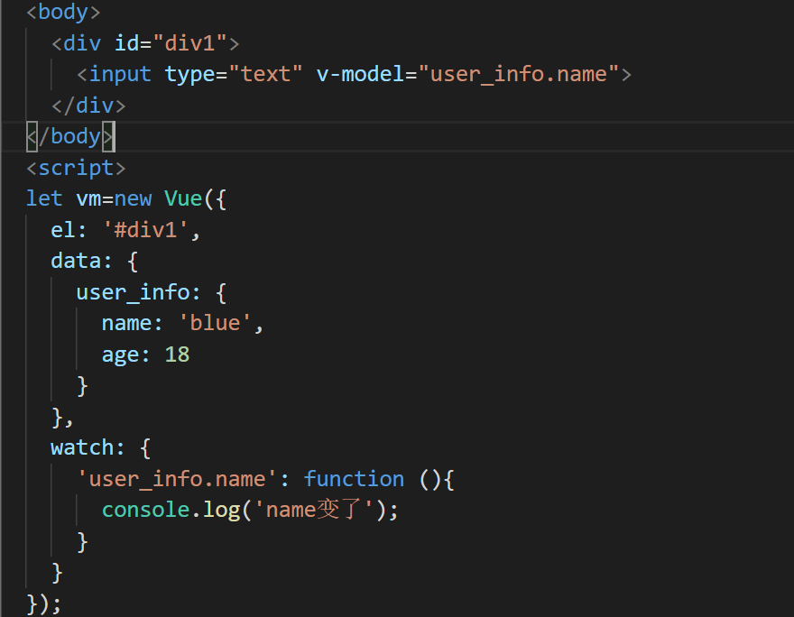

## vue笔记

#### vue-cli的安装

```
vue-cli安装	npm install vue-cli -g
vue-cli的版本查看	vue -V
webpack安装	npm install -g webpack
卸载vue-cli	npm uninstall vue-cli -g
```


#### vue目录框架结构

```
├── README.md            项目介绍
├── index.html           入口页面
├── build              构建脚本目录
│  ├── build-server.js         运行本地构建服务器，可以访问构建后的页面
│  ├── build.js            生产环境构建脚本
│  ├── dev-client.js          开发服务器热重载脚本，主要用来实现开发阶段的页面自动刷新
│  ├── dev-server.js          运行本地开发服务器
│  ├── utils.js            构建相关工具方法
│  ├── webpack.base.conf.js      wabpack基础配置
│  ├── webpack.dev.conf.js       wabpack开发环境配置
│  └── webpack.prod.conf.js      wabpack生产环境配置
├── config             项目配置
│  ├── dev.env.js           开发环境变量
│  ├── index.js            项目配置文件
│  ├── prod.env.js           生产环境变量
│  └── test.env.js           测试环境变量
├── mock              mock数据目录
│  └── hello.js
├── package.json          npm包配置文件，里面定义了项目的npm脚本，依赖包等信息
├── src               源码目录  
│  ├── main.js             入口js文件
│  ├── app.vue             根组件
│  ├── components           公共组件目录
│  │  └── title.vue
│  ├── assets             资源目录，这里的资源会被wabpack构建
│  │  └── images
│  │    └── logo.png
│  ├── routes             前端路由
│  │  └── index.js
│  ├── store              应用级数据（state）
│  │  └── index.js
│  └── views              页面目录
│    ├── hello.vue
│    └── notfound.vue
├── static             纯静态资源，不会被wabpack构建。
└── test              测试文件目录（unit&e2e）
  └── unit              单元测试
    ├── index.js            入口脚本
    ├── karma.conf.js          karma配置文件
    └── specs              单测case目录
      └── Hello.spec.js
```


#### 在DOS窗口创建vue-cli项目

```
vue init webpack
```


#### vue生命周期

**beforeCreate**：在new一个vue实例后，只有一些默认的生命周期钩子和默认事件，其他的东西都还没创建。在beforeCreate生命周期执行的时候，data

和methods中的数据都还没有初始化。不能在这个阶段使用data中的数据和methods中的方法。

**created**：data 和 methods都已经被初始化好了，如果要调用 methods 中的方法，或者操作 data 中的数据，最早可以在这个阶段中操作。

**beforeMount**：执行到这个钩子的时候，在内存中已经编译好了模板了，但是还没有挂载到页面中，此时，页面还是旧的。

**mounted**：执行到这个钩子的时候，就表示Vue实例已经初始化完成了。此时组件脱离了创建阶段，进入到了运行阶段。 如果我们想要通过插件操作页面上的DOM节点，最早可以在和这个阶段中进行。

**beforeUpdate**： 当执行这个钩子时，页面中的显示的数据还是旧的，data中的数据是更新后的， 页面还没有和最新的数据保持同步。

**updated**：页面显示的数据和data中的数据已经保持同步了，都是最新的。

**beforeDestroy**：Vue实例从运行阶段进入到了销毁阶段，这个时候上所有的 data 和 methods ， 指令， 过滤器 ……都是处于可用状态。还没有真正被销毁。

**destroyed**： 这个时候上所有的 data 和 methods ， 指令， 过滤器 ……都是处于不可用状态。组件已经被销毁了。


#### vue优点

**轻量级框架：**只关注视图层，是一个构建数据的视图集合，大小只有几十kb；

**简单易学：**国人开发，中文文档，不存在语言障碍 ，易于理解和学习；

**双向数据绑定：**保留了angular的特点，在数据操作方面更为简单；

**组件化：**保留了react的优点，实现了html的封装和重用，在构建单页面应用方面有着独特的优势；

**视图，数据，结构分离：**使数据的更改更为简单，不需要进行逻辑代码的修改，只需要操作数据就能完成相关操作；

**虚拟DOM：**dom操作是非常耗费性能的， 不再使用原生的dom操作节点，极大解放dom操作，但具体操作的还是dom不过是换了另一种方式；

**运行速度更快:**相比较与react而言，同样是操作虚拟dom，就性能而言，vue存在很大的优势。


#### vue的数据双向绑定原理

vue数据双向绑定是通过数据劫持结合发布者-订阅者模式的方式来实现的。


实现数据的双向绑定，首先要对数据进行劫持监听，所以我们需要设置一个监听器Observer，用来监听所有属性。如果属性发上变化了，就需要告诉订阅者Watcher看是否需要更新。因为订阅者是有很多个，所以我们需要有一个消息订阅器Dep来专门收集这些订阅者，然后在监听器Observer和订阅者Watcher之间进行统一管理的。接着，我们还需要有一个指令解析器Compile，对每个节点元素进行扫描和解析，将相关指令对应初始化成一个订阅者Watcher，并替换模板数据或者绑定相应的函数，此时当订阅者Watcher接收到相应属性的变化，就会执行对应的更新函数，从而更新视图。因此接下去我们执行以下3个步骤，实现数据的双向绑定：

1.实现一个监听器Observer，用来劫持并监听所有属性，如果有变动的，就通知订阅者。

2.实现一个订阅者Watcher，可以收到属性的变化通知并执行相应的函数，从而更新视图。

3.实现一个解析器Compile，可以扫描和解析每个节点的相关指令，并根据初始化模板数据以及初始化相应的订阅器。

**1.实现一个Observer**

Observer是一个数据监听器，其实现核心方法就是前文所说的Object.defineProperty( )。如果要对所有属性都进行监听的话，那么可以通过递归方法遍历所有属性值，并对其进行Object.defineProperty( )处理。如下代码，实现了一个Observer。

```js
function defineReactive(data, key, val) {
    observe(val); // 递归遍历所有子属性
    Object.defineProperty(data, key, {
        enumerable: true,
        configurable: true,
        get: function() {
            return val;
        },
        set: function(newVal) {
            val = newVal;
            console.log('属性' + key + '已经被监听了，现在值为：“' + newVal.toString() + '”');
        }
    });
}
 
function observe(data) {
    if (!data || typeof data !== 'object') {
        return;
    }
    Object.keys(data).forEach(function(key) {
        defineReactive(data, key, data[key]);
    });
};
 
var library = {
    book1: {
        name: ''
    },
    book2: ''
};
observe(library);
library.book1.name = 'vue权威指南'; // 属性name已经被监听了，现在值为：“vue权威指南”
library.book2 = '没有此书籍';  // 属性book2已经被监听了，现在值为：“没有此书籍”
```

思路分析中，需要创建一个可以容纳订阅者的消息订阅器Dep，订阅器Dep主要负责收集订阅者，然后再属性变化的时候执行对应订阅者的更新函数。所以显然订阅器需要有一个容器，这个容器就是list，将上面的Observer稍微改造下，植入消息订阅器：

```js
function defineReactive(data, key, val) {
    observe(val); // 递归遍历所有子属性
    var dep = new Dep(); 
    Object.defineProperty(data, key, {
        enumerable: true,
        configurable: true,
        get: function() {
            if (是否需要添加订阅者) {
                dep.addSub(watcher); // 在这里添加一个订阅者
            }
            return val;
        },
        set: function(newVal) {
            if (val === newVal) {
                return;
            }
            val = newVal;
            console.log('属性' + key + '已经被监听了，现在值为：“' + newVal.toString() + '”');
            dep.notify(); // 如果数据变化，通知所有订阅者
        }
    });
}
 
function Dep () {
    this.subs = [];
}
Dep.prototype = {
    addSub: function(sub) {
        this.subs.push(sub);
    },
    notify: function() {
        this.subs.forEach(function(sub) {
            sub.update();
        });
    }
};
```

从代码上看，我们将订阅器Dep添加一个订阅者设计在getter里面，这是为了让Watcher初始化进行触发，因此需要判断是否要添加订阅者，至于具体设计方案，下文会详细说明的。在setter函数里面，如果数据变化，就会去通知所有订阅者，订阅者们就会去执行对应的更新的函数。到此为止，一个比较完整Observer已经实现了，接下来我们开始设计Watcher。

**2.实现Watcher**

订阅者Watcher在初始化的时候需要将自己添加进订阅器Dep中，那该如何添加呢？我们已经知道监听器Observer是在get函数执行了添加订阅者Wather的操作的，所以我们只要在订阅者Watcher初始化的时候触发对应的get函数去执行添加订阅者操作即可，那要如何触发get的函数，再简单不过了，只要获取对应的属性值就可以触发了，核心原因就是因为我们使用了Object.defineProperty( )进行数据监听。这里还有一个细节点需要处理，我们只要在订阅者Watcher初始化的时候才需要添加订阅者，所以需要做一个判断操作，因此可以在订阅器上做一下手脚：在Dep.target上缓存下订阅者，添加成功后再将其去掉就可以了。订阅者Watcher的实现如下：

```js
function Watcher(vm, exp, cb) {
    this.cb = cb;
    this.vm = vm;
    this.exp = exp;
    this.value = this.get();  // 将自己添加到订阅器的操作
}
 
Watcher.prototype = {
    update: function() {
        this.run();
    },
    run: function() {
        var value = this.vm.data[this.exp];
        var oldVal = this.value;
        if (value !== oldVal) {
            this.value = value;
            this.cb.call(this.vm, value, oldVal);
        }
    },
    get: function() {
        Dep.target = this;  // 缓存自己
        var value = this.vm.data[this.exp]  // 强制执行监听器里的get函数
        Dep.target = null;  // 释放自己
        return value;
    }
};
```

这时候，我们需要对监听器Observer也做个稍微调整，主要是对应Watcher类原型上的get函数。需要调整地方在于defineReactive函数：

```js
function defineReactive(data, key, val) {
    observe(val); // 递归遍历所有子属性
    var dep = new Dep(); 
    Object.defineProperty(data, key, {
        enumerable: true,
        configurable: true,
        get: function() {
            if (Dep.target) {.  // 判断是否需要添加订阅者
                dep.addSub(Dep.target); // 在这里添加一个订阅者
            }
            return val;
        },
        set: function(newVal) {
            if (val === newVal) {
                return;
            }
            val = newVal;
            console.log('属性' + key + '已经被监听了，现在值为：“' + newVal.toString() + '”');
            dep.notify(); // 如果数据变化，通知所有订阅者
        }
    });
}
Dep.target = null;
```

到此为止，简单版的Watcher设计完毕，这时候我们只要将Observer和Watcher关联起来，就可以实现一个简单的双向绑定数据了。因为这里没有还没有设计解析器Compile，所以对于模板数据我们都进行写死处理，假设模板上又一个节点，且id号为'name'，并且双向绑定的绑定的变量也为'name'，且是通过两个大双括号包起来（这里只是为了演示，暂时没什么用处），模板如下：

```html
<body>
    <h1 id="name">{{name}}</h1>
</body>
```

这时候我们需要将Observer和Watcher关联起来：

```js
function SelfVue (data, el, exp) {
    this.data = data;
    observe(data);
    el.innerHTML = this.data[exp];  // 初始化模板数据的值
    new Watcher(this, exp, function (value) {
        el.innerHTML = value;
    });
    return this;
}
```

然后在页面上new以下SelfVue类，就可以实现数据的双向绑定了：

```js
<body>
    <h1 id="name">{{name}}</h1>
</body>
<script src="js/observer.js"></script>
<script src="js/watcher.js"></script>
<script src="js/index.js"></script>
<script type="text/javascript">
    var ele = document.querySelector('#name');
    var selfVue = new SelfVue({
        name: 'hello world'
    }, ele, 'name');
 
    window.setTimeout(function () {
        console.log('name值改变了');
        selfVue.data.name = 'canfoo';
    }, 2000);
 
</script>
```

这时候打开页面，可以看到页面刚开始显示了是'hello world'，过了2s后就变成'canfoo'了。到这里，总算大功告成一半了，但是还有一个细节问题，我们在赋值的时候是这样的形式 '  selfVue.data.name = 'canfoo'  ' 而我们理想的形式是'  selfVue.name = 'canfoo'  '为了实现这样的形式，我们需要在new SelfVue的时候做一个代理处理，让访问selfVue的属性代理为访问selfVue.data的属性，实现原理还是使用Object.defineProperty( )对属性值再包一层：

```js
function SelfVue (data, el, exp) {
    var self = this;
    this.data = data;
 
    Object.keys(data).forEach(function(key) {
        self.proxyKeys(key);  // 绑定代理属性
    });
 
    observe(data);
    el.innerHTML = this.data[exp];  // 初始化模板数据的值
    new Watcher(this, exp, function (value) {
        el.innerHTML = value;
    });
    return this;
}
 
SelfVue.prototype = {
    proxyKeys: function (key) {
        var self = this;
        Object.defineProperty(this, key, {
            enumerable: false,
            configurable: true,
            get: function proxyGetter() {
                return self.data[key];
            },
            set: function proxySetter(newVal) {
                self.data[key] = newVal;
            }
        });
    }
}
```

这下我们就可以直接通过'  selfVue.name = 'canfoo'  '的形式来进行改变模板数据了。

**3.实现Compile**

虽然上面已经实现了一个双向数据绑定的例子，但是整个过程都没有去解析dom节点，而是直接固定某个节点进行替换数据的，所以接下来需要实现一个解析器Compile来做解析和绑定工作。解析器Compile实现步骤：

1.解析模板指令，并替换模板数据，初始化视图

2.将模板指令对应的节点绑定对应的更新函数，初始化相应的订阅器

为了解析模板，首先需要获取到dom元素，然后对含有dom元素上含有指令的节点进行处理，因此这个环节需要对dom操作比较频繁，所有可以先建一个fragment片段，将需要解析的dom节点存入fragment片段里再进行处理：

```js
function nodeToFragment (el) {
    var fragment = document.createDocumentFragment();
    var child = el.firstChild;
    while (child) {
        // 将Dom元素移入fragment中
        fragment.appendChild(child);
        child = el.firstChild
    }
    return fragment;
}
```

接下来需要遍历各个节点，对含有相关指定的节点进行特殊处理，这里咱们先处理最简单的情况，只对带有 '{{变量}}' 这种形式的指令进行处理，先简道难嘛，后面再考虑更多指令情况：

```js
function compileElement (el) {
    var childNodes = el.childNodes;
    var self = this;
    [].slice.call(childNodes).forEach(function(node) {
        var reg = /\{\{(.*)\}\}/;
        var text = node.textContent;
 
        if (self.isTextNode(node) && reg.test(text)) {  // 判断是否是符合这种形式{{}}的指令
            self.compileText(node, reg.exec(text)[1]);
        }
 
        if (node.childNodes && node.childNodes.length) {
            self.compileElement(node);  // 继续递归遍历子节点
        }
    });
},
function compileText (node, exp) {
    var self = this;
    var initText = this.vm[exp];
    updateText(node, initText);  // 将初始化的数据初始化到视图中
    new Watcher(this.vm, exp, function (value) {  // 生成订阅器并绑定更新函数
        self.updateText(node, value);
    });
},
function updateText (node, value) {
    node.textContent = typeof value == 'undefined' ? '' : value;
}
```

获取到最外层节点后，调用compileElement函数，对所有子节点进行判断，如果节点是文本节点且匹配{{}}这种形式指令的节点就开始进行编译处理，编译处理首先需要初始化视图数据，对应上面所说的步骤1，接下去需要生成一个并绑定更新函数的订阅器，对应上面所说的步骤2。这样就完成指令的解析、初始化、编译三个过程，一个解析器Compile也就可以正常的工作了。为了将解析器Compile与监听器Observer和订阅者Watcher关联起来，我们需要再修改一下类SelfVue函数：

```js
function SelfVue (options) {
    var self = this;
    this.vm = this;
    this.data = options;
 
    Object.keys(this.data).forEach(function(key) {
        self.proxyKeys(key);
    });
 
    observe(this.data);
    new Compile(options, this.vm);
    return this;
}
```

更改后，我们就不要像之前通过传入固定的元素值进行双向绑定了，可以随便命名各种变量进行双向绑定了：

```js
<body>
    <div id="app">
        <h2>{{title}}</h2>
        <h1>{{name}}</h1>
    </div>
</body>
<script src="js/observer.js"></script>
<script src="js/watcher.js"></script>
<script src="js/compile.js"></script>
<script src="js/index.js"></script>
<script type="text/javascript">
 
    var selfVue = new SelfVue({
        el: '#app',
        data: {
            title: 'hello world',
            name: ''
        }
    });
 
    window.setTimeout(function () {
        selfVue.title = '你好';
    }, 2000);
 
    window.setTimeout(function () {
        selfVue.name = 'canfoo';
    }, 2500);
 
</script>
```

如上代码，在页面上可观察到，刚开始titile和name分别被初始化为 'hello world' 和空，2s后title被替换成 '你好' 3s后name被替换成 'canfoo' 了。废话不多说，再给你们来一个这个版本的代码（v2）。

到这里，一个数据双向绑定功能已经基本完成了，接下去就是需要完善更多指令的解析编译，在哪里进行更多指令的处理呢？答案很明显，只要在上文说的compileElement函数加上对其他指令节点进行判断，然后遍历其所有属性，看是否有匹配的指令的属性，如果有的话，就对其进行解析编译。这里我们再添加一个v-model指令和事件指令的解析编译，对于这些节点我们使用函数compile进行解析处理：

```js
function compile (node) {
    var nodeAttrs = node.attributes;
    var self = this;
    Array.prototype.forEach.call(nodeAttrs, function(attr) {
        var attrName = attr.name;
        if (self.isDirective(attrName)) {
            var exp = attr.value;
            var dir = attrName.substring(2);
            if (self.isEventDirective(dir)) {  // 事件指令
                self.compileEvent(node, self.vm, exp, dir);
            } else {  // v-model 指令
                self.compileModel(node, self.vm, exp, dir);
            }
            node.removeAttribute(attrName);
        }
    });
}
```

上面的compile函数是挂载Compile原型上的，它首先遍历所有节点属性，然后再判断属性是否是指令属性，如果是的话再区分是哪种指令，再进行相应的处理，处理方法相对来说比较简单，这里就不再列出来，想要马上看阅读代码的同学可以马上[点击这里获取。](https://github.com/canfoo/self-vue/tree/master/v3)

最后我们在稍微改造下类SelfVue，使它更像vue的用法：

```js
function SelfVue (options) {
    var self = this;
    this.data = options.data;
    this.methods = options.methods;
 
    Object.keys(this.data).forEach(function(key) {
        self.proxyKeys(key);
    });
 
    observe(this.data);
    new Compile(options.el, this);
    options.mounted.call(this); // 所有事情处理好后执行mounted函数
}
```

这时候我们可以来真正测试了，在页面上设置如下东西：

```html
<body>
    <div id="app">
        <h2>{{title}}</h2>
        <input v-model="name">
        <h1>{{name}}</h1>
        <button v-on:click="clickMe">click me!</button>
    </div>
</body>
<script src="js/observer.js"></script>
<script src="js/watcher.js"></script>
<script src="js/compile.js"></script>
<script src="js/index.js"></script>
<script type="text/javascript">
 
     new SelfVue({
        el: '#app',
        data: {
            title: 'hello world',
            name: 'canfoo'
        },
        methods: {
            clickMe: function () {
                this.title = 'hello world';
            }
        },
        mounted: function () {
            window.setTimeout(() => {
                this.title = '你好';
            }, 1000);
        }
    });
 
</script>
```

是不是看起来跟vue的使用方法一样，哈，真正的大功告成！


#### Vue1.0和Vue2.0的区别

1.生命周期不一样


2.在vue1.0中可以在template编写时出现：

```html
<template>
   <div>第一行</div>
   <div>第二行</div>
</template>
```

在vue2.0中在template编写时，必须只有一个根元素，否则会报错。

```html
<template>
   <div id='root'>
      <div>这是第一行</div>
      <div>这是第二行</div>
   </div>
</template>
```


#### Vue2.0和Vue3.0的区别（5种）

1.项目目录结构
vue-cli2.0与3.0在目录结构方面，有明显的不同
vue-cli3.0移除了配置文件目录，config 和 build 文件夹，同时移除了 static 静态文件夹
新增了 public 文件夹，打开层级目录还会发现， index.html 移动到 public 中

2.配置项
3.0中config文件已经被移除，但是多了.env.production和env.development文件，除了文件位置，实际配置起来和2.0没什么不同
没了config文件，跨域需要配置域名时，从config/index.js 挪到了vue.config.js中，配置方法不变

3.渲染
Vue2.x使用的Virtual Dom实现的渲染
Vue3.0不论是原生的html标签还是vue组件，他们都会通过h函数来判断，如果是原生html标签，在运行时直接通过Virtual Dom来直接渲染，同样如果是组件会直接生成组件代码（优点：更快、更小）

4.数据监听
Vue2.x大家都知道使用的是es5的object.defineproperties中getter和setter实现的，而vue3.0的版本，是基于Proxy进行监听的，其实基于proxy监听就是所谓的lazy by default，什么意思呢，就是只要你用到了才会监听，可以理解为‘按需监听’，官方给出的诠释是：速度加倍，同时内存占用还减半。

相比于vue2.x，使用proxy的优势如下：

```
defineProperty只能监听某个属性，不能对全对象监听。
可以省去for in、闭包等内容来提升效率（直接绑定整个对象即可）。
可以监听数组，不用再去单独的对数组做特异性操作 vue3.x可以检测到数组内部数据的变化。
```

4.按需引入
Vue2.x中new出的实例对象，所有的东西都在这个vue对象上，这样其实无论你用到还是没用到，都会跑一变。而vue3.0中可以用ES module imports按需引入，如：keep-alive内置组件、v-model指令，等等。

5.composition api
提供了composition api，为更好的逻辑复用与代码组织。


#### 数组key不建议用index

```
（1）key的作用主要是为了高效的更新虚拟DOM
（2）当以index为key值时，如果数组长度发生变化，会导致key的变化，比如删除其中某一项，那么index会相应变化。
所以用index作为key和不加index没有什么区别，都不能提升性能。一般用每项数据的唯一值来作为key，就算数组长度变化，也不会影响到这个key
```


#### 虚拟DOM

模板转换成视图的过程整个过程（如下图）：

- Vue.js通过编译将template 模板转换成渲染函数(render ) ，执行渲染函数就可以得到一个虚拟节点树
- 在对 Model 进行操作的时候，会触发对应 Dep 中的 Watcher 对象。Watcher 对象会调用对应的 update 来修改视图。这个过程主要是将新旧虚拟节点进行差异对比，然后根据对比结果进行DOM操作来更新视图。

简单点讲，在Vue的底层实现上，Vue将模板编译成虚拟DOM渲染函数。结合Vue自带的响应系统，在状态改变时，Vue能够智能地计算出重新渲染组件的最小代价并应到DOM操作上。


- **渲染函数**：渲染函数是用来生成Virtual DOM的。Vue推荐使用模板来构建我们的应用界面，在底层实现中Vue会将模板编译成渲染函数，当然我们也可以不写模板，直接写渲染函数，以获得更好的控制。
- **VNode 虚拟节点**：它可以代表一个真实的 dom 节点。通过 createElement 方法能将 VNode 渲染成 dom 节点。简单地说，vnode可以理解成**节点描述对象**，它描述了应该怎样去创建真实的DOM节点。
- **patch(也叫做patching算法)**：虚拟DOM最核心的部分，它可以将vnode渲染成真实的DOM，这个过程是对比新旧虚拟节点之间有哪些不同，然后根据对比结果找出需要更新的的节点进行更新。这点我们从单词含义就可以看出， patch本身就有补丁、修补的意思，其实际作用是在现有DOM上进行修改来实现更新视图的目的。Vue的Virtual DOM Patching算法是基于**[Snabbdom](https://github.com/snabbdom/snabbdom)**的实现，并在些基础上作了很多的调整和改进。

**Virtual DOM 作用是什么？**

**虚拟DOM的最终目标是将虚拟节点渲染到视图上。**但是如果直接使用虚拟节点覆盖旧节点的话，会有很多不必要的DOM操作。例如，一个ul标签下很多个li标签，其中只有一个li有变化，这种情况下如果使用新的ul去替代旧的ul,因为这些不必要的DOM操作而造成了性能上的浪费。

为了避免不必要的DOM操作，虚拟DOM在虚拟节点映射到视图的过程中，将虚拟节点与上一次渲染视图所使用的旧虚拟节点（oldVnode）做对比，找出真正需要更新的节点来进行DOM操作，从而避免操作其他无需改动的DOM。

其实虚拟DOM在Vue.js主要做了两件事：

- 提供与真实DOM节点所对应的虚拟节点vnode
- 将虚拟节点vnode和旧虚拟节点oldVnode进行对比，然后更新视图

**diff算法比较新旧虚拟dom**

如果节点类型相同，则比较数据，修改数据

如果节点不同，直接干掉节点及所有子节点，插入新的节点

如果给每个节点都设置了唯一的key，就可以准确的找到需要改变的内容，否则就会出现修改一个地方导致其他地方都改变的情况。比如A-B-C-D, 我要插入新节点A-B-M-C-D,实际上改变了C和D。但是设置了key，就可以准确的找到B C并插入。

virtual DOM是将真实的DOM的数据抽取出来，以对象的形式模拟树形结构。比如dom是这样的：

```html
<div>
    <p>123</p>
</div>
```

对应的virtual DOM（伪代码）：

```js
var Vnode = {
    tag: 'div',
    children: [
        { tag: 'p', text: '123' }
    ]
};
```


#### diff算法

```

```


#### vue父子组件传参

##### 父组件向子组件传值

```html
<template>
  <div>
    <h1>父组件</h1>
    <router-view v-bind:fData="data1" :fMessage="data2"></router-view>
  </div>
</template>
 
<script>
export default {
  data () {
    return {
      data1: '父组件数据data1',
      data2: '父组件数据data2',
    };
  }
}
</script>
```

组件中的 所有props 中的数据，都是通过父组件传递给子组件的
 **props 中的数据都是只读的，无法重新赋值** 。

props有default（参数默认值）、type（参数类型）、required（是否必须）和validator属性。validator属性当校验规则很复杂，默认提供的校验规则无法满足的时候可以使用自定义函数来校验。

```html
<template>
  <div>
    <h1>子组件</h1>
    <p>下面是父组件传过来的数据</p>
    <p>第一个数据：{{fData}}</p>
    <p>第二个数据：{{fMessage}}</p>
  </div>
</template>
  
<script>
export default {
  props: ['fData', 'fMessage'],
  data () {
    return {
  
    };
  }
}
</script>
```

##### 父组件把方法传递给子组件

```html
<template>
  <div>
    <h1>父组件</h1>
    <router-view @show="showFather"></router-view>
  </div>
</template>
 
<script>
export default {
  data () {
    return {
 
    };
  },
  methods: {
    showFather (a, b) {
      console.log('触发了父组件的方法' + '======' + a + '======' + b);
    }
  }
}
</script>
```

```html
<template>
  <div>
    <h1>子组件</h1>
    <Button type="primary" @click="sonClick">触发父组件方法</Button>
  </div>
</template>
 
<script>
export default {
  data () {
    return {
 
    };
  },
  methods: {
    sonClick () {
      this.$emit('show', 111, 222);
    }
  }
}
</script>
```

##### 子组件通过事件调用向父组件传值

```html
<template>
  <div>
    <h1>父组件</h1>
    <router-view @show="showFather"></router-view>
  </div>
</template>
 
<script>
export default {
  data () {
    return {
      fromSon1: '',
      fromSon2: ''
    };
  },
  methods: {
    showFather (a, b) {
      this.fromSon1 = a;
      this.fromSon2 = b;
      console.log('触发了父组件的方法' + '======' + a + '======' + b);
    }
  }
}
</script>
```

```html
<template>
  <div>
    <h1>子组件</h1>
    <Button type="primary" @click="sonClick">触发父组件方法</Button>
  </div>
</template>
 
<script>
export default {
  props: ['fData', 'fMessage'],
  data () {
    return {
      sonMessage: '子组件数据sonMessage',
      sonData: '子组件数据sonData'
    };
  },
  methods: {
    sonClick () {
      this.$emit('show', this.sonMessage, this.sonData);
    }
  }
}
</script>
```


#### vue页面传参（3种）

##### query传值--地址栏可见

path 与query结合使用 ；this.$router.push({path:'路由命名', query:{ 参数名:参数值 } });

比如从a.vue跳转至b.vue，传name=‘jack’，代码如下:

```js
this.$router.push({
    path: "/result",
    query: { name: 'jack' }
});
```

在b.vue通过地址栏的url 进行接收参数；可以在created这个函数里面进行接收的，**var name = this.$route.query.name;**就可以接收到name这个参数了；**需要注意的是接收参数的时候是route而不是router。两种方式一一对应，名字不能混用**

##### params传值--地址栏不可见

第二种传参name与params结合使用 ；**this**.$router.push({name:'路由命名',params:{参数名:参数值,参数名:参数值}})；

这个方式要注意一点，在请求的时候需要写上在router下面index.js里面的name。可以和query一同传值。

```js
this.$router.push({
    path: "/result",
    name: "Result",
    query: { name: 'name' },
    params: { usersitelist: 'userlist' }
});
```

params传值在地址栏不可见，但是取值方式是和query一样的，我也是在created函数里面进行取值的；

区别：

query更加类似于我们ajax中get传参；

params则类似于post；说的再简单一点，前者在浏览器地址栏中显示参数，后者则不显示 ；

##### 通过eventBus传递数据

使用前可以在全局定义一个eventBus

```js
window.eventBus = new Vue();
```

在需要传递参数的组件中，定义一个emit发送需要传递的值，键名可以自己定义（可以为对象）

```js
eventBus.$emit('eventBusName', id);
```

在需要接受参数的组件中，用on接受该值（或对象）

```js
//val即为传递过来的值 
eventBus.$on('eventBusName', function(val) {console.log(val)}) 
```

最后记住要在beforeDestroy()中关闭这个eventBus

```js
eventBus.$off('eventBusName');
```


#### v-if与v-show

答: 共同点：都能控制元素的显示和隐藏；

不同点：实现本质方法不同，v-show本质就是通过控制css中的display设置为none，控制隐藏，只会编译一次；

v-if是动态的向DOM树内添加或者删除DOM元素，若初始值为false，就不会编译了。而且v-if不停的销毁和创建比较消耗性能。

总结：如果要频繁切换某节点，使用v-show(切换开销比较小，初始开销较大)。如果不需要频繁切换某节点使用v-if（初始渲染开销较小，切换开销比较大）。


#### computed和watch区别

**computed:**

```js
var var vm = new Vue({
  el: '#demo',
  data: {
    firstName: 'Foo',
    lastName: 'Bar'
  },
  computed: {
    fullName: function () {
      return this.firstName + ' ' + this.lastName
    }
  }
})
```

计算属性顾名思义就是通过其他变量计算得来的另一个属性，fullName在它所依赖firstName，lastName这两个变量变化时重新计算自己的值。

另外，**计算属性具有缓存**。计算属性是基于它们的依赖进行缓存的。计算属性只有在它的相关依赖发生改变时才会重新求值。这就意味着只要 lastName和firstName都没有发生改变，多次访问 fullName计算属性会立即返回之前的计算结果，而不必再次执行函数。

```html
<div id="example">
  {{ message.split('').reverse().join('') + number }}
</div>
```

这js片段虽然看起来挺简单的，但是，如果以后多了需求，要做多一两步的逻辑，在模板里面维护起来就麻烦了，所以类似这种的，我们将其写到 computed 计算属性里面。也就是下面这样子，这样子看起来美观，一看就清楚这是干啥用的。

```html
<template>
  <div>
    <p>{{ reversedMessage }}</p>
  </div>
</template>
 
<script>
export default {
  name: 'test1',
  data () {
    return {
      message: 'hello world',
      number: 1
    }
  },
  computed: {
    // 字符串反转
    reversedMessage () {
      return this.message.split('').reverse().join('') + this.number
    }
  }
}
</script>
```

上面的代码片段中，在 reversedMessage 中，它依赖了 message 和number 这两个属性，一旦其中一个变化了，reversedMessage 会立刻重新计算输出新值。

**computed特点：**

1. 支持缓存，只有依赖数据发生改变，才会重新进行计算。

2. 不支持异步，当computed内有异步操作时无效，无法监听数据的变化。
3. computed 属性值会默认走缓存，计算属性是基于它们的响应式依赖进行缓存的，也就是基于data中声明过或者父组件传递的props中的数据通过计算得到的值。
4. 如果一个属性是由其他属性计算而来的，这个属性依赖其他属性，是一个多对一或者一对一，一般用computed。
5. 如果computed属性属性值是函数，那么默认会走get方法；函数的返回值就是属性的属性值；在computed中的，属性都有一个get和一个set方法，当数据变化时，调用set方法。

**watch:**

```js
var var vm = new Vue({
  el: '#demo',
  data: {
    firstName: 'Foo',
    lastName: 'Bar',
    fullName: 'Foo Bar'
  },
  watch: {
    firstName: function (val) {
      this.fullName = val + ' ' + this.lastName
    },
    lastName: function (val) {
      this.fullName = this.firstName + ' ' + val
    }
  }
})
```

侦听器watch是侦听一个特定的值，当该值变化时执行特定的函数。例如分页组件中，我们可以监听当前页码，当页码变化时执行对应的获取数据的函数。

1. 不支持缓存，数据变，直接会触发相应的操作；
2. watch支持异步；
3. 监听的函数接收两个参数，第一个参数是最新的值；第二个参数是输入之前的值；
4. 当一个属性发生变化时，需要执行对应的操作；一对多；
5. 监听数据必须是data中声明过或者父组件传递过来的props中的数据，当数据变化时，触发其他操作，函数有两个参数，

　　immediate：控制是否第一次渲染时执行回调函数，如果为true组件加载立即触发回调函数执行; 

　　deep: 深度监听，为了发现**对象内部值**的变化，监听器会一层层的往下遍历，给对象的所有属性都加上这个监听器，但是这样性能开销就会非常大，任何修改obj里面任何一个属性都会触发这个监听器里的 handler。复杂类型的数据时使用，例如数组中的对象内容的改变，注意监听数组的变动不需要这么做。deep可以进行优化：给对象的指定属性添加侦听，减少性能开销,这样vue.js会一层一层解析直到遇到属性a，才给a设置监听函数。

注意：

**不应该使用箭头函数来定义 watcher 函数**，因为箭头函数没有 this，它的 this 会继承它的父级函数，但是它的父级函数是 window，导致箭头函数的 this 指向 window，而不是 Vue 实例。

**deep无法监听到数组的变动和对象的新增**，参考vue数组变异,只有以响应式的方式触发才会被监听到

监听的对象也可以写成字符串的形式



**总结**

- computed 的话是通过几个数据的变化，来影响一个数据；而 watch则是可以通过一个数据的变化，去影响多个数据。
- 如果一个数据需要经过复杂计算就用 computed
- 如果一个数据需要被监听并且对数据做一些操作就用 watch


#### **如何解决props层级过深的问题**

```
(1)使用vuex
(2)传递数据，使用以下接收（均不含被props接收的数据）
this.$attrs 接收属性
this.$listeners 接收事件（不含被 .native 修饰符的事件）
```


#### **vue如何优化首屏加载速度**

```
（1）按需加载组件，不一次性加载所有组件

（2）减少打包js，如果打包后的js文件过大，会阻塞加载。如下：
    A、在index.html文件中：
    <script src="/static/common/js/vue.min.js"></script>
    B、在vue.config.js文件中配置:
    config.externals({
    vue: 'Vue',
    })
配置两个步骤，不打包vue

（3）关闭sourcemap，开启压缩代码
vue.config.js文件中配置：productionSourceMap: false,

（4）加个好看的loading效果
```


#### **vue怎么注册全局插件**

首先建一个自定义组件的文件夹，比如叫components，里面有一个index.js，还有一个自定义组件loading.vue。

在index.js中，规定了使用这个组件的名字，以及使用方法，如：

```js
import loadingComponent from './loading.vue'

const loadingComponent={
    install:function(Vue){
        Vue.component('Loading',loadingComponent)
    }  //'Loading'这就是后面可以使用的组件的名字，install是默认的一个方法
};

export default loadingComponent;
```

只要在index.js中规定了install方法，就可以像一些公共的插件一样使用Vue.use()来使用，在入口文件main.js中引入：

```js
import loadingComponent from './components'

Vue.use(loading)
```


这时可以看到就像vue-resource一样，可以在项目中的任何地方使用自定义的组件了，比如在home.vue中使用

```html
<template>
    <div>
        <Loading></Loading>
    </div>
</template>
```

**另外一种表达方式：**

第一步：在components文件下创建组件，及index.js文件，如下图：


第二步：在index.js引入组件

```js
import vHeader from '@/components/Header'
import vContent from '@/components/Content'
import vFooter from '@/components/Footer'
// 组件安装
function vComponent(Vue) {
  // 组件是否已安装
  if(vComponent.installed){
    return;
  }
  Vue.component('vHeader',vHeader);
  Vue.component('vContent',vContent);
  Vue.component('vFooter',vFooter);
}
// 导出组件
export default vComponent
```

第三步：在main.js中，全局注册组件

```js
import Vue from 'vue'
import App from './App'
import router from './router'
import vComponent from './components'

// 全局注册组件
Vue.use(vComponent);

Vue.config.productionTip = false

new Vue({
  el: '#app',
  router,
  components: { App },
  template: '<App/>'
})
```

第四步：在页面home.vue中直接运用组件，无需重新引入


#### **依赖版本~和^**

（1）~
会**匹配最近的小版本依赖包**，比如~1.2.3会匹配所有1.2.x版本，但是不包括1.3.0
（2）^
会**匹配最新的大版本依赖包**，比如^1.2.3会匹配所有1.x.x的包，包括1.3.0，但是不包括2.0.0


#### **router的meta有什么用**

在meta对象中可以设置一些状态，通常**设置标题或是否需要缓存**。$route.meta.keepAlive/$route.meta.title

```js
{
    path:"/test",
    name:"test",
    component:()=>import("@/components/test"),
    meta:{
        title:"测试页面", //配置title
        keepAlive: true //是否缓存
    }
}
```


####  **npm run dev** 

```
（1）npm run dev是执行配置在package.json中的脚本
（2）调用了webpack配置文件
（3）配置文件中调用了main.js
（4）main.js用到了一个html元素#app，引用路由等开始vue的模板编译
```


#### **proxy代理**

proxy是ES6中就存在的，用于修改某些操作的默认行为，可以理解成在目标对象前设一个拦截层，因此也叫“代理器”。

```js
let obj = {
	a : 1
}
let proxyObj = new Proxy(obj,{
	get : function (target,prop) {
    	return prop in target ? target[prop] : 0
    },
    set : function (target,prop,value) {
        target[prop] = 888;
    }
})

console.log(proxyObj.a);        // 1
console.log(proxyObj.b);        // 0

proxyObj.a = 666;
console.log(proxyObj.a)         // 888
```

当我们访问对象内原本存在的属性时，会返回原有属性内对应的值，如果试图访问一个不存在的属性时，会返回0 ，即我们访问 proxyObj.a 时，原本对象中有 a 属性，因此会返回 1 ，当我们试图访问对象中不存在的 b 属性时，不会再返回 undefined ，而是返回了 0 ，当我们试图去设置新的属性值的时候，总是会返回 888 ，因此，即便我们对 proxyObj.a 赋值为 666 ，但是并不会生效，依旧会返回 888!

Vue 框架开发的时候，会遇到跨域的问题，可在config/index.js 里配置proxyTable内容，使用proxy 代理。

```js
proxyTable: {
    '/api': {
        target: 'http://xxx.com:8080', // 你要代理的域名和端口号，要加上http
        changeOrigin: true, // 跨域
        pathRewrite: {
            '^/api': '/api'
    	}
    }
}
/*这里用‘/api’代替target里面的地址，组件中调用接口时直接用api代替,比如我要调用'http://xxx.com:8080/api/NEWS/getNews.json?page=1&pageSize=10
'，直接写‘/api/NEWS/getNews.json?page=1&pageSize=10’即可*/
```


#### **Vue.nextTick()**

**定义：**Vue 在修改数据后，视图不会立刻更新，而是**等同一事件循环中的所有数据变化完成之后，再统一进行视图更新**。在修改数据之后立即使用这个方法，获取更新后的 DOM。

所以就衍生出了这个获取更新后的DOM的Vue方法。所以放在Vue.nextTick()回调函数中的执行的应该是会对DOM进行操作的 js代码；

理解：nextTick()，是将回调函数延迟在下一次dom更新数据后调用，简单的理解是：当数据更新了，在dom中渲染后，自动执行该函数，

```html
<template>
  <div class="hello">
    <div>
      <button id="firstBtn" @click="testClick()" ref="aa">{{testMsg}}</button>
    </div>
  </div>
</template>
 
<script>
export default {
  name: 'HelloWorld',
  data () {
    return {
      testMsg:"原始值",
    }
  },
  methods:{
    testClick:function(){
      let that=this;
      that.testMsg="修改后的值";
      console.log(that.$refs.aa.innerText);   //that.$refs.aa获取指定DOM，输出：原始值
    }
  }
}
</script>

//使用this.$nextTick()
methods:{
    testClick:function(){
        let that=this;
        that.testMsg="修改后的值";
        that.$nextTick(function(){
            console.log(that.$refs.aa.innerText);  //输出：修改后的值
        });
    }
}
```

注意：Vue 实现响应式并不是数据发生变化之后 DOM 立即变化，而是按一定的策略进行 DOM 的更新。$nextTick 是在下次 DOM 更新循环结束之后执行延迟回调，在修改数据之后使用 $nextTick，则可以在回调中获取更新后的 DOM。

什么时候需要用的Vue.nextTick()？

1、Vue生命周期的created()钩子函数进行的DOM操作一定要放在Vue.nextTick()的回调函数中，原因是在created()钩子函数执行的时候DOM 其实并未进行任何渲染，而此时进行DOM操作无异于徒劳，所以此处一定要将DOM操作的js代码放进Vue.nextTick()的回调函数中。与之对应的就是mounted钩子函数，因为该钩子函数执行时所有的DOM挂载已完成。

```js
created(){
    let that=this;
    that.$nextTick(function(){  //不使用this.$nextTick()方法会报错
    	that.$refs.aa.innerHTML="created中更改了按钮内容";  //写入到DOM元素
    });
},
```

2、当项目中你想在**改变DOM元素的数据后**基于新的dom做点什么，**对新DOM一系列的js操作都需要放进Vue.nextTick()的回调函数中；**通俗的理解是：更改数据后当你想立即使用js操作新的视图的时候需要使用它。

3、在使用某个第三方插件时 ，希望在vue生成的某些dom动态发生变化时重新应用该插件，也会用到该方法，这时候就需要在 $nextTick 的回调函数中执行重新应用插件的方法。


**Vue.nextTick**(callback) 使用原理：
原因是，Vue是异步执行dom更新的，一旦观察到数据变化，Vue就会开启一个队列，然后把在同一个事件循环 (event loop) 当中观察到数据变化的 watcher 推送进这个队列。如果这个watcher被触发多次，只会被推送到队列一次。这种缓冲行为可以有效的去掉重复数据造成的不必要的计算和dom操作。而在下一个事件循环时，Vue会清空队列，并进行必要的DOM更新。
当你设置 vm.someData = 'new value'，DOM 并不会马上更新，而是在异步队列被清除，也就是下一个事件循环开始时执行更新时才会进行必要的DOM更新。如果此时你想要根据更新的 DOM 状态去做某些事情，就会出现问题。。为了在数据变化之后等待 Vue 完成更新 DOM ，可以在数据变化之后立即使用 Vue.nextTick(callback) 。这样回调函数在 DOM 更新完成后就会调用。


#### **template 模板编译**

Vue.js通过编译将template 模板转换成渲染函数(render ) 

`compile` 编译可以分成 `parse`、`optimize` 与 `generate` 三个阶段，最终需要得到render函数。

```
<div :class="c" class="demo" v-if="isShow">
    <span v-for="item in sz">{{item}}</span>
</div>
```

首先是 `parse`，`parse` 会用正则等方式将 template 模板中进行字符串解析，得到指令、class、style等数据，形成 AST（[在计算机科学中，抽象语法树（abstract syntax tree或者缩写为AST），或者语法树（syntax tree），是源代码的抽象语法结构的树状表现形式，这里特指编程语言的源代码。](https://zh.wikipedia.org/wiki/抽象語法樹)）。

这个过程比较复杂，会涉及到比较多的正则进行字符串解析，我们来看一下得到的 AST 的样子。

```
{
    /* 标签属性的map，记录了标签上属性 */
    'attrsMap': {
        ':class': 'c',
        'class': 'demo',
        'v-if': 'isShow'
    },
    /* 解析得到的:class */
    'classBinding': 'c',
    /* 标签属性v-if */
    'if': 'isShow',
    /* v-if的条件 */
    'ifConditions': [
        {
            'exp': 'isShow'
        }
    ],
    /* 标签属性class */
    'staticClass': 'demo',
    /* 标签的tag */
    'tag': 'div',
    /* 子标签数组 */
    'children': [
        {
            'attrsMap': {
                'v-for': "item in sz"
            },
            /* for循环的参数 */
            'alias': "item",
            /* for循环的对象 */
            'for': 'sz',
            /* for循环是否已经被处理的标记位 */
            'forProcessed': true,
            'tag': 'span',
            'children': [
                {
                    /* 表达式，_s是一个转字符串的函数 */
                    'expression': '_s(item)',
                    'text': '{{item}}'
                }
            ]
        }
    ]
}
 
```

最终得到的 AST 通过一些特定的属性，能够比较清晰地描述出标签的属性以及依赖关系。


#### **解决初始化页面闪动问题v-cloak**

作用：当网络较慢，网页还在加载 Vue.js ，而导致 Vue 来不及渲染，这时页面就会显示出 Vue 源代码，闪烁花括号{{}}。我们可以使用 v-cloak 指令来解决这一问题，隐藏未编译时候的标签。

```html
<div id="app" v-cloak>
    {{context}}
</div>
```

在简单项目中，使用  v-cloak 指令是解决屏幕闪动的好方法。但在大型、工程化的项目中（webpack、vue-router）只有一个空的 div 元素，元素中的内容是通过路由挂载来实现的，这时我们就不需要用到 v-cloak 指令咯。


#### **vue中对象操作**

Vue无法检测到以下方式变动的数组

- 当你利用索引直接设置一个项时，例如：vm.items[index] = newValue
- 当你修改数组的长度时，例如：vm.items.length = newLength
  针对问题一，解决方案有两种：

```js
var vm = new Vue({
  data: {
    items: ['a', 'b', 'c']
  }
})
// 问题
vm.items[1] = 'x' // 不是响应性的
vm.items.length = 2 // 不是响应性的
//  解决方案
Vue.set(vm.items, indexOfItem, newValue);//方案一
vm.$set(vm.items, indexOfItem, newValue);//等同于方案一
vm.items.splice(indexOfItem, 1, newValue);//方案二
```

Vue无法检测到对象属性的添加和删除。对于已经创建的实例，Vue 不能动态添加根级别的响应式属性，可以使用 Vue.set(object, key, value) 方法向嵌套对象添加响应式属性。

Vue 不能动态添加根级别的响应式属性：

```js
var vm = new Vue({
  data: {
    a: 1
  }
})
vm.b = 2;// vm.a现在是响应式的，vm.b不是响应式的
```

```js
var vm = new Vue({
  data: {
    userProfile: {
      name: 'Anika'
    }
  }
})
// 问题
vm.userProfile.age = 27;// 非响应
// 解决方案
Vue.set(vm.userProfile, 'age', 27);// 方案一
vm.$set(vm.userProfile, 'age', 27);// 等同方案一
vm.userProfile = Object.assign({}, vm.userProfile, {
  age: 27,
  favoriteColor: 'Vue Green'
});// 方案二，方案二是用两个对象的属性创建一个新的对象
```


```html
<div class="test">
    Name: {{testObj.name }}
    hobby: {{ testObj.hobby }}
</div>
```

```js
created () {
	this.testObj.hobby = '篮球'
}
```

有时候我们直接使用`this.testObj.hobby = '篮球'`也可以成功的原因，在于它是在视图渲染之前（比如上面的例子的结果）就将这个添加了属性并赋值，然而这实际上是一种假象，因为这样是不能做是没有办法做到响应式的。

但是如果将添加属性和赋值的操作放在mounted中，会怎样呢？？？它实际上是没有数据显示的。

再看下面的例子，同样在created中，结果还是篮球，也就是说最后修改了属性的值是没有反映在视图上的。

```JS
created () {
    this.testObj.hobby = '篮球'
    setTimeout(() => {
        this.testObj.hobby = '排球'
    }, 0)
}
```

这时我们采用下面的方法就可以实时响应为排球了。

```js
created () {
    this.$set(this.testObj, 'hobby', '自行车')
    setTimeout(() => {
    	this.testObj.hobby = '排球'
    }, 0)
}
```


#### **vue弹窗后如何禁止滚动条滚动**

```js
//禁止滚动
stop(){
    var mo=function(e){e.preventDefault();};
    document.body.style.overflow='hidden';
    document.addEventListener("touchmove",mo,false);//禁止页面滑动
},

/***取消滑动限制***/
move(){
    var mo=function(e){e.preventDefault();};
    document.body.style.overflow='';//出现滚动条
    document.removeEventListener("touchmove",mo,false);
}
```


#### 请求拦截器

作用：统一处理错误及配置请求信息

用户登录成功后服务端返回token的值，然后前端使用axios中请求拦截器（service.interceptors.request.use）在每个的请求接口上加上Authorization:token的值，服务端通过这个Authorization来获取token的值，来进行判断token的值是否过期，如果过期则接口返回403,前端得到403的状态，则提示用户返回登录页。

```js
// 请求拦截器
service.interceptors.request.use(
    config => {
        // 登录流程控制中，根据本地是否存在token判断用户的登录情况
        // 但是即使token存在，也有可能token是过期的，所以在每次的请求头中携带token
        // 后台根据携带的token判断用户的登录情况，并返回给我们对应的状态码
        // 而后我们可以在响应拦截器中，根据状态码进行一些统一的操作。
        const token = localStorage.getItem('token');
        token && (config.headers.Authorization = token);
        return config
    },
    error => {
        // 处理请求错误
        return Promise.reject(error)
    }
)
// 响应拦截器
service.interceptors.response.use(
    //请求成功
    response => {
        const res = response.data;
        if (res.code !== 200 && res.status !== 200) {
            return Promise.reject(res)
        } else {
            return res
        }
    },
    //请求失败
    error => {
        const {
            response
        } = error;
        if (response) {
            // 请求已发出，但是不在30分钟的范围
            errorHandle(response.status, response.data.message);
            return Promise.reject(response);
        } else {
            // 处理断网的情况
            // eg:请求超时或断网时，更新state的network状态
            // network状态在app.vue中控制着一个全局的断网提示组件的显示隐藏
            // 关于断网组件中的刷新重新获取数据，会在断网组件中说明
            // store.commit('changeNetwork', false);
        }
    }
)
/**
 * 请求失败后的错误统一处理
 * @param {Number} status 请求失败的状态码
 */
const errorHandle = (status, other) => {
    // 状态码判断
    switch (status) {
        // 401: 未登录状态，跳转登录页
        case 401:
            toLogin();
            break;
        // 403 token过期
        // 清除token并跳转登录页
        case 403:
            localStorage.removeItem('token');
            MessageBox({
                message: '登录过期，请重新登录',
                callback: action => {
                    toLogin();
                }
            })
            break;
        // 404请求不存在
        case 404:
            tip('请求的资源不存在');
            break;
    }
}
export default service
```


#### **如何进行网站性能优化**（13种）

**1.合并js和css文件**

将js和css分别合并到一个共享文件，这样不仅能够简化代码，而且在执行js文件时，如果js文件较多，就需要多次向服务器请求数据，这样将会延长加载速度，将js文件合并在一起，减少了请求的次数，就能够提高加载的速度；

**2.Sprites图片技术（图片精灵技术）**

图片精灵技术是一种常用的页面速度加载优化的方式，它是将一个页面涉及到的所有的零星图片（注意：只是那些晓得图片、icon）都包含到一张大图中，然后利用css的背景属性将其相应的图片在现在响应的文字，这样当访问一面时，只用加载一张大图即可，而不用一幅一幅的去请求。这种方法既减少了图片的大小，有减少了http请求的次数，可以很大程度的优化页面的加载熟读

**3.压缩图片、文本和代码**

压缩图片和文本也可以减小数据的大小，尤其是代码的压缩，如HTML、XML、JSON、javascript、css等代码的压缩率可达70%以上，代码压缩后可以大大减少文件的体积，是页面可以快速的加载

**4.按需加载（及可见区域以外的区域延时加载）**

为了让用户可以更快的看到网页中最重要的内容，可以优先加载可见区域的内容，延时加载不可见区域的内容，为了避免页面变形可以使用占位符，占位图片来固定宽高。如jquery中的ImageLazyLoad等一些插件就可以很好的实现按需加载，只有当用户鼠标向下滚动式，下面得图片才会加载。当然也可以用原生的js来实现。

**5.确保功能图片优先加载**

网站主要考虑可用性的重要性，一个功能按钮要提前加载出来，用户进入下载页，一个只需要8s时间的下载，花了5s在等待、寻找下载按钮图片，谁能忍受?

**6.图片格式优化**

不正确的使用图片格式是一种很常见的拖慢加载速度的原因，正确的使用图片格式可以数倍的减小图片的大小。一般网页的大图，**如banner图片一般使用jpg格式**，因为jpg是一种有损压缩，可以最大程度的减小图片的体积，而且不会影响视觉体验（不支持透明通道）；**小图片一般用png格式**，一般是无损压缩的（保留透明通道）。

**7. 使用 Progressive JPEGs（高级JPEG）**

Progressive JPEGs图片是JPEG格式的一个特殊变种，名为“高级JPEG”。在创建高级JPEG文件时，数据是这样安排的：在装入图像时，开始只显示一个模糊的图像，随着数据的装入，图像逐步变得清晰。它相当于交织的GIF格式的图片。高级JPEG主要是考虑到使用调制解调器的慢速网络而设计的，快速网络的使用者通常不会体会到它和正常JPEG格式图片的区别。对于网速比较慢的用户，这无疑有很好的体验。

**8.代码的精简**

代码的精简是最直接的方法，也是对于一个程序员编程能力的考验。对代码进行优化，以最少的代码来实现所需的功能，及减少了文件的体积，同时也减少了不必要的时间的浪费。同时不必要的空格、注释、换行等的减少，也可以减少文件的体积。

**9.延迟加载**

网页中的大部分js代码都是在页面加载后才需要执行的，所以对于这些代码可以写在window.onload事件的回调函数中。这样可以使页面主体和一些必要的js代码优先加载的出来，然后来去请求非一开始就需要的代码。

**10.使用Ajax**

当一个页面只有一部分需要更新时，可以使用ajax来对页面进行异步的更新，这样不需要重新的刷新整个页面，重新请求整个页面的数据，而只需要请求需要的那部分数据更新页面即可。这样既提高了页面的加载速度，有提高了体验性。

**11.数据缓存**

HTTP 协议缓存请求，离线缓存 manifest，离线数据缓存localStorage。

**12.提高请求速度**

预解析DNS，减少域名数，并行加载，CDN 分发。

**13.借助自动化工具来实现页面的优化**

比如RadwareFastView


#### **前端怎么做单元测试**

**单测的定义**

来自维基百科的定义：

在计算机编程中，**单元测试**（Unit Testing）又称为**模块测试**，是针对程序模块（软件设计的最小单位）来进行正确性检验的测试工作。程序单元是应用的最小可测试部件。在过程化编程中，一个单元就是单个程序、函数、过程等；对于面向对象编程，最小单元就是方法，包括基类（超类）、抽象类、或者派生类（子类）中的方法。

定义里面指出，单元测试针对的是程序的最小单元，因此我们应该针对最小单元来写单测。

**单测完善程度的衡量**

[文章链接地址](https://zhuanlan.zhihu.com/p/340615580)

单测完善程度的衡量用**覆盖率**来衡量

关于测试覆盖率，我们大致了解下以下几个常见的计算维度：

- 行覆盖率：可执行语句执行的比例
- 函数覆盖率：函数被调用的比例
- 分支覆盖率：判断语句分支被执行的比例

来看下面这个例子：


对于测试用例 foo(4)，分支覆盖率只有50%，原因是 foo(4) 只测试了if 为 true 的情况，没有测试到 if 为 false 的情况。

如果想要分支覆盖率达到100%，还应该测试 foo(5)。

**现状与问题**

- **缺乏意识**：没有单测意识，很多代码没有单测
- **缺乏设计**：模块缺乏设计，相互耦合，写单测困难
- **测试困难**：升级公共 API，人工测试验证困难
- **测试不全面**：部分代码分支众多，人工测试没办法覆盖所有分支

**单测的价值与意义**

- **能力建设**：一个具备开发经验的开发人员，基本上都会编写单元测试。即便不会，可以通过培训来快速达成。从学习曲线上看，单元测试很容易上手。

- **提升效率**：能够通过 mock 数据，及早发现问题，而越早发现Bug，造成的浪费就会越小。

- **追求卓越**：单元测试可以充当一个设计工具，它有助于开发人员去思考代码结构的设计，让代码更加有利于测试。

- **测试更全面**：能够覆盖 QA 测试覆盖不到的情况，比如各种 if 分支、异常处理。

- **更有信心**：升级公共 API 时，如果依赖这个 API 的所有代码单测都能通过，那我们对这次代码升级是更有信心的。

**单测的原则：FIRST**


**单测需要测什么：RIGHT BICEP**


**结果正确**

这个是最基本的检查，如果单测的运行结果都不正确，那其他的都免谈。

**边界条件检查**

边界检查尤为重要，很多错误都是发生在边界上。边界检查遵循 `CORRECT`


- **有序性**：如果一组值是有序的，那么在向其中删除或者添加时，需要校验这组值是否仍然是有序的
- **引用/耦合性**：对于类的状态、其他对象的状态等需要做一些假设，程序员就需要对代码进行测试，保证在假设未满足的情况下运行良好。
- **存在性**：当数据不存在的时候，程序是否运行良好，例如null，空字符串等
- **基数性**：这里的基数主要强调的是计数，考虑以“0-1-N 原则”，当数值分别为0、1、N 时，可能出现的结果，其中N 为最大值。
- **时间性**：要充分考虑与时间相关的问题，涉及到并发、异步、超时等这些情况需要特别注意，所有事情的发生时间是否在预期范围内。

**反向关联检查**

- 例：对于加密算法，使用解密算法反向检查其输出，验证解密后明文是否正确。
- 例：对于写操作API，使用读操作API来反向检查验证

**交叉检查**

- 例： 对性能优化的算法，使用性能差但验证过的算法交叉检查


**强制错误条件发生**

- 例： Mock依赖系统不可用
 或者 Mock系统时间错误
- 例：甚至可以直接throw error，来验证程序对错误的处理

**满足性能要求**

当某个程序升级的时候，是否会对性能造成影响？这需要我们对程序的性能进行测试

**写单测的时机**

写单测的时机主要有以下三种，大家可以根据自己的实际情况来进行选择。

**具体实现代码之前**

即测试驱动开发（TDD）：编写某个功能的代码之前先编写测试代码，然后编写使测试通过的功能代码，重复这个过程，通过测试来推动整个开发的进行。

特点：UT 能够更好的实践我们的代码设计。对于某些复杂度较高的接口（甚至是一些私有方法），建议使用 TDD 进行开发。

**与具体实现代码同步进行**

先写少量功能代码，紧接着写单元测试（重复这两个过程，直到完成功能代码开发）。

特点：每个单测比较简单易懂，可读性可维护性都比较好（重构时单测的改动不大）。

**编写完功能代码后**

这种单元测试“粒度”会比较粗。对同样的功能代码，采取前两种方案的结果可能是用10个“小”的单测来覆盖，而这种方案写的单测，往往是用1个“大”的单测来覆盖。

特点：逻辑就比较复杂，因为它要测的东西很多，可读性可维护性可能会比较差。


#### 前端需要注意哪些SEO

**什么是SEO？**
        它是由英文Search Engine Optimization缩写而来，中文意思是“搜索引擎的优化”。

SEO具体是指通过网站结构调整、网站内容建设、网站代码优化、以及站外优化（网站站外推广、网站品牌建设等），使网站满足搜索引擎的收录排名需求，提高网站在搜索引擎中关键字的排名，从而吸引精准用户进入网站，获得免费流量，产生直接销售或品牌推广。

**需要注意的**

1、 合理的title，description，keyswords 搜索引擎对这三项的权重逐个减小，title 值强调重点即可，重要的关键词出现不要超过两次，而且要靠前。

2 、不同页面的tilte要有所不同；description把页面的内容高度概括，长度合适，不可过分堆叠关键词，不同页面description有所不同。keyswords列举出重要的关键词即可。

3、语义化的HTML代码，符合W3C 规范：语义化代码有利于搜索引擎理解网页。

4 、重要的内容HTML代码放在前面：搜索引擎抓取HTML 的顺序是从上到下，有的搜索引擎对抓取长度有限制，保证重要内容一定会被抓取。

5 、重要的内容不要用js输出，爬虫不会执行js获取内容。

6 、尽量少用iframe ，搜索引擎不会抓取iframe中的内容。

7 、非装饰的图片必须加alt 。

8 、提高网站速度：网站速度是搜索引擎排序的一个重要指标。


#### 单个问题汇总

##### 如何让CSS只在当前组件中起作用？

在组件中的style前面加上scoped。

------

##### keep-alive标签的作用是什么

keep-alive标签用于切换组件时保留隐藏组件的状态。例如当组件a变更了组件a的data，然后把组件a切换为组件b，再切回组件a：如果组件被keep-alive包裹，则组件a的data为变更后的状态；如果组件未被keep-alive包裹，则组件a的data为初始化状态。

------

##### vue-loader是什么？使用它的用途有哪些？

解析和转换.vue文件。提取出其中的逻辑代码 script,样式代码style,以及HTML 模板template，再分别把他们交给对应的loader去处理。

`vue-loader` 会解析文件，提取每个语言块，如有必要会通过其它 loader 处理，最后将他们组装成一个 CommonJS 模块，`module.exports` 出一个 Vue.js 组件对象。

------

##### v-on可以监听多个方法吗？

可以。

```html
<!-- v-on在vue2.x中测试,以下两种均可-->
<button v-on="{mouseenter: onEnter,mouseleave: onLeave}">鼠标进来1</button>
<button @mouseenter="onEnter" @mouseleave="onLeave">鼠标进来2</button>

<!-- 一个事件绑定多个函数，按顺序执行，这里分隔函数可以用逗号也可以用分号-->
<button @click="a(),b()">点我ab</button>
```

------

##### vue组件中data为什么必须是一个函数？

因为JavaScript的特性所导致，在component中，data必须以函数的形式存在，不可以是对象。

组件中的data写成一个函数，数据以函数返回值的形式定义，这样每次复用组件的时候，都会返回一份新的data，相当于每个组件实例都有自己私有的数据空间，它们只负责各自维护的数据，不会造成混乱。而单纯的写成对象形式，就是所有的组件实例共用了一个data，这样改一个全都改了。

------

##### v-if和v-for的优先级

当 v-if 与 v-for 一起使用时，**v-for 具有比 v-if 更高的优先级**，这意味着 v-if 将分别重复运行于每个 v-for 循环中，带来性能方面的浪费（每次渲染都会先循环再进行条件判断）。所以，不推荐v-if和v-for同时使用。
如果v-if和v-for一起用的话，vue中的的会自动提示v-if应该放到外层去。

解决方法：

```html
<template v-for="(item, index) in list" :key="index">	
   <div v-if="item.isShow">{{item.title}}</div>
</template>
```

如果条件出现在循环内部，可通过计算属性 computed 提前过滤掉那些不需要显示的项：

```html
<template>
 <div>
	<div v-for="(user,index) in activeUsers" :key="user.index" >
		{{ user.name }} 
	</div>
</div>
</template>
<script>
export default {
  name:'A',
  data () {
    return {
      users: [{name: 'aaa',isShow: true}, 
              {name: 'bbb',isShow: false}]
    };
  },
  computed: {//通过计算属性过滤掉列表中不需要显示的项目
	activeUsers: function () {
	  return this.users.filter(function (user) {
		return user.isShow;//返回isShow=true的项，添加到activeUsers数组
	  })
	}
  }
};
</script>
```

------

##### assets和static的区别

相同点：assets和static两个都是存放静态资源文件。项目中所需要的资源文件图片，字体图标，样式文件等都可以放在这两个文件下，这是相同点

不相同点：**assets中存放的静态资源文件在项目打包时，也就是运行npm run build时会将assets中放置的静态资源文件进行打包上传**，所谓打包简单点可以理解为压缩体积，代码格式化。而压缩后的静态资源文件最终也都会放置在static文件中跟着index.html一同上传至服务器。**static中放置的静态资源文件就不会要走打包压缩格式化等流程**，而是直接进入打包好的目录，直接上传至服务器。因为避免了压缩直接进行上传，在打包时会提高一定的效率，但是static中的资源文件由于没有进行压缩等操作，所以文件的体积也就相对于assets中打包后的文件提交较大点。在服务器中就会占据更大的空间。

建议：将项目中template需要的样式文件js文件等都可以放置在assets中，走打包这一流程。减少体积。而项目中引入的第三方的资源文件如iconfoont.css等文件可以放置在static中，因为这些引入的第三方文件已经经过处理，我们不再需要处理，直接上传。

------

##### vue常用的修饰符

.stop：等同于JavaScript中的event.stopPropagation()，防止事件冒泡；
.prevent：等同于JavaScript中的event.preventDefault()，防止执行预设的行为（如果事件可取消，则取消该事件，而不停止事件的进一步传播）；
.capture：与事件冒泡的方向相反，事件捕获由外到内；
.self：只会触发自己范围内的事件，不包含子元素；
.once：只会触发一次。

------

##### Vue-router跳转和location.href有什么区别

使用location.href='/url'来跳转，简单方便，但是**刷新了页面**；

使用history.pushState('/url')，**无刷新页面，静态跳转**；

引进router，然后使用router.push('/url')来跳转，使用了diff算法，实现了按需加载，减少了dom的消耗。

其实使用router跳转和使用history.pushState()没什么差别的，因为vue-router就是用了history.pushState()，尤其是在history模式下。

------

##### vue携带token

在前后端完全分离的情况下，Vue项目中实现token验证大致思路如下：

1、第一次登录的时候，前端调后端的登陆接口，发送用户名和密码

2、后端收到请求，验证用户名和密码，验证成功，就给前端返回一个token

3、前端拿到token，将token存储到localStorage和vuex中，并跳转路由页面

4、前端每次跳转路由，就判断 localStroage 中有无 token ，没有就跳转到登录页面，有则跳转到对应路由页面

5、每次调后端接口，都要在请求头中加token

6、后端判断请求头中有无token，有token，就拿到token并验证token，验证成功就返回数据，验证失败（例如：token过期）就返回401，请求头中没有token也返回401

7、如果前端拿到状态码为401，就清除token信息并跳转到登录页面。调取登录接口成功，会在回调函数中将token存储到localStorage和vuex中
