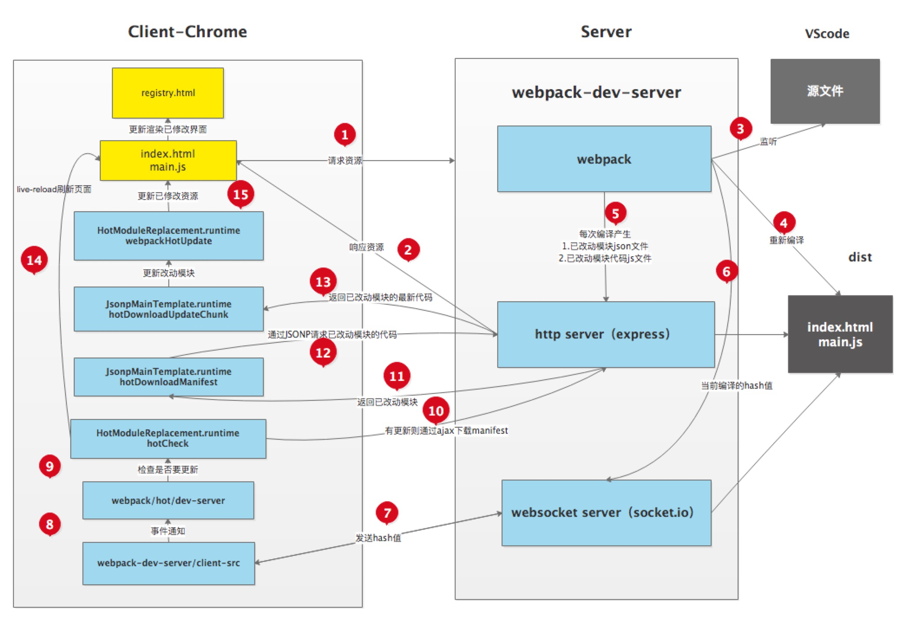

### webpack

#### webpack简介

本质上，*webpack* 是一个现代 JavaScript 应用程序的*静态模块打包器(module bundler)*。当 webpack 处理应用程序时，它会递归地构建一个*依赖关系图(dependency graph)*，其中包含应用程序需要的每个模块，然后将所有这些模块打包成一个或多个 *bundle*。

其中包含四个核心概念

- 入口(entry)：指示 webpack 应该使用哪个模块，来作为构建其内部*依赖图*的开始。进入入口起点后，webpack 会找出有哪些模块和库是入口起点（直接和间接）依赖的
- 输出(output)：告诉 webpack 在哪里输出它所创建的 *bundles*，以及如何命名这些文件，默认值为 `./dist`
- loader：让 webpack 能够去处理那些非 JavaScript 文件（webpack 自身只理解 JavaScript）
- 插件(plugins)：插件则可以用于执行范围更广的任务。插件的范围包括，从打包优化和压缩，一直到重新定义环境中的变量。插件接口功能极其强大，可以用来处理各种各样的任务

“打包”，如何理解？ 假设我们需要寄快递。我们将许多的物品都放进了一个纸皮箱，然后进行封箱。 这就是打包。 对应到前端开发来说，就是将很多的的 css文件，js文件，图片等“物品”，全都写进一个js文件，而不是在一个html页面通过script,link标签去引入多个静态资源。

通过官网的一张图，可以说明webpack的强大，如下所示：


##### webpack作用

1.进行重新加载编译。实际就是将浏览器不认识的语法编译成浏览器认识的语法。比如less编译成css，ES6 语法 转成 ES5等等。

2.减少IO请求。通常我们在请求后，会返回一个html到浏览器。这时，我们如果打开控制台，就会发现在html页面通过script,link等标签引用的静态资源， 浏览器会再次发出请求去获取这些资源。但是webpack的打包，将所有的静态资源都合并好了，减少了IO请求。


#### webpack打包步骤

- 安装node.js

-  全局安装webpack

  运行CMD，安装命令如下所示，其中， -g是全局安装，并移除安装了 webpack和webpack-cli

  ```
  npm install webpack webpack-cli –g
  ```

- 创建本地项目文件夹

- 本地安装webpack

  输入如下命令，在项目目录中安装webpack，其中，--save-dev是本地安装

  ```
  npm install webpack webpack-cli --save-dev
  ```

- 查看webpack 版本

  ```
  webpack -v
  ```

- 创建package.json文件

  输入如下命令，将在项目目录中自动生成package.json文件

  ```
  npm init -y
  ```

- 配置打包目录

  在项目目录下，新建config文件夹，用于存放配置文件；src文件夹，用于存放源码；out文件夹，用于存放打包生成文件。

-  添加webpack.config.js文件

  在config文件夹中添加webpack.config.js文件，并添加如下代码：

  ```js
  const path=require('path'); //调用node.js中的路径
  module.exports={
      entry:{
          index:'./src/js/index.js' //需要打包的文件
      },
      output:{
          filename:'[name].js',    //输入的文件名是什么，生成的文件名也是什么
          path:path.resolve(__dirname,'../out') //指定生成的文件目录
      },
      mode:"development"    //开发模式，没有对js等文件压缩，默认生成的是压缩文件
  }
  ```

- 运行webpack

  在cmd命令窗体中，输入如下命令，运行成功后，在out目录中会生成打包后的index.js

  ```js
  webpack --config config/webpack.config.js
  ```

- 配置package.json

  每次输入命令webpack --config config/webpack.config.js，太长，且非常不方便，此时我们可以在package.json文件中配置，如下所示：

  ```js
  {
    "name": "TestWebpack",
    "version": "1.0.0",
    "description": "",
    "main": "index.js",
    "scripts": {
      "test": "echo \"Error: no test specified\" && exit 1",
      "start": "webpack --config config/webpack.config.js"
    },
    "keywords": [],
    "author": "",
    "license": "ISC",
    "devDependencies": {
      "clean-webpack-plugin": "^3.0.0",
      "webpack": "^4.39.3",
      "webpack-cli": "^3.3.8"
    }
  }
  ```

  配置完成后，我们输入的如下命令，可以直接打包。

  ```
  npm run start
  ```

- JS缓存问题的处理

  通过clean-webpack-plugin插件删除输出目录中之前旧的文件。安装命令：

  ```
  npm install --save-dev clean-webpack-plugin
  ```

  用法：

  ```js
  const path=require('path');
  const {CleanWebpackPlugin} = require('clean-webpack-plugin');
  module.exports={
      entry:{
          index:'./src/js/index.js'
      },
      output:{
          filename:'[name].[chunkhash:8].js',
          path:path.resolve(__dirname,'../out')
      },
      mode:"development",
      plugins:[
          new CleanWebpackPlugin()        
      ]
  }
  ```

   配置完后，我们再次运行npm run start，此时out目录中，只有一个新生成的js文件.


#### 插件运行原理

Webpack 就像一条生产线，要经过一系列处理流程后才能将源文件转换成输出结果。

这条生产线上的每个处理流程的职责都是单一的，多个流程之间有存在依赖关系，只有完成当前处理后才能交给下一个流程去处理。插件就像是一个插入到生产线中的一个功能，在特定的时机对生产线上的资源做处理。

webpack打包过后是将一个一个的模块变成了一个对象，key是模块路径，值是模块里面的代码，只是代码被转化成了字符串，被放在eval环境里面，这样实现的基础是，webpack实现了一个函数_webpack_require()函数，用来引入不同的模块，进而处理模块之间的关系。_webpack_require可以有commonjs规范，cmd规范。

##### webpack plugin的工作机制

在 Webpack 运行的生命周期中会广播出许多事件，Plugin 可以监听这些事件，在合适的时机通过 Webpack 提供的 API 改变输出结果。

主要靠两个对象：compiler对象和compilation对象。

compiler对象：

- Compiler 对象包含了 Webpack 环境所有的的配置信息，包含 options，loaders，plugins 这些信息，这个对象在 Webpack 启动时候被实例化，它是全局唯一的，可以简单地把它理解为 Webpack 实例；

compilation对象：

- Compilation 对象包含了当前的模块资源、编译生成资源、变化的文件等。当 Webpack 以开发模式运行时，每当检测到一个文件变化，一次新的 Compilation 将被创建。Compilation 对象也提供了很多事件回调供插件做扩展。通过 Compilation 也能读取到 Compiler 对象。

Compiler 和 Compilation 的区别在于：**Compiler 代表了整个 Webpack 从启动到关闭的生命周期，而 Compilation 只是代表了一次新的编译**。


#### webpack事件流

核心模块：tabable

实现机制：Webpack 的事件流机制应用了观察者模式，和 Node.js 中的 EventEmitter 非常相似。

插件作用：监听它所关心的事件，就能加入到这条生产线中，去改变生产线的运作。

事件流机制的作用： 保证了插件的有序性，使得整个系统扩展性很好。

Compiler 和 Compilation 都继承自 Tapable，可以直接在 Compiler 和 Compilation 对象上广播和监听事件。


##### webpack-dev-server 运行原理

webpack 将我们的项目源代码进行编译打包成可分发上线的静态资源，在开发阶段我们想要预览页面效果的话就需要启动一个服务器伺服 webpack 编译出来的静态资源。webpack-dev-server 就是用来启动 webpack 编译、伺服这些静态资源。

除此之外，它还默认提供了liveReload的功能，就是在一次 webpack 编译完成后浏览器端就能自动刷新页面读取最新的编译后资源。为了提升开发体验和效率，它还提供了 hot 选项开启 hotReload，相对于 liveReload, hotReload 不刷新整个页面，只更新被更改过的模块。


#### **webpack一些常见 loader 和 plugin**

##### loader

file-loader：把文件输出到一个文件夹中，在代码中通过相对URL引用输入的文件。

url-loader：和file类似，但能在文件很小的情况下以base64方式把文件内容注入到代码中。

image-loader：加载并压缩图片文件。

babel-loader：把ES6转换为ES5。

css-loader：加载CSS，支持模块化、压缩、文件导入等特性。

style-loader：把CSS代码注入到JavaScript中，通过DOM操作去加载CSS。

eslint-loader：通过ESlint检查JavaScript代码。

------

##### plugin

define-plugin：定义环境变量。

commons-chunk-plugin：提取公共代码。

uglifyjs-webpack-plugin：缩小（压缩优化）js文件

------

##### loader和plugin区别

**loader:**

loader是文件加载器，能够加载资源文件，并对这些文件进行一些处理，诸如编译、压缩等，最终一起打包到指定的文件中。

1. 处理一个文件可以使用多个loader，**loader的执行顺序和配置中的顺序是相反的，即最后一个loader最先执行，第一个loader最后执行**
2. 第一个执行的loader接收源文件内容作为参数，其它loader接收前一个执行的loader的返回值作为参数，最后执行的loader会返回此模块的JavaScript源

**plugin:**

在webpack运行的生命周期中会广播出许多事件，plugin可以监听这些事件，在合适的时机通过webpack提供的API改变输出结果。

**区别:**

对于loader，它是一个转换器，将A文件进行编译形成B文件，这里操作的是文件，比如将A.scss转换为A.css，单纯的文件转换过程。

plugin是一个扩展器，它丰富了webpack本身，针对是loader结束后，webpack打包的整个过程，它并不直接操作文件，而是基于事件机制工作，会监听webpack打包过程中的某些节点，执行广泛的任务。


#### webpack处理css

首先介绍下style-loader和css-loader，因为处理css文件之前必须要安装这两个模块，至于这俩是从哪冒出来的，请看[点击打开链接](http://webpack.github.io/docs/list-of-loaders.html)，这里详细介绍了各种loader的使用场景。

```
npm install css-loader style-loader
```

命令行安装成功后，我在src/css下面新建了common.css文件，并且在app.js中通过import引入，要成功引入并生效，需要修改webpack.config.js文件。


好，运行webpack，你会发现common.css真的在生成的index.html中生效了。

讲到这里，再给大家介绍一个神器——**postcss-loader**

先来看官网的介绍[postcss-loader官网介绍](https://github.com/postcss/postcss-loader)

老套路，先安装：

```
npm install postcss-loader --save-dev
```

 关于配置使用，官网也给了例子：

```js
module.exports = {
    module: {
        loaders: [{
            test: /\.css$/,
            //注意这里，loader和loaders都是倒序加载的，也就是首先加载的是postcss-loader
            loaders: [
                'style-loader',
                'css-loader?importLoaders=1',
                'postcss-loader'
            ]
        }]
    }
}
```

好，参照官网的使用方法，我们如下配置：

```js
{
     test: /\.css$/,
     loader: 'style-loader！css-loader!postcss-loader'
}
```

现在postcss-loader的配置基本完成了，是不是可以直接运行使用了呢，不，postcss是需要跟具体插件配合使用的，看官网[postcss plugins](https://github.com/postcss/postcss#plugins)。

官网中给我们列出了很多可用插件，也提到了当下 最受欢迎的一个——[Autoprefixer](https://github.com/postcss/autoprefixer)  ，以此为例我们安装使用一下：

```
npm install autoprefixer --save-dev
```

在这里我采用新建一个postcss.config.js文件的方式：

```js
module.exports = {
    plugins: [
        require('autoprefixer')({
            //兼容主流浏览器的最近五个版本，以添加前缀的方式实现
       		broswers: ['last 5 versions']
        })
    ]
}
```

运行webpack，我们看生成的index.html页面，自动为display:flex添加兼容浏览器的前缀。

```css
ul,li {
	list-style: none;
	display: -webkit-box;
	display: -ms-flexbox;
	display: flex;
}
```


#### webpack处理js

1、首先在webpack.config.js中引入

```js
const uglify = require('uglifyjs-webpack-plugin');
```

2、然后在plugins里配置

```
//插件，用于生产模版和各项功能
plugins:[
    new uglify()
],		//插件，多个插件，所以是数组
```

```js
const path = require('path');
const uglify = require('uglifyjs-webpack-plugin');
module.exports={
    //入口文件的配置项
    entry:{
        entry:'./src/index.js'
    },
    //出口文件的配置项
    output:{
        //输出的路径，用了Node语法
        path:path.resolve(__dirname,'dist'),
        //输出的文件名称
        filename:'bundle.js'
    },
    mode:"development",
    //模块：例如解读CSS,图片如何转换，压缩
    module:{
        rules:[
            {
                test:/\.css$/,
                use:['style-loader','css-loader']
            }
        ]
    },
    //插件，用于生产模版和各项功能
    plugins:[
        new uglify()
    ],//  插件，多个插件，所以是数组
    //配置webpack开发服务功能
    devServer:{
        contentBase:path.resolve(__dirname,'dist'),//本地服务器所加载的页面所在的目录
        host:'192.168.118.221',
        compress:true,
        port:8081
    }//  配置webpack服务
}
```

3、在终端输入webpack，你会发现JS代码已经被压缩了


#### webpack处理html

1、把dist中的index.html复制到src目录中，并去掉我们引入的js

2、在webpack.config.js中引入

```js
const htmlPlugin = require('html-webpack-plugin');
```

3、引入后进行安装   npm install html-webpack-plugin --save-dev

4、在webpack.config.js中进行插件配置

```js
plugins:[
    new uglify(),
    new htmlPlugin({
        minify:{
            removeAttributeQuotes:true
        },
        hash:true,
        template:'./src/index.html'
     })
],//  插件，多个插件，所以是数组
```

5、在终端中输入webpack，进行打包，你会看到index.html文件已经被我们打包到dist文件目录下了，并且自动引入了js文件


#### gulp和webpack功能实现对比

**Gulp**

Gulp就是为了规范前端开发流程，实现前后端分离、模块化开发、版本控制、文件合并与压缩、mock数据等功能的一个前端自动化构建工具。说的形象点，“Gulp就像是一个产品的流水线，整个产品从无到有，都要受流水线的控制，在流水线上我们可以对产品进行管理。”

另外，Gulp是通过task对整个开发过程进行构建。

**webpack**

[Webpack](https://github.com/webpack/webpack) 是当下最热门的前端资源模块化管理和打包工具。它可以将许多松散的模块按照依赖和规则打包成符合生产环境部署的前端资源。还可以将按需加载的模块进行代码分隔，等到实际需要的时候再异步加载。通过 loader的转换，任何形式的资源都可以视作模块，比如 CommonJs 模块、AMD 模块、ES6 模块、CSS、图片、JSON、Coffeescript、LESS 等。


Gulp侧重于前端开发的 **整个过程** 的控制管理（像是流水线），我们可以通过给gulp配置不通的task（通过Gulp中的gulp.task()方法配置，比如启动server、sass/less预编译、文件的合并压缩等等）来让gulp实现不同的功能，从而构建整个前端开发流程。

Webpack有人也称之为 **模块打包机** ，由此也可以看出Webpack更侧重于模块打包，当然我们可以把开发中的所有资源（图片、js文件、css文件等）都可以看成模块，最初Webpack本身就是为前端JS代码打包而设计的，后来被扩展到其他资源的打包处理。Webpack是通过loader（加载器）和plugins（插件）对资源进行处理的。

另外我们知道Gulp是对整个过程进行控制，所以在其配置文件（gulpfile.js）中配置的每一个task对项目中 **该task配置路径下所有的资源** 都可以管理。

比如，对sass文件进行预编译的task可以对其配置路径下的所有sass文件进行预编译处理：

```js
gulp.task('sass',function(){
 	gulp.src('src/styles/*.scss')
 	.pipe(sass().on('error',sass.logError))
 	.pipe(gulp.dest('./build/prd/styles/'));//编译后的输出路径
});
```

上面这个task可以对 `'src/styles/*.scss'` 目录下的所有以 `.scss` 结尾的文件进行预处理。

Webpack则不是这样管理资源的，它是根据模块的 **依赖关系** 进行静态分析，然后将这些模块按照指定的规则生成对应的静态资源。

通俗的说，Webpack就是需要通过其配置文件（webpack.config.js）中 `entry` 配置的一个入口文件（JS文件）,如下图

```
 entry: {
 app:__dirname + "/src/scripts/app.js",
}
```

然后Webpack进入该 `app.js` 文件进行解析， `app.js` 文件如下图：

```
//引入scss文件
import'../style/app.scss';

//引入依赖模块
vargreeter =require('./Greeter.js');
document.getElementById('root').appendChild(greeter());
```

解析过程中，发现一个 `app.scss` 文件，然后根据 `webpack.config.js` 配置文件中的 `module.loaders` 属性去查找处理 `.scss` 文件的loader进行处理，处理 `app.scss` 文件过程中，如果发现该文件还有其他依赖文件，则继续处理 `app.scss` 文件的依赖文件，直至处理完成该“链路”上的依赖文件，然后又遇到一个 `Greeter.js` 模块，于是像之前一样继续去查找对应的loader去处理…

所以，Webpack中对资源文件的处理是通过入口文件产生的依赖形成的，不会像Gulp那样，配置好路径后，该路径下所有规定的文件都会受影响。


#### webpack热更新过程

Hot Module Replacement，简称HMR，无需完全刷新整个页面的同时，更新模块。HMR的好处，在日常开发工作中体会颇深：节省宝贵的开发时间、提升开发体验。

刷新我们一般分为两种：

- 一种是页面刷新，不保留页面状态，就是简单粗暴，直接`window.location.reload()`。
- 另一种是基于`WDS (Webpack-dev-server)`的模块热替换，只需要局部刷新页面上发生变化的模块，同时可以保留当前的页面状态，比如复选框的选中状态、输入框的输入等。

`HMR`作为一个`Webpack`内置的功能，可以通过`HotModuleReplacementPlugin`或`--hot`开启。那么，`HMR`到底是怎么实现热更新的呢？下面让我们来了解一下吧！


项目启动后，进行构建打包，控制台会输出构建过程，我们可以观察到生成了一个 Hash值：`a93fd735d02d98633356`。

然后，在我们每次修改代码保存后，控制台都会出现 `Compiling…`字样，触发新的编译中...可以在控制台中观察到：

- 新的Hash值：`a61bdd6e82294ed06fa3`
- 新的json文件： `a93fd735d02d98633356.hot-update.json`
- 新的js文件：`index.a93fd735d02d98633356.hot-update.js`

**首先，我们知道`Hash`值代表每一次编译的标识。其次，根据新生成文件名可以发现，上次输出的`Hash`值会作为本次编译新生成的文件标识。依次类推，本次输出的`Hash`值会被作为下次热更新的标识。**

然后看一下，新生成的文件是什么？每次修改代码，紧接着触发重新编译，然后浏览器就会发出 2 次请求。请求的便是本次新生成的 2 个文件。

首先看`json`文件，返回的结果中，`h`代表本次新生成的`Hash`值，用于下次文件热更新请求的前缀。`c`表示当前要热更新的文件对应的是`index`模块。

再看下生成的`js`文件，那就是本次修改的代码，重新编译打包后的。


还有一种情况是，如果没有任何代码改动，直接保存文件，控制台也会输出编译打包信息的。

- 新的Hash值：`d2e4208eca62aa1c5389`
- 新的json文件：`a61bdd6e82294ed06fa3.hot-update.json`

但是我们发现，并没有生成新的`js`文件，因为没有改动任何代码，同时浏览器发出的请求，可以看到`c`值为空，代表本次没有需要更新的代码。小声说下，`webapck`以前的版本这种情况`hash`值是不会变的，后面可能出于什么原因改版了。细节不用在意，了解原理才是真谛!!!




如上图所示，右侧`Server`端使用`webpack-dev-server`去启动本地服务，内部实现主要使用了`webpack`、`express`、`websocket`。

- 使用`express`启动本地服务，当浏览器访问资源时对此做响应。
- 服务端和客户端使用`websocket`实现长连接
- `webpack`监听源文件的变化，即当开发者保存文件时触发`webpack`的重新编译。
  - 每次编译都会生成`hash值`、`已改动模块的json文件`、`已改动模块代码的js文件`
  - 编译完成后通过`socket`向客户端推送当前编译的`hash戳`
- 客户端的`websocket`监听到有文件改动推送过来的`hash戳`，会和上一次对比
  - 一致则走缓存
  - 不一致则通过`ajax`和`jsonp`向服务端获取最新资源
- 使用`内存文件系统`去替换有修改的内容实现局部刷新


#### webPack优化

##### 优化 Loader

对于 Loader 来说，影响打包效率首当其冲必属 Babel 了。因为 Babel 会将代码转为字符串生成 AST，然后对 AST 继续进行转变最后再生成新的代码，项目越大，**转换代码越多，效率就越低**。当然了，这是可以优化的。

首先我们**优化 Loader 的文件搜索范围**

```javascript
module.exports = {
  module: {
    rules: [
      {
        // js 文件才使用 babel
        test: /\.js$/,
        loader: 'babel-loader',
        // 只在 src 文件夹下查找
        include: [resolve('src')],
        // 不会去查找的路径
        exclude: /node_modules/
      }
    ]
  }
}
复制代码
```

对于 Babel 来说，希望只作用在 JS 代码上的，然后 `node_modules` 中使用的代码都是编译过的，所以完全没有必要再去处理一遍。

当然这样做还不够，还可以将 Babel 编译过的文件**缓存**起来，下次只需要编译更改过的代码文件即可，这样可以大幅度加快打包时间

```javascript
loader: 'babel-loader?cacheDirectory=true'
复制代码
```

------

##### HappyPack

受限于 Node 是单线程运行的，所以 Webpack 在打包的过程中也是单线程的，特别是在执行 Loader 的时候，长时间编译的任务很多，这样就会导致等待的情况。

**HappyPack 可以将 Loader 的同步执行转换为并行的**，这样就能充分利用系统资源来加快打包效率了

```javascript
module: {
  loaders: [
    {
      test: /\.js$/,
      include: [resolve('src')],
      exclude: /node_modules/,
      // id 后面的内容对应下面
      loader: 'happypack/loader?id=happybabel'
    }
  ]
},
plugins: [
  new HappyPack({
    id: 'happybabel',
    loaders: ['babel-loader?cacheDirectory'],
    // 开启 4 个线程
    threads: 4
  })
]
复制代码
```

------

##### DllPlugin

**DllPlugin 可以将特定的类库提前打包然后引入**。这种方式可以极大的减少打包类库的次数，只有当类库更新版本才有需要重新打包，并且也实现了将公共代码抽离成单独文件的优化方案。DllPlugin的使用方法如下：

```javascript
// 单独配置在一个文件中
// webpack.dll.conf.js
const path = require('path')
const webpack = require('webpack')
module.exports = {
  entry: {
    // 想统一打包的类库
    vendor: ['react']
  },
  output: {
    path: path.join(__dirname, 'dist'),
    filename: '[name].dll.js',
    library: '[name]-[hash]'
  },
  plugins: [
    new webpack.DllPlugin({
      // name 必须和 output.library 一致
      name: '[name]-[hash]',
      // 该属性需要与 DllReferencePlugin 中一致
      context: __dirname,
      path: path.join(__dirname, 'dist', '[name]-manifest.json')
    })
  ]
}
复制代码
```

然后需要执行这个配置文件生成依赖文件，接下来需要使用 `DllReferencePlugin` 将依赖文件引入项目中

```javascript
// webpack.conf.js
module.exports = {
  // ...省略其他配置
  plugins: [
    new webpack.DllReferencePlugin({
      context: __dirname,
      // manifest 就是之前打包出来的 json 文件
      manifest: require('./dist/vendor-manifest.json'),
    })
  ]
}
复制代码
```

------

##### 代码压缩

在 Webpack3 中，一般使用 `UglifyJS` 来压缩代码，但是这个是单线程运行的，为了加快效率，可以使用 `webpack-parallel-uglify-plugin` 来并行运行 `UglifyJS`，从而提高效率。

在 Webpack4 中，不需要以上这些操作了，只需要将 `mode` 设置为 `production` 就可以默认开启以上功能。代码压缩也是我们必做的性能优化方案，当然我们不止可以压缩 JS 代码，还可以压缩 HTML、CSS 代码，并且在压缩 JS 代码的过程中，我们还可以通过配置实现比如删除 `console.log` 这类代码的功能。

------

##### 其他

可以通过一些小的优化点来加快打包速度

- `resolve.extensions`：用来表明文件后缀列表，默认查找顺序是 `['.js', '.json']`，如果你的导入文件没有添加后缀就会按照这个顺序查找文件。我们应该尽可能减少后缀列表长度，然后将出现频率高的后缀排在前面
- `resolve.alias`：可以通过别名的方式来映射一个路径，能让 Webpack 更快找到路径
- `module.noParse`：如果你确定一个文件下没有其他依赖，就可以使用该属性让 Webpack 不扫描该文件，这种方式对于大型的类库很有帮助


#### 如何减少 Webpack 打包体积

##### 按需加载

在开发 SPA 项目的时候，项目中都会存在很多路由页面。如果将这些页面全部打包进一个 JS 文件的话，虽然将多个请求合并了，但是同样也加载了很多并不需要的代码，耗费了更长的时间。那么为了首页能更快地呈现给用户，希望首页能加载的文件体积越小越好，**这时候就可以使用按需加载，将每个路由页面单独打包为一个文件**。当然不仅仅路由可以按需加载，对于 `loadash` 这种大型类库同样可以使用这个功能。

按需加载的代码实现这里就不详细展开了，因为鉴于用的框架不同，实现起来都是不一样的。当然了，虽然他们的用法可能不同，但是底层的机制都是一样的。都是当使用的时候再去下载对应文件，返回一个 `Promise`，当 `Promise` 成功以后去执行回调。

------

##### Scope Hoisting

**Scope Hoisting 会分析出模块之间的依赖关系，尽可能的把打包出来的模块合并到一个函数中去。**

比如希望打包两个文件：

```javascript
// test.js
export const a = 1
// index.js
import { a } from './test.js'
```

对于这种情况，打包出来的代码会类似这样：

```javascript
[
  /* 0 */
  function (module, exports, require) {
    //...
  },
  /* 1 */
  function (module, exports, require) {
    //...
  }
]
```

但是如果使用 Scope Hoisting ，代码就会尽可能的合并到一个函数中去，也就变成了这样的类似代码：

```javascript
[
  /* 0 */
  function (module, exports, require) {
    //...
  }
]
```

这样的打包方式生成的代码明显比之前的少多了。如果在 Webpack4 中你希望开启这个功能，只需要启用 `optimization.concatenateModules` 就可以了：

```js
module.exports = {
  optimization: {
    concatenateModules: true
  }
}
```

------

##### Tree Shaking

**Tree Shaking 可以实现删除项目中未被引用的代码**，比如：

```js
// test.js
export const a = 1
export const b = 2
// index.js
import { a } from './test.js'
```

对于以上情况，`test` 文件中的变量 `b` 如果没有在项目中使用到的话，就不会被打包到文件中。

如果使用 Webpack 4 的话，开启生产环境就会自动启动这个优化功能。


#### 如何⽤**webpack**来优化前端性能

⽤webpack优化前端性能是指优化webpack的输出结果，让打包的最终结果在浏览器运⾏快速⾼效。

- **压缩代码**：删除多余的代码、注释、简化代码的写法等等⽅式。可以利⽤webpack的 UglifyJsPlugin 和 ParallelUglifyPlugin 来压缩JS⽂件， 利⽤ cssnano （css-loader?minimize）来压缩css
- **利⽤CDN加速**: 在构建过程中，将引⽤的静态资源路径修改为CDN上对应的路径。可以利⽤webpack对于 output 参数和各loader的 publicPath 参数来修改资源路径
- **Tree Shaking**: 将代码中永远不会⾛到的⽚段删除掉。可以通过在启动webpack时追加参数 --optimize-minimize 来实现
- **Code Splitting:** 将代码按路由维度或者组件分块(chunk),这样做到按需加载,同时可以充分利⽤浏览器缓存
- **提取公共第三⽅库**: SplitChunksPlugin插件来进⾏公共模块抽取,利⽤浏览器缓存可以⻓期缓存这些⽆需频繁变动的公共代码


#### 如何提⾼**webpack**的构建速度

1. 多⼊⼝情况下，使⽤ CommonsChunkPlugin 来提取公共代码
2. 通过 externals 配置来提取常⽤库
3. 利⽤ DllPlugin 和 DllReferencePlugin 预编译资源模块 通过 DllPlugin 来对那些我们引⽤但是绝对不会修改的npm包来进⾏预编译，再通过 DllReferencePlugin 将预编译的模块加载进来。
4. 使⽤ Happypack 实现多线程加速编译
5. 使⽤ webpack-uglify-parallel 来提升 uglifyPlugin 的压缩速度。 原理上 webpack-uglify-parallel 采⽤了多核并⾏压缩来提升压缩速度
6. 使⽤ Tree-shaking 和 Scope Hoisting 来剔除多余代码

