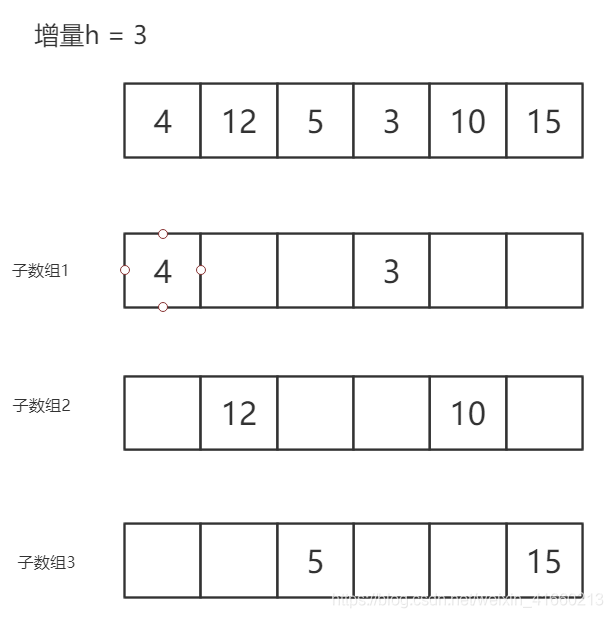

## 手撕代码

#### ajax

```js
//一般来说手写AJAX的时候，首先需要判断该浏览器是否支持XMLHttpRequest对象，如果支持则创建该对象，如果不支持则创建ActiveX对象。

//第一步：创建XMLHttpRequest对象
var xmlHttp;
if (window.XMLHttpRequest) { //非IE
    xmlHttp = new XMLHttpRequest();
} else if (window.ActiveXObject) { //IE
    xmlHttp = new ActiveXObject("Microsoft.XMLHTTP")
}

//一般是有两种请求方式，一个是GET一个是POST，需要设置具体使用哪个请求方式
xmlhttp.open('method',URL,async);

//发送请求
xmlhttp.send();

//当前为异步请求的时候，需要写一个回调函数，XMLHttpRequest对象有一个属性，这个属性要返回一个匿名的方法，所谓的回调函数，就是请求在后台处理完，再返回到前台所实现的功能。
//当XMLHttpRequest 对象的onreadystatechange事件调用时（实际效果是，服务器有任何响应时），回调函数被触发。
xmlhttp.onreadystatechange = function () {
/*
0: 请求未初始化
1: 服务器连接已建立
2: 请求已接收
3: 请求处理中
4: 请求已完成，且响应已就绪
*/
    if(xmlhttp.readyState === 4){
        // 判断是否请求成功
        if(xmlhttp.status >= 200 && xmlhttp.status < 300 || xmlhttp.status === 304){
            console.log(xmlhttp.responseText);
        }else{
           console.log(error);
        }
    }
}
```


#### new对象

```js
let _new = function () {
    // 从Object上克隆一个对象
    let obj = new Object();
    // 获取外部传入的构造器 person，这种写法是获取arguments对象的第一个参数
    Constructor = [].shift.call(arguments);
    // 指向正确的原型
    obj.__proto__ = Constructor.prototype;

    // 克隆构造器的属性给obj
    var ret = Constructor.apply(obj, arguments);

    // 返回这个对象
    return typeof(ret) === 'object' ? ret : obj;
};
```

```js
function _new() {
    //1. 创建一个新对象
    let obj = new Object();
    //2. 让this指向这个对象
    let [func, ...arg] = [...arguments];
    obj.__proto__ = func.prototype;
    //3. 执行构造函数里面的代码
    let res = func.apply(obj, arg);
    //4. 返回这个对象
    if (res && (typeof res === 'object') || (typeof res === 'Function')) {
        return res;
    } else {
        return obj;
    }
}

function Person(uname, age) {
    this.uname = uname;
    this.age = age;
}

let obj1 = new Person('vivian', 18);
let obj2 = _new(Person, 'vivian', 18);
console.log(obj1, obj2);
```


#### 节流

当持续触发事件时，保证在一定时间内只调用一次事件处理函数，意思就是说，假设一个用户一直触发这个函数，且每次触发小于既定值，函数节流会每隔这个时间调用一次。

用一句话总结防抖和节流的区别：**防抖是将多次执行变为最后一次执行，节流是将多次执行变为每隔一段时间执行。**

**防抖函数的应用场景：**

- 按钮提交场景：防⽌多次提交按钮，只执⾏最后提交的⼀次
- 服务端验证场景：表单验证需要服务端配合，只执⾏⼀段连续的输⼊事件的最后⼀次，还有搜索联想词功能类似⽣存环境请⽤lodash.debounce

**节流函数的适⽤场景：**

- 拖拽场景：固定时间内只执⾏⼀次，防⽌超⾼频次触发位置变动
- 缩放场景：监控浏览器resize
- 动画场景：避免短时间内多次触发动画引起性能问题

**节流throttle代码（时间戳+定时器）：**

```js
function throttle(func, delay) {     
    let timer = null;     
    let startTime = Date.now();     
    return function() {             
        let curTime = Date.now();             
        let remaining = delay - (curTime - startTime);             
        let context = this;            
        clearTimeout(timer);              
        if (remaining <= 0) {                    
            func.apply(context, arguments);                    
            startTime = Date.now();              
        } else {                    
            timer = setTimeout(func, remaining);              
        }      
    }
}
function handle() {      
    console.log(Math.random());
} 
window.addEventListener('scroll', throttle(handle, 1000));
```

在节流函数内部使用开始时间startTime、当前时间curTime与delay来计算剩余时间remaining，当remaining<=0时表示该执行事件处理函数了（保证了第一次触发事件就能立即执行事件处理函数和每隔delay时间执行一次事件处理函数）。如果还没到时间的话就设定在remaining时间后再触发 （保证了最后一次触发事件后还能再执行一次事件处理函数）。当然在remaining这段时间中如果又一次触发事件，那么会取消当前的计时器，并重新计算一个remaining来判断当前状态。


#### 去抖

debounce，去抖动。策略是当事件被触发时，设定一个周期延迟执行动作，若期间又被触发，则重新设定周期，直到周期结束，执行动作。 这是debounce的基本思想，在后期又扩展了前缘debounce，即执行动作在前，然后设定周期，周期内有事件被触发，不执行动作，且周期重新设定。

```js
// 防抖
function debounce(func, delay) {    
　　　let timer = null;
     let result;
　　　return function() {
     	let context = this;
       	if (timer) {
           	clearTimeout(timer);
       	}
       	timer = setTimeout(function() {
           	result = func.apply(context, arguments);
       	}, delay);
       return result;
   }
}
// 处理函数
function handle() {    
    console.log(Math.random()); 
}
// 滚动事件
window.addEventListener('scroll', debounce(handle, 1000));
```


#### 排序

##### 冒泡排序

假如我们现在按身高升序排队，一种排队的方法是：从第一名开始，让两人相互比身高，若前者高则交换位置，更高的那个在与剩下的人比，**这样一趟下来之后最高的人就站到了队尾**。接着重复以上过程，直到最矮的人站在了队列首部。我们把队头看作水底，队尾看作水面，那么第一趟比较下来，最高的人就像泡泡一样从水底”冒“到水面，第二趟比较则是第二高的人……排队的过程即为对数据对象进行排序的过程（这里我们排序的”指标“是身高），上述过程即描述了冒泡排序的思想。从以上过程我们可以看到，若对n个人进行排队，我们需要n-1趟比较，而且第k趟比较需要进行n-k次比较。通过这些信息，我们能够很容易的算出冒泡排序的复杂的。首先，排序算法通常都以数据对象的两两比较作为”关键操作“，这里我们可以得出，冒泡排序需要进行的比较次数为: (n-1) + (n-2) + ... + 1 = n*(n-1) / 2，因此冒泡排序的时间复杂度为**O(n^2)**。

```js
function bubbleSort(nums) {
    //每轮循环都从最后一个元素开始 比较并交换 一次循环会把最小的数顶到最上面
    for (let i = 0; i < nums.length - 1; i++) { //只是控制次数为n-1
        for (let j = nums.length - 1; j > i; j--) {
            if (nums[j] < nums[j - 1]) {
                //交换
                let temp = nums[j];
                nums[j] = nums[j - 1];
                nums[j - 1] = temp;
            }
        }
    }
}

//test
nums = [5, 1, 4, 2, 8];
bubbleSort(nums);
console.log(nums);
```


##### 选择排序

回到上面我们提到的排队问题，除了上面提到的方法，还有这样一种排队的方法，让目前队头的人依次与其后的每个人进行比较，比较后较矮的那个人继续与后面的人进行比较，这样第一趟比较下来，就能够**找到最矮的人， 然后把这个最矮的人和当前队头的人交换一下位置**。然后第二趟比较，让第二名依次与后面比较，可以找到第二矮的人，然后让第二矮的人和当前队列第二名交换位置，依此类推，一共进行n-1趟比较后，就能完成整个排队过程。根据上述描述，我们可以知道，第k趟比较需要进行的数组元素的两两比较的次数为n-k次，所以共需要的比较次数为n*(n-1) / 2，因此选择排序算法的时间复杂度与冒泡排序一样，也为**O(n^2)**。

```js
function selectionSort(nums) {
    //和冒泡排序类似，但是并不在每次比较后交换 而是记录最小值(初识最小值为nums[i]) 最后再交换一次 
    //每次循环也是从最后开始 把最小元素放到最顶部
    for (let i = 0; i < nums.length - 1; i++) { //n -1循环
        let index = i;
        for (let j = nums.length - 1; j > i; j--) {
            if (nums[j] < nums[index]) {
                index = j;
            }
        }
        //交换
        let temp = nums[i];
        nums[i] = nums[index];
        nums[index] = temp;
    }
}

//test
nums = [5, 1, 4, 2, 8];
selectionSort(nums);
console.log(nums);
```


##### 插入排序

回想下我们平时打扑克抓牌的过程，通常我们用右手抓牌，每抓一张牌，就放到左手上，抓下一张牌后，会把这张牌依次与左手上的牌比较，并把它插入到一个合适的位置（通常按照牌面大小）。上述的过程即为插入排序的过程，假设待排序数组为a，我们从a[1]开始，让a[1]与a[0]比较，若a[1]较小，则让a[1]和a[0]交换位置，此时a[0]和a[1]就相当于已经放入左手中的牌。然后我们再让a[2]与a[1]、a[0]比较，并为它找到一个合适的位置，以此类推，直到为数组的最后一个元素也找到了合适的位置。

理解了插入排序的思想后，我们便能够得到它的时间复杂度。对于n个元素，一共需要进行n-1轮比较，而第k轮比较需要进行k次数组元素的两两比较，因此共需要进行的比较次数为：1 + 2 + ... + (n-1)，所以插入排序的时间复杂度同冒泡排序一样，也为**O(n^2)**。

```js
function insertionSort(nums) {
    //插入排序 从第二个元素开始 把元素插入到合适的位置 每次比较（除了最后一次）都要交换
    for (let i = 1; i < nums.length; i++) {
        for (let j = i; j > 0; j--) {
            if (nums[j] < nums[j - 1]) {
                //交换
                let temp = nums[j];
                nums[j] = nums[j - 1];
                nums[j - 1] = temp;
            } else {
                break;
            }
        }
    }
}

//test
nums = [5, 1, 4, 2, 8];
insertionSort(nums);
console.log(nums);
```


##### 希尔排序

希尔排序是对插入排序的一种改进，它的核心思想是将待排序数组中任意间隔为h的元素都变为有序的，这样的数组叫做**h有序数组**。比如数组[5, 3, 2, 8, 6, 4, 7, 9, 5], 我们可以看到a[0]、a[3]、a[6]是有序的，a[1]、a[4]、a[7]是有序的，a[2]、a[5]、a[8]是有序的，因此这个数组是一个h有序数组（h=3）。根据h有序数组的定义，我们可以知道，当h=1时，相应的h有序数组就是一个已经排序完毕的数组了。希尔排序的大致过程如下：把待排序数组分割为若干子序列（一个子序列中的元素在原数组中间隔为h，即中间隔了h-1个元素），然后对每个子序列分别进行插入排序。然后再逐渐减小h，重复以上过程，直至h变为足够小时，再对整体进行一次插入排序。由于h足够小时，待排序数组的逆序数已经很小，所以再进行一次希尔排序是很快的。希尔排序通常要比插入排序更加高效。

实现希尔排序时，我们需要选取一个h的取值序列，这里我们直接采用[算法（第4版） (豆瓣)]一书中提供的h取值序列（1,4,13,40,121, ...)。即h =  3 * k + 1，其中k为[0, N/3)区间内的整数。

如下图
第一趟排序，增量 h 取 a.length / 3+1 = 3，将原始数组按照增量划分为3个子数组，并对每一个子数组进行插入排序。



每个子数组插入排序后，合并为一个数组，原始数组就变成了下图。

第二趟排序，增量h 取 h / 3+1 = 2，数组按照新的增量被划分为2个子数组，
对两个子数组进行插入排序。


将子数组合并后，数组就变成了下图。


第三趟排序，增量 h 取 h / 3+1 = 1,此时没有子数组了，直接对数组进行插入排序，得到结果。


```java
public class Shell {
    public static void sort(int[] a) {
        int N = a.length;
        int h = 1;
        while (h < N / 3) {
            h = 3 * h + 1; //h的取值序列为1, 4, 13, 40, ...
        }
        while (h >= 1) {
            int n, i ,j, k;
            //分割后，产生n个子序列
            for (n = 0; n < h; n++) {
                //分别对每个子序列进行插入排序
                for (i = n + h; i < N; i += h) {
                    for (j = i - h; j >= 0 && a[i] < a[j]; j -= h) {

                    }
                    int tmp = a[i];
                    for (k = i; k > j + h; k -= h) {
                        a[k] = a[k-h];
                    }
                    a[j+h] = tmp;
                }
            }
            h = h / 3;
        }
    }
}
```

实际上，h的取值序列的选取会影响到希尔排序的性能，不过以上我们选取的h值序列在通常情况下性能与复杂的取值序列相接近，但是在最坏情况下的性能要差一些。分析希尔排序的复杂度不是一件容易的事，这里我们引用《算法》一书中关于希尔排序复杂度的结论：

> 使用递增序列1, 4, 13, 40, 121, 364, ...的希尔排序所需的比较次数不会超过数组尺寸的若干倍乘以递增序列的长度。

也就是说，在通常情况下，希尔排序的复杂度要比O(n^2)好得多。实际上，最坏情况下希尔排序所需要的比较次数与**O(n^1.5)**成正比，在实际使用中，希尔排序要比插入排序和选择排序、冒泡排序快得多。而且尽管待排序数组很大，希尔排序也不会比快速排序等高级算法慢很多。因此当需要解决排序问题而用没有现成系统排序函数可用时，可以优先考虑希尔排序，当希尔排序确实满足不了对性能的要求时，在考虑使用快速排序等算法。


##### 快速排序

快速排序是目前应用最广泛的排序算法之一，它是一般场景中大规模数据排序的首选，它的实际性能要好于归并排序。通常情况下，快速排序的时间复杂度为**O(nlogn)**，但在最坏情况下它的时间复杂度会退化至**O(n^2)**，不过我们可以通过对输入数组进行“随机化”（打乱元素的排列顺序）来避免最坏情况的发生。除了实际执行性能好，快速排序的另一个优势是它能够实现“原地排序”，也就是说它几乎不需要额外的空间来辅助排序。下面我们来具体介绍下这个优秀排序算法的原理及实现。

快速排序的主要思想如下：假设待排序数组为a[0..N-1]，递归的对该数组执行以下过程：选取一个*切分元素*，而后通过数组元素的交换将这个切分元素移动到位置j，使得所有a[0..j-1]的元素都小于等于a[j]，所有a[j+1..N-1]的元素都大于等于a[j]。

在快速排序中，切分元素的选取很关键，通常我们可以选取输入数组的第一个元素作为切分元素，然后把它交换到数组中的合适位置使得它左边的元素都小于等于它，右边的元素都大于等于它，而后对其左右两边的子数组递归执行切分过程，即可完成对整个数组的排序。


```js
//快速排序最差O（n^2）最优O（nlogn）
function qsort(nums, l, r) {
    if (r <= l) return; //注意定义递归中止条件
    let pivot = nums[l]; //选择最左为轴值
    swap(nums, l, r); //把轴值与最右交换

    let i = l;
    for (let j = l; j < r; j++) {
        if (nums[j] < pivot) {
            swap(nums, i, j);
            i++;
        }
    }
    swap(nums, i, r); //此时i为轴值下标
    qsort(nums, l, i - 1);
    qsort(nums, i + 1, r);
}
function swap(nums, i, j) {
    let temp = nums[i];
    nums[i] = nums[j];
    nums[j] = temp;
}

//test
nums = [5, 1, 4, 2, 8, 11, 2, 3];
qsort(nums, 0, nums.length - 1);
console.log(nums);
```


##### 堆排序

堆排序（Heapsort）是指利用堆这种数据结构所设计的一种排序算法。堆积是一个近似完全二叉树的结构，并同时满足堆积的性质：即子结点的键值或索引总是小于（或者大于）它的父节点。堆排序可以说是一种利用堆的概念来排序的选择排序。分为两种方法：

1.大顶堆：每个节点的值都大于或等于其子节点的值，在堆排序算法中用于升序排列；

2.小顶堆：每个节点的值都小于或等于其子节点的值，在堆排序算法中用于降序排列；

堆排序的平均时间复杂度为 **Ο(nlogn)**。

堆排序分为堆的构造阶段和下沉排序阶段。

**堆的构造阶段**

要学习今天的堆排序（Heap Sort），我们以一个数组arr=[5,1,4,2,8,4]开始；


我们首先以这个数组建立一个大顶堆，插入结点5作为根结点；


然后将结点1插入到最后一个位置，也就是结点5的左孩子，1<5，满足大顶堆的属性；


将结点4插入到最后一个位置，即结点5的右孩子，又因为4<5，满足大顶堆的属性，不需要进行调整；


将结点2插入到最后一个位置，即结点1的左孩子位置，但是此时不满足大顶堆的属性（插入结点2小于其父结点1的值)，所以交换两者的值；此时并未结束，继续判断此时插入结点2与当前父结点5的大小关系，发现2<5，满足大顶堆的属性，结束判断。这个过程就是二叉堆的插入操作；


紧接着将结点8插入到最后一个位置，即结点2的右孩子位置，此时不满足大顶堆的属性（插入结点8小于其父结点2），故交换两者位置;然后继续向上修正，判断当前结点8与其父结点5的大小关系，8>5(不满足大顶堆的属性)，交换两者位置，继续修正，发现结点8已为树的根结点，修正结束；


最后，我们将结点4插入到最后一个位置，即结点4(下标为2)的左孩子位置，且其值小于等于父结点，故不进行修正。


以上算是对于二叉堆插入操作的一个回顾，建堆的过程（这里是按照插入操作进行建堆的），接下来才是堆排序的核心操作。

设 表示堆中的元素个数，对数组 **`arr = [8,5,4,1,2,4]`** 而言， ;

第一步：将堆顶的元素 **8** （即数组 `arr[0]` ，最大元素）的元素与堆的最后一个元素 **4**（即数组当中的最后一个元素 **4** ）交换，此时就相当于选择出了数组当中的最大元素，将其从堆中去掉：


第二步：从结点 **4** （下标为 **0** ）开始进行 **堆化**（Heapify）操作，这里我们只啰嗦一次奥！计算结点 **4** （下标为 **0** ）的左孩子 （即结点 **5** ），右孩子 （即结点 **4**），比较三者的大小，发现 **5 > 4** 违反了堆的性质，交换 **5** 和根结点 **4** ；然后继续对结点 **4** （下标为 **1** ）进行判断，发现其左孩子 **1** 和右孩子 **2** 均小于 **4** ，堆化结束。


第三步：将堆顶元素 **5** （下标为 0）和当前最后一个元素 **2** （即 i 指向的位置）交换， 此时就相当于选择出了数组当中的次最大元素，将其从堆中去掉：


第四步：从当前的堆顶元素 **2** 开始进行堆化操作，交换 **2** （下标 0）和其左孩子 **4** （下标 1），为什么不是右孩子 **4** （下标 2）呢？因为我们在堆化的时候，优先和左孩子进行了对比，只有当右孩子大于左孩子的情况下，才考虑将右孩子与其父结点交换，堆化后的结果如下图所示：


第五步：交换根结点 **4** 和最后一个结点 **1** ，从堆中去掉结点 **4** （下标 3）：


第六步：从根结点 **1** 开始进行堆化操作，交换了根结点 **1** 和 **4** （下标 2）：


第七步：交换根结点 **4** 和 **1** ，从堆中去掉结点 **4** ：


第八步：从根结点 **1** 开始进行堆化操作，交换了结点 **2** 和 **1** ：


第九步：交换根结点 **2** 和最后一个元素 **1** ，将结点 **2** 从堆中去掉：


第十步：发现堆中仅剩余一个元素，堆排序结束，我们看到原始的输入数组  **`arr = [5、1、4、2、8、4]`** 变成了有序数组  **`arr = [1、2、4、4、5、8]`** 。

```js
//堆排序 建堆O（n） 删除n个O（nlogn）
function heapSort(nums) {
    if (nums.length <= 1) return nums;
    let res = [];
    let heapSize = nums.length;
    buildHeap(nums, heapSize);
    for (let i = 0; i < nums.length; i++) {
        res.push(nums[0]);
        swap(nums, 0, --heapSize);
        siftDown(nums, 0, heapSize);
    }
    return res;
}
//建堆 (最小堆)
function buildHeap(nums, heapSize) {
    for (let i = Math.floor(heapSize / 2) - 1; i >= 0; i--) {
        siftDown(nums, i, heapSize);
    }
}
//siftDown 
function siftDown(nums, i, heapSize) {
    let smallest = i;
    let l = 2 * i + 1;
    let r = 2 * i + 2;
    if (l < heapSize && nums[l] < nums[smallest]) {
        smallest = l;
    }
    if (r < heapSize && nums[r] < nums[smallest]) {
        smallest = r;
    }
    if (smallest != i) {
        swap(nums, i, smallest);
        siftDown(nums, smallest, heapSize);
    }
}
function swap(nums, i, j) {
    let temp = nums[i];
    nums[i] = nums[j];
    nums[j] = temp;
}

//test
nums = [5, 1, 4, 2, 8, 11, 2, 3];
let res = heapSort(nums);
console.log(res);
```

##### 归并排序

归并排序使用了一种叫做”分治“的思想来解决排序问题。分治也就是"分而治之“，也就是把一个大问题分解为众多子问题，而后分别得到每个子问题的解，最终以某种方式合并这些子问题的解就可以得到原问题的解。归并排序的主要思想是：将待排序数组递归的分解成两半，分别对它们进行排序，然后将结果“归并”（递归的合并）起来。我们知道，递归算法都有一个base case，递归分解数组的base case就是分解完的两个数组长度为为1，这时候它们本身就有序，此时就可以进行归并了。

归并排序的时间复杂度为**O(nlogn)**, 它的主要缺点是所需的额外空间与待排序数组的尺寸成正比。

 首先，我们先来实现归并方法，这个方法接收一个int[]数组a以及low、mid、high参数，用于将a[low..mid]（代表a[low]到a[mid]间的元素，包括a[low]和a[mid]）和a[mid+1..high]归并为一个数组，这个方法假设a[low..mid]与a[mid+1..high]都是有序的。

  下面我们用一个具体例子来描述归并算法的执行过程，假如我们的输入数组为[2, 4, 6, 8, 1, 3, 5, 7]，low为0，mid为3，high为7。我们称a[low..mid]为左数组，a[mid+1..high]为右数组，归并方法的执行过程如下：

- 取左右数组的第一个元素进行比较，较小的那个放入新数组的第一个位置中，如下图所示：


- 取右数组的下一个元素与2进行比较，较小的放入新数组的下一个位置，如下图所示：


- 下一步我想不用我说大家也知道了，实际上我们可以把这个过程想象成左右两边轮番出人比武，比输的那个就被淘汰到“场外”，由于两边都是让弱的先出场，所以随后第一个出局的肯定就是最弱的。最后新数组中就按“武功高低”的升序对输入元素进行了排序。以上我们描述的就是归并方法的执行过程。

```js
function mergeSort(nums) {
    if (nums.length <= 1) return nums;
    let middle = Math.floor(nums.length / 2);
    let arr1 = nums.slice(0, middle);
    let arr2 = nums.slice(middle);
    return merge(mergeSort(arr1), mergeSort(arr2));
}
function merge(arr1, arr2) {
    let res = [];
    while (arr1.length > 0 && arr2.length > 0) {
        if (arr1[0] <= arr2[0]) {
            res.push(arr1.shift());
        } else {
            res.push(arr2.shift());
        }
    }
    return res.concat(arr1).concat(arr2);
}
//test
nums = [5, 1, 4, 2, 8, 11, 2, 3];
let res = mergeSort(nums);
console.log(res);
```

#### 函数柯里化

```js
function sum(...args) {
    //对第一层参数求和
    let x = args.reduce((acc, next) => {
        return acc + next;
    })
    //返回一个新的函数 
    return function (...args2) { //第二层的参数
        //当没有第二层参数时，返回x即可
        if (args2.length == 0) return x;
        let y = args2.reduce((acc, next) => {
            return acc + next;
        })
        return sum(x + y); //返回x+y作为新的第一层
    }
}

console.log(sum(1, 2)(3)(4)()); // 10
console.log(sum(1)(2, 3, 4, 5)(10)()); // 25

//自己写一个减法的 天才！
function decrease(...args) {
    let x = args.reduce((acc, next) => {
        return acc - next;
    })
    console.log(x);
    return function (...args2) {
        if (args2.length == 0) return x;
        let y = args2.reduce((acc, next) => {
            return acc - next;
        }, 0)
        console.log(y);
        return decrease(x + y);
    }
}
console.log(decrease(1, 2)(3)(4, 5)()); // -13
console.log(decrease(1)(2, 3, 4, 5)(10)()); // -23
```

#### 清除前后空格

```js
String.prototype.trim = function () {
    return this.replace(/^\s+/g, "").replace(/\s+$/g, "");
}
let str = '   123   ';
console.log(str);
let str1 = str.trim();
console.log(str1);
```

#### 数组拍平

```js
function flatten(arr) {
    let res = [];
    for (let i = 0; i < arr.length; i++) {
        if (Array.isArray(arr[i])) {
            res = res.concat(flatten(arr[i]));
        } else {
            res.push(arr[i]);
        }
    }
    return res;
}

let arr = [1, 2, 3, [4, 5, 6, [7, 8, 9]], 10];
console.log(flatten(arr));
```

#### 图片懒加载

```js
<!DOCTYPE html>
<html lang="en">

<head>
    <meta charset="UTF-8">
    <meta http-equiv="X-UA-Compatible" content="IE=edge">
    <meta name="viewport" content="width=device-width, initial-scale=1.0">
    <title>Document</title>
    <style>
        img {
            display: block;
            width: 100%;
            height: 300px;
            margin-bottom: 10px;
        }
    </style>
</head>

<body>
    
    
    
    
    
    
    
    
    
    
    
    
</body>
<script>
    var imgs = document.querySelectorAll('img');

    //获得元素距离页面顶部的距离
    function getTop(e) {
        var T = e.offsetTop;
        while (e = e.offsetParent) {
            T += e.offsetTop;
        }
        return T;
    }

    function lazyLoad(imgs) {
        //获取可视区高度
        var H = window.innerHeight || document.documentElement.clientHeight;
        //获取被卷页面高度
        var S = window.pageYOffset || document.documentElement.scrollTop || document.body.scrollTop;
        for (let i = 0; i < imgs.length; i++) {
            if (H + S > getTop(imgs[i])) {
                imgs[i].src = imgs[i].getAttribute('data-src');
            }
        }
    }

    window.onload = window.onscroll = function () {
        lazyLoad(imgs);
    }
</script>

</html>
```

#### 深拷贝

```js
function deepClone(obj) {
    var clone;
    if (obj && typeof obj !== 'object') clone = obj;
    else {
        clone = Array.isArray(obj) ? [] : {};
        for (let k in obj) {
            if (obj.hasOwnProperty(k)) {
                if (obj[k] && typeof obj[k] === 'object') {
                    clone[k] = deepClone(obj[k]);
                } else {
                    clone[k] = obj[k];
                }
            }
        }
    }
    return clone;
}

//test
let obj = {
    name: 'vivian',
    age: 18,
    mark: {
        one: 1,
        two: 2
    },
    arr: [1, 2, 3]
}

let clone = deepClone(obj);
console.log(clone);
```

#### bind、apply、call

```js
//bind改变this指向，不调用函数
Function.prototype.mybind = function (context, ...arg) {
    let fun = this;
    return function () {
        return fun.apply(context, arg)
    }
}

//test
let obj = {
    name: 'vivian'
}
function test(arg1, arg2, arg3) {
    console.log(this.name);
    console.log(arg1, arg2, arg3);
}
let f = test.bind(obj, 1, 2, 3); //返回一个函数
f();
```

```js
//apply改变this指向 调用函数 参数为数组
Function.prototype.myApply = function (context, arg) {
    context.fn = this;
    let res;
    if (!arg) {
        res = context.fn();
    } else {
        res = context.fn(...arg);
    }
    delete context.fn;
    return res;
}

//test
let obj = {
    name: 'vivian'
}
function test(arg1, arg2, arg3) {
    console.log(this.name);
    console.log(arg1, arg2, arg3);
}
test.myApply(obj, [1, 2, 3]);
```

```js
//call改变this指向 调用函数
Function.prototype.mycall = function (context, ...arg) {
    context.fn = this; //this是test函数，把他作为context的方法而存在
    let res = context.fn(...arg);
    delete context.fn;
    return res;
}
//test
let obj = {
    name: 'vivian'
}
function test(arg1, arg2, arg3) {
    console.log(this.name);
    console.log(arg1, arg2, arg3);
}
test.mycall(obj, 1, 2, 3);
```

#### 发布-订阅模式

```js
class EventEmitter {
    constructor() {
        //缓存列表
        this.list = {};
    }
    //on：把callback函数注册到缓存列表中
    on(eventName, callback) {
        if (!this.list[eventName]) {
            //当还没有这个事件时，为这个事件添加一个缓存列表
            this.list[eventName] = [callback];
        } else {
            //当已经存在这个事件的缓存列表之后，直接添加
            this.list[eventName].push(callback);
        }
    }
    //emit：根据event去执行对应缓存列表里面的函数
    emit(eventName, ...args) {
        this.list[eventName].forEach(fn => fn.apply(this, args));
    }
    //once：只监听一次
    once(eventName, callback) {
        const fn = () => {
            callback();
            this.remove(eventName, fn);
        }
        this.on(eventName, fn);
    }
    //remove：取消订阅
    remove(eventName, callback) {
        this.list[eventName] = this.list[eventName].filter(fn => fn != callback);
    }
}
```

#### promise

```js
const PEDDING = Symbol();
const FULFILLED = Symbol();
const REJECTED = Symbol();

const myPromise = function (fn) {
    this.status = PEDDING;
    this.value = '';

    const resolve = (value) => {
        this.status = FULFILLED;
        this.value = value;
    }
    const reject = (error) => {
        this.status = REJECTED;
        this.value = error;
    }

    this.then = (onFulfilled, onRejected) => {
        if (this.status == FULFILLED) {
            onFulfilled(this.value);
        }
        if (this.status == REJECTED) {
            onRejected(this.value);
        }
    }

    try {
        fn(resolve, reject);
    } catch (error) {
        reject(error);
    }
}


//test 
let p = new myPromise((resolve, reject) => {
    resolve(123);
})
p.then(value => {
    console.log(value);
})
let p2 = new Promise((resolve, reject) => {
    resolve(456);
})
p2.then(value => {
    console.log(value);
})
```

#### promise.all

```js
function isPromise(obj) {
    return !!obj && (typeof obj === 'function' || typeof obj === 'object') && typeof obj.then == 'function';
}

function myPromiseAll(arr) {
    let res = []
    return new Promise((resolve, reject) => {
        for (let i = 0; i < arr.length; i++) {
            if (isPromise(arr[i])) {
                arr[i].then(data => {
                    res[i] = data;
                    if (res.length === arr.length) {
                        resolve(res)
                    }
                }).catch(error => {
                    reject(error)
                })
            } else {
                res[i] = arr[i];
            }
        }
    })
}

//test
var p1 = Promise.resolve('a');
var p2 = Promise.resolve('b');
var p3 = Promise.resolve('c');
Promise.all([p1, p2, p3]).then(function (value) {
    console.log(value);
})
const ptest = myPromiseAll([p1, p2, p3]);
ptest.then(value => {
    console.log(value);
})
```

#### promise.race

```js
function myPromiseRace(arr) {
    return new Promise((resolve, reject) => {
        for (let i = 0; i < arr.length; i++) {
            return arr[i].then(resolve, reject);
        }
    })
}

//test 
const p1 = Promise.reject('a');
const p2 = Promise.resolve('b');
const p3 = Promise.resolve('c');

Promise.race([p1, p2, p3]).then(value => {
    console.log(value);
}).catch(error => {
    console.log(error);
})

myPromiseRace([p1, p2, p3]).then(value => {
    console.log(value);
}).catch(error => {
    console.log(error);
})
```

#### 原生的ajax封装成promise

```js
var  myNewAjax=function(url){
    return new Promise(function(resolve,reject){
        var xhr = new XMLHttpRequest();
        xhr.open('get',url);
        xhr.send(data);
        xhr.onreadystatechange=function(){
            if(xhr.status == 200 && readyState == 4){
                var json=JSON.parse(xhr.responseText);
                resolve(json)
            }else if(xhr.readyState == 4 && xhr.status != 200){
                reject('error');
            }
        }
    })
}
```


#### jsonp

```js
let newscript = document.createElement('script');
newscript.src = 'https://www.abc.com?callback=fn';;
document.body.appendChild(newscript);
function fn(data) {
    console.log(data);
}
```


#### instanceof原理实现

```js
function instance_of(left, right) {
    let prototype = right.prototype;
    left = left.__proto__;
    while (true) {
        if (!left) return false;
        if (left == prototype) return true;
        left = left.__proto__;
    }
}
console.log([] instanceof Array);
console.log(instance_of([], Array));
```


#### setTimeout实现setInterval

```js
function myInterval(fn, delay) {
    let context = this;
    setTimeout(() => {
        fn.call(context);
        myInterval(fn, delay); //递归
    }, delay);
}

myInterval(() => {
    console.log(1);
}, 2000)
```


#### 实现sleep的效果

```js
//先输出了111，延迟500ms后输出222
function sleep(ms){
    var temple = new Promise((resolve)=>{
        console.log(111);
        setTimeout(resolve, ms)
    });
    return temple
}
sleep(500).then(function(){
    console.log(222)
})
```


#### 下划线命名转换成驼峰命名

```js
public static String UnderlineToHump(String para){
    StringBuilder result=new StringBuilder();
    String a[]=para.split("_");
    for(String s:a){
        if(result.length()==0){
            result.append(s.toLowerCase());
        }else{
            result.append(s.substring(0, 1).toUpperCase());
            result.append(s.substring(1).toLowerCase());
        }
    }
    return result.toString();
}
```
