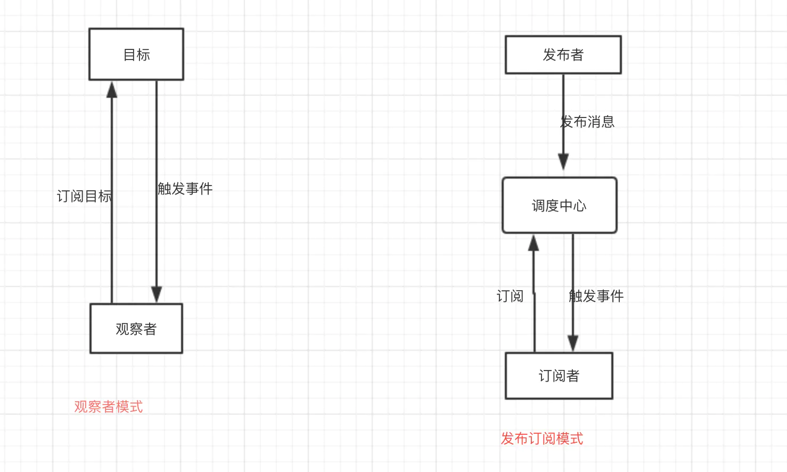

## 操作系统

### 软件设计

#### 单例模式

**意图：**保证一个类仅有一个实例，并提供一个访问它的全局访问点。

**主要解决：**一个全局使用的类频繁地创建与销毁。

**何时使用：**当您想控制实例数目，节省系统资源的时候。

**如何解决：**判断系统是否已经有这个单例，如果有则返回，如果没有则创建。

**关键代码：**构造函数是私有的。

**应用实例：**

- 1、一个班级只有一个班主任。
- 2、Windows 是多进程多线程的，在操作一个文件的时候，就不可避免地出现多个进程或线程同时操作一个文件的现象，所以所有文件的处理必须通过唯一的实例来进行。
- 3、一些设备管理器常常设计为单例模式，比如一个电脑有两台打印机，在输出的时候就要处理不能两台打印机打印同一个文件。

**优点：**

- 1、在内存里只有一个实例，减少了内存的开销，尤其是频繁的创建和销毁实例（比如管理学院首页页面缓存）。
- 2、避免对资源的多重占用（比如写文件操作）。

**缺点：**没有接口，不能继承，与单一职责原则冲突，一个类应该只关心内部逻辑，而不关心外面怎么样来实例化。

**使用场景：**

- 1、要求生产唯一序列号。
- 2、WEB 中的计数器，不用每次刷新都在数据库里加一次，用单例先缓存起来。
- 3、创建的一个对象需要消耗的资源过多，比如 I/O 与数据库的连接等。

**注意事项：**getInstance() 方法中需要使用同步锁 synchronized (Singleton.class) 防止多线程同时进入造成 instance 被多次实例化。


#### 观察者模式

**意图**：定义对象间的一种一对多的依赖关系，当一个对象的状态发生改变时，所有依赖于它的对象都得到通知并被自动更新。

**主要解决：**一个对象状态改变给其他对象通知的问题，而且要考虑到易用和低耦合，保证高度的协作。

**何时使用：**一个对象（目标对象）的状态发生改变，所有的依赖对象（观察者对象）都将得到通知，进行广播通知。

**如何解决：**使用面向对象技术，可以将这种依赖关系弱化。

**关键代码：**在抽象类里有一个 ArrayList 存放观察者们。

**应用实例：** 1、拍卖的时候，拍卖师观察最高标价，然后通知给其他竞价者竞价。 2、西游记里面悟空请求菩萨降服红孩儿，菩萨洒了一地水招来一个老乌龟，这个乌龟就是观察者，他观察菩萨洒水这个动作。

**优点：** 1、观察者和被观察者是抽象耦合的。 2、建立一套触发机制。

**缺点：** 1、如果一个被观察者对象有很多的直接和间接的观察者的话，将所有的观察者都通知到会花费很多时间。 2、如果在观察者和观察目标之间有循环依赖的话，观察目标会触发它们之间进行循环调用，可能导致系统崩溃。 3、观察者模式没有相应的机制让观察者知道所观察的目标对象是怎么发生变化的，而仅仅只是知道观察目标发生了变化。

**使用场景：**

- 一个抽象模型有两个方面，其中一个方面依赖于另一个方面。将这些方面封装在独立的对象中使它们可以各自独立地改变和复用。
- 一个对象的改变将导致其他一个或多个对象也发生改变，而不知道具体有多少对象将发生改变，可以降低对象之间的耦合度。
- 一个对象必须通知其他对象，而并不知道这些对象是谁。
- 需要在系统中创建一个触发链，A对象的行为将影响B对象，B对象的行为将影响C对象……，可以使用观察者模式创建一种链式触发机制。

**注意事项：** 1、JAVA 中已经有了对观察者模式的支持类。 2、避免循环引用。 3、如果顺序执行，某一观察者错误会导致系统卡壳，一般采用异步方式。


#### 中介者模式

**意图：**用一个中介对象来封装一系列的对象交互，中介者使各对象不需要显式地相互引用，从而使其耦合松散，而且可以独立地改变它们之间的交互。

**主要解决：**对象与对象之间存在大量的关联关系，这样势必会导致系统的结构变得很复杂，同时若一个对象发生改变，我们也需要跟踪与之相关联的对象，同时做出相应的处理。

**何时使用：**多个类相互耦合，形成了网状结构。

**如何解决：**将上述网状结构分离为星型结构。

**关键代码：**对象 Colleague 之间的通信封装到一个类中单独处理。

**应用实例：** 1、中国加入 WTO 之前是各个国家相互贸易，结构复杂，现在是各个国家通过 WTO 来互相贸易。 2、机场调度系统。 3、MVC 框架，其中C（控制器）就是 M（模型）和 V（视图）的中介者。

**优点：** 1、降低了类的复杂度，将一对多转化成了一对一。 2、各个类之间的解耦。 3、符合迪米特原则。

**缺点：**中介者会庞大，变得复杂难以维护。

**使用场景：** 1、系统中对象之间存在比较复杂的引用关系，导致它们之间的依赖关系结构混乱而且难以复用该对象。 2、想通过一个中间类来封装多个类中的行为，而又不想生成太多的子类。

**注意事项：**不应当在职责混乱的时候使用。


#### 工厂模式

**意图：**定义一个创建对象的接口，让其子类自己决定实例化哪一个工厂类，工厂模式使其创建过程延迟到子类进行。

**主要解决：**主要解决接口选择的问题。

**何时使用：**我们明确地计划不同条件下创建不同实例时。

**如何解决：**让其子类实现工厂接口，返回的也是一个抽象的产品。

**关键代码：**创建过程在其子类执行。

**应用实例：** 1、您需要一辆汽车，可以直接从工厂里面提货，而不用去管这辆汽车是怎么做出来的，以及这个汽车里面的具体实现。 2、Hibernate 换数据库只需换方言和驱动就可以。

**优点：** 1、一个调用者想创建一个对象，只要知道其名称就可以了。 2、扩展性高，如果想增加一个产品，只要扩展一个工厂类就可以。 3、屏蔽产品的具体实现，调用者只关心产品的接口。

**缺点：**每次增加一个产品时，都需要增加一个具体类和对象实现工厂，使得系统中类的个数成倍增加，在一定程度上增加了系统的复杂度，同时也增加了系统具体类的依赖。这并不是什么好事。

**使用场景：** 1、日志记录器：记录可能记录到本地硬盘、系统事件、远程服务器等，用户可以选择记录日志到什么地方。 2、数据库访问，当用户不知道最后系统采用哪一类数据库，以及数据库可能有变化时。 3、设计一个连接服务器的框架，需要三个协议，"POP3"、"IMAP"、"HTTP"，可以把这三个作为产品类，共同实现一个接口。

**注意事项：**作为一种创建类模式，在任何需要生成复杂对象的地方，都可以使用工厂方法模式。有一点需要注意的地方就是复杂对象适合使用工厂模式，而简单对象，特别是只需要通过 new 就可以完成创建的对象，无需使用工厂模式。如果使用工厂模式，就需要引入一个工厂类，会增加系统的复杂度。


#### 观察者模式和发布订阅模式的区别

观察者模式和发布订阅模式最大的区别就是发布订阅模式有个事件调度中心。



从图中可以看出，观察者模式中观察者和目标直接进行交互，而发布订阅模式中统一由调度中心进行处理，订阅者和发布者互不干扰。这样一方面实现了解耦，还有就是可以实现更细粒度的一些控制。比如发布者发布了很多消息，但是不想所有的订阅者都接收到，就可以在调度中心做一些处理，类似于权限控制之类的。还可以做一些节流操作。

观察者模式代码：

```js
// 观察者
class Observer {
    constructor() {

    }
    update(val) {

    }
}
// 观察者列表
class ObserverList {
    constructor() {
        this.observerList = []
    }
    add(observer) {
        return this.observerList.push(observer);
    }
    remove(observer) {
        this.observerList = this.observerList.filter(ob => ob !== observer);
    }
    count() {
        return this.observerList.length;
    }
    get(index) {
        return this.observerList[index];
    }
}
// 目标
class Subject {
    constructor() {
        this.observers = new ObserverList();
    }
    addObserver(observer) {
        this.observers.add(observer);
    }
    removeObserver(observer) {
        this.observers.remove(observer);
    }
    notify(...args) {
        let obCount = this.observers.count();
        for (let index = 0; index < obCount; index++) {
            this.observers.get(i).update(...args);
        }
    }
}
```

发布订阅模式：

```
class PubSub {
    constructor() {
        this.subscribers = {}
    }
    subscribe(type, fn) {
        if (!Object.prototype.hasOwnProperty.call(this.subscribers, type)) {
          this.subscribers[type] = [];
        }
        
        this.subscribers[type].push(fn);
    }
    unsubscribe(type, fn) {
        let listeners = this.subscribers[type];
        if (!listeners || !listeners.length) return;
        this.subscribers[type] = listeners.filter(v => v !== fn);
    }
    publish(type, ...args) {
        let listeners = this.subscribers[type];
        if (!listeners || !listeners.length) return;
        listeners.forEach(fn => fn(...args));        
    }
}

let ob = new PubSub();
ob.subscribe('add', (val) => console.log(val));
ob.publish('add', 1);
```

从代码可以看出，观察者模式由具体目标调度，每个被订阅的目标里面都需要有对观察者的处理，会造成代码的冗余。而发布订阅模式则统一由调度中心处理，消除了发布者和订阅者之间的依赖。


### 操作系统

#### 进程与线程

进程，是并发执行的程序在执行过程中分配和管理资源的基本单位，是一个动态概念，竞争计算机系统资源的基本单位。

线程，是进程的一部分，一个没有线程的进程可以被看作是单线程的。线程有时又被称为轻权进程或轻量级进程，也是 CPU 调度的一个基本单位。

先有进程先有线程，线程为了提高程序的速度。

进程是具有独立功能的一个程序运行的实例，也是系统分配和调度资源的单位，线程是CPU的基本调度单位。

1) 简而言之,一个程序至少有一个进程,一个进程至少有一个线程.

2) 线程的划分尺度小于进程，使得多线程程序的并发性高。

3) 另外，进程在执行过程中拥有独立的内存单元，而多个线程共享内存，从而极大地提高了程序的运行效率。

4) 线程在执行过程中与进程还是有区别的。每个独立的线程有一个程序运行的入口、顺序执行序列和程序的出口。但是线程不能够独立执行，必须依存在应用程序中，由应用程序提供多个线程执行控制。

5) 从逻辑角度来看，多线程的意义在于一个应用程序中，有多个执行部分可以同时执行。但操作系统并没有将多个线程看做多个独立的应用，来实现进程的调度和管理以及资源分配。这就是进程和线程的重要区别。

##### 系统线程数量上限是多少

Linux 系统中单个进程的最大线程数有其最大的限制 PTHREAD_THREADS_MAX。

这个限制可以在/usr/include/bits/local_lim.h中查看 ，对 linuxthreads 这个值一般是 1024，对于 nptl 则没有硬性的限制，仅仅受限于系统的资源。

这个系统的资源主要就是线程的 stack 所占用的内存，用 ulimit -s 可以查看默认的线程栈大小，一般情况下，这个值是8M=8192KB。

##### 哪些线程资源共享，哪些不共享

共享的资源有

a. 堆  由于堆是在进程空间中开辟出来的，所以它是理所当然地被共享的；因此new出来的都是共享的（16位平台上分全局堆和局部堆，局部堆是独享的）

b. 全局变量 它是与具体某一函数无关的，所以也与特定线程无关；因此也是共享的

c. 静态变量虽然对于局部变量来说，它在代码中是“放”在某一函数中的，但是其存放位置和全局变量一样，存于堆中开辟的.bss和.data段，是共享的

d. 文件等公用资源  这个是共享的，使用这些公共资源的线程必须同步。Win32 提供了几种同步资源的方式，包括信号、临界区、事件和互斥体。

独享的资源有

a. 栈 栈是独享的

b. 寄存器  这个可能会误解，因为电脑的寄存器是物理的，每个线程去取值难道不一样吗？其实线程里存放的是副本，包括程序计数器PC

##### 进程间的通信方式有哪些

总共有八种，面试中只要能大概答上三四种方式的原理就可以了

1、无名管道：半双工的通信方式，数据只能单向流动且只能在具有亲缘关系的进程间使用

2、高级管道：将另一个程序当作一个新的进程在当前程序进程中启动，则这个进程算是当前程序的子进程，

3、有名管道，：也是半双工的通信方式，但是允许没有亲缘进程之间的通信

4、消息队列：消息队列是有消息的链表，存放在内核中，并由消息队列标识符标识，消息队列克服了信号传递信息少，管道只能承载无格式字节流以及缓冲区大小受限的缺点

5、信号量：信号量是一个计数器，可以用来控制多个进程对共享资源的访问，它常作为一种锁机制，防止某进程正在访问共享资源时，其他进程也访问该资源，

6、信号：用于通知接受进程某个事件已经发生

7、共享内存：共享内存就是映射一段能被其他进程所访问的内存。这段共享内存由一个进程创建，但是多个进程可以访问，共享内存是最快的IPC 方式，往往与其他通信机制配合使用

8、套接字：可用于不同机器之间的进程通信


#### 内部碎片与外部碎片

内部碎片是处于区域内部或页面内部的存储块。占有这些区域或页面的进程并不使用这个存储块。而在进程占有这块存储块时，系统无法利用它。直到进程释放它，或进程结束时，系统才有可能利用这个存储块。

外部碎片指的是还没有被分配出去（不属于任何进程），但由于太小了无法分配给申请内存空间的新进程的内存空闲区域。

外部碎片是出于任何已分配区域或页面外部的空闲存储块。这些存储块的总和可以满足当前申请的长度要求，但是由于它们的地址不连续或其他原因，使得系统无法满足当前申请。

单道连续分配只有内部碎片。多道固定连续分配既有内部碎片，又有外部碎片。


#### 页式存储

主存被等分成大小相等的片，称为主存块，又称为实页。

当一个用户程序装入内存时，以页面为单位进行分配。页面的大小是为2n ,通常为1KB、2KB、2n KB等。


### 服务器

#### 关机和重启

关机
    shutdown -h now        立刻关机
    shutdown -h 5        5分钟后关机
    poweroff            立刻关机
重启
    shutdown -r now        立刻重启
    shutdown -r 5        5分钟后重启
    reboot                立刻重启


#### 目录切换 cd

cd /     切换到根目录
cd /usr     切换到根目录下的usr目录
cd ../     切换到上一级目录 或者  cd ..
cd ~     切换到home目录
cd -     切换到上次访问的目录


#### 目录查看 ls [-al]

ls                查看当前目录下的所有目录和文件
ls -a            查看当前目录下的所有目录和文件（包括隐藏的文件）
ls -l 或 ll       列表查看当前目录下的所有目录和文件（列表查看，显示更多信息）
ls /dir            查看指定目录下的所有目录和文件   如：ls /usr

#### 目录操作【增，删，改，查】

mkdir   aaa       在当前目录下创建一个名为aaa的目录
mkdir   /usr/aaa   在指定目录下创建一个名为aaa的目录


删除文件：
rm 文件     删除当前目录下的文件
rm -f 文件   删除当前目录的的文件（不询问）


删除目录：
rm -r aaa   递归删除当前目录下的aaa目录
rm -rf aaa   递归删除当前目录下的aaa目录（不询问）


rm -rf *   将当前目录下的所有目录和文件全部删除
rm -rf /*   【自杀命令！慎用！慎用！慎用！】将根目录下的所有文件全部删除

注意：rm不仅可以删除目录，也可以删除其他文件或压缩包，为了方便大家的记忆，无论删除任何目录或文件，都直接使用 rm -rf 目录/文件/压缩包


#### 目录修改【改】mv 和 cp

一、重命名目录
    命令：mv 当前目录  新目录
    例如：mv aaa bbb    将目录aaa改为bbb
    注意：mv的语法不仅可以对目录进行重命名而且也可以对各种文件，压缩包等进行    重命名的操作

二、剪切目录
    命令：mv 目录名称 目录的新位置
    示例：将/usr/tmp目录下的aaa目录剪切到 /usr目录下面     mv /usr/tmp/aaa /usr
    注意：mv语法不仅可以对目录进行剪切操作，对文件和压缩包等都可执行剪切操作

三、拷贝目录
    命令：cp -r 目录名称 目录拷贝的目标位置   -r代表递归
    示例：将/usr/tmp目录下的aaa目录复制到 /usr目录下面     cp /usr/tmp/aaa  /usr
    注意：cp命令不仅可以拷贝目录还可以拷贝文件，压缩包等，拷贝文件和压缩包时不    用写-r递归


#### 文件操作【增，删，改，查】

##### 新建文件【增】touch

命令：touch 文件名
示例：在当前目录创建一个名为aa.txt的文件        touch  aa.txt

##### 删除文件 【删】 rm

命令：rm -rf 文件名

##### 修改文件【改】 vi或vim

【vi编辑器的3种模式】
    基本上vi可以分为三种状态，分别是命令模式（command mode）、插入模式（Insert mode）和底行模式（last line mode），各模式的功能区分如下：

1) 命令行模式command mode）
      控制屏幕光标的移动，字符、字或行的删除，查找，移动复制某区段及进入Insert mode下，或者到 last line mode。
      命令行模式下的常用命令：
      【1】控制光标移动：↑，↓，j
      【2】删除当前行：dd 
      【3】查找：/字符
      【4】进入编辑模式：i o a
      
      ​	i:在光标所在字符前开始插入
      ​	a:在光标所在字符后开始插入
      ​	o:在光标所在行的下面另起一新行插入
      
      【5】进入底行模式：:

2) 编辑模式（Insert mode）
      只有在Insert mode下，才可以做文字输入，按「ESC」键可回到命令行模式。
      编辑模式下常用命令：
      【1】ESC 退出编辑模式到命令行模式；
      
3) 底行模式（last line mode）
     将文件保存或退出vi，也可以设置编辑环境，如寻找字符串、列出行号……等。
     底行模式下常用命令：
     【1】退出编辑：   :q
     【2】强制退出：   :q!
     【3】保存并退出：  :wq
     
4. 跳行

     【1】回到第一行：   gg
     【2】跳到最后一行：   shift+g
     【3】跳到23行：  :23

##### 文件的查看

cat：看最后一屏

示例：使用cat查看/etc/sudo.conf文件，只能显示最后一屏内容
cat sudo.conf

more：百分比显示

示例：使用more查看/etc/sudo.conf文件，可以显示百分比，回车可以向下一行，空格可以向下一页，q可以退出查看
more sudo.conf

less：翻页查看

示例：使用less查看/etc/sudo.conf文件，可以使用键盘上的PgUp和PgDn向上    和向下翻页，q结束查看
less sudo.conf

tail：指定行数或者动态查看

示例：使用tail -10 查看/etc/sudo.conf文件的后10行，Ctrl+C结束  
tail -10 sudo.conf

#### 压缩文件操作

##### 打包和压缩

Windows的压缩文件的扩展名  .zip/.rar
linux中的打包文件：aa.tar     
linux中的压缩文件：bb.gz    
linux中打包并压缩的文件：.tar.gz

Linux中的打包文件一般是以.tar结尾的，压缩的命令一般是以.gz结尾的。
而一般情况下打包和压缩是一起进行的，打包并压缩后的文件的后缀名一般.tar.gz。

命令：tar -zcvf 打包压缩后的文件名 要打包的文件
其中：z：调用gzip压缩命令进行压缩
 c：打包文件
 v：显示运行过程
 f：指定文件名

示例：打包并压缩/usr/tmp 下的所有文件 压缩后的压缩包指定名称为xxx.tar
tar -zcvf ab.tar aa.txt bb.txt 
或：tar -zcvf ab.tar  *

##### 解压

命令：tar [-zxvf] 压缩文件   
其中：x：代表解压
示例：将/usr/tmp 下的ab.tar解压到当前目录下

tar -zxvf ab.tar

示例：将/usr/tmp 下的ab.tar解压到根目录/usr下
tar -xvf ab.tar -C /usr------C代表指定解压的位置


#### 查找命令

##### grep

grep命令是一种强大的文本搜索工具

使用实例：

```
ps -ef | grep sshd  查找指定ssh服务进程 
ps -ef | grep sshd | grep -v grep 查找指定服务进程，排除gerp身 
ps -ef | grep sshd -c 查找指定进程个数 
```

##### find

find命令在目录结构中搜索文件，并对搜索结果执行指定的操作。 

find 默认搜索当前目录及其子目录，并且不过滤任何结果（也就是返回所有文件），将它们全都显示在屏幕上。

使用实例：

```
find . -name "*.log" -ls  在当前目录查找以.log结尾的文件，并显示详细信息。 
find /root/ -perm 600   查找/root/目录下权限为600的文件 
find . -type f -name "*.log"  查找当目录，以.log结尾的普通文件 
find . -type d | sort   查找当前所有目录并排序 
find . -size +100M  查找当前目录大于100M的文件
```

##### locate

locate 让使用者可以很快速的搜寻某个路径。默认每天自动更新一次，所以使用locate 命令查不到最新变动过的文件。为了避免这种情况，可以在使用locate之前，先使用updatedb命令，手动更新数据库。如果数据库中没有查询的数据，则会报出locate: can not stat () `/var/lib/mlocate/mlocate.db': No such file or directory该错误！updatedb即可！

yum -y install mlocate 如果是精简版CentOS系统需要安装locate命令

使用实例：

```
updatedb
locate /etc/sh 搜索etc目录下所有以sh开头的文件 
locate pwd 查找和pwd相关的所有文件
```

##### whereis

whereis命令是定位可执行文件、源代码文件、帮助文件在文件系统中的位置。这些文件的属性应属于原始代码，二进制文件，或是帮助文件。

使用实例：

```
whereis ls    将和ls文件相关的文件都查找出来
```

##### which

which命令的作用是在PATH变量指定的路径中，搜索某个系统命令的位置，并且返回第一个搜索结果。

使用实例：

```
which pwd  查找pwd命令所在路径 
which java  查找path中java的路径 
```


#### su

su用于用户之间的切换。但是切换前的用户依然保持登录状态。如果是root 向普通或虚拟用户切换不需要密码，反之普通用户切换到其它任何用户都需要密码验证。

```
su test:切换到test用户，但是路径还是/root目录
su - test : 切换到test用户，路径变成了/home/test
su : 切换到root用户，但是路径还是原来的路径
su - : 切换到root用户，并且路径是/root
```

su不足：如果某个用户需要使用root权限、则必须要把root密码告诉此用户。

退出返回之前的用户：exit


#### sudo

sudo是为所有想使用root权限的普通用户设计的。可以让普通用户具有临时使用root权限的权利。只需输入自己账户的密码即可。

进入sudo配置文件命令：

vi /etc/sudoer或者visudo
案例：
允许hadoop用户以root身份执行各种应用命令，需要输入hadoop用户的密码。
hadoop  ALL=(ALL)   ALL 

案例：
只允许hadoop用户以root身份执行ls 、cat命令，并且执行时候免输入密码。 
配置文件中： 
hadoop  ALL=NOPASSWD:  /bin/ls, /bin/cat 


#### 系统服务

```
service iptables status  --查看iptables服务的状态
service iptables start  --开启iptables服务
service iptables stop  --停止iptables服务
service iptables restart  --重启iptables服务
 
chkconfig iptables off  --关闭iptables服务的开机自启动
chkconfig iptables on  --开启iptables服务的开机自启动
```


#### 修改文件权限

chmod 777


#### 其他命令

##### 查看当前目录路径

pwd   

------


##### 查看所有正在运行的进程

ps -ef   


```
ps -a  		列出所有运行中/激活进程
```

```
ps -ef |grep  		列出需要进程
```

```
ps -aux 		 显示进程信息，包括无终端的（x）和针对用户（u）的进程：如USER, PID, %CPU, %MEM等
```

------


##### 杀死进程

kill pid 或者 kill -9 pid(强制杀死进程)      pid:进程号

------


##### 查看网卡信息

ifconfig 或 ifconfig | more

------


##### 查看与某台机器的连接情况

ping ip

------


##### 搜索指定端口

netstat -an | grep 8080 或者 netstat -lnp|grep 8080

ps -ef |grep 进程名

------


##### 关闭防火墙

chkconfig iptables off


##### 清屏

ctrl + l


##### 运行jar包

nohup java -jar sunon-2.0.0.jar >log.out 2>&1 &

