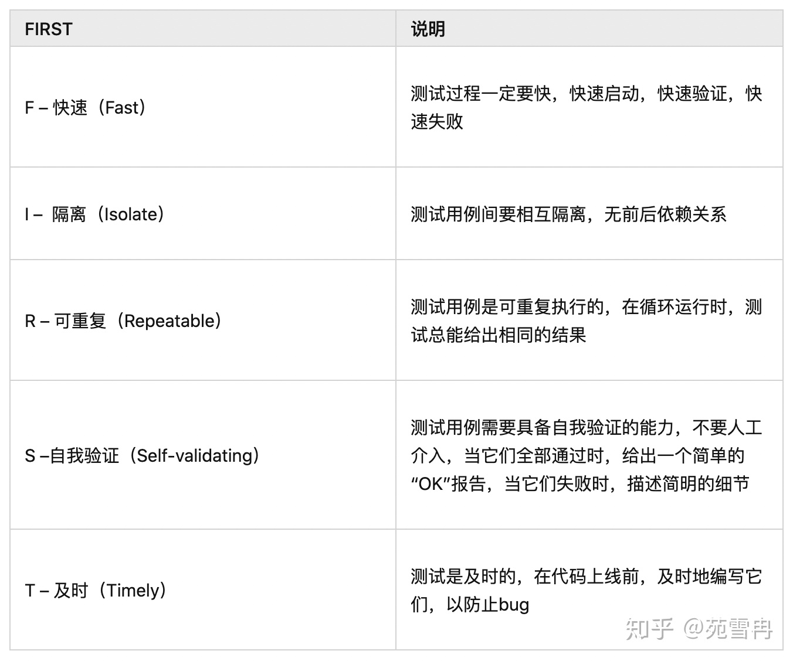
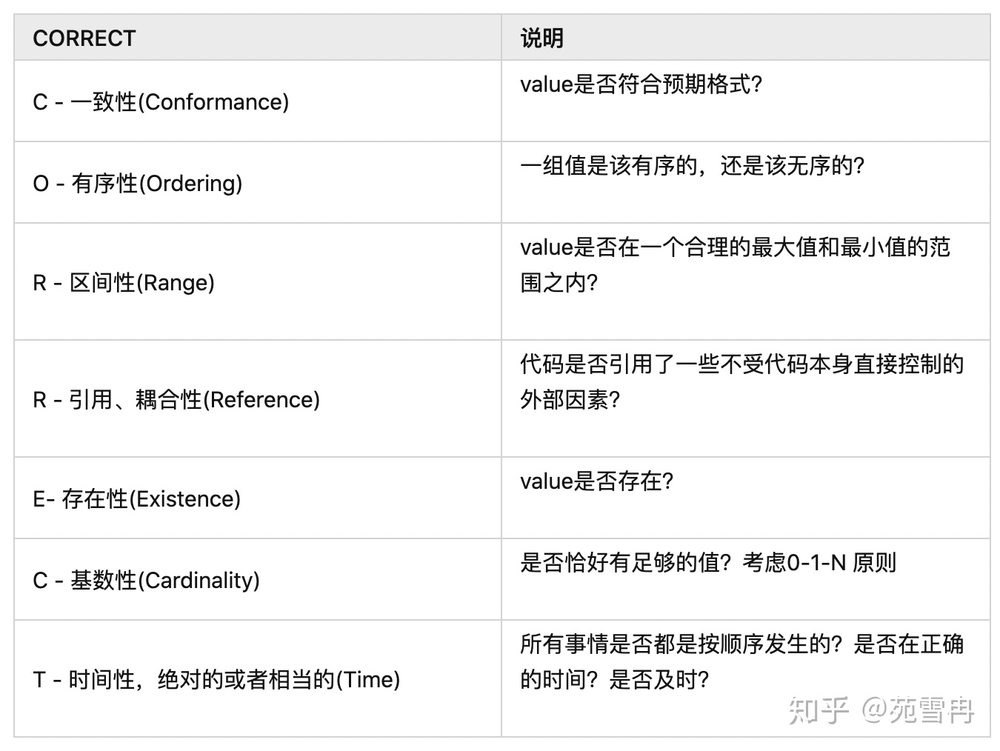

## 系统

### 软件设计

#### 单例模式

**意图：**保证一个类仅有一个实例，并提供一个访问它的全局访问点。

**主要解决：**一个全局使用的类频繁地创建与销毁。

**何时使用：**当您想控制实例数目，节省系统资源的时候。

**如何解决：**判断系统是否已经有这个单例，如果有则返回，如果没有则创建。

**关键代码：**构造函数是私有的。

**应用实例：**

- 1、一个班级只有一个班主任。
- 2、Windows 是多进程多线程的，在操作一个文件的时候，就不可避免地出现多个进程或线程同时操作一个文件的现象，所以所有文件的处理必须通过唯一的实例来进行。
- 3、一些设备管理器常常设计为单例模式，比如一个电脑有两台打印机，在输出的时候就要处理不能两台打印机打印同一个文件。

**优点：**

- 1、在内存里只有一个实例，减少了内存的开销，尤其是频繁的创建和销毁实例（比如管理学院首页页面缓存）。
- 2、避免对资源的多重占用（比如写文件操作）。

**缺点：**没有接口，不能继承，与单一职责原则冲突，一个类应该只关心内部逻辑，而不关心外面怎么样来实例化。

**使用场景：**

- 1、要求生产唯一序列号。
- 2、WEB 中的计数器，不用每次刷新都在数据库里加一次，用单例先缓存起来。
- 3、创建的一个对象需要消耗的资源过多，比如 I/O 与数据库的连接等。

**注意事项：**getInstance() 方法中需要使用同步锁 synchronized (Singleton.class) 防止多线程同时进入造成 instance 被多次实例化。


#### 观察者模式

**意图**：定义对象间的一种一对多的依赖关系，当一个对象的状态发生改变时，所有依赖于它的对象都得到通知并被自动更新。

**主要解决：**一个对象状态改变给其他对象通知的问题，而且要考虑到易用和低耦合，保证高度的协作。

**何时使用：**一个对象（目标对象）的状态发生改变，所有的依赖对象（观察者对象）都将得到通知，进行广播通知。

**如何解决：**使用面向对象技术，可以将这种依赖关系弱化。

**关键代码：**在抽象类里有一个 ArrayList 存放观察者们。

**应用实例：** 1、拍卖的时候，拍卖师观察最高标价，然后通知给其他竞价者竞价。 2、西游记里面悟空请求菩萨降服红孩儿，菩萨洒了一地水招来一个老乌龟，这个乌龟就是观察者，他观察菩萨洒水这个动作。

**优点：** 1、观察者和被观察者是抽象耦合的。 2、建立一套触发机制。

**缺点：** 1、如果一个被观察者对象有很多的直接和间接的观察者的话，将所有的观察者都通知到会花费很多时间。 2、如果在观察者和观察目标之间有循环依赖的话，观察目标会触发它们之间进行循环调用，可能导致系统崩溃。 3、观察者模式没有相应的机制让观察者知道所观察的目标对象是怎么发生变化的，而仅仅只是知道观察目标发生了变化。

**使用场景：**

- 一个抽象模型有两个方面，其中一个方面依赖于另一个方面。将这些方面封装在独立的对象中使它们可以各自独立地改变和复用。
- 一个对象的改变将导致其他一个或多个对象也发生改变，而不知道具体有多少对象将发生改变，可以降低对象之间的耦合度。
- 一个对象必须通知其他对象，而并不知道这些对象是谁。
- 需要在系统中创建一个触发链，A对象的行为将影响B对象，B对象的行为将影响C对象……，可以使用观察者模式创建一种链式触发机制。

**注意事项：** 1、JAVA 中已经有了对观察者模式的支持类。 2、避免循环引用。 3、如果顺序执行，某一观察者错误会导致系统卡壳，一般采用异步方式。


#### 中介者模式

**意图：**用一个中介对象来封装一系列的对象交互，中介者使各对象不需要显式地相互引用，从而使其耦合松散，而且可以独立地改变它们之间的交互。

**主要解决：**对象与对象之间存在大量的关联关系，这样势必会导致系统的结构变得很复杂，同时若一个对象发生改变，我们也需要跟踪与之相关联的对象，同时做出相应的处理。

**何时使用：**多个类相互耦合，形成了网状结构。

**如何解决：**将上述网状结构分离为星型结构。

**关键代码：**对象 Colleague 之间的通信封装到一个类中单独处理。

**应用实例：** 1、中国加入 WTO 之前是各个国家相互贸易，结构复杂，现在是各个国家通过 WTO 来互相贸易。 2、机场调度系统。 3、MVC 框架，其中C（控制器）就是 M（模型）和 V（视图）的中介者。

**优点：** 1、降低了类的复杂度，将一对多转化成了一对一。 2、各个类之间的解耦。 3、符合迪米特原则。

**缺点：**中介者会庞大，变得复杂难以维护。

**使用场景：** 1、系统中对象之间存在比较复杂的引用关系，导致它们之间的依赖关系结构混乱而且难以复用该对象。 2、想通过一个中间类来封装多个类中的行为，而又不想生成太多的子类。

**注意事项：**不应当在职责混乱的时候使用。


#### 工厂模式

**意图：**定义一个创建对象的接口，让其子类自己决定实例化哪一个工厂类，工厂模式使其创建过程延迟到子类进行。

**主要解决：**主要解决接口选择的问题。

**何时使用：**我们明确地计划不同条件下创建不同实例时。

**如何解决：**让其子类实现工厂接口，返回的也是一个抽象的产品。

**关键代码：**创建过程在其子类执行。

**应用实例：** 1、您需要一辆汽车，可以直接从工厂里面提货，而不用去管这辆汽车是怎么做出来的，以及这个汽车里面的具体实现。 2、Hibernate 换数据库只需换方言和驱动就可以。

**优点：** 1、一个调用者想创建一个对象，只要知道其名称就可以了。 2、扩展性高，如果想增加一个产品，只要扩展一个工厂类就可以。 3、屏蔽产品的具体实现，调用者只关心产品的接口。

**缺点：**每次增加一个产品时，都需要增加一个具体类和对象实现工厂，使得系统中类的个数成倍增加，在一定程度上增加了系统的复杂度，同时也增加了系统具体类的依赖。这并不是什么好事。

**使用场景：** 1、日志记录器：记录可能记录到本地硬盘、系统事件、远程服务器等，用户可以选择记录日志到什么地方。 2、数据库访问，当用户不知道最后系统采用哪一类数据库，以及数据库可能有变化时。 3、设计一个连接服务器的框架，需要三个协议，"POP3"、"IMAP"、"HTTP"，可以把这三个作为产品类，共同实现一个接口。

**注意事项：**作为一种创建类模式，在任何需要生成复杂对象的地方，都可以使用工厂方法模式。有一点需要注意的地方就是复杂对象适合使用工厂模式，而简单对象，特别是只需要通过 new 就可以完成创建的对象，无需使用工厂模式。如果使用工厂模式，就需要引入一个工厂类，会增加系统的复杂度。


#### 观察者模式和发布订阅模式的区别

观察者模式和发布订阅模式最大的区别就是发布订阅模式有个事件调度中心。


从图中可以看出，观察者模式中观察者和目标直接进行交互，而发布订阅模式中统一由调度中心进行处理，订阅者和发布者互不干扰。这样一方面实现了解耦，还有就是可以实现更细粒度的一些控制。比如发布者发布了很多消息，但是不想所有的订阅者都接收到，就可以在调度中心做一些处理，类似于权限控制之类的。还可以做一些节流操作。

观察者模式代码：

```js
// 观察者
class Observer {
    constructor() {

    }
    update(val) {

    }
}
// 观察者列表
class ObserverList {
    constructor() {
        this.observerList = []
    }
    add(observer) {
        return this.observerList.push(observer);
    }
    remove(observer) {
        this.observerList = this.observerList.filter(ob => ob !== observer);
    }
    count() {
        return this.observerList.length;
    }
    get(index) {
        return this.observerList[index];
    }
}
// 目标
class Subject {
    constructor() {
        this.observers = new ObserverList();
    }
    addObserver(observer) {
        this.observers.add(observer);
    }
    removeObserver(observer) {
        this.observers.remove(observer);
    }
    notify(...args) {
        let obCount = this.observers.count();
        for (let index = 0; index < obCount; index++) {
            this.observers.get(i).update(...args);
        }
    }
}
```

发布订阅模式：

```
class PubSub {
    constructor() {
        this.subscribers = {}
    }
    subscribe(type, fn) {
        if (!Object.prototype.hasOwnProperty.call(this.subscribers, type)) {
          this.subscribers[type] = [];
        }

        this.subscribers[type].push(fn);
    }
    unsubscribe(type, fn) {
        let listeners = this.subscribers[type];
        if (!listeners || !listeners.length) return;
        this.subscribers[type] = listeners.filter(v => v !== fn);
    }
    publish(type, ...args) {
        let listeners = this.subscribers[type];
        if (!listeners || !listeners.length) return;
        listeners.forEach(fn => fn(...args));        
    }
}

let ob = new PubSub();
ob.subscribe('add', (val) => console.log(val));
ob.publish('add', 1);
```

从代码可以看出，观察者模式由具体目标调度，每个被订阅的目标里面都需要有对观察者的处理，会造成代码的冗余。而发布订阅模式则统一由调度中心处理，消除了发布者和订阅者之间的依赖。


#### BS与CS 的联系与区别

C/S是Client/Serve(客户机/服务器)r的缩写。服务器通常采用高性能的PC、工作站或小型机，并采用大型数据库系统，如Oracle、Sybase、Informix或 SQL Server。客户端需要安装专用的客户端软件。

B/Ｓ是Brower/Server（浏览器/服务器）的缩写，客户机上只要安装一个浏览器（Browser），如Netscape Navigator或Internet Explorer，服务器安装Oracle、Sybase、Informix或 SQL Server等数据库。在这种结构下，用户界面完全通过WWW浏览器实现，一部分事务逻辑在前端实现，但是主要事务逻辑在服务器端实现。浏览器通过WebServer 同数据库进行数据交互。是随着Internet技术的兴起，对C/S结构的一种变化或者改进的结构。

**C/S 与 B/S 区别：**

**1．硬件环境不同:**

C/S 一般建立在专用的网络上, 小范围里的网络环境, 局域网之间再通过专门服务器提供连接和数据交换服务。

B/S 建立在广域网之上的, 不必是专门的网络硬件环境,例与电话上网，租用设备。信息自己管理. 有比C/S更强的适应范围, 一般只要有操作系统和浏览器就行。

**２．对安全要求不同**

C/S 一般面向相对固定的用户群, 对信息安全的控制能力很强。 一般高度机密的信息系统采用C/S 结构适宜。可以通过B/S发布部分可公开信息。

B/S 建立在广域网之上, 对安全的控制能力相对弱, 可能面向不可知的用户。

**３．对程序架构不同**

C/S 程序可以更加注重流程，可以对权限多层次校验，对系统运行速度可以较少考虑。

B/S 对安全以及访问速度的多重的考虑，建立在需要更加优化的基础之上。 比C/S有更高的要求 B/S结构的程序架构是发展的趋势，从MS的.Net系列的BizTalk 2000 Exchange 2000等，全面支持网络的构件搭建的系统。SUN 和IBM推的JavaBean 构件技术等,使B/S更加成熟。

**４．软件重用不同**

C/S 程序可以不可避免的整体性考虑， 构件的重用性不如在B/S要求下的构件的重用性好。

B/S 对的多重结构，要求构件相对独立的功能。能够相对较好的重用。就入买来的餐桌可以再利用,而不是做在墙上的石头桌子。

**５．系统维护不同**

C/S 程序由于整体性，必须整体考察，处理出现的问题以及系统升级。 升级难。可能是再做一个全新的系统。

B/S 构件组成,方面构件个别的更换，实现系统的无缝升级。系统维护开销减到最小。用户从网上自己下载安装就可以实现升级。

**６．处理问题不同**

C/S 程序可以处理用户面固定，并且在相同区域, 安全要求高需求， 与操作系统相关。 应该都是相同的系统。

B/S 建立在广域网上，面向不同的用户群，分散地域, 这是C/S无法作到的。 与操作系统平台关系最小。

**７．用户接口不同**

C/S 多是建立的Window平台上,表现方法有限，对程序员普遍要求较高。

B/S 建立在浏览器上, 有更加丰富和生动的表现方式与用户交流。并且大部分难度减低,减低开发成本。

**８．信息流不同**

C/S 程序一般是典型的中央集权的机械式处理，交互性相对低。

B/S 信息流向可变化，B-B B-C B-G等信息、流向的变化，更像交易中心。


#### **前端怎么做单元测试**

**单测的定义**

来自维基百科的定义：

在计算机编程中，**单元测试**（Unit Testing）又称为**模块测试**，是针对程序模块（软件设计的最小单位）来进行正确性检验的测试工作。程序单元是应用的最小可测试部件。在过程化编程中，一个单元就是单个程序、函数、过程等；对于面向对象编程，最小单元就是方法，包括基类（超类）、抽象类、或者派生类（子类）中的方法。

定义里面指出，单元测试针对的是程序的最小单元，因此我们应该针对最小单元来写单测。

**单测完善程度的衡量**

[文章链接地址](https://zhuanlan.zhihu.com/p/340615580)

单测完善程度的衡量用**覆盖率**来衡量

关于测试覆盖率，我们大致了解下以下几个常见的计算维度：

- 行覆盖率：可执行语句执行的比例
- 函数覆盖率：函数被调用的比例
- 分支覆盖率：判断语句分支被执行的比例

来看下面这个例子：


对于测试用例 foo(4)，分支覆盖率只有50%，原因是 foo(4) 只测试了if 为 true 的情况，没有测试到 if 为 false 的情况。

如果想要分支覆盖率达到100%，还应该测试 foo(5)。

**现状与问题**

- **缺乏意识**：没有单测意识，很多代码没有单测
- **缺乏设计**：模块缺乏设计，相互耦合，写单测困难
- **测试困难**：升级公共 API，人工测试验证困难
- **测试不全面**：部分代码分支众多，人工测试没办法覆盖所有分支

**单测的价值与意义**

- **能力建设**：一个具备开发经验的开发人员，基本上都会编写单元测试。即便不会，可以通过培训来快速达成。从学习曲线上看，单元测试很容易上手。

- **提升效率**：能够通过 mock 数据，及早发现问题，而越早发现Bug，造成的浪费就会越小。

- **追求卓越**：单元测试可以充当一个设计工具，它有助于开发人员去思考代码结构的设计，让代码更加有利于测试。

- **测试更全面**：能够覆盖 QA 测试覆盖不到的情况，比如各种 if 分支、异常处理。

- **更有信心**：升级公共 API 时，如果依赖这个 API 的所有代码单测都能通过，那我们对这次代码升级是更有信心的。

**单测的原则：FIRST**



**单测需要测什么：RIGHT BICEP**


**结果正确**

这个是最基本的检查，如果单测的运行结果都不正确，那其他的都免谈。

**边界条件检查**

边界检查尤为重要，很多错误都是发生在边界上。边界检查遵循 `CORRECT`



- **有序性**：如果一组值是有序的，那么在向其中删除或者添加时，需要校验这组值是否仍然是有序的
- **引用/耦合性**：对于类的状态、其他对象的状态等需要做一些假设，程序员就需要对代码进行测试，保证在假设未满足的情况下运行良好。
- **存在性**：当数据不存在的时候，程序是否运行良好，例如null，空字符串等
- **基数性**：这里的基数主要强调的是计数，考虑以“0-1-N 原则”，当数值分别为0、1、N 时，可能出现的结果，其中N 为最大值。
- **时间性**：要充分考虑与时间相关的问题，涉及到并发、异步、超时等这些情况需要特别注意，所有事情的发生时间是否在预期范围内。

**反向关联检查**

- 例：对于加密算法，使用解密算法反向检查其输出，验证解密后明文是否正确。
- 例：对于写操作API，使用读操作API来反向检查验证

**交叉检查**

- 例： 对性能优化的算法，使用性能差但验证过的算法交叉检查


**强制错误条件发生**

- 例： Mock依赖系统不可用
 或者 Mock系统时间错误
- 例：甚至可以直接throw error，来验证程序对错误的处理

**满足性能要求**

当某个程序升级的时候，是否会对性能造成影响？这需要我们对程序的性能进行测试

**写单测的时机**

写单测的时机主要有以下三种，大家可以根据自己的实际情况来进行选择。

**具体实现代码之前**

即测试驱动开发（TDD）：编写某个功能的代码之前先编写测试代码，然后编写使测试通过的功能代码，重复这个过程，通过测试来推动整个开发的进行。

特点：UT 能够更好的实践我们的代码设计。对于某些复杂度较高的接口（甚至是一些私有方法），建议使用 TDD 进行开发。

**与具体实现代码同步进行**

先写少量功能代码，紧接着写单元测试（重复这两个过程，直到完成功能代码开发）。

特点：每个单测比较简单易懂，可读性可维护性都比较好（重构时单测的改动不大）。

**编写完功能代码后**

这种单元测试“粒度”会比较粗。对同样的功能代码，采取前两种方案的结果可能是用10个“小”的单测来覆盖，而这种方案写的单测，往往是用1个“大”的单测来覆盖。

特点：逻辑就比较复杂，因为它要测的东西很多，可读性可维护性可能会比较差。


#### 前端需要注意哪些SEO

**什么是SEO？**
        它是由英文Search Engine Optimization缩写而来，中文意思是“搜索引擎的优化”。

SEO具体是指通过网站结构调整、网站内容建设、网站代码优化、以及站外优化（网站站外推广、网站品牌建设等），使网站满足搜索引擎的收录排名需求，提高网站在搜索引擎中关键字的排名，从而吸引精准用户进入网站，获得免费流量，产生直接销售或品牌推广。

**需要注意的**

1、 合理的title，description，keyswords 搜索引擎对这三项的权重逐个减小，title 值强调重点即可，重要的关键词出现不要超过两次，而且要靠前。

2 、不同页面的tilte要有所不同；description把页面的内容高度概括，长度合适，不可过分堆叠关键词，不同页面description有所不同。keyswords列举出重要的关键词即可。

3、语义化的HTML代码，符合W3C 规范：语义化代码有利于搜索引擎理解网页。

4 、重要的内容HTML代码放在前面：搜索引擎抓取HTML 的顺序是从上到下，有的搜索引擎对抓取长度有限制，保证重要内容一定会被抓取。

5 、重要的内容不要用js输出，爬虫不会执行js获取内容。

6 、尽量少用iframe ，搜索引擎不会抓取iframe中的内容。

7 、非装饰的图片必须加alt 。

8 、提高网站速度：网站速度是搜索引擎排序的一个重要指标。


### 操作系统

#### 进程与线程

进程，是并发执行的程序在执行过程中分配和管理资源的基本单位，是一个动态概念，竞争计算机系统资源的基本单位。

线程，是进程的一部分，一个没有线程的进程可以被看作是单线程的。线程有时又被称为轻权进程或轻量级进程，也是 CPU 调度的一个基本单位。

- 进程描述了 CPU 在运行指令及加载和保存上下文所需的时间，放在应用上来说就代表了一个程序。
- 线程是进程中的更小单位，描述了执行一段指令所需的时间。

**进程是CPU资源分配的最小单位，线程是CPU调度的最小单位。**

**先有进程后有线程，线程为了提高程序的速度。**

进程是具有独立功能的一个程序运行的实例，也是系统分配和调度资源的单位，线程是CPU的基本调度单位。

1) 简而言之,**一个程序至少有一个进程,一个进程至少有一个线程**。

2) **线程的划分尺度小于进程**，使得多线程程序的并发性高。

3) 另外，进程在执行过程中拥有独立的内存单元，而**多个线程共享内存**，从而极大地提高了程序的运行效率。

4) 线程在执行过程中与进程还是有区别的。每个独立的线程有一个程序运行的入口、顺序执行序列和程序的出口。但是线程不能够独立执行，必须依存在应用程序中，由应用程序提供多个线程执行控制。

5) 从逻辑角度来看，多线程的意义在于一个应用程序中，有多个执行部分可以同时执行。但操作系统并没有将多个线程看做多个独立的应用，来实现进程的调度和管理以及资源分配。这就是进程和线程的重要区别。

------

进程和线程之间的关系有以下四个特点：

**（1）进程中的任意一线程执行出错，都会导致整个进程的崩溃。**

**（2）线程之间共享进程中的数据。**

**（3）当一个进程关闭之后，操作系统会回收进程所占用的内存，** 当一个进程退出时，操作系统会回收该进程所申请的所有资源；即使其中任意线程因为操作不当导致内存泄漏，当进程退出时，这些内存也会被正确回收。

**（4）进程之间的内容相互隔离。** 进程隔离就是为了使操作系统中的进程互不干扰，每一个进程只能访问自己占有的数据，也就避免出现进程 A 写入数据到进程 B 的情况。正是因为进程之间的数据是严格隔离的，所以一个进程如果崩溃了，或者挂起了，是不会影响到其他进程的。如果进程之间需要进行数据的通信，这时候，就需要使用用于进程间通信的机制了。


##### 系统线程数量上限

Linux 系统中单个进程的最大线程数有其最大的限制 PTHREAD_THREADS_MAX。

这个限制可以在/usr/include/bits/local_lim.h中查看 ，对 linuxthreads 这个值一般是 1024，对于 nptl 则没有硬性的限制，仅仅受限于系统的资源。

这个系统的资源主要就是线程的 stack 所占用的内存，用 ulimit -s 可以查看默认的线程栈大小，一般情况下，这个值是8M=8192KB。


##### 资源共享

共享的资源有

a. 堆  由于堆是在进程空间中开辟出来的，所以它是理所当然地被共享的；因此new出来的都是共享的（16位平台上分全局堆和局部堆，局部堆是独享的）

b. 全局变量 它是与具体某一函数无关的，所以也与特定线程无关；因此也是共享的

c. 静态变量虽然对于局部变量来说，它在代码中是“放”在某一函数中的，但是其存放位置和全局变量一样，存于堆中开辟的.bss和.data段，是共享的

d. 文件等公用资源  这个是共享的，使用这些公共资源的线程必须同步。Win32 提供了几种同步资源的方式，包括信号、临界区、事件和互斥体。

独享的资源有

a. 栈 栈是独享的

b. 寄存器  这个可能会误解，因为电脑的寄存器是物理的，每个线程去取值难道不一样吗？其实线程里存放的是副本，包括程序计数器PC


##### 进程间通信方式

总共有八种，面试中只要能大概答上三四种方式的原理就可以了

1、无名管道：半双工的通信方式，数据只能单向流动且只能在具有亲缘关系的进程间使用

2、高级管道：将另一个程序当作一个新的进程在当前程序进程中启动，则这个进程算是当前程序的子进程，

3、有名管道，：也是半双工的通信方式，但是允许没有亲缘进程之间的通信

4、消息队列：消息队列是有消息的链表，存放在内核中，并由消息队列标识符标识，消息队列克服了信号传递信息少，管道只能承载无格式字节流以及缓冲区大小受限的缺点

5、信号量：信号量是一个计数器，可以用来控制多个进程对共享资源的访问，它常作为一种锁机制，防止某进程正在访问共享资源时，其他进程也访问该资源，

6、信号：用于通知接受进程某个事件已经发生

7、共享内存：共享内存就是映射一段能被其他进程所访问的内存。这段共享内存由一个进程创建，但是多个进程可以访问，共享内存是最快的IPC 方式，往往与其他通信机制配合使用

8、套接字：可用于不同机器之间的进程通信

------

**（1）管道通信**

管道是一种最基本的进程间通信机制。**管道就是操作系统在内核中开辟的一段缓冲区，进程1可以将需要交互的数据拷贝到这段缓冲区，进程2就可以读取了。**

管道的特点：

- 只能单向通信
- 只能血缘关系的进程进行通信
- 依赖于文件系统
- 生命周期随进程
- 面向字节流的服务
- 管道内部提供了同步机制

**（2）消息队列通信**

消息队列就是一个消息的列表。用户可以在消息队列中添加消息、读取消息等。消息队列提供了一种从一个进程向另一个进程发送一个数据块的方法。 每个数据块都被认为含有一个类型，接收进程可以独立地接收含有不同类型的数据结构。可以通过发送消息来避免命名管道的同步和阻塞问题。但是消息队列与命名管道一样，每个数据块都有一个最大长度的限制。

使用消息队列进行进程间通信，可能会收到数据块最大长度的限制约束等，这也是这种通信方式的缺点。如果频繁的发生进程间的通信行为，那么进程需要频繁地读取队列中的数据到内存，相当于间接地从一个进程拷贝到另一个进程，这需要花费时间。

**（3）信号量通信**

共享内存最大的问题就是多进程竞争内存的问题，就像类似于线程安全问题。我们可以使用信号量来解决这个问题。信号量的本质就是一个计数器，用来实现进程之间的互斥与同步。例如信号量的初始值是 1，然后 a 进程来访问内存1的时候，我们就把信号量的值设为 0，然后进程b 也要来访问内存1的时候，看到信号量的值为 0 就知道已经有进程在访问内存1了，这个时候进程 b 就会访问不了内存1。所以说，信号量也是进程之间的一种通信方式。

**（4）信号通信**

信号（Signals ）是Unix系统中使用的最古老的进程间通信的方法之一。操作系统通过信号来通知进程系统中发生了某种预先规定好的事件（一组事件中的一个），它也是用户进程之间通信和同步的一种原始机制。

**（5）共享内存通信**

共享内存就是映射一段能被其他进程所访问的内存，这段共享内存由一个进程创建，但多个进程都可以访问（使多个进程可以访问同一块内存空间）。共享内存是最快的 IPC 方式，它是针对其他进程间通信方式运行效率低而专门设计的。它往往与其他通信机制，如信号量，配合使用，来实现进程间的同步和通信。

**（6）套接字通信**

上面说的共享内存、管道、信号量、消息队列，他们都是多个进程在一台主机之间的通信，那两个相隔几千里的进程能够进行通信吗？答是必须的，这个时候 Socket 这家伙就派上用场了，例如我们平时通过浏览器发起一个 http 请求，然后服务器给你返回对应的数据，这种就是采用 Socket 的通信方式了。


##### 僵尸进程和孤儿进程

- **孤儿进程**：父进程退出了，而它的一个或多个进程还在运行，那这些子进程都会成为孤儿进程。孤儿进程将被init进程(进程号为1)所收养，并由init进程对它们完成状态收集工作。
- **僵尸进程**：子进程比父进程先结束，而父进程又没有释放子进程占用的资源，那么子进程的进程描述符仍然保存在系统中，这种进程称之为僵死进程。


#### 死锁

所谓死锁，是指多个进程在运行过程中因争夺资源而造成的一种僵局，当进程处于这种僵持状态时，若无外力作用，它们都将无法再向前推进。

系统中的资源可以分为两类：

- 可剥夺资源，是指某进程在获得这类资源后，该资源可以再被其他进程或系统剥夺，CPU和主存均属于可剥夺性资源；
- 不可剥夺资源，当系统把这类资源分配给某进程后，再不能强行收回，只能在进程用完后自行释放，如磁带机、打印机等。

**产生死锁的原因：**

**（1）竞争资源**

- 产生死锁中的竞争资源之一指的是**竞争不可剥夺资源**（例如：系统中只有一台打印机，可供进程P1使用，假定P1已占用了打印机，若P2继续要求打印机打印将阻塞）
- 产生死锁中的竞争资源另外一种资源指的是**竞争临时资源**（临时资源包括硬件中断、信号、消息、缓冲区内的消息等），通常消息通信顺序进行不当，则会产生死锁

**（2）进程间推进顺序非法**

若P1保持了资源R1，P2保持了资源R2，系统处于不安全状态，因为这两个进程再向前推进，便可能发生死锁。例如，当P1运行到P1：Request（R2）时，将因R2已被P2占用而阻塞；当P2运行到P2：Request（R1）时，也将因R1已被P1占用而阻塞，于是发生进程死锁

**产生死锁的必要条件：**

- 互斥条件：进程要求对所分配的资源进行排它性控制，即在一段时间内某资源仅为一进程所占用。
- 请求和保持条件：当进程因请求资源而阻塞时，对已获得的资源保持不放。
- 不剥夺条件：进程已获得的资源在未使用完之前，不能剥夺，只能在使用完时由自己释放。
- 环路等待条件：在发生死锁时，必然存在一个进程——资源的环形链。

**预防死锁的方法：**

- 资源一次性分配：一次性分配所有资源，这样就不会再有请求了（破坏请求条件）
- 只要有一个资源得不到分配，也不给这个进程分配其他的资源（破坏请保持条件）
- 可剥夺资源：即当某进程获得了部分资源，但得不到其它资源，则释放已占有的资源（破坏不可剥夺条件）
- 资源有序分配法：系统给每类资源赋予一个编号，每一个进程按编号递增的顺序请求资源，释放则相反（破坏环路等待条件）


#### 内部碎片与外部碎片

内部碎片是处于区域内部或页面内部的存储块。占有这些区域或页面的进程并不使用这个存储块。而在进程占有这块存储块时，系统无法利用它。直到进程释放它，或进程结束时，系统才有可能利用这个存储块。

外部碎片指的是还没有被分配出去（不属于任何进程），但由于太小了无法分配给申请内存空间的新进程的内存空闲区域。

外部碎片是出于任何已分配区域或页面外部的空闲存储块。这些存储块的总和可以满足当前申请的长度要求，但是由于它们的地址不连续或其他原因，使得系统无法满足当前申请。

单道连续分配只有内部碎片。多道固定连续分配既有内部碎片，又有外部碎片。


#### 页式存储

主存被等分成大小相等的片，称为主存块，又称为实页。

当一个用户程序装入内存时，以页面为单位进行分配。页面的大小是为2n ,通常为1KB、2KB、2n KB等。


#### 浏览器组成

##### 浏览器的理解

浏览器的主要功能是将用户选择的 web 资源呈现出来，它需要从服务器请求资源，并将其显示在浏览器窗口中，资源的格式通常是 HTML，也包括 PDF、image 及其他格式。用户用 URI（Uniform Resource Identifier 统一资源标识符）来指定所请求资源的位置。

HTML 和 CSS 规范中规定了浏览器解释 html 文档的方式，由 W3C 组织对这些规范进行维护，W3C 是负责制定 web 标准的组织。但是浏览器厂商纷纷开发自己的扩展，对规范的遵循并不完善，这为 web 开发者带来了严重的兼容性问题。

浏览器可以分为两部分，**shell 和 内核**。其中 shell 的种类相对比较多，内核则比较少。也有一些浏览器并不区分外壳和内核。从 Mozilla 将 Gecko 独立出来后，才有了外壳和内核的明确划分。

- shell 是指浏览器的外壳：例如菜单，工具栏等。主要是提供给用户界面操作，参数设置等等。它是调用内核来实现各种功能的。
- 内核是浏览器的核心。内核是基于标记语言显示内容的程序或模块。

------

##### 浏览器内核

浏览器内核主要分成两部分：

- 渲染引擎的职责就是渲染，即在浏览器窗口中显示所请求的内容。默认情况下，渲染引擎可以显示 html、xml 文档及图片，它也可以借助插件显示其他类型数据，例如使用 PDF 阅读器插件，可以显示 PDF 格式。
- JS 引擎：解析和执行 javascript 来实现网页的动态效果。

最开始渲染引擎和 JS 引擎并没有区分的很明确，后来 JS 引擎越来越独立，内核就倾向于只指渲染引擎。

------

##### 常见浏览器内核比较

**Trident：** 这种浏览器内核是 IE 浏览器用的内核，因为在早期 IE 占有大量的市场份额，所以这种内核比较流行，以前有很多网页也是根据这个内核的标准来编写的，但是实际上这个内核对真正的网页标准支持不是很好。但是由于 IE 的高市场占有率，微软也很长时间没有更新 Trident 内核，就导致了 Trident 内核和 W3C 标准脱节。还有就是 Trident 内核的大量 Bug 等安全问题没有得到解决，加上一些专家学者公开自己认为 IE 浏览器不安全的观点，使很多用户开始转向其他浏览器。

**Gecko：** 这是 Firefox 和 Flock 所采用的内核，这个内核的优点就是功能强大、丰富，可以支持很多复杂网页效果和浏览器扩展接口，但是代价是也显而易见就是要消耗很多的资源，比如内存。

**Presto：** Opera 曾经采用的就是 Presto 内核，Presto 内核被称为公认的浏览网页速度最快的内核，这得益于它在开发时的天生优势，在处理 JS 脚本等脚本语言时，会比其他的内核快3倍左右，缺点就是为了达到很快的速度而丢掉了一部分网页兼容性。

**Webkit：** Webkit 是 Safari 采用的内核，它的优点就是网页浏览速度较快，虽然不及 Presto 但是也胜于 Gecko 和 Trident，缺点是对于网页代码的容错性不高，也就是说对网页代码的兼容性较低，会使一些编写不标准的网页无法正确显示。WebKit 前身是 KDE 小组的 KHTML 引擎，可以说 WebKit 是 KHTML 的一个开源的分支。

**Blink：** 谷歌在 Chromium Blog 上发表博客，称将与苹果的开源浏览器核心 Webkit 分道扬镳，在 Chromium 项目中研发 Blink 渲染引擎（即浏览器核心），内置于 Chrome 浏览器之中。其实 Blink 引擎就是 Webkit 的一个分支，就像 webkit 是KHTML 的分支一样。Blink 引擎现在是谷歌公司与 Opera Software 共同研发，上面提到过的，Opera 弃用了自己的 Presto 内核，加入 Google 阵营，跟随谷歌一起研发 Blink。

------

##### 常见浏览器所用内核

（1） IE 浏览器内核：Trident 内核，也是俗称的 IE 内核；

（2） Chrome 浏览器内核：统称为 Chromium 内核或 Chrome 内核，以前是 Webkit 内核，现在是 Blink内核；

（3） Firefox 浏览器内核：Gecko 内核，俗称 Firefox 内核；

（4） Safari 浏览器内核：Webkit 内核；

（5） Opera 浏览器内核：最初是自己的 Presto 内核，后来加入谷歌大军，从 Webkit 又到了 Blink 内核；

（6） 360浏览器、猎豹浏览器内核：IE + Chrome 双内核；

（7） 搜狗、遨游、QQ 浏览器内核：Trident（兼容模式）+ Webkit（高速模式）；

（8） 百度浏览器、世界之窗内核：IE 内核；

（9） 2345浏览器内核：好像以前是 IE 内核，现在也是 IE + Chrome 双内核了；

（10）UC 浏览器内核：这个众口不一，UC 说是他们自己研发的 U3 内核，但好像还是基于 Webkit 和 Trident ，还有说是基于火狐内核。

------

##### 浏览器主要组成部分

- **⽤户界⾯** 包括地址栏、前进/后退按钮、书签菜单等。除了浏览器主窗⼝显示的您请求的⻚⾯外，其他显示的各个部分都属于⽤户界⾯。
- **浏览器引擎** 在⽤户界⾯和呈现引擎之间传送指令。
- **呈现引擎** 负责显示请求的内容。如果请求的内容是 HTML，它就负责解析 HTML 和 CSS 内容，并将解析后的内容显示在屏幕上。
- **⽹络** ⽤于⽹络调⽤，⽐如 HTTP 请求。其接⼝与平台⽆关，并为所有平台提供底层实现。
- **⽤户界⾯后端** ⽤于绘制基本的窗⼝⼩部件，⽐如组合框和窗⼝。其公开了与平台⽆关的通⽤接⼝，⽽在底层使⽤操作系统的⽤户界⾯⽅法。
- **JavaScript 解释器**。⽤于解析和执⾏ JavaScript 代码。
- **数据存储** 这是持久层。浏览器需要在硬盘上保存各种数据，例如 Cookie。新的 HTML 规范 (HTML5) 定义了“⽹络数据库”，这是⼀个完整（但是轻便）的浏览器内数据库。

值得注意的是，和⼤多数浏览器不同，Chrome 浏览器的每个标签⻚都分别对应⼀个呈现引擎实例。每个标签⻚都是⼀个独⽴的进程。


#### base64

所谓Base64，就是说选出64个字符----小写字母a-z、大写字母A-Z、数字0-9、符号"+"、"/"（再加上作为垫字的"="，实际上是65个字符）----作为一个基本字符集。然后，其他所有符号都转换成这个字符集中的字符。

Base64是一种可逆的编码方式，是一种用64个Ascii字符来表示任意二进制数据的方法。

具体来说，转换方式可以分为四步。

> 第一步，将每三个字节作为一组，一共是24个二进制位。
>
> 第二步，将这24个二进制位分为四组，每个组有6个二进制位。
>
> 第三步，在每组前面加两个00，扩展成32个二进制位，即四个字节。
>
> 第四步，根据下表，得到扩展后的每个字节的对应符号，这就是Base64的编码值。

```
0　A　　 17　R　　　34　i　　　51　z

1　B　　 18　S　　　35　j　　　52　0

2　C　　 19　T　　　36　k　　　53　1

3　D　　 20　U　　　37　l　　　54　2

4　E　　 21　V　　　38　m　　　55　3

5　F　　 22　W　　　39　n　　　56　4

6　G　　 23　X　　　40　o　　　57　5

7　H　　 24　Y　　　41　p　　　58　6

8　I　　 25　Z　　　42　q　　　59　7

9　J　　 26　a　　　43　r　　　60　8

10　K　　27　b　　　44　s　　　61　9

11　L　　28　c　　　45　t　　　62　+

12　M　　29　d　　　46　u　　　63　/

13　N　　30　e　　　47　v

14　O　　31　f　　　48　w　　　

15　P　　32　g　　　49　x

16　Q　　33　h　　　50　y
```

因为，Base64将三个字节转化成四个字节，因此Base64编码后的文本，**会比原文本大出三分之一左右**。

举一个具体的实例，演示英语单词Man如何转成Base64编码。

```
第一步，"M"、"a"、"n"的ASCII值分别是77、97、110，对应的二进制值是01001101、01100001、01101110，将它们连成一个24位的二进制字符串010011010110000101101110。

第二步，将这个24位的二进制字符串分成4组，每组6个二进制位：010011、010110、000101、101110。

第三步，在每组前面加两个00，扩展成32个二进制位，即四个字节：00010011、00010110、00000101、00101110。它们的十进制值分别是19、22、5、46。

第四步，根据上表，得到每个值对应Base64编码，即T、W、F、u。
```

如果字节数不足三，则这样处理：

> a）二个字节的情况：将这二个字节的一共16个二进制位，按照上面的规则，转成三组，最后一组除了前面加两个0以外，后面也要加两个0。这样得到一个三位的Base64编码，再在末尾补上一个"="号。
>
> 比如，"Ma"这个字符串是两个字节，可以转化成三组00010011、00010110、00000100以后，对应Base64值分别为T、W、E，再补上一个"="号，因此"Ma"的Base64编码就是TWE=。

> b）一个字节的情况：将这一个字节的8个二进制位，按照上面的规则转成二组，最后一组除了前面加二个0以外，后面再加4个0。这样得到一个二位的Base64编码，再在末尾补上两个"="号。
>
> 比如，"M"这个字母是一个字节，可以转化为二组00010011、00010000，对应的Base64值分别为T、Q，再补上二个"="号，因此"M"的Base64编码就是TQ==。

**优点**:可以将二进制数据转化为可打印字符，方便传输数据，对数据进行简单的加密，肉眼安全，减少了HTTP请求。
**缺点**：内容编码后体积变大，编码和解码需要额外工作量。


#### **Unicode、UTF-8、UTF-16、UTF-32的区别**

##### Unicode

在说`Unicode`之前需要先了解一下`ASCII`码：ASCII 码（`American Standard Code for Information Interchange`）称为美国标准信息交换码。

- 它是基于拉丁字母的一套电脑编码系统。
- 它定义了一个用于代表常见字符的字典。
- 它包含了"A-Z"(包含大小写)，数据"0-9" 以及一些常见的符号。
- 它是专门为英语而设计的，有128个编码，对其他语言无能为力

`ASCII`码可以表示的编码有限，要想表示其他语言的编码，还是要使用`Unicode`来表示，可以说`Unicode`是`ASCII` 的超集。

`Unicode`全称 `Unicode Translation Format`，又叫做统一码、万国码、单一码。`Unicode` 是为了解决传统的字符编码方案的局限而产生的，它为每种语言中的每个字符设定了统一并且唯一的二进制编码，以满足跨语言、跨平台进行文本转换、处理的要求。

`Unicode`的实现方式（也就是编码方式）有很多种，常见的是**UTF-8**、**UTF-16**、**UTF-32**和**USC-2**。

------

##### UTF-8

`UTF-8`是使用最广泛的`Unicode`编码方式，它是一种可变长的编码方式，可以是1—4个字节不等，它可以完全兼容`ASCII`码的128个字符。

**注意：** `UTF-8` 是一种编码方式，`Unicode`是一个字符集合。

`UTF-8`的编码规则：

- 对于**单字节**的符号，字节的第一位为0，后面的7位为这个字符的`Unicode`编码，因此对于英文字母，它的`Unicode`编码和`ACSII`编码一样。
- 对于**n字节**的符号，第一个字节的前n位都是1，第n+1位设为0，后面字节的前两位一律设为10，剩下的没有提及的二进制位，全部为这个符号的`Unicode`码 。

来看一下具体的`Unicode`编号范围与对应的`UTF-8`二进制格式 ：

| 编码范围（编号对应的十进制数）  | 二进制格式                          |
| ------------------------------- | ----------------------------------- |
| 0x00—0x7F （0-127）             | 0xxxxxxx                            |
| 0x80—0x7FF （128-2047）         | 110xxxxx 10xxxxxx                   |
| 0x800—0xFFFF  （2048-65535）    | 1110xxxx 10xxxxxx 10xxxxxx          |
| 0x10000—0x10FFFF  （65536以上） | 11110xxx 10xxxxxx 10xxxxxx 10xxxxxx |

那该如何通过具体的`Unicode`编码，进行具体的`UTF-8`编码呢？**步骤如下：**

- 找到该`Unicode`编码的所在的编号范围，进而找到与之对应的二进制格式
- 将`Unicode`编码转换为二进制数（去掉最高位的0）
- 将二进制数从右往左一次填入二进制格式的`X`中，如果有`X`未填，就设为0

来看一个实际的例子： “**马**” 字的`Unicode`编码是：`0x9A6C`，整数编号是`39532` （1）首选确定了该字符在第三个范围内，它的格式是 `1110xxxx 10xxxxxx 10xxxxxx` （2）39532对应的二进制数为`1001 1010 0110 1100` （3）将二进制数填入X中，结果是：`11101001 10101001 10101100`

------

##### UTF-16

**1. 平面的概念**

在了解`UTF-16`之前，先看一下**平面**的概念： `Unicode`编码中有很多很多的字符，它并不是一次性定义的，而是分区进行定义的，每个区存放**65536**（216）个字符，这称为一个**平面**，目前总共有17 个平面。

最前面的一个平面称为**基本平面**，它的码点从**0 — 216-1**，写成16进制就是`U+0000 — U+FFFF`，那剩下的16个平面就是**辅助平面**，码点范围是 `U+10000—U+10FFFF`。

**2. UTF-16 概念：**

`UTF-16`也是`Unicode`编码集的一种编码形式，把`Unicode`字符集的抽象码位映射为16位长的整数（即码元）的序列，用于数据存储或传递。`Unicode`字符的码位需要1个或者2个16位长的码元来表示，因此`UTF-16`也是用变长字节表示的。

**3. UTF-16 编码规则：**

- 编号在 `U+0000—U+FFFF` 的字符（常用字符集），直接用两个字节表示。
- 编号在 `U+10000—U+10FFFF` 之间的字符，需要用四个字节表示。

**4. 编码识别**

那么问题来了，当遇到两个字节时，怎么知道是把它当做一个字符还是和后面的两个字节一起当做一个字符呢？

`UTF-16` 编码肯定也考虑到了这个问题，在基本平面内，从 `U+D800 — U+DFFF` 是一个空段，也就是说这个区间的码点不对应任何的字符，因此这些空段就可以用来映射辅助平面的字符。

辅助平面共有 **220** 个字符位，因此表示这些字符至少需要 20 个二进制位。`UTF-16` 将这 20 个二进制位分成两半，前 10 位映射在 `U+D800 — U+DBFF`，称为**高位**（H），后 10 位映射在 `U+DC00 — U+DFFF`，称为**低位**（L）。这就相当于，将一个辅助平面的字符拆成了两个基本平面的字符来表示。

因此，当遇到两个字节时，发现它的码点在 `U+D800 —U+DBFF`之间，就可以知道，它后面的两个字节的码点应该在 `U+DC00 — U+DFFF` 之间，这四个字节必须放在一起进行解读。

**5. 举例说明**

以 "**𡠀**" 字为例，它的 `Unicode` 码点为 `0x21800`，该码点超出了基本平面的范围，因此需要用四个字节来表示，步骤如下：

- 首先计算超出部分的结果：`0x21800 - 0x10000`
- 将上面的计算结果转为20位的二进制数，不足20位就在前面补0，结果为：`0001000110 0000000000`
- 将得到的两个10位二进制数分别对应到两个区间中
- `U+D800` 对应的二进制数为 `1101100000000000`， 将`0001000110`填充在它的后10 个二进制位，得到 `1101100001000110`，转成 16 进制数为 `0xD846`。同理，低位为 `0xDC00`，所以这个字的`UTF-16` 编码为 `0xD846 0xDC00`

------

##### UTF-32

`UTF-32` 就是字符所对应编号的整数二进制形式，每个字符占四个字节，这个是直接进行转换的。该编码方式占用的储存空间较多，所以使用较少。

比如“**马**” 字的Unicode编号是：`U+9A6C`，整数编号是`39532`，直接转化为二进制：`1001 1010 0110 1100`，这就是它的UTF-32编码。

------

##### 总结

**Unicode、UTF-8、UTF-16、UTF-32有什么区别？**

- `Unicode` 是编码字符集（字符集），而`UTF-8`、`UTF-16`、`UTF-32`是字符集编码（编码规则）；
- `UTF-16` 使用变长码元序列的编码方式，相较于定长码元序列的`UTF-32`算法更复杂，甚至比同样是变长码元序列的`UTF-8`也更为复杂，因为其引入了独特的**代理对**这样的代理机制；
- `UTF-8`需要判断每个字节中的开头标志信息，所以如果某个字节在传送过程中出错了，就会导致后面的字节也会解析出错；而`UTF-16`不会判断开头标志，即使错也只会错一个字符，所以容错能力教强；
- 如果字符内容全部英文或英文与其他文字混合，但英文占绝大部分，那么用`UTF-8`就比`UTF-16`节省了很多空间；而如果字符内容全部是中文这样类似的字符或者混合字符中中文占绝大多数，那么`UTF-16`就占优势了，可以节省很多空间；


####  escape、encodeURI、encodeURIComponent 的区别

- encodeURI 是对整个 URI 进行转义，将 URI 中的非法字符转换为合法字符，所以对于一些在 URI 中有特殊意义的字符不会进行转义。
- encodeURIComponent 是对 URI 的组成部分进行转义，所以一些特殊字符也会得到转义。
- escape 和 encodeURI 的作用相同，不过它们对于 unicode 编码为 0xff 之外字符的时候会有区别，escape 是直接在字符的 unicode 编码前加上 %u，而 encodeURI 首先会将字符转换为 UTF-8 的格式，再在每个字节前加上 %。


#### 原码、补码、反码

上面提到了补码、反码等知识，这里就补充一下。 计算机中的**有符号数**有三种表示方法，即原码、反码和补码。三种表示方法均有符号位和数值位两部分，符号位都是用0表示“正”，用1表示“负”，而数值位，三种表示方法各不相同。

**（1）原码**

原码就是一个数的二进制数。例如：10的原码为0000 1010

**（2）反码**

- 正数的反码与原码相同，如：10 反码为 0000 1010
- 负数的反码为除符号位，按位取反，即0变1，1变0。

例如：-10

```javascript
原码：1000 1010
反码：1111 0101
```

**（3）补码**

- 正数的补码与原码相同，如：10 补码为 0000 1010
- 负数的补码是原码除符号位外的所有位取反即0变1，1变0，然后加1，也就是反码加1。

例如：-10

```javascript
原码：1000 1010
反码：1111 0101
补码：1111 0110
```


### 服务器

#### 关机和重启

关机
    shutdown -h now        立刻关机
    shutdown -h 5        5分钟后关机
    poweroff            立刻关机
重启
    shutdown -r now        立刻重启
    shutdown -r 5        5分钟后重启
    reboot                立刻重启


#### 目录切换 cd

cd /     切换到根目录
cd /usr     切换到根目录下的usr目录
cd ../     切换到上一级目录 或者  cd ..
cd ~     切换到home目录
cd -     切换到上次访问的目录


#### 目录查看 ls [-al]

ls                查看当前目录下的所有目录和文件
ls -a            查看当前目录下的所有目录和文件（包括隐藏的文件）
ls -l 或 ll       列表查看当前目录下的所有目录和文件（列表查看，显示更多信息）
ls /dir            查看指定目录下的所有目录和文件   如：ls /usr


#### 目录操作【增，删，改，查】

mkdir   aaa       在当前目录下创建一个名为aaa的目录
mkdir   /usr/aaa   在指定目录下创建一个名为aaa的目录

删除文件：
rm 文件     删除当前目录下的文件
rm -f 文件   删除当前目录的的文件（不询问）

删除目录：
rm -r aaa   递归删除当前目录下的aaa目录
rm -rf aaa   递归删除当前目录下的aaa目录（不询问）

rm -rf *   将当前目录下的所有目录和文件全部删除
rm -rf /*   【自杀命令！慎用！慎用！慎用！】将根目录下的所有文件全部删除

注意：rm不仅可以删除目录，也可以删除其他文件或压缩包，为了方便大家的记忆，无论删除任何目录或文件，都直接使用 rm -rf 目录/文件/压缩包


#### 目录修改【改】mv 和 cp

一、重命名目录
    命令：mv 当前目录  新目录
    例如：mv aaa bbb    将目录aaa改为bbb
    注意：mv的语法不仅可以对目录进行重命名而且也可以对各种文件，压缩包等进行    重命名的操作

二、剪切目录
    命令：mv 目录名称 目录的新位置
    示例：将/usr/tmp目录下的aaa目录剪切到 /usr目录下面     mv /usr/tmp/aaa /usr
    注意：mv语法不仅可以对目录进行剪切操作，对文件和压缩包等都可执行剪切操作

三、拷贝目录
    命令：cp -r 目录名称 目录拷贝的目标位置   -r代表递归
    示例：将/usr/tmp目录下的aaa目录复制到 /usr目录下面     cp /usr/tmp/aaa  /usr
    注意：cp命令不仅可以拷贝目录还可以拷贝文件，压缩包等，拷贝文件和压缩包时不    用写-r递归


#### 文件操作【增，删，改，查】

##### 新建文件【增】touch

命令：touch 文件名
示例：在当前目录创建一个名为aa.txt的文件        touch  aa.txt

##### 删除文件 【删】 rm

命令：rm -rf 文件名

##### 修改文件【改】 vi或vim

【vi编辑器的3种模式】
    基本上vi可以分为三种状态，分别是命令模式（command mode）、插入模式（Insert mode）和底行模式（last line mode），各模式的功能区分如下：

1) 命令行模式command mode）
      控制屏幕光标的移动，字符、字或行的删除，查找，移动复制某区段及进入Insert mode下，或者到 last line mode。
      命令行模式下的常用命令：
      【1】控制光标移动：↑，↓，j
      【2】删除当前行：dd 
      【3】查找：/字符
      【4】进入编辑模式：i o a

      ​    i:在光标所在字符前开始插入
      ​    a:在光标所在字符后开始插入
      ​    o:在光标所在行的下面另起一新行插入
       
      【5】进入底行模式：:

2) 编辑模式（Insert mode）
      只有在Insert mode下，才可以做文字输入，按「ESC」键可回到命令行模式。
      编辑模式下常用命令：
      【1】ESC 退出编辑模式到命令行模式；

3) 底行模式（last line mode）
     将文件保存或退出vi，也可以设置编辑环境，如寻找字符串、列出行号……等。
     底行模式下常用命令：
     【1】退出编辑：   :q
     【2】强制退出：   :q!
     【3】保存并退出：  :wq
4. 跳行
   
     【1】回到第一行：   gg
     【2】跳到最后一行：   shift+g
     【3】跳到23行：  :23

##### 文件的查看

cat：看最后一屏

示例：使用cat查看/etc/sudo.conf文件，只能显示最后一屏内容
cat sudo.conf

more：百分比显示

示例：使用more查看/etc/sudo.conf文件，可以显示百分比，回车可以向下一行，空格可以向下一页，q可以退出查看
more sudo.conf

less：翻页查看

示例：使用less查看/etc/sudo.conf文件，可以使用键盘上的PgUp和PgDn向上    和向下翻页，q结束查看
less sudo.conf

tail：指定行数或者动态查看

示例：使用tail -10 查看/etc/sudo.conf文件的后10行，Ctrl+C结束  
tail -10 sudo.conf


#### 压缩文件操作

##### 打包和压缩

Windows的压缩文件的扩展名  .zip/.rar
linux中的打包文件：aa.tar     
linux中的压缩文件：bb.gz    
linux中打包并压缩的文件：.tar.gz

Linux中的打包文件一般是以.tar结尾的，压缩的命令一般是以.gz结尾的。
而一般情况下打包和压缩是一起进行的，打包并压缩后的文件的后缀名一般.tar.gz。

命令：tar -zcvf 打包压缩后的文件名 要打包的文件
其中：z：调用gzip压缩命令进行压缩
 c：打包文件
 v：显示运行过程
 f：指定文件名

示例：打包并压缩/usr/tmp 下的所有文件 压缩后的压缩包指定名称为xxx.tar
tar -zcvf ab.tar aa.txt bb.txt 
或：tar -zcvf ab.tar  *

##### 解压

命令：tar [-zxvf] 压缩文件   
其中：x：代表解压
示例：将/usr/tmp 下的ab.tar解压到当前目录下

tar -zxvf ab.tar

示例：将/usr/tmp 下的ab.tar解压到根目录/usr下
tar -xvf ab.tar -C /usr------C代表指定解压的位置


#### 查找命令

##### grep

grep命令是一种强大的文本搜索工具

使用实例：

```
ps -ef | grep sshd  查找指定ssh服务进程 
ps -ef | grep sshd | grep -v grep 查找指定服务进程，排除gerp身 
ps -ef | grep sshd -c 查找指定进程个数 
```

##### find

find命令在目录结构中搜索文件，并对搜索结果执行指定的操作。 

find 默认搜索当前目录及其子目录，并且不过滤任何结果（也就是返回所有文件），将它们全都显示在屏幕上。

使用实例：

```
find . -name "*.log" -ls  在当前目录查找以.log结尾的文件，并显示详细信息。 
find /root/ -perm 600   查找/root/目录下权限为600的文件 
find . -type f -name "*.log"  查找当目录，以.log结尾的普通文件 
find . -type d | sort   查找当前所有目录并排序 
find . -size +100M  查找当前目录大于100M的文件
```

##### locate

locate 让使用者可以很快速的搜寻某个路径。默认每天自动更新一次，所以使用locate 命令查不到最新变动过的文件。为了避免这种情况，可以在使用locate之前，先使用updatedb命令，手动更新数据库。如果数据库中没有查询的数据，则会报出locate: can not stat () `/var/lib/mlocate/mlocate.db': No such file or directory该错误！updatedb即可！

yum -y install mlocate 如果是精简版CentOS系统需要安装locate命令

使用实例：

```
updatedb
locate /etc/sh 搜索etc目录下所有以sh开头的文件 
locate pwd 查找和pwd相关的所有文件
```

##### whereis

whereis命令是定位可执行文件、源代码文件、帮助文件在文件系统中的位置。这些文件的属性应属于原始代码，二进制文件，或是帮助文件。

使用实例：

```
whereis ls    将和ls文件相关的文件都查找出来
```

##### which

which命令的作用是在PATH变量指定的路径中，搜索某个系统命令的位置，并且返回第一个搜索结果。

使用实例：

```
which pwd  查找pwd命令所在路径 
which java  查找path中java的路径 
```

#### su

su用于用户之间的切换。但是切换前的用户依然保持登录状态。如果是root 向普通或虚拟用户切换不需要密码，反之普通用户切换到其它任何用户都需要密码验证。

```
su test:切换到test用户，但是路径还是/root目录
su - test : 切换到test用户，路径变成了/home/test
su : 切换到root用户，但是路径还是原来的路径
su - : 切换到root用户，并且路径是/root
```

su不足：如果某个用户需要使用root权限、则必须要把root密码告诉此用户。

退出返回之前的用户：exit

#### sudo

sudo是为所有想使用root权限的普通用户设计的。可以让普通用户具有临时使用root权限的权利。只需输入自己账户的密码即可。

进入sudo配置文件命令：

vi /etc/sudoer或者visudo
案例：
允许hadoop用户以root身份执行各种应用命令，需要输入hadoop用户的密码。
hadoop  ALL=(ALL)   ALL 

案例：
只允许hadoop用户以root身份执行ls 、cat命令，并且执行时候免输入密码。 
配置文件中： 
hadoop  ALL=NOPASSWD:  /bin/ls, /bin/cat 


#### 系统服务

```
service iptables status  --查看iptables服务的状态
service iptables start  --开启iptables服务
service iptables stop  --停止iptables服务
service iptables restart  --重启iptables服务

chkconfig iptables off  --关闭iptables服务的开机自启动
chkconfig iptables on  --开启iptables服务的开机自启动
```


#### 修改文件权限

chmod 777


#### 其他命令

##### 查看当前目录路径

pwd   

------

##### 查看所有正在运行的进程

ps -ef   

```
ps -a          列出所有运行中/激活进程
```

```
ps -ef |grep          列出需要进程
```

```
ps -aux          显示进程信息，包括无终端的（x）和针对用户（u）的进程：如USER, PID, %CPU, %MEM等
```

------

##### 杀死进程

kill pid 或者 kill -9 pid(强制杀死进程)      pid:进程号

------

##### 查看网卡信息

ifconfig 或 ifconfig | more

------

##### 查看与某台机器的连接情况

ping ip

------

##### 搜索指定端口

netstat -an | grep 8080 或者 netstat -lnp|grep 8080

ps -ef |grep 进程名

------

##### 关闭防火墙

chkconfig iptables off

##### 清屏

ctrl + l

##### 运行jar包

nohup java -jar sunon-2.0.0.jar >log.out 2>&1 &
