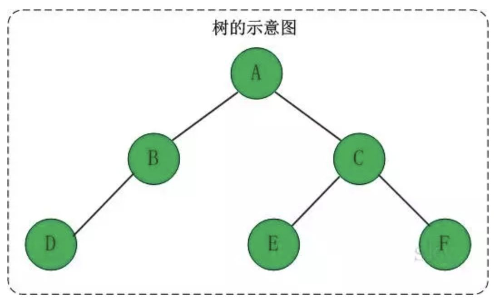

## 数据结构

#### 数组和链表的区别

  数组不允许动态地定义其大小，只能够将其定义成足够大小，这样可能会造成空间的浪费。

  数组在内存中是顺序的存储，可以以O(1)时间查找元素，但是需要O(n)时间插入和删除元素（因为其后面的元素都需要跟着移动）。

  链表可以动态地定义其大小。其在内存中是链式的存储，访问元素是需要从头开始向后顺序访问，所以需要O(n)时间查找元素；如果在所需位置直接插入或删除元素，需要O(1)时间，如果在需要先找到所需位置再插入或删除元素，需要O(n)时间。

#### 栈

栈是一种只能从表的一端存取数据且遵循 "**先进后出**" 原则的线性存储结构。

基于栈结构的特点，在实际应用中，通常只会对栈执行以下两种操作：

- 向栈中添加元素，此过程被称为"进栈"（入栈或压栈）；
- 从栈中提取出指定元素，此过程被称为"出栈"（或弹栈）；

栈是一种 "特殊" 的线性存储结构，因此栈的具体实现有以下两种方式：

1. 顺序栈：采用[顺序存储结构](http://c.biancheng.net/view/3334.html)可以模拟栈存储数据的特点，从而实现栈存储结构；
2. 链栈：采用[链式存储结构](http://c.biancheng.net/view/3336.html)实现栈结构；链栈的实现思路同顺序栈类似，顺序栈是将数[顺序表](http://c.biancheng.net/view/3334.html)（数组）的一端作为栈底，另一端为栈顶；链栈也如此，通常我们将链表的头部作为栈顶，尾部作为栈底。将链表头部作为栈顶的一端，可以避免在实现数据 "入栈" 和 "出栈" 操作时做大量遍历链表的耗时操作。

两种实现方式的区别，仅限于数据元素在实际物理空间上存放的相对位置，顺序栈底层采用的是数组，链栈底层采用的是链表。

栈的应用：

1.浏览器 "回退" 功能的实现，底层使用的就是栈存储结构。当你关闭页面 A 时，浏览器会将页面 A 入栈；同样，当你关闭页面 B 时，浏览器也会将 B入栈。因此，当你执行回退操作时，才会首先看到的是页面 B，然后是页面 A，这是栈中数据依次出栈的效果。

2.栈存储结构还可以帮我们检测代码中的括号匹配问题。多数编程语言都会用到括号（小括号、中括号和大括号），括号的错误使用（通常是丢右括号）会导致程序编译错误，而很多开发工具中都有检测代码是否有编辑错误的功能，其中就包含检测代码中的括号匹配问题，此功能的底层实现使用的就是栈结构。

3.栈结构还可以实现数值的进制转换功能。例如，编写程序实现从十进制数自动转换成二进制数，就可以使用栈存储结构来实现。

#### 队列

与栈结构不同的是，队列的两端都"开口"，要求数据只能从一端进，从另一端出。通常，称进数据的一端为 "队尾"，出数据的一端为 "队头"，数据元素进队列的过程称为 "入队"，出队列的过程称为 "出队"。队列中数据的进出要遵循 "**先进先出**" 的原则。

队列存储结构的实现有以下两种方式：

1. 顺序队列：在[顺序表](http://c.biancheng.net/view/3334.html)的基础上实现的队列结构；
2. 链队列：在[链表](http://c.biancheng.net/view/3336.html)的基础上实现的队列结构；

队列的应用：

排队买 XXX、医院的挂号系统等

#### 上溢与下溢

当循环队列非空且队尾指针等于对头指针时， 说明循环队列已满，不能进行入队运算。这种情况称为 (上溢) ；

当循环队列为空时， 不能进行退队运算， 这种情况称为 (下溢)。

在一个容量为 25 的循环队列中， 若头指针 front=16 ， 尾指针 rear=9 ， 则该循环队列中共有 18 个元素。        注： 当 rear<front 时， 元素个数＝总容量－（ front －rear ）； 当 rear>front 时，元素个数＝ rear －front 。

栈和队列通常采用的存储结构分别是 链式存储和顺序存储。

#### 树

**树的定义**

树是一种数据结构，它是由n（n>=0）个有限节点组成一个具有层次关系的集合，把它叫做“树”是因为它看起来像一棵倒挂的树，也就是说它是根朝上，而叶朝下的。它具有以下的特点：

- 每个节点有零个或多个子节点；
- 没有父节点的节点称为根节点；
- 每一个非根节点有且只有一个父节点；
- 除了根节点外，每个子节点可以分为多个不相交的子树。

**树的基本术语**

若一个结点有子树，那么该结点称为子树根的"双亲"，子树的根是该结点的"孩子"。有相同双亲的结点互为"兄弟"。一个结点的所有子树上的任何结点都是该结点的后裔。从根结点到某个结点的路径上的所有结点都是该结点的祖先。

**结点的度**：结点拥有的子树的数目，图中结点c的度为2。 **叶子**：度为零的结点，图中D、E、F都是叶子结点 **树的度**：树中结点的最大的度，图中结点c的度最大为2，因此树的度为2。

**层次**：根结点的层次为1，其余结点的层次等于该结点的双亲结点的层次加1。 **树的高度**：树中结点的最大层次，图中树的高度为3。 **无序树**：如果树中结点的各子树之间的次序是不重要的，可以交换位置。 **有序树**：如果树中结点的各子树之间的次序是重要的, 不可以交换位置。 **森林**：0个或多个不相交的树组成。对森林加上一个根，森林即成为树；删去根，树即成为森林。

**二叉树定义**

二叉树是每个节点最多有两个子树的树结构。它有五种基本形态：二叉树可以是空集；根可以有空的左子树或右子树；或者左、右子树皆为空。

**满二叉树**

**定义**：高度为h，并且由 ![[公式]](https://www.zhihu.com/equation?tex=2%5Eh) –1个结点的二叉树，被称为满二叉树，其实不难看出，满二叉树的结点的度要么为0（叶子结点），要么为2（非叶子结点）。

**完全二叉树**

**定义**：一棵二叉树中，只有最下面两层结点的度可以小于2，**并且最下一层的叶结点集中在靠左的若干位置上**。这样的二叉树称为完全二叉树。

**特点**：叶子结点只能出现在最下层和次下层，且最下层的叶子结点集中在树的左部。显然，一棵满二叉树必定是一棵完全二叉树，而完全二叉树未必是满二叉树。

**二叉查找树**

**定义**：二叉查找树，又被称为二叉搜索树。其特点如下：设x为二叉查找树中的一个结点，x节点包含关键字key，一句话就是左孩子比父节点小，右孩子比父节点大，还有一个特性就是”中序遍历“可以让结点有序。

可以看出，在二叉查找树中：

- 若任意节点的左子树不空，则左子树上所有结点的值均小于它的根结点的值；
- 任意节点的右子树不空，则右子树上所有结点的值均大于它的根结点的值；
- 任意节点的左、右子树也分别为二叉查找树；
- 没有键值相等的节点。

