## 计算机网络

#### 七层架构

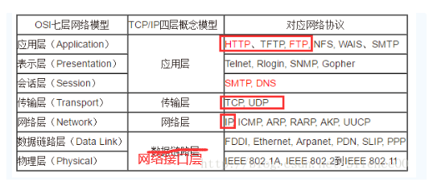

**每一层的作用**：

.png)


#### ICMP

它是TCP/IP协议族的一个子协议，用于在IP主机、路由器之间传递控制消息。控制消息是指网络通不通、主机是否可达、路由是否可用等网络本身的消息。这些控制消息虽然并不传输用户数据，但是对于用户数据的传递起着重要的作用。


#### Http

http: 超文本传输协议，基于TCP/IP通信协议来传递数据（HTML 文件, 图片文件, 查询结果等），是一个属于应用层的面向对象的协议，是一个客户端和服务器端请求和应答的标准（TCP），用于从WWW服务器传输超文本到本地浏览器的传输协议，它可以使浏览器更加高效，使网络传输减少。浏览器作为HTTP客户端通过URL向HTTP服务端即WEB服务器发送所有请求。Web服务器根据接收到的请求后，向客户端发送响应信息。

##### 请求报文

------

一个HTTP请求报文由**请求行（request line）**、**请求头**（**header**）、**请求数据**和**空行**4个部分组成，下图给出了请求报文的一般格式。
**请求行**：
请求行由**请求方法字段**、**URL字段**和**HTTP协议版本字段**3个字段组成，它们用空格分隔。

例如：GET /index.html HTTP/1.1。

get方法将数据拼接在url后面，传递参数受限。

**请求头(key value形式)**

- User-Agent：产生请求的浏览器类型；

- Accept：浏览器可以接收的数据类型；

- Accept-Language/Charset/Encoding：表示可以接受的字符集/语言/编码；

- Connection：处理完这次请求后是否断开连接还是继续保持连接； 

- Host：浏览器发送请求，用来指定服务器的域名（这也是HTTP1.0和1.1的主要区别）；

- Cookie：客户端通过这个字段可以向服务器带数据，通常包含用户信息。

**空行:**
    发送回车符和换行符，**通知服务器请求头数据发送完毕**。

**请求数据:**
    post方法中，会把数据以key value形式发送请求。

​    GET方式的请求一般不包含”请求数据”部分，请求数据以地址的形式表现在请求行。

##### 响应报文

------

HTTP响应也由四个部分组成，分别是：状态行、响应头、响应正文和空行。

**状态行：**

状态行格式如下：HTTP-Version   Status-Code  Reason-Phrase

      协议版本 状态码 状态码描述

例如： HTTP/1.1 200 OK

**响应头（见面试题header中包含的字段）：**

响应头用于描述服务器的基本信息，以及数据的描述，服务器通过这些数据的描述信息，可以通知客户端如何处理等一会儿它回送的数据。

- Server：告诉浏览器服务器的类型，如apache
- Date：日期+时间（格林威治时间）
- Content-Length：内容长度
- Content-Type: 内容类型

**空行:**
    发送回车符和换行符，**通知服务器请求头数据发送完毕**。

**响应正文**

.png)

##### 长连接和短连接

------

（1）短连接

在HTTP/1.0中，默认使用的是短连接。也就是说，浏览器和服务器每进行一次HTTP操作，就建立一次连接，但任务结束就中断连接。一般都是client先发起close操作。

短连接的优点是：管理起来比较简单，存在的连接都是有用的连接，不需要额外的控制手段。

（2）长连接

从 HTTP/1.1起，默认使用长连接，用以保持连接特性。使用长连接的HTTP协议，会在请求头/响应头中加入： `Connection：keep-alive` 

模拟一下长连接的情况，client向server发起连接，server接受client连接，双方建立连接。Client与server完成一次读写之后，它们之间的连接并不会主动关闭，后续的读写操作会继续使用这个连接。

##### **HTTP协议与TCP/IP协议的关系**

------

HTTP的长连接和短连接本质上是TCP长连接和短连接。HTTP属于应用层协议，在传输层使用TCP协议，在网络层使用IP协议。IP协议主要解决网络路由和寻址问题，TCP协议主要解决如何在IP层之上可靠的传递数据包，使在网络上的另一端收到发端发出的所有包，并且顺序与发出顺序一致。TCP有可靠，面向连接的特点。

##### **如何理解HTTP协议是无状态的**

HTTP协议是无状态的，指的是**协议对于事务处理没有记忆能力**，服务器不知道客户端是什么状态。也就是说，打开一个服务器上的网页和你之前打开这个服务器上的网页之间没有任何联系。

##### Http工作流程（七步）

建立TCP连接->发送请求行->发送请求头->（到达服务器）发送状态行->发送响应头->发送响应数据->断TCP连接

**1、*建立TCP连接***

在HTTP工作开始之前，Web浏览器首先要通过网络与Web服务器建立连接，该连接是通过TCP来完成的，该协议与IP协议共同构建 Internet，即著名的TCP/IP协议族，因此Internet又被称作是TCP/IP网络。HTTP是比TCP更高层次的应用层协议，根据规则， 只有低层协议建立之后才能，才能进行更高层协议的连接，因此，首先要建立TCP连接，一般TCP连接的端口号是80。

**2、浏览器向Web服务器发送请求行**

一旦建立了TCP连接，客户端就会向Web服务器发送请求命令。

**3、浏览器发送请求头**

浏览器发送其请求命令之后，还要以头信息的形式向Web服务器发送一些别的信息，之后浏览器发送了一空白行来通知服务器，它已经结束了头信息的发送。

**4. 服务器应答** 

客户端向服务器发出请求后，服务器会向客户端发送状态行信息， 如：HTTP/1.1 200 OK 。

**5. 服务器发送响应头**

正如客户端会随同请求发送关于自身的信息一样，服务器也会随同应答向用户发送关于它自己的数据及被请求的文档。

**6. 服务器向浏览器发送数据** 

Web服务器向浏览器发送头信息后，它会发送一个空白行来表示头信息的发送到此为结束，接着，它就以Content-Type应答头信息所描述的格式发送用户所请求的实际数据。

**7. 服务器关闭TCP连接** 

一般情况下，一旦服务器向浏览器发送了请求数据，它就要关闭TCP连接，然后如果浏览器或者服务器在其头信息加入了这行代码：

```
Connection:keep-alive 
```

TCP连接在发送后将仍然保持打开状态，于是，浏览器可以继续通过相同的连接发送请求。保持连接，节省了为每个请求建立新连接所需的时间，还节约了网络带宽。

##### http1.1和1.0的区别（5点）

**缓存处理**，在HTTP1.0中主要使用header里的If-Modified-Since,Expires来做为缓存判断的标准，HTTP1.1则引入了更多的缓存控制策略例如Entity tag，If-Unmodified-Since, If-Match, If-None-Match等更多可供选择的缓存头来控制缓存策略。

**带宽优化及网络连接的使用**，HTTP1.0中，存在一些浪费带宽的现象，例如客户端只是需要某个对象的一部分，而服务器却将整个对象送过来了，并且不支持断点续传功能，HTTP1.1则在请求头引入了range头域，它允许只请求资源的某个部分，即返回码是206（Partial Content），这样就方便了开发者自由的选择以便于充分利用带宽和连接。

**错误通知的管理**，在HTTP1.1中新增了24个错误状态响应码，如409（Conflict）表示请求的资源与资源的当前状态发生冲突；410（Gone）表示服务器上的某个资源被永久性的删除。

**Host头处理**，在HTTP1.0中认为每台服务器都绑定一个唯一的IP地址，因此，请求消息中的URL并没有传递主机名（hostname）。但随着虚拟主机技术的发展，在一台物理服务器上可以存在多个虚拟主机（Multi-homed Web Servers），并且它们共享一个IP地址。HTTP1.1的请求消息和响应消息都应支持Host头域，且请求消息中如果没有Host头域会报告一个错误（400 Bad Request）。

**长连接**，HTTP 1.1支持长连接（PersistentConnection）和请求的流水线（Pipelining）处理，在一个TCP连接上可以传送多个HTTP请求和响应，减少了建立和关闭连接的消耗和延迟，在HTTP1.1中默认开启Connection： keep-alive，一定程度上弥补了HTTP1.0每次请求都要创建连接的缺点。


#### Https

https: 是以安全为目标的HTTP通道，简单讲是HTTP的安全版，即HTTP下加入SSL层，HTTPS的安全基础是SSL，因此加密的详细内容就需要SSL。

https协议的主要作用是：建立一个信息安全通道，来确保数组的传输，确保网站的真实性。

##### Https工作流程

1. 用户在浏览器发起HTTPS请求（如 https://www.mogu.com/），默认使用服务端的443端口进行连接；

2. 服务端收到请求后，回应客户端并返回含有公钥**pub的**证书，而私钥**private**不公开保存在服务端；

3. 客户端收到证书后，会对证书验证。主要包括：是否在有效期内、证书的域名与请求的域名是否匹配，上一级证书是否有效（递归判断，直到判断到系统内置或浏览器配置好的根证书），如果不通过，则显示HTTPS警告信息，如果通过，则客户端会生成对称密钥key，并使用公钥pub对其加密。

4. 密钥交换：客户端会将加密后的密钥key发送给服务器，服务器在接收到key后会用私钥进行解密；

5. 服务端收到**随机密钥Key**的密文，使用与**公钥Pub**配对的**私钥Private**进行解密，得到客户端真正想发送的**随机密钥Key**；

6. 数据传输：经过以上流程客户端与服务端完成了密钥交换，之后进行数据传输过程中，双方就可以基于**对称加密**的方式进行数据传输，保证了网络数据传输的安全性。
   
   .png)

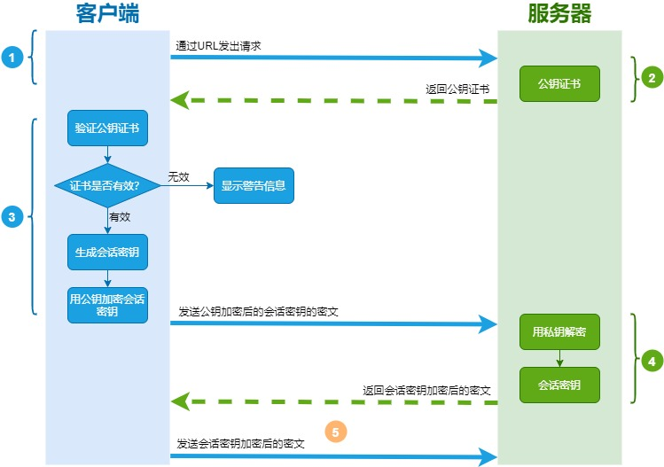

##### 客户端如何验证CA证书真实性

CA机构中的私钥除了**解密**外的真正用途其实还有一个，就是**数字签名**，其实就是一种防伪技术，只要有人篡改了证书，那么数字签名必然校验失败。具体过程如下

1. CA机构拥有自己的一对公钥和私钥
2. CA机构在颁发证书时对证书**明文信息进行哈希**
3. 将哈希值用私钥进行**加签**，得到数字签名

**明文数据和数字签名组成证书，传递给客户端。**

1. 客户端得到证书，分解成明文部分Text和数字签名Sig1
2. 用CA机构的公钥进行**解签**，得到Sig2（由于CA机构是一种公信身份，因此在系统或浏览器中会内置CA机构的证书和公钥信息）
3. 用证书里声明的哈希算法对明文Text部分进行哈希，得到H
4. 当自己计算得到的哈希值H与**解签**后的Sig2**相等**，表示证书可信，**没有被篡改**

.png)

##### http和https的区别

http传输的数据都是未加密的，也就是明文的，网景公司设置了SSL（安全套接层，1999年改名为TSL（传输层安全））协议来对http协议传输的数据进行加密处理，简单来说https协议是由http和ssl协议构建的可进行加密传输和身份认证的网络协议，比http协议的安全性更高。

.png)

主要的区别如下：
HTTPS协议需要ca证书，费用较高。

HTTP是超文本传输协议，信息是明文传输，HTTPS则是具有安全性的SSL加密传输协议。

使用不同的链接方式，端口也不同，一般而言，HTTP协议的端口为80，HTTPS的端口为443。

HTTP的连接很简单，是无状态的；HTTPS协议是由SSL+HTTP协议构建的可进行加密传输、身份认证的网络协议，比HTTP协议安全。

**https协议的优点**

使用HTTPS协议可认证用户和服务器，确保数据发送到正确的客户机和服务器；

HTTPS协议是由SSL+HTTP协议构建的可进行加密传输、身份认证的网络协议，要比http协议安全，可防止数据在传输过程中不被窃取、改变，确保数据的完整性。

HTTPS是现行架构下最安全的解决方案，虽然不是绝对安全，但它大幅增加了中间人攻击的成本。

谷歌曾在2014年8月份调整搜索引擎算法，并称“比起同等HTTP网站，采用HTTPS加密的网站在搜索结果中的排名将会更高”。

**https协议的缺点**

https握手阶段比较费时，会使页面加载时间延长50%，增加10%~20%的耗电。

https缓存不如http高效，会增加数据开销。

SSL证书也需要钱，功能越强大的证书费用越高。

SSL证书需要绑定IP，不能再同一个ip上绑定多个域名，ipv4资源支持不了这种消耗。


#### POST与GET的区别（9点）

1.最直观的区别就是GET把参数包含在URL中，POST通过request body传递参数。

2.POST更安全（不会作为url的一部分，不会被缓存、保存在服务器日志、以及浏览器浏览记录中）

3.POST发送的数据量更大（GET有URL长度限制(1024字节），对GET请求参数的长度限制是因为浏览器有所限制，和GET、POST没有基本没有关系）

4.GET的速度比POST要快。因为GET和POST的请求过程不同，不过前三步都是一样的，都是要先经过和服务器的三次握手：①浏览器请求tcp连接（第一次握手）；②服务器答应进行TCP连接（第二次握手）；③浏览器确认，并发送GET请求头和数据（第三次握手，这个报文比较小，所以HTTP会在此时进行第一次数据发送）。GET请求在第四步就会接收到了服务器返回的数据，而POST请求在第四步是接收到服务器发送的100 continue指令，客户端再发送数据请求服务端，服务端才会去返回数据，就是说POST比GET多进行了一次客户端和服务器的打交道，GET请求产生了一个TCP数据包，而POST请求产生了两个TCP数据包。

5.POST能发送更多的数据类型（GET只能发送ASCII字符）

6.GET请求类似于查找的过程，用户获取数据，可以不用每次都与数据库连接，所以可以使用缓存。POST不同，POST做的一般是修改和删除的工作，所以必须与数据库交互，所以不能使用缓存。因此GET请求适合于请求缓存。

7.GET在浏览器回退时是无害的，而POST会再次提交请求

8.GET是幂等的，而POST不是幂等的

9.GET产生的URL地址可以被Bookmark，而POST不可以

HTTP的底层是TCP/IP。所以GET和POST的底层也是TCP/IP，也就是说，GET/POST都是TCP链接。GET和POST能做的事情是一样一样的。你要给GET加上request body，给POST带上URL参数，技术上是完全行的通的。


#### Http2.0

**HTTP1.x有以下几个主要缺点：**

1. HTTP/1.0一次只允许在一个TCP连接上发起一个请求；HTTP/1.1使用的流水线技术也只能部分处理请求并发，仍然会存在队列头阻塞问题，因此客户端在需要发起多次请求时，通常会采用建立多连接来减少延迟。HTTP/1.1新增了Host字段，1.0没有Host。
2. 单向请求，只能由客户端发起。
3. 请求报文与响应报文首部信息冗余量大。
4. 数据未压缩，导致数据的传输量大

**简要概括：**http2.0是基于1999年发布的http1.0之后的首次更新。

**HTTP2.0优点（6点）：**

**1.提升访问速度**

请求资源所需时间更少，访问速度更快，相比http1.0

**2.允许多路复用**

多路复用允许同时通过单一的HTTP/2连接发送多重请求-响应信息。改善了：在http1.1中，浏览器客户端在同一时间，针对同一域名下的请求有一定数量限制（连接数量），超过限制会被阻塞。

HTTP2.0中,基于二进制分帧层，HTTP2.0可以在共享TCP连接的基础上同时发送请求和响应。HTTP消息被分解为独立的帧，而不破坏消息本身的语义，交错发出去，在另一端根据流标识符和首部将他们重新组装起来。 通过该技术，可以避免HTTP旧版本的队头阻塞问题，极大提高传输性能。

**3.二进制分帧**

HTTP2.0会将所有的传输信息分割为更小的消息（比帧大的通讯单位）或者帧（HTTP2.0通信的最小单位），并对他们进行二进制编码。HTTP2.0中所有加强性能的核心是二进制传输，在HTTP1.x中，我们是通过文本的方式传输数据。基于文本的方式传输数据存在很多缺陷，文本的表现形式有多样性，因此要做到健壮性考虑的场景必然有很多，但是二进制则不同，只有0和1的组合，因此选择了二进制传输，实现方便且健壮。

**4.首部压缩**

HTTP每次通讯（请求或响应）都会携带首部信息用于描述资源属性。

在HTTP1.0中，我们使用文本的形式传输header，在header中携带cookie的话，每次都需要重复传输几百到几千的字节，这着实是一笔不小的开销。

在HTTP2.0中，我们使用了HPACK（HTTP2头部压缩算法）压缩格式对传输的header进行编码，减少了header的大小。并在两端维护了索引表，用于记录出现过的header，后面在传输过程中就可以传输已经记录过的header的键名，对端收到数据后就可以通过键名找到对应的值。

**5.请求优先级**

把HTTP消息分为很多独立帧之后，就可以通过优化这些帧的交错和传输顺序进一步优化性能。

**6.服务器端推送**

HTTP2.0新增的一个强大的新功能，就是服务器可以对一个客户端请求发送多个响应。服务器向客户端推送资源无需客户端明确的请求。

服务端根据客户端的请求，提前返回多个响应，推送额外的资源给客户端。如客户端请求stream 1(/page.html)。服务端在返回stream 1的消息的同时推送了stream 2(/script.js)和stream 4(/style.css)

服务端推送是一种在客户端请求之前发送数据的机制。在HTTP2.0中，服务器可以对一个客户端的请求发送多个响应。如果一个请求是由你的主页发送的，服务器可能会响应主页内容、logo以及样式表，因为他知道客户端会用到这些东西。这样不但减轻了数据传送冗余步骤，也加快了页面响应的速度，提高了用户体验。

推送的缺点：所有推送的资源都必须遵守同源策略。换句话说，服务器不能随便将第三方资源推送给客户端，而必须是经过双方的确认才行。

#### 加密方法

##### 对称加密：

概念：加密解密使用同一密钥。有AES算法。

加密解密过程：明文->密钥加密->密文；密文->密钥解密->明文。

优点：计算量小，加密速度快，加密效率高 。

缺点：双方使用相同的钥匙，安全性得不到保证。

注意事项：密钥的保密工作非常重要；密钥要求定期更换。

##### 非对称加密

非对称加密：加密解密使用不同的密钥，公钥会发送到网络中，私钥不公开。如RSA。

如果用公开密钥对数据进行加密，只有用对应的私有密钥才能解密。 
如果用私有密钥对数据进行加密，只有用对应的公开密钥才能解密。

对称加密效率高，安全性低；非对称加密效率低，安全性高。往往两者配合使用。

.png)


#### TCP与UDP

##### TCP的三次握手

第一次握手：建立连接时，客户端发送syn包（syn=j）到服务器，并进入SYN_SENT状态，等待服务器确认；SYN：同步序列编号（Synchronize Sequence Numbers）。

第二次握手：服务器收到syn包，必须确认客户的SYN（ack=j+1），同时自己也发送一个SYN包（syn=k），即SYN+ACK包，此时服务器进入SYN_RECV状态；

第三次握手：客户端收到服务器的SYN+ACK包，向服务器发送确认包ACK(ack=k+1），此包发送完毕，客户端和服务器进入ESTABLISHED（TCP连接成功）状态，完成三次握手。

.png)

**为什么三次握手**

三次握手最主要的目的就是确认**双方收发都正常，从而建立起可靠的连接**。

第一次握手：客户端不能确认任何事，服务端可以确认对方发送正常，自己接收正常。

第二次握手：客户端可以确认自己发送正常、接收正常，对方发送、接收正常。服务端确认对方发送正常、接收正常。

第三次握手：客户端可以确认自己发送正常、接收正常，对方发送、接收正常。服务端确认自己发送、接收正常。

如果不进行第三次握手，其实服务端并不知道A是否收到。

**为什么不能用两次握手进行连接？**

答：3次握手完成两个重要的功能，既要双方做好发送数据的准备工作(双方都知道彼此已准备好)，也要允许双方就初始序列号进行协商，这个序列号在握手过程中被发送和确认。

现在把三次握手改成仅需要两次握手，死锁是可能发生的。作为例子，考虑计算机S和C之间的通信，假定C给S发送一个连接请求分组，S收到了这个分组，并发 送了确认应答分组。按照两次握手的协定，S认为连接已经成功地建立了，可以开始发送数据分组。可是，C在S的应答分组在传输中被丢失的情况下，将不知道S 是否已准备好，不知道S建立什么样的序列号，C甚至怀疑S是否收到自己的连接请求分组。在这种情况下，C认为连接还未建立成功，将忽略S发来的任何数据分组，只等待连接确认应答分组。而S在发出的分组超时后，重复发送同样的分组。这样就形成了死锁。

##### **TCP四次挥手**

1）客户端进程发出连接释放报文，并且停止发送数据。释放数据报文首部，FIN=1，其序列号为seq=u（等于前面已经传送过来的数据的最后一个字节的序号加1），此时，客户端进入FIN-WAIT-1（终止等待1）状态。 TCP规定，FIN报文段即使不携带数据，也要消耗一个序号。

2）服务器收到连接释放报文，发出确认报文，ACK=1，ack=u+1，并且带上自己的序列号seq=v，此时，服务端就进入了CLOSE-WAIT（关闭等待）状态。TCP服务器通知高层的应用进程，客户端向服务器的方向就释放了，这时候处于半关闭状态，即客户端已经没有数据要发送了，但是服务器若发送数据，客户端依然要接受。这个状态还要持续一段时间，也就是整个CLOSE-WAIT状态持续的时间。

3）客户端收到服务器的确认请求后，此时，客户端就进入FIN-WAIT-2（终止等待2）状态，等待服务器发送连接释放报文（在这之前还需要接受服务器发送的最后的数据）。

4）服务器将最后的数据发送完毕后，就向客户端发送连接释放报文，FIN=1，ack=u+1，由于在半关闭状态，服务器很可能又发送了一些数据，假定此时的序列号为seq=w，此时，服务器就进入了LAST-ACK（最后确认）状态，等待客户端的确认。

5）客户端收到服务器的连接释放报文后，必须发出确认，ACK=1，ack=w+1，而自己的序列号是seq=u+1，此时，客户端就进入了TIME-WAIT（时间等待）状态。注意此时TCP连接还没有释放，必须经过2∗∗MSL（最长报文段寿命）的时间后，当客户端撤销相应的TCB后，才进入CLOSED状态。

6）服务器只要收到了客户端发出的确认，立即进入CLOSED状态。同样，撤销TCB后，就结束了这次的TCP连接。可以看到，**服务器结束TCP连接的时间要比客户端早一些。**

.png)

**为什么连接的时候是三次握手，关闭的时候却是四次握手？**

答：因为当Server端收到Client端的SYN连接请求报文后，可以直接发送SYN+ACK报文。其中ACK报文是用来应答的，SYN报文是用来同步的。但是关闭连接时，当Server端收到FIN报文时，很可能并不会立即关闭SOCKET，所以只能先回复一个ACK报文，告诉Client端，"你发的FIN报文我收到了"。只有等到我Server端所有的报文都发送完了，我才能发送FIN报文，因此不能一起发送。故需要四步握手。

**为什么TIME_WAIT状态需要经过2MSL(最大报文段生存时间)才能返回到CLOSE状态？**

答：虽然按道理，四个报文都发送完毕，我们可以直接进入CLOSE状态了，但是我们必须假象网络是不可靠的，有可以最后一个ACK丢失。所以TIME_WAIT状态就是用来重发可能丢失的ACK报文。在Client发送出最后的ACK回复，但该ACK可能丢失。Server如果没有收到ACK，将不断重复发送FIN片段。所以Client不能立即关闭，它必须确认Server接收到了该ACK。Client会在发送出ACK之后进入到TIME_WAIT状态。Client会设置一个计时器，等待2MSL的时间。如果在该时间内再次收到FIN，那么Client会重发ACK并再次等待2MSL。所谓的2MSL是两倍的MSL(Maximum Segment Lifetime)。MSL指一个片段在网络中最大的存活时间，2MSL就是一个发送和一个回复所需的最大时间。如果直到2MSL，Client都没有再次收到FIN，那么Client推断ACK已经被成功接收，则结束TCP连接。

##### TCP保活

TCP还设有一个保活计时器，显然，客户端如果出现故障，服务器不能一直等下去，白白浪费资源。服务器每收到一次客户端的请求后都会重新复位这个计时器，时间通常是设置为**2小时**，若两小时还没有收到客户端的任何数据，服务器就会发送一个探测报文段，以后每隔**75秒钟**发送一次。若一连发送**10个探测报文**仍然没反应，服务器就认为客户端出了故障，接着就关闭连接。

如果一个给定的连接在两小时内没有任何的动作，则服务器就向客户发一个探测报文段，客户主机必须处于以下4个状态之一：

1. 客户主机依然正常运行，并从服务器可达。客户的TCP响应正常，而服务器也知道对方是正常的，服务器在两小时后将保活定时器复位。
2. 客户主机已经崩溃，并且关闭或者正在重新启动。在任何一种情况下，客户的TCP都没有响应。服务端将不能收到对探测的响应，并在75秒后超时。服务器总共发送10个这样的探测 ，每个间隔75秒。如果服务器没有收到一个响应，它就认为客户主机已经关闭并终止连接。
3. 客户主机崩溃并已经重新启动。服务器将收到一个对其保活探测的响应，这个响应是一个复位，使得服务器终止这个连接。
4. 客户机正常运行，但是服务器不可达，这种情况与2类似，TCP能发现的就是没有收到探查的响应。

从上面可以看出，TCP保活功能主要为探测长连接的存活状况，不过这里存在一个问题，存活功能的探测周期太长，还有就是它只是探测TCP连接的存活，属于比较斯文的做法，遇到恶意的连接时，保活功能就不够使了。

在长连接的应用场景下，client端一般不会主动关闭它们之间的连接，Client与server之间的连接如果一直不关闭的话，会存在一个问题，随着客户端连接越来越多，server早晚有扛不住的时候，这时候server端需要采取一些策略，如关闭一些长时间没有读写事件发生的连接，这样可以避免一些恶意连接导致server端服务受损；如果条件再允许就可以以客户端机器为颗粒度，限制每个客户端的最大长连接数，这样可以完全避免某个蛋疼的客户端连累后端服务。

##### TCP可靠性（3点）

**（1）校验和：**

TCP报头中有对应的检验和字段，**发送的数据包**的二进制相加然后取反，**目的是检测数据在传输过程中的任何变化**。如果收到段的检验和有差错，TCP将丢弃这个报文段以及**不发送应答信号**。

**（2）超时重传：**

当发送端发出一个TCP报文后，会启动一个定时器，等待接收端确认收到这个报文段。如果**不能及时**收到一个确认，将重发这个报文段。

**（3）流量控制：**

TCP连接的双方都有固定大小的缓冲空间，接收端只允许发送端发送其缓冲区能接纳的数据。当接收方来不及处理发送方的数据，可以提示发送方降低发送的速率，防止包丢失。TCP利用滑动窗口机制实现流量控制。滑动窗口既提高了报文传输的效率，也避免了发送方发送过多的数据而导致接收方无法正常处理的异常。

利用**滑动窗口**机制可以很方便地在TCP连接上实现对发送方的流量控制。

- - TCP接收方利用自己的接收窗口的大小来限制**发送方发送窗口的大小**
  - TCP**发送方收到**接收方的**零窗口通知**后，应启动**持续计时器**。持续计时器超时后，向接收方发送**零窗口探测报文，**以确定接收方是否还有能力接收数据。

.png)

从上面的图可以看到滑动窗口左边的是已发送并且被确认的分组，滑动窗口右边是还没有轮到的分组。

滑动窗口里面也分为两块，一块是**已经发送但是未被确认的分组**，另一块是**窗口内等待发送的分组**。随着已发送的分组不断被确认，窗口内等待发送的分组也会不断被发送。整个窗口就会往右移动，让还没轮到的分组进入窗口内。

可以看到滑动窗口起到了一个**限流**的作用，也就是说当前滑动窗口的大小决定了当前 TCP 发送包的速率，而滑动窗口的大小取决于拥塞控制窗口和流量控制窗口的两者间的最小值。

**（4）拥塞控制：**

**当出现网络拥塞时，会减少数据的发送。**

实现拥塞控制四种算法：

**慢开始：**由小到大逐渐增大发送的拥塞窗口

**拥塞避免：**当出现超时重传时，表示可能会出现网络拥塞，一旦出现拥塞，那么就会是ssthresh变为当前拥塞窗口的1/2，并将拥塞窗口从1开始。

**快重传：**所谓快重传，就是使发送方尽快进行重传，而不是等超时重传计时器超时再重传。

**快恢复：**发送方一旦收到3个重复确认，就知道现在只是丢失了个别的报文段。于是不启动慢开始算法，而执行**快恢复算法。**

```
发送方维护一个叫做拥塞窗口cwnd（congestion window）的状态变量。其值取决于网络的拥塞程度，并且动态变化。

慢开始是指一开始不发送大量的数据，而是由小到大呈指数增加拥塞窗口cwnd的值。

拥塞避免指当拥塞窗口cwnd=慢开始门限ssthresh时，改用拥塞避免算法，将拥塞窗口控制为线性+1的速度增长。当出现超时重传时，判断网络很可能出现拥塞，就会采取以下措施：将慢开始门限值ssthresh更新为发生拥塞时cwnd值的一半；将拥塞窗口值cwnd设为1，并重新执行慢开始算法。
```

.png)

**为什么会在1990年引进新的算法（快重传快恢复）来改进TCP的性能？**

```
有时，个别报文段会在网络中丢失，但实际上网络并未发生拥塞。这将导致：

1.发送方超时重传，并误认为网络发生了拥塞；
2.发送方把拥塞窗口值cwnd设置为1，并错误地启动慢开始算法，因而降低了传输效率。
```

**快重传**

所谓快重传就是使发送方**尽快进行重传**，**而不必等待超时重传计时器到期**。规定：

- 发送方一旦收到**3个连续的重复确认**，就将相应的报文段**立即重传**，而不是等该报文段的超时重传计时器超时再重传。

- 对于个别丢失的报文段，**发送方不会出现超时重传**，也就不会误认为出现了拥塞。

- 发送方一旦收到三个重复确认，就知道现在只是丢失了个别报文段，于是不启动慢开始算法，而是执行快恢复算法。

- **发送方将慢开始门限值**ssthresh和拥塞窗口值都调整为当前窗口值cwnd的一半，然后执行拥塞避免的流程。

.png)

**快恢复**

```
主要是配合快重传。也就是刚刚讲的在发送方将慢开始门限值ssthresh和拥塞窗口值都调整为cwnd的一半，然后执行拥塞避免的流程。    ---这就是快恢复。

因为如果网络出现拥塞的话，就不会收到好几个重复的确认，收到三个重复确认说明网络状况还可以。
```

.png)

.png)

**（5）序列号和确认号**

序列号的作用不仅仅是应答的作用，有了序列号能够将接收到的数据根据序列号排序，并且去掉重复序列号的数据。

TCP传输的过程中，每次接收方收到数据后，都会对传输方进行确认应答。也就是发送ack报文，ack报文告诉发送方，接收到了您发送的数据，请发下一组数据吧。

##### TCP与UDP对比

（1）TCP是面向连接的；UDP是无连接的即发送数据前不需要先建立链接。

（2）TCP提供可靠的服务。也就是说，通过TCP连接传送的数据，无差错，不丢失，不重复，且按序到达；UDP尽最大努力交付，即不保证可靠交付。 并且因为tcp可靠，面向连接，不会丢失数据因此适合大数据量的交换。

（3）TCP是面向**字节流**；UDP面向**报文**，具有较好的实时性，工作效率比TCP高，并且网络出现拥塞不会使得发送速率降低（因此会出现丢包，对实时的应用比如IP电话和视频会议等）。

（4）TCP只能是1对1的，UDP支持1对1,1对多。

（5）TCP的首部较大为20字节，而UDP只有8字节。

（6）TCP对系统资源要求较多，UDP对系统资源要求较少。


#### 数字签名

**非对称加密**

在通信双方，如果使用非对称加密，一般遵从这样的原则：公钥加密，私钥解密。同时，一般一个密钥加密，另一个密钥就可以解密。因为公钥是公开的，如果用来解密，那么就很容易被不必要的人解密消息。因此，私钥也可以认为是个人身份的证明。

如果通信双方需要互发消息，那么应该建立两套非对称加密的机制（即两对公私钥密钥对），发消息的一方使用对方的公钥进行加密，接收消息的一方使用自己的私钥解密。

**消息摘要**

消息摘要可以将消息哈希转换成一个固定长度的值唯一的字符串。值唯一的意思是不同的消息转换的摘要是不同的，并且能够确保唯一。该过程不可逆，即不能通过摘要反推明文（似乎SHA1已经可以被破解了，SHA2还没有。一般认为不可破解，或者破解需要耗费太多时间，性价比低）。

利用这一特性，可以验证消息的完整性。消息摘要通常用在数字签名中。

**数字签名**

假设现在有通信双方A和B，两者之间使用两套非对称加密机制。

现在A向B发消息。

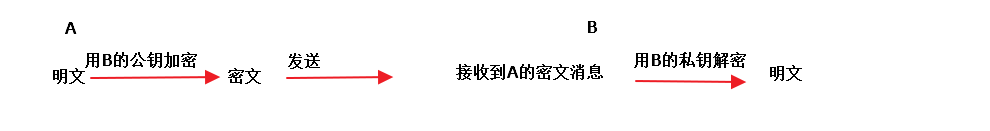

那么，如果在发送过程中，有人修改了里面密文消息，B拿到的密文，解密之后得到明文，并非A所发送的，信息不正确。

要解决两个问题：1. A的身份认证 2. A发送的消息完整性 那么就要用到上面所讲的基础知识。

数字签名的过程如下图：

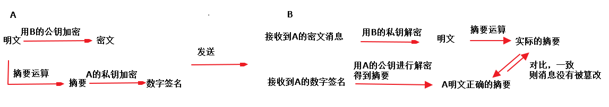

简单解释：

A：将明文进行摘要运算后得到摘要（消息完整性），再将摘要用A的私钥加密（身份认证），得到数字签名，将密文和数字签名一块发给B。

B：收到A的消息后，先将密文用自己的私钥解密，得到明文。将数字签名用A的公钥进行解密后，得到正确的摘要（解密成功说明A的身份被认证了）。

对明文进行摘要运算，得到实际收到的摘要，将两份摘要进行对比，如果一致，说明消息没有被篡改（消息完整性）。

疑问：摘要使用A的私钥加密，如果被拥有A的公钥的第三者截获，不就可以获取到摘要了么？会不会对安全造成威胁？

不会。因为摘要是不可逆推出原文的。

**数字证书**

理解了数字签名之后，数字证书就好理解了。由于网络上通信的双方可能都不认识对方，那么就需要第三者来介绍，这就是数字证书。数字证书由Certificate Authority( CA 认证中心)颁发。

非对称加密在解密过程中，消耗的时间远远超过对称加密。如果密文很长，那么效率就比较低下了。但密钥一般不会特别长，对对称加密的密钥的加解密可以提高效率。


#### Http请求方式（8种）

**1、GET方法**

GET方法用于使用给定的URI从给定服务器中检索信息，即从指定资源中请求数据。使用GET方法的请求应该只是检索数据，并且不应对数据产生其他影响。

在GET请求的URL中发送查询字符串（名称/值对）。

说明：

GET请求是可以缓存的，我们可以从浏览器历史记录中查找到GET请求，还可以把它收藏到书签中；且GET请求有长度限制，仅用于请求数据（不修改）。

注：因GET请求的不安全性，在处理敏感数据时，绝不可以使用GET请求。

**2、POST方法**

POST方法用于将数据发送到服务器以创建或更新资源，它要求服务器确认请求中包含的内容作为由URI区分的Web资源的另一个下属。

POST请求永远不会被缓存，且对数据长度没有限制；我们无法从浏览器历史记录中查找到POST请求。

**3、HEAD方法**

HEAD方法与 GET 方法类似，也是请求从服务器获取资源，服务器的处理机制也是一样的，但服务器不会返回请求的实体数据，只会传回响应头，也就是资源的“元信息”。

HEAD 方法可以看做是 GET 方法的一个“简化版”或者“轻量版”。因为它的响应头与 GET 完全相同，所以可以用在很多并不真正需要资源的场合，避免传输 body 数据的浪费。

比如，想要检查一个文件是否存在，只要发个 HEAD 请求就可以了，没有必要用 GET 把整个文件都取下来。再比如，要检查文件是否有最新版本，同样也应该用 HEAD，服务器会在响应头里把文件的修改时间传回来。

一个HEAD请求的响应可被缓存，也就是说，响应中的信息可能用来更新之前缓存的实体。如果当前实体跟缓存实体的阈值不同（可通过Content-Length、Content-MD5、ETag或Last-Modified的变化来表明），那么这个缓存就被视为过期了。

主要有以下特点：

1、只请求资源的首部；

2、检查超链接的有效性；

3、检查网页是否被修改；

4、多用于自动搜索机器人获取网页的标志信息，获取rss种子信息，或者传递安全认证信息等

**4、PUT方法**

PUT方法用于将数据发送到服务器以创建或更新资源，它可以用上传的内容替换目标资源中的所有当前内容。

它会将包含的元素放在所提供的URI下，如果URI指示的是当前资源，则会被改变。如果URI未指示当前资源，则服务器可以使用该URI创建资源。

**5、DELETE方法**

DELETE方法用来删除指定的资源，它会删除URI给出的目标资源的所有当前内容。

**6、CONNECT方法**

CONNECT方法用来建立到给定URI标识的服务器的隧道；它通过简单的TCP / IP隧道更改请求连接，通常是使用解码的HTTP代理来进行SSL编码的通信（HTTPS）。

**7、OPTIONS方法**

OPTIONS方法用来描述了目标资源的通信选项，会返回服务器支持预定义URL的HTTP策略。

**8、TRACE方法**

TRACE方法用于沿着目标资源的路径执行消息环回测试；它回应收到的请求，以便客户可以看到中间服务器进行了哪些（假设任何）进度或增量。


#### 服务器状态码

**1xx：信息；2xx：成功；3xx：重定向；4xx：客户端错误；5xx：服务器错误。**

------

**100  Continue  继续。**客户端应继续其请求，POST请求在第四次握手使用。

101  Switching Protocols  切换协议。服务器根据客户端的请求切换协议。只能切换到更高级的协议，例如，切换到HTTP的新版本协议

**200  OK  请求成功。一般用于GET与POST请求**

**201  Created  已创建。**成功请求并创建了新的资源

**202  Accepted  已接受。**已经接受请求，但未处理完成

203  Non-Authoritative Information  非授权信息。请求成功。但返回的meta信息不在原始的服务器，而是一个副本

204  No Content  无内容。服务器成功处理，但未返回内容。在未更新网页的情况下，可确保浏览器继续显示当前文档

205  Reset Content  重置内容。服务器处理成功，用户终端（例如：浏览器）应重置文档视图。可通过此返回码清除浏览器的表单域

206  Partial Content  部分内容。服务器成功处理了部分GET请求

300  Multiple Choices  多种选择。请求的资源可包括多个位置，相应可返回一个资源特征与地址的列表用于用户终端（例如：浏览器）选择

**301  Moved Permanently  永久移动。请求的资源已被永久的移动到新URI，返回信息会包括新的URI，浏览器会自动定向到新URI。今后任何新的请求都应使用新的URI代替**

**302  Found  临时移动。与301类似。但资源只是临时被移动。客户端应继续使用原有URI**

303  See Other  查看其它地址。与301类似。使用GET和POST请求查看

**304  Not Modified  未修改。所请求的资源未修改，服务器返回此状态码时，不会返回任何资源。客户端通常会缓存访问过的资源，通过提供一个头信息指出客户端希望只返回在指定日期之后修改的资源**

305  Use Proxy  使用代理。所请求的资源必须通过代理访问

306  Unused  已经被废弃的HTTP状态码

307  Temporary Redirect  临时重定向。与302类似。使用GET请求重定向

**400  Bad Request  客户端请求的语法错误，服务器无法理解**

**401  Unauthorized  请求要求用户的身份认证**

402  Payment Required  保留，将来使用

**403  Forbidden  服务器理解请求客户端的请求，但是拒绝执行此请求**

**404  Not Found  服务器无法根据客户端的请求找到资源（网页）。通过此代码，网站设计人员可设置"您所请求的资源无法找到"的个性页面**

405  Method Not Allowed  客户端请求中的方法被禁止

406  Not Acceptable  服务器无法根据客户端请求的内容特性完成请求

407  Proxy Authentication Required  请求要求代理的身份认证，与401类似，但请求者应当使用代理进行授权

408  Request Time-out  服务器等待客户端发送的请求时间过长，超时

409  Conflict  服务器完成客户端的PUT请求是可能返回此代码，服务器处理请求时发生了冲突

410  Gone  客户端请求的资源已经不存在。410不同于404，如果资源以前有现在被永久删除了可使用410代码，网站设计人员可通过301代码指定资源的新位置

411  Length Required  服务器无法处理客户端发送的不带Content-Length的请求信息

412  Precondition Failed  客户端请求信息的先决条件错误

413  Request Entity Too Large  由于请求的实体过大，服务器无法处理，因此拒绝请求。为防止客户端的连续请求，服务器可能会关闭连接。如果只是服务器暂时无法处理，则会包含一个Retry-After的响应信息

414  Request-URI Too Large  请求的URI过长（URI通常为网址），服务器无法处理

415  Unsupported Media Type  服务器无法处理请求附带的媒体格式

416  Requested range not satisfiable  客户端请求的范围无效

417  Expectation Failed  服务器无法满足Expect的请求头信息

**500  Internal Server Error  服务器内部错误，无法完成请求**

501  Not Implemented  服务器不支持请求的功能，无法完成请求

502  Bad Gateway  作为网关或者代理工作的服务器尝试执行请求时，从远程服务器接收到了一个无效的响应

503  Service Unavailable  由于超载或系统维护，服务器暂时的无法处理客户端的请求。延时的长度可包含在服务器的Retry-After头信息中

504  Gateway Time-out  充当网关或代理的服务器，未及时从远端服务器获取请求

505  HTTP Version not supported  服务器不支持请求的HTTP协议的版本，无法完成处理


#### Http常用请求头

| 协议头                 | 说明                                                                                                                               |
| ------------------- | -------------------------------------------------------------------------------------------------------------------------------- |
| Accept              | 可接受的响应内容类型（Content-Types）。                                                                                                       |
| Accept-Charset      | 可接受的字符集                                                                                                                          |
| Accept-Encoding     | 可接受的响应内容的编码方式。                                                                                                                   |
| Accept-Language     | 可接受的响应内容语言列表。                                                                                                                    |
| Accept-Datetime     | 可接受的按照时间来表示的响应内容版本                                                                                                               |
| Authorization       | 用于表示HTTP协议中需要认证资源的认证信息                                                                                                           |
| Cache-Control       | 用来指定当前的请求/回复中的，是否使用缓存机制。                                                                                                         |
| Connection          | 客户端（浏览器）想要优先使用的连接类型                                                                                                              |
| Cookie              | 由之前服务器通过Set-Cookie（见下文）设置的一个HTTP协议Cookie                                                                                         |
| Content-Length      | 以8进制表示的请求体的长度                                                                                                                    |
| Content-MD5         | 请求体的内容的二进制 MD5 散列值（数字签名），以 Base64 编码的结果                                                                                          |
| Content-Type        | 请求体的MIME类型 （用于POST和PUT请求中）                                                                                                       |
| Date                | 发送该消息的日期和时间（以[RFC 7231](https://www.nowcoder.com/tutorial/96/24304825a0c04ea9a53cdb09cb664834#section-7.1.1.1)中定义的"HTTP日期"格式来发送） |
| Expect              | 表示客户端要求服务器做出特定的行为                                                                                                                |
| From                | 发起此请求的用户的邮件地址                                                                                                                    |
| Host                | 表示服务器的域名以及服务器所监听的端口号。如果所请求的端口是对应的服务的标准端口（80），则端口号可以省略。                                                                           |
| If-Match            | 仅当客户端提供的实体与服务器上对应的实体相匹配时，才进行对应的操作。主要用于像 PUT 这样的方法中，仅当从用户上次更新某个资源后，该资源未被修改的情况下，才更新该资源。                                            |
| If-Modified-Since   | 允许在对应的资源未被修改的情况下返回304未修改                                                                                                         |
| If-None-Match       | 允许在对应的内容未被修改的情况下返回304未修改（ 304 Not Modified ），参考 超文本传输协议 的实体标记                                                                    |
| If-Range            | 如果该实体未被修改过，则向返回所缺少的那一个或多个部分。否则，返回整个新的实体                                                                                          |
| If-Unmodified-Since | 仅当该实体自某个特定时间以来未被修改的情况下，才发送回应。                                                                                                    |
| Max-Forwards        | 限制该消息可被代理及网关转发的次数。                                                                                                               |
| Origin              | 发起一个针对[跨域资源共享](http://itbilu.com/javascript/js/VkiXuUcC.html)的请求（该请求要求服务器在响应中加入一个Access-Control-Allow-Origin的消息头，表示访问控制所允许的来源）。  |
| Pragma              | 与具体的实现相关，这些字段可能在请求/回应链中的任何时候产生。                                                                                                  |
| Proxy-Authorization | 用于向代理进行认证的认证信息。                                                                                                                  |
| Range               | 表示请求某个实体的一部分，字节偏移以0开始。                                                                                                           |
| Referer             | 表示浏览器所访问的前一个页面，可以认为是之前访问页面的链接将浏览器带到了当前页面。Referer其实是Referrer这个单词，但RFC制作标准时给拼错了，后来也就将错就错使用Referer了。                                |
| TE                  | 浏览器预期接受的传输时的编码方式：可使用回应协议头Transfer-Encoding中的值（还可以使用"trailers"表示数据传输时的分块方式）用来表示浏览器希望在最后一个大小为0的块之后还接收到一些额外的字段。                     |
| User-Agent          | 浏览器的身份标识字符串                                                                                                                      |
| Upgrade             | 要求服务器升级到一个高版本协议。                                                                                                                 |
| Via                 | 告诉服务器，这个请求是由哪些代理发出的。                                                                                                             |
| Warning             | 一个一般性的警告，表示在实体内容体中可能存在错误。                                                                                                        |


#### WebSocket

**为什么需要** **WebSocket**：

答案很简单，因为 HTTP 协议有一个缺陷：通信只能由客户端发起。

这种单向请求的特点，注定了如果服务器有连续的状态变化，客户端要获知就非常麻烦。我们只能使用["轮询"](https://www.pubnub.com/blog/2014-12-01-http-long-polling/)：每隔一段时候，就发出一个询问，了解服务器有没有新的信息。最典型的场景就是聊天室。轮询的效率低，非常浪费资源（因为必须不停连接，或者 HTTP 连接始终打开）。因此，工程师们一直在思考，有没有更好的方法。WebSocket 就是这样发明的。

**简介：**

WebSocket 协议在2008年诞生，2011年成为国际标准。所有浏览器都已经支持了。

WebSocket 是 HTML5 开始提供的一种在单个 TCP 连接上进行全双工通讯的协议。

它的最大特点就是，服务器可以主动向客户端推送信息，客户端也可以主动向服务器发送信息，是真正的双向平等对话，属于[服务器推送技术](https://en.wikipedia.org/wiki/Push_technology)的一种。

现在，很多网站为了实现推送技术，所用的技术都是 Ajax 轮询。轮询是在特定的的时间间隔（如每1秒），由浏览器对服务器发出HTTP请求，然后由服务器返回最新的数据给客户端的浏览器。这种传统的模式带来很明显的缺点，即浏览器需要不断的向服务器发出请求，然而HTTP请求可能包含较长的头部，其中真正有效的数据可能只是很小的一部分，显然这样会浪费很多的带宽等资源。


为了建立一个 WebSocket 连接，客户端浏览器首先要向服务器发起一个 HTTP 请求，这个请求和通常的 HTTP 请求不同，包含了一些附加头信息，其中附加头信息"Upgrade: WebSocket"表明这是一个申请协议升级的 HTTP 请求，服务器端解析这些附加的头信息然后产生应答信息返回给客户端，客户端和服务器端的 WebSocket 连接就建立起来了，双方就可以通过这个连接通道自由的传递信息，并且这个连接会持续存在直到客户端或者服务器端的某一方主动的关闭连接。

其他特点包括：

（1）**建立在 TCP 协议之上**，服务器端的实现比较容易。

（2）与 HTTP 协议有着良好的兼容性。**默认端口也是80和443，并且握手阶段采用 HTTP 协议**，因此握手时不容易屏蔽，能通过各种 HTTP 代理服务器。

（3）数据格式比较轻量，性能开销小，通信高效。

（4）可以发送文本，也可以发送二进制数据。

（5）**没有同源限制**，客户端可以与任意服务器通信。

（6）协议标识符是`ws`（如果加密，则为`wss`），服务器网址就是 URL。

**示例：**

```js
//执行下面语句之后，客户端就会与服务器进行连接。
var ws = new WebSocket("wss://echo.websocket.org");

//实例对象的onopen属性，用于指定连接成功后的回调函数。
ws.onopen = function(evt) { 
  console.log("Connection open ..."); 
  ws.send("Hello WebSockets!");
};

//实例对象的onmessage属性，用于指定收到服务器数据后的回调函数。注意，服务器数据可能是文本，也可能是二进制数据（blob对象或Arraybuffer对象）。
ws.onmessage = function(event){
  if(typeof event.data === String) {
    console.log("Received data string");
  }

  if(event.data instanceof ArrayBuffer){
    var buffer = event.data;
    console.log("Received arraybuffer");
  }
}

//实例对象的send()方法用于向服务器发送数据。
ws.send('your message');

//实例对象的onclose属性，用于指定连接关闭后的回调函数。
ws.onclose = function(evt) {
  console.log("Connection closed.");
};      
```

**webSocket.readyState**

`readyState`属性返回实例对象的当前状态，共有四种。

> - CONNECTING：值为0，表示正在连接。
> - OPEN：值为1，表示连接成功，可以通信了。
> - CLOSING：值为2，表示连接正在关闭。
> - CLOSED：值为3，表示连接已经关闭，或者打开连接失败


#### 转发与重定向

**1.语法不同**

请求转发：request.getRequestDispatcher(“info.html”).forward(request, response);

请求重定向：response.sendRedirect(“1.html”);

**2.调用过程**

（1）转发：

step1：客户端首先发送一个请求到服务器

step2：服务器首先找到并执行servlet组件

step3：在servlet中执行服务器端的请求转发过程

step4：在浏览器端最终会受到转发目标页面的响应内容

整个过程是一个请求一个响应。

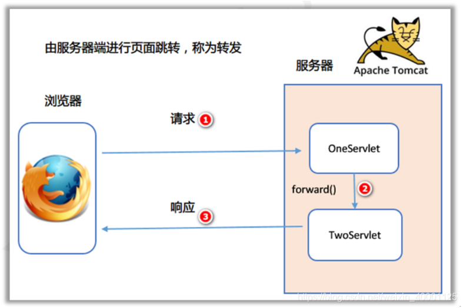

（2）重定向：

step1：客户端首先发送一个请求到服务器

step2：服务器首先找到并执行servlet组件

step3：在servlet中向客户端发送一个响应，这个响应是另外一个服务器端的页面或servlet地址

step4：客户端接收到这个重定向地址后，又向服务器发送了第二次请求

step5：如果前面步骤的重定向地址是一个servlet地址，那么会首先执行这个servlet然后再给客户端发送一个响应

如果重定向的页面是一个html或者jsp页面的话，那么会直接解析这个页面的内容作为发送给客户端的响应

整个过程至少是两个请求两个响应

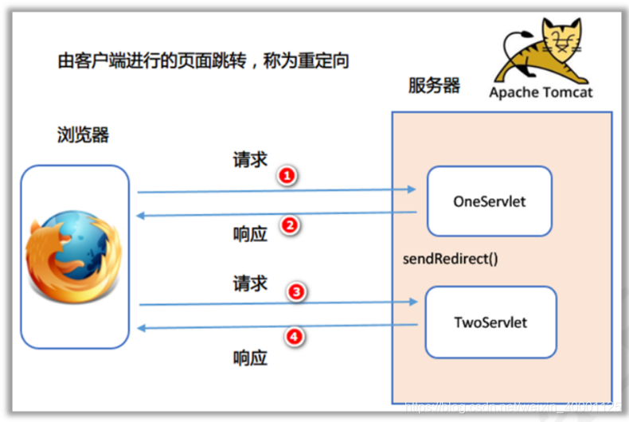

**总结：**

1、**转发是在服务器端完成、重定向是在客户端完成**

2、转发的速度快、重定向的速度慢

3、转发是一次请求、重定向是至少两次请求

4、转发浏览器的地址栏没有变化、重定向浏览器的地址栏发生了变化

5、转发必须是在同一台服务器下完成、重定向可以在不同的服务器之间重新定向

**什么时候使用转发，什么时候使用重定向？**

如果要保留请求域中的数据，使用转发，否则使用重定向。

以后访问数据库，**增删改使用重定向，查询使用转发。**


#### CDN(Content Delivery Network)

内容分发网络，通过各地部署的多套cache的静态镜像服务节点，通过空间来换取时间。用户向源站域名发起请求时，请求会被调度至最接近用户的服务节点，直接由服务节点直接快速响应，有效降低用户访问延迟，提升可用性。

未使用CDN的请求流程图

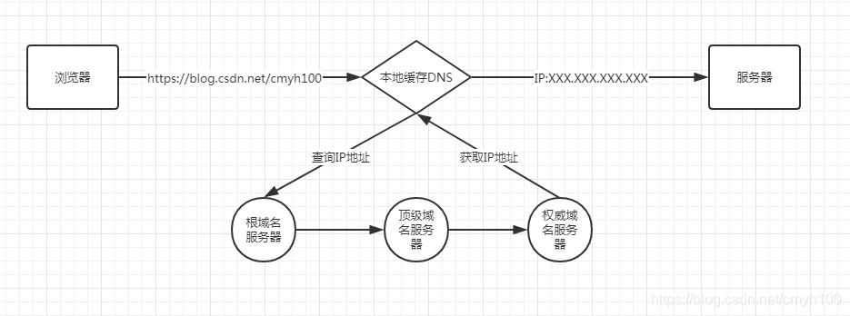

使用CDN的请求流程图

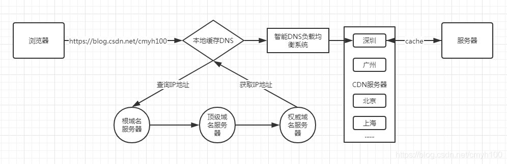

使用CDN访问： 用户发送请求->智能DNS的解析（根据IP判断地理位置、接入网类型、选择路由最短和负载最轻的服务器）->取得缓存服务器IP->把内容返回给用户（如果缓存中有）->向源站发起请求->将结果返回给用户->将结果存入缓存服务器。

**优势**

1.本地Cache加速，提高了企业站点（尤其h含有大量图片和静态页面站点）的访问速度；

2.跨运营商的网络加速，保证不同网络的用户都得到良好的访问质量；

3.远程访问用户根据DNS负载均衡技术智能自动选择Cache服务器；

4.自动生成服务器的远程Mirror（镜像）cache服务器，远程用户访问时从cache服务器上读取数据，减少远程访问的带宽、分担网络流量、减轻原站点web服务器负载等功能；

5.广泛分布的CDN节点加上节点之间的智能冗余机制，可以有效地预防黑客入侵。


#### Token

Token 是在服务端产生的。如果前端使用用户名/密码向服务端请求认证，服务端认证成功，那么在服务端会返回 Token 给前端。前端可以在每次请求的时候带上 Token 证明自己的合法地位。

**作用：**

1. Token 完全由应用管理，所以它可以避开同源策略
2. Token 可以避免 CSRF 攻击(http://dwz.cn/7joLzx)
3. Token 可以是无状态的，可以在多个服务间共享

**Token有效期**

对于这个问题，我们不妨先看两个例子。一个例子是登录密码，一般要求定期改变密码，以防止泄漏，所以密码是有有效期的；另一个例子是安全证书。SSL 安全证书都有有效期，目的是为了解决吊销的问题，对于这个问题的详细情况，来看看知乎的回答(http://dwz.cn/7joMhq)。所以无论是从安全的角度考虑，还是从吊销的角度考虑，Token 都需要设有效期。

为了解决在操作过程不能让用户感到 Token 失效这个问题，有一种方案是在服务器端保存 Token 状态，用户每次操作都会自动刷新（推迟） Token 的过期时间——Session 就是采用这种策略来保持用户登录状态的。然而仍然存在这样一个问题，在前后端分离、单页 App 这些情况下，每秒种可能发起很多次请求，每次都去刷新过期时间会产生非常大的代价。如果 Token 的过期时间被持久化到数据库或文件，代价就更大了。所以通常为了提升效率，减少消耗，会把 Token 的过期时保存在缓存或者内存中。

还有另一种方案，使用 Refresh Token，它可以避免频繁的读写操作。这种方案中，服务端不需要刷新 Token 的过期时间，一旦 Token 过期，就反馈给前端，前端使用 Refresh Token 申请一个全新 Token 继续使用。这种方案中，服务端只需要在客户端请求更新 Token 的时候对 Refresh Token 的有效性进行一次检查，大大减少了更新有效期的操作，也就避免了频繁读写。当然 Refresh Token 也是有有效期的，但是这个有效期就可以长一点了，比如，以天为单位的时间。

**时序图表示**

1）登录


2）业务请求

 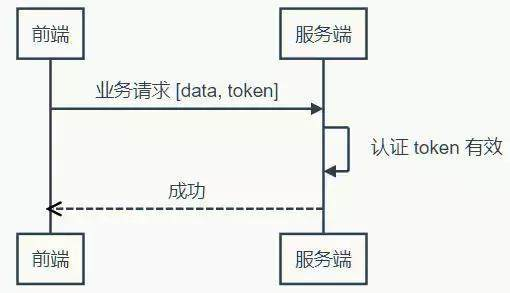

3）Token 过期，刷新 Token

 

上面的时序图中并未提到 Refresh Token 过期怎么办。不过很显然，Refresh Token 既然已经过期，就该要求用户重新登录了。

当然还可以把这个机制设计得更复杂一些，比如，Refresh Token 每次使用的时候，都更新它的过期时间，直到与它的创建时间相比，已经超过了非常长的一段时间（比如三个月），这等于是在相当长一段时间内允许 Refresh Token 自动续期。


#### **浏览器内核**

IE: Trident

safari: WebKit

Chrome:  WebKit

Opera: Blink

Firefox: Gecko


#### **前端怎么解决跨域**

1、 通过jsonp跨域

2、 document.domain + iframe跨域

3、 location.hash + iframe

4、 window.name + iframe跨域

5、 postMessage跨域

6、 跨域资源共享（CORS）

7、 nginx代理跨域

8、 nodejs中间件代理跨域

9、 WebSocket协议跨域


#### 浏览器缓存

1、http缓存是基于HTTP协议的浏览器文件级缓存机制。
2、websql这种方式只有较新的chrome浏览器支持，并以一个独立规范形式出现
3、indexDB 是一个为了能够在客户端存储可观数量的结构化数据，并且在这些数据上使用索引进行高性能检索的 API
4、Cookie一般网站为了辨别用户身份、进行session跟踪而储存在用户本地终端上的数据（通常经过加密）
5、Localstorage是html5的一种新的本地缓存方案，目前用的比较多，一般用来存储ajax返回的数据，加快下次页面打开时的渲染速度
6、Sessionstorage和localstorage类似，但是浏览器关闭则会全部删除，api和localstorage相同，实际项目中使用较少。
7、application cache 是将大部分图片资源、js、css等静态资源放在manifest文件配置中
8、cacheStorage是在ServiceWorker的规范中定义的，可以保存每个serverWorker申明的cache对象
9、flash缓存 这种方式基本不用，这一方法主要基于flash有读写浏览器端本地目录的功能

#### cookie

##### cookie字段

name字段为一个cookie的名称。

value字段为一个cookie的值。

domain字段为可以访问此cookie的域名。

非顶级域名，如二级域名或者三级域名，设置的cookie的domain只能为顶级域名或者二级域名或者三级域名本身，不能设置其他二级域名的cookie，否则cookie无法生成。

顶级域名只能设置domain为顶级域名，不能设置为二级域名或者三级域名，否则cookie无法生成。

二级域名能读取设置了domain为顶级域名或者自身的cookie，不能读取其他二级域名domain的cookie。所以要想cookie在多个二级域名中共享，需要设置domain为顶级域名，这样就可以在所有二级域名里面或者到这个cookie的值了。
顶级域名只能获取到domain设置为顶级域名的cookie，其他domain设置为二级域名的无法获取。

path字段为可以访问此cookie的页面路径。 比如domain是abc.com,path是/test，那么只有/test路径下的页面可以读取此cookie。

expires/Max-Age 字段为此cookie超时时间。若设置其值为一个时间，那么当到达此时间后，此cookie失效。不设置的话默认值是Session，意思是cookie会和session一起失效。当浏览器关闭(不是浏览器标签页，而是整个浏览器) 后，此cookie失效。

Size字段 此cookie大小。

http字段  cookie的httponly属性。若此属性为true，则只有在http请求头中会带有此cookie的信息，而不能通过document.cookie来访问此cookie。

secure 字段 设置是否只能通过https来传递此条cookie

##### cookie编码方式

encodeURI（）


#### cookie与session区别

cookie和session都是用来跟踪浏览器用户身份的会话方式。
**1、保持状态**

cookie保存在浏览器端，session保存在服务器端

**2、使用方式**
（1）cookie机制：如果不在浏览器中设置过期时间，cookie被保存在内存中，生命周期随浏览器的关闭而结束，这种cookie简称会话cookie。如果在浏览器中设置了cookie的过期时间，cookie被保存在硬盘中，关闭浏览器后，cookie数据仍然存在，直到过期时间结束才消失。
cookie是服务器发给客户端的特殊信息，cookie是以文本的方式保存在客户端，每次请求时都带上它。
（2）session机制：当服务器收到请求需要创建session对象时，首先会检查客户端请求中是否包含sessionid。如果有sessionid，服务器将根据该id返回对应session对象。如果客户端请求中没有sessionid，服务器会创建新的session对象，并把sessionid在本次响应中返回给客户端。通常使用cookie方式存储sessionid到客户端，在交互中浏览器按照规则将sessionid发送给服务器。如果用户禁用cookie，则要使用URL重写，可以通过response.encodeURL(url) 进行实现；API对encodeURL的结束为，当浏览器支持Cookie时，url不做任何处理；当浏览器不支持Cookie的时候，将会重写URL将SessionID拼接到访问地址后。

**3、存储内容**

cookie只能保存字符串类型，以文本的方式；

session通过类似与Hashtable的数据结构来保存，能支持任何类型的对象(session中可含有多个对象)

**4、存储的大小**

cookie：单个cookie保存的数据不能超过4kb，很多浏览器都限制一个站点最多保存20个cookie。；

session大小没有限制。

**5、安全性**

cookie：针对cookie所存在的攻击：Cookie欺骗，Cookie截获；

session的安全性大于cookie。

原因如下：

（1）sessionID存储在cookie中，若要攻破session首先要攻破cookie；
（2）sessionID是要有人登录，或者启动session_start才会有，所以攻破cookie也不一定能得到sessionID；
（3）第二次启动session_start后，前一次的sessionID就是失效了，session过期后，sessionID也随之失效。
（4）sessionID是加密的
（5）综上所述，攻击者必须在短时间内攻破加密的sessionID，这很难。

**6、应用场景**
cookie：

（1）判断用户是否登陆过网站，以便下次登录时能够实现自动登录（或者记住密码）。如果我们删除cookie，则每次登录必须从新填写登录的相关信息。
（2）保存上次登录的时间等信息。
（3）保存上次查看的页面
（4）浏览计数
session：Session用于保存每个用户的专用信息，变量的值保存在服务器端，通过SessionID来区分不同的客户。
（1）网上商城中的购物车
（2）保存用户登录信息
（3）将某些数据放入session中，供同一用户的不同页面使用
（4）防止用户非法登录

**7、缺点**
cookie：
（1）大小受限
（2）用户可以操作（禁用）cookie，使功能受限
（3）安全性较低
（4）有些状态不可能保存在客户端。
（5）每次访问都要传送cookie给服务器，浪费带宽。
（6）cookie数据有路径（path）的概念，可以限制cookie只属于某个路径下。

session：
（1）Session保存的东西越多，就越占用服务器内存，对于用户在线人数较多的网站，服务器的内存压力会比较大。
（2）依赖于cookie（sessionID保存在cookie），如果禁用cookie，则要使用URL重写，不安全
（3）创建Session变量有很大的随意性，可随时调用，不需要开发者做精确地处理，所以，过度使用session变量将会导致代码不可读而且不好维护。


#### WebStorage

HTML5中与本地存储相关的两个重要内容：Web Storage与本地数据库。其中，Web Storage存储机制是对HTML4中cookie存储机制的一个改善。由于cookie存储机制有很多缺点，HTML5不再使用它，转而使用改良后的Web Storage存储机制。本地数据库是HTML5中新增的一个功能，使用它可以在客户端本地建立一个数据库，原本必须保存在服务器端数据库中的内容现在可以直接保存在客户端本地了，这大大减轻了服务器端的负担，同时也加快了访问数据的速度。

Web Storage分为两种：
 1.sessionStorage：将数据保存在session对象中。所谓session，是指用户在浏览某个网站时，从进入网站到浏览器关闭所经过的这段时间，也就是用户浏览这个网站所花费的时间。session对象可以用来保存在这段时间内所要求保存的任何数据。

2.localStorage：将数据保存在客户端本地的硬件设备(通常指硬盘，也可以是其他硬件设备)中，即使浏览器被关闭了，该数据仍然存在，下次打开浏览器访问网站时仍然可以继续使用。

这两者的区别在于，sessionStorage为临时保存，而localStorage为永久保存。

到目前为止，Firefox3.6以上、Chrome6以上、Safari 5以上、Pera10.50以上、IE8以上版本的浏览器支持sessionStorage与localStorage的使用。

对比：
1.生命周期：localStorage:localStorage的生命周期是永久的，关闭页面或浏览器之后localStorage中的数据也不会消失。localStorage除非主动删除数据，否则数据永远不会消失。
sessionStorage的生命周期是在仅在当前会话下有效。sessionStorage引入了一个“浏览器窗口”的概念，sessionStorage是在同源的窗口中始终存在的数据。只要这个浏览器窗口没有关闭，即使刷新页面或者进入同源另一个页面，数据依然存在。但是sessionStorage在关闭了浏览器窗口后就会被销毁。同时独立的打开同一个窗口同一个页面，sessionStorage也是不一样的。

2.存储大小：localStorage和sessionStorage的存储数据大小一般都是：5MB。

3.存储位置：localStorage和sessionStorage都保存在客户端，不与服务器进行交互通信。

4.存储内容类型：localStorage和sessionStorage只能存储字符串类型，对于复杂的对象可以使用ECMAScript提供的JSON对象的stringify和parse来处理。

5.获取方式：localStorage：window.localStorage; sessionStorage：window.sessionStorage。

6.应用场景：localStoragese：常用于长期登录（+判断用户是否已登录），适合长期保存在本地的数据。sessionStorage：敏感账号一次性登录；


#### Cookie、sessionStorage、localStorage的区别

共同点：都是保存在浏览器端，并且是同源的

Cookie：cookie数据始终在同源的http请求中携带（即使不需要），即cookie在浏览器和服务器间来回传递。而sessionStorage和localStorage不会自动把数据发给服务器，仅在本地保存。cookie数据还有路径（path）的概念，可以限制cookie只属于某个路径下,存储的大小很小只有4K左右。 （key：可以在浏览器和服务器端来回传递，存储容量小，只有大约4K左右）

sessionStorage：仅在当前浏览器窗口关闭前有效，自然也就不可能持久保持，localStorage：始终有效，窗口或浏览器关闭也一直保存，因此用作持久数据；cookie只在设置的cookie过期时间之前一直有效，即使窗口或浏览器关闭。（key：本身就是一个会话过程，关闭浏览器后消失，session为一个会话，当页面不同即使是同一页面打开两次，也被视为同一次会话）

localStorage：localStorage 在所有同源窗口中都是共享的；cookie也是在所有同源窗口中都是共享的。（key：同源窗口都会共享，并且不会失效，不管窗口或者浏览器关闭与否都会始终生效）

补充说明一下cookie的作用：

保存用户登录状态。例如将用户id存储于一个cookie内，这样当用户下次访问该页面时就不需要重新登录了，现在很多论坛和社区都提供这样的功能。 cookie还可以设置过期时间，当超过时间期限后，cookie就会自动消失。因此，系统往往可以提示用户保持登录状态的时间：常见选项有一个月、三个 月、一年等。

跟踪用户行为。例如一个天气预报网站，能够根据用户选择的地区显示当地的天气情况。如果每次都需要选择所在地是烦琐的，当利用了cookie后就会显得很人性化了，系统能够记住上一次访问的地区，当下次再打开该页面时，它就会自动显示上次用户所在地区的天气情况。因为一切都是在后 台完成，所以这样的页面就像为某个用户所定制的一样，使用起来非常方便定制页面。如果网站提供了换肤或更换布局的功能，那么可以使用cookie来记录用户的选项，例如：背景色、分辨率等。当用户下次访问时，仍然可以保存上一次访问的界面风格。


#### 离线缓存技术

离线存储可以将站点的一些文件存储在本地，它是浏览器自己的一种机制，将需要的文件缓存下来

在没有网络的时候可以访问到缓存的对应的站点页面，包括html，js，css，img等等文件
在有网络的时候，浏览器也会优先使用已离线存储的文件，返回一个200（from cache）头。这跟HTTP的缓存使用策略是不同的。
资源的缓存可以带来更好的用户体验，当用户使用自己的流量上网时，本地缓存不仅可以提高用户访问速度，而且大大节约用户的使用流量。

HTML5的离线存储是基于一个新建的.appcache文件的缓存机制(不是存储技术)，通过这个文件上的解析清单离线存储资源；把需要离线存储在本地的文件列在一个manifest配置文件中。

Manifest（清单）是一个简单的文本文件，它的扩展名是任意的，定义需要缓存的文件、资源，当第一次打开时，浏览器会自动缓存相应的资源。

```html
<!DOCTYPE HTML>
<html manifest="demo.appcache">
    ...
</html>
```

Manifest 的特点：
离线浏览：即当网络断开时，可以继续访问你的页面。
访问速度快：将文件缓存到本地，不需每次都从网络上请求。
稳定性：做了Manifest缓存，遇到突发网络故障或者服务器故障，继续访问本地缓存。

一旦应用被缓存，它就会保持缓存直到发生下列情况：

- 用户清空浏览器缓存
- manifest 文件被修改（参阅下面的提示）
- 由程序来更新应用缓存

manifest 文件是简单的文本文件，它告知浏览器被缓存的内容（以及不缓存的内容）。

manifest 文件可分为三个部分：

- CACHE MANIFEST - 在此标题下列出的文件将在首次下载后进行缓存。
- NETWORK - 在此标题下列出的文件需要与服务器的连接，且不会被缓存。
- FALLBACK - 在此标题下列出的文件规定当页面无法访问时的回退页面（比如 404 页面）。

```js
//无论用户何时与因特网断开连接，这些资源依然是可用的
CACHE MANIFEST
# 2012-02-21 v1.0.0
/theme.css
/logo.gif
/main.js

//下面的 NETWORK 小节规定文件 "login.php" 永远不会被缓存，且离线时是不可用的
NETWORK:
login.php

//第一个 URI 是资源，第二个是替补
FALLBACK:
/html/ /offline.html
```


#### **渐进增强与优雅降级**

```
渐进增强（Progressive Enhancement）：一开始就针对低版本浏览器进行构建页面，完成基本的功能，然后再针对高级浏览器进行效果、交互、追加功能达到更好的体验。

优雅降级（Graceful Degradation）：一开始就构建站点的完整功能，然后针对浏览器测试和修复。比如一开始使用 CSS3 的特性构建了一个应用，然后逐步针对各大浏览器进行 hack 使其可以在低版本浏览器上正常浏览。

其实渐进增强和优雅降级并非什么新概念，只是旧的概念换了一个新的说法。在传统软件开发中，经常会提到向上兼容和向下兼容的概念。渐进增强相当于向上兼容，而优雅降级相当于向下兼容。向下兼容指的是高版本支持低版本的或者说后期开发的版本支持和兼容早期开发的版本，向上兼容的很少。大多数软件都是向下兼容的，比如说Office2010能打开Office2007，Office2006，Office2005，Office2003等建的word文件，但是用Office2003就不能打开用Office2007，Office2010等建的word文件！

如何选择？
根据你的用户所使用的客户端的版本来做决定。请注意我的措辞，我没有用浏览器，而是用客户端。因为渐进增强和优雅降级的概念本质上是软件开发过程中低版本软件与高版本软件面对新功能的兼容抉择问题。服务端程序很少存在这种问题，因为开发者可以控制服务端运行程序的版本，就无所谓渐进增强和优雅降级的问题。但是客户端程序则不是开发者所能控制的（你总不能强制用户去升级它们的浏览器吧）。我们所谓的客户端，可以指浏览器，移动终端设备（如：手机，平板电脑，智能手表等）以及它们对应的应用程序（浏览器对应的是网站，移动终端设备对应的是相应的APP）。

现在有很成熟的技术，能够让你分析使用你客户端程序的版本比例。如果低版本用户居多，当然优先采用渐进增强的开发流程；如果高版本用户居多，为了提高大多数用户的使用体验，那当然优先采用优雅降级的开发流程。
然而事实情况是怎么样的呢？绝大多数的大公司都是采用渐进增强的方式，因为业务优先，提升用户体验永远不会排在最前面。例如：新浪微博网站前端的更新，拥有这种亿级用户的网站，绝对不可能追求某个特效而不考虑低版本用户可不可用，一定是确保低版本到高版本的可访问性，再去渐进增强，采用新功能给高版本用户提供更好的用户体验。但也不是没有反例。如果你开发的是一款面向青少年的软件（或网站），你知道这个群体的人总是喜欢尝试新事物，总是喜欢酷炫的特效，总是喜欢把它们的软件更新到最新版本（而不像我们老一辈的用户）。面对这种情况，渐进增强的开发流程实为上选。
```


#### BS与CS 的联系与区别

C/S是Client/Serve(客户机/服务器)r的缩写。服务器通常采用高性能的PC、工作站或小型机，并采用大型数据库系统，如Oracle、Sybase、Informix或 SQL Server。客户端需要安装专用的客户端软件。

B/Ｓ是Brower/Server（浏览器/服务器）的缩写，客户机上只要安装一个浏览器（Browser），如Netscape Navigator或Internet Explorer，服务器安装Oracle、Sybase、Informix或 SQL Server等数据库。在这种结构下，用户界面完全通过WWW浏览器实现，一部分事务逻辑在前端实现，但是主要事务逻辑在服务器端实现。浏览器通过WebServer 同数据库进行数据交互。是随着Internet技术的兴起，对C/S结构的一种变化或者改进的结构。

**C/S 与 B/S 区别：**

**1．硬件环境不同:**

C/S 一般建立在专用的网络上, 小范围里的网络环境, 局域网之间再通过专门服务器提供连接和数据交换服务。

B/S 建立在广域网之上的, 不必是专门的网络硬件环境,例与电话上网，租用设备。信息自己管理. 有比C/S更强的适应范围, 一般只要有操作系统和浏览器就行。

**２．对安全要求不同**

C/S 一般面向相对固定的用户群, 对信息安全的控制能力很强。 一般高度机密的信息系统采用C/S 结构适宜。可以通过B/S发布部分可公开信息。

B/S 建立在广域网之上, 对安全的控制能力相对弱, 可能面向不可知的用户。

**３．对程序架构不同**

C/S 程序可以更加注重流程，可以对权限多层次校验，对系统运行速度可以较少考虑。

B/S 对安全以及访问速度的多重的考虑，建立在需要更加优化的基础之上。 比C/S有更高的要求 B/S结构的程序架构是发展的趋势，从MS的.Net系列的BizTalk 2000 Exchange 2000等，全面支持网络的构件搭建的系统。SUN 和IBM推的JavaBean 构件技术等,使B/S更加成熟。

**４．软件重用不同**

C/S 程序可以不可避免的整体性考虑， 构件的重用性不如在B/S要求下的构件的重用性好。

B/S 对的多重结构，要求构件相对独立的功能。能够相对较好的重用。就入买来的餐桌可以再利用,而不是做在墙上的石头桌子。

**５．系统维护不同**

C/S 程序由于整体性，必须整体考察，处理出现的问题以及系统升级。 升级难。可能是再做一个全新的系统。

B/S 构件组成,方面构件个别的更换，实现系统的无缝升级。系统维护开销减到最小。用户从网上自己下载安装就可以实现升级。

**６．处理问题不同**

C/S 程序可以处理用户面固定，并且在相同区域, 安全要求高需求， 与操作系统相关。 应该都是相同的系统。

B/S 建立在广域网上，面向不同的用户群，分散地域, 这是C/S无法作到的。 与操作系统平台关系最小。

**７．用户接口不同**

C/S 多是建立的Window平台上,表现方法有限，对程序员普遍要求较高。

B/S 建立在浏览器上, 有更加丰富和生动的表现方式与用户交流。并且大部分难度减低,减低开发成本。

**８．信息流不同**

C/S 程序一般是典型的中央集权的机械式处理，交互性相对低。

B/S 信息流向可变化，B-B B-C B-G等信息、流向的变化，更像交易中心。


#### Web Quality（无障碍）

**定义：**能够被残障人士使用的网站才能称得上一个易用的（易访问的）网站。

**Web Accessibility Initiative - WAI**

WAI （由 W3C 在1997年发起）是一系列计划供 web 开发者、创作者以及设计者使用的指导方针 - 关于如何使内容对残障人士更易用。

这些指导方针的目标是易用性（accessibility），但是也有助于使 web 内容可用于更多的浏览器（语音浏览器、移动电话、手持设备），以及更多工作于困难环境的用户（非手持式的、强光、黑暗、弱视、噪音等）。

**优化：**

**1.使用可调节的字体大小**

请使用相对的字体尺寸，这样用户就能够使用浏览器菜单来改变默认的字体尺寸。可以在您的浏览器菜单选择"查看 - 文字大小"来 要改变字体大小。

**2.使用 "alt" 属性**

alt 属性允许你为图像（也可以为其它的元素）提供一条相对应的文字。

实例:

```text

```

有时候浏览器会无法显示图像。具体的原因有：

- 用户关闭了图像显示
- 浏览器是不支持图形显示的迷你浏览器
- 浏览器是语音浏览器（供盲人和弱视人群使用）

如果您使用了 alt 属性，那么浏览器至少可以显示或读出有关图像的描述。


#### fetch为什么发送2次请求

fetch发送post请求的时候，总是发送2次，第一次状态码是204，第二次才成功？

当发生跨域请求时，fetch会先发送一个OPTIONS请求，来确认服务器是否允许接受请求。服务器同意后，才会发送真正的请求。


#### XSS攻击与CSRF攻击

**XSS（Cross Site Scripting，原本应当是css，但为了和层叠样式表（Cascading Style Sheet,CSS ）有所区分，故称XSS）：**跨站脚本攻击，是说攻击者通过注入恶意的脚本，在用户浏览网页的时候进行攻击，比如获取cookie，或者其他用户身份信息，可以分为存储型和反射型，存储型是攻击者输入一些数据并且存储到了数据库中，其他浏览者看到的时候进行攻击，反射型的话不存储在数据库中，往往表现为将攻击代码放在url地址的请求参数中

**解决方法：**

对输入(和URL参数)进行过滤，对输出进行编码。也就是对提交的所有内容进行过滤，对url中的参数进行过滤，过滤掉会导致脚本执行的相关内容；然后对动态输出到页面的内容进行html编码，使脚本无法在浏览器中执行。虽然对输入过滤可以被绕过，但是也还是会拦截很大一部分的XSS攻击。

**CSRF(Cross Site Request Forgery)：**跨站请求伪造，简单地说，是攻击者通过一些技术手段欺骗用户的浏览器去访问一个自己曾经认证过的网站并运行一些操作（如发邮件，发消息，甚至财产操作如转账和购买商品）。由于浏览器曾经认证过，所以被访问的网站会认为是真正的用户操作而去运行。这利用了web中用户身份验证的一个漏洞：**简单的身份验证只能保证请求发自某个用户的浏览器，却不能保证请求本身是用户自愿发出的**。


**解决方法：**

1.验证 HTTP Referer 字段；Referer 指的是页面请求来源。意思是，只接受本站的请求，服务器才做响应；如果不是，就拦截。

2.在请求地址中添加 token 并验证；

3.在 HTTP 头中自定义属性并验证。如把 token 隐藏在 http 的 head头中。


#### RESTFUL

**概括：**就是用**URL定位资源，用HTTP描述操作**

RESTful架构，就是目前最流行的一种互联网软件架构。它结构清晰、符合标准、易于理解、扩展方便，所以正得到越来越多网站的采用。

如果一个架构符合REST原则，就称它为RESTful架构。

```
资源：
所谓"资源"，就是网络上的一个实体，或者说是网络上的一个具体信息。它可以是一段文本、一张图片、一首歌曲、一种服务，总之就是一个具体的实在。你可以用一个URI（统一资源定位符）指向它，每种资源对应一个特定的URI。要获取这个资源，访问它的URI就可以，因此URI就成了每一个资源的地址或独一无二的识别符。

表现层：
我们把"资源"具体呈现出来的形式，叫做它的"表现层"（Representation）。

状态转化：
如果客户端想要操作服务器，必须通过某种手段，让服务器端发生"状态转化"（State Transfer）。而这种转化是建立在表现层之上的，所以就是"表现层状态转化"。
客户端用到的手段，只能是HTTP协议。具体来说，就是HTTP协议里面，四个表示操作方式的动词：GET、POST、PUT、DELETE。它们分别对应四种基本操作：GET用来获取资源，POST用来新建资源（也可以用于更新资源），PUT用来更新资源，DELETE用来删除资源。
```

**RESTful架构：**

（1）每一个URI代表一种资源；

（2）客户端和服务器之间，传递这种资源的某种表现层；

（3）客户端通过四个HTTP动词，对服务器端资源进行操作，实现"表现层状态转化"。

**常见设计错误：**

1.最常见的一种设计错误，就是URI包含动词。举例来说，某个URI是/posts/show/1，其中show是动词，这个URI就设计错了，正确的写法应该是/posts/1，然后用GET方法表示show。

2.另一个设计误区，就是在URI中加入版本号：

> 　　http://www.example.com/app/1.0/foo
> 
> 　　http://www.example.com/app/1.1/foo
> 
> 　　http://www.example.com/app/2.0/foo

因为不同的版本，可以理解成同一种资源的不同表现形式，所以应该采用同一个URI。版本号可以在HTTP请求头信息的Accept字段中进行区分：

> 　　Accept: vnd.example-com.foo+json; version=1.0
> 
> 　　Accept: vnd.example-com.foo+json; version=1.1
> 
> 　　Accept: vnd.example-com.foo+json; version=2.0


#### 强缓存与协商缓存

##### **强缓存**

到底什么是强缓存？强在哪？其实强是强制的意思。当浏览器去请求某个文件的时候，服务端就在respone header里面对该文件做了缓存配置。缓存的时间、缓存类型都由服务端控制，具体表现为：

**缓存中header的参数：**

Expires：response header里的过期时间，浏览器再次加载资源时，如果在这个过期时间内，则使用强缓存。

cache-control，常见的设置是max-age public private no-cache no-store等

**如果cache-control与expires同时存在的话，cache-control的优先级高于expires。**Cache-Control和Expires的区别在于Cache-Control使用相对时间，Expires使用的是基于服务器端的绝对时间，因为存在时差问题或者客户端和服务端有一方的时间不准确，一般采用Cache-Control。

如下图,
设置了**cache-control:max-age=31536000,public,immutable**

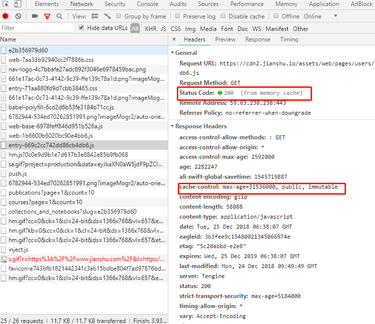

max-age表示缓存的时间是31536000秒（1年），public表示可以被浏览器和代理服务器缓存，代理服务器一般可用nginx来做。immutable表示该资源永远不变，但是实际上该资源并不是永远不变，它这么设置的意思是为了让用户在刷新页面的时候不要去请求服务器！啥意思？就是说，如果你只设置了cahe-control:max-age=31536000,public  这属于强缓存，每次用户正常打开这个页面，浏览器会判断缓存是否过期，没有过期就从缓存中读取数据；但是有一些 "聪明" 的用户会点击浏览器左上角的刷新按钮去刷新页面，这时候就算资源没有过期（1年没这么快过），浏览器也会直接去请求服务器，这就是额外的请求消耗了，这时候就相当于是走协商缓存的流程了（下面会讲到）。如果cahe-control:max-age=315360000,public再加个immutable的话，就算用户刷新页面，浏览器也不会发起请求去服务，浏览器会直接从本地磁盘或者内存中读取缓存并返回200状态，看上图的红色框（from memory cache）。这是2015年facebook团队向制定 HTTP 标准的 IETF 工作组提到的建议：他们希望 HTTP 协议能给 Cache-Control 响应头增加一个属性字段表明该资源永不过期，浏览器就没必要再为这些资源发送条件请求了。

**强缓存总结：**

1、cache-control: max-age=xxxx，public
 客户端和代理服务器都可以缓存该资源；
 客户端在xxx秒的有效期内，如果有请求该资源的需求的话就直接读取缓存,statu code:200 ，如果用户做了刷新操作，就向服务器发起http请求

2、cache-control: max-age=xxxx，private
 只让客户端可以缓存该资源；代理服务器不缓存
 客户端在xxx秒内直接读取缓存,statu code:200

3、cache-control: max-age=xxxx，immutable
 客户端在xxx秒的有效期内，如果有请求该资源的需求的话就直接读取缓存,statu code:200 ，即使用户做了刷新操作，也不向服务器发起http请求

4、cache-control: no-cache
 跳过设置强缓存，但是不妨碍设置协商缓存；一般如果你做了强缓存，只有在强缓存失效了才走协商缓存的，设置了no-cache就不会走强缓存了，每次请求都回询问服务端。

5、cache-control: no-store
 不缓存，这个会让客户端、服务器都不缓存，也就没有所谓的强缓存、协商缓存了。

##### 协商缓存

上面说到的强缓存就是给资源设置个过期时间，客户端每次请求资源时都会看是否过期；只有在过期才会去询问服务器。所以，强缓存就是为了给客户端自给自足用的。而当某天，客户端请求该资源时发现其过期了，这时就会去请求服务器了，而这时候去请求服务器的这过程就可以设置协商缓存。这时候，协商缓存就是需要客户端和服务器两端进行交互的。

**怎么设置协商缓存？**

response header里面的设置:

```bash
etag: '5c20abbd-e2e8'
last-modified: Mon, 24 Dec 2018 09:49:49 GMT
```

etag：每个文件有一个，改动文件了就变了，就是个文件hash，每个文件唯一，就像用webpack打包的时候，每个资源都会有这个东西，如： app.js打包后变为 app.c20abbde.js，加个唯一hash，也是为了解决缓存问题。last-modified：文件的修改时间，精确到秒。

也就是说，每次请求返回来 response header 中的 etag和 last-modified，在下次请求时在 request header 就把这两个带上，服务端把你带过来的标识进行对比，然后判断资源是否更改了，如果更改就直接返回新的资源，和更新对应的response header的标识etag、last-modified。如果资源没有变，那就不变etag、last-modified，这时候对客户端来说，每次请求都是要进行协商缓存了，即：

发请求-->看资源是否过期-->过期-->请求服务器-->服务器对比资源是否真的过期-->没过期-->返回304状态码-->客户端用缓存的老资源。这就是一条完整的协商缓存的过程。

当然，当服务端发现资源真的过期的时候，会走如下流程：

发请求-->看资源是否过期-->过期-->请求服务器-->服务器对比资源是否真的过期-->过期-->返回200状态码-->客户端如第一次接收该资源一样，记下它的cache-control中的max-age、etag、last-modified等。

所以协商缓存步骤总结：

请求资源时，把用户本地该资源的 etag 同时带到服务端，服务端和最新资源做对比。如果资源没更改，返回304，浏览器读取本地缓存。 如果资源有更改，返回200，返回最新的资源。

补充一点，response header中的etag、last-modified在客户端重新向服务端发起请求时，会在request header中换个key名：

```csharp
// response header
etag: '5c20abbd-e2e8'
last-modified: Mon, 24 Dec 2018 09:49:49 GMT

// request header 变为
if-none-matched: '5c20abbd-e2e8'
if-modified-since: Mon, 24 Dec 2018 09:49:49 GMT
```

**为什么要有etag？**
 你可能会觉得使用last-modified已经足以让浏览器知道本地的缓存副本是否足够新，为什么还需要etag呢？HTTP1.1中etag的出现（也就是说，etag是新增的，为了解决之前只有If-Modified的缺点）主要是为了解决几个last-modified比较难解决的问题：

1. 一些文件也许会周期性的更改，但是他的内容并不改变(仅仅改变的修改时间)，这个时候我们并不希望客户端认为这个文件被修改了，而重新get；
2. 某些文件修改非常频繁，比如在秒以下的时间内进行修改，(比方说1s内修改了N次)，if-modified-since能检查到的粒度是秒级的，这种修改无法判断(或者说UNIX记录MTIME只能精确到秒)；
3. 某些服务器不能精确的得到文件的最后修改时间。

**ETag和Last-Modified的作用和用法，他们的区别：**

1.Etag要优于Last-Modified。Last-Modified的时间单位是秒，如果某个文件在1秒内改变了多次，那么他们的Last-Modified其实并没有体现出来修改，但是Etag每次都会改变确保了精度；

2.在性能上，

毕竟Last-Modified只需要记录时间，而Etag需要服务器通过算法来计算出一个hash值；

3.在优先级上，服务器校验优先考虑Etag。

##### **怎么设置强缓存与协商缓存**

1. 后端服务器如nodejs:
    res.setHeader('max-age': '3600 public')
    res.setHeader(etag: '5c20abbd-e2e8')
    res.setHeader('last-modified': Mon, 24 Dec 2018 09:49:49 GMT)

2. nginx配置
   
   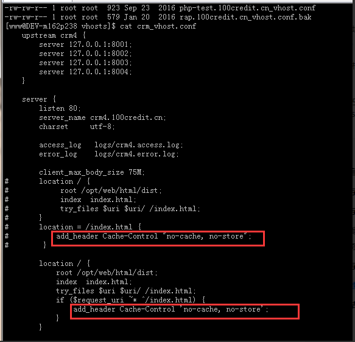

##### **浏览器缓存过程**

1.浏览器第一次加载资源，服务器返回200，浏览器将资源文件从服务器上请求下载下来，并把response header及该请求的返回时间一并缓存；

2.下一次加载资源时，先比较当前时间和上一次返回200时的时间差，如果没有超过cache-control设置的max-age，则没有过期，命中强缓存，不发请求直接从本地缓存读取该文件（如果浏览器不支持HTTP1.1，则用expires判断是否过期）；如果时间过期，则向服务器发送header带有If-None-Match和If-Modified-Since的请求；

3.服务器收到请求后，优先根据Etag的值判断被请求的文件有没有做修改，Etag值一致则没有修改，命中协商缓存，返回304；如果不一致则有改动，直接返回新的资源文件带上新的Etag值并返回200；；

4.如果服务器收到的请求没有Etag值，则将If-Modified-Since和被请求文件的最后修改时间做比对，一致则命中协商缓存，返回304；不一致则返回新的last-modified和文件并返回200。


#### URL到页面呈现的过程

**概述过程：**

１.输入地址，DNS解析，获取相应的域名和web服务器的IP地址；

２.与web服务器建立TCP链接;

3.浏览器向web服务器发送HTTP请求;

4.服务器响应请求,并发送对应的数据;

5.浏览器下载数据,并解析源文件,渲染页面,呈现页面

6.关闭TCP链接（TCP连接是无状态的，也就是一次性的，不会永久保存这个状态，所以双方完成一次数据的传输之后，如果没有持续的请求，那就要释放连接）

**详细过程：**输入url后，首先需要找到这个url域名的服务器ip,为了寻找这个ip，浏览器首先会寻找缓存，查看缓存中是否有记录，缓存的查找记录为：浏览器缓存-》系统缓存-》路由器缓存，缓存中没有则查找系统的hosts文件中是否有记录，如果没有则查询DNS服务器，得到服务器的ip地址后，浏览器根据这个ip以及相应的端口号，构造一个http请求，这个请求报文会包括这次请求的信息，主要是请求方法，请求说明和请求附带的数据，并将这个http请求封装在一个tcp包中，这个tcp包会依次经过传输层，网络层，数据链路层，物理层到达服务器，服务器解析这个请求来作出响应，返回相应的html给浏览器，因为html是一个树形结构，浏览器根据这个html来构建DOM树，在dom树的构建过程中如果遇到JS脚本和外部JS连接，则会停止构建DOM树来执行和下载相应的代码，这会造成阻塞，这就是为什么推荐JS代码应该放在html代码的后面，之后根据外部央视，内部央视，内联样式构建一个CSS对象模型树CSSOM树，构建完成后和DOM树合并为渲染树，这里主要做的是排除非视觉节点，比如script，meta标签和排除display为none的节点，之后进行布局，布局主要是确定各个元素的位置和尺寸，之后是渲染页面，因为html文件中会含有图片，视频，音频等资源，在解析DOM的过程中，遇到这些都会进行并行下载，浏览器对每个域的并行下载数量有一定的限制，一般是4-6个，当然在这些所有的请求中我们还需要关注的就是缓存，缓存一般通过Cache-Control、Last-Modify、Expires等首部字段控制。 Cache-Control和Expires的区别在于Cache-Control使用相对时间，Expires使用的是基于服务器端的绝对时间，因为存在时差问题，一般采用Cache-Control，在请求这些有设置了缓存的数据时，会先查看是否过期，如果没有过期则直接使用本地缓存，过期则请求并在服务器校验文件是否修改，如果上一次响应设置了ETag值会在这次请求的时候作为If-None-Match的值交给服务器校验，如果一致，继续校验 Last-Modified，没有设置ETag则直接验证Last-Modified，再决定是否返回304。


#### DNS解析

1、在浏览器中输入[www.qq.com](http://www.qq.com/)域名，操作系统会先检查自己本地的hosts文件是否有这个网址映射关系，如果有，就先调用这个IP地址映射，完成域名解析。

2、如果hosts里没有这个域名的映射，则查找本地DNS解析器缓存，是否有这个网址映射关系，如果有，直接返回，完成域名解析。

3、如果hosts与本地DNS解析器缓存都没有相应的网址映射关系，首先会找TCP/ip参数中设置的首选DNS服务器，在此我们叫它本地DNS服务器，此服务器收到查询时，如果要查询的域名，包含在本地配置区域资源中，则返回解析结果给客户机，完成域名解析，此解析具有权威性。

4、如果要查询的域名，不由本地DNS服务器区域解析，但该服务器已缓存了此网址映射关系，则调用这个IP地址映射，完成域名解析，此解析不具有权威性。

5、如果本地DNS服务器本地区域文件与缓存解析都失效，则根据本地DNS服务器的设置（是否设置转发器）进行查询，如果未用转发模式，本地DNS就把请求发至13台根DNS，根DNS服务器收到请求后会判断这个域名(.com)是谁来授权管理，并会返回一个负责该顶级域名服务器的一个IP。本地DNS服务器收到IP信息后，将会联系负责.com域的这台服务器。这台负责.com域的服务器收到请求后，如果自己无法解析，它就会找一个管理.com域的下一级DNS服务器地址(qq.com)给本地DNS服务器。当本地DNS服务器收到这个地址后，就会找qq.com域服务器，重复上面的动作，进行查询，直至找到[www.qq.com](http://www.qq.com/)主机。

6、如果用的是转发模式，此DNS服务器就会把请求转发至上一级DNS服务器，由上一级服务器进行解析，上一级服务器如果不能解析，或找根DNS或把转请求转至上上级，以此循环。不管是本地DNS服务器用是是转发，还是根提示，最后都是把结果返回给本地DNS服务器，由此DNS服务器再返回给客户机。

从客户端到本地DNS服务器是属于递归查询，而DNS服务器之间就是的交互查询就是迭代查询。


#### **打开谷歌的四个进程**

```
因为打开1个页面：至少需要1个网络进程，1个浏览器进程，1个GPU进程以及1个渲染进程。
```
