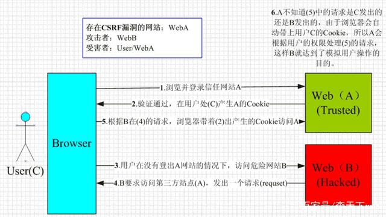

计算机网络

#### 七层架构


**每一层的作用**：

.png)

**（1）应用层**

`OSI`参考模型中最靠近用户的一层，是为计算机用户提供应用接口，也为用户直接提供各种网络服务。我们常见应用层的网络服务协议有：**`HTTP`，`HTTPS`，`FTP`，`POP3`、`SMTP`**等。

- 在客户端与服务器中经常会有数据的请求，这个时候就是会用到`http(hyper text transfer protocol)(超文本传输协议)`或者`https`.在后端设计数据接口时，我们常常使用到这个协议。
- `FTP`是文件传输协议，在开发过程中，个人并没有涉及到，但是我想，在一些资源网站，比如`百度网盘``迅雷`应该是基于此协议的。
- `SMTP`是`simple mail transfer protocol（简单邮件传输协议）`。在一个项目中，在用户邮箱验证码登录的功能时，使用到了这个协议。

**（2）表示层**

表示层提供各种用于应用层数据的编码和转换功能,确保一个系统的应用层发送的数据能被另一个系统的应用层识别。如果必要，该层可提供一种标准表示形式，用于将计算机内部的多种数据格式转换成通信中采用的标准表示形式。数据压缩和加密也是表示层可提供的转换功能之一。

在项目开发中，为了方便数据传输，可以使用`base64`对数据进行编解码。如果按功能来划分，**`base64`应该是工作在表示层**。

**（3）会话层**

会话层就是负责建立、管理和终止表示层实体之间的通信会话。该层的通信由不同设备中的应用程序之间的服务请求和响应组成。

**（4）传输层**

传输层建立了主机端到端的链接，传输层的作用是为上层协议提供端到端的可靠和透明的数据传输服务，包括处理差错控制和流量控制等问题。该层向高层屏蔽了下层数据通信的细节，使高层用户看到的只是在两个传输实体间的一条主机到主机的、可由用户控制和设定的、可靠的数据通路。我们通常说的，`TCP` `UDP`就是在这一层。端口号既是这里的“端”。

**（5）网络层**

本层通过`IP`寻址来建立两个节点之间的连接，为源端的运输层送来的分组，选择合适的路由和交换节点，正确无误地按照地址传送给目的端的运输层。就是通常说的`IP`层。这一层就是我们经常说的`IP`协议层。`IP`协议是`Internet`的基础。我们可以这样理解，**网络层规定了数据包的传输路线，而传输层则规定了数据包的传输方式**。

**（6）数据链路层**

将比特组合成字节,再将字节组合成帧,使用链路层地址 (以太网使用MAC地址)来访问介质,并进行差错检测。 网络层与数据链路层的对比，通过上面的描述，我们或许可以这样理解，**网络层是规划了数据包的传输路线，而数据链路层就是传输路线**。不过，在数据链路层上还增加了差错控制的功能。

**（7）物理层**

实际最终信号的传输是通过物理层实现的。通过物理介质传输比特流。规定了电平、速度和电缆针脚。常用设备有（各种物理设备）集线器、中继器、调制解调器、网线、双绞线、同轴电缆。这些都是物理层的传输介质。

**OSI七层模型通信特点：对等通信** 对等通信，为了使数据分组从源传送到目的地，源端OSI模型的每一层都必须与目的端的对等层进行通信，这种通信方式称为对等层通信。在每一层通信过程中，使用本层自己协议进行通信。

在每一层都工作着不同的设备：


在每一层实现的协议也各不同，即每一层的服务也不同，下图列出了每层主要的传输协议：


#### ICMP

它是TCP/IP协议族的一个子协议，用于在IP主机、路由器之间传递控制消息。控制消息是指网络通不通、主机是否可达、路由是否可用等网络本身的消息。这些控制消息虽然并不传输用户数据，但是对于用户数据的传递起着重要的作用。


#### Http

http: 超文本传输协议，基于TCP/IP通信协议来传递数据（HTML 文件, 图片文件, 查询结果等），是一个属于应用层的面向对象的协议，是一个客户端和服务器端请求和应答的标准（TCP），用于从WWW服务器传输超文本到本地浏览器的传输协议，它可以使浏览器更加高效，使网络传输减少。浏览器作为HTTP客户端通过URL向HTTP服务端即WEB服务器发送所有请求。Web服务器根据接收到的请求后，向客户端发送响应信息。

##### 请求报文

------

一个HTTP请求报文由**请求行（request line）**、**请求头**（**header**）、**请求数据**和**空行**4个部分组成，下图给出了请求报文的一般格式。


**请求行**：
请求行由**请求方法字段**、**URL字段**和**HTTP协议版本字段**3个字段组成，它们用空格分隔。

例如：GET /index.html HTTP/1.1。

get方法将数据拼接在url后面，传递参数受限。

**请求头(key value形式)**

- User-Agent：产生请求的浏览器类型；

- Accept：浏览器可以接收的数据类型；

- Accept-Language/Charset/Encoding：表示可以接受的字符集/语言/编码；

- Connection：处理完这次请求后是否断开连接还是继续保持连接； 

- Host：浏览器发送请求，用来指定服务器的域名（这也是HTTP1.0和1.1的主要区别）；

- Cookie：客户端通过这个字段可以向服务器带数据，通常包含用户信息。

**空行:**
    发送回车符和换行符，**通知服务器请求头数据发送完毕**。

**请求数据:**
    post方法中，会把数据以key value形式发送请求。

​    GET方式的请求一般不包含”请求数据”部分，请求数据以地址的形式表现在请求行。

##### 响应报文

------

HTTP响应也由四个部分组成，分别是：状态行、响应头、响应正文和空行。

**状态行：**

状态行格式如下：HTTP-Version   Status-Code  Reason-Phrase

      协议版本 状态码 状态码描述

例如： HTTP/1.1 200 OK

**响应头（见面试题header中包含的字段）：**

响应头用于描述服务器的基本信息，以及数据的描述，服务器通过这些数据的描述信息，可以通知客户端如何处理等一会儿它回送的数据。

- Server：告诉浏览器服务器的类型，如apache
- Date：日期+时间（格林威治时间）
- Content-Length：内容长度
- Content-Type: 内容类型

**空行:**
    发送回车符和换行符，**通知客户端响应头数据发送完毕**。

**响应正文**

.png)

##### 长连接和短连接

------

（1）短连接

在HTTP/1.0中，默认使用的是短连接。也就是说，浏览器和服务器每进行一次HTTP操作，就建立一次连接，但任务结束就中断连接。一般都是client先发起close操作。

短连接的优点是：管理起来比较简单，存在的连接都是有用的连接，不需要额外的控制手段。

（2）长连接

从 HTTP/1.1起，默认使用长连接，用以保持连接特性。使用长连接的HTTP协议，会在请求头/响应头中加入： `Connection：keep-alive` 

模拟一下长连接的情况，client向server发起连接，server接受client连接，双方建立连接。Client与server完成一次读写之后，它们之间的连接并不会主动关闭，后续的读写操作会继续使用这个连接。

##### **HTTP协议与TCP/IP协议的关系**

------

HTTP的长连接和短连接本质上是TCP长连接和短连接。HTTP属于应用层协议，在传输层使用TCP协议，在网络层使用IP协议。IP协议主要解决网络路由和寻址问题，TCP协议主要解决如何在IP层之上可靠的传递数据包，使在网络上的另一端收到发端发出的所有包，并且顺序与发出顺序一致。TCP有可靠，面向连接的特点。

##### **如何理解HTTP协议是无状态的**

HTTP协议是无状态的，指的是**协议对于事务处理没有记忆能力**，服务器不知道客户端是什么状态。也就是说，**打开一个服务器上的网页和你之前打开这个服务器上的网页之间没有任何联系**。

缺少状态意味着如果后续处理需要前面的信息，则它必须重传，这样可能会导致每次连接传送的数据量增大。另一方面，在服务器不需要先前信息时它的应答就比较快。


##### Http工作流程（七步）

建立TCP连接->发送请求行->发送请求头->（到达服务器）发送状态行->发送响应头->发送响应数据->断TCP连接

**1、*建立TCP连接***

在HTTP工作开始之前，Web浏览器首先要通过网络与Web服务器建立连接，该连接是通过TCP来完成的，该协议与IP协议共同构建 Internet，即著名的TCP/IP协议族，因此Internet又被称作是TCP/IP网络。HTTP是比TCP更高层次的应用层协议，根据规则， 只有低层协议建立之后才能，才能进行更高层协议的连接，因此，首先要建立TCP连接，一般TCP连接的端口号是80。

**2、浏览器向Web服务器发送请求行**

一旦建立了TCP连接，客户端就会向Web服务器发送请求命令。

**3、浏览器发送请求头**

浏览器发送其请求命令之后，还要以头信息的形式向Web服务器发送一些别的信息，之后浏览器发送了一空白行来通知服务器，它已经结束了头信息的发送。

**4. 服务器应答** 

客户端向服务器发出请求后，服务器会向客户端发送状态行信息， 如：HTTP/1.1 200 OK 。

**5. 服务器发送响应头**

正如客户端会随同请求发送关于自身的信息一样，服务器也会随同应答向用户发送关于它自己的数据及被请求的文档。

**6. 服务器向浏览器发送数据** 

Web服务器向浏览器发送头信息后，它会发送一个空白行来表示头信息的发送到此为结束，接着，它就以Content-Type应答头信息所描述的格式发送用户所请求的实际数据。

**7. 服务器关闭TCP连接** 

一般情况下，一旦服务器向浏览器发送了请求数据，它就要关闭TCP连接，然后如果浏览器或者服务器在其头信息加入了这行代码：

```
Connection:keep-alive 
```

TCP连接在发送后将仍然保持打开状态，于是，浏览器可以继续通过相同的连接发送请求。保持连接，节省了为每个请求建立新连接所需的时间，还节约了网络带宽。


##### http1.1和1.0的区别（6点）

**缓存处理**，在HTTP1.0中主要使用header里的If-Modified-Since,Expires来做为缓存判断的标准，HTTP1.1则引入了更多的缓存控制策略例如Entity tag，If-Unmodified-Since, If-Match, If-None-Match等更多可供选择的缓存头来控制缓存策略。

**带宽优化及网络连接的使用**，HTTP1.0中，存在一些浪费带宽的现象，例如客户端只是需要某个对象的一部分，而服务器却将整个对象送过来了，并且不支持断点续传功能，HTTP1.1则在请求头引入了range头域，它允许只请求资源的某个部分，即返回码是206（Partial Content），这样就方便了开发者自由的选择以便于充分利用带宽和连接。

**错误通知的管理**，在HTTP1.1中新增了24个错误状态响应码，如409（Conflict）表示请求的资源与资源的当前状态发生冲突；410（Gone）表示服务器上的某个资源被永久性的删除。

**Host头处理**，在HTTP1.0中认为每台服务器都绑定一个唯一的IP地址，因此，请求消息中的URL并没有传递主机名（hostname）。但随着虚拟主机技术的发展，在一台物理服务器上可以存在多个虚拟主机（Multi-homed Web Servers），并且它们共享一个IP地址。HTTP1.1的请求消息和响应消息都应支持Host头域，且请求消息中如果没有Host头域会报告一个错误（400 Bad Request）。

**长连接**，HTTP 1.1支持长连接（PersistentConnection）和请求的流水线（Pipelining）处理，在一个TCP连接上可以传送多个HTTP请求和响应，减少了建立和关闭连接的消耗和延迟，在HTTP1.1中**默认开启Connection： keep-alive**，一定程度上弥补了HTTP1.0每次请求都要创建连接的缺点。如果需要关闭，需要客户端发送Connection：close首部字段。

**请求方法**，http1.1 相对于 http1.0 还新增了很多**请求方法**，如 PUT、HEAD、OPTIONS 等。

##### Keep-Alive

Keep-Alive的**建立过程**：

- 客户端向服务器在发送请求报文同时在首部添加发送Connection字段
- 服务器收到请求并处理 Connection字段
- 服务器回送Connection:Keep-Alive字段给客户端
- 客户端接收到Connection字段
- Keep-Alive连接建立成功

**服务端自动断开过程（也就是没有keep-alive）**：

- 客户端向服务器只是发送内容报文（不包含Connection字段）
- 服务器收到请求并处理
- 服务器返回客户端请求的资源并关闭连接
- 客户端接收资源，发现没有Connection字段，断开连接

**客户端请求断开连接过程**：

- 客户端向服务器发送Connection: close字段
- 服务器收到请求并处理connection字段
- 服务器回送响应资源并断开连接
- 客户端接收资源并断开连接

开启Keep-Alive的**优点：**

- 较少的CPU和内存的使⽤（由于同时打开的连接的减少了）；
- 允许请求和应答的HTTP管线化；
- 降低拥塞控制 （TCP连接减少了）；
- 减少了后续请求的延迟（⽆需再进⾏握⼿）；
- 报告错误⽆需关闭TCP连；

开启Keep-Alive的**缺点**：

- 长时间的TCP连接容易导致系统资源无效占用，浪费系统资源。


#### Https

https: 是以安全为目标的HTTP通道，简单讲是HTTP的安全版，即HTTP下加入SSL层，HTTPS的安全基础是SSL，因此加密的详细内容就需要SSL。

https协议的主要作用是：建立一个信息安全通道，来确保数组的传输，确保网站的真实性。


##### Https工作流程

1. 用户在浏览器发起HTTPS请求（如 https://www.mogu.com/），默认使用服务端的443端口进行连接；

2. 服务端收到请求后，回应客户端并**返回含有公钥pub的证书**，而私钥**private**不公开保存在服务端；

3. 客户端收到证书后，会对证书验证。主要包括：是否在有效期内、证书的域名与请求的域名是否匹配，上一级证书是否有效（递归判断，直到判断到系统内置或浏览器配置好的根证书），如果不通过，则显示HTTPS警告信息，如果通过，则客户端会生成对称密钥key，并使用公钥pub对其加密。

4. 密钥交换：客户端会将加密后的密钥key发送给服务器，服务器在接收到key后会用私钥进行解密；

5. 服务端收到**随机密钥Key**的密文，使用与**公钥Pub**配对的**私钥Private**进行解密，得到客户端真正想发送的**随机密钥Key**；

6. 数据传输：经过以上流程客户端与服务端完成了密钥交换，之后进行数据传输过程中，双方就可以基于**对称加密**的方式进行数据传输，保证了网络数据传输的安全性。
   
   .png)


##### 客户端验证CA证书真实性——数字签名

CA机构中的私钥除了**解密**外的真正用途其实还有一个，就是**数字签名**，其实就是一种防伪技术，只要有人篡改了证书，那么数字签名必然校验失败。具体过程如下

1. CA机构拥有自己的一对公钥和私钥
2. CA机构在颁发证书时对证书**明文信息进行哈希**
3. 将哈希值用私钥进行**加签**，得到数字签名

**明文数据和数字签名组成证书，传递给客户端。**

1. 客户端得到证书，分解成明文部分Text和数字签名Sig1
2. 用CA机构的公钥进行**解签**，得到Sig2（由于CA机构是一种公信身份，因此在系统或浏览器中会内置CA机构的证书和公钥信息）
3. 用证书里声明的哈希算法对明文Text部分进行哈希，得到H
4. 当自己计算得到的哈希值H与**解签**后的Sig2**相等**，表示证书可信，**没有被篡改**

.png)


##### http和https的区别

http传输的数据都是未加密的，也就是明文的，网景公司设置了SSL（安全套接层，1999年改名为TSL（传输层安全））协议来对http协议传输的数据进行加密处理，简单来说https协议是由http和ssl协议构建的可进行加密传输和身份认证的网络协议，比http协议的安全性更高。

.png)

主要的区别如下：
HTTPS协议需要ca证书，费用较高。

HTTP是超文本传输协议，信息是明文传输，HTTPS则是具有安全性的SSL加密传输协议。

使用不同的链接方式，端口也不同，一般而言，HTTP协议的端口为80，HTTPS的端口为443。

HTTP的连接很简单，是无状态的；HTTPS协议是由SSL+HTTP协议构建的可进行加密传输、身份认证的网络协议，比HTTP协议安全。

**https协议的优点**

使用HTTPS协议可认证用户和服务器，确保数据发送到正确的客户机和服务器；

HTTPS协议是由SSL+HTTP协议构建的可进行加密传输、身份认证的网络协议，要比http协议安全，可防止数据在传输过程中不被窃取、改变，确保数据的完整性。

HTTPS是现行架构下最安全的解决方案，虽然不是绝对安全，但它大幅增加了中间人攻击的成本。

谷歌曾在2014年8月份调整搜索引擎算法，并称“比起同等HTTP网站，采用HTTPS加密的网站在搜索结果中的排名将会更高”。

**https协议的缺点**

https握手阶段比较费时，会使页面加载时间延长50%，增加10%~20%的耗电。

https缓存不如http高效，会增加数据开销。

SSL证书也需要钱，功能越强大的证书费用越高。

SSL证书需要绑定IP，不能再同一个ip上绑定多个域名，ipv4资源支持不了这种消耗。


#### POST与GET的区别（9点）

1.最直观的区别就是GET把参数包含在URL中，POST通过request body传递参数。

2.POST更安全（不会作为url的一部分，不会被缓存、保存在服务器日志、以及浏览器浏览记录中）。

3.POST发送的数据量更大（GET有URL长度限制(1024字节），对GET请求参数的长度限制是因为浏览器有所限制，和GET、POST没有基本没有关系）。

```
IE对URL长度的限制是2083字节(2K+35)。由于IE浏览器对URL长度的允许值是最小的，所以开发过程中，只要URL不超过2083字节，那么在所有浏览器中工作都不会有问题。
```

4.GET的速度比POST要快。因为GET和POST的请求过程不同，不过前三步都是一样的，都是要先经过和服务器的三次握手：①浏览器请求tcp连接（第一次握手）；②服务器答应进行TCP连接（第二次握手）；③浏览器确认，并发送GET请求头和数据（第三次握手，这个报文比较小，所以HTTP会在此时进行第一次数据发送）。GET请求在第四步就会接收到了服务器返回的数据，而POST请求在第四步是接收到服务器发送的100 continue指令，客户端再发送数据请求服务端，服务端才会去返回数据，就是说POST比GET多进行了一次客户端和服务器的打交道，GET请求产生了一个TCP数据包，而POST请求产生了两个TCP数据包。

5.POST能发送更多的数据类型（GET只能发送ASCII字符）。

6.GET请求类似于查找的过程，用户获取数据，可以不用每次都与数据库连接，所以可以使用缓存。POST不同，POST做的一般是修改和删除的工作，所以必须与数据库交互，所以不能使用缓存。因此GET请求适合于请求缓存。

7.GET在浏览器回退时是无害的，而POST会再次提交请求。

8.GET是幂等的，而POST不是幂等的。所谓幂等是指多个请求返回相同的结果。实际上，相应的服务器方法可能会以某种方式修改状态，所以一般情况下这是不成立的，这只是一种标准。

用于获取资源，不应有副作用，所以GET是幂等的。比如：GET http://www.mimvp.com/account/123456，不会改变资源的状态，不论调用一次还是N次都没有副作用。请注意，**这里强调的是一次和N次具有相同的副作用，而不是每次GET的结果相同**。GET http://www.mimvp.com/latest-news这个HTTP请求可能会每次得到不同的结果，但它本身并没有产生任何副作用，因而是满足幂等性的。

9.GET产生的URL地址可以被Bookmark，而POST不可以。

HTTP的底层是TCP/IP。所以GET和POST的底层也是TCP/IP，也就是说，GET/POST都是TCP链接。GET和POST能做的事情是一样一样的。你要给GET加上request body，给POST带上URL参数，技术上是完全行的通的。


#### HTTP2.0

**HTTP1.x有以下几个主要缺点：**

1. HTTP/1.0一次只允许在一个TCP连接上发起一个请求；HTTP/1.1使用的流水线技术也只能部分处理请求并发，仍然会存在队列头阻塞问题，因此客户端在需要发起多次请求时，通常会采用建立多连接来减少延迟。HTTP/1.1新增了Host字段，1.0没有Host。
2. 单向请求，只能由客户端发起。
3. 请求报文与响应报文首部信息冗余量大。
4. 数据未压缩，导致数据的传输量大

**简要概括：**http2.0是基于1999年发布的http1.0之后的首次更新。

**HTTP2.0优点（6点）：**

**1.二进制分帧**

HTTP2.0会将所有的传输信息分割为更小的消息（比帧大的通讯单位）或者帧（HTTP2.0通信的最小单位），并对他们进行二进制编码。HTTP2.0中所有加强性能的核心是二进制传输，在HTTP1.x中，我们是通过文本的方式传输数据。基于文本的方式传输数据存在很多缺陷，文本的表现形式有多样性，因此要做到健壮性考虑的场景必然有很多，但是二进制则不同，只有0和1的组合，因此选择了二进制传输，实现方便且健壮。

HTTP/2 是一个二进制协议。在 HTTP/1.1 版中，报文的头信息必须是文本（ASCII 编码），数据体可以是文本，也可以是二进制。HTTP/2 则是一个彻底的二进制协议，头信息和数据体都是二进制，并且统称为"帧"，可以分为头信息帧和数据帧。 帧的概念是它实现多路复用的基础。

**2.允许多路复用**

多路复用允许同时通过单一的HTTP/2连接发送多重请求-响应信息。改善了：在http1.1中，浏览器客户端在同一时间，针对同一域名下的请求有一定数量限制（连接数量），超过限制会被阻塞。

HTTP2.0中,基于二进制分帧层，HTTP2.0可以在共享TCP连接的基础上同时发送请求和响应。HTTP消息被分解为独立的帧，而不破坏消息本身的语义，交错发出去，在另一端根据流标识符和首部将他们重新组装起来。 通过该技术，可以避免HTTP旧版本的队头阻塞问题，极大提高传输性能。

```
队头阻塞是由 HTTP 基本的“请求 - 应答”模型所导致的。HTTP 规定报文必须是“一发一收”，这就形成了一个先进先出的“串行”队列。队列里的请求是没有优先级的，只有入队的先后顺序，排在最前面的请求会被最优先处理。如果队首的请求因为处理的太慢耽误了时间，那么队列里后面的所有请求也不得不跟着一起等待，结果就是其他的请求承担了不应有的时间成本，造成了队头堵塞的现象。

另一种说法：管道（pipeline）网络传输是指可以在同一个 TCP 连接里面，客户端可以发起多个请求，只要第一个请求发出去了，不必等其回来，就可以发第二个请求出去，可以减少整体的响应时间。但是服务器还是按照顺序回应请求。如果前面的回应特别慢，后面就会有许多请求排队等着。这称为队头堵塞。
```

**3.数据流** 

HTTP/2 使用了数据流的概念，因为 HTTP/2 的数据包是不按顺序发送的，同一个连接里面连续的数据包，可能属于不同的请求。因此，必须要对数据包做标记，指出它属于哪个请求。HTTP/2 将每个请求或回应的所有数据包，称为一个数据流。每个数据流都有一个独一无二的编号。数据包发送时，都必须标记数据流 ID ，用来区分它属于哪个数据流。

**4.首部压缩**

HTTP每次通讯（请求或响应）都会携带首部信息用于描述资源属性。

在HTTP1.0中，我们使用文本的形式传输header，在header中携带cookie的话，每次都需要重复传输几百到几千的字节，这着实是一笔不小的开销。

在HTTP2.0中，我们使用了HPACK（HTTP2头部压缩算法）压缩格式对传输的header进行编码，减少了header的大小。并在两端维护了索引表，用于记录出现过的header，后面在传输过程中就可以传输已经记录过的header的键名，对端收到数据后就可以通过键名找到对应的值。

 HTTP/2 实现了头信息压缩，由于 HTTP 1.1 协议不带状态，每次请求都必须附上所有信息。所以，请求的很多字段都是重复的，比如 Cookie 和 User Agent ，一模一样的内容，每次请求都必须附带，这会浪费很多带宽，也影响速度。HTTP/2 对这一点做了优化，引入了头信息压缩机制。一方面，头信息使用 gzip 或 compress 压缩后再发送；另一方面，客户端和服务器同时维护一张头信息表，所有字段都会存入这个表，生成一个索引号，以后就不发送同样字段了，只发送索引号，这样就能提高速度了。

**5.服务器端推送**

HTTP2.0新增的一个强大的新功能，就是服务器可以对一个客户端请求发送多个响应。服务器向客户端推送资源无需客户端明确的请求。

服务端根据客户端的请求，提前返回多个响应，推送额外的资源给客户端。如客户端请求stream 1(/page.html)。服务端在返回stream 1的消息的同时推送了stream 2(/script.js)和stream 4(/style.css)

服务端推送是一种在客户端请求之前发送数据的机制。在HTTP2.0中，服务器可以对一个客户端的请求发送多个响应。如果一个请求是由你的主页发送的，服务器可能会响应主页内容、logo以及样式表，因为他知道客户端会用到这些东西。这样不但减轻了数据传送冗余步骤，也加快了页面响应的速度，提高了用户体验。

推送的缺点：所有推送的资源都必须遵守同源策略。换句话说，服务器不能随便将第三方资源推送给客户端，而必须是经过双方的确认才行。

------

##### 头部压缩算法

HTTP2的头部压缩是HPACK算法。在客户端和服务器两端建立“字典”，用索引号表示重复的字符串，采用哈夫曼编码来压缩整数和字符串，可以达到50%~90%的高压缩率。

具体来说:

- 在客户端和服务器端使用“首部表”来跟踪和存储之前发送的键值对，对于相同的数据，不再通过每次请求和响应发送；
- 首部表在HTTP/2的连接存续期内始终存在，由客户端和服务器共同渐进地更新；
- 每个新的首部键值对要么被追加到当前表的末尾，要么替换表中之前的值。

例如下图中的两个请求， 请求一发送了所有的头部字段，第二个请求则只需要发送差异数据，这样可以减少冗余数据，降低开销。


#### HTTP3.0

HTTP/3基于UDP协议实现了类似于TCP的多路复用数据流、传输可靠性等功能，这套功能被称为QUIC协议。


1.流量控制、传输可靠性功能：**QUIC在UDP的基础上**增加了一层来保证数据传输可靠性，它提供了数据包重传、拥塞控制、以及其他一些TCP中的特性。

2.集成TLS加密功能：目前QUIC使用TLS1.3，减少了握手所花费的RTT数。

3.多路复用：同一物理连接上可以有多个独立的逻辑数据流，实现了数据流的单独传输，解决了TCP的队头阻塞问题。

4.快速握手：由于基于UDP，可以实现使用0~1个RTT来建立连接。


#### 加密方法

##### 对称加密：

概念：加密解密使用同一密钥。有AES算法。

加密解密过程：明文->密钥加密->密文；密文->密钥解密->明文。

优点：计算量小，加密速度快，加密效率高 。

缺点：双方使用相同的钥匙，安全性得不到保证。

注意事项：密钥的保密工作非常重要；密钥要求定期更换。

------

##### 非对称加密

非对称加密：加密解密使用不同的密钥，公钥会发送到网络中，私钥不公开。如RSA。

如果用公开密钥对数据进行加密，只有用对应的私有密钥才能解密。 
如果用私有密钥对数据进行加密，只有用对应的公开密钥才能解密。

对称加密效率高，安全性低；非对称加密效率低，安全性高。往往两者配合使用。

.png)

------

##### 数字签名

**非对称加密**

在通信双方，如果使用非对称加密，一般遵从这样的原则：公钥加密，私钥解密。同时，一般一个密钥加密，另一个密钥就可以解密。因为公钥是公开的，如果用来解密，那么就很容易被不必要的人解密消息。因此，私钥也可以认为是个人身份的证明。

如果通信双方需要互发消息，那么应该建立两套非对称加密的机制（即两对公私钥密钥对），发消息的一方使用对方的公钥进行加密，接收消息的一方使用自己的私钥解密。

**消息摘要**

消息摘要可以将消息哈希转换成一个固定长度的值唯一的字符串。值唯一的意思是不同的消息转换的摘要是不同的，并且能够确保唯一。该过程不可逆，即不能通过摘要反推明文（似乎SHA1已经可以被破解了，SHA2还没有。一般认为不可破解，或者破解需要耗费太多时间，性价比低）。

利用这一特性，可以验证消息的完整性。消息摘要通常用在数字签名中。

**数字签名**

假设现在有通信双方A和B，两者之间使用两套非对称加密机制。

现在A向B发消息。


那么，如果在发送过程中，有人修改了里面密文消息，B拿到的密文，解密之后得到明文，并非A所发送的，信息不正确。

要解决两个问题：1. A的身份认证 2. A发送的消息完整性 那么就要用到上面所讲的基础知识。

数字签名的过程如下图：


简单解释：

A：将明文进行摘要运算后得到摘要（消息完整性），再将摘要用A的私钥加密（身份认证），得到数字签名，将密文和数字签名一块发给B。

B：收到A的消息后，先将密文用自己的私钥解密，得到明文。将数字签名用A的公钥进行解密后，得到正确的摘要（解密成功说明A的身份被认证了）。

对明文进行摘要运算，得到实际收到的摘要，将两份摘要进行对比，如果一致，说明消息没有被篡改（消息完整性）。

疑问：摘要使用A的私钥加密，如果被拥有A的公钥的第三者截获，不就可以获取到摘要了么？会不会对安全造成威胁？

不会。因为摘要是不可逆推出原文的。

**数字证书**

理解了数字签名之后，数字证书就好理解了。由于网络上通信的双方可能都不认识对方，那么就需要第三者来介绍，这就是数字证书。数字证书由Certificate Authority( CA 认证中心)颁发。

非对称加密在解密过程中，消耗的时间远远超过对称加密。如果密文很长，那么效率就比较低下了。但密钥一般不会特别长，对对称加密的密钥的加解密可以提高效率。

------

##### 数字签名的作用

数字签名是维护数据信息安全的重要方法之一，可以解决**伪造、抵赖、冒充和篡改**等问题，数字签名的作用主要体现在以下几个方面：

1.数字签名可以实现防重放攻击。

重放攻击（Replay Attacks），是计算机世界黑客常用的攻击方式，是指攻击者发送一个目的主机已接收过的包，来达到欺骗系统的目的，主要用于身份认证过程，破坏认证的正确性。这种攻击会不断恶意或欺诈性地重复一个有效的数据传输。攻击者利用网络监听或者其他方式盗取认证凭据，之后再把它重新发给认证服务器。在数字签名中，如果采用了对签名报文加盖时戳等或添加流水号等技术，就可以有效防止重放攻击。

```
以登陆为例看具体的例子
常规流程
1.前端web页面用户输入账号、密码，点击登录。
2.请求提交之前，web端首先通过客户端脚本如javascript对密码原文进行md5加密。
3.提交账号、md5之后的密码
4.请求提交至后端，验证账号与密码是否与数据库中的一致，一致则认为登录成功，反之失败。

有什么问题呢？
上述流程看似安全，认为传输过程中的密码是md5之后的，即使被监听截取到，由于md5的不可逆性，密码明文也不会泄露。其实不然！监听者无需解密出密码明文即可登录！监听者只需将监听到的url（如：http://****/login.do?method=login&password=md5之后的密码&userid=登录账号）重放一下，即可冒充你的身份登录系统。
```

2.数字签名可以防止数据被伪造。

其他人不能伪造对消息的签名，因为私有密钥只有签名者自己知道，所以其他人不可以构造出正确的签名结果数据。

3.数字签名可以防止数据被篡改。

数字签名与原始文件或摘要一起发送给接收者，一旦信息被篡改，接收者可通过计算摘要和验证签名来判断该文件无效，从而保证了文件的完整性。

4.数字签名可以防止数据抵赖。

数字签名即可以作为身份认证的依据，也可以作为签名者签名操作的证据。要防止接收者抵赖，可以在数字签名系统中要求接收者返回一个自己签名的表示收到的报文，给发送者或受信任第三方。如果接收者不返回任何消息，此次通信可终止或重新开始，签名方也没有任何损失，由此双方均不可抵赖。

5.数字签名可以对数据进行多重加密。

手写签字的文件一旦丢失，文件信息就极可能泄露，但数字签名可以加密要签名的消息，在网络传输中，可以将报文用接收方的公钥加密，以保证信息机密性。

6.数字签名可以实现客户的身份认证。

在数字签名中，客户的公钥是其身份的标志，当使用私钥签名时，如果接收方或验证方用其公钥进行验证并获通过，那么可以肯定，签名人就是拥有私钥的那个人，因为私钥只有签名人知道。


#### TCP与UDP

##### TCP的三次握手

刚开始客户端处于 Closed 的状态，服务端处于 Listen 状态。

- 第一次握手：客户端给服务端发一个 SYN 报文，并指明客户端的初始化序列号 ISN，此时客户端处于 SYN_SEND 状态。

> 首部的同步位SYN=1，初始序号seq=x，SYN=1的报文段不能携带数据，但要消耗掉一个序号。

- 第二次握手：服务器收到客户端的 SYN 报文之后，会以自己的 SYN 报文作为应答，并且也是指定了自己的初始化序列号 ISN。同时会把客户端的 ISN + 1 作为ACK 的值，表示自己已经收到了客户端的 SYN，此时服务器处于 SYN_REVD 的状态。

> 在确认报文段中SYN=1，ACK=1，确认号ack=x+1，初始序号seq=y

- 第三次握手：客户端收到 SYN 报文之后，会发送一个 ACK 报文，当然，也是一样把服务器的 ISN + 1 作为 ACK 的值，表示已经收到了服务端的 SYN 报文，此时客户端处于 ESTABLISHED 状态。服务器收到 ACK 报文之后，也处于 ESTABLISHED 状态，此时，双方已建立起了连接。

> 确认报文段ACK=1，确认号ack=y+1，序号seq=x+1（初始为seq=x，第二个报文段所以要+1），ACK报文段可以携带数据，不携带数据则不消耗序号。


.png)

**为什么三次握手**

三次握手最主要的目的就是确认**双方收发都正常，从而建立起可靠的连接**。

第一次握手：客户端不能确认任何事，服务端可以确认对方发送正常，自己接收正常。

第二次握手：客户端可以确认自己发送正常、接收正常，对方发送、接收正常。服务端确认对方发送正常、接收正常。

第三次握手：客户端可以确认自己发送正常、接收正常，对方发送、接收正常。服务端确认自己发送、接收正常。

如果不进行第三次握手，其实服务端并不知道A是否收到。

**为什么不能用两次握手进行连接？**

答：3次握手完成两个重要的功能，既要双方做好发送数据的准备工作(双方都知道彼此已准备好)，也要允许双方就初始序列号进行协商，这个序列号在握手过程中被发送和确认。

现在把三次握手改成仅需要两次握手，死锁是可能发生的。作为例子，考虑计算机S和C之间的通信，假定C给S发送一个连接请求分组，S收到了这个分组，并发 送了确认应答分组。按照两次握手的协定，S认为连接已经成功地建立了，可以开始发送数据分组。可是，C在S的应答分组在传输中被丢失的情况下，将不知道S 是否已准备好，不知道S建立什么样的序列号，C甚至怀疑S是否收到自己的连接请求分组。在这种情况下，C认为连接还未建立成功，将忽略S发来的任何数据分组，只等待连接确认应答分组。而S在发出的分组超时后，重复发送同样的分组。这样就形成了死锁。

------

##### **TCP四次挥手**

1）客户端进程发出连接释放报文，并且停止发送数据。释放数据报文首部，FIN=1，其序列号为seq=u（等于前面已经传送过来的数据的最后一个字节的序号加1），此时，**客户端进入FIN-WAIT-1（终止等待1）状态**。 TCP规定，FIN报文段即使不携带数据，也要消耗一个序号。

2）服务器收到连接释放报文，发出确认报文，ACK=1，ack=u+1，并且带上自己的序列号seq=v，此时，**服务端就进入了CLOSE-WAIT（关闭等待）状态**。TCP服务器通知高层的应用进程，客户端向服务器的方向就释放了，这时候处于半关闭状态，即客户端已经没有数据要发送了，但是服务器若发送数据，客户端依然要接受。这个状态还要持续一段时间，也就是整个CLOSE-WAIT状态持续的时间。

3）客户端收到服务器的确认请求后，此时，**客户端就进入FIN-WAIT-2（终止等待2）状态**，等待服务器发送连接释放报文（在这之前还需要接受服务器发送的最后的数据）。

4）服务器将最后的数据发送完毕后，就向客户端发送连接释放报文，FIN=1，ack=u+1，由于在半关闭状态，服务器很可能又发送了一些数据，假定此时的序列号为seq=w，此时**，服务器就进入了LAST-ACK（最后确认）状态**，等待客户端的确认。

5）客户端收到服务器的连接释放报文后，必须发出确认，ACK=1，ack=w+1，而自己的序列号是seq=u+1，此时，**客户端就进入了TIME-WAIT（时间等待）状态**。注意此时TCP连接还没有释放，必须经过2MSL（最长报文段寿命）的时间后，当客户端撤销相应的TCB后，才进入**CLOSED状态**。

6）服务器只要收到了客户端发出的确认，立即**进入CLOSED状态**。同样，撤销TCB后，就结束了这次的TCP连接。可以看到，**服务器结束TCP连接的时间要比客户端早一些。**

.png)

**为什么连接的时候是三次握手，关闭的时候却是四次挥手？**

答：因为当Server端收到Client端的SYN连接请求报文后，可以直接发送SYN+ACK报文。其中ACK报文是用来应答的，SYN报文是用来同步的。但是关闭连接时，当Server端收到FIN报文时，很可能并不会立即关闭SOCKET，所以只能先回复一个ACK报文，告诉Client端，"你发的FIN报文我收到了"。只有等到我Server端所有的报文都发送完了，我才能发送FIN报文，因此不能一起发送。故需要四步挥手。

TCP 使用四次挥手的原因是因为 TCP 的连接是全双工的，所以需要双方分别释放到对方的连接，单独一方的连接释放，只代 表不能再向对方发送数据，连接处于的是半释放的状态。

**为什么TIME_WAIT状态需要经过2MSL(最大报文段生存时间)才能返回到CLOSE状态？**

答：虽然按道理，四个报文都发送完毕，我们可以直接进入CLOSE状态了，但是我们必须假象网络是不可靠的，有可以最后一个ACK丢失。所以TIME_WAIT状态就是用来重发可能丢失的ACK报文。在Client发送出最后的ACK回复，但该ACK可能丢失。Server如果没有收到ACK，将不断重复发送FIN片段。所以Client不能立即关闭，它必须确认Server接收到了该ACK。Client会在发送出ACK之后进入到TIME_WAIT状态。Client会设置一个计时器，等待2MSL的时间。如果在该时间内再次收到FIN，那么Client会重发ACK并再次等待2MSL。所谓的2MSL是两倍的MSL(Maximum Segment Lifetime)。MSL指一个片段在网络中最大的存活时间，2MSL就是一个发送和一个回复所需的最大时间。如果直到2MSL，Client都没有再次收到FIN，那么Client推断ACK已经被成功接收，则结束TCP连接。

------

##### TCP保活

TCP还设有一个保活计时器，显然，客户端如果出现故障，服务器不能一直等下去，白白浪费资源。服务器每收到一次客户端的请求后都会重新复位这个计时器，时间通常是设置为**2小时**，若两小时还没有收到客户端的任何数据，服务器就会发送一个探测报文段，以后每隔**75秒钟**发送一次。若一连发送**10个探测报文**仍然没反应，服务器就认为客户端出了故障，接着就关闭连接。

如果一个给定的连接在两小时内没有任何的动作，则服务器就向客户发一个探测报文段，客户主机必须处于以下4个状态之一：

1. 客户主机依然正常运行，并从服务器可达。客户的TCP响应正常，而服务器也知道对方是正常的，服务器在两小时后将保活定时器复位。
2. 客户主机已经崩溃，并且关闭或者正在重新启动。在任何一种情况下，客户的TCP都没有响应。服务端将不能收到对探测的响应，并在75秒后超时。服务器总共发送10个这样的探测 ，每个间隔75秒。如果服务器没有收到一个响应，它就认为客户主机已经关闭并终止连接。
3. 客户主机崩溃并已经重新启动。服务器将收到一个对其保活探测的响应，这个响应是一个复位，使得服务器终止这个连接。
4. 客户机正常运行，但是服务器不可达，这种情况与2类似，TCP能发现的就是没有收到探查的响应。

从上面可以看出，TCP保活功能主要为探测长连接的存活状况，不过这里存在一个问题，存活功能的探测周期太长，还有就是它只是探测TCP连接的存活，属于比较斯文的做法，遇到恶意的连接时，保活功能就不够使了。

在长连接的应用场景下，client端一般不会主动关闭它们之间的连接，Client与server之间的连接如果一直不关闭的话，会存在一个问题，随着客户端连接越来越多，server早晚有扛不住的时候，这时候server端需要采取一些策略，如关闭一些长时间没有读写事件发生的连接，这样可以避免一些恶意连接导致server端服务受损；如果条件再允许就可以以客户端机器为颗粒度，限制每个客户端的最大长连接数，这样可以完全避免某个蛋疼的客户端连累后端服务。

------

##### TCP可靠性（3点）

**（1）校验和：**

TCP报头中有对应的检验和字段，**发送的数据包**的二进制相加然后取反，**目的是检测数据在传输过程中的任何变化**。如果收到段的检验和有差错，TCP将丢弃这个报文段以及**不发送应答信号**。

**（2）超时重传：**

当发送端发出一个TCP报文后，会启动一个定时器，等待接收端确认收到这个报文段。如果**不能及时**收到一个确认，将重发这个报文段。

**（3）流量控制：**

一般来说，流量控制就是为了让发送方发送数据的速度不要太快，要让接收方来得及接收。TCP采用大小可变的**滑动窗口**进行流量控制，窗口大小的单位是字节。这里说的窗口大小其实就是每次传输的数据大小。

- 当一个连接建立时，连接的每一端分配一个缓冲区来保存输入的数据，并将缓冲区的大小发送给另一端。
- 当数据到达时，接收方发送确认，其中包含了自己剩余的缓冲区大小。（剩余的缓冲区空间的大小被称为窗口，指出窗口大小的通知称为窗口通告 。**接收方在发送的每一确认中都含有一个窗口通告**。）
- 如果接收方应用程序读数据的速度能够与数据到达的速度一样快，接收方将在每一确认中发送一个正的窗口通告。
- 如果发送方操作的速度快于接收方，接收到的数据最终将充满接收方的缓冲区，导致接收方通告一个零窗口 。发送方收到一个零窗口通告时，必须停止发送，直到接收方重新通告一个正的窗口。

------

TCP连接的双方都有固定大小的缓冲空间，接收端只允许发送端发送其缓冲区能接纳的数据。当接收方来不及处理发送方的数据，可以提示发送方降低发送的速率，防止包丢失。TCP利用滑动窗口机制实现流量控制。滑动窗口既提高了报文传输的效率，也避免了发送方发送过多的数据而导致接收方无法正常处理的异常。

利用**滑动窗口**机制可以很方便地在TCP连接上实现对发送方的流量控制。

- - TCP接收方利用自己的接收窗口的大小来限制**发送方发送窗口的大小**
  - TCP**发送方收到**接收方的**零窗口通知**后，应启动**持续计时器**。持续计时器超时后，向接收方发送**零窗口探测报文，**以确定接收方是否还有能力接收数据。

.png)

从上面的图可以看到滑动窗口左边的是已发送并且被确认的分组，滑动窗口右边是还没有轮到的分组。

滑动窗口里面也分为两块，一块是**已经发送但是未被确认的分组**，另一块是**窗口内等待发送的分组**。随着已发送的分组不断被确认，窗口内等待发送的分组也会不断被发送。整个窗口就会往右移动，让还没轮到的分组进入窗口内。

可以看到滑动窗口起到了一个**限流**的作用，也就是说当前滑动窗口的大小决定了当前 TCP 发送包的速率，而滑动窗口的大小取决于拥塞控制窗口和流量控制窗口的两者间的最小值。

**（4）拥塞控制：**

**当出现网络拥塞时，会减少数据的发送。**

实现拥塞控制四种算法：

**慢开始：**由小到大逐渐增大发送的拥塞窗口

在开始发送的时候设置cwnd = 1（cwnd指的是拥塞窗口）

思路：开始的时候不要发送大量数据，而是先测试一下网络的拥塞程度，由小到大增加拥塞窗口的大小。

为了防止cwnd增长过大引起网络拥塞，设置一个慢开始门限(ssthresh 状态变量)

- 当cnwd < ssthresh，使用慢开始算法
- 当cnwd = ssthresh，既可使用慢开始算法，也可以使用拥塞避免算法
- 当cnwd > ssthresh，使用拥塞避免算法


**拥塞避免：**当出现超时重传时，表示可能会出现网络拥塞，一旦出现拥塞，那么就会是ssthresh变为当前拥塞窗口的1/2，并将拥塞窗口从1开始。


**快重传：**所谓快重传就是使发送方**尽快进行重传**，**而不必等待超时重传计时器到期**。规定：

- 发送方一旦收到**3个连续的重复确认**，就将相应的报文段**立即重传**，而不是等该报文段的超时重传计时器超时再重传。

- 对于个别丢失的报文段，**发送方不会出现超时重传**，也就不会误认为出现了拥塞。

- 发送方一旦收到三个重复确认，就知道现在只是丢失了个别报文段，于是不启动慢开始算法，而是执行快恢复算法。

- **发送方将慢开始门限值**ssthresh和拥塞窗口值都调整为当前窗口值cwnd的一半，然后执行拥塞避免的流程。


**快恢复：**发送方一旦收到3个重复确认，就知道现在只是丢失了个别的报文段。于是不启动慢开始算法，而执行**快恢复算法。**

- 当发送方连续收到三个重复确认时，就执行“乘法减小”算法，**把ssthresh门限减半**。但是接下去并不执行慢开始算法。

- 考虑到如果网络出现拥塞的话就不会收到好几个重复的确认，所以发送方现在认为网络可能没有出现拥塞。所以此时不执行慢开始算法，而是**将cwnd设置为ssthresh的大小，然后执行拥塞避免算法**。 

.png)

**为什么会在1990年引进新的算法（快重传快恢复）来改进TCP的性能？**

```
有时，个别报文段会在网络中丢失，但实际上网络并未发生拥塞。这将导致：

1.发送方超时重传，并误认为网络发生了拥塞；
2.发送方把拥塞窗口值cwnd设置为1，并错误地启动慢开始算法，因而降低了传输效率。
```

**（5）序列号和确认号**

序列号的作用不仅仅是应答的作用，有了序列号能够将接收到的数据根据序列号排序，并且去掉重复序列号的数据。

TCP传输的过程中，每次接收方收到数据后，都会对传输方进行确认应答。也就是发送ACK报文，ACK报文告诉发送方，接收到了您发送的数据，请发下一组数据吧。

------

##### TCP粘包

TCP粘包就是指发送方发送的若干包数据到达接收方时粘成了一包，从接收缓冲区来看，后一包数据的头紧接着前一包数据的尾，出现粘包的原因是多方面的，可能是来自发送方，也可能是来自接收方。

**造成TCP粘包的原因**
（1）发送方原因

TCP默认使用Nagle算法（主要作用：减少网络中报文段的数量），而Nagle算法主要做两件事：

1. 只有上一个分组得到确认，才会发送下一个分组
2. 收集多个小分组，在一个确认到来时一起发送

Nagle算法造成了发送方可能会出现粘包问题

（2）接收方原因

TCP接收到数据包时，并不会马上交到应用层进行处理，或者说应用层并不会立即处理。实际上，TCP将接收到的数据包保存在接收缓存里，然后应用程序主动从缓存读取收到的分组。这样一来，如果TCP接收数据包到缓存的速度大于应用程序从缓存中读取数据包的速度，多个包就会被缓存，应用程序就有可能读取到多个首尾相接粘到一起的包。

**什么时候需要处理粘包现象**

1. 如果发送方发送的多组数据本来就是同一块数据的不同部分，比如说一个文件被分成多个部分发送，这时当然不需要处理粘包现象
2. 如果多个分组毫不相干，甚至是并列关系，那么这个时候就一定要处理粘包现象了

**如何处理粘包现象**
（1）发送方

对于发送方造成的粘包问题，可以通过**关闭Nagle算法**来解决，使用TCP_NODELAY选项来关闭算法。

（2）接收方

接收方没有办法来处理粘包现象，只能将问题交给应用层来处理。

（3）应用层

应用层的解决办法简单可行，不仅能解决接收方的粘包问题，还可以解决发送方的粘包问题。

解决办法：循环处理，应用程序从接收缓存中读取分组时，读完一条数据，就应该循环读取下一条数据，直到所有数据都被处理完成，但是如何判断每条数据的长度呢？

格式化数据：每条数据有固定的格式（开始符，结束符），这种方法简单易行，但是选择**开始符和结束符**时一定要确保每条数据的内部不包含开始符和结束符。
发送长度：发送每条数据时，将**数据的长度**一并发送，例如规定数据的前4位是数据的长度，应用层在处理时可以根据长度来判断每个分组的开始和结束位置。

**UDP不会产生粘包问题**
TCP为了保证可靠传输并减少额外的开销（每次发包都要验证），采用了基于流的传输，基于流的传输不认为消息是一条一条的，是无保护消息边界的（保护消息边界：指传输协议把数据当做一条独立的消息在网上传输，接收端一次只能接受一条独立的消息）。

UDP则是面向消息传输的，是有保护消息边界的，接收方一次只接受一条独立的信息，所以**不存在粘包问题**。

举个例子：有三个数据包，大小分别为2k、4k、6k，如果采用UDP发送的话，不管接受方的接收缓存有多大，我们必须要进行至少三次以上的发送才能把数据包发送完，但是使用TCP协议发送的话，我们只需要接受方的接收缓存有12k的大小，就可以一次把这3个数据包全部发送完毕。

------

##### TCP与UDP对比

（1）TCP是面向连接的；UDP是无连接的即发送数据前不需要先建立连接。

（2）TCP提供可靠的服务。也就是说，通过TCP连接传送的数据，无差错，不丢失，不重复，且按序到达；UDP尽最大努力交付，即不保证可靠交付。 并且因为TCP可靠，面向连接，不会丢失数据因此适合大数据量的交换。

（3）TCP是面向**字节流**；UDP面向**报文**，具有较好的实时性，工作效率比TCP高，并且网络出现拥塞不会使得发送速率降低（因此会出现丢包，对实时的应用比如IP电话和视频会议等）。

（4）TCP只能是1对1的，UDP支持1对1,1对多。

（5）TCP的首部较大为20字节，而UDP只有8字节。

（6）TCP对系统资源要求较多，UDP对系统资源要求较少。


#### Http请求方式（8种）

**1、GET方法**

GET方法用于使用给定的URI从给定服务器中检索信息，即从指定资源中请求数据。使用GET方法的请求应该只是检索数据，并且不应对数据产生其他影响。

在GET请求的URL中发送查询字符串（名称/值对）。

说明：

GET请求是可以缓存的，我们可以从浏览器历史记录中查找到GET请求，还可以把它收藏到书签中；且GET请求有长度限制，仅用于请求数据（不修改）。

注：因GET请求的不安全性，在处理敏感数据时，绝不可以使用GET请求。

**2、POST方法**

POST方法用于将数据发送到服务器以创建或更新资源，它要求服务器确认请求中包含的内容作为由URI区分的Web资源的另一个下属。

POST请求永远不会被缓存，且对数据长度没有限制；我们无法从浏览器历史记录中查找到POST请求。

**3、HEAD方法**

HEAD方法与 GET 方法类似，也是请求从服务器获取资源，服务器的处理机制也是一样的，但**服务器不会返回请求的实体数据，只会传回响应头**，也就是资源的“元信息”。

HEAD 方法可以看做是 GET 方法的一个“简化版”或者“轻量版”。因为它的响应头与 GET 完全相同，所以可以用在很多并不真正需要资源的场合，避免传输 body 数据的浪费。

比如，想要检查一个文件是否存在，只要发个 HEAD 请求就可以了，没有必要用 GET 把整个文件都取下来。再比如，要检查文件是否有最新版本，同样也应该用 HEAD，服务器会在响应头里把文件的修改时间传回来。

一个HEAD请求的响应可被缓存，也就是说，响应中的信息可能用来更新之前缓存的实体。如果当前实体跟缓存实体的阈值不同（可通过Content-Length、Content-MD5、ETag或Last-Modified的变化来表明），那么这个缓存就被视为过期了。

主要有以下特点：

1、只请求资源的首部；

2、检查超链接的有效性；

3、检查网页是否被修改；

4、多用于自动搜索机器人获取网页的标志信息，获取rss种子信息，或者传递安全认证信息等

**4、PUT方法**

PUT方法**用于将数据发送到服务器以创建或更新资源**，它可以用上传的内容替换目标资源中的所有当前内容。

它会将包含的元素放在所提供的URI下，如果URI指示的是当前资源，则会被改变。如果URI未指示当前资源，则服务器可以使用该URI创建资源。

**5、DELETE方法**

DELETE方法用来**删除指定的资源**，它会删除URI给出的目标资源的所有当前内容。

**6、CONNECT方法**

CONNECT方法用来**建立到给定URI标识的服务器的隧道**；它通过简单的TCP / IP隧道更改请求连接，通常是使用解码的HTTP代理来进行SSL编码的通信（HTTPS）。

**7、OPTIONS方法**

OPTIONS方法用来描述了目标资源的通信选项，会**返回服务器支持预定义URL的HTTP策略**。

OPTIONS请求方法的**主要用途**有两个：

- 获取服务器支持的所有HTTP请求方法；
- 用来检查访问权限。例如：在进行 CORS 跨域资源共享时，对于复杂请求，就是使用 OPTIONS 方法发送嗅探请求，以判断是否有对指定资源的访问权限。

**8、TRACE方法**

TRACE方法**用于沿着目标资源的路径执行消息环回测试**；它回应收到的请求，以便客户可以看到中间服务器进行了哪些（假设任何）进度或增量。


#### 服务器状态码

**1xx：信息；2xx：成功；3xx：重定向；4xx：客户端错误；5xx：服务器错误。**

------

**100  Continue  继续。**客户端应继续其请求，POST请求在第四次握手使用。

101  Switching Protocols  切换协议。服务器根据客户端的请求切换协议。只能切换到更高级的协议，例如，切换到HTTP的新版本协议

**200  OK  请求成功。一般用于GET与POST请求**

**201  Created  已创建。**成功请求并创建了新的资源

**202  Accepted  已接受。**已经接受请求，但未处理完成

203  Non-Authoritative Information  非授权信息。请求成功。但返回的meta信息不在原始的服务器，而是一个副本

204  No Content  无内容。服务器成功处理，但未返回内容。在未更新网页的情况下，可确保浏览器继续显示当前文档

205  Reset Content  重置内容。服务器处理成功，用户终端（例如：浏览器）应重置文档视图。可通过此返回码清除浏览器的表单域

206  Partial Content  部分内容。服务器成功处理了部分GET请求

300  Multiple Choices  多种选择。请求的资源可包括多个位置，相应可返回一个资源特征与地址的列表用于用户终端（例如：浏览器）选择

**301  Moved Permanently  永久移动。请求的资源已被永久的移动到新URI，返回信息会包括新的URI，浏览器会自动定向到新URI。今后任何新的请求都应使用新的URI代替**

**302  Found  临时移动。与301类似。但资源只是临时被移动。客户端应继续使用原有URI**

303  See Other  查看其它地址。与301类似。使用GET和POST请求查看

**304  Not Modified  未修改。所请求的资源未修改，服务器返回此状态码时，不会返回任何资源。客户端通常会缓存访问过的资源，通过提供一个头信息指出客户端希望只返回在指定日期之后修改的资源**

305  Use Proxy  使用代理。所请求的资源必须通过代理访问

306  Unused  已经被废弃的HTTP状态码

307  Temporary Redirect  临时重定向。与302类似。使用GET请求重定向

**400  Bad Request  客户端请求的语法错误，服务器无法理解**

**401  Unauthorized  请求要求用户的身份认证**

402  Payment Required  保留，将来使用

**403  Forbidden  服务器理解请求客户端的请求，但是拒绝执行此请求**

**404  Not Found  服务器无法根据客户端的请求找到资源（网页）。通过此代码，网站设计人员可设置"您所请求的资源无法找到"的个性页面**

405  Method Not Allowed  客户端请求中的方法被禁止

406  Not Acceptable  服务器无法根据客户端请求的内容特性完成请求

407  Proxy Authentication Required  请求要求代理的身份认证，与401类似，但请求者应当使用代理进行授权

408  Request Time-out  服务器等待客户端发送的请求时间过长，超时

409  Conflict  服务器完成客户端的PUT请求是可能返回此代码，服务器处理请求时发生了冲突

410  Gone  客户端请求的资源已经不存在。410不同于404，如果资源以前有现在被永久删除了可使用410代码，网站设计人员可通过301代码指定资源的新位置

411  Length Required  服务器无法处理客户端发送的不带Content-Length的请求信息

412  Precondition Failed  客户端请求信息的先决条件错误

413  Request Entity Too Large  由于请求的实体过大，服务器无法处理，因此拒绝请求。为防止客户端的连续请求，服务器可能会关闭连接。如果只是服务器暂时无法处理，则会包含一个Retry-After的响应信息

414  Request-URI Too Large  请求的URI过长（URI通常为网址），服务器无法处理

415  Unsupported Media Type  服务器无法处理请求附带的媒体格式

416  Requested range not satisfiable  客户端请求的范围无效

417  Expectation Failed  服务器无法满足Expect的请求头信息

**500  Internal Server Error  服务器内部错误，无法完成请求**

501  Not Implemented  服务器不支持请求的功能，无法完成请求

502  Bad Gateway  作为网关或者代理工作的服务器尝试执行请求时，从远程服务器接收到了一个无效的响应

503  Service Unavailable  由于超载或系统维护，服务器暂时的无法处理客户端的请求。延时的长度可包含在服务器的Retry-After头信息中

504  Gateway Time-out  **充当网关或代理的服务器，未及时从远端服务器获取请求**

505  HTTP Version not supported  服务器不支持请求的HTTP协议的版本，无法完成处理


#### Http常用请求头

| 协议头                | 说明                                                         |
| --------------------- | ------------------------------------------------------------ |
| **Accept**            | 可接受的响应内容类型（Content-Types）。                      |
| **Accept-Charset**    | 可接受的字符集。                                             |
| **Accept-Encoding**   | 可接受的响应内容的编码方式。                                 |
| **Accept-Language**   | 可接受的响应内容语言列表。                                   |
| Accept-Datetime       | 可接受的按照时间来表示的响应内容版本。                       |
| Authorization         | 用于表示HTTP协议中需要认证资源的认证信息。                   |
| **Cache-Control**     | 用来指定当前的请求/回复中的，是否使用缓存机制。              |
| **Connection**        | 客户端（浏览器）想要优先使用的连接类型。                     |
| **Cookie**            | 由之前服务器通过Set-Cookie（见下文）设置的一个HTTP协议Cookie。 |
| Content-Length        | 以8进制表示的请求体的长度。                                  |
| Content-MD5           | 请求体的内容的二进制 MD5 散列值（数字签名），以 Base64 编码的结果。 |
| Content-Type          | 请求体的MIME类型 （用于POST和PUT请求中）。                   |
| **Date**              | 发送该消息的日期和时间（以RFC 7231中定义的"HTTP日期"格式来发送）。 |
| Expect                | 表示客户端要求服务器做出特定的行为。                         |
| From                  | 发起此请求的用户的邮件地址。                                 |
| **Host**              | 表示服务器的域名以及服务器所监听的端口号。如果所请求的端口是对应的服务的标准端口（80），则端口号可以省略。 |
| If-Match              | 仅当客户端提供的实体与服务器上对应的实体相匹配时，才进行对应的操作。主要用于像 PUT 这样的方法中，仅当从用户上次更新某个资源后，该资源未被修改的情况下，才更新该资源。 |
| **If-Modified-Since** | 允许在对应的资源未被修改的情况下返回304未修改。              |
| If-None-Match         | 允许在对应的内容未被修改的情况下返回304未修改（ 304 Not Modified ），参考超文本传输协议 的实体标记。 |
| If-Range              | 如果该实体未被修改过，则向返回所缺少的那一个或多个部分。否则，返回整个新的实体。 |
| If-Unmodified-Since   | 仅当该实体自某个特定时间以来未被修改的情况下，才发送回应。   |
| Max-Forwards          | 限制该消息可被代理及网关转发的次数。                         |
| Origin                | 发起一个针对跨域资源共享的请求（该请求要求服务器在响应中加入一个Access-Control-Allow-Origin的消息头，表示访问控制所允许的来源）。 |
| Pragma                | 与具体的实现相关，这些字段可能在请求/回应链中的任何时候产生。 |
| Proxy-Authorization   | 用于向代理进行认证的认证信息。                               |
| Range                 | 表示请求某个实体的一部分，字节偏移以0开始。                  |
| Referer               | 表示浏览器所访问的前一个页面，可以认为是之前访问页面的链接将浏览器带到了当前页面。Referer其实是Referrer这个单词，但RFC制作标准时给拼错了，后来也就将错就错使用Referer了。 |
| TE                    | 浏览器预期接受的传输时的编码方式：可使用回应协议头Transfer-Encoding中的值（还可以使用"trailers"表示数据传输时的分块方式）用来表示浏览器希望在最后一个大小为0的块之后还接收到一些额外的字段。 |
| **User-Agent**        | 浏览器的身份标识字符串。                                     |
| Upgrade               | 要求服务器升级到一个高版本协议。                             |
| Via                   | 告诉服务器，这个请求是由哪些代理发出的。                     |
| Warning               | 一个一般性的警告，表示在实体内容体中可能存在错误。           |


#### WebSocket

**为什么需要** **WebSocket**：

答案很简单，因为 HTTP 协议有一个缺陷：通信只能由客户端发起。

这种单向请求的特点，注定了如果服务器有连续的状态变化，客户端要获知就非常麻烦。我们只能使用"**轮询**"：每隔一段时候，就发出一个询问，了解服务器有没有新的信息。最典型的场景就是聊天室。轮询的效率低，非常浪费资源（因为必须不停连接，或者 HTTP 连接始终打开）。因此，工程师们一直在思考，有没有更好的方法。WebSocket 就是这样发明的。

**简介：**

WebSocket 协议在2008年诞生，2011年成为国际标准。所有浏览器都已经支持了。

WebSocket 是 HTML5 开始提供的一种在单个 TCP 连接上进行全双工通讯的协议。

它的最大特点就是，服务器可以主动向客户端推送信息，客户端也可以主动向服务器发送信息，是真正的双向平等对话，属于[服务器推送技术](https://en.wikipedia.org/wiki/Push_technology)的一种。

现在，很多网站为了实现推送技术，所用的技术都是 Ajax 轮询。轮询是在特定的的时间间隔（如每1秒），由浏览器对服务器发出HTTP请求，然后由服务器返回最新的数据给客户端的浏览器。这种传统的模式带来很明显的缺点，即浏览器需要不断的向服务器发出请求，然而HTTP请求可能包含较长的头部，其中真正有效的数据可能只是很小的一部分，显然这样会浪费很多的带宽等资源。


为了建立一个 WebSocket 连接，客户端浏览器首先要向服务器发起一个 HTTP 请求，这个请求和通常的 HTTP 请求不同，包含了一些附加头信息，其中附加头信息"Upgrade: WebSocket"表明这是一个申请协议升级的 HTTP 请求，服务器端解析这些附加的头信息然后产生应答信息返回给客户端，客户端和服务器端的 WebSocket 连接就建立起来了，双方就可以通过这个连接通道自由的传递信息，并且这个连接会持续存在直到客户端或者服务器端的某一方主动的关闭连接。

其他特点包括：

（1）**建立在 TCP 协议之上**，服务器端的实现比较容易。

（2）与 HTTP 协议有着良好的兼容性。**默认端口也是80和443，并且握手阶段采用 HTTP 协议**，因此握手时不容易屏蔽，能通过各种 HTTP 代理服务器。

（3）数据格式比较轻量，性能开销小，通信高效。

（4）**可以发送文本，也可以发送二进制数据**。

（5）**没有同源限制**，客户端可以与任意服务器通信。

（6）协议标识符是`ws`（如果加密，则为`wss`），服务器网址就是 URL。

（7）**支持双向通信**，实时性更强。

**示例：**

```js
//执行下面语句之后，客户端就会与服务器进行连接。
var ws = new WebSocket("wss://echo.websocket.org");

//实例对象的onopen属性，用于指定连接成功后的回调函数。
ws.onopen = function(evt) { 
  console.log("Connection open ..."); 
  ws.send("Hello WebSockets!");
};

//实例对象的onmessage属性，用于指定收到服务器数据后的回调函数。注意，服务器数据可能是文本，也可能是二进制数据（blob对象或Arraybuffer对象）。
ws.onmessage = function(event){
  if(typeof event.data === String) {
    console.log("Received data string");
  }

  if(event.data instanceof ArrayBuffer){
    var buffer = event.data;
    console.log("Received arraybuffer");
  }
}

//实例对象的send()方法用于向服务器发送数据。
ws.send('your message');

//实例对象的onclose属性，用于指定连接关闭后的回调函数。
ws.onclose = function(evt) {
  console.log("Connection closed.");
};      
```

**webSocket.readyState**

`readyState`属性返回实例对象的当前状态，共有四种。

> - CONNECTING：值为0，表示正在连接。
> - OPEN：值为1，表示连接成功，可以通信了。
> - CLOSING：值为2，表示连接正在关闭。
> - CLOSED：值为3，表示连接已经关闭，或者打开连接失败

------

##### 即时通讯方式对比

短轮询和长轮询的目的都是用于实现客户端和服务器端的一个即时通讯。

**短轮询的基本思路：** 浏览器每隔一段时间向浏览器发送 http 请求，**服务器端在收到请求后，不论是否有数据更新，都直接进行响应**。这种方式实现的即时通信，本质上还是浏览器发送请求，服务器接受请求的一个过程，通过让客户端不断的进行请求，使得客户端能够模拟实时地收到服务器端的数据的变化。这种方式的优点是比较简单，易于理解。缺点是这种方式由于需要不断的建立 http 连接，严重浪费了服务器端和客户端的资源。当用户增加时，服务器端的压力就会变大，这是很不合理的。

**长轮询的基本思路：** 首先由客户端向服务器发起请求，**当服务器收到客户端发来的请求后，服务器端不会直接进行响应，而是先将这个请求挂起，然后判断服务器端数据是否有更新。如果有更新，则进行响应，如果一直没有数据，则到达一定的时间限制才返回。**客户端 JavaScript 响应处理函数会在处理完服务器返回的信息后，再次发出请求，重新建立连接。长轮询和短轮询比起来，它的优点是明显减少了很多不必要的 http 请求次数，相比之下节约了资源。长轮询的缺点在于，连接挂起也会导致资源的浪费。

**SSE 的基本思想：** 服务器使用流信息向浏览器推送信息。严格地说，http 协议无法做到服务器主动推送信息。但是，有一种变通方法，就是服务器向客户端声明，接下来要发送的是流信息。也就是说，**发送的不是一次性的数据包，而是一个数据流，会连续不断地发送过来**。这时，客户端不会关闭连接，会一直等着服务器发过来的新的数据流，视频播放就是这样的例子。SSE 就是利用这种机制，使用流信息向浏览器推送信息。它基于 http 协议，目前除了 IE/Edge，其他浏览器都支持。它相对于前面两种方式来说，不需要建立过多的 http 请求，相比之下节约了资源。

**WebSocket** 是 HTML5 定义的一个新协议议，与传统的 http 协议不同，该协议**允许由服务器主动的向客户端推送信息**。使用 **WebSocket 协议的缺点是在服务器端的配置比较复杂**。WebSocket 是一个全双工的协议，也就是通信双方是平等的，可以相互发送消息，而 SSE 的方式是单向通信的，只能由服务器端向客户端推送信息，如果客户端需要发送信息就是属于下一个 http 请求了。

**上面的四个通信协议，前三个都是基于HTTP协议的。**

对于这四种即使通信协议，从性能的角度来看： **WebSocket > 长连接（SEE） > 长轮询 > 短轮询** 但是，我们如果考虑浏览器的兼容性问题，顺序就恰恰相反了： **短轮询 > 长轮询 > 长连接（SEE） > WebSocket** 所以，还是要根据具体的使用场景来判断使用哪种方式。


#### 转发与重定向

**1.语法不同**

请求转发：request.getRequestDispatcher(“info.html”).forward(request, response);

请求重定向：response.sendRedirect(“1.html”);

**2.调用过程**

（1）转发：

step1：客户端首先发送一个请求到服务器

step2：服务器首先找到并执行servlet组件

step3：在servlet中执行服务器端的请求转发过程

step4：在浏览器端最终会受到转发目标页面的响应内容

**整个过程是一个请求一个响应**。


（2）重定向：

step1：客户端首先发送一个请求到服务器

step2：服务器首先找到并执行servlet组件

step3：在servlet中向客户端发送一个响应，这个响应是另外一个服务器端的页面或servlet地址

step4：客户端接收到这个重定向地址后，又向服务器发送了第二次请求

step5：如果前面步骤的重定向地址是一个servlet地址，那么会首先执行这个servlet然后再给客户端发送一个响应

如果重定向的页面是一个html或者jsp页面的话，那么会直接解析这个页面的内容作为发送给客户端的响应

**整个过程至少是两个请求两个响应**


**总结：**

1、**转发是在服务器端完成、重定向是在客户端完成**

2、**转发的速度快、重定向的速度慢**

3、转发是一次请求、重定向是至少两次请求

4、转发浏览器的地址栏没有变化、**重定向浏览器的地址栏发生了变化**

5、转发必须是在同一台服务器下完成、**重定向可以在不同的服务器之间重新定向**

**什么时候使用转发，什么时候使用重定向？**

如果要保留请求域中的数据，使用转发，否则使用重定向。

以后访问数据库，**增删改使用重定向，查询使用转发。**


#### CDN(Content Delivery Network)

内容分发网络，通过各地部署的多套cache的静态镜像服务节点，**通过空间来换取时间**。用户向源站域名发起请求时，请求会被调度至最接近用户的服务节点，直接由服务节点直接快速响应，有效降低用户访问延迟，提升可用性。

未使用CDN的请求流程图


使用CDN的请求流程图


使用CDN访问： 用户发送请求->**智能DNS的解析**（根据IP判断地理位置、接入网类型、选择路由最短和负载最轻的服务器）->取得缓存服务器IP->把内容返回给用户（如果缓存中有）->向源站发起请求->将结果返回给用户->将结果存入缓存服务器。

**CDN的工作原理：** 

（1）用户未使用CDN缓存资源的过程：

1. 浏览器通过DNS对域名进行解析（就是上面的DNS解析过程），依次得到此域名对应的IP地址
2. 浏览器根据得到的IP地址，向域名的服务主机发送数据请求
3. 服务器向浏览器返回响应数据

（2）用户使用CDN缓存资源的过程：

1. 对于点击的数据的URL，经过本地DNS系统的解析，发现该URL对应的是一个CDN专用的DNS服务器，DNS系统就会将域名解析权交给CNAME指向的CDN专用的DNS服务器。
2. CND专用DNS服务器将CND的全局负载均衡设备IP地址返回给用户
3. 用户向CDN的全局负载均衡设备发起数据请求
4. CDN的全局负载均衡设备根据用户的IP地址，以及用户请求的内容URL，选择一台用户所属区域的区域负载均衡设备，告诉用户向这台设备发起请求
5. 区域负载均衡设备选择一台合适的缓存服务器来提供服务，将该缓存服务器的IP地址返回给全局负载均衡设备
6. 全局负载均衡设备把服务器的IP地址返回给用户
7. 用户向该缓存服务器发起请求，缓存服务器响应用户的请求，将用户所需内容发送至用户终端。

如果缓存服务器没有用户想要的内容，那么缓存服务器就会向它的上一级缓存服务器请求内容，以此类推，直到获取到需要的资源。最后如果还是没有，就会回到自己的服务器去获取资源。

CNAME（意为：别名）：在域名解析中，实际上解析出来的指定域名对应的IP地址，或者该域名的一个CNAME，然后再根据这个CNAME来查找对应的IP地址。


典型的CDN系统由下面三个部分组成：

- **分发服务系统：** 最基本的工作单元就是Cache设备，cache（边缘cache）负责直接响应最终用户的访问请求，把缓存在本地的内容快速地提供给用户。同时cache还负责与源站点进行内容同步，把更新的内容以及本地没有的内容从源站点获取并保存在本地。Cache设备的数量、规模、总服务能力是衡量一个CDN系统服务能力的最基本的指标。
- **负载均衡系统：** 主要功能是负责对所有发起服务请求的用户进行访问调度，确定提供给用户的最终实际访问地址。两级调度体系分为全局负载均衡（GSLB）和本地负载均衡（SLB）。**全局负载均衡**主要根据用户就近性原则，通过对每个服务节点进行“最优”判断，确定向用户提供服务的cache的物理位置。**本地负载均衡**主要负责节点内部的设备负载均衡
- **运营管理系统：** 运营管理系统分为运营管理和网络管理子系统，负责处理业务层面的与外界系统交互所必须的收集、整理、交付工作，包含客户管理、产品管理、计费管理、统计分析等功能。

**优势**

- 本地Cache加速，提高了企业站点（尤其h含有大量图片和静态页面站点）的访问速度；
- 跨运营商的网络加速，保证不同网络的用户都得到良好的访问质量；
- 远程访问用户根据DNS负载均衡技术智能自动选择Cache服务器；
- 自动生成服务器的远程Mirror（镜像）cache服务器，远程用户访问时从cache服务器上读取数据，减少远程访问的带宽、分担网络流量、减轻原站点web服务器负载等功能；
- 广泛分布的CDN节点加上节点之间的智能冗余机制，可以有效地预防黑客入侵。

**CDN的使用场景**

- **使用第三方的CDN服务：**如果想要开源一些项目，可以使用第三方的CDN服务
- **使用CDN进行静态资源的缓存：**将自己网站的静态资源放在CDN上，比如js、css、图片等。可以将整个项目放在CDN上，完成一键部署。
- **直播传送：**直播本质上是使用流媒体进行传送，CDN也是支持流媒体传送的，所以直播完全可以使用CDN来提高访问速度。CDN在处理流媒体的时候与处理普通静态文件有所不同，普通文件如果在边缘节点没有找到的话，就会去上一层接着寻找，但是流媒体本身数据量就非常大，如果使用回源的方式，必然会带来性能问题，所以流媒体一般采用的都是主动推送的方式来进行。


#### Token

Token 是在服务端产生的。如果前端使用用户名/密码向服务端请求认证，服务端认证成功，那么在服务端会返回 Token 给前端。前端可以在每次请求的时候带上 Token 证明自己的合法地位。

**作用：**

1. Token 完全由应用管理，所以它可以避开同源策略
2. Token 可以避免 CSRF 攻击(http://dwz.cn/7joLzx)
3. Token 可以是无状态的，可以在多个服务间共享

**Token有效期**

对于这个问题，我们不妨先看两个例子。一个例子是登录密码，一般要求定期改变密码，以防止泄漏，所以密码是有有效期的；另一个例子是安全证书。SSL 安全证书都有有效期，目的是为了解决吊销的问题，对于这个问题的详细情况，来看看知乎的回答(http://dwz.cn/7joMhq)。所以无论是从安全的角度考虑，还是从吊销的角度考虑，**Token 都需要设有效期**。

为了解决在操作过程不能让用户感到 Token 失效这个问题，有一种方案是在服务器端保存 Token 状态，用户每次操作都会自动刷新（推迟） Token 的过期时间——Session 就是采用这种策略来保持用户登录状态的。然而仍然存在这样一个问题，在前后端分离、单页 App 这些情况下，每秒种可能发起很多次请求，每次都去刷新过期时间会产生非常大的代价。如果 Token 的过期时间被持久化到数据库或文件，代价就更大了。所以**通常为了提升效率，减少消耗，会把 Token 的过期时保存在缓存或者内存中**。

还有另一种方案，使用 Refresh Token，它可以避免频繁的读写操作。这种方案中，服务端不需要刷新 Token 的过期时间，一旦 Token 过期，就反馈给前端，前端使用 Refresh Token 申请一个全新 Token 继续使用。这种方案中，服务端只需要在客户端请求更新 Token 的时候对 Refresh Token 的有效性进行一次检查，大大减少了更新有效期的操作，也就避免了频繁读写。当然 Refresh Token 也是有有效期的，但是这个有效期就可以长一点了，比如，以天为单位的时间。

**时序图表示**

1）登录


2）业务请求

 

3）Token 过期，刷新 Token

 

上面的时序图中并未提到 Refresh Token 过期怎么办。不过很显然，Refresh Token 既然已经过期，就该要求用户重新登录了。

当然还可以把这个机制设计得更复杂一些，比如，Refresh Token 每次使用的时候，都更新它的过期时间，直到与它的创建时间相比，已经超过了非常长的一段时间（比如三个月），这等于是在相当长一段时间内允许 Refresh Token 自动续期。


#### **跨域解决方案**

**同源策略**[same origin policy]是浏览器的一个安全功能，不同源的客户端脚本在没有明确授权的情况下，不能读写对方资源。 同源策略是浏览器安全的基石。**源**[origin]就是协议、域名和端口号。

**哪些操作不受同源策略限制**

1.页面中的**链接，重定向以及表单提交是不会受到同源策略限制的**；

2.跨域资源的引入是可以的。但是`JS`不能读写加载的内容。如嵌入到页面中的`<script src="..."></script>`，``，`<link>`，`<iframe>`等。

**解决办法：**

-  跨域资源共享（CORS）

-  通过jsonp跨域
-  postMessage跨域
- Nginx代理
- nodejs中间件代理跨域
-  document.domain + iframe跨域
-  location.hash + iframe
- window.name + iframe跨域
- WebSocket协议跨域

------

##### CORS

CORS：全称"跨域资源共享"（Cross-origin resource sharing）。

CORS 做到了如下两点：

- 不破坏即有规则
- 服务器实现了 `CORS` 接口，就可以跨源通信

CORS需要浏览器和服务器同时支持，才可以实现跨域请求，目前几乎所有浏览器都支持CORS，IE则不能低于IE10。CORS的整个过程都由浏览器自动完成，前端无需做任何设置，跟平时发送ajax请求并无差异。so，**实现CORS的关键在于服务器**，只要服务器实现CORS接口，就可以实现跨域通信。

CORS分为**简单请求**和**非简单请求**(需预检请求)两类

**简单请求:**

请求方式使用下列方法之一：

```js
请求方式使用下列方法之一：
GET
POST
HEAD
 
Content-Type 的值仅限于下列三者之一：
text/plain
multipart/form-data
application/x-www-form-urlencoded
```

对于简单请求，`CORS`的策略是请求时在请求头中增加一个`Origin`字段，服务器收到请求后，根据该字段判断是否允许该请求访问。

1. 如果允许，则在 HTTP 响应头信息中添加 `Access-Control-Allow-Origin ` 字段，并返回正确的结果 ；
2. 如果不允许，则不在 HTTP响应 头信息中添加 `Access-Control-Allow-Origin ` 字段

除了上面提到的 `Access-Control-Allow-Origin `，还有几个字段用于描述 `CORS` 返回结果 ：

1. `Access-Control-Allow-Credentials`： **可选，用户是否可以发送、处理 `cookie`**；
2. `Access-Control-Expose-Headers`：可选，可以让用户拿到的字段。有几个字段无论设置与否都可以拿到的，包括：`Cache-Control`、`Content-Language`、`Content-Type`、`Expires`、`Last-Modified`、`Pragma` 

具体如下：


在这里，http://localhost:3001为我们当前发送请求的源，如果服务器发现请求在指定的源范围内，则会返回响应的请求结果， 否则会在控制台报错，在这里需要注意的是，**尽管请求失败，但返回的状态码依然可能为200**。所以在做处理时需要格外注意。

**非简单请求(预检请求):**

```js
使用了下面任一 HTTP 方法：
PUT
DELETE
CONNECT
OPTIONS
TRACE
PATCH
 
Content-Type 的值不属于下列之一:
application/x-www-form-urlencoded
multipart/form-data
text/plain
```

当发生符合非简单请求（预检请求）的条件时，**浏览器会在真实请求发出前**，增加一次`OPTION`请求，称为预检请求(`preflight request`)。如果发现服务器支持该请求，则会将真正的请求发送到后端，反之，如果浏览器发现服务端并不支持该请求，则会在控制台抛出错误，如下：

```
Fail to load http://localhost:3000/cor2: Method PUT is not allowed by Access-Control-Allow-Methods in preflight response.
```

  例如一个`DELETE`请求：

```xml
OPTIONS /test HTTP/1.1
Origin: http://www.examples.com
Access-Control-Request-Method: DELETE
Access-Control-Request-Headers: X-Custom-Header
Host: www.examples.com
```

与 `CORS` 相关的字段有：

1. 请求使用的 `HTTP` 方法 `Access-Control-Request-Method `；
2. 请求中包含的自定义头字段 `Access-Control-Request-Headers `。

服务器收到请求时，需要分别对 `Origin`、`Access-Control-Request-Method`、`Access-Control-Request-Headers` 进行验证，验证通过后，会在返回 `HTTP `头信息中添加 ：

```js
Access-Control-Allow-Origin: http://localhost:3001  //该字段表明可供哪个源跨域
Access-Control-Allow-Methods: GET, POST, PUT        // 该字段表明服务端支持的请求方法
Access-Control-Allow-Headers: X-Custom-Header       // 实际请求将携带的自定义请求首部字段
Access-Control-Allow-Credentials: true
Access-Control-Max-Age: 1728000
```

------

###### CORS字段介绍

（1）Access-Control-Allow-Methods

该字段必需，它的值是逗号分隔的一个字符串，表明服务器支持的所有跨域请求的方法。注意，**返回的是所有支持的方法，而不单是浏览器请求的那个方法。这是为了避免多次"预检"请求**。

（2）Access-Control-Allow-Headers

如果浏览器请求包括Access-Control-Request-Headers字段，则Access-Control-Allow-Headers字段是必需的。它也是一个逗号分隔的字符串，表明服务器支持的所有头信息字段，不限于浏览器在"预检"中请求的字段。

（3）Access-Control-Allow-Credentials

该字段与简单请求时的含义相同。

（4）Access-Control-Max-Age

该字段可选，用来指定本次预检请求的有效期，单位为秒。上面结果中，有效期是20天（1728000秒），即允许缓存该条回应1728000秒（即20天），在此期间，不用发出另一条预检请求。

总的来说，使用CORS简单请求，非常容易，对于前端来说无需做任何配置，与发送普通ajax请求无异。唯一需要注意的是，需要携带cookie信息时，需要将withCredentials设置为true即可。CORS的配置，完全在后端设置，配置起来也比较容易，目前对于大部分浏览器兼容性也比较好。CORS优势也比较明显，可以实现任何类型的请求，相较于JSONP跨域只能使用get请求来说，也更加的便于我们使用。关于jsonp跨域请求的实现，可以参照我另外一篇文章jsonp跨域原理。

**减少OPTIONS请求次数**

OPTIONS请求次数过多就会损耗页面加载的性能，降低用户体验度。所以**尽量要减少OPTIONS请求次数**，可以后端在请求的返回头部添加：Access-Control-Max-Age：number。它表示预检请求的返回结果可以被缓存多久，单位是秒。该字段只对完全一样的URL的缓存设置生效，所以设置了缓存时间，在这个时间范围内，再次发送请求就不需要进行预检请求了。

**CORS中Cookie相关问题**

在CORS请求中，如果想要传递Cookie，就要满足以下三个条件：

- 在请求中设置 `withCredentials`

默认情况下在跨域请求，浏览器是不带 cookie 的。但是我们可以通过设置 withCredentials 来进行传递 cookie.

```javascript
// 原生 xml 的设置方式
var xhr = new XMLHttpRequest();
xhr.withCredentials = true;
// axios 设置方式
axios.defaults.withCredentials = true;
```

- Access-Control-Allow-Credentials 设置为 true
- Access-Control-Allow-Origin 设置为非 `*`

------

###### Spring Boot 配置 CORS

**1、使用`@CrossOrigin` 注解实现**

如果想要对某一接口配置 `CORS`，可以在方法上添加 @CrossOrigin注解 ：

```JAVA
@CrossOrigin(origins = {"http://localhost:9000", "null"})
@RequestMapping(value = "/test", method = RequestMethod.GET)
public String greetings() {
    return "{\"project\":\"just a test\"}";
}
```

如果想对一系列接口添加 CORS 配置，可以在类上添加注解，对该类声明所有接口都有效：

```JAVA
@CrossOrigin(origins = {"http://localhost:9000", "null"})
@RestController
@SpringBootApplication
public class SpringBootCorsTestApplication {
    
}
```

如果想添加全局配置，则需要添加一个配置类 ：

```java
@Configuration
public class WebMvcConfig extends WebMvcConfigurerAdapter {

    @Override
    public void addCorsMappings(CorsRegistry registry) {
        registry.addMapping("/**")
                .allowedOrigins("*")
                .allowedMethods("POST", "GET", "PUT", "OPTIONS", "DELETE")
                .maxAge(3600)
                .allowCredentials(true);
    }
}
```

另外，还可以通过添加 Filter 的方式，配置 CORS 规则，并手动指定对哪些接口有效。

```java
@Bean
public FilterRegistrationBean corsFilter() {
    UrlBasedCorsConfigurationSource source = new UrlBasedCorsConfigurationSource();
    CorsConfiguration config = new CorsConfiguration();
    config.setAllowCredentials(true);	config.addAllowedOrigin("http://localhost:9000");
    config.addAllowedOrigin("null");
    config.addAllowedHeader("*");
    config.addAllowedMethod("*");
    source.registerCorsConfiguration("/**", config); // CORS 配置对所有接口都有效
    FilterRegistrationBean bean = newFilterRegistrationBean(new CorsFilter(source));
    bean.setOrder(0);
    return bean;
}
```

**2、原理剖析**

无论是通过哪种方式配置 `CORS`，其实都是在构造 `CorsConfiguration`。 一个 `CORS` 配置用一个 `CorsConfiguration`类来表示，它的定义如下：

```java
public class CorsConfiguration {
    private List<String> allowedOrigins;
    private List<String> allowedMethods;
    private List<String> allowedHeaders;
    private List<String> exposedHeaders;
    private Boolean allowCredentials;
    private Long maxAge;
}
```

`Spring` 中对 `CORS` 规则的校验，都是通过委托给 `DefaultCorsProcessor `实现的。

`DefaultCorsProcessor` 处理过程如下：

1. 判断依据是 `Header `中是否包含 `Origin`。如果包含则说明为 `CORS`请求，转到 2；否则，说明不是 `CORS` 请求，不作任何处理。
2. 判断 `response` 的 `Header` 是否已经包含 `Access-Control-Allow-Origin`，如果包含，证明已经被处理过了, 转到 3，否则不再处理。
3. 判断是否同源，如果是则转交给负责该请求的类处理
4. 是否配置了 `CORS` 规则，如果没有配置，且是预检请求，则拒绝该请求，如果没有配置，且不是预检请求，则交给负责该请求的类处理。如果配置了，则对该请求进行校验。

校验就是根据 `CorsConfiguration` 这个类的配置进行判断：

1. 判断 `origin` 是否合法
2. 判断 `method` 是否合法
3. 判断 `header`是否合法
4. 如果全部合法，则在 `response header`中添加响应的字段，并交给负责该请求的类处理，如果不合法，则拒绝该请求。


##### JSONP

**JSONP的优点**

它不像`XMLHttpRequest`对象实现的Ajax请求那样受到同源策略的限制；它的**兼容性更好**，在更加古老的浏览器中都 可以运行，不需要`XMLHttpRequest`或`ActiveX`的支持；并且在请求完毕后可以通过调用callback的方式回传结果。

**JSONP的缺点**

**它只支持GET请求而不支持POST**等其它类型的HTTP请求；它只支持跨域HTTP请求这种情况，不能解决不同域的两个页面之间如何进行JavaScript调用的问题。

**JSONP原理**

JSONP的最基本的原理是：动态添加一个<script>标签，而script标签的src属性是没有跨域的限制的。这样说来，这种跨域方式其实与ajax XmlHttpRequest协议无关了。

这样其实"jQuery AJAX跨域问题"就成了个伪命题，jquery $.ajax方法名有误导人之嫌。

如果设为`dataType:  'jsonp'`，这个`$.ajax`方法就和`ajax XmlHttpRequest`没什么关系了，取而代之的则是JSONP协议。JSONP是一个非官方的协议，它允许在服务器端集成Script tags返回至客户端，通过`javascript callback`的形式实现跨域访问。

`JSONP`即`JSON with Padding`。由于同源策略的限制，`XmlHttpRequest`只允许请求当前源（域名、协议、端口）的资源。如果要进行跨域请求， 我们可以通过使用html的script标记来进行跨域请求，并在响应中返回要执行的script代码，其中可以直接使用JSON传递javascript对象。 这种跨域的通讯方式称为JSONP。

`jsonCallback` 函数jsonp1236827957501(....)：是浏览器客户端注册的，获取跨域服务器上的json数据后回调的函数。

**Jsonp的执行过程**

首先在客户端注册一个callback (如:'jsoncallback'), 然后把callback的名字(如:jsonp1236827957501)传给服务器。注意：服务端得到callback的数值后，要用jsonp1236827957501(......)把将要输出的json内容包括起来，此时，服务器生成 json 数据才能被客户端正确接收。

然后以 javascript 语法的方式，生成一个function， function 名字就是传递上来的参数 'jsoncallback'的值 jsonp1236827957501 .

最后将 json 数据直接以入参的方式，放置到 function 中，这样就生成了一段 js 语法的文档，返回给客户端。

客户端浏览器，解析script标签，并执行返回的 javascript 文档，此时javascript文档数据，作为参数， 传入到了客户端预先定义好的 callback 函数(如上例中`jquery $.ajax()`方法封装的的success: function (json))里。

可以说jsonp的方式原理上和<script src="http://跨域/...xx.js"></script>是一致的(qq空间就是大量采用这种方式来实现跨域数据交换的)。JSONP是一种脚本注入(Script Injection)行为，所以有一定的安全隐患。

**实战代码：**

先看下准备环境：两个端口不一样，构成跨域请求的条件。

获取数据：获取数据的端口为9090


请求数据：请求数据的端口为8080

1.先看下直接发起ajax请求会怎么样，下面是发起请求端的代码：

```html
<%@ page pageEncoding="utf-8" contentType="text/html;charset=UTF-8"  language="java" %>
  <html>
  <head>
  	<title>跨域测试</title>
    <script src="js/jquery-1.7.2.js"></script>
    <script>
          $(document).ready(function () {              
             $("#btn").click(function () {
                 $.ajax({
                     url: 'http://localhost:9090/student',
                     type: 'GET',
                     success: function (data) {
                         $(text).val(data);
                     }
                 });
             });          
         });
     </script>
  </head>
  <body>
     <input id="btn" type="button" value="跨域获取数据" />
     <textarea id="text" style="width: 400px; height: 100px;"></textarea>
  </body>
 </html>
```

请求的结果因为跨域请求，被浏览器的同源策略拦截了。

2.接下来看如何发起跨域请求。解决跨域请求的方式有很多，这里只说一下jquery的jsop方式及其原理。

首先我们需要明白，在页面上直接发起一个跨域的ajax请求是不可以的，但是，在页面上引入不同域上的js脚本却是可以的，就像你可以在自己的页面上使用 标签来随意显示某个域上的图片一样。

比如我在8080端口的页面上请求一个9090端口的图片：可以看到直接通过src跨域请求是可以的。

3.那么看下如何使用<script src="">来完成一个跨域请求：

当点击"跨域获取数据"的按钮时，添加一个<script>标签，用于发起跨域请求；注意看请求地址后面带了一个callback=showData的参数；

showData即是回调函数名称，传到后台，用于包裹数据。数据返回到前端后，就是showData(result)的形式，因为是script脚本，所以自动调用showData函数，而result就是showData的参数。

至此，我们算是跨域把数据请求回来了，但是比较麻烦，需要自己写脚本发起请求，然后写个回调函数处理数据，不是很方便。

```html
<%@ page pageEncoding="utf-8" contentType="text/html;charset=UTF-8"  language="java" %>
  <html>
  <head>
      <title>跨域测试</title>
      <script src="js/jquery-1.7.2.js"></script>
      <script>
          //回调函数
          function showData (result) {
          	var data = JSON.stringify(result); //json对象转成字符串
            $("#text").val(data);
         }
         $(document).ready(function () {
             $("#btn").click(function () {
                 //向头部输入一个脚本，该脚本发起一个跨域请求
                 $("head").append("<script src='http://localhost:9090/student?callback=showData'><\/script>");
             }); 
         });
     </script>
  </head>
  <body>
     <input id="btn" type="button" value="跨域获取数据" />
     <textarea id="text" style="width: 400px; height: 100px;"></textarea>
 </body>
 </html>
```

服务端：

```java
protected void doGet(HttpServletRequest request, HttpServletResponse response) throws ServletException, IOException {
     response.setCharacterEncoding("UTF-8");
     response.setContentType("text/html;charset=UTF-8");
  
     //数据
     List<Student> studentList = getStudentList();
  
     JSONArray jsonArray = JSONArray.fromObject(studentList);
     String result = jsonArray.toString();
 
     //前端传过来的回调函数名称
     String callback = request.getParameter("callback");
     //用回调函数名称包裹返回数据，这样，返回数据就作为回调函数的参数传回去了
     result = callback + "(" + result + ")";
 
     response.getWriter().write(result);
}
```

测试结果：


4.再来看jquery的jsonp方式跨域请求：

服务端代码不变，js代码如下：**最简单的方式，只需配置一个dataType: 'jsonp'，就可以发起一个跨域请求**。jsonp指定服务器返回的数据类型为jsonp格式，可以看发起的请求路径，自动带了一个callback=xxx，xxx是jquery随机生成的一个回调函数名称。

这里的success就跟上面的showData一样，如果有success函数则默认success()作为回调函数。

```html
<%@ page pageEncoding="utf-8" contentType="text/html;charset=UTF-8"  language="java" %>
  <html>
  <head>
      <title>跨域测试</title>
      <script src="js/jquery-1.7.2.js"></script>
      <script>
          $(document).ready(function () { 
             $("#btn").click(function () {
                 $.ajax({
                     url: "http://localhost:9090/student",
                     type: "GET",
                     dataType: "jsonp", //指定服务器返回的数据类型
                     success: function (data) {
                         var result = JSON.stringify(data); //json对象转成字符串
                         $("#text").val(result);
                     }
                 });
             }); 
         });
     </script>
  </head>
  <body>
     <input id="btn" type="button" value="跨域获取数据" />
     <textarea id="text" style="width: 400px; height: 100px;"></textarea>
  </body>
 </html>
```

再看看如何指定特定的回调函数：第6行代码

回调函数你可以写到<script>下(默认属于window对象)，或者指明写到window对象里，看jquery源码，可以看到jsonp调用回调函数时，是调用的window.callback。

然后看调用结果，发现请求时带的参数是：callback=showData；**调用回调函数的时候，先调用了指定的showData，然后再调用了success。所以，success是返回成功后必定会调用的函数，就看你怎么写了。**

```js
$("#btn").click(function () {
     $.ajax({
         url: "http://localhost:9090/student",
         type: "GET",
         dataType: "jsonp",  //指定服务器返回的数据类型
         jsonpCallback: "showData",  //指定回调函数名称
         success: function (data) {
         	console.info("调用success");
     	}
     });
 });
```

再看看如何改变callback这个名称：第6行代码

指定callback这个名称后，后台也需要跟着更改。

```js
$("#btn").click(function () {
     $.ajax({
         url: "http://localhost:9090/student",
         type: "GET",
         dataType: "jsonp",  //指定服务器返回的数据类型
         jsonp: "theFunction",   //指定参数名称
         jsonpCallback: "showData",  //指定回调函数名称
         success: function (data) {
         	console.info("调用success");
         }
     });
 });
```

后台代码：

```java
protected void doGet(HttpServletRequest request, HttpServletResponse response) throws ServletException, IOException {
    response.setCharacterEncoding("UTF-8");
    response.setContentType("text/html;charset=UTF-8");
    
    //数据
    List<Student> studentList = getStudentList();
    
    JSONArray jsonArray = JSONArray.fromObject(studentList);
    String result = jsonArray.toString();

    //前端传过来的回调函数名称
    String callback = request.getParameter("theFunction");
    //用回调函数名称包裹返回数据，这样，返回数据就作为回调函数的参数传回去了
    result = callback + "(" + result + ")";
    response.getWriter().write(result);
}
```

效果图：


最后看看jsonp是否支持POST方式：ajax请求指定POST方式

可以看到，jsonp方式不支持POST方式跨域请求，就算指定成POST方式，会自动转为GET方式；而后端如果设置成POST方式了，那就请求不了了。

jsonp的实现方式其实就是<script>脚本请求地址的方式一样，只是ajax的jsonp对其做了封装，所以可想而知，jsonp是不支持POST方式的。

再补充一点，如果浏览器报错：CORS头缺少“Access-Control-Allow-Origin”。

有时候你会发现其它都没问题，出现这个错误：这个错误代表服务端拒绝跨域访问。如果出现这个错误，就需要在服务端设置允许跨域请求。

response.setHeader("Access-Control-Allow-Origin", "*"); 设置允许任何域名跨域访问

设置可以跨域访问：第6行代码或第8行代码，设置其中一个即可。

```java
protected void doGet(HttpServletRequest request, HttpServletResponse response) throws ServletException, IOException {
    response.setCharacterEncoding("UTF-8");
    response.setContentType("text/html;charset=UTF-8");

    // * 表示允许任何域名跨域访问
    response.setHeader("Access-Control-Allow-Origin", "*");
    // 指定特定域名可以访问
    response.setHeader("Access-Control-Allow-Origin", "http:localhost:8080/");

    //数据
    List<Student> studentList = getStudentList();

    JSONArray jsonArray = JSONArray.fromObject(studentList);
    String result = jsonArray.toString();

    //前端传过来的回调函数名称
    String callback = request.getParameter("callback");
    //用回调函数名称包裹返回数据，这样，返回数据就作为回调函数的参数传回去了
    result = callback + "(" + result + ")";
    response.getWriter().write(result);
}
```


##### **Ajax如何处理跨域**

**跨域问题怎么解决**？

1、响应头添加Header允许访问

2、jsonp 只支持get请求不支持post请求

3、httpClient内部转发

4、使用接口网关——nginx、springcloud zuul   (互联网公司常规解决方案)

**解决方式1：响应头添加Header允许访问**

跨域资源共享（CORS）Cross-Origin Resource Sharing

这个跨域访问的解决方案的安全基础是基于"JavaScript无法控制该HTTP头"

它需要通过目标域返回的HTTP头来授权是否允许跨域访问。

```js
response.addHeader(‘Access-Control-Allow-Origin:*’);//允许所有来源访问 
response.addHeader(‘Access-Control-Allow-Method:POST,GET’);//允许访问的方式
```

**解决方式2：jsonp 只支持get请求不支持post请求**

用法：①dataType改为jsonp     ②jsonp : "jsonpCallback"————发送到后端实际为http://a.a.com/a/FromServlet?userName=644064&jsonpCallback=jQueryxxx     ③后端获取get请求中的jsonpCallback    ④构造回调结构

```js
$.ajax({
    type : "GET",
    async : false,
    url : "http://a.a.com/a/FromServlet?userName=644064",
    dataType : "jsonp",//数据类型为jsonp  
    jsonp : "jsonpCallback",//服务端用于接收callback调用的function名的参数
    success : function(data) {
   		alert(data["userName"]);
    },
    error : function() {
    	alert('fail');
    }
});
```

```java
//后端
String jsonpCallback = request.getParameter("jsonpCallback");
//构造回调函数格式jsonpCallback(数据)
resp.getWriter().println(jsonpCallback+"("+jsonObject.toJSONString()+")");
```

JSONP实现原理

在同源策略下，在某个服务器下的页面是无法获取到该服务器以外的数据的，即一般的ajax是不能进行跨域请求的。但 img、iframe 、script等标签是个例外，这些标签可以通过src属性请求到其他服务器上的数据。利用<script>标签的开放策略，我们可以实现跨域请求数据，当然这需要服务器端的配合。 Jquery中ajax的核心是通过 XmlHttpRequest获取非本页内容，而jsonp的核心则是动态添加<script>标签来调用服务器提供的 js脚本。

当我们正常地请求一个JSON数据的时候，服务端返回的是一串JSON类型的数据，而我们使用 JSONP模式来请求数据的时候服务端返回的是一段可执行的JavaScript代码。因为jsonp 跨域的原理就是用的动态加载<script>的src ，所以我们只能把参数通过url的方式传递,所以jsonp的 type类型只能是get ！

示例：

```js
$.ajax({
    url: 'http://192.168.10.46/demo/test.jsp',        //不同的域
    type: 'GET',                                      // jsonp模式只有GET 是合法的
    data: {
        'action': 'aaron'
    },
    dataType: 'jsonp',                     // 数据类型
    jsonp: 'jsonpCallback',                // 指定回调函数名，与服务器端接收的一致，并回传回来
})
```

其实jquery 内部会转化成下列代码，然后动态加载。

```html
<script type="text/javascript" src="http://192.168.10.46/demo/test.jsp?jsonpCallback= jQuery202003573935762227615_1402643146875&action=aaron"></script>
```

然后后端就会执行jsonpCallback(传递参数 )，把数据通过实参的形式发送出去。

使用JSONP 模式来请求数据的整个流程：客户端发送一个请求，规定一个可执行的函数名（这里就是 jQuery做了封装的处理，自动帮你生成回调函数并把数据取出来供success属性方法来调用,而不是传递的一个回调句柄），服务器端接受了这个 jsonpCallback函数名，然后把数据通过实参的形式发送出去 。

（在jquery 源码中， jsonp的实现方式是动态添加<script>标签来调用服务器提供的 js脚本。jquery 会在window对象中加载一个全局的函数，当 <script>代码插入时函数执行，执行完毕后就 <script>会被移除。同时jquery还对非跨域的请求进行了优化，如果这个请求是在同一个域名下那么他就会像正常的 Ajax请求一样工作。）

**解决方式3：httpClient内部转发**

实现原理很简单，若想在B站点中通过Ajax访问A站点获取结果，固然有ajax跨域问题，但在B站点中访问B站点获取结果，不存在跨域问题，这种方式实际上是在B站点中ajax请求访问B站点的HttpClient，再通过HttpClient转发请求获取A站点的数据结果。但这种方式产生了两次请求，效率低，但内部请求，抓包工具无法分析，安全。

```js
$.ajax({
    type : "GET",
    async : false,
    url : "http://b.b.com:8080/B/FromAjaxservlet?userName=644064",
    dataType : "json",
    success : function(data) {
   		alert(data["userName"]);
    },
    error : function() {
    	alert('fail');
    }
});
```

```java
@WebServlet("/FromAjaxservlet")
public class FromAjaxservlet extends HttpServlet{
	
	
	protected void doGet(HttpServletRequest req, HttpServletResponse resp) throws ServletException, IOException {
		try {
			//创建默认连接
			CloseableHttpClient httpClient = HttpClients.createDefault();
			//创建HttpGet对象,处理get请求,转发到A站点
			HttpGet httpGet = new HttpGet("http://a.a.com:8080/A/FromServlet?userName="+req.getParameter("userName")); 
                        //执行
			CloseableHttpResponse response = httpClient.execute(httpGet);
			int code = response.getStatusLine().getStatusCode();
			//获取状态
			System.out.println("http请求结果为:"+code);
			if(code == 200){
                                //获取A站点返回的结果
				String result = EntityUtils.toString(response.getEntity());
				System.out.println(result);
                                //把结果返回给B站点
				resp.getWriter().print(result);
			}
			response.close();
			httpClient.close();
		} catch (Exception e) {
		}
	}
}
```

**解决方式4：使用nginx搭建企业级接口网关方式**

www.a.a.com不能直接请求www.b.b.com的内容，可以通过nginx，根据同域名，但项目名不同进行区分。什么意思呢？这么说可能有点抽象。假设我们公司域名叫www.nginxtest.com

当我们需要访问www.a.a.com时通过www.nginxtest.com/A访问，并通过nginx转发到www.a.a.com

当我们需要访问www.b.b.com时通过www.nginxtest.com/B访问，并通过nginx转发到www.a.a.com

我们访问公司的域名时，是"同源"的，只是项目名不同，此时项目名的作用只是为了区分，方便转发。如果你还不理解的话，先看看我是怎么进行配置的：

```js
server {
    listen  80;
    server_name  www.nginxtest.com;
    location /A {
        proxy_pass  http://a.a.com:81;
        index  index.html index.htm;
    }
    location /B {
        proxy_pass  http://b.b.com:81;
        index  index.html index.htm;
	}
}
```

我们访问以www.nginxtest.com开头且端口为80的网址，nginx将会进行拦截匹配，若项目名为A，则分发到a.a.com:81。实际上就是通过"同源"的域名，不同的项目名进行区分，通过nginx拦截匹配，转发到对应的网址。整个过程，两次请求，第一次请求nginx服务器，第二次nginx服务器通过拦截匹配分发到对应的网址。

**解决方式5：使用Spring Cloud zuul接口网关**


##### postMessage 跨域

postMessage是HTML5 XMLHttpRequest Level 2中的API，且是为数不多可以跨域操作的window属性之一，它可用于解决以下方面的问题：

- 页面和其打开的新窗口的数据传递
- 多窗口之间消息传递
- 页面与嵌套的iframe消息传递
- 上面三个场景的跨域数据传递

用法：postMessage(data, origin)方法接受两个参数：

- **data**： html5规范支持任意基本类型或可复制的对象，但**部分浏览器只支持字符串，所以传参时最好用`JSON.stringify()`序列化**。
- **origin**： 协议+主机+端口号，也可以设置为"*"，表示可以传递给任意窗口，如果要指定和当前窗口同源的话设置为"/"。

**不同 origin 的两个窗口之间建立双向数据通信**

```java
/**
* localhost:10002/index页面
**/
// 接收消息
window.addEventListener('message', (e) => {
     console.log(e.data)
})
// 发送消息
const targetWindow = window.open('http://localhost:10001/user');
setTimeout(()=>{
     targetWindow.postMessage('来自10002的消息', 'http://localhost:10001')
}, 3000)
```

```java
/**
* localhost:10001/user页面
**/
window.addEventListener('message', (e) => {
     console.log(e.data)
     if (event.origin !== "http://localhost:10002") 
     return;
     e.source.postMessage('来自10001的消息', e.origin)
})
```

**页面与嵌套的 iframe 消息传递**

1）a.html：(domain1.com/a.html)

```html
<iframe id="iframe" src="http://www.domain2.com/b.html" style="display:none;"></iframe>
<script>       
    var iframe = document.getElementById('iframe');
    iframe.onload = function() {
        var data = {
            name: 'aym'
        };
        // 向domain2传送跨域数据
        iframe.contentWindow.postMessage(JSON.stringify(data), 'http://www.domain2.com');
    };
    // 接受domain2返回数据
    window.addEventListener('message', function(e) {
        alert('data from domain2 ---> ' + e.data);
    }, false);
</script>
```

2）b.html：(domain2.com/b.html)

```html
<script>
    // 接收domain1的数据
    window.addEventListener('message', function(e) {
        alert('data from domain1 ---> ' + e.data);
        var data = JSON.parse(e.data);
        if (data) {
            data.number = 16;
            // 处理后再发回domain1
            window.parent.postMessage(JSON.stringify(data), 'http://www.domain1.com');
        }
    }, false);
</script>
```

**安全问题**
如果你不希望从其他网站接收 message，请不要为 message 事件添加任何事件监听器。

如果你确实希望从其他网站接收message，请始终使用 origin 和 source 属性验证发件人的身份。

当你使用 postMessage 将数据发送到其他窗口时，始终指定精确的目标 origin，而不是 *。

**兼容性**

所有主流浏览器（包括IE8）都支持。


##### nginx代理跨域

nginx代理跨域，实质和CORS跨域原理一样，通过配置文件设置请求响应头Access-Control-Allow-Origin…等字段。

1）nginx配置解决iconfont跨域浏览器跨域访问js、css、img等常规静态资源被同源策略许可，但iconfont字体文件(eot|otf|ttf|woff|svg)例外，此时可在nginx的静态资源服务器中加入以下配置。

```http
location / {
  add_header Access-Control-Allow-Origin *;
}
```

2）nginx反向代理接口跨域 跨域问题：同源策略仅是针对浏览器的安全策略。服务器端调用HTTP接口只是使用HTTP协议，不需要同源策略，也就不存在跨域问题。 实现思路：通过Nginx配置一个代理服务器域名与domain1相同，端口不同）做跳板机，反向代理访问domain2接口，并且可以顺便修改cookie中domain信息，方便当前域cookie写入，实现跨域访问。

nginx具体配置：

```js
#proxy服务器
server {
    listen  81;
    server_name  www.domain1.com;
    location / {
        proxy_pass   http://www.domain2.com:8080;  #反向代理
        proxy_cookie_domain www.domain2.com www.domain1.com; #修改cookie里域名
        index  index.html index.htm;
        # 当用webpack-dev-server等中间件代理接口访问nignx时，此时无浏览器参与，故没有同源限制，下面的跨域配置可不启用
        add_header Access-Control-Allow-Origin http://www.domain1.com;  #当前端只跨域不带cookie时，可为*
        add_header Access-Control-Allow-Credentials true;
    }
}
```


##### nodejs 中间件代理跨域

node中间件实现跨域代理，原理大致与nginx相同，都是通过启一个代理服务器，实现数据的转发，也可以通过设置cookieDomainRewrite参数修改响应头中cookie中域名，实现当前域的cookie写入，方便接口登录认证。

**1）非vue框架的跨域** 使用node + express + http-proxy-middleware搭建一个proxy服务器。

- 前端代码：

```javascript
var xhr = new XMLHttpRequest();
// 前端开关：浏览器是否读写cookie
xhr.withCredentials = true;
// 访问http-proxy-middleware代理服务器
xhr.open('get', 'http://www.domain1.com:3000/login?user=admin', true);
xhr.send();
```

- 中间件服务器代码：

```javascript
var express = require('express');
var proxy = require('http-proxy-middleware');
var app = express();
app.use('/', proxy({
    // 代理跨域目标接口
    target: 'http://www.domain2.com:8080',
    changeOrigin: true,
    // 修改响应头信息，实现跨域并允许带cookie
    onProxyRes: function(proxyRes, req, res) {
        res.header('Access-Control-Allow-Origin', 'http://www.domain1.com');
        res.header('Access-Control-Allow-Credentials', 'true');
    },
    // 修改响应信息中的cookie域名
    cookieDomainRewrite: 'www.domain1.com'  // 可以为false，表示不修改
}));
app.listen(3000);
console.log('Proxy server is listen at port 3000...');
```

**2）vue框架的跨域**

node + vue + webpack + webpack-dev-server搭建的项目，跨域请求接口，直接修改webpack.config.js配置。开发环境下，vue渲染服务和接口代理服务都是webpack-dev-server同一个，所以页面与代理接口之间不再跨域。

webpack.config.js部分配置：

```javascript
module.exports = {
    entry: {},
    module: {},
    ...
    devServer: {
        historyApiFallback: true,
        proxy: [{
            context: '/login',
            target: 'http://www.domain2.com:8080',  // 代理跨域目标接口
            changeOrigin: true,
            secure: false,  // 当代理某些https服务报错时用
            cookieDomainRewrite: 'www.domain1.com'  // 可以为false，表示不修改
        }],
        noInfo: true
    }
}
```


##### document.domain + iframe跨域

此方案仅限主域相同，子域不同的跨域应用场景。实现原理：两个页面都通过js强制设置document.domain为基础主域，就实现了同域。 

1）父窗口：(domain.com/a.html)

```html
<iframe id="iframe" src="http://child.domain.com/b.html"></iframe>
<script>
    document.domain = 'domain.com';
    var user = 'admin';
</script>
```

2）子窗口：(child.domain.com/a.html)

```html
<script>
    document.domain = 'domain.com';
    // 获取父窗口中变量
    console.log('get js data from parent ---> ' + window.parent.user);
</script>
```


##### location.hash + iframe跨域

实现原理：a欲与b跨域相互通信，通过中间页c来实现。 三个页面，不同域之间利用iframe的location.hash传值，相同域之间直接js访问来通信。

具体实现：A域：a.html -> B域：b.html -> A域：c.html，a与b不同域只能通过hash值单向通信，b与c也不同域也只能单向通信，但c与a同域，所以c可通过parent.parent访问a页面所有对象。

1）a.html：(domain1.com/a.html)

```html
<iframe id="iframe" src="http://www.domain2.com/b.html" style="display:none;"></iframe>
<script>
    var iframe = document.getElementById('iframe');
    // 向b.html传hash值
    setTimeout(function() {
        iframe.src = iframe.src + '#user=admin';
    }, 1000);
    
    // 开放给同域c.html的回调方法
    function onCallback(res) {
        alert('data from c.html ---> ' + res);
    }
</script>
```

2）b.html：(.domain2.com/b.html)

```html
<iframe id="iframe" src="http://www.domain1.com/c.html" style="display:none;"></iframe>
<script>
    var iframe = document.getElementById('iframe');
    // 监听a.html传来的hash值，再传给c.html
    window.onhashchange = function () {
        iframe.src = iframe.src + location.hash;
    };
</script>
```

3）c.html：([www.domain1.com/c.html](https://link.juejin.cn?target=https%3A%2F%2Flink.zhihu.com%2F%3Ftarget%3Dhttp%3A%2F%2Fwww.domain1.com%2Fc.html))

```html
<script>
    // 监听b.html传来的hash值
    window.onhashchange = function () {
        // 再通过操作同域a.html的js回调，将结果传回
        window.parent.parent.onCallback('hello: ' + location.hash.replace('#user=', ''));
    };
</script>
```


##### window.name + iframe跨域

window.name属性的独特之处：name值在不同的页面（甚至不同域名）加载后依旧存在，并且可以支持非常长的 name 值（2MB）。

1）a.html：(domain1.com/a.html)

```javascript
var proxy = function(url, callback) {
    var state = 0;
    var iframe = document.createElement('iframe');
    // 加载跨域页面
    iframe.src = url;
    // onload事件会触发2次，第1次加载跨域页，并留存数据于window.name
    iframe.onload = function() {
        if (state === 1) {
            // 第2次onload(同域proxy页)成功后，读取同域window.name中数据
            callback(iframe.contentWindow.name);
            destoryFrame();
        } else if (state === 0) {
            // 第1次onload(跨域页)成功后，切换到同域代理页面
            iframe.contentWindow.location = 'http://www.domain1.com/proxy.html';
            state = 1;
        }
    };
    document.body.appendChild(iframe);
    // 获取数据以后销毁这个iframe，释放内存；这也保证了安全（不被其他域frame js访问）
    function destoryFrame() {
        iframe.contentWindow.document.write('');
        iframe.contentWindow.close();
        document.body.removeChild(iframe);
    }
};
// 请求跨域b页面数据
proxy('http://www.domain2.com/b.html', function(data){
    alert(data);
});
```

2）proxy.html：(domain1.com/proxy.html)

中间代理页，与a.html同域，内容为空即可。 3）b.html：(domain2.com/b.html)

```html
<script>    
    window.name = 'This is domain2 data!';
</script>
```

通过iframe的src属性由外域转向本地域，跨域数据即由iframe的window.name从外域传递到本地域。这个就巧妙地绕过了浏览器的跨域访问限制，但同时它又是安全操作。


##### WebSocket协议跨域

WebSocket protocol是HTML5一种新的协议。它实现了浏览器与服务器全双工通信，同时允许跨域通讯，是server push技术的一种很好的实现。

原生WebSocket API使用起来不太方便，我们使用Socket.io，它很好地封装了webSocket接口，提供了更简单、灵活的接口，也对不支持webSocket的浏览器提供了向下兼容。

1）前端代码：

```html
<div>user input：<input type="text"></div>
<script src="https://cdn.bootcss.com/socket.io/2.2.0/socket.io.js"></script>
<script>
var socket = io('http://www.domain2.com:8080');
// 连接成功处理
socket.on('connect', function() {
    // 监听服务端消息
    socket.on('message', function(msg) {
        console.log('data from server: ---> ' + msg); 
    });
    // 监听服务端关闭
    socket.on('disconnect', function() { 
        console.log('Server socket has closed.'); 
    });
});
document.getElementsByTagName('input')[0].onblur = function() {
    socket.send(this.value);
};
</script>
```

2）Nodejs socket后台：

```javascript
var http = require('http');
var socket = require('socket.io');
// 启http服务
var server = http.createServer(function(req, res) {
    res.writeHead(200, {
        'Content-type': 'text/html'
    });
    res.end();
});
server.listen('8080');
console.log('Server is running at port 8080...');
// 监听socket连接
socket.listen(server).on('connection', function(client) {
    // 接收信息
    client.on('message', function(msg) {
        client.send('hello：' + msg);
        console.log('data from client: ---> ' + msg);
    });
    // 断开处理
    client.on('disconnect', function() {
        console.log('Client socket has closed.'); 
    });
});
```


#### 浏览器缓存

- http缓存是基于HTTP协议的浏览器文件级缓存机制。

- websql这种方式只有较新的chrome浏览器支持，并以一个独立规范形式出现。

- indexDB 是一个为了能够在客户端存储可观数量的结构化数据，并且在这些数据上使用索引进行高性能检索的 API。

  **键值对储存**：IndexedDB 内部采用对象仓库（object store）存放数据。所有类型的数据都可以直接存入，包括 JavaScript 对象。对象仓库中，数据以"键值对"的形式保存，每一个数据记录都有对应的主键，主键是独一无二的，不能有重复，否则会抛出一个错误。

  **异步**：IndexedDB 操作时不会锁死浏览器，用户依然可以进行其他操作，这与 LocalStorage 形成对比，后者的操作是同步的。异步设计是为了防止大量数据的读写，拖慢网页的表现。

  **支持事务**：IndexedDB 支持事务（transaction），这意味着一系列操作步骤之中，只要有一步失败，整个事务就都取消，数据库回滚到事务发生之前的状态，不存在只改写一部分数据的情况。

  **同源限制：** IndexedDB 受到同源限制，每一个数据库对应创建它的域名。网页只能访问自身域名下的数据库，而不能访问跨域的数据库。

  **储存空间大**：IndexedDB 的储存空间比 LocalStorage 大得多，一般来说不少于 250MB，甚至没有上限。

  **支持二进制储存**：IndexedDB 不仅可以储存字符串，还可以储存二进制数据（ArrayBuffer 对象和 Blob 对象）。

- Cookie一般网站为了辨别用户身份、进行session跟踪而储存在用户本地终端上的数据（通常经过加密）。

- Localstorage是html5的一种新的本地缓存方案，目前用的比较多，一般用来存储ajax返回的数据，加快下次页面打开时的渲染速度。

- Sessionstorage和localstorage类似，但是浏览器关闭则会全部删除，api和localstorage相同，实际项目中使用较少。

- application cache 是将大部分图片资源、js、css等静态资源放在manifest文件配置中。

- cacheStorage是在ServiceWorker的规范中定义的，可以保存每个serverWorker申明的cache对象。

- flash缓存 这种方式基本不用，这一方法主要基于flash有读写浏览器端本地目录的功能。

------

##### cookie

**cookie特性**

- Cookie一旦创建成功，**名称就无法修改**
- Cookie是**无法跨域名**的，也就是说a域名和b域名下的cookie是无法共享的，这也是由Cookie的隐私安全性决定的，这样就能够阻止非法获取其他网站的Cookie
- 每个域名下Cookie的**数量不能超过20个**，每个Cookie的**大小不能超过4kb**
- **有安全问题**，如果Cookie被拦截了，那就可获得session的所有信息，即使加密也于事无补，无需知道cookie的意义，只要转发cookie就能达到目的
- Cookie在**请求一个新的页面的时候都会被发送过去**

如果需要域名之间跨域共享Cookie，有两种方法：

1. 使用Nginx反向代理
2. 在一个站点登陆之后，往其他网站写Cookie。服务端的Session存储到一个节点，Cookie存储sessionID

**cookie字段**

**Name**：cookie的名称

**Value**：cookie的值，对于认证cookie，value值包括web服务器所提供的访问令牌；

**Size**： cookie的大小

**Path**：可以访问此cookie的页面路径。 比如domain是abc.com，path是`/test`，那么只有`/test`路径下的页面可以读取此cookie。

**Secure**： 指定是否使用HTTPS安全协议发送Cookie。使用HTTPS安全协议，可以保护Cookie在浏览器和Web服务器间的传输过程中不被窃取和篡改。该方法也可用于Web站点的身份鉴别，即在HTTPS的连接建立阶段，浏览器会检查Web网站的SSL证书的有效性。但是基于兼容性的原因（比如有些网站使用自签署的证书）在检测到SSL证书无效时，浏览器并不会立即终止用户的连接请求，而是显示安全风险信息，用户仍可以选择继续访问该站点。

**Domain**：可以访问该cookie的域名，Cookie 机制并未遵循严格的同源策略，允许一个子域可以设置或获取其父域的 Cookie。当需要实现单点登录方案时，Cookie 的上述特性非常有用，然而也增加了 Cookie受攻击的危险，比如攻击者可以借此发动会话定置攻击。因而，浏览器禁止在 Domain 属性中设置.org、.com 等通用顶级域名、以及在国家及地区顶级域下注册的二级域名，以减小攻击发生的范围。

**HTTP**： 该字段包含`HTTPOnly` 属性 ，**该属性用来设置cookie能否通过脚本来访问**，默认为空，即可以通过脚本访问。在客户端是不能通过js代码去设置一个httpOnly类型的cookie的，这种类型的cookie只能通过服务端来设置。该属性用于防止客户端脚本通过`document.cookie`属性访问Cookie，有助于保护Cookie不被跨站脚本攻击窃取或篡改。但是，HTTPOnly的应用仍存在局限性，一些浏览器可以阻止客户端脚本对Cookie的读操作，但允许写操作；此外大多数浏览器仍允许通过XMLHTTP对象读取HTTP响应中的Set-Cookie头。

**Expires/Max-size** ： 此cookie的超时时间。若设置其值为一个时间，那么当到达此时间后，此cookie失效。不设置的话默认值是Session，意思是cookie会和session一起失效。当浏览器关闭(不是浏览器标签页，而是整个浏览器) 后，此cookie失效。

**总结：** 服务器端可以使用 Set-Cookie 的响应头部来配置 cookie 信息。一条cookie 包括了5个属性值 expires、domain、path、secure、HttpOnly。其中 expires 指定了 cookie 失效的时间，domain 是域名、path是路径，**domain 和 path 一起限制了 cookie 能够被哪些 url 访问**。secure 规定了 cookie 只能在确保安全的情况下传输，HttpOnly 规定了这个 cookie 只能被服务器访问，不能使用 js 脚本访问。

**cookie编码方式**

encodeURI（）

------

##### cookie与session区别

cookie和session都是用来跟踪浏览器用户身份的会话方式。
**1、保持状态**

**cookie保存在浏览器端，session保存在服务器端**

**2、使用方式**
（1）cookie机制：**如果不在浏览器中设置过期时间，cookie被保存在内存中，生命周期随浏览器的关闭而结束**，这种cookie简称会话cookie。如果在浏览器中设置了cookie的过期时间，cookie被保存在硬盘中，关闭浏览器后，cookie数据仍然存在，直到过期时间结束才消失。
cookie是服务器发给客户端的特殊信息，cookie是以文本的方式保存在客户端，每次请求时都带上它。
（2）session机制：当服务器收到请求需要创建session对象时，首先会检查客户端请求中是否包含sessionID。如果有sessionID，服务器将根据该ID返回对应session对象。如果客户端请求中没有sessionID，服务器会创建新的session对象，并把sessionID在本次响应中返回给客户端。通常使用cookie方式存储sessionID到客户端，在交互中浏览器按照规则将sessionID发送给服务器。如果用户禁用cookie，则要使用URL重写，可以通过response.encodeURL(url) 进行实现；API对encodeURL的结束为，当浏览器支持Cookie时，url不做任何处理；当浏览器不支持Cookie的时候，将会重写URL**将SessionID拼接到访问地址**后。

**3、存储内容**

cookie只能保存字符串类型，以文本的方式；

session通过类似与Hashtable的数据结构来保存，能支持任何类型的对象(session中可含有多个对象)

**4、存储的大小**

cookie：单个cookie保存的数据不能超过4kb，很多浏览器都限制一个站点最多保存20个cookie。

session大小没有限制。

**5、安全性**

cookie：针对cookie所存在的攻击：Cookie欺骗，Cookie截获；

session的安全性大于cookie。

原因如下：

（1）sessionID存储在cookie中，若要攻破session首先要攻破cookie；
（2）sessionID是要有人登录，或者启动session_start才会有，所以攻破cookie也不一定能得到sessionID；
（3）第二次启动session_start后，前一次的sessionID就是失效了，session过期后，sessionID也随之失效。
（4）sessionID是加密的
（5）综上所述，攻击者必须在短时间内攻破加密的sessionID，这很难。

**6、应用场景**
cookie：

（1）判断用户是否登陆过网站，以便下次登录时能够实现自动登录（或者记住密码）。如果我们删除cookie，则每次登录必须从新填写登录的相关信息。
（2）保存上次登录的时间等信息。
（3）保存上次查看的页面
（4）浏览计数
session：Session用于保存每个用户的专用信息，变量的值保存在服务器端，通过SessionID来区分不同的客户。
（1）网上商城中的购物车
（2）保存用户登录信息
（3）将某些数据放入session中，供同一用户的不同页面使用
（4）防止用户非法登录

**7、缺点**
cookie：
（1）大小受限
（2）用户可以操作（禁用）cookie，使功能受限
（3）安全性较低
（4）有些状态不可能保存在客户端。
（5）每次访问都要传送cookie给服务器，浪费带宽。
（6）cookie数据有路径（path）的概念，可以限制cookie只属于某个路径下。

session：
（1）Session保存的东西越多，就越占用服务器内存，对于用户在线人数较多的网站，服务器的内存压力会比较大。
（2）依赖于cookie（sessionID保存在cookie），如果禁用cookie，则要使用URL重写，不安全
（3）创建Session变量有很大的随意性，可随时调用，不需要开发者做精确地处理，所以，过度使用session变量将会导致代码不可读而且不好维护。

------

##### WebStorage

HTML5中与本地存储相关的两个重要内容：Web Storage与本地数据库。其中，Web Storage存储机制是对HTML4中cookie存储机制的一个改善。由于cookie存储机制有很多缺点，HTML5不再使用它，转而使用改良后的Web Storage存储机制。本地数据库是HTML5中新增的一个功能，使用它可以在客户端本地建立一个数据库，原本必须保存在服务器端数据库中的内容现在可以直接保存在客户端本地了，这大大减轻了服务器端的负担，同时也加快了访问数据的速度。

Web Storage分为两种

**sessionStorage**

SessionStorage 主要用于临时保存同一窗口(或标签页)的数据，刷新页面时不会删除，关闭窗口或标签页之后将会删除这些数据。

 **sessionStorage使用场景**

- 由于SessionStorage具有时效性，所以可以用来存储一些网站的游客登录的信息，还有临时的浏览记录的信息。当关闭网站之后，这些信息也就随之消除了。

**localStorage**

将数据保存在客户端本地的硬件设备(通常指硬盘，也可以是其他硬件设备)中，即使浏览器被关闭了，该数据仍然存在，下次打开浏览器访问网站时仍然可以继续使用。

**localStorage缺点：**

- **存在浏览器兼容问题**，IE8以下版本的浏览器不支持
- **如果浏览器设置为隐私模式，那我们将无法读取到LocalStorage**
- LocalStorage**受到同源策略的限制**，即端口、协议、主机地址有任何一个不相同，都不会访问

**localStorage使用场景：**

- 有些网站有换肤的功能，这时候就可以将换肤的信息存储在本地的LocalStorage中，当需要换肤的时候，直接操作LocalStorage即可
- 在网站中的用户浏览信息也会存储在LocalStorage中，还有网站的一些不常变动的个人信息等也可以存储在本地的LocalStorage中

这两者的区别在于，sessionStorage为临时保存，而localStorage为永久保存。

到目前为止，Firefox3.6以上、Chrome6以上、Safari 5以上、Pera10.50以上、IE8以上版本的浏览器支持sessionStorage与localStorage的使用。

**对比**

- 生命周期：SessionStorage和LocalStorage都在**本地进行数据存储**。localStorage:localStorage的**生命周期是永久的**，关闭页面或浏览器之后localStorage中的数据也不会消失。localStorage除非主动删除数据，否则数据永远不会消失。sessionStorage的生命周期是在**仅在当前会话下有效**。
- sessionStorage引入了一个“浏览器窗口”的概念，**sessionStorage是在同源的窗口中始终存在的数据**。只要这个浏览器窗口没有关闭，即使刷新页面或者进入同源另一个页面，数据依然存在。但是sessionStorage在关闭了浏览器窗口后就会被销毁。同时独立的打开同一个窗口同一个页面，sessionStorage也是不一样的。

- 存储大小：localStorage和sessionStorage的存储数据大小一般都是：**5MB**。
- 存储位置：localStorage和sessionStorage都保存在客户端，**不与服务器进行交互通信**。
- 存储内容类型：localStorage和sessionStorage**只能存储字符串类型**，对于复杂的对象可以使用ECMAScript提供的JSON对象的stringify和parse来处理。
- 获取方式：window.localStorage; window.sessionStorage。
- 应用场景：localStoragese：常用于长期登录（+判断用户是否已登录），适合长期保存在本地的数据。sessionStorage：敏感账号一次性登录。
- SessionStorage也有同源策略的限制，但是SessionStorage有一条更加严格的限制，SessionStorage**只有在同一浏览器的同一窗口下才能够共享**。
- LocalStorage和SessionStorage**都不能被爬虫爬取**。

------

##### Cookie、sessionStorage、localStorage的区别

共同点：都是**保存在浏览器端**，并且是同源的

Cookie：cookie数据**始终在同源的http请求中携带（即使不需要）**，即cookie在浏览器和服务器间来回传递。而sessionStorage和localStorage不会自动把数据发给服务器，仅在本地保存。cookie数据还有路径（path）的概念，可以限制cookie只属于某个路径下,存储的大小很小只有**4K**左右。 （key：可以在浏览器和服务器端来回传递，存储容量小，只有大约4K左右）

sessionStorage：**仅在当前浏览器窗口关闭前有效**，自然也就不可能持久保持，localStorage：**始终有效**，窗口或浏览器关闭也一直保存，因此用作持久数据；cookie只在设置的cookie过期时间之前一直有效，即使窗口或浏览器关闭。（key：本身就是一个会话过程，关闭浏览器后消失，session为一个会话，当页面不同即使是同一页面打开两次，也被视为同一次会话）

localStorage： 在同一浏览器下所有同源窗口中都是共享的；cookie也是在所有同源窗口中都是共享的。（key：同源窗口都会共享，并且不会失效，不管窗口或者浏览器关闭与否都会始终生效）

补充说明一下cookie的作用：

保存用户登录状态。例如将用户id存储于一个cookie内，这样当用户下次访问该页面时就不需要重新登录了，现在很多论坛和社区都提供这样的功能。 cookie还可以设置过期时间，当超过时间期限后，cookie就会自动消失。因此，系统往往可以提示用户保持登录状态的时间：常见选项有一个月、三个 月、一年等。

跟踪用户行为。例如一个天气预报网站，能够根据用户选择的地区显示当地的天气情况。如果每次都需要选择所在地是烦琐的，当利用了cookie后就会显得很人性化了，系统能够记住上一次访问的地区，当下次再打开该页面时，它就会自动显示上次用户所在地区的天气情况。因为一切都是在后 台完成，所以这样的页面就像为某个用户所定制的一样，使用起来非常方便定制页面。如果网站提供了换肤或更换布局的功能，那么可以使用cookie来记录用户的选项，例如：背景色、分辨率等。当用户下次访问时，仍然可以保存上一次访问的界面风格。

------

##### Manifest离线缓存技术

离线存储可以将站点的一些文件存储在本地，它是浏览器自己的一种机制，将需要的文件缓存下来

在没有网络的时候可以访问到缓存的对应的站点页面，包括html，js，css，img等等文件
在有网络的时候，浏览器也会优先使用已离线存储的文件，返回一个200（from cache）头。这跟HTTP的缓存使用策略是不同的。
资源的缓存可以带来更好的用户体验，当用户使用自己的流量上网时，本地缓存不仅可以提高用户访问速度，而且大大节约用户的使用流量。

HTML5的离线存储是基于一个新建的.appcache文件的缓存机制(不是存储技术)，通过这个文件上的解析清单离线存储资源；把需要离线存储在本地的文件列在一个manifest配置文件中。

Manifest（清单）是一个简单的文本文件，它的扩展名是任意的，定义需要缓存的文件、资源，当第一次打开时，浏览器会自动缓存相应的资源。

```html
<!DOCTYPE HTML>
<html manifest="demo.appcache">
    ...
</html>
```

Manifest 的特点：
离线浏览：即当网络断开时，可以继续访问你的页面。
访问速度快：将文件缓存到本地，不需每次都从网络上请求。
稳定性：做了Manifest缓存，遇到突发网络故障或者服务器故障，继续访问本地缓存。

一旦应用被缓存，它就会保持缓存直到发生下列情况：

- 用户清空浏览器缓存
- manifest 文件被修改（参阅下面的提示）
- 由程序来更新应用缓存

manifest 文件是简单的文本文件，它告知浏览器被缓存的内容（以及不缓存的内容）。

manifest 文件可分为三个部分：

- CACHE MANIFEST - 在此标题下列出的文件将在首次下载后进行缓存。
- NETWORK - 在此标题下列出的文件需要与服务器的连接，且不会被缓存。
- FALLBACK - 在此标题下列出的文件规定当页面无法访问时的回退页面（比如 404 页面）。

```js
//无论用户何时与因特网断开连接，这些资源依然是可用的
CACHE MANIFEST
# 2012-02-21 v1.0.0
/theme.css
/logo.gif
/main.js

//下面的 NETWORK 小节规定文件 "login.php" 永远不会被缓存，且离线时是不可用的
NETWORK:
login.php

//第一个 URI 是资源，第二个是替补
FALLBACK:
/html/ /offline.html
```

**注意事项：**

（1）浏览器对缓存数据的容量限制可能不太一样（某些浏览器设置的限制是每个站点 5MB）。

（2）如果 manifest 文件，或者内部列举的某一个文件不能正常下载，整个更新过程都将失败，浏览器继续全部使用老的缓存。

（3）引用 manifest 的 html 必须与 manifest 文件同源，在同一个域下。

（4）FALLBACK 中的资源必须和 manifest 文件同源。

（5）当一个资源被缓存后，该浏览器直接请求这个绝对路径也会访问缓存中的资源。

（6）站点中的其他页面即使没有设置 manifest 属性，请求的资源如果在缓存中也从缓存中访问。

（7）当 manifest 文件发生改变时，资源请求本身也会触发更新。


##### Service Worker

Service Worker 是运行在浏览器背后的**独立线程**，一般可以用来实现缓存功能。使用 Service Worker的话，传输协议必须为 **HTTPS**。因为 Service Worker 中涉及到请求拦截，所以必须使用 HTTPS 协议来保障安全。

Service Worker 实现缓存功能一般分为三个步骤：首先需要先注册 Service Worker，然后监听到 `install` 事件以后就可以缓存需要的文件，那么在下次用户访问的时候就可以通过拦截请求的方式查询是否存在缓存，存在缓存的话就可以直接读取缓存文件，否则就去请求数据。以下是这个步骤的实现：

```js
// index.js
if (navigator.serviceWorker) {
  navigator.serviceWorker
    .register('sw.js')
    .then(function(registration) {
      console.log('service worker 注册成功')
    })
    .catch(function(err) {
      console.log('servcie worker 注册失败')
    })
}
// sw.js
// 监听 `install` 事件，回调中缓存所需文件
self.addEventListener('install', e => {
  e.waitUntil(
    caches.open('my-cache').then(function(cache) {
      return cache.addAll(['./index.html', './index.js'])
    })
  )
})
// 拦截所有请求事件
// 如果缓存中已经有请求的数据就直接用缓存，否则去请求数据
self.addEventListener('fetch', e => {
  e.respondWith(
    caches.match(e.request).then(function(response) {
      if (response) {
        return response
      }
      console.log('fetch source')
    })
  )
})
```

打开页面，可以在开发者工具中的 `Application` 看到 Service Worker 已经启动了。在 Cache 中也可以发现所需的文件已被缓存。


##### 浏览器缓存资源的位置

资源缓存的位置一共有 3 种，按优先级从高到低分别是：

1. **Service Worker：Service Worker 运行在 JavaScript 主线程之外，虽然由于脱离了浏览器窗体无法直接访问 DOM，但是它可以完成离线缓存、消息推送、网络代理等功能。它可以让我们自由控制**缓存哪些文件、如何匹配缓存、如何读取缓存，并且**缓存是持续性的**。当 Service Worker 没有命中缓存的时候，需要去调用 `fetch` 函数获取数据。也就是说，如果没有在 Service Worker 命中缓存，会根据缓存查找优先级去查找数据。**但是不管是从 Memory Cache 中还是从网络请求中获取的数据，浏览器都会显示是从 Service Worker 中获取的内容。**
2. **Memory Cache：** Memory Cache 就是内存缓存，它的效率最快，**但是内存缓存虽然读取高效，可是缓存持续性很短，会随着进程的释放而释放。**一旦我们关闭 Tab 页面，内存中的缓存也就被释放了。
3. **Disk Cache：** Disk Cache 也就是存储在硬盘中的缓存，读取速度慢点，但是什么都能存储到磁盘中，比之 Memory Cache **胜在容量和存储时效性上。**在所有浏览器缓存中，Disk Cache 覆盖面基本是最大的。它会根据 HTTP Herder 中的字段判断哪些资源需要缓存，哪些资源可以不请求直接使用，哪些资源已经过期需要重新请求。**并且即使在跨站点的情况下，相同地址的资源一旦被硬盘缓存下来，就不会再次去请求数据。**

**Disk Cache：** Push Cache 是 HTTP/2 中的内容，当以上三种缓存都没有命中时，它才会被使用。并且缓存时间也很短暂，只在会话（Session）中存在，一旦会话结束就被释放。其具有以下特点：

- 所有的资源都能被推送，但是 Edge 和 Safari 浏览器兼容性不怎么好
- 可以推送 `no-cache` 和 `no-store` 的资源
- 一旦连接被关闭，Push Cache 就被释放
- 多个页面可以使用相同的 HTTP/2 连接，也就是说能使用同样的缓存
- Push Cache 中的缓存只能被使用一次
- 浏览器可以拒绝接受已经存在的资源推送
- 可以给其他域名推送资源


#### 强缓存与协商缓存

浏览器缓存(Brower Caching)是浏览器在本地磁盘对用户最近请求过的文档进行存储，当访问者再次访问同一页面时，浏览器就可以直接从本地磁盘加载文档。

浏览器缓存主要有两类：协商缓存和强缓存。

1.强缓存：不会向服务器发送请求，直接从缓存中读取资源，**状态码是200**;

2.协商缓存：向服务器发送请求，服务器会根据这个请求的Request headers的一些参数来判断是否命中协商缓存，如果命中，从缓存中读取数据，返回**304状态码**

两者共同点：都是从客户端缓存中读取资源；

区别：**强缓存不会发请求，协商缓存会发请求**。

------

##### 强缓存

到底什么是强缓存？强在哪？其实强是强制的意思。当浏览器去请求某个文件的时候，服务端就在respone header里面对该文件做了缓存配置。缓存的时间、缓存类型都由服务端控制，具体表现为：

**缓存中header的参数：**

Expires：response header里的过期时间，浏览器再次加载资源时，如果在这个过期时间内，则使用强缓存。

cache-control，常见的设置是max-age public private no-cache no-store等。

**Expires 是 http1.0 中的方式**，因为它的一些缺点，在 **HTTP 1.1** 中提出了一个新的头部属性就是 Cache-Control 属性，它提供了对资源的缓存的更精确的控制。

**如果cache-control与expires同时存在的话，cache-control的优先级高于expires。**Cache-Control和Expires的区别在于Cache-Control使用相对时间，Expires使用的是基于服务器端的绝对时间，因为存在时差问题或者客户端和服务端有一方的时间不准确，一般采用Cache-Control。如果浏览器不支持HTTP1.1，则使用 expires 头判断是否过期。

如下图，设置了**cache-control:max-age=31536000,public,immutable**


max-age表示缓存的时间是31536000秒（1年），public表示可以被浏览器和代理服务器缓存，代理服务器一般可用nginx来做。immutable表示该资源永远不

变，但是实际上该资源并不是永远不变，它这么设置的意思是为了让用户在刷新页面的时候不要去请求服务器！啥意思？就是说，如果你只设置了cahe-

control:max-age=31536000,public  这属于强缓存，每次用户正常打开这个页面，浏览器会判断缓存是否过期，没有过期就从缓存中读取数据；但是有一些 "聪

明" 的用户会点击浏览器左上角的刷新按钮去刷新页面，这时候就算资源没有过期（1年没这么快过），浏览器也会直接去请求服务器，这就是额外的请求消耗了，

这时候就相当于是走协商缓存的流程了（下面会讲到）。如果cahe-control:max-age=315360000,public再加个immutable的话，就算用户刷新页面，浏览器也不

会发起请求去服务，浏览器会直接从本地磁盘或者内存中读取缓存并返回200状态，看上图的红色框（from memory cache）。这是2015年facebook团队向制定 

HTTP 标准的 IETF 工作组提到的建议：他们希望 HTTP 协议能给 Cache-Control 响应头增加一个属性字段表明该资源永不过期，浏览器就没必要再为这些资源发送

条件请求了。

**强缓存总结：**

1、cache-control: max-age=xxxx，**public**

 **客户端和代理服务器都可以缓存该资源；**

客户端在xxx秒的有效期内，如果有请求该资源的需求的话就直接读取缓存,status code: 200 ，如果用户做了刷新操作，就向服务器发起http请求

2、cache-control: max-age=xxxx，**private**

 **只让客户端可以缓存该资源；代理服务器不缓存**

客户端在xxx秒内直接读取缓存,status code: 200

3、cache-control: max-age=xxxx，**immutable**

客户端在xxx秒的有效期内，如果有请求该资源的需求的话就直接读取缓存,status code: 200 ，**即使用户做了刷新操作，也不向服务器发起http请求**

4、cache-control: **no-cache**

 **跳过设置强缓存，但是不妨碍设置协商缓存**；一般如果你做了强缓存，只有在强缓存失效了才走协商缓存的，设置了no-cache就**不会走强缓存了，每次请求都会**

**询问服务端**。

5、cache-control: **no-store**

 不缓存，这个会让**客户端、服务器都不缓存**，也就没有所谓的强缓存、协商缓存了。

------

##### 协商缓存

上面说到的强缓存就是给资源设置个过期时间，客户端每次请求资源时都会看是否过期；只有在过期才会去询问服务器。所以，强缓存就是为了给客户端自给自足

用的。而当某天，客户端请求该资源时发现其过期了，这时就会去请求服务器了，而这时候去请求服务器的这过程就可以设置协商缓存。这时候，协商缓存就是需

要客户端和服务器两端进行交互的。

**怎么设置协商缓存？**

response header里面的设置:

```bash
etag: '5c20abbd-e2e8'
last-modified: Mon, 24 Dec 2018 09:49:49 GMT
```

**etag**：每个文件有一个，改动文件了就变了，就是个文件hash，每个文件唯一，就像用webpack打包的时候，每个资源都会有这个东西，如： app.js打包后变为 `app.c20abbde.js`，加个唯一hash，也是为了解决缓存问题。

**last-modified**：文件的修改时间，**精确到秒**。

也就是说，每次请求返回来 response header 中的 etag和 last-modified，在下次请求时在 request header 就把这两个带上，服务端把你带过来的标识进行对比，然后判断资源是否更改了，如果更改就直接返回新的资源，和更新对应的response header的标识etag、last-modified。如果资源没有变，那就不变etag、last-modified，这时候对客户端来说，每次请求都是要进行协商缓存了，即：

发请求-->看资源是否过期-->过期-->请求服务器-->服务器对比资源是否真的过期-->没过期-->返回304状态码-->客户端用缓存的老资源。这就是一条完整的协商缓存的过程。

当然，当服务端发现资源真的过期的时候，会走如下流程：

发请求-->看资源是否过期-->过期-->请求服务器-->服务器对比资源是否真的过期-->过期-->返回200状态码-->客户端如第一次接收该资源一样，记下它的cache-control中的max-age、etag、last-modified等。

所以协商缓存步骤总结：

请求资源时，把用户本地该资源的 etag 同时带到服务端，服务端和最新资源做对比。如果资源没更改，返回304，浏览器读取本地缓存。 如果资源有更改，返回200，返回最新的资源。

补充一点，response header中的etag、last-modified在客户端重新向服务端发起请求时，会在request header中换个key名：

```csharp
// response header
etag: '5c20abbd-e2e8'
last-modified: Mon, 24 Dec 2018 09:49:49 GMT

// request header 变为
if-none-matched: '5c20abbd-e2e8'
if-modified-since: Mon, 24 Dec 2018 09:49:49 GMT
```

------

（1）服务器通过在响应头中添加 Last-Modified 属性来指出资源最后一次修改的时间，当浏览器下一次发起请求时，会在请求头中添加一个 If-Modified-Since 的属性，属性值为上一次资源返回时的 Last-Modified 的值。当请求发送到服务器后服务器会通过这个属性来和资源的最后一次的修改时间来进行比较，以此来判断资源是否做了修改。如果资源没有修改，那么返回 304 状态，让客户端使用本地的缓存。如果资源已经被修改了，则返回修改后的资源。使用这种方法有一个缺点，就是 **Last-Modified 标注的最后修改时间只能精确到秒级，如果某些文件在1秒钟以内，被修改多次的话，那么文件已将改变了但是 Last-Modified 却没有改变，这样会造成缓存命中的不准确**。

（2）因为 Last-Modified 的这种可能发生的不准确性，http 中提供了另外一种方式，那就是 Etag 属性。服务器在返回资源的时候，在头信息中添加了 Etag 属性，这个属性是资源生成的唯一标识符，当资源发生改变的时候，这个值也会发生改变。在下一次资源请求时，浏览器会在请求头中添加一个 If-None-Match 属性，这个属性的值就是上次返回的资源的 Etag 的值。服务接收到请求后会根据这个值来和资源当前的 Etag 的值来进行比较，以此来判断资源是否发生改变，是否需要返回资源。通过这种方式，比 Last-Modified 的方式更加精确。

**当 Last-Modified 和 Etag 属性同时出现的时候，Etag 的优先级更高**。使用协商缓存的时候，服务器需要考虑负载均衡的问题，因此多个服务器上资源的 Last-Modified 应该保持一致，因为每个服务器上 Etag 的值都不一样，因此**在考虑负载平衡时，最好不要设置 Etag 属性**。

**为什么要有etag？**
 你可能会觉得使用last-modified已经足以让浏览器知道本地的缓存副本是否足够新，为什么还需要etag呢？HTTP1.1中etag的出现（也就是说，etag是新增的，为了解决之前只有If-Modified的缺点）主要是为了解决几个last-modified比较难解决的问题：

1. 一些文件也许会周期性的更改，但是他的内容并不改变(仅仅改变的修改时间)，这个时候我们并不希望客户端认为这个文件被修改了，而重新get；
2. 某些文件修改非常频繁，比如在秒以下的时间内进行修改，(比方说1s内修改了N次)，if-modified-since能检查到的粒度是秒级的，这种修改无法判断(或者说UNIX记录MTIME只能精确到秒)；
3. 某些服务器不能精确的得到文件的最后修改时间。

**ETag和Last-Modified的作用和用法，他们的区别：**

1.Etag要优于Last-Modified。Last-Modified的时间单位是秒，如果某个文件在1秒内改变了多次，那么他们的Last-Modified其实并没有体现出来修改，但是Etag每次都会改变确保了精度；

2.在性能上，毕竟Last-Modified只需要记录时间，而Etag需要服务器通过算法来计算出一个hash值；

3.在优先级上，服务器校验优先考虑Etag。

------

##### 如何设置强缓存与协商缓存

1. 后端服务器如nodejs:
   res.setHeader('max-age': '3600 public')
   res.setHeader(etag: '5c20abbd-e2e8')
   res.setHeader('last-modified': Mon, 24 Dec 2018 09:49:49 GMT)

2. nginx配置

   

------

##### 浏览器缓存过程

1.浏览器第一次加载资源，服务器返回200，浏览器将资源文件从服务器上请求下载下来，并把response header及该请求的返回时间一并缓存；

2.下一次加载资源时，先比较当前时间和上一次返回200时的时间差，如果没有超过cache-control设置的max-age，则没有过期，**命中强缓存**，不发请求直接从本地缓存读取该文件（如果浏览器不支持HTTP1.1，则用expires判断是否过期）；如果时间过期，则向服务器发送header带有If-None-Match和If-Modified-Since的请求；

3.服务器收到请求后，优先根据Etag的值判断被请求的文件有没有做修改，Etag值一致则没有修改，**命中协商缓存**，返回304；如果不一致则有改动，直接返回新的资源文件带上新的Etag值并返回200；；

4.如果服务器收到的请求没有Etag值，则将If-Modified-Since和被请求文件的最后修改时间做比对，一致则命中协商缓存，返回304；不一致则返回新的last-modified和文件并返回200。


------

##### 刷新方式区别

**点击刷新按钮或者按 F5：** 浏览器直接对本地的缓存文件过期，但是会带上If-Modifed-Since，If-None-Match，这就意味着服务器会对文件检查新鲜度，返回结果可能是 304，也有可能是 200。

**用户按 Ctrl+F5（强制刷新）：** 浏览器不仅会对本地文件过期，而且不会带上 If-Modifed-Since，If-None-Match，相当于之前从来没有请求过，返回结果是 200。

**地址栏回车**： 浏览器发起请求，按照正常流程，本地检查是否过期，然后服务器检查新鲜度，最后返回内容。


#### **渐进增强与优雅降级**

渐进增强（Progressive Enhancement）：**一开始就针对低版本浏览器进行构建页面**，完成基本的功能，然后再针对高级浏览器进行效果、交互、追加功能达到更好的体验。

优雅降级（Graceful Degradation）：**一开始就构建站点的完整功能**，然后针对浏览器测试和修复。比如一开始使用 CSS3 的特性构建了一个应用，然后逐步针对各大浏览器进行 hack 使其可以在低版本浏览器上正常浏览。

其实渐进增强和优雅降级并非什么新概念，只是旧的概念换了一个新的说法。在传统软件开发中，经常会提到向上兼容和向下兼容的概念。渐进增强相当于向上兼容，而优雅降级相当于向下兼容。向下兼容指的是高版本支持低版本的或者说后期开发的版本支持和兼容早期开发的版本，向上兼容的很少。大多数软件都是向下兼容的，比如说Office2010能打开Office2007，Office2006，Office2005，Office2003等建的word文件，但是用Office2003就不能打开用Office2007，Office2010等建的word文件！

如何选择？
根据你的用户所使用的客户端的版本来做决定。请注意我的措辞，我没有用浏览器，而是用客户端。因为渐进增强和优雅降级的概念本质上是软件开发过程中低版本软件与高版本软件面对新功能的兼容抉择问题。服务端程序很少存在这种问题，因为开发者可以控制服务端运行程序的版本，就无所谓渐进增强和优雅降级的问题。但是客户端程序则不是开发者所能控制的（你总不能强制用户去升级它们的浏览器吧）。我们所谓的客户端，可以指浏览器，移动终端设备（如：手机，平板电脑，智能手表等）以及它们对应的应用程序（浏览器对应的是网站，移动终端设备对应的是相应的APP）。

现在有很成熟的技术，能够让你分析使用你客户端程序的版本比例。**如果低版本用户居多，当然优先采用渐进增强的开发流程；如果高版本用户居多，为了提高大多数用户的使用体验，那当然优先采用优雅降级的开发流程。**
然而事实情况是怎么样的呢？**绝大多数的大公司都是采用渐进增强的方式，因为业务优先**，提升用户体验永远不会排在最前面。例如：新浪微博网站前端的更新，拥有这种亿级用户的网站，绝对不可能追求某个特效而不考虑低版本用户可不可用，一定是确保低版本到高版本的可访问性，再去渐进增强，采用新功能给高版本用户提供更好的用户体验。但也不是没有反例。如果你开发的是一款面向青少年的软件（或网站），你知道这个群体的人总是喜欢尝试新事物，总是喜欢酷炫的特效，总是喜欢把它们的软件更新到最新版本（而不像我们老一辈的用户）。面对这种情况，渐进增强的开发流程实为上选。


#### Web Quality（无障碍）

**定义：**能够被残障人士使用的网站才能称得上一个易用的（易访问的）网站。

**Web Accessibility Initiative - WAI**

WAI （由 W3C 在1997年发起）是一系列计划供 web 开发者、创作者以及设计者使用的指导方针 - 关于如何使内容对残障人士更易用。

这些指导方针的目标是易用性（accessibility），但是也有助于使 web 内容可用于更多的浏览器（语音浏览器、移动电话、手持设备），以及更多工作于困难环境的用户（非手持式的、强光、黑暗、弱视、噪音等）。

**优化：**

**1.使用可调节的字体大小**

请使用相对的字体尺寸，这样用户就能够使用浏览器菜单来改变默认的字体尺寸。可以在您的浏览器菜单选择"查看 - 文字大小"来 要改变字体大小。

**2.使用 "alt" 属性**

alt 属性允许你为图像（也可以为其它的元素）提供一条相对应的文字。

实例:

```text

```

有时候浏览器会无法显示图像。具体的原因有：

- 用户关闭了图像显示
- 浏览器是不支持图形显示的迷你浏览器
- 浏览器是语音浏览器（供盲人和弱视人群使用）

如果您使用了 alt 属性，那么浏览器至少可以显示或读出有关图像的描述。

**3.使用 "label" 标签**


#### 网络攻击

##### XSS攻击

**XSS（Cross Site Scripting，原本应当是css，但为了和层叠样式表（Cascading Style Sheet,CSS ）有所区分，故称XSS）：**跨站脚本攻击，是说攻击者通过注入恶意的脚本，在用户浏览网页的时候进行攻击，比如获取cookie，或者其他用户身份信息。

XSS 的本质是因为**网站没有对恶意代码进行过滤**，与正常的代码混合在一起了，浏览器没有办法分辨哪些脚本是可信的，从而导致了恶意代码的执行。

攻击者可以通过这种攻击方式可以进行以下操作：

- 获取页面的数据，如DOM、cookie、localStorage；
- DOS攻击，发送合理请求，占用服务器资源，从而使用户无法访问服务器；
- 破坏页面结构；
- 流量劫持（将链接指向某网站）；

XSS 可以分为**存储型**、**反射型**和 **DOM 型**：

- 存储型xss就是攻击者的恶意代码会保存到服务器中，比如留言板评论区这种公共区域，当其他用户访问存储有恶意代码的页面时就会触发恶意代码。存储型和反射性xss的区别在于，**反射性xss需要用户点击恶意链接才能执行代码，而存储型xss是不需要访问合法网站以外的任何链接的**。

- 反射型XXS是一种非持久性的攻击，它指的是恶意攻击者往Web页面里插入恶意代码，当用户浏览该页时，嵌入其中Web里面的html代码会被执行，从而达到恶意攻击用户的目的。这里插入的恶意代码并没有保存在目标网站，**需要引诱用户点击一个链接到目标网站的恶意链接来实施攻击**。

  简单来说就是，攻击者发送一个恶意链接，然后用户点击后，恶意链接会在服务器上正常执行，服务器执行以后会把攻击者的恶意代码执行从而达到攻击目的，最后再返回攻击者想要得到的信息给攻击者，攻击完成，后续攻击者利用得到的信息可以执行其他攻击。

- DOM 型指的通过**修改页面的 DOM 节点**形成的 XSS。

反射型 XSS 跟存储型 XSS 的区别是：**存储型 XSS 的恶意代码存在数据库⾥，反射型 XSS 的恶意代码存在 URL ⾥**。

反射型 XSS 漏洞常⻅于通过 URL 传递参数的功能，如⽹站搜索、跳转等。 由于需要⽤户主动打开恶意的 URL 才能⽣效，攻击者往往会结合多种⼿段诱导⽤户点击。

DOM 型 XSS 跟前两种 XSS 的区别：**DOM 型 XSS 攻击中，取出和执⾏恶意代码由浏览器端完成，属于前端JavaScript ⾃身的安全漏洞，⽽其他两种 XSS 都属于服务端的安全漏洞**。

**解决方法：**

**对输入(和URL参数)进行过滤，对输出进行编码**。也就是对提交的所有内容进行过滤，对url中的参数进行过滤，过滤掉会导致脚本执行的相关内容；然后对动态输出到页面的内容进行html编码，使脚本无法在浏览器中执行。虽然对输入过滤可以被绕过，但是也还是会拦截很大一部分的XSS攻击。

- 可以从浏览器的执行来进行预防，一种是**使用纯前端的方式，不用服务器端拼接后返回（不使用服务端渲染）**。另一种是**对需要插入到 HTML 中的代码做好充分的转义**。对于 DOM 型的攻击，主要是前端脚本的不可靠而造成的，对于数据获取渲染和字符串拼接的时候应该对可能出现的恶意代码情况进行判断。
- **使用 CSP** ，CSP 的本质是建立一个白名单，告诉浏览器哪些外部资源可以加载和执行，从而防止恶意代码的注入攻击。

> 1. CSP 指的是内容安全策略，它的本质是建立一个白名单，告诉浏览器哪些外部资源可以加载和执行。我们只需要配置规则，如何拦截由浏览器自己来实现。
> 2. 通常有两种方式来开启 CSP，一种是设置 HTTP 首部中的 Content-Security-Policy，一种是设置 meta 标签的方式 

- 对一些敏感信息进行保护，比如 **cookie 使用 http-only**，只允许http请求携带cookie，不允许javascript获取cookie。也可以使用验证码，避免脚本伪装成用户执行一些操作。

------

##### CSRF攻击

**CSRF(Cross Site Request Forgery)：**跨站请求伪造，简单地说，是攻击者通过一些技术手段欺骗用户的浏览器去访问一个自己曾经认证过的网站并运行一些操作（如发邮件，发消息，甚至财产操作如转账和购买商品）。由于浏览器曾经认证过，所以被访问的网站会认为是真正的用户操作而去运行。这利用了web中用户身份验证的一个漏洞：**简单的身份验证只能保证请求发自某个用户的浏览器，却不能保证请求本身是用户自愿发出的**。



常见的 CSRF 攻击有三种：

- **GET 类型的 CSRF 攻击**，比如在网站中的一个 img 标签里构建一个请求，当用户打开这个网站的时候就会自动发起提交。
- **POST 类型的 CSRF 攻击**，比如构建一个表单，然后隐藏它，当用户进入页面时，自动提交这个表单。
- **链接类型的 CSRF 攻击**，比如在 a 标签的 href 属性里构建一个请求，然后诱导用户去点击。

**解决方法：**

**进行同源检测**，服务器根据 http 请求头中 origin 或者 referer 信息来判断请求是否为允许访问的站点，从而对请求进行过滤。当 origin 或者 referer 信息都不存在的时候，直接阻止请求。这种方式的缺点是有些情况下 referer 可以被伪造，同时还会把搜索引擎的链接也给屏蔽了。所以一般网站会允许搜索引擎的页面请求，但是相应的页面请求这种请求方式也可能被攻击者给利用。（Referer 字段会告诉服务器该网页是从哪个页面链接过来的）

**使用 CSRF Token 进行验证**，服务器向用户返回一个随机数 Token ，当网站再次发起请求时，在请求参数中加入服务器端返回的 token ，然后服务器对这个 token 进行验证。这种方法解决了使用 cookie 单一验证方式时，可能会被冒用的问题，但是这种方法存在一个缺点就是，我们需要给网站中的所有请求都添加上这个 token，操作比较繁琐。还有一个问题是一般不会只有一台网站服务器，如果请求经过负载平衡转移到了其他的服务器，但是这个服务器的 session 中没有保留这个 token 的话，就没有办法验证了。这种情况可以通过改变 token 的构建方式来解决。

**对 Cookie 进行双重验证**，服务器在用户访问网站页面时，向请求域名注入一个Cookie，内容为随机字符串，然后当用户再次向服务器发送请求的时候，从 cookie 中取出这个字符串，添加到 URL 参数中，然后服务器通过对 cookie 中的数据和参数中的数据进行比较，来进行验证。使用这种方式是利用了攻击者只能利用 cookie，但是不能访问获取 cookie 的特点。并且这种方法比 CSRF Token 的方法更加方便，并且不涉及到分布式访问的问题。这种方法的缺点是如果网站存在 XSS 漏洞的，那么这种方式会失效。同时这种方式不能做到子域名的隔离。

**在设置 cookie 属性的时候设置 Samesite ，限制 cookie 不能作为被第三方使用**，从而可以避免被攻击者利用。Samesite 一共有两种模式，一种是严格模式，在严格模式下 cookie 在任何情况下都不可能作为第三方 Cookie 使用，在宽松模式下，cookie 可以被请求是 GET 请求，且会发生页面跳转的请求所使用。

------

##### 中间人攻击

中间⼈ (Man-in-the-middle attack, MITM) 是指**攻击者与通讯的两端分别创建独⽴的联系, 并交换其所收到的数据**, 使通讯的两端认为他们正在通过⼀个私密的连接与对⽅直接对话, 但事实上整个会话都被攻击者完全控制。在中间⼈攻击中，攻击者可以拦截通讯双⽅的通话并插⼊新的内容。

攻击过程如下:

- 客户端发送请求到服务端，请求被中间⼈截获
- 服务器向客户端发送公钥
- 中间⼈截获公钥，保留在⾃⼰⼿上。然后⾃⼰⽣成⼀个**伪造的**公钥，发给客户端
- 客户端收到伪造的公钥后，⽣成加密hash值发给服务器
- 中间⼈获得加密hash值，⽤⾃⼰的私钥解密获得真秘钥,同时⽣成假的加密hash值，发给服务器
- 服务器⽤私钥解密获得假密钥,然后加密数据传输给客户端

------

##### 前端安全问题

- 跨站脚本 (Cross-Site Scripting, XSS): ⼀种代码注⼊⽅式, 为了与 CSS 区分所以被称作 XSS。早期常⻅于⽹络论坛, 起因是⽹站没有对⽤户的输⼊进⾏严格的限制, 使得攻击者可以将脚本上传到帖⼦让其他⼈浏览到有恶意脚本的⻚⾯, 其注⼊⽅式很简单包括但不限于 JavaScript / CSS / Flash 等；
- iframe的滥⽤: iframe中的内容是由第三⽅来提供的，默认情况下他们不受控制，他们可以在iframe中运⾏JavaScirpt脚本、Flash插件、弹出对话框等等，这可能会破坏前端⽤户体验；
- 跨站点请求伪造（Cross-Site Request Forgeries，CSRF）: 指攻击者通过设置好的陷阱，强制对已完成认证的⽤户进⾏⾮预期的个⼈信息或设定信息等某些状态更新，属于被动攻击
- 恶意第三⽅库: ⽆论是后端服务器应⽤还是前端应⽤开发，绝⼤多数时候都是在借助开发框架和各种类库进⾏快速开发，⼀旦第三⽅库被植⼊恶意代码很容易引起安全问题。

------

#####  网络劫持

⽹络劫持分为两种:

（1）**DNS劫持**: (输⼊京东被强制跳转到淘宝这就属于DNS劫持)

- DNS强制解析: 通过修改运营商的本地DNS记录，来引导⽤户流量到缓存服务器
- 302跳转的⽅式: 通过监控⽹络出⼝的流量，分析判断哪些内容是可以进⾏劫持处理的，再对劫持的内存发起302跳转的回复，引导⽤户获取内容

（2）**HTTP劫持**: (访问⾕歌但是⼀直有贪玩蓝⽉的⼴告)，由于HTTP明⽂传输，**运营商会修改你的HTTP响应内容(即加⼴告)**

DNS劫持由于涉嫌违法，已经被监管起来，现在很少会有DNS劫持，⽽HTTP劫持依然⾮常盛⾏，最有效的办法就是全站HTTPS，将HTTP加密，这使得运营商⽆法获取明⽂，就⽆法劫持你的响应内容。


#### RESTFUL

REST指的是一组架构约束条件和原则。” 如果一个架构符合REST的约束条件和原则，我们就称它为RESTful架构。

REST本身并没有创造新的技术、组件或服务，而隐藏在RESTful背后的理念就是使用Web的现有特征和能力， 更好地使用现有Web标准中的一些准则和约束。虽然REST本身受Web技术的影响很深， 但是理论上REST架构风格并不是绑定在HTTP上，只不过目前HTTP是唯一与REST相关的实例。 所以我们这里描述的REST也是通过HTTP实现的REST。

REST全称是表述性状态转移，那究竟指的是什么的表述? 其实指的就是**资源**。

**概括：**就是用**URI定位资源，用HTTP描述操作**

RESTful架构，就是目前最流行的一种互联网软件架构。它结构清晰、符合标准、易于理解、扩展方便，所以正得到越来越多网站的采用。

**资源：**
所谓"资源"，就是网络上的一个实体，或者说是网络上的一个具体信息。它可以是一段文本、一张图片、一首歌曲、一种服务，总之就是一个具体的实在。你可以用一个**URI（Uniform Resource Identifier,统一资源定位符）**指向它，每种资源对应一个特定的URI。要获取这个资源，访问它的URI就可以，因此URI就成了每一个资源的地址或独一无二的识别符。

表现层：
我们把"资源"具体呈现出来的形式，叫做它的"表现层"（Representation）。

**状态转化：**
如果客户端想要操作服务器，必须通过某种手段，让服务器端发生"状态转化"（State Transfer）。而这种转化是建立在表现层之上的，所以就是"表现层状态转化"。
客户端用到的手段，只能是HTTP协议。具体来说，就是HTTP协议里面，四个表示操作方式的动词：GET、POST、PUT、DELETE。它们分别对应四种基本操作：GET用来获取资源，POST用来新建资源（也可以用于更新资源），PUT用来更新资源，DELETE用来删除资源。

**RESTful架构：**

（1）每一个URI代表一种资源；

（2）客户端和服务器之间，传递这种资源的某种表现层；

（3）客户端通过四个HTTP动词，对服务器端资源进行操作，实现"表现层状态转化"。

RESTful一般是指这种格式：

（1）使用HTTP POST(或GET)进行数据交互

（2）请求数据和应答数据均为JSON格式（或XML）


RESTFUL是一种网络应用程序的设计风格和开发方式，**基于HTTP**，**可以使用 XML 格式定义或 JSON 格式定义**。最常用的数据格式是JSON。由于JSON能直接被JavaScript读取，所以，**使用JSON格式的REST风格的API具有简单、易读、易用的特点**。

REST 是面向资源的，每个资源都有一个唯一的资源定位符（URI）。每个URI代表一种资源（resource），所以**URI中不能有动词，只能有名词**，而且所用的名词往往与数据库的表名对应。一般来说，数据库中的表都是同种记录的"集合"（collection），所以URI中的名词也应该使用复数。

例如：

```java
// 查询所有员工
@RequestMapping(value = "/employees", method = RequestMethod.GET)
@ResponseBody
public List<Employee> list() {
    ...
}
```

------

##### 传统模式 URI 和 RESTful 风格对比

【1】查询

| 查询     | 传统                                     | REST                              | REST 后台接收                                                |
| -------- | ---------------------------------------- | --------------------------------- | ------------------------------------------------------------ |
| 查询所有 | http://localhost:8080/employee/list      | http://localhost:8080/employees   | @RequestMapping(value = “/employees”, method = RequestMethod.GET) |
| 查询单个 | http://localhost:8080/employee/list?id=1 | http://localhost:8080/employees/1 | @RequestMapping(value = “/employees/{id}”, method = RequestMethod.GET)<br/>@ResponseBody<br/>public Employee queryById(@PathVariable Long id) {} |


【2】添加

| 添加 | 传统                               | REST                            | REST 后台接收                                                |
| ---- | ---------------------------------- | ------------------------------- | ------------------------------------------------------------ |
| 添加 | http://localhost:8080/employee/add | http://localhost:8080/employees | @RequestMapping(value = “/employees”, method = RequestMethod.POST)<br/>public Employee add(@ModelAttribute(“emp”) Employee employee) {} |


【3】修改

| **修改** | 传统                                  | REST                            | REST 后台接收                                                |
| -------- | ------------------------------------- | ------------------------------- | ------------------------------------------------------------ |
| 修改     | http://localhost:8080/employee/update | http://localhost:8080/employees | @RequestMapping(value = “/employees”, method = RequestMethod.PUT)<br/>public Employee update(@ModelAttribute(“emp”) Employee employee) {} |

【4】删除

| 删除 | 传统                                  | REST                                  | REST 后台接收                                                |
| ---- | ------------------------------------- | ------------------------------------- | ------------------------------------------------------------ |
| 删除 | http://localhost:8080/employee/delete | http://localhost:8080//employees/{id} | @RequestMapping(value = “/employees/{id}”, method = RequestMethod.DELETE)<br/>@ResponseBody<br/>public JsonResult delete(@PathVariable Long id) {} |

注意：
【1】当参数非常多的时候，不建议使用参数路径方式；
【2】如果参数名非常敏感，建议使用参数路径方式，可以隐藏参数名。

**常见设计错误：**

1.最常见的一种设计错误，就是URI包含动词。举例来说，某个URI是/posts/show/1，其中show是动词，这个URI就设计错了，正确的写法应该是/posts/1，然后用GET方法表示show。

2.另一个设计误区，就是在URI中加入版本号：

> 　　http://www.example.com/app/1.0/foo
> 
> 　　http://www.example.com/app/1.1/foo
> 
> 　　http://www.example.com/app/2.0/foo

因为不同的版本，可以理解成同一种资源的不同表现形式，所以应该采用同一个URI。版本号可以在HTTP请求头信息的Accept字段中进行区分：

> 　　Accept: vnd.example-com.foo+json; version=1.0
> 
> 　　Accept: vnd.example-com.foo+json; version=1.1
> 
> 　　Accept: vnd.example-com.foo+json; version=2.0

------

##### 同一资源具有多种表现形式

比如，文本可以用txt格式表现，也可以用HTML格式、XML格式、JSON格式表现，甚至可以采用二进制格式；图片可以用JPG格式表现，也可以用PNG格式表现。

它的具体表现形式，应该在HTTP请求的头信息中用Accept和Content-Type字段指定，这两个字段才是对"表现"的描述。

accept:application/json
content-type:application/json

**Accept与Content-Type的区别**

【1】Accept属于请求头， Content-Type属于实体头。
Http报头分为通用报头，请求报头，响应报头和实体报头。
请求方的http报头结构：通用报头|请求报头|实体报头
响应方的http报头结构：通用报头|响应报头|实体报头

【2】Accept代表发送端（客户端）希望接受的数据类型。
比如：Accept：application/json;
代表客户端希望接受的数据类型是json类型，后台返回json数据；

【3】Content-Type代表发送端（客户端|服务器）发送的实体数据的数据类型。
比如：Content-Type：application/json;
代表发送端发送的数据格式是json，后台就要以这种格式来接收前端发过来的数据。

#### URL到页面呈现的过程

**概述过程：**

１.输入地址，DNS解析，获取相应的域名和web服务器的IP地址；

２.与web服务器建立TCP链接;

3.浏览器向web服务器发送HTTP请求;

4.服务器响应请求,并发送对应的数据;

5.浏览器下载数据,并解析源文件,渲染页面,呈现页面

6.关闭TCP链接（TCP连接是无状态的，也就是一次性的，不会永久保存这个状态，所以双方完成一次数据的传输之后，如果没有持续的请求，那就要释放连接）

------

**详细过程：**

（1）**解析URL：** 首先会对 URL 进行解析，分析所需要使用的传输协议和请求的资源的路径。如果输入的 URL 中的协议或者主机名不合法，将会把地址栏中输入的内容传递给搜索引擎。如果没有问题，浏览器会检查 URL 中是否出现了非法字符，如果存在非法字符，则对非法字符进行转义后再进行下一过程。

（2）**缓存判断：** 浏览器会判断所请求的资源是否在缓存里，如果请求的资源在缓存里并且没有失效，那么就直接使用，否则向服务器发起新的请求。

（3）**DNS解析：** 下一步首先需要获取的是输入的 URL 中的域名的 IP 地址，首先会判断本地是否有该域名的 IP 地址的缓存，如果有则使用，如果没有则向本地 DNS 服务器发起请求。本地 DNS 服务器也会先检查是否存在缓存，如果没有就会先向根域名服务器发起请求，获得负责的顶级域名服务器的地址后，再向顶级域名服务器请求，然后获得负责的权威域名服务器的地址后，再向权威域名服务器发起请求，最终获得域名的 IP 地址后，本地 DNS 服务器再将这个 IP 地址返回给请求的用户。用户向本地 DNS 服务器发起请求属于递归请求，本地 DNS 服务器向各级域名服务器发起请求属于迭代请求。

（4）**获取MAC地址：** 当浏览器得到 IP 地址后，数据传输还需要知道目的主机 MAC 地址，因为应用层下发数据给传输层，TCP 协议会指定源端口号和目的端口号，然后下发给网络层。网络层会将本机地址作为源地址，获取的 IP 地址作为目的地址。然后将下发给数据链路层，数据链路层的发送需要加入通信双方的 MAC 地址，本机的 MAC 地址作为源 MAC 地址，目的 MAC 地址需要分情况处理。通过将 IP 地址与本机的子网掩码相与，可以判断是否与请求主机在同一个子网里，如果在同一个子网里，可以使用 APR 协议获取到目的主机的 MAC 地址，如果不在一个子网里，那么请求应该转发给网关，由它代为转发，此时同样可以通过 ARP 协议来获取网关的 MAC 地址，此时目的主机的 MAC 地址应该为网关的地址。

（5）**TCP三次握手：** 下面是 TCP 建立连接的三次握手的过程，首先客户端向服务器发送一个 SYN 连接请求报文段和一个随机序号，服务端接收到请求后向服务器端发送一个 SYN ACK报文段，确认连接请求，并且也向客户端发送一个随机序号。客户端接收服务器的确认应答后，进入连接建立的状态，同时向服务器也发送一个ACK 确认报文段，服务器端接收到确认后，也进入连接建立状态，此时双方的连接就建立起来了。

（6）**HTTPS握手：** 如果使用的是 HTTPS 协议，在通信前还存在 TLS 的一个四次握手的过程。首先由客户端向服务器端发送使用的协议的版本号、一个随机数和可以使用的加密方法。服务器端收到后，确认加密的方法，也向客户端发送一个随机数和自己的数字证书。客户端收到后，首先检查数字证书是否有效，如果有效，则再生成一个随机数，并使用证书中的公钥对随机数加密，然后发送给服务器端，并且还会提供一个前面所有内容的 hash 值供服务器端检验。服务器端接收后，使用自己的私钥对数据解密，同时向客户端发送一个前面所有内容的 hash 值供客户端检验。这个时候双方都有了三个随机数，按照之前所约定的加密方法，使用这三个随机数生成一把秘钥，以后双方通信前，就使用这个秘钥对数据进行加密后再传输。

（7）**返回数据：** 当页面请求发送到服务器端后，服务器端会返回一个 html 文件作为响应，浏览器接收到响应后，开始对 html 文件进行解析，开始页面的渲染过程。

（8）**页面渲染：** 浏览器首先会根据 html 文件构建 DOM 树，根据解析到的 css 文件构建 CSSOM 树，如果遇到 script 标签，则判端是否含有 defer 或者 async 属性，要不然 script 的加载和执行会造成页面的渲染的阻塞。当 DOM 树和 CSSOM 树建立好后，根据它们来构建渲染树。渲染树构建好后，会根据渲染树来进行布局。布局完成后，最后使用浏览器的 UI 接口对页面进行绘制。这个时候整个页面就显示出来了。

（9）**TCP四次挥手：** 最后一步是 TCP 断开连接的四次挥手过程。若客户端认为数据发送完成，则它需要向服务端发送连接释放请求。服务端收到连接释放请求后，会告诉应用层要释放 TCP 链接。然后会发送 ACK 包，并进入 CLOSE_WAIT 状态，此时表明客户端到服务端的连接已经释放，不再接收客户端发的数据了。但是因为 TCP 连接是双向的，所以服务端仍旧可以发送数据给客户端。服务端如果此时还有没发完的数据会继续发送，完毕后会向客户端发送连接释放请求，然后服务端便进入 LAST-ACK 状态。客户端收到释放请求后，向服务端发送确认应答，此时客户端进入 TIME-WAIT 状态。该状态会持续 2MSL（最大段生存期，指报文段在网络中生存的时间，超时会被抛弃） 时间，若该时间段内没有服务端的重发请求的话，就进入 CLOSED 状态。当服务端收到确认应答后，也便进入 CLOSED 状态。


#### DNS协议

**1.DNS 协议是什么**

**概念**： DNS 是域名系统 (Domain Name System) 的缩写，提供的是一种主机名到 IP 地址的转换服务，就是我们常说的域名系统。它是一个由分层的 DNS 服务器组成的分布式数据库，是定义了主机如何查询这个分布式数据库的方式的应用层协议。能够使人更方便的访问互联网，而不用去记住能够被机器直接读取的IP数串。

**作用**： 将域名解析为IP地址，客户端向DNS服务器（DNS服务器有自己的IP地址）发送域名查询请求，DNS服务器告知客户机Web服务器的 IP 地址。

**2.DNS同时使用TCP和UDP协议？**

**DNS占用53号端口，同时使用TCP和UDP协议。** （1）在区域传输的时候使用TCP协议

- 辅域名服务器会定时（一般3小时）向主域名服务器进行查询以便了解数据是否有变动。如有变动，会执行一次区域传送，进行数据同步。区域传送使用TCP而不是UDP，因为数据同步传送的数据量比一个请求应答的数据量要多得多。
- TCP是一种可靠连接，保证了数据的准确性。

（2）在域名解析的时候使用UDP协议

- 客户端向DNS服务器查询域名，一般返回的内容都不超过512字节，用UDP传输即可。不用经过三次握手，这样DNS服务器负载更低，响应更快。理论上说，客户端也可以指定向DNS服务器查询时用TCP，但事实上，很多DNS服务器进行配置的时候，仅支持UDP查询包。

 **3.DNS完整的查询过程**

DNS服务器解析域名的过程：

- 首先会在**浏览器的缓存**中查找对应的IP地址，如果查找到直接返回，若找不到继续下一步
- 将请求发送给**本地DNS服务器**，在本地域名服务器缓存中查询，如果查找到，就直接将查找结果返回，若找不到继续下一步
- 本地DNS服务器向**根域名服务器**发送请求，根域名服务器会返回一个所查询域的顶级域名服务器地址
- 本地DNS服务器向**顶级域名服务器**发送请求，接受请求的服务器查询自己的缓存，如果有记录，就返回查询结果，如果没有就返回相关的下一级的权威域名服务器的地址
- 本地DNS服务器向**权威域名服务器**发送请求，域名服务器返回对应的结果
- 本地DNS服务器将返回结果保存在缓存中，便于下次使用
- 本地DNS服务器将返回结果返回给浏览器

比如要查询 [www.baidu.com](www.baidu.com) 的 IP 地址，首先会在浏览器的缓存中查找是否有该域名的缓存，如果不存在就将请求发送到本地的 DNS 服务器中，本地DNS服务器会判断是否存在该域名的缓存，如果不存在，则向根域名服务器发送一个请求，根域名服务器返回负责 .com 的顶级域名服务器的 IP 地址的列表。然后本地 DNS 服务器再向其中一个负责 .com 的顶级域名服务器发送一个请求，负责 .com 的顶级域名服务器返回负责 .baidu 的权威域名服务器的 IP 地址列表。然后本地 DNS 服务器再向其中一个权威域名服务器发送一个请求，最后权威域名服务器返回一个对应的主机名的 IP 地址列表。

**4. 迭代查询与递归查询**

实际上，DNS解析是一个包含迭代查询和递归查询的过程。

- **递归查询**指的是查询请求发出后，域名服务器代为向下一级域名服务器发出请求，最后向用户返回查询的最终结果。使用递归 查询，用户只需要发出一次查询请求。
- **迭代查询**指的是查询请求后，域名服务器返回单次查询的结果。下一级的查询由用户自己请求。使用迭代查询，用户需要发出 多次的查询请求。

一般我们向本地 DNS 服务器发送请求的方式就是递归查询，因为我们只需要发出一次请求，然后本地 DNS 服务器返回给我 们最终的请求结果。而本地 DNS 服务器向其他域名服务器请求的过程是迭代查询的过程，因为每一次域名服务器只返回单次 查询的结果，下一级的查询由本地 DNS 服务器自己进行。

**5. DNS 记录和报文**

DNS 服务器中以资源记录的形式存储信息，每一个 DNS 响应报文一般包含多条资源记录。一条资源记录的具体的格式为

```tex
(Name, Value, Type, TTL)
```

其中 TTL 是资源记录的生存时间，它定义了资源记录能够被其他的 DNS 服务器缓存多长时间。

常用的一共有四种 Type 的值，分别是 A、NS、CNAME 和 MX ，不同 Type 的值，对应资源记录代表的意义不同：

- 如果 Type = A，则 Name 是主机名，Value 是主机名对应的 IP 地址。因此一条记录为 A 的资源记录，提供了标 准的主机名到 IP 地址的映射。
- 如果 Type = NS，则 Name 是个域名，Value 是负责该域名的 DNS 服务器的主机名。这个记录主要用于 DNS 链式 查询时，返回下一级需要查询的 DNS 服务器的信息。
- 如果 Type = CNAME，则 Name 为别名，Value 为该主机的规范主机名。该条记录用于向查询的主机返回一个主机名 对应的规范主机名，从而告诉查询主机去查询这个主机名的 IP 地址。主机别名主要是为了通过给一些复杂的主机名提供 一个便于记忆的简单的别名。
- 如果 Type = MX，则 Name 为一个邮件服务器的别名，Value 为邮件服务器的规范主机名。它的作用和 CNAME 是一 样的，都是为了解决规范主机名不利于记忆的缺点。

------

1、在浏览器中输入[www.qq.com](http://www.qq.com/)域名，操作系统会先检查自己本地的hosts文件是否有这个网址映射关系，如果有，就先调用这个IP地址映射，完成域名解析。

2、如果hosts里没有这个域名的映射，则查找本地DNS解析器缓存，是否有这个网址映射关系，如果有，直接返回，完成域名解析。

3、如果hosts与本地DNS解析器缓存都没有相应的网址映射关系，首先会找TCP/ip参数中设置的首选DNS服务器，在此我们叫它本地DNS服务器，此服务器收到查询时，如果要查询的域名，包含在本地配置区域资源中，则返回解析结果给客户机，完成域名解析，此解析具有权威性。

4、如果要查询的域名，不由本地DNS服务器区域解析，但该服务器已缓存了此网址映射关系，则调用这个IP地址映射，完成域名解析，此解析不具有权威性。

5、如果本地DNS服务器本地区域文件与缓存解析都失效，则根据本地DNS服务器的设置（是否设置转发器）进行查询，如果未用转发模式，本地DNS就把请求发至13台根DNS，根DNS服务器收到请求后会判断这个域名(.com)是谁来授权管理，并会返回一个负责该顶级域名服务器的一个IP。本地DNS服务器收到IP信息后，将会联系负责.com域的这台服务器。这台负责.com域的服务器收到请求后，如果自己无法解析，它就会找一个管理.com域的下一级DNS服务器地址(qq.com)给本地DNS服务器。当本地DNS服务器收到这个地址后，就会找qq.com域服务器，重复上面的动作，进行查询，直至找到[www.qq.com](http://www.qq.com/)主机。

6、如果用的是转发模式，此DNS服务器就会把请求转发至上一级DNS服务器，由上一级服务器进行解析，上一级服务器如果不能解析，或找根DNS或把转请求转至上上级，以此循环。不管是本地DNS服务器用是是转发，还是根提示，最后都是把结果返回给本地DNS服务器，由此DNS服务器再返回给客户机。

从客户端到本地DNS服务器是属于递归查询，而DNS服务器之间就是的交互查询就是迭代查询。


#### 正向代理与反向代理

- **正向代理：**

客户端想获得一个服务器的数据，但是因为种种原因无法直接获取。于是客户端设置了一个代理服务器，并且指定目标服务器，之后代理服务器向目标服务器转交请求并将获得的内容发送给客户端。这样本质上起到了**对真实服务器隐藏真实客户端的目的**。实现正向代理需要修改客户端，比如修改浏览器配置。

- **反向代理：**

服务器为了能够将工作负载分不到多个服务器来提高网站性能 (负载均衡)等目的，当其受到请求后，会首先根据转发规则来确定请求应该被转发到哪个服务器上，然后将请求转发到对应的真实服务器上。**这样本质上起到了对客户端隐藏真实服务器的作用**。 一般使用反向代理后，需要通过修改 DNS 让域名解析到代理服务器 IP，这时浏览器无法察觉到真正服务器的存在，当然也就不需要修改配置了。


正反向代理的结构是一样的，都是 client-proxy-server 的结构，它们主要的区别就在于中间这个 proxy 是哪一方设置的。在正向代理中，proxy 是 client 设置的，用来隐藏 client；而在反向代理中，proxy 是 server 设置的，用来隐藏 server。


#### Nginx的概念及其工作原理

Nginx 是一款轻量级的 Web 服务器，也可以用于反向代理、负载平衡和 HTTP 缓存等。Nginx 使用异步事件驱动的方法来处理请求，是一款面向性能设计的 HTTP 服务器。

传统的 Web 服务器如 Apache 是 process-based 模型的，而 Nginx 是基于event-driven模型的。正是这个主要的区别带给了 Nginx 在性能上的优势。

Nginx 架构的最顶层是一个 master process，这个 master process 用于产生其他的 worker process，这一点和Apache 非常像，但是 Nginx 的 worker process 可以同时处理大量的HTTP请求，而每个 Apache process 只能处理一个。


#### **Chrome浏览器的架构图**


从图中可以看出，最新的 Chrome 浏览器包括：

- 1 个浏览器主进程
- 1 个 GPU 进程
- 1 个网络进程
- 多个渲染进程
- 多个插件进程

这些进程的功能：

- **浏览器进程**：主要**负责界面显示、用户交互、子进程管理，同时提供存储等功能**。
- **渲染进程**：核心任务是**将 HTML、CSS 和 JavaScript 转换为用户可以与之交互的网页**，排版引擎 Blink 和 JavaScript 引擎 V8 都是运行在该进程中，默认情况下，Chrome 会为每个 Tab 标签创建一个渲染进程。出于安全考虑，渲染进程都是运行在沙箱模式下。
- **GPU 进程**：其实， GPU 的使用初衷是为了**实现 3D CSS 的效果**，只是随后**网页、Chrome 的 UI 界面都选择采用 GPU 来绘制**，这使得 GPU 成为浏览器普遍的需求。最后，Chrome 在其多进程架构上也引入了 GPU 进程。
- **网络进程**：主要**负责页面的网络资源加载**，之前是作为一个模块运行在浏览器进程里面的，直至最近才独立出来，成为一个单独的进程。
- **插件进程**：主要是**负责插件的运行**，因插件易崩溃，所以需要通过插件进程来隔离，以保证插件进程崩溃不会对浏览器和页面造成影响。

所以，**打开一个网页，最少需要四个进程**：1 个网络进程、1 个浏览器进程、1 个 GPU 进程以及 1 个渲染进程。如果打开的页面有运行插件的话，还需要再加上 1 个插件进程。

虽然多进程模型提升了浏览器的稳定性、流畅性和安全性，但同样不可避免地带来了一些问题：

- **更高的资源占用**：因为每个进程都会包含公共基础结构的副本（如 JavaScript 运行环境），这就意味着浏览器会消耗更多的内存资源。
- **更复杂的体系架构**：浏览器各模块之间耦合性高、扩展性差等问题，会导致现在的架构已经很难适应新的需求了。


#### 浏览器渲染进程的线程

浏览器的渲染进程的线程总共有五种：


**（1）GUI渲染线程** 

负责渲染浏览器页面，解析HTML、CSS，构建DOM树、构建CSSOM树、构建渲染树和绘制页面；当界面需要**重绘**或由于某种操作引发**回流**时，该线程就会执行。

注意：GUI渲染线程和JS引擎线程是互斥的，当JS引擎执行时GUI线程会被挂起，GUI更新会被保存在一个队列中等到JS引擎空闲时立即被执行。

**（2）JS引擎线程**

 JS引擎线程也称为JS内核，负责处理Javascript脚本程序，解析Javascript脚本，运行代码；JS引擎线程一直等待着任务队列中任务的到来，然后加以处理，一个Tab页中无论什么时候都只有一个JS引擎线程在运行JS程序；

注意：GUI渲染线程与JS引擎线程的互斥关系，所以如果**JS执行的时间过长，会造成页面的渲染不连贯，导致页面渲染加载阻塞**。

**（3）事件触发线程** 

事件触发线程属于浏览器而不是JS引擎，用来控制事件循环；当JS引擎执行代码块如setTimeOut时（也可是来自浏览器内核的其他线程,如鼠标点击、AJAX异步请求等），会将对应任务添加到事件触发线程中；当对应的事件符合触发条件被触发时，该线程会把事件添加到待处理队列的队尾，等待JS引擎的处理；

注意：由于JS的单线程关系，所以这些待处理队列中的事件都得排队等待JS引擎处理（当JS引擎空闲时才会去执行）；

**（4）定时器触发进程** 

定时器触发进程即setInterval与setTimeout所在线程；浏览器定时计数器并不是由JS引擎计数的，因为JS引擎是单线程的，如果处于阻塞线程状态就会影响记计时的准确性；**因此使用单独线程来计时并触发定时器**，计时完毕后，添加到事件队列中，等待JS引擎空闲后执行，所以定时器中的任务在设定的时间点不一定能够准时执行，**定时器只是在指定时间点将任务添加到事件队列中**；

注意：W3C在HTML标准中规定，**定时器的定时时间不能小于4ms，如果是小于4ms，则默认为4ms**。

**（5）异步http请求线程**

- XMLHttpRequest连接后通过浏览器新开一个线程请求；
- 检测到状态变更时，如果设置有回调函数，异步线程就产生状态变更事件，将回调函数放入事件队列中，等待JS引擎空闲后执行；
  


#### 单个问题汇总

##### fetch为什么发送2次请求

fetch发送post请求的时候，总是发送2次，第一次状态码是204（无内容），第二次才成功？

当发生跨域请求时，fetch会先发送一个OPTIONS请求，来确认服务器是否允许接受请求。服务器同意后，才会发送真正的请求。

------

##### POST与PUT请求的区别

PUT请求是向服务器端发送数据，从而修改数据的内容，但是不会增加数据的种类等，也就是说无论进行多少次PUT操作，其结果并没有不同。（可以理解为时**更新数据**）

POST请求是向服务器端发送数据，该请求会改变数据的种类等资源，它会创建新的内容。（可以理解为是**创建数据**）

------

##### URL组成

以下面的URL为例：**[www.aspxfans.com:8080/news/index.…](https://link.juejin.cn/?target=http%3A%2F%2Fwww.aspxfans.com%3A8080%2Fnews%2Findex.asp%3FboardID%3D5%26ID%3D24618%26page%3D1%23name)**

从上面的URL可以看出，一个完整的URL包括以下几部分：

- **协议部分**：该URL的协议部分为“http：”，这代表网页使用的是HTTP协议。在Internet中可以使用多种协议，如HTTP，FTP等等本例中使用的是HTTP协议。在"HTTP"后面的“//”为分隔符；
- **域名部分**：该URL的域名部分为“www.aspxfans.com”。一个URL中，也可以使用IP地址作为域名使用。
- **端口部分**：跟在域名后面的是端口，域名和端口之间使用“:”作为分隔符。端口不是一个URL必须的部分，如果省略端口部分，将采用默认端口（HTTP协议默认端口是80，HTTPS协议默认端口是443）；
- **虚拟目录部分**：从域名后的第一个“/”开始到最后一个“/”为止，是虚拟目录部分。虚拟目录也不是一个URL必须的部分。本例中的虚拟目录是“/news/”；
- **文件名部分**：从域名后的最后一个“/”开始到“？”为止，是文件名部分，如果没有“?”,则是从域名后的最后一个“/”开始到“#”为止，是文件部分，如果没有“？”和“#”，那么从域名后的最后一个“/”开始到结束，都是文件名部分。本例中的文件名是“index.asp”。文件名部分也不是一个URL必须的部分，如果省略该部分，则使用默认的文件名；
- **参数部分**：从“？”开始到“#”为止之间的部分为参数部分，又称搜索部分、查询部分。本例中的参数部分为“boardID=5&ID=24618&page=1”。参数可以允许有多个参数，参数与参数之间用“&”作为分隔符。
- **锚部分**：从“#”开始到最后，都是锚部分。本例中的锚部分是“name”。锚部分也不是一个URL必须的部分；

------

##### 浏览器内多个标签页之间的通信

实现多个标签页之间的通信，本质上都是通过中介者模式来实现的。因为标签页之间没有办法直接通信，因此我们可以找一个中介者，让标签页和中介者进行通信，然后让这个中介者来进行消息的转发。通信方法如下：

- **使用 websocket 协议**，因为 websocket 协议可以实现服务器推送，所以服务器就可以用来当做这个中介者。标签页通过向服务器发送数据，然后由服务器向其他标签页推送转发。
- **使用 ShareWorker 的方式**，shareWorker 会在页面存在的生命周期内创建一个唯一的线程，并且开启多个页面也只会使用同一个线程。这个时候共享线程就可以充当中介者的角色。标签页间通过共享一个线程，然后通过这个共享的线程来实现数据的交换。
- **使用 localStorage 的方式**，我们可以在一个标签页对 localStorage 的变化事件进行监听，然后当另一个标签页修改数据的时候，我们就可以通过这个监听事件来获取到数据。这个时候 localStorage 对象就是充当的中介者的角色。
- **使用 postMessage 方法**，如果我们能够获得对应标签页的引用，就可以使用postMessage 方法，进行通信。

------

##### **浏览器内核**

IE: Trident

safari: WebKit

Chrome: WebKit

Opera: Blink

Firefox: Gecko