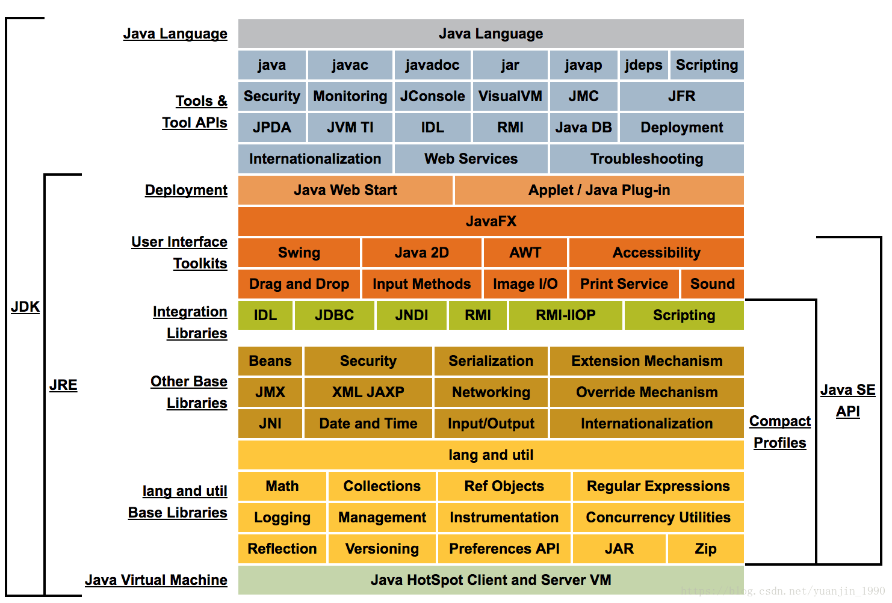

## Java

#### Java基本数据类型

八种基本数据类型包括byte、int、char、long、float、double、boolean和short。

java.lang.String类是final类型的，因此不可以继承这个类、不能修改这个类。为了提高效率节省空间，我们应该用StringBuffer类。


#### JavaSE、JavaEE、JavaME

 ①Java SE：标准版Java SE（Java Platform，Standard Edition）。JavaSE以前成为J2SE。 它语序开发和部署在桌面，服务器，嵌入式环境和实时环境中使用Java应用程序。JavaSE包含了支持JavaWeb服务的开发的类，并为Java Platform,Enterprise Edition(Java EE)提供了基础。

 ②Java EE：企业版Java EE（Java Platform，Enterprise Edition）。这个版本以前成为J2EE。 企业版本帮助开发和部署可移植，健壮，可伸缩切安全的服务器端Java应用程序。

 ③Java ME：微型版Java ME（Java Platform，Micro Edition）。这个版本以前称为J2ME。 Java ME为在移动设备和嵌入式设备（笔记手机，PDA，电视机顶盒和打印机）上运行的应用程序提供一个健壮且灵活的环境。


#### Java EE SDK 与 JDK

SDK（Software Development Kit） 软件开发工具包，是一个相当广泛的名词， 可以这么说辅助开发某一类软件的相关文档，范例和工具的集合都可以叫做“SDK”。SDK是一系列文件的组合，它为软件的开发提供了一个平台。

JDK（Java Development Kit）Java 开发工具包，是针对Java开发的产品。 JDK是SDK的一个子集，因为它是开发java程序的一个平台，开发其他程序的SDK可以没有JDK。比如你下载了一个软件平台eclipse-SDK-3.2.2-win32.zip，它本身里面是没有JDK的。但是只要开发Java程序就必须使用JDK（Java EE和Java SE）。


#### JDK 与 JRE 的区别



 JRE(Java Runtime Enviroment)是Java的运行环境。 面向Java程序的使用者，而不是开发者。如果你仅下载并安装了JRE，那么你的系统只能运行Java程序。JRE是运行Java程序所必须环境的集合，包含JVM标准实现及 Java核心类库。它包括Java虚拟机、Java平台核心类和支持文件。 它不包含开发工具(编译器、调试器等)。

JDK(Java Development Kit)又称J2SDK(Java2 Software Development Kit)，是Java开发工具包，它提供了Java的开发环境(提供了编译器javac等工具，用于将java文件编译为class文件)和运行环境(提 供了JVM和Runtime辅助包，用于解析class文件使其得到运行)。如果你下载并安装了JDK，那么你不仅可以开发Java程序，也同时拥有了运行Java程序的平台。 JDK是整个Java的核心，包括了Java运行环境(JRE)，一堆Java工具tools.jar和Java标准类库 (rt.jar)。


#### Java8新特性

**Lambda 表达式** − Lambda允许把函数作为一个方法的参数（函数作为参数传递进方法中。

**方法引用**− 方法引用提供了非常有用的语法，可以直接引用已有Java类或对象（实例）的方法或构造器。与lambda联合使用，方法引用可以使语言的构造更紧凑简洁，减少冗余代码。

**默认方法**− 默认方法就是一个在接口里面有了一个实现的方法。

**新工具**− 新的编译工具，如：Nashorn js引擎 、 类依赖分析器jdeps。

**Stream API** −新添加的Stream API（java.util.stream） 把真正的函数式编程风格引入到Java中。

**Date Time API** − 加强对日期与时间的处理。

**Optional 类** − Optional 类已经成为 Java 8 类库的一部分，用来解决空指针异常。

**Nashorn, JavaScript 引擎** − Java 8提供了一个新的Nashorn javascript引擎，它允许我们在JVM上运行特定的javascript应用。


#### Java与JavaScript区别

JavaScript 与Java是两个公司开发的不同的两个产品。Java 是原Sun Microsystems公司推出的面向对象的程序设计语言，特别适合于互联网应用程序开发；而JavaScript是Netscape公司的产品，为了扩展Netscape浏览器的功能而开发的一种可以嵌入Web页面中运行的基于对象和事件驱动的解释性语言。JavaScript的前身是LiveScript；而Java的前身是Oak语言。

下面对两种语言间的异同作如下比较：

- 基于对象和面向对象：Java是一种真正的面向对象的语言，即使是开发简单的程序，必须设计对象；JavaScript是种脚本语言，它可以用来制作与网络无关的，与用户交互作用的复杂软件。它是一种基于对象（Object-Based）和事件驱动（Event-Driven）的编程语言，因而它本身提供了非常丰富的内部对象供设计人员使用。

- 解释和编译：Java的源代码在执行之前，必须经过编译。JavaScript是一种解释性编程语言，其源代码不需经过编译，由浏览器解释执行。（目前的浏览器几乎都使用了JIT（即时编译）技术来提升JavaScript的运行效率）
-  强类型变量和类型弱变量：Java采用强类型变量检查，即所有变量在编译之前必须作声明；JavaScript中变量是弱类型的，甚至在使用变量前可以不作声明，JavaScript的解释器在运行时检查推断其数据类型。
- 代码格式不一样。


#### UML中有哪些常用的图

UML定义了多种图形化的符号来描述软件系统部分或全部的静态结构和动态结构，包括：用例图（use case diagram）、类图（class diagram）、时序图（sequence diagram）、协作图（collaboration diagram）、状态图（statechart diagram）、活动图（activity diagram）、构件图（component diagram）、部署图（deployment diagram）等。在这些图形化符号中，有三种图最为重要，分别是：用例图（用来捕获需求，描述系统的功能，通过该图可以迅速的了解系统的功能模块及其关系）、类图（描述类以及类与类之间的关系，通过该图可以快速了解系统）、时序图（描述执行特定任务时对象之间的交互关系以及执行顺序，通过该图可以了解对象能接收的消息也就是说对象能够向外界提供的服务）。


#### JSP有哪些内置对象

request：封装客户端的请求，其中包含来自GET或POST请求的参数；

response：封装服务器对客户端的响应；

pageContext：通过该对象可以获取其他对象；

session：封装用户会话的对象；

application：封装服务器运行环境的对象；

out：输出服务器响应的输出流对象；

config：Web应用的配置对象；

page：JSP页面本身（相当于Java程序中的this）；

exception：封装页面抛出异常的对象。


#### 系统如何提高并发性

1、提高CPU并发计算能力

（1）多进程&多线程

（2）减少进程切换，使用线程，考虑进程绑定CPU

（3）减少使用不必要的锁，考虑无锁编程

（4）考虑进程优先级

（5）关注系统负载

2、改进I/O模型

(1) DMA技术

(2) 异步I/O

(3) 改进多路I/O就绪通知策略，epoll

(4) Sendfile

(5) 内存映射

(6) 直接I/O


#### 死锁与解决方法

（一）互斥条件：一个资源一次只能被一个进程访问。即某个资源在一段时间内只能由一个进程占有，不能同时被两个或两个以上的进程占 有。这种独占资源如CD-ROM驱动器，打印机等等，必须在占有该资源的进程主动释放它之后，其它进程才能占有该资源。这是由资源本身的属性所决定的。

（二）请求与保持条件：一个进程因请求资源而阻塞时，对已获得的资源保持不放。进程至少已经占有一个资源，但又申请新的资源；由于该资源已被另外进程占有，此时该进程阻塞；但是，它在等待新资源之时，仍继续占用已占有的资源。

（三）不剥夺条件：进程已经获得的资源，在未使用完之前不能强行剥夺，而只能由该资源的占有者进程自行释放。

（四）循环等待条件：若干资源形成一种头尾相接的循环等待资源关系。

**解决方法**：银行家算法

所谓银行家算法是是指，系统在为进程分配资源之前，首先计算此次资源分配的安全性，如果是安全的，则进行分配；如果这次分配会导致进入不安全状态，不进行分配。

所谓的安全状态是指存在一个进程序列，如果按照这个顺序为各个进程分配资源，则所有的进程都能顺利运行完成，这是我们说系统是安全的，这个序列叫做安全序列。


#### 负载均衡与反向代理

（1）反向代理（Reverse Proxy）方式是指以代理服务器来接受internet上的连接请求，然后将请求转发给内部网络上的服务器，并将从服务器上得到的结果返回给internet上请求连接的客户端，此时代理服务器对外就表现为一个服务器。

（2）反向代理负载均衡技术是把将来自internet上的连接请求以反向代理的方式动态地转发给内部网络上的多台服务器进行处理，从而达到负载均衡的目的。

（3）反向代理负载均衡能以软件方式来实现，如apache mod_proxy、netscape proxy等，也可以在高速缓存器、负载均衡器等硬件设备上实现。反向代理负载均衡可以将优化的负载均衡策略和代理服务器的高速缓存技术结合在一起，提升静态网页的访问速度，提供有益的性能；由于网络外部用户不能直接访问真实的服务器，具备额外的安全性（同理，NAT负载均衡技术也有此优点）。

（4）其缺点主要表现在以下两个方面

反向代理是处于OSI参考模型第七层应用的，所以就必须为每一种应用服务专门开发一个反向代理服务器，这样就限制了反向代理负载均衡技术的应用范围，现在一般都用于对web服务器的负载均衡。

针对每一次代理，代理服务器就必须打开两个连接，一个对外，一个对内，因此在并发连接请求数量非常大的时候，代理服务器的负载也就非常大了，在最后代理服务器本身会成为服务的瓶颈。

一般来讲，可以用它来对连接数量不是特别大，但每次连接都需要消耗大量处理资源的站点进行负载均衡，如search等。


#### BIO,NIO,AIO

Java 中的 BIO、NIO和 AIO 理解为是 Java 语言对操作系统的各种 IO 模型的封装。程序员在使用这些 API 的时候，不需要关心操作系统层面的知识，也不需要根据不同操作系统编写不同的代码。只需要使用Java的API就可以了。

**同步与异步**

- **同步：** 同步就是发起一个调用后，被调用者未处理完请求之前，调用不返回。
- **异步：** 异步就是发起一个调用后，立刻得到被调用者的回应表示已接收到请求，但是被调用者并没有返回结果，此时我们可以处理其他的请求，被调用者通常依靠事件，回调等机制来通知调用者其返回结果。

同步和异步的区别最大在于异步的话调用者不需要等待处理结果，被调用者会通过回调等机制来通知调用者其返回结果。

**阻塞和非阻塞**

- **阻塞：** 阻塞就是发起一个请求，调用者一直等待请求结果返回，也就是当前线程会被挂起，无法从事其他任务，只有当条件就绪才能继续。
- **非阻塞：** 非阻塞就是发起一个请求，调用者不用一直等着结果返回，可以先去干其他事情。

##### BIO (Blocking I/O)

同步阻塞I/O模式，数据的读取写入必须阻塞在一个线程内等待其完成。

##### NIO (New I/O)

NIO是一种同步非阻塞的I/O模型，在Java 1.4 中引入了NIO框架，对应 java.nio 包，提供了 Channel , Selector，Buffer等抽象。

##### AIO (Asynchronous I/O)

AIO 也就是 NIO 2。在 Java 7 中引入了 NIO 的改进版 NIO 2,它是异步非阻塞的IO模型。异步 IO 是基于事件和回调机制实现的，也就是应用操作之后会直接返回，不会堵塞在那里，当后台处理完成，操作系统会通知相应的线程进行后续的操作。


#### 单个问题汇总

##### Java中如何支持正则表达式操作

Java中的String类提供了支持正则表达式操作的方法，包括：matches()、replaceAll()、replaceFirst()、split()。此外，Java中可以用Pattern类表示正则表达式对象，它提供了丰富的API进行各种正则表达式操作，如：

```java
import java.util.regex.Matcher;
import java.util.regex.Pattern;
class RegExpTest {
    public static void main(String[] args) {
        String str = "成都市(成华区)(武侯区)(高新区)";
        Pattern p = Pattern.compile(".*?(?=\\()");
        Matcher m = p.matcher(str);
        if(m.find()) {
            System.out.println(m.group());
        }
    }
}
```

------

##### Java中如何跳出多重嵌套循环

在最外层循环前加一个标记如A，然后用break A;可以跳出多重循环。（Java中支持带标签的break和continue语句，作用有点类似于C和C++中的goto语句，但是就像要避免使用goto一样，应该避免使用带标签的break和continue，因为它不会让你的程序变得更优雅，很多时候甚至有相反的作用，所以这种语法其实不知道更好），根本不能进行字符串的equals比较，否则会产生NullPointerException异常。

------

##### int和Integer有什么区别？

Java是一个近乎纯洁的面向对象编程语言，但是为了编程的方便还是引入了基本数据类型，但是为了能够将这些基本数据类型当成对象操作，Java为每一个基本数据类型都引入了对应的包装类型（wrapper class），int的包装类就是Integer，从Java 5开始引入了自动装箱/拆箱机制，使得二者可以相互转换。

Java 为每个原始类型提供了包装类型：
\- 原始类型: boolean，char，byte，short，int，long，float，double
\- 包装类型：Boolean，Character，Byte，Short，Integer，Long，Float，Double

```java
class AutoUnboxingTest {
    public static void main(String[] args) {
        Integer a = new Integer(3);
        Integer b = 3;                  // 将3自动装箱成Integer类型
        int c = 3;
        System.out.println(a == b);     // false 两个引用没有引用同一对象
        System.out.println(a == c);     // true a自动拆箱成int类型再和c比较
    }
}
```

------

##### String 和StringBuffer的区别

JAVA 平台提供了两个类：String和StringBuffer，它们可以储存和操作字符串，即包含多个字符的字符数据。这个String类提供了数值不可改变的字符串。而这个StringBuffer类提供的字符串进行修改。当你知道字符数据要改变的时候你就可以使用StringBuffer。典型地，你可以使用StringBuffers来动态构造字符数据。

------

##### 数组(Array)和列表(ArrayList)区别

Array和ArrayList的不同点：

Array可以包含基本类型和对象类型，ArrayList只能包含对象类型。

Array大小是固定的，ArrayList的大小是动态变化的。

ArrayList提供了更多的方法和特性，比如：addAll()，removeAll()，iterator()等等。

对于基本类型数据，集合使用自动装箱来减少编码工作量。但是，当处理固定大小的基本数据类型的时候，这种方式相对比较慢。

------

##### 值传递和引用传递

值传递是对基本型变量而言的,传递的是该变量的一个副本,改变副本不影响原变量。

引用传递一般是对于对象型变量而言的,传递的是该对象地址的一个副本, 并不是原对象本身 。 所以对引用对象进行操作会同时改变原对象.

一般认为,java内的传递都是值传递。

------

##### 解释4.0-3.6=0.40000001

原因简单来说是这样：2进制的小数无法精确的表达10进制小数，计算机在计算10进制小数的过程中要先转换为2进制进行计算，这个过程中出现了误差。

------

##### 十进制的数在内存中是怎么存的

补码的形式。

------

##### Lamda表达式的优缺点

优点：1. 简洁。2. 非常容易并行计算。3. 可能代表未来的编程趋势。

缺点：

1. 若不用并行计算，很多时候计算速度没有比传统的 for 循环快。（并行计算有时需要预热才显示出效率优势）
2. 不容易调试。
3. 若其他程序员没有学过 lambda 表达式，代码不容易让其他语言的程序员看懂。

------

##### “==”比较的是什么

“==”如果两边是基本类型，就是比较数值是否相等。

“==”如果两边是对象，则对比两个对象基于内存引用，如果两个对象的引用完全相同（指向同一个对象）时，“==”操作将返回true，否则返回false。

Object 的 hashcode 方法是本地方法，也就是用 c 语言或 c++ 实现的，该方法直接返回对象的内存地址。

------

##### 怎么分配1000个任务分给10个人做

全局队列，把1000任务放在一个队列里面，然后每个人都是取，完成任务。

分为10个队列，每个人分别到自己对应的队列中去取务。


### Redis

#### 为什么 redis 读写速率快、性能好

Redis是纯内存数据库，相对于读写磁盘，读写内存的速度就不是几倍几十倍了，一般，hash查找可以达到每秒百万次的数量级。

多路复用IO，“多路”指的是多个网络连接，“复用”指的是复用同一个线程。采用多路 I/O 复用技术可以让单个线程高效的处理多个连接请求（尽量减少网络IO的时间消耗）。可以直接理解为：单线程的原子操作，避免上下文切换的时间和性能消耗；加上对内存中数据的处理速度，很自然的提高redis的吞吐量。


#### redis主从复制

第一阶段：与master建立连接

第二阶段：向master发起同步请求（SYNC）

第三阶段：接受master发来的RDB数据

第四阶段：载入RDB文件