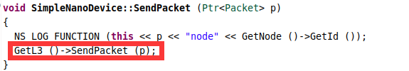

### 纳米网络系统设置

#### eclipse导入项目

打开eclipse->左上角file->import->选择existing project into workspace，点击next->选择文件夹->finish

#### 运行文件说明

在命令行窗口使用`./waf --run scratch/health-care`运行是运行在scratch目录下的health-care文件，但是如果不加scratch路径会默认运行`scr->nanonetworks->examples->health-care`文件。

在eclipse软件中，直接点运行也是默认运行`scr->nanonetworks->examples->health-care`文件。可能将工作目录配置一下。


### 运行问题

##### 文件中的函数显示没有定义的引用

在model中新增.h和.cc文件时，需要在当前要目录下的wscirpt文件中添加相关引用。

##### error while loading shared libraries: libns3.28-aodv-debug.so


##### 循环运行Run函数报错

Time::SetResolution(Time::FS);语句不能多次执行，需要把该语句提出来即可。

### 纳米网络库函数解析

#### 文件结构

```c++
//bindings目录是模块用来绑定Python语言的。

//build这个目录是ns-3的编译目录，包含文件编译时使用的共享库和头文件（build/ns3）。build是我们利用waf工具编译脚本一定会进入的路径。

//doc是帮助文档。

//examples里边包含关于如何使用ns-3的例子，包含许多模块的使用，如能量，路由，无线网络等，如果只是想利用ns-3现有模块编写脚本文件进行网络仿真，比如使用常规协议栈中的协议配置一个有线或者无线局域网络等，那么使用examples目录下的示例对我们很有帮助。
//examples/tutorial路径下包含first.cc/second.cc等等样例代码

//scratch是存放用户脚本文件，是ns-3默认的脚本存放目录。我们可以把要运行的脚本文件或者例子放到这个目录下，使用waf运行脚本文件时可以不用加目录scratch，当脚本文件在其他目录时需要在文件名称前加目录名称才能正常编译运行


//src是ns-3的源代码目录，目录结构基本和我们编译过的模块相对应。src目录下的每一个文件基本就是对应一个模块，所以我们在研究某一模块时src目录下对应模块的文件信息对我们至关重要。比如我们要研究wifi这一模块，那么我们进入wifi这个文件夹，查看里边的内容。其他所有的模块里的结构基本是一模一样的。


//waf基于python开发的编译工具，不管是ns3系统本身自带的和我们自己写的仿真代码都是都是由waf负责编译的

//wscript文件结构是固定的，用来注册模块中包含的源码和使用其他模块情况
```


#### include模块

代码一般是以一系列的include声明开始的：

\#include "ns3/core-module.h"

\#include "ns3/simulator-module.h"

\#include "ns3/node-module.h"

\#include "ns3/helper-module.h"

为了帮助高层的脚本用户处理大量的系统中的include文件，我们把所有的包含文件，根据模块功能，进行了大致的分类。我们提供了一个单独的include文件，这个文件会递归加载所有会在每个模块中会被使用的include文件。NS3提供了按大致功能分类的一组include文件，在使用时只需选择包含这几个包含文件(include文件)，而不用考虑复杂的依赖关系，省去在寻找所需要的头文件上花费的不必要的时间。这不是最有效地方法但很明显让编写脚本文件容易多了。

在编译的过程中，每一个ns-3的include文件被放在build目录下一个叫ns3的目录中，这样做可以避免include文件名的冲突。ns3/core-module.h与src/core目录下的模块相对应。查看ns3目录会发现大量的头文件。当你编译时，Waf会根据配置把在ns3目录下的公共的头文件放到build/debug或者build/optimized目录下。Waf也会自动产生一个模块include文件来加载所有的公共头文件。

当然，如果遵循着这个手册走的话，你可能已经使用过如下命令：

./waf -d debug --enable-examples --enable-tests configure

来配置工程以完成调试工作。你可能同样使用了如下命令：

./waf

来编译ns-3。现在如果你进入../../build/debug/ns3目录的话你会发现本节开头提到的四个头文件。仔细看一下这些文件的内容，会发现它们包含了相关模块中的所有的include文件。


#### 启动命令

```c++
1、要运行自己的脚本，你所需要做的第一步是把你的脚本放到scratch目录下
2、使用./waf命令来编译自己的第一个实例脚本
3、运行./waf --run scratch/myfirst脚本，注意，脚本名字不用带.cc的后缀
4、在调试编译模式下进行重新编译：./waf -d debug --enable-examples --enable-tests configure。
    
使用eclipse运行时：
1、使用build编译
2、使用Run->External Tools->External Tools Configuration->点击Run
3、选择需要运行的文件，不带后缀
```


#### 单位换算

```c++
//能量
1J = 10^3mJ = 10^6uJ = 10^9nJ = 10^12pJ = 10^15fJ
    
//时间
1s = 10^3ms = 1*10^6us = 1*10^9ns = 1*10^12ps = 110^15fs
```


#### 日志

**概念：NS3 提供一个可供选择的、多级别的方法来记录日志。日志可以完全被禁用，或仅对部分组件可用，或全局可用。并且 NS3 提供了不同详尽程度的日志级别供选。NS3也提供了一个一般性的记录机制，tracing，来获得仿真结果之外的数据。日志应当作为快速获得你的脚本和模型的调试信息、警告信息、错误信息、或是其他信息的首要选择。**

```c++
/**************************

在现有的系统中，有7个详尽程度递增的日志级别（级别越高内容越详细），他们分别是：
LOG_ERROR--------------------------->记录错误信息
LOG_WARN—-------------------------->记录警告信息
LOG_DEBUG---------------------------->记录调试信息
LOG_INFO-------------------------------->记录程序进展信息
LOG_FUNCTION--------------------------->记录每个调用函数信息
LOG_LOGIC--------------------------->记录每一个函数内部描述逻辑流程信息
LOG_ALL--------------------------->记录所有信息

系统也提供了一种一直被使用的无条件日志级别，它是跟日志详尽级别或是组件选择无关的：
LOG_UNCOND-------------------------->无条件记录信息
每一个级别能够被单独地被调用或逐级递增的被调用（高级别包括低级别）。
日志的配置可以使用一个 shell 环境变量(NS_LOG)，或是使用日志系统函数进行如examples/tutorial目录下的firct.cc的 LogComponentEnable ("UdpEchoClientApplication", LOG_LEVEL_INFO);的样式进行修改。

***************************/


//设置日志为 LOG_LEVEL_INFO 级别。当我们传递一个日志级别标志时，我们实际上打开了这个日志级别和它之下的所有级别。本例中，我们打开了NS_LOG_INFO, NS_LOG_DEBUG, NS_LOG_WARN 和 NS_LOG_ERROR 级别。
LogComponentEnable ("UdpEchoClientApplication", LOG_LEVEL_INFO);
LogComponentEnable ("UdpEchoServerApplication", LOG_LEVEL_INFO);

//我们可以通过设置 NS_LOG 环境变量在不改变脚本或重新编译的情况下来增加日志级别，获得更多信息。
yan@ysw:~/NS3/ns-allinone-3.25/ns-3.25$ export NS_LOG=UdpEchoClientApplication=level_all

//当想查看日志来自何处时
export 'NS_LOG=UdpEchoClientApplication=level_all|prefix_func'
    
//有时能够看到日志生成的仿真时间也是很有用的。可以通过使用prefix_time 位来实现，查看回显客户端和服务器的所有日志消息。
export 'NS_LOG=UdpEchoClientApplication=level_all|prefix_func|prefix_time:UdpEchoServerApplication=level_all|prefix_func|prefix_time'
    
//日志通配符，星号是日志组件通配符。将打开在仿真过程中使用的所有组件的日志功能。
export 'NS_LOG=*=level_all|prefix_func|prefix_time'
    
//输出日志至指定文件log.out
./waf --run scratch/myfirst > log.out 2>&1.
 
    
 /*   
日志系统函数
可以在脚本中使用宏NS_LOG_COMPONENT_DEFINE(name)定义一个日志模块。
(注意，为了使用宏NS_LOG(name, level)来输出这个模块所定义的内容，这个定义语句必须写在每个脚本文件的开始。)
用法：
1)在脚本里使用宏NS_LOG_COMPONENT_DEFINE(name)定义一个日志模块；
2)使用宏LogComponentEnable(name, level)启用日志。（对应地，有宏LogComponentDisable(name, level)用于禁用日志）；

*/  

//声明了一个叫FirstScriptExample的日志组件，通过引用FirstScriptExample这个名字的操作，可以实现打开或者关闭控制台日志的输出。下面两条语句等价于：export NS_LOG = 'Example=info'。
NS_LOG_COMPONENT_DEFINE ("FirstScriptExample");
LogComponentEnable("FirstScriptExample", LOG_LEVEL_INFO); 

//当设置完上面两条语句并且需要输出日志消息时，使用下列语句
NS_LOG_INFO ("CreatingTopology");    
```


#### CommandLine

​	**作用：仿真一般是为了收集各种不同条件下的数据，常常需要改变一些变量。NS-3提供了Command Line参数接口，可以在运行时对脚本中的变量进行设置，免去了每次更改变量后要重新编译和构建脚本的麻烦。**

**用法：使用CommandLine::AddValue添加自己的变量，通过钩挂自己的变量将其与命令行相关联，使之成为CommandLine可以使用的参数**

```c++
//使用CommandLine通过命令行来修改参数

CommandLine cmd;
cmd.AddValue("nPackets","Number of packets to echo", nPackets);　//（属性名称，属性说明，变量）
cmd.Parse(argc,argv);

//使用方法
./waf --run "scratch/example --nPackets=2"
```


#### Time类

```c++
//设置最小单元时间FS
Time::SetResolution(Time::FS);
```


#### srand(time(NULL))

**作用：srand()称为随机数生成器的初始化器。这条指令的意思是利用系统时间来初始化系统随机数的种子值，使得每次运行由于时间不同而产生不同的随机数序列。srand()和rand()配合使用产生伪随机数序列。**

**用法：rand函数在产生随机数前，需要系统提供的生成伪随机数序列的种子，rand根据这个种子的值产生一系列随机数。如果系统提供的种子没有变化，每次调用rand函数生成的伪随机数序列都是一样的。**

**srand(unsigned seed)函数通过参数seed来改变系统提供的种子值，从而可以使得每次调用rand函数生成的伪随机数序列不同，从而实现真正意义上的“随机”。**

**通常可以利用系统时间来改变系统的种子值，即srand(time(NULL))，可以为rand函数提供不同的种子值，进而产生不同的随机数序列。如果在调用rand()之前没有调用过srand(seed)，效果将和调用了srand(1)再调用rand()一样**


#### SeedManager

**为了在若干次模拟中获得随机性，必须设置不同的种子或者设置不同的运行次数。在程序的起始处调用SeedManager::SetSeed(rand());来设置种子；当要用相同的种子来设置运行次数时，在程序的起始处调用SeedManager::SetRun(uint32_t);**

```c++
//
SeedManager::SetSeed(rand());
```


#### NanoHelper

**作用：helper是拓扑辅助工具类。这些helper类里面封装了低级的方法，有助于我们高效的建立仿真拓扑。**

```c++
//纳米网络通信方式
NanoHelper nano;


//点对点通信方式，在栈中初始化了一个PointToPointHelper的对象pointToPoint
PointToPointHelper pointToPoint;
//PointToPointHelper对象创建一个PointToPointNetDevice对象时使用“5Mbps"来作为数据速率
pointToPoint.SetDeviceAttribute ("DataRate", StringValue ("5Mbps"));
//PointToPointHelper使用"2ms"（2毫秒）作为每一个被创建的点到点信道传输延时值
pointToPoint.SetChannelAttribute ("Delay", StringValue ("2ms"));
```


#### AsciiTraceHelper

**作用：**

**1.对于基本的任务，tracing系统允许用户为常用的tracing发送端生产标准的tracing，并且可以定制哪些对象生成tracing。**

**2.中间的用户必须能够拓展tracing系统来修改生成的输出格式，或者在不修改仿真器核心的情况下，插入新的tracing发送端。**

**3.高级用户可以修改仿真器核心来增加新的tracing发送端和接收端。**

**NS3 tracing系统是建立在独立的tracing发送端和接收端概念上，并且有统一的机制来连接发送端和接收端。Trace发送端可以在仿真过程中产生信号事件，并且提供有关数据访问通道。例如，一个trace发送端可以提供一个数据包被一个网络设备接收的时间，并且根据接收端的要求提供此数据包的内容。**

**NS3提供两种tracing机制：ASCII码tracing和pcap级别的tracing。**

```c++
////创建一个ASCII trace对象
AsciiTraceHelper asciiTraceHelper;

//定义一个输入输出流
std::stringstream file_outTX_s;

//作为文件名
file_outTX_s << "RES_TX" << "_N_" << nbNanoNodes << "_R_" << nbNanoRouters << "_G_" << nbNanoGateways << "_nTxRange_" << txRangeNanoNodes << "_macType_" << macType << "_l3Type_" << l3Type << "_seed_" << seed;

//streamstring在调用str()时，会返回临时的string对象。而因为是临时的对象，所以它在整个表达式结束后将会被析构。如果需要进一步操作string对象，先把其值赋给一个string变量后再操作。
std::string file_outTX = file_outTX_s.str();

//打开一个名为“file_outTX”文件中的数据流
Ptr<OutputStreamWrapper> streamTX = asciiTraceHelper.CreateFileStream(file_outTX);
```


#### NodeContainer

```c++
//声明了一个名为”nodes”的NodeContainer
NodeContainer nodes;
//调用了nodes对象的Create()方法创建了两个节点
nodes.Create (2);
```


####  NetDeviceContainer

**作用：在NS3中，网络设备这一抽象概念相当于硬件设备和软件驱动的总和。NS3仿真环境中，网络设备相当于安装在节点上，使得节点通过信道和其他节点通信。像真实的计算机一样，一个节点可以通过多个网络设备同时连接到多条信道上。正如以太网卡被设计成在以太网中工作一样，CsmaNetDevice被设计成在csma信道中工作，而PointToPointNetDevice 在PointToPoint信道中工作，WifiNetNevice在wifi信道中工作。**

```c++
//第一行声明了设备容器,我们使用一个NetDeviceContainer对象来存放需要所有被创建的NetDevice对象，就像我们使用一个NodeContainer对象来存放我们所创建节点。
NetDeviceContainer devices;
//PointToPointHelper的Install()方法以一个NodeContainer对象作为一个参数。在Install()方法内，一个NetDeviceContainer被创建了。对于在NodeContainer 对象中的每一个节点（对于一个点到点链路必须明确有两个节点)，都将有一个PointToPointNetDevice被创建和保存在设备容器内，有一个PointToPointChannel对象被创建，两个PointToPointNetDevices与之连接。当PointToPointHelper对象创建时，那些在helper中被预先设置的属性被用来初始化对象对应的属性值。
//当调用了pointToPoint.Install(nodes)后，我们会有两个节点，每一个节点安装了点到点网络设备，在它们之间是一个点到点信道。两个设备会被配置在一个有2ms传输延时的信道上以5Mbps的速率传输数据。
devices = pointToPoint.Install (nodes);
```


#### InternetStackHelper

**作用：类InternetStackHelper 是一个辅助安装网络协议栈的helper类**

```c++
InternetStackHelper stack;
//Install()方法以NodeContainer 对象作为参数，当它被执行后，它会为节点容器中的每一个节点安装一个网络协议栈（TCP,UDP,IP等）。
stack.Install (nodes);
```


#### Ipv4AddressHelper

**作用：为节点上的设备设置IP地址。提供了一个helper类来管理IP地址的分配。当执行实际的地址分配时唯一用户可见的API是设置IP地址和子网掩码。**

```c++
//声明了一个helper对象，并且告诉它应该开始从10.1.1.0开始以子网掩码为255.255.255.0分配地址。地址分配默认是从1开始并单调的增长，所以在这个基础上第一个分配的地址会是10.1.1.1，紧跟着是10.1.1.2等等。
Ipv4AddressHelper address;
address.SetBase ("10.1.1.0", "255.255.255.0");

//完成真正的地址配置。在NS3中我们使用 Ipv4Interface对象将一个IP地址同一个网络设备关联起来。
Ipv4InterfaceContainer interfaces = address.Assign (devices);
```


#### Applications

```c++
//声明UdpEchoServerHelper，除非我们告知helper对象服务器和客户端所共知的一个端口号，否则这个helper对象是不会起任何作用的。
UdpEchoServerHelper echoServer (9);

//echoServer.Install将会在管理节点的NodeContainer容器索引号为1的机节点上安装一个UdpEchoServerApplication。安装会返回一个容器，这个容器中包含了指向所有被helper对象创建的应用指针。
ApplicationContainer serverApps = echoServer.Install (nodes.Get (1));

//应用程序对象需要一个时间参数来“开始”产生数据通信并且可能在一个可选的时间点“停止”。我们提供了开始和停止的两个参数。这些时间点是用ApplicationContainer的方法Start和Stop来设置的。这些方法以”Time”对象为参数。我们传递了double类型对象1.0到Seconds的一个方法，通过seconds()方法，把它转换到ns-3的Time对象
//使echo服务应用在1s时开始（生效）并在10s时停止（失效）。既然我们已经声明了一个模拟事件（就是应用的停止事件）在10s时被执行，模拟至少会持续10s。
serverApps.Start (Seconds (1.0));
serverApps.Stop (Seconds (10.0));

//创建一个UdpEchoClientHelper的对象，并告诉它设置客户端的远端地址为服务器节点的IP地址。我们同样告诉它准备发送数据包到端口9。
UdpEchoClientHelper echoClient (interfaces.GetAddress (1), 9);

//“MaxPackets”属性告诉客户端我们所允许它在模拟期间所能发送的最大数据包个数
echoClient.SetAttribute ("MaxPackets", UintegerValue (1));

//“Interval”属性告诉客户端在两个数据包之间要等待多长时间
echoClient.SetAttribute ("Interval", TimeValue (Seconds (1.)));

//“PacketSize”属性告诉客户端它的数据包应该承载多少数据。本例中，我们让客户端发送一个1024字节的数据包。
echoClient.SetAttribute ("PacketSize", UintegerValue (1024));

ApplicationContainer clientApps = echoClient.Install (nodes.Get (0));

//使客户端在模拟器中时间为2s的时候开始(即服务端生效1s后才开始)
clientApps.Start (Seconds (2.0));
clientApps.Stop (Seconds (10.0));
```


#### Simulator

##### Simulator::Run ()

**作用：为节点上的设备设置IP地址。提供了一个helper类来管理IP地址的分配。当执行实际的地址分配时唯一用户可见的API是设置IP地址和子网掩码。**

当Simulator::Run被调用时，系统会开始遍历预设事件的列表并执行。首先它会在1.0s时运行事件，这个事件会使echo服务端应用生效（这个事件会预设更多的其他事件）。接下来仿真器会运行在t=2.0s时的事件，即让echo客户端应用开始。

我们只发送了一个数据包（MaxPackets属性被设置为1），在此之后，客户端应答请求所引发的连锁反应会停止，并且模拟器会进入空闲状态。当这发生时，剩下来的事件就是服务端和客户端的Stop事件。当这些事件被执行后，就没有将来的事件来执行了，函数Simulator::Run会返回。整个模拟过程就结束了。

##### Simulator::Destroy ()

模拟过程结束后剩下的事情就是清理，调用全局函数Simulator::Destroy来完成。当该方法被执行后，模拟器中所有创建的对象将被销毁。你自己并不需要追踪任何对象，你所需要做的仅仅是调用Simulator::Destroy并且退出。ns-3系统会帮你料理这些繁杂的任务。

##### Simulator::Now().GetSeconds()

获取系统到现在的运行时间，单位为秒。

##### Simulator::Schedule

事务时间安排函数

使用模板：Simulator::Schedule (Time const &delay, MEM mem_ptr, OBJ obj)

delay代表执行该事务的延迟时间；mem_ptr代表执行的函数；obj代表执行函数的对象。

------

案例：Simulator::Schedule(Seconds(0.15), &MessageProcessUnit::computeaverindex, mpu);

Seconds(0.15)代表函数执行延迟0.15s，computeaverindex代表执行的目标函数，mpu代表执行函数的对象


#### MobilityHelper 

**概念：移动节点模型设置分为两部分：初始位置分布，后续移动轨迹模型。**

```c++
MobilityHelper mobility;
//初始位置分布器：GridPositionAllocator，按照设置好的行列参数把节点等间距放在一个二维笛卡尔坐标系中
mobility.SetPositionAllocator (
    "ns3::GridPositionAllocator",
	"MinX", DoubleValue (0.0),	//起始坐标（0，0）
	"MinY", DoubleValue (0.0),
	"DeltaX", DoubleValue (5.0),	//X轴节点间距：5m
    "DeltaY", DoubleValue (10.0),	//Y轴节点间距：10m
    "GridWidth", UintegerValue (3),	//每行最大节点数
    "LayoutType", StringValue ("RowFirst"));


mobility.SetPositionAllocator (
    "ns3::RandomBoxPositionAllocator",
    //RandomVariableValue (UniformVariable (0, xrange)),
    "X", StringValue ("ns3::UniformRandomVariable[Min=0.0|Max=0.15]"),	
    //RandomVariableValue (UniformVariable (0, yrange)),
    "Y", StringValue ("ns3::UniformRandomVariable[Min=0.0|Max=0.001]"),	
    //RandomVariableValue (UniformVariable (0, zrange)));
    "Z", StringValue ("ns3::UniformRandomVariable[Min=0.0|Max=0.001]"));	

//移动轨迹模型：RandomWalk2dMobilityModel
//节点在一个指定大小的长方形区域内按照随机速度（默认取值范围是[2，4]m/s）和方向移动
mobility.SetMobilityModel ("ns3::RandomWalk2dMobilityModel",
	"Bounds", RectangleValue (Rectangle (-50, 50, -50, 50)));

//使用固定位置移动模型ConstantPositionMobilityModel，这个模型的AP节点二维坐标为（0，0）
mobility.SetMobilityModel ("ns3::ConstantPositionMobilityModel");

//使用高斯马尔可夫移动模型
mobility.SetMobilityModel (
    "ns3::GaussMarkovMobilityModel",    
    //设置移动区域的界限
    "Bounds", BoxValue (Box (0, xrange, 0, yrange, 0, zrange)), 
    //设置每一次移动的间隔
    "TimeStep", TimeValue (Seconds (0.001)),  
    //设置高斯-马尔可夫模型中可调参数的常数
    "Alpha", DoubleValue (0),
    //用于分配平均速度的随机变量
    "MeanVelocity", StringValue ("ns3::UniformRandomVariable[Min=0.2|Max=0.2]"),
    //用于分配平均方向的随机变量
    "MeanDirection", StringValue ("ns3::UniformRandomVariable[Min=0|Max=0]"),
    //用于分配平均Pitch的随机变量
    "MeanPitch", StringValue ("ns3::UniformRandomVariable[Min=0.05|Max=0.05]"),
    //用于计算下一个速度值的高斯随机变量
    "NormalVelocity",StringValue("ns3::NormalRandomVariable[Mean=0.0|Variance=0.0|Bound=0.0]"),
    //用于计算下一个方向值的高斯随机变量
    "NormalDirection",StringValue("ns3::NormalRandomVariable[Mean=0.0|Variance=0.2|Bound=0.4]"),
    //用于计算下一个Pitch值的高斯随机变量。
    "NormalPitch",StringValue("ns3::NormalRandomVariable[Mean=0.0|Variance=0.2|Bound=0.4]"));


mobility.Install (n_nodes);


```


### 流引导代码解析

#### 基本概念

##### 数据包格式


##### 能量消耗

能量消耗有三种情况：mac协议中发送数据包，mac协议中转发数据包，路由协议中接收数据包。

注意：mac协议中的发送与接收消耗能量不能放路由协议中，因为需要在mac协议中给数据包添加mac头，否则数据包大小不符。

#### 流引导主要修改文件

health-care.cc	fsa-nano-mac-entity.cc	message-process-unit.cc	nano-l3-header.cc	

#### 注引导代码执行顺序（相对位置感知）

##### 1.主程序节点设置消息处理单元、能量捕获与平均index值计算

主程序纳米节点设置消息处理单元并调用创建消息函数，纳米节点调用能量周期性捕获函数（周期性为0.1s）与邻居节点平均index值周期性计算函数（周期性为0.01s)；网关节点设置发送探测数据包。（health-care.cc)


##### 2.节点创建和探测数据包

调用创建消息函数设置数据包与探测数据包，设置数据包与探测数据包大小->添加序列头->设置消息循环产生的间隔，并把数据包与探测数据包发送出去。(message-process-unit.cc)


##### 3.调用节点的路由实体发送数据包封装函数

调用节点的底层发送数据包函数。GetL3()是获取节点的路由对象，即之前设置的机会路由对象。(simple-nano-device.cc)




##### 4.调用设置的路由协议发送数据包

调用机会路由对象文件中的SendPacket函数，取出旧序列头->设置路由头->添加新序列头->添加路由头，使用mac协议发送数据包。（opportunistic-nano-routing-entity.cc)


##### 5.调用设置的mac协议发送数据包（消耗能量）

mac协议发送数据包，根据周围邻居节点类型进行数据包的转发并使节点消耗发送数据包的能量。（fsa-nano-mac-entity.cc)


##### 6.触发mac协议的发送数据包函数

触发同文件中的发送函数，Send函数->DoSendPacket函数将数据发送出去，即调用phy->StartTx(p)。（fsa-nano-mac-entity.cc)

调用上一步的Send函数将数据发送出去。


##### 7.调用物理层发送数据包封装函数

物理层NanoSpectrumPhy对象中有virtual bool StartTx (Ptr<Packet> p) = 0的虚函数，实际指向的是TS-OOK中的将StartTx 函数。（nano-spectrum-phy.h)


##### 8.调用设置的物理层传输协议发送数据

调用设置的TS-OOK物理层传输协议发送数据，创建NanoSpectrumSignalParameters对象，计算数据包的发送时间并设置NanoSpectrumPhy的状态，然后设置NanoSpectrumSignalParameters参数并通过NanoSpectrumChannel对象发送它。（ts-ook-based-nano-spectrum-phy.cc)


##### 9.调用信道传输函数

调用信道传输函数，如果两个节点的距离小于传输范围，则进行传输。（nano-spectrum-channel.cc)


##### 10.调用接收节点的信道接收函数

调用信道接收函数，receiver是SpectrumPhy是重写后的对象，也就是TS-OOk，调用TS-OOk中的StartRx函数来接收NanoSpectrumSignalParameters对象。（nano-spectrum-channel.cc)


##### 11.调用设置的物理层传输协议接收数据

调用设置的TS-OOK物理层传输协议接收数据，在StartTx函数将所有要接收的NanoSpectrumSignalParameters数据push进m_receivingpackets列表。然后经过接收数据包时间duration之后在EndRx函数内进行数据接收处理，EndRx函数内的GetDevice()->GetObject<SimpleNanoDevice>()->ReceivePacket(p)实际上就是GetL3 ()->ReceivePacket (p)。（ts-ook-based-nano-spectrum-phy.cc)


##### 12.触发设置的路由协议进行数据包的接收（消耗能量）

通过路由协议的ReceivePacket函数接收来自物理层的数据包，然后根据数据包与接收节点的类型来判断是否是进行数据包处理还是数据包转发，如果是数据包转发则重新进入mac协议调用FSANanoMacEntity::forward(Ptr<Packet> p1)。（opportunistic-nano-routing-entity.cc)


##### 13.完成数据包的处理

如果数据包到达了网关节点，则数据包传输的流程结束，计算传输的延时并通过m_outRX的log文件进行输出。（ts-ook-based-nano-spectrum-phy.cc)


#### 流引导设置问题		

◆数据包产生时隙

数据包产生时隙参数packetInterval设置为0.1s，但是实际为0.01s，packetInterval并没有使用。


#### 流引导待解决问题点

◆主程序代码application中的节点消息处理单元设置逻辑

回答：只有纳米节点与网关节点设置了CreteMessage，纳米节点是为了产生感知数据，网关节点是为了产生探测包数据，路由节点不产生数据。只有纳米节点与网关节点设置了SetMessageProcessUnit，纳米节点是为了处理探测包数据，网关节点是为了处理纳米节点感知的数据。

◆主函数中的powerTransmission代表什么

回答：传输功率，用于功率谱密度计算。

◆主函数的packetInterval与double startTime = random->GetValue(0.2, 0.3)的区别

回答：packetInterval是每个节点内部创建数据包的间隔，startTime是外部安排每个节点调用某函数的间隔。

◆设置的数据包大小没有起作用，大小还是102，探测数据包大小是100

回答：ppt设置的参数是指mac协议中的数据包大小，探测数据包指的是确定候选节点发送的探测包，不是网关节点发送的探测包大小。

◆TsOokBasedNanoSpectrumPhy::StartTx中的duration计算m_pulseDuration没有乘以脉冲个数

回答：太小可以忽略

◆实际能量捕获速率不是760pJ/s

回答：实际的能量捕获率是随机的，为0-7.61pJ/s。

◆退避时隙如何起作用

回答：当某个节点前面的数据包执行phy->StartTx (p)时，后面的数据包进来执行m_queue.push_back (p)会触发。退避时隙在0-100ns。

◆移动模型如何选择的

回答：

◆普通纳米节点的初始位置如何设置

回答：

◆数据包中头数据的解析

回答：NanoL3Header header; p->AddHeader (header);

执行上述两条语句，

◆数据包发送和接收没有判断节点是否能量充足

回答：判断会导致实验结果不好

◆接收网关探测包也是消耗接收50字节的能量

回答：已修改

#### log文件解析

nanonodeposition.log收集的是所有纳米节点的id和实时位置信息。

RES_TX收集的是所有**普通纳米节点id**与其**对应节点产生的数据包id**。普通纳米节点id以网关节点与路由节点的个数之和为起始计数，其和从0开始。

RES_RX收集的是处理数据包时，接收**数据包的序列号**、**数据包发送的源节点id**、**接收数据包节点id**、**数据包的内容大小**（去头）、**数据包传输的时延**。

RES_ENERGY收集的是**所有数据包与探测数据包的发送和接收消耗的能量数据**。用于计算协议的平均传输能耗。

RES_PHYTX收集的是物理层中**所有数据包与探测数据包发送的源节点id**与其**发送的数据包id**。

RES_PHYCOLL收集的是在物理层中**接收数据包节点id**与其**接收的冲突数据包id**。

#### 实验参数解析

##### 包传输成功率

用RES_RX文件中的数据个数除以RES_TX文件中的个数。

| 节点数量 | 包传输成功率 | 平均传输能耗 | 包传输时延 | 吞吐量 |      备注      |
| :------: | :----------: | :----------: | :--------: | :----: | :------------: |
|    5     |  0.37/0.295  |              |            |        | 89/240--71/240 |
|    10    |    0.377     |              |            |        |    181/480     |
|    15    |     0.39     |              |            |        |    281/720     |
|    20    |    0.345     |              |            |        |    332/960     |
|    25    |    0.3275    |              |            |        |    393/1200    |
|    30    |    0.3555    |              |            |        |    512/1440    |
|   100    |    0.3479    |              |            |        |   1670/4800    |
|          |              |              |            |        |                |
|          |              |              |            |        |                |
|          |              |              |            |        |                |
|          |              |              |            |        |                |
|          |              |              |            |        |                |
|          |              |              |            |        |                |
|          |              |              |            |        |                |
|          |              |              |            |        |                |
|          |              |              |            |        |                |
|          |              |              |            |        |                |
|          |              |              |            |        |                |
|          |              |              |            |        |                |
|          |              |              |            |        |                |
|          |              |              |            |        |                |
|          |              |              |            |        |                |

#### 参数解析

##### simple-nano-device

作用：节点对象的属性设置

重点函数

void SimpleNanoDevice::HarvestEnergy()				//节点能量捕获函数

double SimpleNanoDevice::ConsumeEnergySend(double packetsize)					//发送数据的能量消耗函数

double SimpleNanoDevice::ConsumeEnergyReceive(double packetsize)					//接收数据的能量消耗函数

double SimpleNanoDevice::GetM()					//获取候选节点转发的优先级

|        参数名称         |             参数含义             |                    备注                     |
| :---------------------: | :------------------------------: | :-----------------------------------------: |
|         m_type          |             节点类型             | 0代表纳米节点，1代表路由节点，2代表网关节点 |
|         m_node          |             节点对象             |                                             |
|        m_ifIndex        |                                  |                   未使用                    |
|          m_phy          |       NanoSpectrumPhy对象        |                                             |
|          m_mac          |          节点的mac协议           |                                             |
|          m_l3           |          节点的路由协议          |                                             |
|          m_mpu          |        节点的消息处理单元        |                                             |
|         m_randv         |  节点产生不同的能量捕获率的种子  |                                             |
|        m_txrange        |           节点传输范围           |                                             |
|          index          |           节点index值            |        用于计算候选节点转发的优先级         |
|      averageindex       |      节点的周围平均index值       |                                             |
|         mobile          |          节点相对移动性          |                                             |
|        m_energy         |           节点当前能量           |                                             |
|       m_maxenergy       |         节点最大存储能量         |                                             |
|  m_harenergyintertime   |         节点能量捕获时隙         |                                             |
|    m_harenergyspeed     |         节点能量捕获速度         |  实际代码中是随机生成的，速度为0-7.61pJ/s   |
|   m_EnergySendPerByte   |          发送能耗/字节           |                                             |
| m_EnergyReceivePerByte  |          接收能耗/字节           |                                             |
|      m_PacketSize       |            数据包大小            |                                             |
|       m_TestSize        |          探测数据包大小          |                                             |
|            M            |       候选节点转发的优先级       |                                             |
| U,parameter1,parameter2 | 计算候选节点转发优先级的系统参数 |                                             |


##### nano-mac-header

作用：mac协议头部信息设置函数。NanoMacHeader::GetSerializedSize为8，即mac头大小为8字节。

|   参数名称    |   参数含义   | 备注 |
| :-----------: | :----------: | :--: |
|   m_source    | 发送源节点id |      |
| m_destination |  接收节点id  |      |


##### mac-entity

作用：mac协议实体，用于实际设置的mac协议进行重写。

重点函数：

void NanoMacEntity::CheckForNeighborss()				//获取邻居节点信息，将nano-spectrum-channel.cc获取的邻居节点信息放在此类变量m_neighborss

void NanoMacEntity::CheckForNeighbors()					//获取邻居节点信息，将nano-spectrum-channel.cc获取的邻居节点信息放在此类变量m_neighbors

|   参数名称   |        参数含义        |                            备注                            |
| :----------: | :--------------------: | :--------------------------------------------------------: |
|   m_device   |        节点对象        |                                                            |
|   m_queue    |        消息队列        |                                                            |
| m_waitqueue  |      等待消息队列      |                                                            |
| m_sendqueue  |      发送消息队列      |                                                            |
| m_neighborss | 节点对象的邻居节点列表 | 实现在nano-spectrum-channel.cc，两个邻居节点内部参数不一样 |
| m_neighbors  |   节点对象的邻居节点   |               实现在nano-spectrum-channel.cc               |


##### nano-l3-header

作用：路由头部信息设置函数。NanoL3Header::GetSerializedSize为24，即router头大小为24字节。

|   参数名称    |          参数含义          |                            备注                             |
| :-----------: | :------------------------: | :---------------------------------------------------------: |
|   m_source    |          源节点id          |                                                             |
| m_destination |         目标节点id         |                                                             |
|     m_ttl     |         数据包ttl          |                                                             |
|  m_packetId   |          数据包id          |                                                             |
|  m_mobility   | 路由头携带的相对移动模型值 |                                                             |
|    m_index    |    路由头携带的index值     | 网关节点探测包设置的是indexy，周期性递增，普通数据包设置为0 |

 

##### router-entity

作用：路由协议实体函数，用于实际设置的路由协议进行重写。

|   参数名称    |    参数含义    |               备注               |
| :-----------: | :------------: | :------------------------------: |
|   m_device    |    节点对象    |                                  |
| SenderTypeTag | 节点的标志类型 | 含type变量，GetSerializedSize为4 |

tag.type = 1代表将数据包发送给路由或网关节点，其它节点不接收。

tag.type = 2代表将数据包转发给移动性优于本节点的邻居节点。

tag.type = 3代表将数据包发送给移动性大于0的邻居节点。

tag.type = 4代表探测数据包（在机会路由协议中的OpportunisticNanoRoutingEntity::SendtestPacket (Ptr<Packet> p)函数）。


##### queue

作用：数据包队列函数。

重点函数：

bool NanoMacQueue::Enqueue(Ptr<Packet> packet)			//往队列中添加一个QueueElement

Ptr<Packet> NanoMacQueue::Dequeue(void)					//从队列中取出一个数据包，会在队列中删除该元素

Ptr<Packet> NanoMacQueue::Peek(void) const				//在队列中查看一个数据包，但是不会在队列中删除该元素

------

m_queue.front()是取出队列第一个元素，但是不删除。m_queue.pop_front()是删除队列中第一个元素。

|    参数名称     |                   参数含义                   | 备注 |
| :-------------: | :------------------------------------------: | :--: |
|  QueueElement   | 结构体，包含数据包和时间戳，是队列中单个单位 |      |
|     m_queue     |               QueueElement队列               |      |
|    m_maxSize    |         队列能存放的QueueElement总数         |      |
|     m_bytes     |       队列中所有QueueElement的总字节数       |      |
| m_nrDataPackets |         当前队列中的QueueElement个数         |      |


##### nano-seq-ts-header

作用：放在路由协议发送的数据包中的序列头，时间戳用于计算数据包从发送到接收的时间，NanoSeqTsHeader::GetSerializedSize为12，序列头的大小为12字节。

| 参数名称 | 参数含义 |         备注         |
| :------: | :------: | :------------------: |
|  m_seq   |  序列号  | 一般设置为Packet的id |
|   m_ts   |  时间戳  |                      |


##### packet(network)

重点函数：数据包底层函数。

重点函数：

uint32_t Packet::RemoveHeader(Header &header)					//将Packet中的header数据转移到括号中的header，包括mac头与路由头

|    参数名称     |            参数含义            |                 备注                  |
| :-------------: | :----------------------------: | :-----------------------------------: |
|    m_buffer     | 数据包的内容（包括数据与头部） | 数据包的GetSize函数就是获取该变量大小 |
|  m_byteTagList  |        the ByteTag list        |                                       |
| m_packetTagList |     the packet's Tag list      |   用于存放mac协议中的SenderTypeTag    |
|   m_metadata    |     the packet's metadata      |                                       |
|   m_nixVector   |    the packet's Nix vector     |                                       |
|   m_globalUid   |       数据包的全局id变量       |    初始值为0，创建数据包时该变量+1    |


##### message-process-unit

创建、处理、设置包大小与产生时隙。

重点函数：

void MessageProcessUnit::CreteMessage ()						//创建消息

void MessageProcessUnit::computeaverindex ()				//计算节点平均index值与相对移动速度

void MessageProcessUnit::CretetestMessage ()				//创建探测包消息

void MessageProcessUnit::ProcessMessage (Ptr<Packet> p)				//处理消息，只能纳米网关节点处理

|      参数名称      |    参数含义    |   备注    |
| :----------------: | :------------: | :-------: |
|      m_device      |    节点对象    |           |
|    m_packetSize    | 创建数据包大小 | 大小为100 |
| m_interarrivalTime | 创建数据包时隙 |           |


##### ts-ook-based-nano-spectrum-phy

作用：ts-ook协议底层代码，属于物理层协议，继承自nano-spectrum-phy。

重点函数：

bool TsOokBasedNanoSpectrumPhy::StartTx (Ptr<Packet> p)				//开始传输spectrum-signal-parameters变量

void TsOokBasedNanoSpectrumPhy::EndTx ()					//判断m_receivingpackets长度看是否结束Tx传输

void TsOokBasedNanoSpectrumPhy::StartRx (Ptr<SpectrumSignalParameters> spectrumParams)	//接收spectrum-signal-parameters对象放入列表

void TsOokBasedNanoSpectrumPhy::EndRx (Ptr<SpectrumSignalParameters> spectrumParams)	//处理spectrum-signal-parameters中的m_packet

bool TsOokBasedNanoSpectrumPhy::CheckCollision (Ptr<NanoSpectrumSignalParameters> params)	//判断列表传输的spectrum-signal-parameters中的开始传输时间是否有冲突

double TsOokBasedNanoSpectrumPhy::GetTxDuration (Ptr<Packet> p)  		//获取数据包传输的总时长

|      参数名称      |                    参数含义                    |                        备注                         |
| :----------------: | :--------------------------------------------: | :-------------------------------------------------: |
| PHY_BITS_HOVERHEAD |                                                |                         16                          |
|  m_pulseDuration   |                    脉冲周期                    |                主函数中直接设置传入                 |
|  m_pulseInterval   |                    脉冲时隙                    |                主函数中直接设置传入                 |
|  receivingpacket   |                接收的单个数据包                | 包含NanoSpectrumSignalParameters对象params与correct |
|      correct       | NanoSpectrumSignalParameters对象传输是否有冲突 |                                                     |
| m_receivingpackets |    receivingpacket列表，即所有待接收的数据     |                                                     |


##### spectrum-phy

作用：物理层函数，相当于物理层entity。

重点函数：

void NanoSpectrumPhy::SetTxPower(double p)					//设置m_txPower与传参给创建传输功率谱密度函数

void NanoSpectrumPhy::SetTxPowerSpectralDensity(Ptr<SpectrumValue> txPsd)				//设置传输功率谱密度

void NanoSpectrumPhy::SetNoisePowerSpectralDensity(Ptr<const SpectrumValue> noisePsd)							//设置噪声功率谱密度

virtual bool StartTx (Ptr<Packet> p) = 0;

|      参数名称       |                    参数含义                    |                备注                 |
| :-----------------: | :--------------------------------------------: | :---------------------------------: |
|       m_state       | PHY状态（包括：IDLE, TX, RX, TX_RX, CCA_BUSY） |                                     |
|   m_endRxEventId    |                                                |               未使用                |
|     m _mobility     |                 节点相对移动性                 |                                     |
|     m_netDevice     |                    节点对象                    |                                     |
|      m_channel      |            SpectrumChannel信道对象             |                                     |
|      m_txPower      |                    传输功率                    | 主函数中的powerTransmission传参过来 |
|       m_txPsd       |       SpectrumValue对象，传输功率谱密度        |                                     |
|       m_rxPsd       |       SpectrumValue对象，接收功率谱密度        |                                     |
|   m_interference    |       SpectrumValue对象，噪声功率谱密度        |                                     |
| m_transmissionRange |                    传输范围                    |                                     |


##### spectrum-channel

作用：物理层信道函数。用于设置信道传输接收、延时与损耗模型、传输范围、获取邻居节点。

重点函数：

void NanoSpectrumChannel::StartTx(Ptr<SpectrumSignalParameters> txParams)							//遍历m_phyList执行该函数

std::vector<NanoDetail> NanoSpectrumChannel::GetNeighborss(Ptr<SpectrumPhy> phy)				//获取邻居节点，类型包括移动性(in_mobility)、index（in_index）、节点id（id)、节点类型，节点类型使用neighbor.type，0代表纳米节点，1代表路由节点，2代表网关节点

std::vector<std::pair<uint32_t, uint32_t> > NanoSpectrumChannel::GetNeighbors(Ptr<SpectrumPhy> phy)		//获取邻居节点，类型包括节点id与节点类型，节点id使用neighbor.first，节点类型使用neighbor.second，1代表纳米节点，2代表路由节点，3代表网关节点

|         参数名称          |                  参数含义                  | 备注 |
| :-----------------------: | :----------------------------------------: | :--: |
|         m_phyList         |       SpectrumPhy物理层对象传输列表        |      |
|      m_spectrumModel      |               SpectrumModel                |      |
|    m_propagationDelay     |                传播延迟模型                |      |
|     m_propagationLoss     |  single-frequency propagation loss model   |      |
| m_spectrumPropagationLoss | frequency-dependent propagation loss model |      |
|    m_transmissionRange    |                  传输范围                  |      |


##### spectrum-signal-parameters

作用：底层信号参数函数，用于ts-ook-based-nano-spectrum-pyh设置传输参数，最后使用NanoSpectrumChannel中StartTx函数进行传输的一个单位。

重点函数：

|                参数名称                 |    参数含义     |    备注    |
| :-------------------------------------: | :-------------: | :--------: |
|                m_packet                 |   传输数据包    |            |
|               m_duration                |  传输的总时长   | 单位：飞秒 |
|             m_pulseDuration             |    脉冲周期     |            |
|             m_pulseInterval             |    脉冲间隙     |            |
|               m_startTime               |  传输开始时间   |            |
|  psd（继承自SpectrumSignalParameters）  | 传输功率谱密度  |            |
| txPhy（继承自SpectrumSignalParameters） | SpectrumPhy对象 |            |


##### spectrum-value-helper

作用：传输功率谱密度与噪声功率谱密度的底层实现代码

重点函数：

static_NanoSpectrumModel_initializer				//频率设置

Ptr<SpectrumValue> NanoSpectrumValueHelper::CreateTxPowerSpectralDensity (double powerTx)			//传输功率谱密度计算公式

Ptr<SpectrumValue> NanoSpectrumValueHelper::CreateNoisePowerSpectralDensity (void)							//噪声功率谱密度计算公式


#### mac协议

##### transparent-nano-mac-entity

作用：

重点函数：

//从m_queue队列中发送数据包，若队列有多个数据，则进行GetTxDuration退避时间等待再继续发送。GetTxDuration在ts-ook-based-nano-spectrum-phy.cc实现，为发送一个数据包的总时间。

void TransparentNanoMacEntity::DoSendPacket ()

void TransparentNanoMacEntity::Send (Ptr<Packet> p)						//发送不带目的地址的数据包，目的地默认为0

void TransparentNanoMacEntity::Send (Ptr<Packet> p, uint32_t dst)						//发送带目的地址的数据包

| 参数名称 |  参数含义  | 备注 |
| :------: | :--------: | :--: |
| m_queue  | 数据包队列 |      |


##### backoff-based-nano-mac-entity

作用：退避mac协议

重点函数：

void BackoffBasedNanoMacEntity::DoSendPacket ()						//从m_queue队列中发送数据包，若队列有多个数据，则进行随机退避时间等待再继续发送

void BackoffBasedNanoMacEntity::Send (Ptr<Packet> p)						//将不带目的地址的数据包放入队列，目的地默认为0，然后执行DoSendPacket 函数

void TransparentNanoMacEntity::Send (Ptr<Packet> p, uint32_t dst)					//将带目的地址的数据包放入队列，然后执行DoSendPacket 函数

| 参数名称 |  参数含义  | 备注 |
| :------: | :--------: | :--: |
| m_queue  | 数据包队列 |      |


##### fsa-nano-mac-entity

作用：

重点函数：

void FSANanoMacEntity::DoSendPacket ()				//从m_queue队列中发送数据包，若队列有多个数据，则进行随机退避时间等待再继续发送，同backoff

void FSANanoMacEntity::sendtestpacket(Ptr<Packet> p)				//发送探测数据包，源节点为0，目标节点为999，并把数据包放入m_queue队列

void FSANanoMacEntity::sendpacket(Ptr<Packet> p1)		//按邻居节点类型与移动性选择要发送的目的节点，使用Send (Ptr<Packet> p, uint32_t dst)发送

void FSANanoMacEntity::Send (Ptr<Packet> p)				//未使用，把要发送的数据包放入m_queue队列执行DoSendPacket()函数

void FSANanoMacEntity::Send (Ptr<Packet> p, uint32_t dst)						//把要发送的数据包放入m_queue队列执行DoSendPacket()函数

void FSANanoMacEntity::forward(Ptr<Packet> p1)			//转发数据包，发送节点消耗发送探测包能量，所有邻居节点消耗接收探测包能量

|    参数名称    |  参数含义  |                             备注                             |
| :------------: | :--------: | :----------------------------------------------------------: |
|    m_queue     | 数据包队列 | 数据包大小=数据包原大小+seqTs大小+header大小+macheader大小=数据包原大小+12+24+8 |
|  m_waitqueue   |            |                  已注释未使用，在sendpacket                  |
| m_forwardqueue |            |                   已注释未使用，在forward                    |


#### 路由协议

##### flooding-nano-routing-entity

作用：泛洪协议

重点函数：

void FloodingNanoRoutingEntity::SendPacket (Ptr<Packet> p)			//发送数据包，发送来源只能是纳米纳米或者路由节点，目的地固定为0，即网关节点

void FloodingNanoRoutingEntity::ReceivePacket (Ptr<Packet> pkt)			//接收数据包，根据数据包的类型进行处理或者转发

void FloodingNanoRoutingEntity::ForwardPacket (Ptr<Packet> p)			//转发数据包，根据自己的节点类型进行相关转发操作

bool FloodingNanoRoutingEntity::CheckAmongReceivedPacket (uint32_t id)			//判断数据包是否被自己发送过或者接收过，防止重复接收

|        参数名称         |            参数含义            |                             备注                             |
| :---------------------: | :----------------------------: | :----------------------------------------------------------: |
|  m_receivedPacketList   | 该节点不需要接收的数据包id队列 | 自己发送过的和自己接收过的数据包不再进行接收，每个节点的该变量计数独立 |
| m_receivedPacketListDim |  不需要接收的数据包id队列大小  |                              20                              |


##### random-nano-routing-entity

作用：随机选择节点进行转发，优先选择路由和网关节点

重点函数：

void RandomNanoRoutingEntity::SendPacket (Ptr<Packet> p)			//发送数据包，随机选择邻居节点进行转发，优先选择路由和网关节点

void RandomNanoRoutingEntity::ReceivePacket (Ptr<Packet> p)			//接收数据包，根据数据包的类型进行处理或者转发

void FloodingNanoRoutingEntity::ForwardPacket (Ptr<Packet> p)			//转发数据包，根据自己的节点类型进行相关转发操作

void RandomNanoRoutingEntity::UpdateSentPacketId (uint32_t id, uint32_t nextHop)		//将发送过的id与下一跳地址保存，

bool RandomNanoRoutingEntity::CheckAmongSentPacket (uint32_t id, uint32_t nextHop)			//判断数据包发送路径是否重复，防止死循环

|        参数名称         |          参数含义          |          备注          |
| :---------------------: | :------------------------: | :--------------------: |
|  m_receivedPacketList   |                            |         未使用         |
| m_receivedPacketListDim |                            |         未使用         |
|    m_sentPacketList     |     该节点发送过的路径     | 包含自己的id与下一跳id |
|   m_sentPacketListDim   | 该节点发送过的路径队列大小 |           20           |


##### opportunistic-nano-routing-entity

作用：机会路由协议

重点函数：

void OpportunisticNanoRoutingEntity::SendPacket (Ptr<Packet> p)			//发送数据包

void OpportunisticNanoRoutingEntity::SendtestPacket (Ptr<Packet> p)			//发送探测数据包，由网关节点发出，发射的探测数据包indexy周期性递增

void OpportunisticNanoRoutingEntity::ReceivePacket (Ptr<Packet> p)			//接收数据包或者探测数据包，根据数据包的tag类型发送给指定节点

void OpportunisticNanoRoutingEntity::Forward (Ptr<Packet> p)		//转发数据包

bool OpportunisticNanoRoutingEntity::CheckAmongReceivedPacket (uint32_t id)			//判断数据包是否被自己发送过或者接收过，防止重复接收

|        参数名称         |          参数含义          |          备注          |
| :---------------------: | :------------------------: | :--------------------: |
|  m_receivedPacketList   |                            |         未使用         |
| m_receivedPacketListDim |                            |         未使用         |
|    m_sentPacketList     |     该节点发送过的路径     | 包含自己的id与下一跳id |
|   m_sentPacketListDim   | 该节点发送过的路径队列大小 |           20           |
