## 测试

#### 黑盒与白盒测试

- **白盒测试：**

是指实际运行被测程序，通过程序的源代码进行测试而不使用用户界面。这种类型的测试需要从代码句法发现内部代码在算法、溢出、路径和条件等方面的缺点或者错误，进而加以修正。

- **黑盒测试：**

又称功能测试、数据驱动测试或基于规格说明的测试，是通过使用整个软件或某种软件功能来严格地测试,，而并没有通过检查程序的源代码，或者很清楚地了解该软件的源代码程序具体是怎样设计的。测试人员通过输入他们的数据看输出的结果，从而了解软件怎样工作。应该更适合测试网页游戏。

- **区别：**

   1、从定义上

白盒测试需要从代码句法发现内部代码在算法，溢出，路径，条件等等中的缺点或者错误，进而加以修正。而黑盒测试着重测试软件功能，它并不涉及程序的内部结构和内容特性。黑盒测试并不能取代白盒测试，它与白盒是互补的测试方法，它很可能发现白盒测试不易发现的其他类型错误。

  2、从测试目的上

黑盒测试的目的是检测是否有不正确或遗漏的功能；数据或者参数上，输入能否正确接收；是否有数据结构错误或外部信息访问错误；性能上是否能够满足要求；是否有初始化或终止性错误。而白盒测试的目的是通过在不同点检查程序的状态，确定实际的状态是否与预期的状态一致，而不顾它的功能。

   3、检测方式上

白盒测试是穷举路径测试，黑盒测试是穷举输入测试，这两种方法是基于完全不同的观点，反应了事物的两个极端，它们各有侧重和优势，但不能彼此替代。在现代的测试理念中，这两种测试方法不是截然分开的，而是交叉使用。

- **白盒测试的优、缺点：**

1、优点：

​      1.能仔细考虑软件的实现

​      2.可检测代码中的每条分支和路径 

​      3.揭示隐藏在代码中的错误

​      4.对代码的测试比较彻底

2、缺点：

​      1.昂贵

​      2.无法检测代码中遗漏的路径和数据敏感性错误

​      3.不验证规格的正确性

- **黑盒测试的优点：**

  1、优点：

​        1.对于子系统甚至系统效率要比白盒测试高

​        2.测试人员不需要了解实现的细节（特定编程语言）

​        3.测试人员和编程人员彼此独立 

​        4.从用户的角度进行测试很容易理解和接受

​        5.有助于暴露规格的不一致或有歧义的问题 

​        6.测试用例可以在规格完成后马上进行

 2、缺点： 

​        1.只有一小部分输入被测试到，要测试每个可能的输入几乎不可能。

​        2.没有清晰、简明的规格，测试用例很难设计。

​        3.如果测试人员不被告知开发人员已经执行过的用例，在测试数据上会存在不必要的重复。

​        4.有很多程序路径没有被测试到。

​        5.不能直接针对特定程序段测试，而这些程序段可能很复杂，有可能隐藏更多的问题。

​        6.大部分和研究相关的测试都是直接针对白盒测试的。

#### 测试用例

##### 什么是测试用例

通俗的来说，测试用例就是指导我们怎么去做测试的文档。在文档中我们提前指明我们的功能点是什么，然后怎么去测这个功能点的步骤，输入的一些测试数据，都写到里面去。当然也包括我们希望的结果。

如果我们有时间能把所有的情况都试一下的话，肯定是不会存在漏测的情况。但是现在的问题就是时间真的是不允许，尤其现在都在走敏捷的路子，大家恨不得一天上一个新功能，所以说能留给测试的时间真的很少。

怎样既能覆盖到所有的测试场景，测试的执行数量又能控制在一个比较合适的数字，这个就是我们设计测试用例的过程。

------

##### 测试用例的特性（五种）

- 有效性：测试用例能够被使用，且被不同人员使用测试结果是一致的
- 可复用性：良好的测试用例具有重复使用的功能，如：回归测试
- 易组织性：好的测试用例会分门别类地提供给测试人员参考和使用
- 可评估性：从测试管理的角度，测试用例的通过率和软件缺陷的数目是软件产品质量好坏的测试标准
- 可管理性：从测试管理的角度，测试用例的通过率和软件缺陷的数目是软件产品质量好坏的测试标准

------

##### 测试用例的八大要素

| 用例编号       | 用例标题           | 项目/模块    | 优先级        | 前置条件 | 测试步骤 | 测试数据 | 预期结果 |
| -------------- | ------------------ | ------------ | ------------- | -------- | -------- | -------- | -------- |
| 项目-模块-编号 | 预期结果（测试点） | 用例所属模块 | P0~P4(P0最高) |          |          |          |          |

前置条件：执行当前测试用例的前提条件，前置条件如果不满足，后面的测试步骤不能进行或得不到预期结果
测试步骤：测试步骤要清晰明确，测试人员可根据该步骤完成测试
优先级：
P0：保证系统基本功能，核心业务，重要特性，实际使用频率比较高的用例
P4：实际使用频率不高，对系统业务功能影响不大的模块或功能的测试用例
p2、P3：重要程度介于P0和P4之间

其他要素：
用例的设计者，用例设计日期，对应的开发人员，测试结果（pass，fail，block），测试类型（功能，性能，压力等）

------

##### 测试用例的设计原则（三种）

（1）明确性：测试人员要尽量避免测试用例存在含糊的因素，在测试过程中，测试用例的测试结果是唯一的

（2）代表性：尽量将具有相似功能的测试用例抽象合并，功能相似的用例要合并

（3）简洁性：测试用例简洁，可读性良好，测试过程目的明确，测试结果唯一。测试用例要用陈述语句，一句话直指问题的核心，不要用浮夸的修饰手法。

#### 设计测试用例的方法

##### 等价类划分法

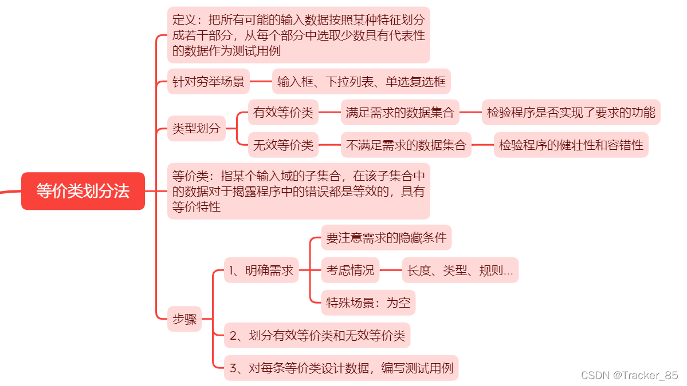

案例：QQ登录
1、明确需求：6~10位自然数，不能以0开头
2、划分等价类：

| 参数 | 说明 | 有效等价类 | 有效数据 | 无效等价类    | 无效数据    |
| ---- | ---- | ---------- | -------- | ------------- | ----------- |
| qq号 | 长度 | 6~8位      | 1234567  | 非6~8位，为空 | 12345，为空 |
| qq号 | 类型 | 自然数     | /        | 非自然数      | 123456A     |
| qq号 | 规则 | 不以0开头  | /        | 0开头         | 0123456     |

------

##### 边界值分析法

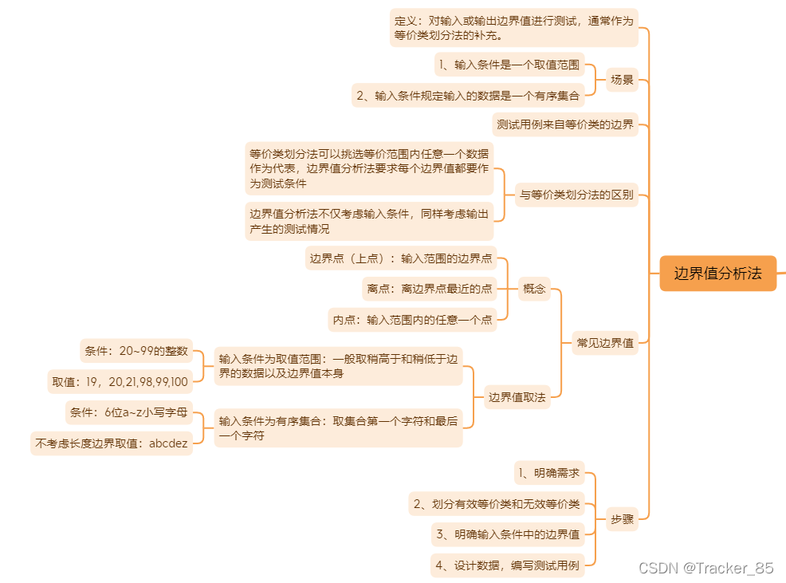

------

##### 因果图法

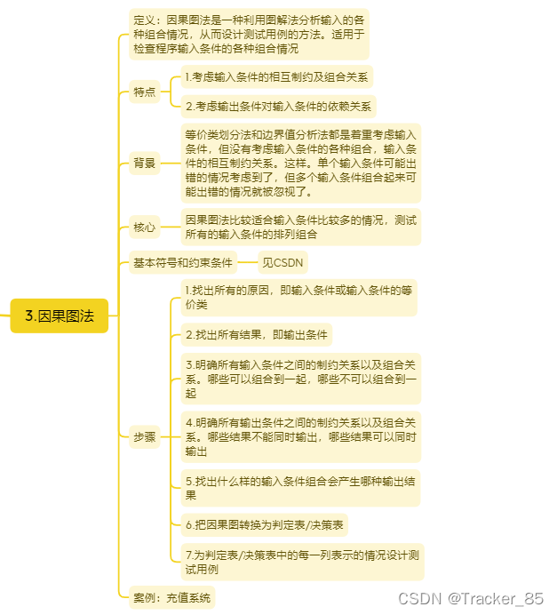

基本符号：通常在因果图中用Ci表示原因，用Ei表示结果，各节点表示状态，可取值‘0’或‘1’、0表示某状态不出现，1表示某种状态出现。

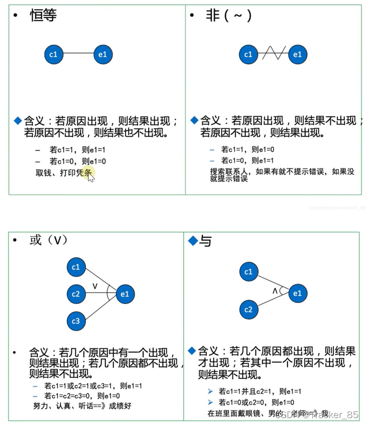

约束条件：

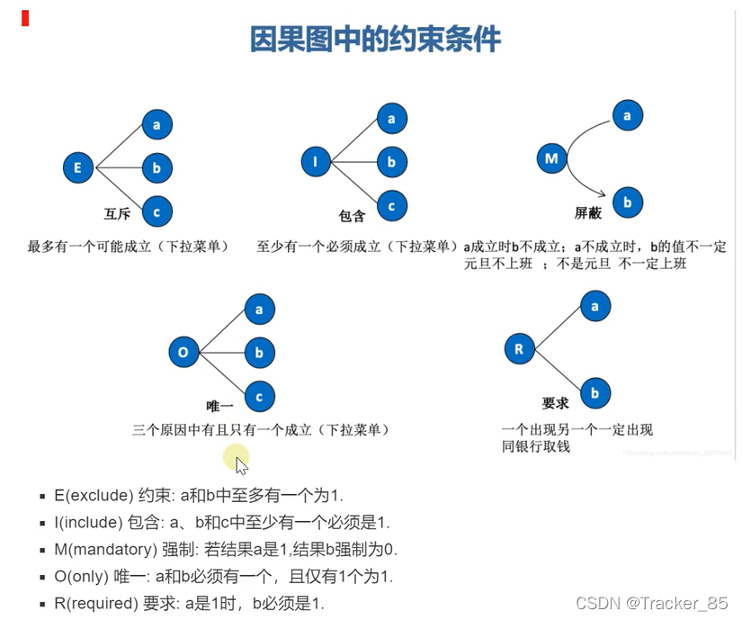

------

##### 判定表法

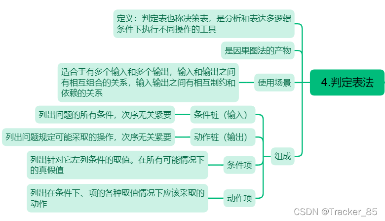

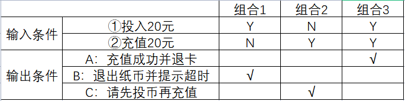

------

##### 正交表法

案例：
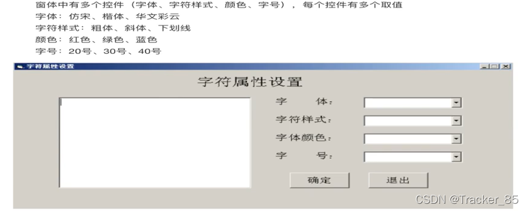
使用正交设计助手工具：
选择正交表，填写水平因素：

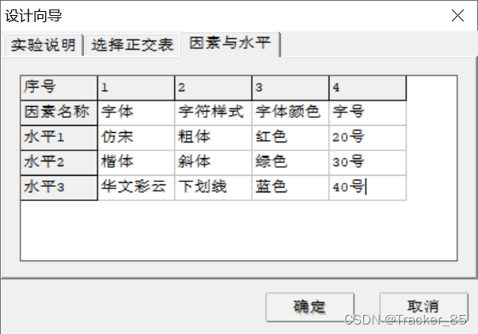

生成的正交表：

每一项实验就是一条测试用例。

------

##### 场景法

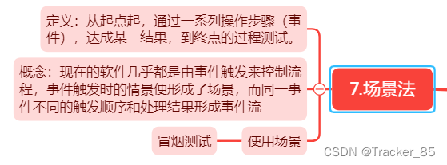

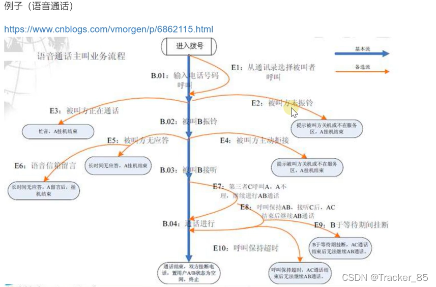

------

##### 错误推断法

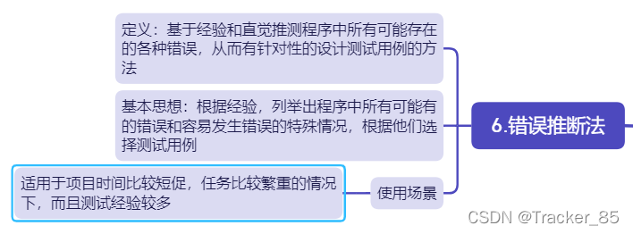

#### 冒烟测试

冒烟测试这个名称的来历，最初是从电路板测试得来的。因为当电路板做好以后，首先会加电测试，如果板子没有冒烟再进行其它测试，否则就必须重新来过。

**软件上的冒烟测试**

- 这种测试强调程序的主要功能进行的验证，而不会对具体功能进行更深入的测试。

-  冒烟测试是随着版本转测进行的，它应该是一个开关(判断版本能否转测试)，而不是一个研发流程中的测试阶段。
-  冒烟测试用例一般选取的是测试用例中level 0的用例，保证主功能可用。
- 冒烟测试就是在一个新版本出来的时候，将软件的全部功能过一遍，看有没有什么大问题。如果功能可以正常运行，不会影响测试进行，那么这个版本就可以真正开始测试了。如果功能有重大问题或影响测试进行，那么这个版本就是不合格的，不用进行进一步的测试。

**实现**

- 开展冒烟测试工作有助于尽早发现软件代码存在的问题，提高软件代码的质量和开发效率。
- 基于持续集成(Continuous Integration，CI)的冒烟测试采用自动化测试脚本进行测试工作，能够提高测试效率，减少测试人员大量的重复测试验证工作。
- 冒烟测试的最佳实践还是最好被自动化，在CI中每一个Build都自动的去执行主流程的测试，确保其是一个基本可用的版本。
- 冒烟测试可以手动执行，也可以自动化执行。稳定的系统适合自动化冒烟测试，集成过程中的系统适合手工冒烟测试，因为冒烟测试内容在动态变化，变化中的自动化脚本维护工作量比较大。

#### 回归测试

**什么是回归测试**

回归测试的英文名称：Regression Testing，从字面上看，是“倒退测试”。这就表明，软件有当前状态和原来状态之分。回归测试就是对软件的原来状态重新进行功能和非功能的测试，用以确保先前开发并测试过的软件在缺陷修复、配置改变、软件更新等等这些变化之后，仍能符合要求的运行（即：软件当前状态中那些没有被修改的部分的功能和非功能与原来状态保持一致）。

这里所说的软件当前状态和原来状态的概念，可以简单的认为，每一个当前提交测试的版本就是该软件的当前状态，上一个版本就是原来状态。或者，当前基线就是当前状态，上一次基线就是原来状态。具体如何区分，可以根据管理要求来制定。

**回归测试的时机**

不论是基于新产品的开发还是老产品的维护升级，回归测试都是一个完整测试必不可少的一部分。通常，需要进行回归测试的时机是：

1）缺陷修复

当开发人员完成对当前状态的软件进行缺陷修复之后，并且提交新的测试版本或进行了代码基线；

2）软件更新

开发人员完成新增功能和代码重构之后，并且提交测试版本或进行了代码基线。其中，新增功能往往对应于维护类的产品，对其要进行完整的测试，即对新功能的验证测试，以及回归测试。对于代码重构，应该本着运行质量永远高于代码质量的原则慎重对待，如果一旦决定重构，则必须进行全量回归测试；

3）配置改变

出于软件参数配置灵活性以及运维高效的需要，对配置文件、脚本、批处理命令、存储过程进行修改并正式通知测试部门之后。

**回归测试的技术**

回归测试的技术通常有以下三种：

1）全量测试用例重复测试

对当前状态的软件进行全部测试用例的执行和结果检查。这种技术由于进行的是全量测试用例的重新执行，能将缺陷遗漏的风险降至最低水平，但是测试成本（时间成本、人力成本、财务成本）很高；

2）选择部分测试用例重复测试

与上述不同的是，只对当前状态的软件进行部分测试用例的执行和检查。这种技术的最大好处是测试成本（时间成本、人力成本、财务成本）低于全量测试用例重复测试；

3）测试用例优化

测试用例的优化技术是指，从测试用例的范围即有效和效率角度出发，优化、提取对后续软件版本或特定版本有用的测试用例（集合）。

**全量回归测试策略**

在一些特殊行业，比如金融、通信行业，对生产环境中软件产品质量的要求通常是严重以上级别的逃逸缺陷是0，在此情况下，我们必须用安全系数最高、风险等级最低的策略进行回归测试，以达到质量要求。这时，我们可以采用全量测试策略，使用全量测试用例重复测试的技术进行回归测试。

全量回归测试策略可以适用任何情况，它是一种不是策略的策略，虽然有效，却不

高效。

**非全量回归测试策略**

实际工作中，测试用例会越来越多，工作量也会越来越大，特别是维护更新类的产品。当质量要求不变，又有上线时间以及其它条件制约时，我们会选择非全量回归测试策略，使用部分测试用例重复测试技术进行回归测试。这也是我们最常使用的策略。

这种策略的核心思想就是使用测试用例优化技术，提高测试效率，减少资源投入。

但是这种策略的漏测风险也是显而易见的，比如，测试人员对代码的相依性分析能力较弱，这很容易导致忽略了可能会发现缺陷的测试用例。为了规避这个风险，除了采用测试用例优化技术之外，还应该结合基于业务风险驱动的分析方法来进行。

总体上，测试人员需要通过与开发人员、业务人员的讨论，对被测试软件进行风险分析和操作分析，了解被测软件最重要、最频繁使用的功能，也就是了解被测试软件的业务关键度与故障可能性，然后根据这两个维度的风险分析结果采用相应的测试用例（集合）优化技术进行回归测试。

具体的，在测试行业里业务影响测试是一个公理，因此，要了解被测软件的业务关键度是首要任务。其次，软件及其中的模块都有故障可能性，这二者的相关指标及示例可以用以下二表所示：

表1：业务关键度指标与示例

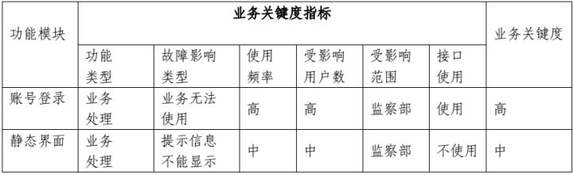

表2：故障可能性指标与示例

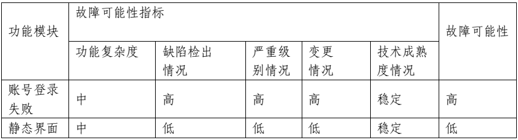

通过以上二表，结合业务关键度与故障可能性评估得出被测软件功能模型的风险等级，如下表所示：

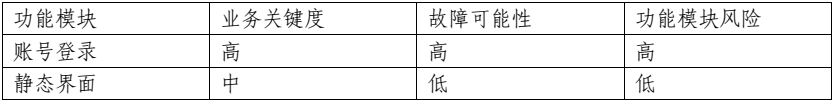

通过上表，为非全量回归测试策略中缩减测试用例集合，集中力量做最需要的测试，提供了依据，从而降低漏测风险。当然，不论表1还是表2，其中的等级划分需要测试人员的经验积累，也需要业务人员、开发人员的有力支持。

#### 常用自动化测试工具

自动化测试是指运行软件程序后,自动执行测试用例并在没有任何人为干预的情况下产生测试结果。 它比手动测试更优越的地方在于,很大程度上节省了人力和时间,并且在测试中没有或者少有错误。此外,还可以多次测试相同的应用程序,从而最大限度地减少冗余的手动工作。

##### Selenium

Selenium 是一个测试框架，用于跨各种浏览器和平台（如 Windows、Mac 和 Linux）执行 web 应用程序测试。Selenium 帮助测试人员使用各种编程语言编写测试程序，如 Java、PHP、C#、Python、Groovy、Ruby 和 Perl。它提供记录和回放功能，无需学习 Selenium IDE 即可编写。
值得一提的是，Selenium支持一些大型的、知名度高的浏览器供应商，这些供应商将 Selenium 作为浏览器的基础部分。Selenium 无疑是大多数其他软件测试工具的基础。

- 本身不是测试工具，只是模拟浏览器操作的工具
- 背后有 Google 维护源代码
- 支持全部主流的浏览器
- 支持主流的编程语言，包括：Java、Python、C#、PHP、Ruby、JavaScript等
- 工具很小，可以实现对测试项目的定制测试方案
- 基于标准的 WebDriver 语法规范

------

##### TestComplete

TestComplete 是一个功能测试平台，它提供各种解决方案，通过SmartBear 软件对桌面、网站和移动应用程序进行自动化测试。

TestComplete 提供以下功能：

- GUI测试
- 脚本语言支持 – JavaScript、Python、VBScript、JScript、DelphiScript、C++Script 和 C#Script
- 测试可视化工具
- 脚本测试
- 测试录制和回放

------

##### Katalon Studio

Katalon Studio 是由 Katalon LLC 开发的免费的自动化测试解决方案。该软件建立在开源自动化框架 Selenium 之上，Appium 具有用于 API、web 和移动测试的专用 IDE 接口，它还为这些类型的测试提供了丰富的功能集，并支持包括Windows，macOS和Linux在内的多个平台。该工具包含一整套强大的功能，可帮助克服 web UI 测试自动化中的常见挑战。

Katalon Studio 包含以下功能：

- 内置对象存储库、XPath、对象重识别
- 支持 JavaGroovy 脚本语言
- 内置基于图像的测试支持
- 支持 Jenkins 和 TeamCity 等持续集成工具
- 支持双编辑器界面
- 可定制的执行工作流程

